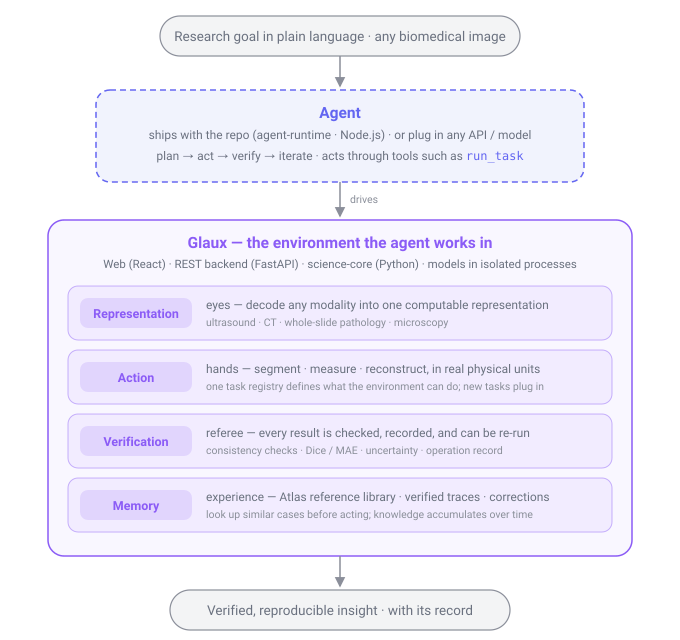

<h1 align="center">🦉 Glaux</h1>

<strong>Biomedical Image Insight Agents</strong>

  The agent-native environment for biomedical image insight — 
  bring an agent (yours or ours), describe a research goal in natural language, and turn 
  any biomedical image, in any modality, into verified, reproducible insight.

  <strong>English</strong> ·
  <a href="README.zh-CN.md">简体中文</a>

  
  
  
  

> **Glaux** (/ɡlaʊks/, from Greek **γλαύξ**, Athena's little owl) — the bird of wisdom that sees in the
> dark. That is what Glaux is for: seeing into the image.

---

## What is Glaux?

Glaux is the **agent-native environment for biomedical image insight** — the platform an agent runs *inside*
to turn any biomedical image, in any modality, into verified, reproducible insight. Bring your own agent
(configure your API / model) or use Glaux's reference agent; either way the agent is the engine, and Glaux
is the world it acts in.

That world is a **verified, modality-agnostic substrate**: decoders (what the agent sees), calibrated
segmentation & measurement (what it can *correctly* do), and verification & provenance (what makes the result
trustworthy science). A general-purpose agent has the reasoning; what it lacks — and a smarter model won't
hand it for free — is this environment. So **Glaux is not a wrapper over a model; it is the substrate that
makes any agent a rigorous biomedical image scientist**.

## Why Glaux?

Quantitative bioimage analysis today means stitching together ImageJ macros, CellProfiler pipelines, and
one-off scripts — powerful, but slow, brittle, and gated behind expertise. Our bet is not another
natural-language front door onto that mess — general-purpose agents will commoditize that. It is the
**environment** an agent needs to do the work well and be accountable for it: reasoning is the engine, but
reasoning without a verified, modality-aware world to act in accomplishes nothing. So the moat is the
substrate — decoders, calibrated measurement, verification and provenance — that a smarter model makes
*more* valuable, not less. Every result is reproducible and defensible in peer review, not a screenshot;
structure is structure, whether the pixels came from a microscope, an ultrasound probe, or a CT slice; and
the agent is yours to choose — bring your own API / model, or use Glaux's.

## Scope

Glaux owns the pipeline from **image → understanding → representation**. What you do with that
representation (decisions, planning, simulation) you build *on top of* Glaux — that boundary is deliberate.

| In scope | Deliberately out of scope |
| --- | --- |
| Natural-language-driven segmentation & measurement | **Production clinical diagnosis** (software-as-a-medical-device) |
| Morphometric / quantitative analysis | Real-time intra-operative decision support |
| Reconstruction & richer representations | Surgical planning / simulation as a core promise |
| Retrospective research on de-identified clinical data | |

Glaux is a **research** tool: IRB-governed, retrospective studies on de-identified data are in scope;
regulated clinical diagnosis (FDA / NMPA) is not. The line is **research insight, not clinical decision**.

## Architecture

  

- **Agent** — the engine, not the product. Bring your own (configure an API / model) or use Glaux's
  reference agent; it plans, acts, verifies, and iterates *inside* the environment below.
- **Web** — the workspace and natural-language layer; never touches raw pixels, orchestrates the agent.
- **science-core** — the stateless substrate the agent acts in: decode → represent, then segment · measure
  · reconstruct, with verification and provenance on every result. New modalities and segmenters plug in
  behind a narrow contract (a strategy registry), not a rewrite.

The moat is the environment, not the agent. The engine is being ported from a working
fluorescence-microscopy prototype; this repo is the clean restart.

## Status

**Pre-alpha · pre-research.** The direction here is a north star we are building toward, not a shipped
guarantee — we would rather say that honestly than oversell.

## Roadmap

**North star:** Biomedical Image Insight Agents — agents that deliver verified, reproducible insight across
modalities, built on assets that get *more* valuable as models improve.

1. **Vision & strategy** — positioning and moat (largely done; see the analysis below).
2. **Preliminary requirements** — target users, use cases, functional & non-functional scope.
3. **Technical architecture** — reusable core, agent orchestration, verified-artifact contract.
4. **Validate on 1–2 scenarios** — deliberately non-fluorescence: pathology (WSI) and ultrasound.

🔭 **Far horizon** — platform / MCP distribution, full-modality coverage, and eventually assistive decision
support (a long-term goal beyond today's research-only line).

The living roadmap and the strategy behind it live under [docs/roadmaps/](docs/roadmaps/) — current:
[Product Roadmap · 2026-07-05](docs/roadmaps/20260705-product-roadmap.zh-CN.md). The competitive and
positioning analysis that informs it lives under [docs/researches/](docs/researches/).

## Contributing

Contribution guidelines will land alongside the engineering standards. Early feedback and discussion are
welcome via issues.

## License

**TBD** — expected to be permissive (MIT or Apache-2.0), finalized before the first release.
