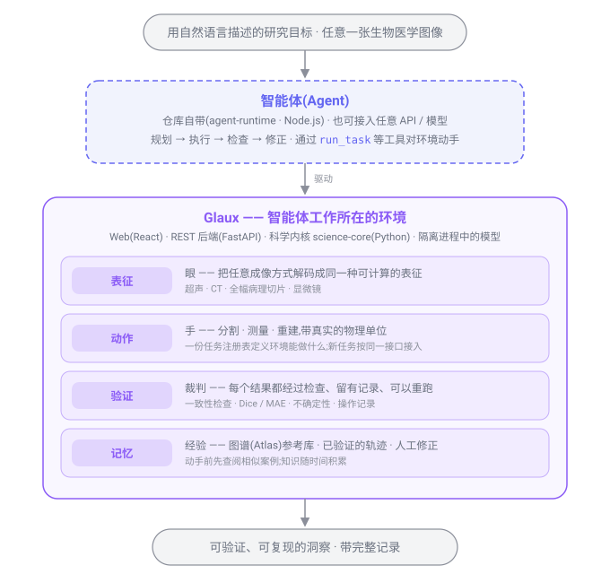

<h1 align="center">🦉 Glaux</h1>

<strong>Biomedical Image Insight Agents · 生物医学影像洞察智能体</strong>

  用自然语言描述一个研究目标, 
  把任意模态的生物医学图像,变成可验证、可复现的洞察。

  <a href="README.md">English</a> ·
  <strong>简体中文</strong>

  
  
  

> **Glaux**(读作 /ɡlaʊks/;源自希腊语 **γλαύξ**,雅典娜的小鸮)——在黑暗中也看得清的智慧之鸟。

---

## Glaux 是什么?

Glaux 是一个**懂生物医学影像的智能体,以及它工作所需的一整套环境**。打开就能用:你用自然语言说出研究
目标——比如"量一下这批超声图里颈动脉内膜的厚度"——智能体自己规划步骤、动手处理图像、检查结果、
反复修正,最后交给你一份可以核对、可以重跑的结果。

智能体本身负责思考,而环境负责让它做对:能正确读取显微镜、超声、CT 等各种来源的图像;测量带真实的
物理单位和校准;每一步都留下记录,结果随时可以复现。你也可以换上自己的模型作为智能体的大脑,
环境不变。

## 为什么是 Glaux?

再聪明的模型也不会天生知道怎么正确读一张病理切片、怎么把像素换算成微米、怎么证明结果没错——
Glaux 补上的正是这些。

- **环境是核心价值。** 图像读取、带校准的测量、结果核验与记录——模型越强,这套能力越有用,而不是越多余。
- **结果默认可核对、可复现。** 每个结论都能追溯到每一步操作、能重跑——经得起同行评审,不是一张截图。
- **不挑成像方式。** 显微镜、超声探头、CT 切片,只要是生物医学图像,处理思路一致。
- **内置图谱(Atlas)。** 你可以把教科书插图、文献图片或已标注的数据导入成参考图例;智能体动手前先查图谱,
  找相似案例照着做,而不是凭空猜测。
- **开箱即用。** 仓库自带一个智能体,装好就能用;想换成自己的模型也可以。

## 能力边界

Glaux 负责从**图像**到**理解**再到**可用的结果**这一段。拿结果去做进一步的决策、规划或模拟,
是在 Glaux 之上由用户自己完成——这条边界是刻意划的。

| 范围之内 | 刻意排除 |
| --- | --- |
| 用自然语言驱动的图像分割与测量 | **临床诊断产品**(受医疗器械监管的软件) |
| 形态与数量的定量分析 | 手术中的实时决策支持 |
| 三维重建等更丰富的表达 | 把手术规划 / 模拟作为核心承诺 |
| 在脱敏临床数据上做回顾性研究 | |

Glaux 是**科研**工具:经伦理审查、在脱敏数据上做的回顾性研究在范围之内;需要监管审批的临床诊断
(FDA / NMPA)不在范围之内。红线是:**科研洞察,而非临床决策。**

## 架构总览

  

本地运行时由三个进程组成(`make -j3 dev` 一键拉起),外加按需启动的隔离模型进程:

- **智能体(`agent-runtime/`,Node.js · Fastify · Pi Agent Core)** —— 负责思考和决策。仓库自带一个,
  也可以配置成你自己的 API / 模型;它规划、执行、检查、修正,通过工具(如 `run_task`)对环境动手。
  **它是唯一与模型对话的进程**,密钥只在这里。
- **Web 界面(`frontend/`,React · Vite · Cornerstone3D · OpenSeadragon)** —— 你和智能体对话、查看图像
  和结果的地方;不直接处理图像本身,而是把请求转给智能体和后端。
- **后端 + 科学内核(`backend/` FastAPI 薄壳 + `science-core/` Python)** —— 真正处理图像的部分:读取、
  分割、测量、重建,每个结果都带核验与操作记录。`science-core` 的任务注册表是"环境能做什么"的唯一
  清单,新的成像方式或算法按同一接口接入。
- **隔离模型(`models/`)** —— 重模型(如 TotalSegmentator、StarDist)在独立虚拟环境的子进程里跑,
  主进程不加载 PyTorch / TensorFlow。

环境的四层——表征(眼)、动作(手)、验证(裁判)、记忆(经验,含 Atlas 图谱)——就是图里从上到下的
四条。核心价值在环境,不在某个具体的智能体;更细的运行时拓扑与仓库结构见
[docs/architecture.zh-CN.md](docs/architecture.zh-CN.md)。

## 状态

**Pre-alpha · 预研究阶段。** 这里写的方向是我们正在建造的目标,目前还不是已交付的保证——与其过度承诺,
我们宁可如实这么说。

## 路线图

**北极星:** 生物医学影像洞察智能体——跨成像方式交付可核对、可复现的洞察,建立在"模型越强越值钱"的
能力之上。

1. **明确愿景、确定战略目标** —— 定位与核心价值(基本完成,见下方分析)
2. **设定初步需求清单** —— 目标用户、用例、功能与非功能范围
3. **设定 / 调研技术架构** —— 可复用核心、智能体编排、可核验的结果契约
4. **在 1–2 个场景上验证** —— 刻意选非荧光:病理切片(WSI)与超声图像

🔭 **远景(远期)** —— 平台化 / 对外分发、覆盖全部成像方式,以及远期的**辅助决策**(超出当前"研究非临床"
边界的长期目标)。

完整路线图与其背后的战略见 [docs/roadmaps/](docs/roadmaps/) —— 当前版本:
[产品路线图 · 2026-07-05](docs/roadmaps/20260705-product-roadmap.zh-CN.md)。为其提供依据的竞争与定位
分析见 [docs/researches/](docs/researches/)。

## 许可证

[Apache-2.0](LICENSE)
