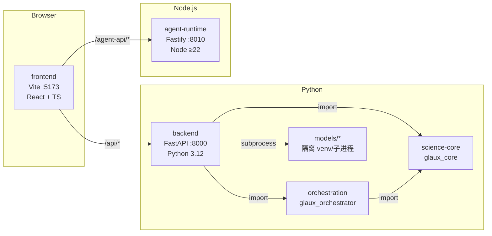
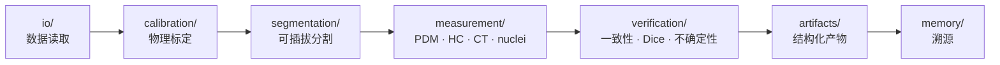

# Glaux 仓库骨架总览

> **用途**：第一次接触仓库时的导航地图——根目录每个文件/目录是什么、三进程怎么跑、技术栈怎么分布。
> **日期**：2026-08-16 · **状态**：living（活文档，随仓库结构演进更新）
> **半衰期提醒**：目录树和技术栈版本号会随开发推进过时；文档正文若与代码冲突，以代码为准。

---

## 运行时全景

Glaux 本地开发由三个进程组成，`make -j3 dev` 一键拉起：



前端 Vite 反向代理把 `/api` 转发到 backend :8000、`/agent-api` 转发到 agent-runtime :8010。
重模型（caroSegDeep / TotalSegmentator / HC-CSM / StarDist-HE）一律在隔离子进程中运行，
主 FastAPI 进程不 import TensorFlow/PyTorch。

---

## 仓库文件树

```
open-glaux/
├── README.md / README.zh-CN.md  # 项目介绍（英/中）：定位、架构图、开发快速上手、路线图指引
├── Makefile                     # 开发编排：install · dev · test · lint
├── .gitignore                   # 忽略模型权重、医学影像、node_modules、.glaux/ 等
├── .gitattributes               # 跨 WSL/Windows 强制 LF；标记二进制类型
│
├── frontend/                    # React + Vite IDE 前端（VS Code 风格影像标注工作台）
├── backend/                     # FastAPI 薄壳（REST 端点桥接到 science-core / orchestration / 隔离模型）
├── agent-runtime/               # 本地参考智能体运行时（Pi Agent Core · Fastify · SSE）
│
├── science-core/                # 无头科学内核（环境四层：表征 / 动作 / 验证 / 记忆）+ 任务注册表
├── orchestration/               # 意图层（退役中：注册表已迁出，余下按 P2/P3 迁出或删除）
├── models/                      # 隔离模型运行时资产（独立 venv，不被主进程 import）
│   └── hc_seg/                  #   胎儿头围分割 CSM（HuggingFace, Apache-2.0）
│
├── data/                        # 数据集存储（二进制 gitignore，仅跟踪 README）
│   ├── ct/                      #   CT NIfTI（P6 TotalSegmentator 楔子）
│   └── wsi/                     #   全幅病理切片（P7 StarDist-HE 楔子）
│
├── docs/                        # 文档区（详见 docs/README.md 命名规约）
│   ├── architecture.zh-CN.md    #   本文件：仓库骨架总览（活文档）
│   ├── requirements.zh-CN.md    #   需求清单（v0，活文档）
│   ├── roadmaps/                #   路线图（按日期存档）+ charter.zh-CN.md（纲领，活文档）
│   ├── researches/              #   产品 / 市场 / 技术 / 科研调研报告
│   ├── brainstorms/             #   单任务/特性的需求文档
│   ├── designs/                 #   架构与 UI 设计文档
│   ├── plans/                   #   实现计划
│   ├── sdd/                     #   规范驱动开发：Feature 边界、契约、状态机、验收
│   ├── runbooks/                #   操作手册
│   └── todo/                    #   代码评审记录
│
├── scripts/                     # 归档开发脚本（P4–P7 一次性脚本，仅历史参考）
├── assets/                      # 静态视觉素材（architecture.svg）
│
├── .glaux/                      # 本地智能体会话数据（SQLite，不入库）
├── .claude/                     # Claude Code 配置（launch.json，不入库）
└── .qoder/                      # Qoder 工具数据（不入库）
```

---

## 各组件详述

### `frontend/` — React + Vite IDE 前端

VS Code 风格的生物医学影像标注工作台。

| 关键点 | 说明 |
| --- | --- |
| 技术栈 | React 18, TypeScript 5, Vite 5, Zustand（状态）, Vitest + Testing Library |
| 影像库 | Cornerstone.js 3（DICOM/体积）, OpenSeadragon（WSI 深度缩放）, nifti-reader-js |
| 布局 | dockview-react（VS Code 面板拖拽）, Focus / Workbench 双模式 |
| 智能体面板 | SSE 实时对话，Markdown 渲染，会话管理 |
| 国际化 | 中/英双语（`src/i18n/`） |
| 安全 | 自定义 Vite 插件注入 CSP 头 |

### `backend/` — FastAPI 薄壳

将 REST 端点（`/interpret`, `/run`, `/measure`, `/segment` 等）桥接到 science-core / orchestration / 隔离模型。

| 关键点 | 说明 |
| --- | --- |
| 技术栈 | Python ≥ 3.10, FastAPI, Pydantic, uv, hatchling |
| 数据源 | CUBS 超声、HC18 胎儿超声、CT NIfTI、WSI 病理（可插拔注册表） |
| 分割 | 全部走隔离子进程（`segment_proc.py` / `segment_ts.py` / `segment_wsi.py`） |
| 测试 | pytest + httpx |

### `agent-runtime/` — 本地参考智能体运行时

基于 `@earendil-works/pi-agent-core` 的 Fastify 服务，托管参考智能体。

| 关键点 | 说明 |
| --- | --- |
| 技术栈 | Node.js ≥ 22.19, TypeScript, Fastify 5, Vitest |
| 核心能力 | Pi 模型运行时、会话管理（SQLite）、SSE 推送 |
| 安全 | 凭据/密钥脱敏（`security/redact.ts`） |

### `science-core/` — 无头科学内核

环境四层（表征 / 动作 / 验证 / 记忆）的纯计算引擎，不含 HTTP——被 backend 和 orchestration 调用。

| 关键点 | 说明 |
| --- | --- |
| 技术栈 | Python ≥ 3.11, numpy, Pillow, pandas；可选 scipy, tensorflow |
| 包名 | `glaux_core`（setuptools，Apache-2.0） |
| 任务注册表 | `glaux_core/tasks.py`：`TaskType` / `TaskSpec` / `REGISTRY`——"环境能做什么"的单一事实源，backend 端点、前端渲染、agent 工具都只读它 |
| 评测 | `eval/` 通用框架 + HC Bland-Altman/MAE/Dice 专项 |
| 无头脚本 | `runners/` 下的 TotalSegmentator 和 WSI 无头运行器 |

science-core 内部数据流：



### `orchestration/` — 意图层（**退役中**）

把自然语言（+ 图像）翻译成结构化 `TaskSpec`。
三态守卫：`in_scope`（执行）/ `ambiguous`（澄清）/ `out_of_scope`（拒绝）。

> ⚠ 该目录早于 agent-runtime 建立，职责与参考智能体重叠。按
> [退役设计](designs/2026-08-16-001-retire-orchestration.zh-CN.md) 三步拆除：
> **P1 已完成（2026-08-16）**——任务注册表已迁入 `glaux_core/tasks.py`，此处只剩兼容重导出；
> **P2** 模型连接探测（`vlm_providers.py`）迁入 agent-runtime；**P3** 意图解析交还 agent，目录删除。

| 关键点 | 说明 |
| --- | --- |
| 包名 | `glaux_orchestrator` |
| 意图解析 | 规则 + Claude VLM 双后端（`intent.py`） |
| VLM 集成 | `vlm_providers.py`（Anthropic Claude SDK） |

### `models/` — 隔离模型运行时

重 ML 模型的源码和部署说明，运行在独立 venv/子进程中，不被主进程 import。

| 子目录 | 内容 |
| --- | --- |
| `hc_seg/` | 胎儿头围分割（CSM, HuggingFace, Apache-2.0），含无头推理 + 验证脚本（MAE 1.13mm, Dice 0.982） |

### `data/` — 数据集存储（不入库）

二进制文件 gitignore，仅跟踪 README。

| 子目录 | 内容 |
| --- | --- |
| `ct/` | CT NIfTI 体积（P6 TotalSegmentator 楔子演示数据） |
| `wsi/` | 全幅病理切片（P7 StarDist-HE 楔子数据） |

### `scripts/` — 归档开发脚本

P4–P7 迭代期间的一次性脚本（含机器绑定路径），仅保留做历史参考。
可复现步骤已迁至 `docs/runbooks/`。
