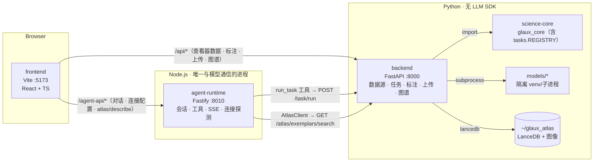
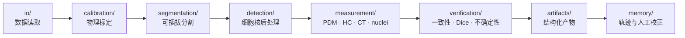

# Glaux 仓库骨架总览

> 第一次接触仓库时的导航地图：每个目录是什么、进程怎么跑、技术栈怎么分布。与代码冲突时以代码为准。

---

## 运行时与部署形态

### 本地开发（完整版）

三个进程，`make -j3 dev` 一次拉起：



Vite 开发代理：`/api` 转发到 backend（默认 :8000，`GLAUX_BACKEND_PORT` 可改）并去掉 `/api` 前缀；`/agent-api` 转发到 agent-runtime :8010，不改路径。

### Docker 发行包（对话预览版）

`compose.yaml` 两个服务，规范见 [SDD 09](sdd/feats/09-chat-distribution/README.md)，使用见 [安装、运行与分发手册](runbooks/chat-distribution.md)：

| 服务 | 镜像 stage | 说明 |
| --- | --- | --- |
| `agent` | `docker/Dockerfile` 的 `agent` | Node 运行时，`GLAUX_EDITION=chat`、`GLAUX_AGENT_HOST=0.0.0.0`，会话存具名卷 `conversations:/data`，不对宿主暴露端口 |
| `web` | 同文件的 `web` | nginx 提供静态前端，`/agent-api/` 反代到 agent，`/api/` 一律 404；宿主只映射 `127.0.0.1:${GLAUX_PORT:-5173}` |

发行包不含 Python 后端、science-core 与专用模型。

### 发行模式开关

`VITE_GLAUX_EDITION`（前端）和 `GLAUX_EDITION`（agent-runtime）取 `full` 或 `chat`，**缺省 full**，无效值直接抛错。

- `full`：Focus / Workbench 双模式、舞台、图谱、领域工具全开。
- `chat`：只保留对话界面；不注册任何领域工具，改用对话提示词，不请求 Python 后端。Docker 镜像与 `compose.yaml` 显式设置。

### 三条不变量

- **只有 agent-runtime 与模型通信**：backend / science-core 不含 LLM SDK、不持密钥。
- **`glaux_core.tasks.REGISTRY` 是能力清单单一事实源**：backend 端点、前端渲染、智能体工具都只读它。
- **前端只有一条对话路径**：经 agent-runtime 会话。

重模型（caroSegDeep、TotalSegmentator、HC-CSM、StarDist-HE）一律在隔离子进程中运行，主 FastAPI 进程不 import TensorFlow/PyTorch。

---

## 仓库文件树

```
open-glaux/
├── README.md / README.zh-CN.md  # 项目介绍（英/中）：定位、领域、当前版本、快速开始
├── AGENTS.md / CLAUDE.md        # 编码智能体入口：先读顺序与文档规则（CLAUDE.md 只引入 AGENTS.md）
├── Makefile                     # 开发编排：install · dev · test · lint · version
├── VERSION / CHANGELOG.md       # 产品版本与发布记录（SDD 01 版本治理）
├── LICENSE                      # Apache-2.0
├── compose.yaml                 # 对话预览版部署（agent + web 两个服务）
├── .dockerignore                # 镜像构建上下文白名单
├── .gitignore / .gitattributes  # 忽略权重与医学影像；跨 WSL/Windows 强制 LF
│
├── frontend/                    # React + Vite 前端：Focus（对话）/ Workbench（工作台）双模式，按 edition 裁剪
├── agent-runtime/               # 参考智能体运行时（Pi Agent Core · Fastify · SSE · 工具 · 连接探测）
├── backend/                     # FastAPI 薄壳：数据源、任务、标注、上传、图谱；无 LLM SDK
├── science-core/                # 无头科学内核：读取、标定、分割、检测、测量、验证、产物、记忆 + 任务注册表
│
├── docker/                      # 发行镜像构建：Dockerfile（四个 stage）、compose.build.yaml、nginx.conf
├── scripts/
│   ├── dev/                     #   本地联调脚本（run-backend、restart-backend、run-agent-runtime、health）+ 归档的一次性脚本
│   ├── release/                 #   发行打包 package.py 与 launcher/（start·stop 的 sh/cmd/command）
│   ├── version_matrix.py        #   版本矩阵检查（SDD 01）
│   └── test_version_matrix.py   #   上述检查的用例（make test-version）
│
├── models/                      # 隔离模型运行时资产（独立 venv，不被主进程 import）
│   └── hc_seg/                  #   胎儿头围分割 CSM（HuggingFace, Apache-2.0）
│
├── data/                        # 数据集存储（二进制 gitignore，仅跟踪 README 与自然图像示例）
│   ├── ct/                      #   CT NIfTI（TotalSegmentator）
│   ├── natural/                 #   自然图像示例 4 张（SDD 07，入库）
│   └── wsi/                     #   全幅病理切片（StarDist-HE）
│
└── docs/                        # 文档区（类型、状态与命名规约见 docs/README.md）
    ├── architecture.zh-CN.md    #   本文件
    ├── roadmaps/charter.zh-CN.md #  纲领：定位、领域、边界、环境四要素
    ├── sdd/                     #   规范驱动开发：Feature 契约、验收、决策
    ├── runbooks/                #   操作手册
    ├── landing/                 #   产品门户首页
    ├── researches/ brainstorms/ designs/ plans/ todo/  # 以记录为主（不带日期的设计是活文档，见 docs/README.md）
    └── requirements.zh-CN.md    #   v0 需求清单（已被纲领取代，仅供追溯）
```

`.glaux/`（本地会话 SQLite）、`dist/`（`scripts/release/package.py` 输出的发行包 zip）、`.qoder/`（工具生成的知识库，非事实来源）不入库；`.claude/` 只忽略 `launch.json`。

---

## 各组件详述

### `frontend/` — React + Vite 前端

图像与视频分析的前端：与智能体对话、查看图像、核对每一步结果。

| 关键点 | 说明 |
| --- | --- |
| 技术栈 | React 18, TypeScript 5, Vite 5, Zustand（状态）, Vitest + Testing Library |
| 图像库 | Cornerstone.js 3（体积/标注）, OpenSeadragon（WSI 深度缩放）, nifti-reader-js |
| 布局 | dockview-react（面板拖拽）；`App.tsx` 按 `edition.ts` 在 `ChatShell`（chat）与 `ResearchApp`（full）之间二选一 |
| 状态（`store/session.ts`） | 唯一观测焦点 `focus: Focus \| null`（`object_id` / `kind` / `index` / `region`），只经 `setFocus` / `setIndex` / `setRegion` 写入；对象表 `objects: Record<modality, ObjectMeta[]>`（缺键 = 未加载，空数组 = 已加载为空）；`activeObject(s)` / `objectsOf(s, m)` 派生。`modality`、`activeModel` 初始为 `null`（SDD 10） |
| 数据动作（`data/actions.ts`） | `loadObjects(modality, {open?})` 载对象表；`openObject(id, modality?)` 设焦点，按 `TaskView.trigger ?? "manual"` 决定是否自动跑，无 `TaskView` 的模态不调 `/task/run`；`runTask(region?)` 以对象 `calibration` 与 `region` 调 `/task/run`。切模态清空焦点、叠加、工具与工具参数，活动模型随模态重选 |
| 查看器 | `components/Viewer.tsx` 是引擎的 store 装配入口，按 `ObjectMeta.kind` 查 `ENGINES`：`image` / `volume` / `video` → 共用 `viewer/FrameStackViewer`（CS3D，`z/t` 由 `FrameAxis` 驱动），`slide` → `viewer/PyramidViewer`（OpenSeadragon 原生标注叠加层）；两引擎经 `ViewerProps` 接收帧源、轴、能力位、画笔写入与叠加数据。video 的时间轴由 `timeline` 能力位装配，标注按 `index.t` 回显；缺键显示空态，不读 `TaskView.viewer` |
| 模态标签 | 取 `/datasources` 元素的 `label_key`（i18n `modality.<m>`）→ `label` → modality 原文（`i18n/modalityLabel.ts`）；切换器可见性取有 active 数据源的模态 |
| 智能体面板 | SSE 实时对话，Markdown 渲染，会话管理；`components/agent/AtlasRefCard` 渲染"参考图谱 N 条" |
| 图谱（Atlas） | `components/atlas/`：列表 / 详情 / 导入向导（PDF · 网页 · 手动上传，ROI 框选，外发协议勾选）；描述生成走 runtime `/atlas/describe`，凭据不经 backend（SDD 03） |
| 国际化 | 中/英双语（`src/i18n/`） |
| 安全 | 自定义 Vite 插件向 index.html 注入 CSP meta（开发放行 HMR 所需 inline，生产收紧 script-src 'self'） |

### `agent-runtime/` — 参考智能体运行时

基于 `@earendil-works/pi-agent-core` 的 Fastify 服务，是唯一与模型通信的进程。

| 关键点 | 说明 |
| --- | --- |
| 技术栈 | Node.js ≥ 22.19（镜像用 node:24）, TypeScript, Fastify 5, Vitest |
| 端点 | `/agent-api/v1/health`；会话 CRUD 与命令/SSE；`connection/test\|models`；`atlas/describe` |
| 源码分区 | `transport/`（路由、SSE broker）、`pi/`（harness、工具、vision）、`observation/`（统一取帧与坐标换算）、`atlas/`、`annotation/`、`security/`、`storage/` |
| 连接探测 | 测试连通、列模型、标注视觉能力（`pi/connection-probe.ts`） |
| 安全 | 凭据脱敏（`security/redact.ts`）；出站 SSRF 守卫（`security/net-guard.ts`，backend 另有同规则实现） |

工具由 `pi/harness-registry.ts` 的 `TOOL_PROVIDERS` 装配；取图经 `observation/fetchObservation` 读取 `/objects/{id}/frame` 与 `X-Glaux-Frame`。chat 模式或 `observe` 权限下一律不挂载：

| 工具 | 作用 | 额外挂载条件 |
| --- | --- | --- |
| `run_task` | 调 backend `/task/run` 执行注册表任务，结果写回查看器 | 无；命中任务注册表能力时的调用路径（SDD 02 §7.2），长期保留，不被标注工具取代 |
| `view_current_image` | 把当前焦点帧交给模型 | 有焦点且连接支持视觉 |
| `consult_atlas` | 只读检索图谱案例，返回图块与摘要 | 连接支持视觉 |
| `locate_roi` | 按描述定位对象像素矩形区域，可带图谱先验 | 有焦点且连接支持视觉 |
| `segment_region` | 调外部分割后端取 mask，runtime 侧转对象像素多边形 | 有焦点、`GLAUX_ANNOT_ALLOW_EGRESS` 放行且 `GLAUX_SEG_API_TOKEN` 非空 |
| `propose_annotation` | 按当前焦点索引写建议态标注（`status=suggested`），等人工确认 | 有焦点 |

### `backend/` — FastAPI 薄壳

把 REST 端点桥接到 science-core 与隔离模型：既是前端查看器的数据面，也是 `run_task` 的执行面。

| 关键点 | 说明 |
| --- | --- |
| 技术栈 | Python ≥ 3.12, FastAPI, Pydantic, uv；**不含任何 LLM SDK** |
| 路由 | 六组：数据源与查看器数据、任务执行与测量、能力清单、标注（SDD 04）、上传（SDD 08）、图谱（SDD 03）。端点清单以 `backend/app/routers/` 和运行时的 `/docs` 为准 |
| 数据源 | 运行时注册表（`datasource_registry.py`）：`GLAUX_DEV_MODE=1` 为开发者模式（内置源实时视图 + `synthetic-us` / `synthetic-hc` 合成源），缺省 0 为产品模式（只有导入源）；`resolve_object` 是对象 id 的唯一解析入口，未知 id 一律 404 |
| 动作轴 | `detectors/`：`Detector` 协议与 `DETECTORS` 表（键 `TaskPlugin.adapter_kind`：`wall_pair` / `contour` / `volume` / `wsi`），各实现只取数与调模型；`kernel.run_task` 持有公共前缀（解析对象 → `object_kinds` 门控 → `available()` → 选区类型 → 标定）与信封组装 |
| 表征面 | `routers/objects.py`：`GET /objects/{id}`、`/frame`（带 `X-Glaux-Frame` 参考帧头）、`/raw`、`/tiles/{level}/{col}/{row}`、`POST /objects/{id}/edits`；任务结果字节面保留 `/volume/{id}/labelmap` 与 `/wsi/{id}/verify`（SDD 10 §5.3） |
| 数据轴 | `sources/`：`Source` 协议、`SourceBase` 与 `SOURCES` 表（键 modality，SDD 10）。每个模态的 `Source` 写在对应数据模块末尾：`dataset.py`（颈动脉）、`hc_dataset.py`、`dataset_ct.py`、`dataset_wsi.py`、`dataset_natural.py`、`dataset_video.py`（PyAV 可选依赖，缺库时 video 不可用） |
| 分割 | 全部走隔离子进程（`segment_proc.py` / `segment_ts.py` / `segment_wsi.py`） |
| 图谱（Atlas） | `app/atlas/`：LanceDB 案例表（JSON 列 + ngram FTS）与 sha256 寻址图像目录（`GLAUX_ATLAS_ROOT`，默认 `~/glaux_atlas`）；PyMuPDF / httpx+bs4 抽图；`python -m app.atlas.cli import-dataset` 批量导入 COCO/YOLO/LabelMe |
| 测试 | pytest + httpx |

### `science-core/` — 无头科学内核

纯计算实现，不含 HTTP，被 backend import。

| 关键点 | 说明 |
| --- | --- |
| 技术栈 | Python ≥ 3.11, numpy, Pillow, pandas；可选 scipy, tensorflow |
| 包名 | `glaux_core`（setuptools，Apache-2.0） |
| 任务注册表 | `glaux_core/tasks.py`：`TaskType` / `TaskPlugin` / `REGISTRY`——"环境能做什么"的单一事实源 |
| 评测 | `eval/` 通用框架 + HC Bland-Altman/MAE/Dice 专项 |
| 无头脚本 | `runners/` 下的 TotalSegmentator 与 WSI 无头运行器 |

内部数据流：



### `models/` — 隔离模型运行时

重模型的源码与部署说明，运行在独立 venv/子进程中。

| 子目录 | 内容 |
| --- | --- |
| `hc_seg/` | 胎儿头围分割（CSM, HuggingFace, Apache-2.0），含无头推理与验证脚本（MAE 1.13 mm, Dice 0.982） |

### `data/` — 数据集存储

医学影像二进制 gitignore，仅跟踪 README；自然图像示例入库。

| 子目录 | 内容 |
| --- | --- |
| `ct/` | CT NIfTI 体积（TotalSegmentator 演示数据） |
| `natural/` | 自然图像示例 4 张 JPEG（SDD 07，逐张记录来源与许可） |
| `wsi/` | 全幅病理切片（StarDist-HE 数据） |

### `scripts/` — 开发与发行脚本

| 位置 | 内容 |
| --- | --- |
| `dev/` | 本地联调脚本（起后端、重启后端、起运行时、健康检查），以及归档的一次性脚本；写死 WSL 路径 |
| `release/` | `package.py` 生成无源码启动包；`launcher/` 下 start/stop 的 sh、cmd、command 各一份，随包分发 |
| `version_matrix.py` | 校验根 `VERSION` 与四个组件版本一致（`make version-check`） |

### 版本治理

根 `VERSION` 与 frontend、agent-runtime、backend、science-core 四个组件版本各自声明，当前均为 0.2.0；五份 CHANGELOG 记录变化。规则见 [SDD 01](sdd/01-version-release-governance.md)，机器校验是 `scripts/version_matrix.py`。
