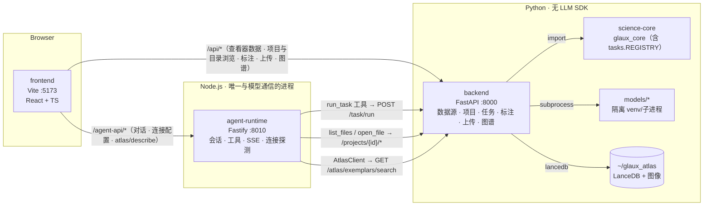
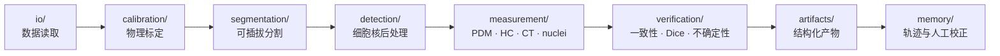

# Glaux 仓库骨架总览

> 第一次接触仓库时的导航地图：每个目录是什么、进程怎么跑、技术栈怎么分布。与代码冲突时以代码为准。

---

## 运行时与部署形态

### 本地开发（完整版）

三个进程，`make -j3 dev` 一次拉起：


```mermaid
graph LR
    subgraph Browser
        FE["frontend<br/>Vite :5173<br/>React + TS"]
    end

    subgraph "Node.js · 唯一与模型通信的进程"
        AR["agent-runtime<br/>Fastify :8010<br/>会话 · 工具 · SSE · 连接探测"]
    end

    subgraph "Python · 无 LLM SDK"
        BE["backend<br/>FastAPI :8000<br/>数据源 · 项目 · 任务 · 标注 · 上传 · 图谱"]
        SC["science-core<br/>glaux_core（含 tasks.REGISTRY）"]
        MD["models/*<br/>隔离 venv/子进程"]
        AT[("~/glaux_atlas<br/>LanceDB + 图像")]
    end

    FE -- "/agent-api/*（对话 · 连接配置 · atlas/describe）" --> AR
    FE -- "/api/*（查看器数据 · 项目与目录浏览 · 标注 · 上传 · 图谱）" --> BE
    AR -- "run_task 工具 → POST /task/run" --> BE
    AR -- "list_files / open_file → /projects/{id}/*" --> BE
    AR -- "AtlasClient → GET /atlas/exemplars/search" --> BE
    BE -- "lancedb" --> AT
    BE -- "import" --> SC
    BE -- "subprocess" --> MD
```

Vite 开发代理：`/api` 转发到 backend（默认 :8000，`GLAUX_BACKEND_PORT` 可改）并去掉 `/api` 前缀，开启 `xfwd` 附带 `X-Forwarded-For`，供 backend 的回环守卫识别原始来源；`/agent-api` 转发到 agent-runtime（默认 :8010，`GLAUX_AGENT_PORT` 可改，与 runtime 共用同一变量），不改路径。

### Docker 发行包（对话预览版）

`compose.yaml` 两个服务，规范见 [SDD 09](sdd/feats/09-chat-distribution/README.md)，使用见 [安装、运行与分发手册](runbooks/chat-distribution.md)：

| 服务 | 镜像 stage | 说明 |
| --- | --- | --- |
| `agent` | `docker/Dockerfile` 的 `agent` | Node 运行时，`GLAUX_EDITION=chat`、`GLAUX_AGENT_HOST=0.0.0.0`，会话存具名卷 `conversations:/data`，不对宿主暴露端口 |
| `web` | 同文件的 `web` | nginx 提供静态前端，`/agent-api/` 反代到 agent，`/api/` 一律 404；宿主只映射 `127.0.0.1:${GLAUX_PORT:-5173}` |

发行包不含 Python 后端、science-core 与专用模型。

### 发行模式开关

`VITE_GLAUX_EDITION`（前端）和 `GLAUX_EDITION`（agent-runtime）取 `full` 或 `chat`，**缺省 full**，无效值直接抛错。

- `full`：Focus、舞台、图谱、领域工具全开；Workbench 入口另由下方开关控制。
- `chat`：只保留对话界面；不注册任何领域工具，改用对话提示词，不请求 Python 后端。Docker 镜像与 `compose.yaml` 显式设置。

`VITE_GLAUX_WORKBENCH`（前端）取 `0` 或 `1`，**缺省 0**，无效值直接抛错。`1` 时 full 发行版在顶栏显示 Focus ⇄ Workbench 切换并启用 `Ctrl/Cmd+Shift+M`；`0` 时界面恒为 Focus。chat 发行版忽略此开关。

### 三条不变量

- **只有 agent-runtime 与模型通信**：backend / science-core 不含 LLM SDK、不持密钥。
- **`glaux_core.tasks.REGISTRY` 是标定能力的唯一来源**：backend 端点、前端渲染、`run_task` 都只读它。智能体在完全自治下可用 `bash` 做注册表之外的计算，结果一律视为非标定结果，不进 `run_task` 的结果通道与查看器读数（SDD 16 D-9）。
- **前端只有一条对话路径**：经 agent-runtime 会话。

重模型（caroSegDeep、TotalSegmentator、HC-CSM、StarDist-HE）一律在隔离子进程中运行，主 FastAPI 进程不 import TensorFlow/PyTorch。

---

## 仓库文件树

```
open-glaux/
├── README.md / README.zh-CN.md  # 项目介绍（英/中）：定位、领域、当前版本、快速开始
├── AGENTS.md / CLAUDE.md        # 编码智能体入口：先读顺序与文档规则（CLAUDE.md 只引入 AGENTS.md）
├── Makefile                     # 开发编排：install · dev · test · lint · version
├── VERSION / CHANGELOG.md       # 产品版本与发布记录（SDD 01 版本治理）
├── LICENSE                      # Apache-2.0
├── compose.yaml                 # 对话预览版部署（agent + web 两个服务）
├── .dockerignore                # 镜像构建上下文白名单
├── .gitignore / .gitattributes  # 忽略权重与医学影像；跨 WSL/Windows 强制 LF
│
├── frontend/                    # React + Vite 前端：Focus（对话）/ Workbench（工作台）双模式，按 edition 裁剪
├── agent-runtime/               # 参考智能体运行时（Pi Agent Core · Fastify · SSE · 工具 · 连接探测）
├── backend/                     # FastAPI 薄壳：数据源、任务、标注、上传、图谱；无 LLM SDK
├── science-core/                # 无头科学内核：读取、标定、分割、检测、测量、验证、产物、记忆 + 任务注册表
│
├── docker/                      # 发行镜像构建：Dockerfile（四个 stage）、compose.build.yaml、nginx.conf
├── scripts/
│   ├── dev/                     #   本地联调脚本（run-backend、restart-backend、run-agent-runtime、health）+ 归档的一次性脚本
│   ├── eval/                    #   视频评测数据准备（TennisTV 下载与切片）
│   ├── release/                 #   发行打包 package.py 与 launcher/（start·stop 的 sh/cmd/command）
│   ├── version_matrix.py        #   版本矩阵检查（SDD 01）
│   └── test_version_matrix.py   #   上述检查的用例（make test-version）
│
├── models/                      # 隔离模型运行时资产（独立 venv，不被主进程 import）
│   └── hc_seg/                  #   胎儿头围分割 CSM（HuggingFace, Apache-2.0）
│
├── data/                        # 数据集存储（二进制 gitignore，仅跟踪 README 与自然图像示例）
│   ├── ct/                      #   CT NIfTI（TotalSegmentator）
│   ├── eval/                    #   视频评测数据（本机使用，不入库）
│   ├── natural/                 #   自然图像示例 4 张（SDD 07，入库）
│   └── wsi/                     #   全幅病理切片（StarDist-HE）
│
└── docs/                        # 文档区（类型、状态与命名规约见 docs/README.md）
    ├── architecture.zh-CN.md    #   本文件
    ├── roadmaps/charter.zh-CN.md #  纲领：定位、领域、边界、环境四要素
    ├── sdd/                     #   规范驱动开发：Feature 契约、验收、决策
    ├── runbooks/                #   操作手册
    ├── landing/                 #   产品门户首页
    ├── researches/ brainstorms/ designs/ plans/ todo/  # 以记录为主（不带日期的设计是活文档，见 docs/README.md）
    └── requirements.zh-CN.md    #   v0 需求清单（已被纲领取代，仅供追溯）
```

`.glaux/`（本地会话 SQLite）、`dist/`（`scripts/release/package.py` 输出的发行包 zip）、`.qoder/`（工具生成的知识库，非事实来源）不入库；`.claude/` 只忽略 `launch.json`。

---

## 各组件详述

### `frontend/` — React + Vite 前端

图像与视频分析的前端：与智能体对话、查看图像、核对每一步结果。

| 关键点 | 说明 |
| --- | --- |
| 技术栈 | React 18, TypeScript 5, Vite 5, Zustand（状态）, Vitest + Testing Library |
| 图像库 | Cornerstone.js 3（体积/标注）, OpenSeadragon（WSI 深度缩放）, nifti-reader-js |
| 布局 | dockview-react（面板拖拽）；`App.tsx` 按 `edition.ts` 在 `ChatShell`（chat）与 `ResearchApp`（full）之间二选一 |
| 状态（`store/session.ts`） | 唯一观测焦点 `focus: Focus \| null`（`object_id` / `kind` / `index` / `region`），只经 `setFocus` / `setIndex` / `setRegion` 写入；对象表 `objects: Record<modality, ObjectMeta[]>`（缺键 = 未加载，空数组 = 已加载为空）；`activeObject(s)` / `objectsOf(s, m)` 派生。`modality`、`activeModel` 初始为 `null`（SDD 10） |
| 数据动作（`data/actions.ts`） | `loadObjects(modality, {open?})` 载对象表；`openObject(id, modality?)` 设焦点，按 `TaskView.trigger ?? "manual"` 决定是否自动跑，无 `TaskView` 的模态不调 `/task/run`；`runTask(region?)` 以对象 `calibration` 与 `region` 调 `/task/run`。切模态清空焦点、叠加、工具与工具参数，活动模型随模态重选。`openProjectFile(projectId, path)` 经 `POST /projects/{id}/objects` 按需登记，把返回的对象并入对象表（未加载才整表拉取、新登记数据源才刷新数据源、连点只让最后一次设焦点）后走 `openObject`；`uploadImages` 带当前会话的 `project_id`；`openProjectDocument(path)` / `closeDocument()` 写会话级 `document`（SDD 14），不改焦点，设置新的非空焦点或用户打开对象时 `document` 置空 |
| 查看器 | `components/Viewer.tsx` 是引擎的 store 装配入口，按 `ObjectMeta.kind` 查 `ENGINES`：`image` / `volume` / `video` → 共用 `viewer/FrameStackViewer`（CS3D，`z/t` 由 `FrameAxis` 驱动），`slide` → `viewer/PyramidViewer`（OpenSeadragon 原生标注叠加层）；两引擎经 `ViewerProps` 接收帧源、轴、能力位、画笔写入与叠加数据，只渲染画布与画布内几何。编辑区（工具条与读数条）由 `viewer/editorChrome.ts` 的 `useEditorChrome` 装配为模式、视图、动作、读数四类（SDD 04 §7.5）：模式工具的标签与键位在 `viewer/toolCatalog.ts`，按能力位启用；窗宽窗位与 z / t 帧轴滑块由对象 `kind` / `axes` 推导；「重新运行」「复现验证」来自 `TaskView.actions` 与 `viewer/actionCatalog.ts`。video 标注按 `index.t` 回显；缺键显示空态，不读 `TaskView.viewer` |
| 模态标签 | 取 `/datasources` 元素的 `label_key`（i18n `modality.<m>`）→ `label` → modality 原文（`i18n/modalityLabel.ts`）；切换器可见性取有 active 数据源的模态 |
| 会话工作区（`store/sessionWorkspaces.ts`） | 按 `session_id` 各存一份 `modality`、`focus`、任务结果（`metrics` / `primitives` / `source` / `modelVersion`）、`activeModel` 与输入草稿、附件、视频；`agentSessions.select` 切换时换出当前、换入目标，组件仍只读 `useSession`。后台会话的 `tool.end` 只写该会话快照并置未读，未读只存内存。localStorage `glaux.sessionWorkspace.v1` 只持久化 `{modality, focus}`（SDD 13 §9.6） |
| 项目（`store/projects.ts`） | 缓存 `GET /projects` 列表；localStorage `glaux.projects.known.v1` 记住见过的项目名与路径（项目移除后组头仍显示原名、可按原路径重新打开），`glaux.projects.collapsed.v1` 存组头折叠状态 |
| 智能体面板 | SSE 实时对话，Markdown 渲染，会话管理；`components/agent/InteractionCard` 渲染权限审批与 `ask_user` 提问卡片，结束后折叠为一行结论；被拦截的工具调用在调用行下显示理由；权限菜单附各模式说明，切到 `autonomous` 需确认；设置文件告警与预算收尾提示显示在对话区（SDD 15 §5.1）；`components/agent/AtlasRefCard` 渲染"参考图谱 N 条"，`ObjectCard` 渲染 `open_file` 结果（`glaux.object_opened`），点「在舞台打开」才改焦点；`FileCard` 渲染 `read` 结果（`glaux.file_read`），点「在舞台打开」预览该文件 |
| 会话列表 | `components/agent/SessionDrawer.tsx` 按项目分组（分组逻辑在 `sessionGroups.ts`）：项目组、「未归属」组、「<项目名>（已移除）」只读组；会话行状态点（运行中、未读、出错）；Focus 的 `SessionRail` 与 Workbench 共用。`ProjectChip` 在输入区上方显示当前会话项目，空会话可切项目；`FolderPicker` 浏览后端文件系统（`/fs/roots`、`/fs/dirs`）并登记项目 |
| 文件栏 | 项目会话显示 `components/ProjectTree.tsx` 目录树：展开一层列一层，点击文件经 `POST /projects/{id}/objects` 按需登记后 `openObject`，无候选模态的文件点击后以文本预览：`components/DocumentView.tsx` 覆盖在舞台（Focus）或编辑区（Workbench）之上，查看器保持挂载，Markdown 用 `react-markdown` 渲染，其余文本用懒加载的 CodeMirror 6 只读视图（`components/CodeView.tsx`），读取 `GET /projects/{id}/text`（SDD 14）；根下虚拟节点「上传」列本项目上传源；未归属会话保持模态切换器 + `ExplorerTree`，只列 `project_id` 为空的数据源（SDD 13 §7.8） |
| 图谱（Atlas） | `components/atlas/`：上传入口（图片 · PDF · 网页，上传即入库）、生成描述确认条、列表（多选批量操作）/ 详情（字段编辑、重新框选、添加区域、外发协议勾选）；描述生成经用户确认后走 runtime `/atlas/describe`，凭据不经 backend（SDD 03） |
| 国际化 | 中/英双语（`src/i18n/`） |
| 安全 | 自定义 Vite 插件向 index.html 注入 CSP meta（开发放行 HMR 所需 inline，生产收紧 script-src 'self'） |

### `agent-runtime/` — 参考智能体运行时

基于 `@earendil-works/pi-agent-core` 的 Fastify 服务，是唯一与模型通信的进程。

| 关键点 | 说明 |
| --- | --- |
| 技术栈 | Node.js ≥ 22.19（镜像用 node:24）, TypeScript, Fastify 5, Vitest |
| 端点 | `/agent-api/v1/health`；会话 CRUD 与命令/SSE；交互请求回复 `POST /sessions/{id}/interactions/{request_id}`（SDD 15 §9.4）；`connection/test\|models`；`atlas/describe` |
| 会话绑定项目 | `POST /sessions` 接受 `project_id`，写入 Pi 会话 `metadata.glaux_project_id`，创建后不可改；未归属会话不写 metadata。`SessionView` / `SessionListItem` 带 `project_id`；空会话按 `project_id`（含 `null`）各复用一个；同 `session_id` 换 `project_id` 返回 409 `idempotency_conflict`。`glaux_session_meta` 表不存项目（SDD 13 §7.6） |
| 源码分区 | `transport/`（路由、SSE broker）、`pi/`（harness、工具、vision）、`plugins/`（插件契约、登记表、钩子组合器，SDD 15）、`interaction/`（交互请求表与 `ask_user`，SDD 15）、`permission/`（权限判定、设置文件、会话授权，SDD 15）、`budget/`（运行预算，SDD 15）、`workspace/`（工作目录、会话工作区、路径范围、`bash` 环境变量白名单，SDD 16）、`observation/`（统一取帧与坐标换算）、`atlas/`、`annotation/`、`security/`、`storage/` |
| 连接探测 | 测试连通、列模型、标注视觉能力（`pi/connection-probe.ts`） |
| 安全 | 凭据脱敏（`security/redact.ts`）；出站 SSRF 守卫（`security/net-guard.ts`，backend 另有同规则实现） |

工具由 `plugins/registry.ts` 的插件登记表 `PLUGINS` 装配，每个工具声明副作用等级 `effect`（SDD 15 §7.3）；插件钩子经 `plugins/compose.ts` 组合后每种只向 harness 注册一个 handler；取图经 `observation/fetchObservation` 读取 `/objects/{id}/frame` 与 `X-Glaux-Frame`。chat 模式不挂领域工具。命令开始时按权限模式过滤可挂载的 effect（`observe` 只挂 `read`，`exec` 只在 `autonomous` 挂），每次工具调用再经 `permission` 插件判定越界、规则、会话授权与模式默认，需审批时经交互请求表挂起（`permission/`，SDD 15 §7.4、§7.5）：

| 工具 | 作用 | 额外挂载条件 |
| --- | --- | --- |
| `run_task` | 调 backend `/task/run` 执行注册表任务，结果写回查看器 | 无；命中任务注册表能力时的调用路径（SDD 02 §7.2），长期保留，不被标注工具取代 |
| `view_current_image` | 把当前焦点帧交给模型 | 有焦点且连接支持视觉 |
| `consult_atlas` | 只读检索图谱案例，返回图块与摘要 | 连接支持视觉 |
| `locate_roi` | 按描述定位对象像素矩形区域，可带图谱先验 | 有焦点且连接支持视觉 |
| `segment_region` | 调外部分割后端取 mask，runtime 侧转对象像素多边形 | 有焦点、`GLAUX_ANNOT_ALLOW_EGRESS` 放行且 `GLAUX_SEG_API_TOKEN` 非空 |
| `propose_annotation` | 按当前焦点索引写建议态标注（`status=suggested`），等人工确认 | 有焦点 |
| `observe_video_interval` / `submit_video_answer` | Qwen 原生音画区间观察、结构化证据校验与会话记录（SDD 11） | 当前焦点为视频、连接显式选择 `qwen-omni`；`observe` 权限也可挂载 |
| `list_files` | 经 backend `GET /projects/{id}/entries` 列项目内一层条目（名称、类型、候选模态、已登记的对象 id），单次最多 200 条，超出返回总数 | 会话绑定了项目（SDD 13 §7.3） |
| `open_file` | 经 backend `POST /projects/{id}/objects` 按需打开项目内文件，取首帧或代表帧返回模型；不改会话焦点，`details` 供前端渲染对象卡片 | 会话绑定了项目且连接支持视觉 |
| `ask_user` | 向用户提问（≤ 4 个选项，可自由输入），经交互请求表挂起，回答、过期（30 分钟）或中止后继续；所有权限模式可用 | 无（SDD 15 §7.7） |
| `read` | pi 内置读取，按 UTF-8 解码；二进制拒绝，无视觉连接的图像以文字说明代替；读取项目内文本时 `details` 为 `glaux.file_read`，前端渲染文件卡片 | 有工作目录（SDD 16 §7.1、§7.3） |
| `bash` | pi 内置 shell 执行，工作目录内运行；环境变量只给白名单（不含任何凭据），缺省超时 120 秒、上限 600 秒；规则按命令前缀匹配；结果为非标定结果 | 只在 `autonomous`（SDD 16 §7.5） |
| `write` / `edit` | pi 内置写入与精确替换；成功后 `details` 为 `glaux.file_changed`，前端刷新文件树与预览 | 有工作目录，且非 `observe`（SDD 16 §7.4） |

项目越界判定（`pi/tools/project-guard.ts` 的 `ProjectScope`，由 `permission` 插件调用，SDD 13 §7.8 规则 4）：标为 `projectScoped` 的 `run_task`、`view_current_image`、`locate_roi`、`segment_region`、`propose_annotation` 与两个视频工具执行前，经 backend `GET /objects/{id}` 与 `GET /datasources` 核对对象所属数据源的 `project_id` 与会话一致（未归属会话要求为空），参数显式给出的对象 id 一并校验；不一致时拦截调用、理由以工具错误返回模型，查询结果在一个命令内缓存。权限规则与预算读用户级 `~/.glaux/settings.json`（`GLAUX_HOME` 可改目录）与项目级 `<项目>/.glaux/settings.json`；判定与授权写入会话审计记录，运行中先入队、命令结束时写入。`consult_atlas` 查全局图谱，不经守卫。backend 地址取 `GLAUX_BACKEND_URL`（缺省 `http://127.0.0.1:8000`），须指向本机回环地址，否则 `/projects*` 返回 403。

### `backend/` — FastAPI 薄壳

把 REST 端点桥接到 science-core 与隔离模型：既是前端查看器的数据面，也是 `run_task` 的执行面。

| 关键点 | 说明 |
| --- | --- |
| 技术栈 | Python ≥ 3.12, FastAPI, Pydantic, uv；**不含任何 LLM SDK** |
| 路由 | 八组：数据源与查看器数据、任务执行与测量、能力清单、标注（SDD 04）、上传（SDD 08）、图谱（SDD 03）、目录浏览 `/fs`、项目 `/projects`（SDD 13）。端点清单以 `backend/app/routers/` 和运行时的 `/docs` 为准 |
| 数据源 | 运行时注册表（`datasource_registry.py`）：`GLAUX_DEV_MODE=1` 为开发者模式（内置源实时视图 + `synthetic-us` / `synthetic-hc` 合成源），缺省 0 为产品模式（只有导入源）；`resolve_object` 是对象 id 的唯一解析入口，未知 id 一律 404。`DataSource.origin` 取 `builtin` / `imported` / `connector` / `project`，`project_id` 为空即「未归属」；注册表读写与落盘共用一把 `RLock` |
| 项目（SDD 13） | 项目 = 后端文件系统上的一个目录，`project_id = "prj-" + sha1(规范化路径)[:8]`，重复登记幂等；登记不扫描目录。文件被打开时按「目录 + 模态」登记 `origin=project` 的数据源（id `psrc-<sha1(目录\0模态)[:8]>`），依据 `SOURCES[*].formats` 后缀与魔数和 `Source.object_id_for`；`natural_image`、`video`、`ct_abdomen`、`pathology` 均参与按需识别。项目源登记即 `active`，标定以对象级为准，对象缺标定时依赖标定的任务 422。移除项目连带注销其数据源，不删磁盘文件。浏览器上传可带 `project_id`，文件仍落 `GLAUX_DATASETS_ROOT/uploads/` |
| 项目端点 | `GET /fs/roots`（主目录、`GLAUX_DATASETS_ROOT`、WSL 下各 `/mnt/<盘符>`）、`GET /fs/dirs?path=`（只列子目录）；`GET/POST /projects`、`DELETE /projects/{id}`、`GET /projects/{id}/entries?path=`（列一层，按后缀给候选模态）、`POST /projects/{id}/objects`（按需打开，返回 `ObjectMeta`）、`GET /projects/{id}/text?path=&start_line=&max_lines=&max_bytes=`（只读文本，按内容判定编码，隐藏路径与二进制拒绝，SDD 14）。entries / objects / text 的错误体为 `{detail: {code, message}}`，`code` 取 `project_not_found`、`not_found`、`outside_project`、`hidden_path`、`not_directory`、`not_file`、`unsupported_format`、`corrupt`、`binary` |
| 路径写法（`paths.py`） | 路径参数接受 POSIX、`C:\…`、`\\wsl.localhost\<发行版>\…`（含 `\\wsl$\…`）；WSL 下（以 `WSL_DISTRO_NAME` 判定）后两种转为 `/mnt/c/…` 与 `/…`，发行版不一致返回 422；显示时 `/mnt/<盘符>/…` 写作 `<盘符>:\…` |
| 回环守卫（`routers/loopback.py`） | `/fs/*` 与 `/projects*` 以 router 级依赖只接受回环来源（`127.0.0.1`、`::1`、`::ffff:127.0.0.1`）；请求带 `X-Forwarded-For` 或 RFC 7239 `Forwarded` 头时逐跳校验，任一跳非回环返回 403。该守卫替代 `GLAUX_DATASETS_ROOT` 白名单对项目目录的限制；白名单仍约束 `POST /datasources` 与上传落盘 |
| 动作轴 | `detectors/`：`Detector` 协议与 `DETECTORS` 表（键 `TaskPlugin.adapter_kind`：`wall_pair` / `contour` / `volume` / `wsi`），各实现只取数与调模型；`kernel.run_task` 持有公共前缀（解析对象 → `object_kinds` 门控 → `available()` → 选区类型 → 标定）与信封组装 |
| 表征面 | `routers/objects.py`：SDD 10 的对象、取帧、原始数据、瓦片与编辑；SDD 11 增加 `/clip` 原声短片段和 `/frame-at` 原视频时间关键帧；任务结果字节面保留 `/volume/{id}/labelmap` 与 `/wsi/{id}/verify` |
| 视频片段 | `dataset_video.py` 从源 PTS 给出时长和按时取帧；`video_clip.py` 生成有界 H.264/AAC MP4 与源指纹映射；上传视频独立限制 512 MiB、10 分钟（SDD 11） |
| 数据轴 | `sources/`：`Source` 协议、`SourceBase` 与 `SOURCES` 表（键 modality，SDD 10）。每个模态的 `Source` 写在对应数据模块末尾：`dataset.py`（颈动脉）、`hc_dataset.py`、`dataset_ct.py`、`dataset_wsi.py`、`dataset_natural.py`、`dataset_video.py`（PyAV 可选依赖，缺库时 video 不可用）。`formats` 是后缀与魔数的唯一来源，项目识别与上传都读它；`SourceBase.browser_upload` 决定是否受理浏览器上传，CT、WSI 为假。通用图像按源缓存目录列举（键为目录 mtime，距今不足 2 秒不缓存），按 id 查路径不再逐次扫描目录。CT、WSI 的非内置源只列数据源目录下一层，对象 id 按「数据源 id + 文件名」派生（`ct-<源8>-<文件8>`、`wsi-<源8>-<文件8>`）；内置示例源保留 `ct_NNN`、`slide_NNN` 文件名约定与既有 id。CT、WSI 检测器可用性按「该模态存在活动数据源」判定；WSI 复现核验参考只对内置示例源提供 |
| `sources.json`（`GLAUX_SOURCES_FILE`，缺省 `~/glaux_datasets/sources.json`） | 三个键：`sources`（导入、连接器、项目源；项目源带 `project_id`）、`samples`（已打开的示例源 id）、`projects`（`{id, path, created_at}`）；缺 `projects` 键或 `project_id` 的旧文件按空数组与 `null` 读取；写入先写临时文件再 rename |
| 分割 | 全部走隔离子进程（`segment_proc.py` / `segment_ts.py` / `segment_wsi.py`） |
| 图谱（Atlas） | `app/atlas/`：LanceDB 案例表（JSON 列 + ngram FTS）与 sha256 寻址图像目录（`GLAUX_ATLAS_ROOT`，默认 `~/glaux_atlas`）；PyMuPDF / httpx+bs4 抽图；`python -m app.atlas.cli import-dataset` 批量导入 COCO/YOLO/LabelMe |
| 测试 | pytest + httpx |

### `science-core/` — 无头科学内核

纯计算实现，不含 HTTP，被 backend import。

| 关键点 | 说明 |
| --- | --- |
| 技术栈 | Python ≥ 3.11, numpy, Pillow, pandas；可选 scipy, tensorflow |
| 包名 | `glaux_core`（setuptools，Apache-2.0） |
| 任务注册表 | `glaux_core/tasks.py`：`TaskType` / `TaskPlugin` / `REGISTRY`——标定能力的唯一来源 |
| 评测 | `eval/` 通用框架 + HC Bland-Altman/MAE/Dice 专项 |
| 无头脚本 | `runners/` 下的 TotalSegmentator 与 WSI 无头运行器 |

内部数据流：


```mermaid
graph LR
    IO["io/<br/>数据读取"] --> CAL["calibration/<br/>物理标定"]
    CAL --> SEG["segmentation/<br/>可插拔分割"]
    SEG --> DET["detection/<br/>细胞核后处理"]
    DET --> MEA["measurement/<br/>PDM · HC · CT · nuclei"]
    MEA --> VER["verification/<br/>一致性 · Dice · 不确定性"]
    VER --> ART["artifacts/<br/>结构化产物"]
    ART --> MEM["memory/<br/>轨迹与人工校正"]
```

### `models/` — 隔离模型运行时

重模型的源码与部署说明，运行在独立 venv/子进程中。

| 子目录 | 内容 |
| --- | --- |
| `hc_seg/` | 胎儿头围分割（CSM, HuggingFace, Apache-2.0），含无头推理与验证脚本（MAE 1.13 mm, Dice 0.982） |

### `data/` — 数据集存储

医学影像二进制 gitignore，仅跟踪 README；自然图像示例入库。

| 子目录 | 内容 |
| --- | --- |
| `ct/` | CT NIfTI 体积（TotalSegmentator 演示数据） |
| `eval/` | 视频评测的题目、原片与片段，由 `scripts/eval/` 生成；视频只在本机使用 |
| `natural/` | 自然图像示例 4 张 JPEG（SDD 07，逐张记录来源与许可） |
| `wsi/` | 全幅病理切片（StarDist-HE 数据） |

### `scripts/` — 开发与发行脚本

| 位置 | 内容 |
| --- | --- |
| `dev/` | 本地联调脚本（起后端、重启后端、起运行时、健康检查），以及归档的一次性脚本；写死 WSL 路径 |
| `eval/` | 视频评测数据准备；`tennistv.py` 负责拉题、下载、按帧切片，用法见 `scripts/eval/README.md` |
| `release/` | `package.py` 生成无源码启动包；`launcher/` 下 start/stop 的 sh、cmd、command 各一份，随包分发 |
| `version_matrix.py` | 校验根 `VERSION` 与四个组件版本一致（`make version-check`） |

### 版本治理

根 `VERSION` 与 frontend、agent-runtime、backend、science-core 四个组件版本各自声明，当前均为 0.2.0；五份 CHANGELOG 记录变化。规则见 [SDD 01](sdd/01-version-release-governance.md)，机器校验是 `scripts/version_matrix.py`。
