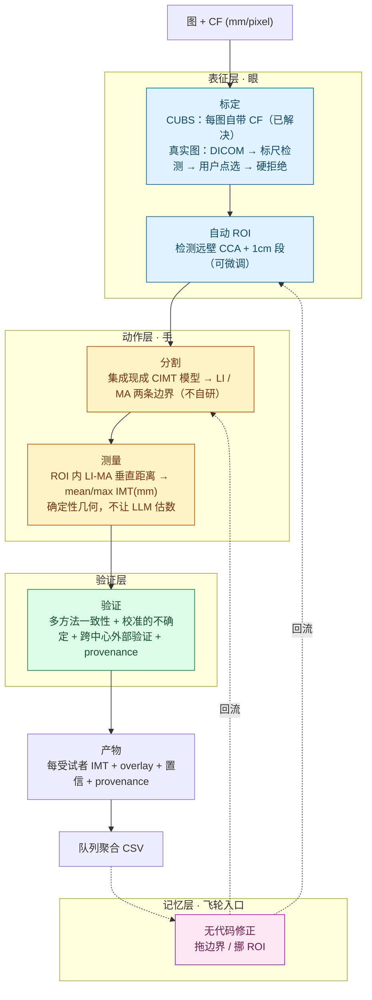

# 第一个任务 · CUBS 颈动脉 IMT（需求文档 v1）

> **用途**：Glaux 第一个任务（首个楔子）的 right-sized 需求文档——从"选定 CUBS"落到"要建什么行为"，供后续 ce-plan（HOW）承接。
> **日期**：2026-07-05 · **状态**：v1（脑暴产出，含待拍决定）
> **依据**：[纲领](../roadmaps/charter.zh-CN.md) · [需求清单](../requirements.zh-CN.md) · [路线图 阶段 4](../roadmaps/20260705-product-roadmap.zh-CN.md) · [超声基准调研](../researches/20260705-02-research-ultrasound-benchmarks.zh-CN.md) · 2026-07-05 对话（CUBS scale 调研）
> **半衰期提醒**：CUBS 文件格式/CF 字段、可集成的 CIMT 模型会变，使用前复核。

## 1. 一句话

在 CUBS 数据集上跑通「**自然语言目标 → 分割 LI/MA 两条边界 → 量 ROI 内 IMT(mm) → 验证 → 结构化可复现产物**」的端到端闭环，作为 Glaux 环境四层（表征/动作/验证/记忆）的**首个楔子**。

## 2. 用户与问题

- **用户 B**：心血管流行病学 / 血管研究者，在观察性研究或试验里把 **颈动脉 IMT 当作队列端点**，手里成批颈动脉图，但缺自动化流程、也不写代码。
- **痛**：队列 IMT 靠人工逐张标定 + 描迹，费时、受操作者影响大；今天要么等合作者、要么放弃。
- **价值**：队列级**自动 IMT** + 可验证 + 可复现 + 可发表——把"数周人工"压成"一次批处理 + 十分钟抽检"。

## 3. 任务定义（关键：不是区域分割）

> **IMT = 检测两条又薄又近似平行的边界，量它们之间的垂直距离。** 不是"分个块量面积"。

- 两条界面：**LI（lumen–intima，内界）** 与 **MA（media–adventitia，外界）**。
- 在 **ROI（远壁 CCA，约 1cm 段）** 内量 LI→MA 逐点垂直距离。
- 端点：**mean IMT + max IMT（mm）**。
- **只做远壁 CCA IMT**——不碰斑块、不碰分叉/ICA、不碰近壁（CUBS 本就无这些数据）。

## 4. 端到端流程

## 5. 功能需求（按环境四层）

### 5.1 表征层（眼）
- 读 CUBS 图像 + **每图 CF（mm/pixel）**；`IMT = CF × 像素距离`（CUBS 无现成 mm 列，需自算）。
- **真实图标定分层**（B 的图，非 CUBS）：① DICOM `SequenceOfUltrasoundRegions`（PhysicalDeltaX/Y，权威）→ ② 自动识别屏幕标尺刻度 → ③ 让用户点两下标尺 → ④ 都失败则**硬拒绝**（绝不静默输出无标定的假 IMT）。

### 5.2 动作层（手）
- **集成现成 CIMT 分割模型**（CUBS 上有 U-Net 变体基线可选），输出 LI/MA 双边界——**不自研 SOTA**。
- **ROI**：自动检测远壁 1cm + **可微调**。
- **无代码修正**：拖动边界 / 挪 ROI（非脚本）——对 B 是刚需。

### 5.3 测量
- ROI 内 LI-MA 逐点垂直距离 → **mean / max IMT（mm）**。
- **确定性几何**，可复现；不经 LLM 估值。

### 5.4 验证层（本任务的重心，素材几乎白送）
- **多方法一致性**：CUBS 自带 5 种算法输出，天然可做一致性/分歧暴露。
- **校准的不确定**：用 CUBS **3 位专家标注**建"观察者间包络"，校准"有把握 vs 存疑"——保证环境知道哪些自己扛、哪些递给 B。
- **跨中心外部验证**：CUBS **2 中心 leave-one-center-out**。
- **provenance / 可重跑 / 审计**。

### 5.5 记忆层（飞轮入口）
- 结构化捕获：意图 → 流程 → 结果 → **人工校正** → provenance，可回流。

### 5.6 产物
- 每受试者：mean/max IMT（mm）+ 边界 overlay + 置信 + provenance。
- 队列聚合成一张 **CSV**（每受试者一行）。

## 6. 非功能需求

- **产品形态**：MVP 本地 / 桌面部署；重算力（分割）经 **API 调用**，本地不强依赖 GPU。
- **可复现、可审计、校准诚实**：默认产出，不甩黑箱掩膜；也不把专业判断过度甩回 B。
- **部署边界**：研究，非临床。

## 7. 成功标准（阈值待定）

- **测量准确**：IMT 误差（mm）落在 CUBS **观察者间限**内（Bland-Altman / LoA 对标专家间差异）。
- **边界质量**：LI/MA 的 Dice / Hausdorff 达标。
- **跨中心泛化**：leave-one-center-out 外部验证达标。
- **不确定可信**：环境"有把握"处误差小、"存疑"处误差大，可用于分流。
- **信任/切换（定性）**：一个真实 B 在自己数据子集"低风险试一把"后愿意继续用。

## 8. 范围边界

- **v0 之内**：远壁 CCA 的 mean/max IMT 闭环 + 验证层 + 队列产物 + 无代码修正。
- **延后（远期线）**：
  - **3D 建模 / 数字孪生**——CUBS 是 2D 纵切单平面，真 3D 需容积/多平面超声；归入纲领「重建 / 更丰富表征」远期线，**不在 v0**。（可留意的低成本中间态：用两条边界沿长轴渲染"管壁厚度剖面/带状图"的 2.5D 表征——记为未来轻量增强，非 v0。）
  - 真实图完整标定链的鲁棒化（标尺自动检测的工程化）。
  - 斑块、分叉/ICA、近壁 IMT。
- **身份之外（永不做）**：临床诊断 / 临床决策（研究非临床红线）。

## 9. 待拍决定 / 开放问题

1. **ROI 交互细节**：自动检测的失败兜底、微调手势的粒度（暂定"自动 + 可微调"）。
2. **成功阈值量化**：§7 各项的具体数字。
3. **CUBS 实际格式 / CF 字段**：下载 Mendeley zip 读 `readme.txt` 确认（**写解析代码前必做**）。
4. **集成哪个具体 CIMT 模型**：留给 ce-plan / 阶段 3 架构。
5. **agent 意图理解评测**：多中心分割 CV 测不到"听懂 B 的人话",需单独评测（独立失败面）。

## 10. 依赖 / 假设

- CUBS 可下载（CC BY 4.0）：[fpv535fss7](https://data.mendeley.com/datasets/fpv535fss7/1) / [m7ndn58sv6](https://data.mendeley.com/datasets/m7ndn58sv6/1)。
- 存在可集成的开源 CIMT 分割模型（CUBS 基线 + 2025–26 U-Net 变体）。
- **假设**：CUBS 的 per-image CF 是可靠的像素→mm 标定（下载后验证——见开放问题 #3）。

## 变更记录

- **2026-07-05**：v1。经 ce-brainstorm 收敛；锁定"远壁 CCA IMT segment→measure"为第一个任务，3D/数字孪生排除出 v0（列远期），标定分层策略确立（CUBS 已解决 / 真实图分层）。
