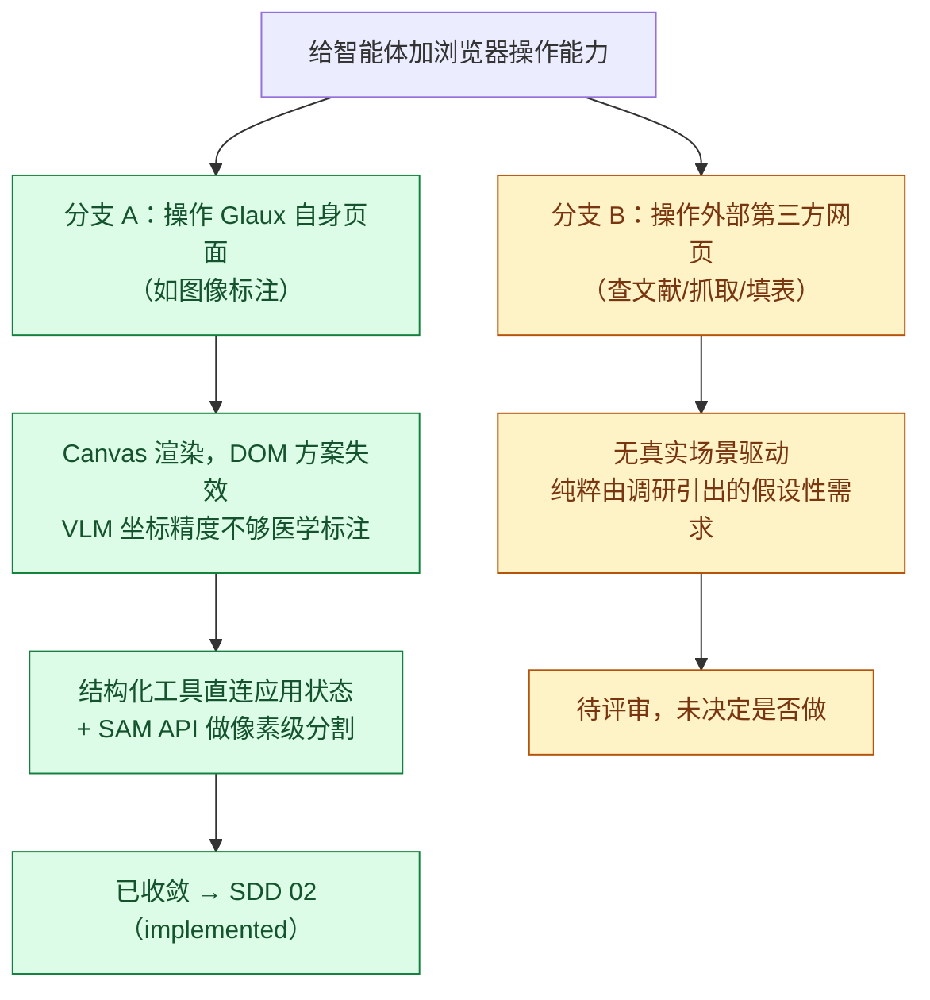

# 智能体浏览器操作能力（需求文档 v1）

> **用途**：给"给智能体加浏览器操作能力"这个初始提法做范围拆分的需求文档——记录为什么它被拆成两条技术路径完全不同的分支，以及各分支当前的收敛状态。
> **日期**：2026-08-16 · **状态**：`review`（分支 A 已 `promoted`，分支 B 待评审）
> **依据**：本次对话讨论 · 项目现状分析（agent-runtime / 前端 / net_guard 调研）· 开源浏览器 agent 方案调研 · AI 辅助图像标注方案调研 · [SDD 02 智能体图像标注能力](../sdd/feats/02-agent-image-annotation/README.md)
> **半衰期提醒**：§4 开源方案矩阵基于模型训练知识梳理，未做实时联网核验，具体项目的版本、API 形态、定价可能已变化；分支 B 若真正推进，第一步就是重新核实这份矩阵。

## 1. 一句话

"给智能体加浏览器操作能力"这个提法混合了两个目标完全不同的需求：**(A) 操作 Glaux 自身页面**（例如给影像做标注）——技术上不需要浏览器自动化，应该走结构化工具直连应用状态；**(B) 操作外部第三方网页**（查文献、抓资料、填第三方表单）——这才是真正需要 Playwright / 浏览器自动化的场景。目前只有 (A) 收敛为可执行需求并进入 SDD（[02-agent-image-annotation](../sdd/feats/02-agent-image-annotation/README.md)，`implemented`），(B) 仍是一个没有具体用户场景支撑的假设性需求，尚未评审。

## 2. 背景与问题

需求最初的表述是"给本项目的智能体加上浏览器操作能力"，讨论中给出的动机例子是"这样我们的产品可以操作自己的页面吗？比如给图像做个标注"。

这暴露了一个容易被"浏览器操作能力"这个通用词掩盖的分歧：**操作对象是自己的产品，还是别人的网页**，这两者在技术上不是同一件事——

- 自己的产品：代码、API、前端状态都在自己手里，agent 要做的事可以直接建模成"调用一个工具改状态"，浏览器只是当前的渲染载体，不是必须绕过去交互的黑盒。
- 别人的网页：没有 API、没有状态访问权限，唯一的接口就是"页面本身"，这时才需要 DOM 解析 / 截图点击这类浏览器自动化技术。

把两者用同一个"浏览器操作能力"来提需求，容易导致技术选型跑偏（例如为操作自己的 Canvas 标注去装一个 Playwright）。本文档记录拆分过程与两条分支各自的落地状态。

## 3. 拆分依据（项目现状要点）

- Glaux 真正执行 agent 工具调用（tool-calling）循环的进程是 **agent-runtime**（Node/TS，基于 `@earendil-works/pi-agent-core`），不是 Python `backend`。工具注册在 `agent-runtime/src/pi/harness-registry.ts`：`run_task` 是退役 orchestration 时引入的过渡工具，分支 A 的标注工具（`locate_roi` / `segment_region` / `propose_annotation`）也登记在此。
- 会话已有 `observe / suggest / controlled / autonomous` 四级 `permission_mode` 字段，此前只是存储占位，未在任何工具执行路径生效——这是分支 A 首次把它接线为真正门控的机会，具体规则见 SDD 02 §7.3。
- 前端影像标注基于 `@cornerstonejs/*` 的 Canvas 渲染，标注内容是 Canvas 内部像素级绘制状态，不是独立可选中的 DOM 元素。这是判断"分支 A 不该走浏览器自动化"的直接技术依据：DOM 选择器方案（`click(selector)`）对 Canvas 内部区域天然无效，退化到坐标点击又达不到医学标注所需精度（详见 SDD 02 决策 D-1）。
- 项目 roadmap 另有一条独立方向——"Glaux 作为 **MCP server** 被外部通用 agent（已自带浏览器等能力）调用"。该方向出自 2026-07-05 旧路线图，纲领 v2 未保留；[SDD 00](../sdd/feats/00-reference-agent-conversations/README.md) 也把"MCP、Codex、外部 Agent 进程接入及多 Agent 协作"列为 out of scope。**本文档不涉及**，仅在此提示避免和分支 B 混淆。

## 4. 开源浏览器自动化方案调研（分支 B 的参考依据）

| 方案 | 核心原理 | 代表项目 | 优点 | 局限 | 适用场景 |
| --- | --- | --- | --- | --- | --- |
| DOM 编号 + 可选截图 | 遍历可访问性树/DOM，给可交互元素编号，LLM 按编号选择动作 | browser-use（Python + Playwright） | 开箱即用完整 agent loop；纯文本模式对 token 友好 | Shadow DOM/iframe/Canvas 场景识别率下降；库形态，并发/隔离需自建 | 快速原型、中小规模自动化 |
| 截图 + 坐标点击 | 不依赖 DOM，纯视觉：截图→VLM 推理→坐标→鼠标键盘操作 | Anthropic Computer Use | 通用性最强，无需页面配合，跨应用/无 DOM 场景可用 | 每步截图 token/延迟开销大；坐标精度依赖模型视觉定位能力 | DOM 不可用的兜底场景（Canvas、原生应用） |
| 结构化工具封装 | 预先把操作封装成命名清晰的函数（navigate/click(selector)/fill 等），LLM 只做 function calling 选参数 | Microsoft Playwright MCP Server、Stagehand（Browserbase） | Token 效率高、操作确定性强、易调试 | selector 稳定性依赖页面结构；覆盖面受预设工具集限制 | 目标网站相对固定的生产级自动化 |
| MCP 浏览器 Server | 把浏览器操作标准化为 MCP 工具，任意 MCP client 即插即用 | playwright-mcp、puppeteer-mcp | 一次实现多处复用；权限/工具发现有统一协议管理 | 协议层增加通信开销；生态仍在演化 | 已在 MCP 生态（如 Claude Code）里的项目 |
| 云托管无头浏览器 | 托管浏览器实例集群，解决会话持久化/并发隔离/反检测 | Browserbase、Browserless | 省运维、扩展性好、登录态可跨任务复用 | 按用量计费；数据托管在第三方，涉及合规评估 | 需要规模化并发或长期登录态的生产场景 |

技术选型建议（若分支 B 未来立项）：agent-runtime 是 Node/TS 栈，结构化工具封装或 Playwright MCP Server 路线比 Python 的 browser-use 更贴合现有技术栈；纯截图点击方案不建议作为主路径，可作长尾兜底。

## 5. 分支结论

### 5.1 分支 A：操作自身页面 —— 已收敛，`promoted`

结论：**不采用任何浏览器自动化技术**。图像标注这类"操作自己产品"的需求，用结构化 agent 工具（`locate_roi` / `segment_region` / `propose_annotation`）直接调用 cornerstone3D 标注 API（`annotation.state.addAnnotation` / `segmentation.addSegmentations`）写入应用状态；精确分割由 science-core 现有能力优先，通用场景由 SDD 02 §17 选定的托管 sam3（Gitee AI 模力方舟）兜底。完整方案、字段契约、权限门控、验收标准见 [SDD 02](../sdd/feats/02-agent-image-annotation/README.md)（`implemented`）。

### 5.2 分支 B：操作外部网页 —— 待评审，未决定

现状：只完成了 §4 的方案层面调研，**没有一个具体的用户场景**要求 agent 必须访问外部网页（对比分支 A 有"给图像做标注"这个明确动机）。需要读取外部网页内容的场景已有服务端抓取这一条更轻的路（见 SDD 03 图谱 URL 导入），分支 B 只指仍需交互操作的第三方页面。在没有真实使用场景之前，不建议投入实现——技术选型只是"调研已就绪"，不代表需求已成立。

## 6. 待拍决定 / 开放问题

3. **若分支 B 成立，安全评审范围是否要与 SDD 02 §7.4（数据外发规则）统一？** 外部网页访问同样涉及出站网络策略，理论上应复用同一套出站守卫模式（fake-ip 显式开关、host 白名单），需要和分支 A 的落地一起过安全评审，而不是各自为政。已有一个落地参照：图谱的网页 URL 导入由 backend 直接抓取（`/atlas/imports/url`，带出站守卫），不需要浏览器自动化。
2. **若分支 B 成立，优先级如何排？** 是排在 SDD 02 之后串行，还是可与之并行（两者落点都在 agent-runtime 的工具系统，存在共享 tool registry / 权限门控基础设施的可能）。
3. **若分支 B 成立，安全评审范围是否要与 SDD 02 §7.4（数据外发规则）统一？** 外部网页访问同样涉及出站网络策略，理论上应复用同一套出站守卫模式（fake-ip 显式开关、host 白名单），需要和分支 A 的落地一起过安全评审，而不是各自为政。
4. **技术选型二次核实**：§4 矩阵是训练知识梳理，若立项需重新核实各开源项目的当前状态（是否仍活跃维护、API 是否有破坏性变更）。

## 7. 依赖 / 假设

- 依赖本次对话中两轮背景调研：项目现状分析（agent-runtime 工具系统、权限字段、SSRF 防护模式、前端渲染管线）与开源浏览器 agent 方案调研，后者基于模型训练知识整理，未做实时联网检索核验。
- 依赖 SDD 02 中"Canvas 渲染 + 医学标注精度要求"这一判断作为分支 A/B 边界划分的技术依据；若该判断被后续实现证伪（例如 cornerstone 标注 API 不敷使用），需要回到本文档重新评估分支划分是否仍然成立。
- 假设分支 B 当前无需求方明确要求排期；若有新的具体场景出现，应重新评审并可能推动本文档状态从 `review` 转为 `brainstorming`（补充场景细节）或 `promoted`（若场景足够明确可直接立 Feature SDD）。

## 变更记录

- **2026-08-16**：v1。经本次对话讨论收敛：分支 A（操作自身页面/图像标注）促成 [SDD 02](../sdd/feats/02-agent-image-annotation/README.md)（`draft`）；分支 B（操作外部网页）记录为待评审，暂无推进计划，需等待真实场景出现。
