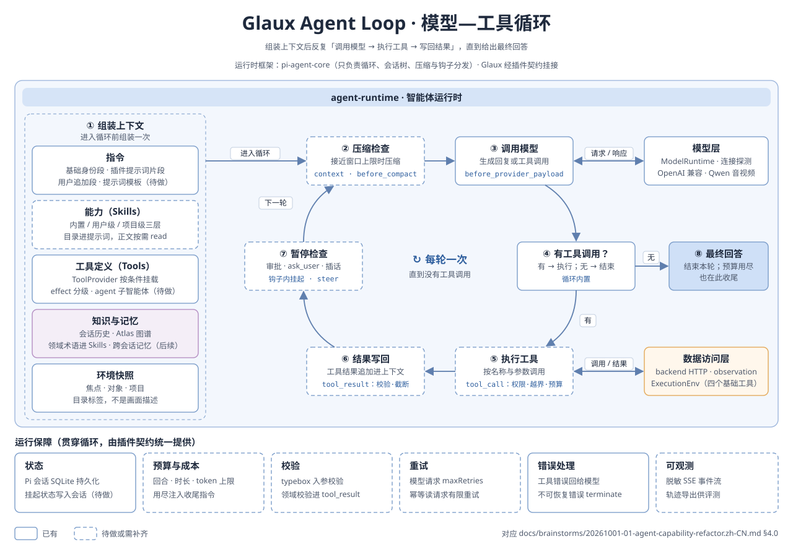

# 智能体能力重构：基础工具、Skills、子智能体与权限（需求文档 v0）

> **用途**：记录把参考智能体从「固定领域工具集」重构为「基于 pi-agent-core 扩展点的插件化 harness」的需求与构想，供拆分 SDD。
> **日期**：2026-10-01 · **状态**：`promoted`（P0 → [SDD 15](../sdd/feats/15-agent-plugins-permissions/README.md) `implemented`；P1 → [SDD 16](../sdd/feats/16-agent-basic-tools/README.md) `implemented`；P2 → [SDD 17](../sdd/feats/17-agent-skills-prompts/README.md) `implemented`；P3 → [SDD 18](../sdd/feats/18-agent-subagents/README.md) `implemented`；harness 常驻改为不做，见 SDD 15 D-1）
> **依据**：本次对话讨论 · `agent-runtime/src` 现状 · `@earendil-works/pi-agent-core` 0.82.1 类型声明（`dist/harness/*.d.ts`）· [SDD 00](../sdd/feats/00-reference-agent-conversations/README.md) · [SDD 02 §7.3](../sdd/feats/02-agent-image-annotation/README.md) · [SDD 13](../sdd/feats/13-project-folder-sessions/README.md) · [SDD 14](../sdd/feats/14-project-text-preview/README.md)

## 1. 一句话

参考智能体要从「12 个手写领域工具 + 拼接提示词」升级为插件化 harness，具体包括：

- 接入 pi-agent-core 内置的 `read` / `bash` / `edit` / `write`，并放开文件写入；
- 支持按需加载上下文的 Skills，配套 Skills 管理页和提示词管理页；
- 以工具形式调用子智能体；
- 把权限从「只存不用」完善为可审批、可配置规则的执行引擎。

MCP 暂不引入。

## 2. 现状

### 2.1 我们用到的 pi-agent-core 能力

| 扩展点 | 能力 | 现状 |
| --- | --- | --- |
| 内置工具 `createReadTool` / `createBashTool` / `createEditTool` / `createWriteTool` | 文件读写、精确替换编辑、shell 执行；依赖 `ExecutionEnv`（Node 侧实现为 `NodeExecutionEnv`） | 未用 |
| `ExecutionEnv` | 文件系统与 shell 抽象，`cwd` 可指定 | 未用 |
| 钩子 `harness.on(type, handler)` | 22 种事件，其中 `tool_call` 可返回 `{block, reason}`；`tool_result` 可改写结果或 `terminate`；`context` 可改写消息；`before_agent_start` 可改系统提示词；`before_provider_payload` 可改请求体；`session_before_compact` 可接管压缩 | 未用 |
| Skills（`loadSkills`、`formatSkillsForSystemPrompt`、`harness.skill(name)`） | 加载 `SKILL.md`，系统提示词只列名称、描述、路径，正文按需读取 | 未用 |
| 提示词模板（`promptFromTemplate`） | 用名称加参数调用预置提示词 | 未用 |
| `setTools` / `setActiveTools`、`toolContext`、`systemPrompt` 回调 | 运行中调整工具集；每轮快照上下文；按当前激活的工具和资源生成提示词 | 未用；每个命令都重建 harness，上下文写死在闭包里 |
| `steer` / `followUp` / `nextTurn` | 运行中插话和排队 | 未用 |
| 会话树 `navigateTree`、`appendCustomEntry` | 分支、回退、自定义记录 | 已用（重新生成、视频证据） |

### 2.2 现有 Glaux 层

- `TOOL_PROVIDERS` 按 `requires`（vision / egress / runtime / project）和 `supports(focus)` 决定挂载哪些工具，同时拼接各工具的提示词片段。
- 项目越界守卫以包装函数 `withProjectGuard` 实现。
- 视频证据链由 `VideoTurn` 管理，音视频块经 pi-ai 的 `onPayload` 补入请求。
- 文件能力只有只读的 `list_files`、`open_file`、`read_file`，经 backend `/projects/{id}/*` 访问。

### 2.3 权限现状

会话有 `observe` / `suggest` / `controlled` / `autonomous` 四级 `permission_mode`。实际只有 `observe` 改变工具集。SDD 02 §7.3 规划的 `beforeToolCall` 逐次审批没有实现，`suggest` 与 `controlled`、`autonomous` 行为相同。

## 3. 目标与非目标

### 3.1 目标

| # | 目标 | 要点 |
| --- | --- | --- |
| G1 | 四个基础工具 | 接入 `read` / `bash` / `edit` / `write`，放开写入；写入范围和执行由权限引擎约束 |
| G2 | Skills | 按需加载上下文；侧边栏新增独立的 Skills 管理页 |
| G3 | 提示词管理 | 侧边栏新增提示词管理页：系统提示词的可编辑部分、提示词模板 |
| G4 | 子智能体 | 先实现「子智能体即工具」：主智能体调用工具派发任务，子智能体在独立上下文中运行并返回结果 |
| G5 | 权限 | 工具副作用分级、逐次审批、可持久化的允许 / 拒绝规则、审计记录；子智能体继承父会话的权限 |
| G6 | 插件契约 | 上述能力统一挂到一个插件契约上，循环本身不改 |
| G7 | 运行保障 | 状态、预算与成本、校验、重试、错误处理、可观测六项贯穿循环，见 §4.0.3 |

### 3.2 非目标

- MCP 客户端和 MCP 服务端都不做。
- 外部网页浏览（[20260816-01](20260816-01-agent-browser-capability.zh-CN.md) 分支 B）不做。
- 子智能体之间互相通信、团队编排、后台常驻子智能体，本期不做。
- 标注自动确认不做：`propose_annotation` 恒写 `suggested` 的约束不变。

## 4. 方案构想

### 4.0 参考模型：模型—工具循环

本节给出智能体运行时的通用模型，作为后续各小节的坐标系。



- **循环**：先组装上下文，再反复执行「调用模型 → 执行工具 → 写回结果」，直到模型不再调用工具、给出最终回答。
- **分层**：运行时框架（本项目为 pi-agent-core）只负责循环本身；上层的上下文来源、下层的模型层与数据访问层，都通过稳定接口对接。

#### 4.0.1 上下文组装

进入循环前组装一次。组装后的内容在循环中由压缩改写，由 `steer` 和工具结果追加。

| 类别 | 内容 | Glaux 对应 | 现状 |
| --- | --- | --- | --- |
| 指令 | 系统指令、指令模板、少样本示例、领域口径 | 基础身份段、插件提示词片段、用户追加段、`PromptTemplate` | 前两项已有；后两项待做（G3） |
| 能力 | 技能包（判断口径 + 步骤说明），按需加载 | Skills（三层来源，目录进提示词，正文按需 `read`） | 待做（G2） |
| 工具定义 | 函数工具的名称、参数、说明 | `ToolProvider` → `AgentHarnessTool`；按条件挂载 | 已有；MCP 工具不做 |
| 知识与记忆 | 会话历史、记忆文件、知识库、领域术语 | 会话历史为 Pi 会话；知识库为 Atlas（`consult_atlas`）；记忆文件对应用户追加段；领域术语放进 Skills | 会话历史与 Atlas 已有；跨会话记忆未做 |
| 环境快照 | 当前焦点、对象、项目（Glaux 特有） | `ViewerContext` 写进系统提示词尾部，明确标注为「目录标签，不是画面描述」 | 已有 |

#### 4.0.2 循环步骤

| 步骤 | 含义 | pi-agent-core 承载点 | Glaux 挂点 | 现状 |
| --- | --- | --- | --- | --- |
| ① 组装上下文 | 见 4.0.1 | `systemPrompt` 回调、`resources`、`before_agent_start` 钩子 | 插件的 `promptFragment`、Skills 目录 | 每个命令拼一次字符串 |
| ② 压缩检查 | 接近窗口上限时压缩历史与工具结果 | `compact()`、`session_before_compact` 钩子 | `video` 插件压缩时保留证据 | 只在命令开始前检查一次；单个命令内工具循环过长时会超窗 |
| ③ 调用模型 | 生成回复或工具调用 | `before_provider_request` / `before_provider_payload` / `after_provider_response` 钩子 | 模型适配（连接、凭据、音视频块） | 音视频块走 pi-ai 的 `onPayload`，未走钩子 |
| ④ 有工具调用？ | 有则执行，无则结束 | 循环内置 | — | — |
| ⑤ 执行工具 | 按名称与参数调用，受次数上限约束 | `tool_call` 钩子（拦截） → `execute` | 权限插件（审批、规则）、项目越界、调用次数上限 | 只有越界守卫；没有通用次数上限，只有视频有观察预算 |
| ⑥ 结果写回 | 工具结果追加进上下文 | `tool_result` 钩子（改写、截断、终止） | 结果截断、证据登记、写入后通知前端刷新 | 截断由各工具自己做 |
| ⑦ 暂停检查 | 需要人工确认或补充输入时挂起，续跑后继续 | 钩子内 `await` 挂起；`steer` / `followUp` 队列在轮次边界注入 | 审批挂起（G5）；向用户提问的工具（见 §6 的 Q10）；用户运行中插话 | 无 |
| ⑧ 最终回答 | 结束本轮；预算用尽时也在这里收尾 | 循环结束、`settled` 事件 | 预算耗尽时注入收尾指令，要求模型基于已有结果作答 | 无预算，靠模型自行结束 |

#### 4.0.3 运行保障

六项保障贯穿整个循环，与具体工具无关，由插件契约统一提供。

| 保障 | 要求 | 现状 | 构想 |
| --- | --- | --- | --- |
| 状态 | 会话与运行上下文可持久化；中断后可续跑 | Pi 会话（SQLite）持久化消息与自定义记录；运行阶段只在内存 | 审批挂起状态写入会话；runtime 重启后，未决审批视为拒绝，会话回到 `idle` |
| 预算与成本 | 限制工具调用次数、模型请求次数、时长；用尽即收尾；按会话统计用量 | 只有视频观察预算 | 每个命令设回合数与时长上限，可选 token 上限；子智能体单独计；用量（`usage`）按会话累计并在界面展示 |
| 校验 | 工具入参校验；领域规则校验，不通过就纠错重来 | 入参由 typebox schema 校验；领域校验分散（视频证据、`run_task` 标定检查） | 入参校验沿用 schema；领域校验统一放进 `tool_result` 钩子，失败时以 `isError` 回给模型 |
| 重试 | 网络抖动与 5xx 自动重试；限流按窗口退避；重试计入预算 | 模型请求有 `maxRetries`；工具访问 backend 无重试 | 模型重试沿用 `streamOptions`；backend 调用对幂等的读请求加有限次重试；重试次数计入预算 |
| 错误处理 | 工具错误作为结果回给模型，由模型改参数再试；运行失败发错误事件 | 工具错误已作为 `isError` 回给模型；运行失败发 `adapter.error` | 区分可恢复错误（回给模型）与不可恢复错误（终止本轮）；`tool_result` 的 `terminate` 用于后者 |
| 可观测 | 运行、工具调用、回复内容形成事件流；参数与结果留痕 | SSE 推送 `pi.event`（已脱敏）；会话内有命令与视频的自定义记录 | 增加审批记录、预算消耗、子智能体事件；会话可导出完整轨迹，供评测与复盘 |

#### 4.0.4 框架与接口分层

- **pi-agent-core 是运行时框架**，只承担循环、会话树、压缩、钩子分发。
- **Glaux 自己的接口**：
  - 上层：插件契约（工具、钩子、Skills、提示词片段）；
  - 下层：模型适配（`ModelRuntime`）和数据访问（backend HTTP、`observation/`、`ExecutionEnv`）；
  - 对前端：transport 事件。
- **耦合点**：transport 直接把 Pi 的原始事件（`pi.event`）转发给前端，前端因此依赖 Pi 的事件形状。框架是否需要可替换见 §6 的 Q11。

### 4.1 插件契约

在 `ToolProvider` 的基础上扩展为插件。一个插件是一组声明：

```ts
interface GlauxPlugin {
  name: string;
  applies(ctx: PluginContext): boolean;      // 挂载条件：连接能力、焦点、项目、权限模式
  tools?: ToolProvider[];                     // 每个工具声明副作用等级（见 4.5）
  hooks?: Partial<HarnessHookMap>;            // 直接映射到 harness.on(type, handler)
  skills?: SkillSource[];                     // 内置 SKILL.md 目录
  promptFragment?(ctx: PluginContext): string;
}
```

| 现有实现 | 归入插件 |
| --- | --- |
| 9 个领域工具与提示词片段 | `imaging`、`atlas`、`annotation`、`project` 等插件 |
| `withProjectGuard` | `project-scope` 插件的 `tool_call` 钩子 |
| `VideoTurn` 与 `onPayload` | `video` 插件：工具，加 `before_provider_payload` 与 `session_before_compact` 钩子 |
| 权限模式 | `permission` 插件的 `tool_call` 钩子（见 4.5），排在所有插件钩子之前 |

harness 生命周期调整：

- 每个会话保持一个 harness，不再每个命令重建。
- 焦点变化通过 `setActiveTools` 和 `toolContext` 生效，系统提示词改用回调生成。
- 用户在运行中改了焦点，可以用 `steer` 通知模型。

### 4.2 四个基础工具（G1）

**执行环境**

| 会话类型 | `ExecutionEnv.cwd` | 说明 |
| --- | --- | --- |
| 绑定项目 | 项目目录 | runtime 与 backend 同机（backend 地址必须是回环），路径由 backend `/projects` 解析后交给 `NodeExecutionEnv` |
| 未归属 | 会话工作区（例如 `~/.glaux/workspaces/<session_id>/`） | 给报告、脚本、中间产物一个落脚处 |

**与现有工具的关系**

| 现有工具 | 去留构想 |
| --- | --- |
| `read_file` | 由内置 `read` 取代：分段读取和读图都由原生实现。前端 `FileCard` 改为渲染 `read` 的结果 |
| `list_files` | 保留：它返回候选模态和已登记的对象 id，这是 Glaux 特有的信息 |
| `open_file` | 保留：它负责登记对象、按帧取图，不是普通的读文件 |

**写入**

- 「放开写入」指智能体可以在 `cwd` 内创建和修改文件，包括报告、脚本、配置、CSV。
- 写到 `cwd` 之外默认需要审批，由权限规则决定。
- 写入后发事件通知前端刷新 `ProjectTree`；如果写入的文件当前正在预览，`DocumentView` 一并刷新。
- 标注不走文件写入，仍经 `propose_annotation` 写建议态。

**`bash` 的约束**

- 只在最高权限 `autonomous` 下挂载（已拍板，见 §5 的 C2）；其余模式不注册 `bash`，模型看不到它。
- 环境变量不继承 runtime 进程：启动 shell 时清空 `shellEnv`，不带 `GLAUX_SEG_API_TOKEN`、模型凭据等敏感变量。
- 超时、输出截断沿用内置实现。中止会话时，连带结束子进程。
- 结果来源标注：`bash` 算出的数值标为「非标定结果」，和 `run_task` 产出的标定结果区分开（见 §5 的 C2）。

### 4.3 Skills 与管理页（G2）

**来源与优先级**

| 层级 | 位置 | 说明 |
| --- | --- | --- |
| 内置 | `agent-runtime/skills/` | 随版本发布，例如颈动脉 IMT 测量规范、CT 读片要点、视频证据作答规范 |
| 用户级 | `~/.glaux/skills/` | 对所有会话生效 |
| 项目级 | `<项目>/.glaux/skills/` | 只对绑定该项目的会话生效 |

- 同名时项目级覆盖用户级，用户级覆盖内置。
- 加载用 `loadSourcedSkills`，来源（内置 / 用户 / 项目）记在每个 skill 上。

**按需加载**

- 系统提示词只放 `formatSkillsForSystemPrompt` 生成的目录（名称、描述、路径）。
- 模型需要某个 skill 时，用 `read` 读取正文。因此内置和用户级的 skill 目录要对 `read` 只读放行，不受 `cwd` 限制。
- 用户也可以在输入框用 `/skill-name` 显式调用，对应 `harness.skill(name)`。
- `disableModelInvocation` 的 skill 不进目录，只能由用户显式调用。

**Skills 管理页**（侧边栏新增一项，与 `explorer`、`market`、`atlas` 并列）

- 列表：名称、描述、来源、启用状态、加载告警（`SkillDiagnostic`）。
- 详情：查看和编辑 `SKILL.md`，包括 frontmatter 与正文。内置 skill 只读，可以复制成用户级再改。
- 操作：新建、导入（目录或 zip）、启用 / 停用、删除（只限用户级和项目级）。
- 读写由 runtime 新增的 `/agent-api/v1/skills*` 端点负责。skill 不属于数据面，不经 backend。

### 4.4 提示词管理页（G3）

页面管两类对象：

| 对象 | 内容 | 可编辑性 |
| --- | --- | --- |
| 系统提示词 | 基础身份段；各插件的提示词片段；用户追加段（类似 CLAUDE.md，分用户级与项目级） | 基础段和插件片段只读展示，用来解释模型当前看到了什么；用户追加段可编辑 |
| 提示词模板 | `PromptTemplate`（名称、描述、带参数占位的正文） | 可增删改；输入框用 `/` 唤出，对应 `promptFromTemplate` |

- 页面提供「当前会话实际系统提示词」预览：按当前连接、焦点、项目、权限组装出最终文本，用来排查「模型为什么没用某个工具」。
- 存储位置与 skill 一致：用户级在 `~/.glaux/`，项目级在 `<项目>/.glaux/`。

### 4.5 权限（G5）

**工具副作用分级**：每个工具在 `ToolProvider` 上声明 `effect`。

| effect | 含义 | 工具 |
| --- | --- | --- |
| `read` | 只读，不出本机 | `read`、`list_files`、`open_file`、`view_current_image`、`observe_video_interval`、`submit_video_answer` |
| `annotate` | 写建议态，必须人工确认 | `propose_annotation` |
| `compute` | 调本机计算，不改用户文件 | `run_task`、`locate_roi` |
| `egress` | 数据外发 | `segment_region`、`consult_atlas`（向模型发图谱图块） |
| `write` | 改文件 | `write`、`edit` |
| `exec` | 执行任意命令 | `bash` |
| `delegate` | 派发子智能体 | `agent` |

**模式定义**（沿用四个枚举值，重新定义语义）

| 模式 | 自动放行 | 需审批 | 不挂载 |
| --- | --- | --- | --- |
| `observe` | read | — | 其他全部 |
| `suggest` | read、annotate | compute、egress、write、delegate | exec |
| `controlled`（默认） | read、annotate、compute、egress、`cwd` 内的 write（已拍板，写入有审计记录）、delegate | `cwd` 外的 write | exec |
| `autonomous`（最高权限） | 全部，包括 exec | 只有命中 `ask` 规则的调用 | — |

- exec（`bash`）只在 `autonomous` 下挂载，这是已拍板的决策。
- 会话切换到 `autonomous` 需要用户在界面上显式确认，确认文案写明 `bash` 会以当前用户身份在本机执行命令。

所有模式都受两条约束：命中 `deny` 规则一律拒绝；标注恒为建议态。

**规则**

- 规则格式：`{tool, pattern, decision: allow | deny | ask}`，`pattern` 按工具解释，例如 `bash` 匹配命令前缀，`write` 匹配路径 glob。
- 规则分用户级与项目级，项目级优先。
- 审批时用户可以选「本次允许」「本会话允许」「总是允许」。选「总是允许」会写入规则。

**执行点**

- `permission` 插件注册 `tool_call` 钩子，依次判断：规则 → 模式 → 审批。
- 需要审批时，SSE 推送 `permission.request`（含工具、参数摘要、`effect`），钩子挂起等待。
- 前端经 `POST /sessions/{id}/permissions/{request_id}` 回复。超时或用户中止视为拒绝，返回 `{block: true, reason}`。
- 每次判定都用 `appendCustomEntry("glaux.permission.decision", …)` 写入会话，作为审计记录。
- 「项目越界」与「`cwd` 外写入」都在同一个钩子链里判定，不再单独包装工具。

### 4.6 子智能体（G4）

**形态**：新增工具 `agent`，参数为 `{subagent_type, description, prompt}`。

- 执行时新建一个子 `AgentHarness`，使用独立的 Pi 会话，只把最终回复作为工具结果返回给主智能体。
- 子会话和父会话的关联用 `appendCustomEntry("glaux.subagent", {child_session_id, …})` 记录，前端可以展开查看子会话全文。

**定义方式**：Markdown 加 frontmatter，与 Skills 同样分内置、用户级、项目级三层。

```yaml
---
name: video-scout
description: 长视频分段浏览，返回带时间区间的事件清单
tools: [observe_video_interval, read]
model: inherit
---
（子智能体系统提示词）
```

- 内置候选：通用 `general`；`video-scout`（长视频导航，契合「视频做 harness」的方向）；`literature`（读项目内文档、汇总）。
- 管理入口可以合并进 Skills 页的「智能体」标签。

**约束**

| 约束 | 规则 |
| --- | --- |
| 工具 | 子智能体的工具集 ⊆ 定义里的 `tools` ∩ 父会话当前可用工具；子智能体没有 `agent` 工具，嵌套深度为 1 |
| 权限 | 继承父会话的模式和规则，不能提权；子智能体的审批请求以父会话名义推送，并标出来源 |
| 并发 | 同一父会话并发的子智能体有上限（例如 3 个） |
| 中止 | 父会话中止时级联中止全部子会话 |
| 事件 | 子会话事件经父会话 SSE 转发，带 `parent_tool_call_id`，前端在工具卡片里折叠展示 |
| 预算 | 每个子智能体有回合数上限，可选 token 上限；超限时返回已有结果并注明截断 |
| 视频 | 子智能体可以拥有自己的 `VideoTurn` 预算；证据要回传父会话，才能被 `submit_video_answer` 引用（见 §6 的 Q6） |

## 5. 对现有约束的影响

| # | 约束 | 影响 | 构想 |
| --- | --- | --- | --- |
| C1 | 只有 agent-runtime 与模型通信 | 不变 | 子智能体也在 runtime 内 |
| C2 | `REGISTRY` 是能力清单的唯一来源 | `bash` 让智能体能做注册表之外的计算 | **已拍板：允许动摇**。授予最高权限 `autonomous` 后接入 `bash`。不变量改为「`REGISTRY` 是**标定能力**的唯一来源」：`bash` 结果一律标为非标定结果，不进入 `run_task` 的结果通道和查看器的测量读数；需修订纲领与仓库骨架总览 |
| C3 | 标注恒为建议态 | 不变 | 文件写入与标注写入是两条路径 |
| C4 | 项目越界守卫 | 范围扩大到文件系统工具 | 合并进权限钩子链，`cwd` 外的读写走规则判定 |
| C5 | 本地优先、回环访问 | `bash` 在用户机器上以用户身份执行 | `bash` 只在 `autonomous` 下挂载；进入该模式需要显式确认；`deny` 规则仍然生效；文档明确风险 |
| C6 | 前端只有一条对话路径 | 不变 | 审批、子会话展示都走现有 SSE 通道 |

## 6. 待决问题

| # | 问题 | 倾向 |
| --- | --- | --- |
| Q1 | `bash` 要不要沙箱（容器、受限用户、seccomp）？ | 一期靠「只在 `autonomous` 下挂载」加环境变量清理加 `deny` 规则；沙箱另行调研 |
| Q2 | 未归属会话的工作区放在哪，会话删除时是否连带删除？ | `~/.glaux/workspaces/<session_id>/`，删除会话时提示是否一并删除 |
| Q3 | `read` 取代 `read_file` 后，SDD 14 的编码判定、二进制拒绝、隐藏路径拒绝是否保留？ | 用 `tool_call` 钩子补上隐藏路径拒绝；编码判定用原生实现 |
| Q4 | 提示词的用户追加段叫什么、文件名用什么（例如 `GLAUX.md`）？ | 待定 |
| Q5 | 权限规则文件的位置和格式？ | `~/.glaux/settings.json`、`<项目>/.glaux/settings.json`，JSON 格式 |
| Q6 | 子智能体的视频证据如何被父会话的 `submit_video_answer` 引用？ | 子会话把观察记录回写到父会话的 `VideoTurn`，共享同一份观察预算 |
| Q7 | 子智能体能否使用与父会话不同的模型连接？ | 一期 `model: inherit`，只用父连接 |
| Q8 | `observe` 模式下子智能体是否可用？ | 不可用（delegate 属于副作用） |
| Q9 | Docker chat 发行版是否同步？ | 不同步：chat 版不再维护 |
| Q10 | 是否提供「向用户提问」工具（循环步骤 ⑦ 的主动挂起）？ | **已拍板**：与权限审批共用一个挂起机制（一张待决请求表、一个回复端点、一种前端卡片），纳入 P0；提供 `ask_user`：给出选项加自由输入，钩子挂起等待回复；`observe` 下也可用 |
| Q11 | 运行时框架是否要做成可替换？ | **已拍板**：不抽象框架层；P0 就把 transport 事件改为 Glaux 自己的事件形状，不再透传 `pi.event`，前端不依赖 Pi 类型 |
| Q12 | 预算默认值多少？ | **已拍板**：每个命令 50 回合、20 分钟；子智能体 20 回合；可在设置中调整；超限注入收尾指令 |

## 7. 分期构想

| 期 | 内容 | 前置理由 |
| --- | --- | --- |
| P0 | 插件契约；权限引擎（effect 分级、`tool_call` 钩子、规则、审计）；统一挂起机制（审批与 `ask_user`）；运行保障的预算、轮内上下文裁剪、挂起状态；transport 自有事件结构 | 放开写入和 `bash` 之前必须先有审批与预算 |
| P1 | 四个基础工具；会话工作区；`read` 取代 `read_file`；写入后刷新前端 | 依赖 P0 |
| P2 | Skills 加载与按需读取；Skills 管理页；提示词管理页与模板 | 依赖 P1 的 `read` |
| P3 | 子智能体工具、定义加载、事件转发、级联中止 | 依赖 P0 的权限继承和 P2 的定义加载 |

## 8. 去向

评审通过后拆成以下 SDD（编号待定）：

- 插件契约与权限引擎（P0），同时修订 SDD 02 §7.3 的权限表；
- 基础工具与会话工作区（P1），同时修订 SDD 14 的 `read_file` 部分；
- Skills 与提示词管理（P2）；
- 子智能体（P3）。
