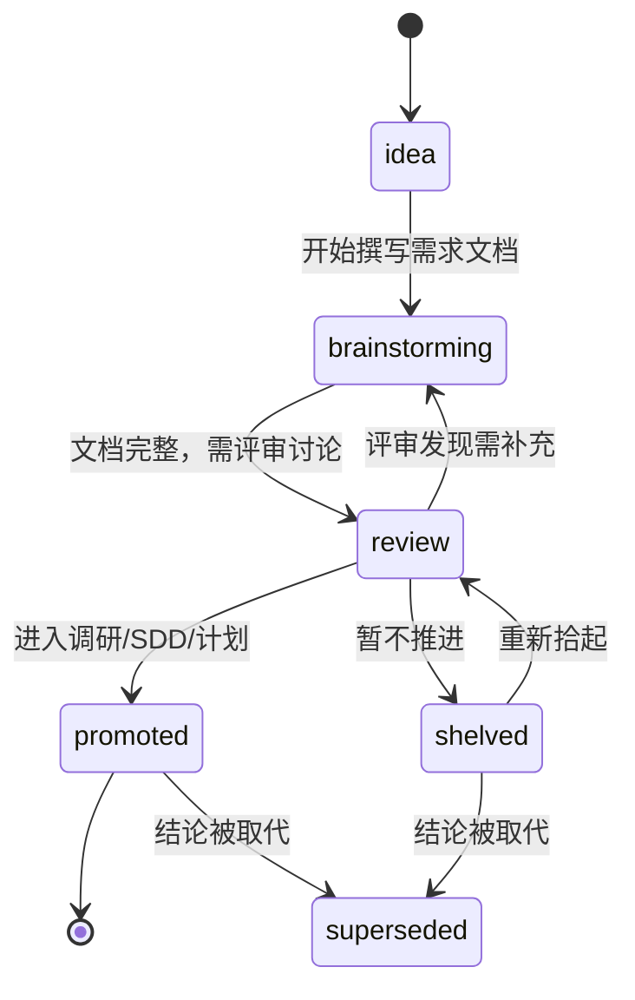

# 脑暴 / 需求文档索引

> 脑暴文档是"从想法到可执行规范"的中间产物——每份围绕一个任务或特性，产出 right-sized 的需求文档，供后续调研、SDD 或实现计划承接 HOW。
>
> **不是所有需求都从脑暴起步**：有些直接由调研或外部需求触发，在 `researches/` 形成调研报告后进入 SDD。脑暴更适合需要发散探讨、还没有明确技术方案的想法。

## 生命周期



| 状态 | 含义 |
| --- | --- |
| `idea` | 有想法但还没形成文档 |
| `brainstorming` | 文档编写中，仍在发散 |
| `review` | 文档已完整，需要评审讨论后决定是否推进 |
| `promoted` | 已进入下一阶段（调研 / SDD / 计划），本文档冻结 |
| `shelved` | 暂不推进，保留供未来参考 |
| `superseded` | 结论已被取代，见 frontmatter 的 `superseded_by` |

## 需求跟踪表

| 文件 | 日期 | 主题 | 状态 | 去向 |
| --- | --- | --- | --- | --- |
| [20260705-01-cubs-imt-first-task.zh-CN.md](20260705-01-cubs-imt-first-task.zh-CN.md) | 2026-07-05 | CUBS 颈动脉 IMT 分割→测量 | `promoted` | → [计划](../plans/2026-07-05-001-feat-cubs-imt-pipeline-plan.zh-CN.md)，已实现 |
| [20260816-01-agent-browser-capability.zh-CN.md](20260816-01-agent-browser-capability.zh-CN.md) | 2026-08-16 | 智能体浏览器操作能力（范围拆分） | `review` | 分支A(自身页面/标注) → [SDD 02](../sdd/feats/02-agent-image-annotation/README.md) `implemented`；分支B(外部网页) 待评审 |
| [20260816-02-unified-annotation-toolbox.zh-CN.md](20260816-02-unified-annotation-toolbox.zh-CN.md) | 2026-08-16 | 统一图像标注工具箱（bbox/polygon/brush + 后端持久化） | `promoted` | → [SDD 04](../sdd/feats/04-unified-annotation-toolbox/README.md) `implemented` |

### 调研阶段需求（尚未进入脑暴，但已有调研文档）

来自 `researches/` 的需求导向调研，评审通过后可直接进入 SDD 或计划，不一定需要脑暴文档。

| 调研 | 日期 | 主题 | 状态 | 去向 |
| --- | --- | --- | --- | --- |
| [20260816-01-tech-annotation-exemplar-store](../researches/20260816-01-tech-annotation-exemplar-store.zh-CN.md) | 2026-08-16 | 图像标注案例库技术选型 | 已拍板 | → [SDD 03 Atlas](../sdd/feats/03-atlas/README.md) `implemented` |
| [20260816-02-tech-deepseek-harness-integration](../researches/20260816-02-tech-deepseek-harness-integration.zh-CN.md) | 2026-08-16 | DeepSeek Harness 插件生态集成 | `superseded` | 前提被纲领 v2 §五推翻（Glaux 是 harness），不推进 |

## 命名规约

```
<YYYYMMDD>-<NN>-<topic>.<lang>.md
```

| 段 | 含义 | 取值 |
| --- | --- | --- |
| `YYYYMMDD` | 脑暴日期 | 如 `20260705` |
| `NN` | 当日序号，2 位补零 | `01`、`02`… |
| `topic` | 主题，英文 kebab-case | 如 `cubs-imt-first-task` |
| `lang` | 语言后缀，可选 | `zh-CN` · `en` |

## 维护约定

- 新增脑暴文档时同步更新本索引的跟踪表。
- 脑暴进入下一阶段（调研 / SDD / 计划）时，将状态改为 `promoted` 并填写"去向"链接。
- 已 `promoted` 的文档冻结内容，不再修改——后续变更在去向文档中体现。
- 调研直接催生的需求记在"调研阶段需求"表中，不必补写脑暴文档。
