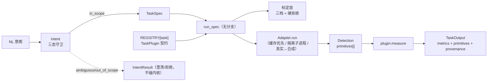

# Glaux 多模态多任务架构 · 抽象设计

> **用途**：把 Glaux 从「单一 IMT 任务写死」演进为「多模态多任务可插拔」的架构设计——
> 定契约、信封、注册表、查看器接缝与能力模型，让「加一个任务/模态」= 注册一行 + 实现一个适配器，
> **泛型代码零改动**。后续引入病理、放射 3D、时序视频时不再定开死代码。
> **日期**：2026-07-07 · **类别**：design（设计） · **状态**：v1 · **技术栈**：FastAPI + React + Cornerstone3D
> **依据**：[纲领](../roadmaps/charter.zh-CN.md) · [需求清单](../requirements.zh-CN.md) · [CUBS IMT 计划](../plans/2026-07-05-001-feat-cubs-imt-pipeline-plan.zh-CN.md) · [前端 IDE 设计](2026-07-06-glaux-ide-frontend.zh-CN.md)
> **半衰期提醒**：Cornerstone3D 版本（v4.21，2026-04）、库选型与占位能力清单会变；动工前复核第九节落地顺序与依赖。

---

## 0. 一页纸

**问题**：已接两个超声模态任务（颈动脉 IMT / 胎儿 HC）。后续要接病理 WSI、放射 3D、时序视频等**不同模态的不同任务**。当前虽有 `TASKS` 注册表雏形，但它**只抽象了名字**——真正的行为（分割→测量→结果→渲染）仍在 8 处 `if 模态` 分支。**加一个任务 = 改 8 个地方**，即「定开死代码」。

**解法**：让注册表承载**契约**而非只是名字；让所有分派变成**读注册表 + 走统一信封**。

- **三个统一信封**：`Detection`（检测）/ `Measurement`（测量）/ `TaskOutput`（产物），几何差异收进带类型的 `Primitive` 列表。
- **一个任务插件契约** `TaskPlugin`：把「一个模态的一个任务」的行为（适配器类型、测量原语、查看器、工具集、overlay 画法）绑进注册表一行。
- **一个能力模型** `Capability`：把「模型/数据集/连接器/skill/MCP/知识库」用纲领的「环境四层」收成一套清单——**「加任务」与「加能力」同一套机制**。
- **可换查看器引擎**：定义 `Viewer` 接缝，raster/3D/video 用 **Cornerstone3D**、病理 WSI 用 **OpenSeadragon**、外壳用 **dockview**——不重复造轮子，且不锁死。

**不可退让的产品不变量**（从科学内核继承，本设计全部保留）：测量确定性（不经 LLM 估值）、意图守卫（歧义/超范围显式识别）、标定硬拒绝（无标定绝不出假值）、主进程无重框架（TF/torch 隔离子进程）、真实/合成双轨。

**尽量简化的边界**：这一轮只建**接缝与信封**、消灭分支；每种引擎/能力等**真需求到来时**沿接缝接入（见第八节护栏）。

---

## 1. 问题框定：病根只有一个

`orchestration/glaux_orchestrator/spec.py` 的 `TASKS` 注册表是正确的脊柱，但它**只承载元数据**（label / unit / signals），行为仍在到处 `if`：

| # | 分支点 | 现状位置 | 加第 3 个任务的代价 |
| --- | --- | --- | --- |
| 1 | 几何分派 | `run.py` `if geometry is WALL_PAIR … if CLOSED_CONTOUR …` | 再加一个 `if` 分支 |
| 2 | 结果类型 | `TaskResult \| HCTaskResult` 联合类型 | 联合再膨胀一类 |
| 3 | 适配器类型 | `ModelAdapter \| ContourAdapter`，方法名还不一（`segment` vs `detect`） | 再加一种 provider |
| 4 | 后端端点 | `/run /segment /measure` vs `/hc/run /hc/measure` | 再糊 `/x/run /x/measure` |
| 5 | 前端画布 | `Editor.tsx` `isHC ? <HCCanvas/> : <AnnotationCanvas/>` | 再加一个三元/switch |
| 6 | 前端工具集 | `IMT_TOOLS` vs `HC_TOOLS` | 再加一组常量 |
| 7 | 前端 API 层 | `run/measure` vs `hcRun/hcMeasure` | 再加一对方法 |
| 8 | 底部测量面板 | 按模态条件渲染字段 | 再加一段条件 |

**根因**：注册表抽象了「名字」，没抽象「行为」和「数据形状」。本设计的全部工作就是补上后两者。

---

## 2. 核心设计：任务插件契约 + 三个统一信封

### 2.1 三个统一信封（最关键的改动）

今天每个任务各有一套 result / adapter / 几何原语。收敛成三个**跨任务通用**的结构，几何差异全部收进带类型的 `Primitive`：

```python
# —— 几何图元：前端后端共用的一套"可画/可测/可编辑"的原语 ——
# Polyline(id, role="LI"|"MA"|…, pts)      开放壁线（IMT）
# Ellipse(id, cx, cy, a, b, theta)         椭圆（HC）
# Polygon(id, pts, closed=True)            闭合多边形/掩膜轮廓（病理/分割）
# Mask(id, rle | png_ref, label)           栅格掩膜（病理区域/labelmap）
# BBox(id, x, y, w, h)                      检测框
# Keypoints(id, pts, labels)               关键点
# VolumeMask(id, ref, frame?)              3D 体掩膜 / 视频帧掩膜（未来）
Primitive = Polyline | Ellipse | Polygon | Mask | BBox | Keypoints | VolumeMask

@dataclass(frozen=True)
class Detection:                # ① 检测信封——所有适配器都返回它
    primitives: list[Primitive]
    model_version: str
    roi_used: ROI | None
    meta: dict

@dataclass(frozen=True)
class Measure:
    value: float; unit: str; label_en: str; label_zh: str

@dataclass(frozen=True)
class Measurement:              # ② 测量信封——不再有 IMTResult vs HCResult
    metrics: dict[str, Measure]           # {"IMT_mean": Measure(0.918,"mm"), …}
    calibration: CalibrationResult        # cf + source（沿用三档 + 硬拒绝）
    overlays: list[Primitive]             # 测量副产物（PDM 投影线 / 长短轴 …）

@dataclass(frozen=True)
class TaskOutput:              # ③ 产物信封——后端返给前端的唯一形状
    task: str
    metrics: dict[str, Measure]
    primitives: list[Primitive]           # 画布要画的（LI/MA / 椭圆 / 掩膜 …）
    calibration: CalibrationResult
    provenance: Provenance                # 沿用 U7 schema
```

**为什么是关键**：`metrics` 是字典、`primitives` 是带类型图元列表——前端能**泛型渲染**（画所有 primitive、列所有 metric），后端能**泛型返回**（不再每模态开端点）。IMT 的 `mean_mm/max_mm` 与 HC 的 `hc_mm/bpd_mm` 只是字典里不同的键，不再是不同的类（消灭分支 #2、#8）。

### 2.2 任务插件契约（注册表升级）

`TaskDef` 从「元数据」升级为「契约」，把行为绑上去：

```python
@dataclass(frozen=True)
class TaskPlugin:
    # —— 已有元数据（保留）——
    task: TaskType
    geometry: GeometryKind
    label_en: str; label_zh: str
    signals: tuple[str, ...]
    default_method: str

    # —— 新增：行为契约（后端）——
    adapter_kind: str                        # 需要哪类适配器："wall_pair"/"contour"/"mask"/"volume"…
    measure: Callable[[Detection, CalibrationResult], Measurement]
    metric_keys: tuple[str, ...]             # 主度量键（面板据此列字段）

    # —— 新增：渲染契约（前端读它，不再 if 模态）——
    viewer: str                              # "raster_2d" | "volume_3d" | "wsi" | "video"
    tools: tuple[ToolDef, ...]               # 该任务的标注工具集（替代 IMT_TOOLS/HC_TOOLS）
    overlay_spec: tuple[OverlaySpec, ...]    # 每种 primitive 怎么画（颜色/是否可编辑）

# 注册表——新增模态/任务在此登记一行（+ 实现其 measure 与 adapter）
REGISTRY: dict[TaskType, TaskPlugin] = { … }
```

### 2.3 无分支的泛型驱动

`run_spec` 从「按几何 if/else」变成读注册表 + 走信封：

```python
def run_spec(spec: TaskSpec, adapter: Adapter, image: np.ndarray) -> TaskOutput:
    plugin = REGISTRY[spec.task]
    cal = resolve_calibration(cubs_cf=spec.cubs_cf)          # 无标定 → 硬拒绝（不变）
    if adapter.kind != plugin.adapter_kind:                  # 一次契约校验，替代 isinstance 联合
        raise TypeError(f"{spec.task} 需 {plugin.adapter_kind} 适配器，得 {adapter.kind}")
    det = adapter.run(DetectRequest(image, spec.roi))        # 统一适配器调用
    meas = plugin.measure(det, cal)                          # 注册表里的测量原语
    return TaskOutput(
        task=spec.task.value,
        metrics=meas.metrics,
        primitives=det.primitives + meas.overlays,
        calibration=cal,
        provenance=build_provenance(spec, det, cal),
    )
```

**加第 3 个任务（如病理核分裂计数）= 写一个 `measure` 函数 + 注册一行 `TaskPlugin` + 实现一个 `Adapter`。泛型代码一行不改。** 消灭分支 #1。

### 2.4 统一适配器接口

把 `ModelAdapter.segment` 与 `ContourAdapter.detect` 合并（消灭分支 #3）：

```python
class Adapter(ABC):
    kind: str          # "wall_pair" / "contour" / "mask" / "volume"
    name: str
    @abstractmethod
    def run(self, req: DetectRequest) -> Detection: ...   # 统一入口，返回统一信封
```

现有 `caroSegDeep`（壁线对）与 `BrightRingEllipse`/`CSM`（轮廓）只改签名壳、内部逻辑不动。隔离子进程、缓存优先、真实/合成双轨全部保留在适配器实现内部。

---

## 3. 后端设计

### 3.1 高层数据流



### 3.2 统一端点（端点不再随模态增长）

| 端点 | 入 | 出 | 取代 |
| --- | --- | --- | --- |
| `POST /run` | `TaskSpec{task, image_id, cf?, roi?, method?}` | `TaskOutput` | `/run` + `/hc/run` |
| `POST /detect` | `{task, image_id, roi?, method?}` | `Detection` | `/segment` |
| `POST /measure` | `{task, primitives[], cf}` | `Measurement` | `/measure` + `/hc/measure` |
| `GET /tasks` | — | `[TaskPlugin 可序列化视图]` | **新增·前端唯一真相源** |
| `POST /interpret` | `{nl, lang, has_image}` | `IntentResult` | 不变（读注册表 signals） |
| `GET /images?modality=` · `GET /image/{id}` | — | 列表 / 图 | 泛化（见 3.4） |
| `GET /capabilities?kind=&layer=&task=` | — | `[Capability]` | **新增·取代 `/models`**（见第五节） |

`GET /tasks` 是把前端从 `if 模态` 里解放出来的钥匙——viewer 类型、工具集、度量字段、overlay 画法全从这里来（消灭分支 #4–#8 的数据来源）。

### 3.3 保留不动的护城河

后端已经做对、**原样保留**：隔离子进程跑重算力（`.venv-csd` / `.venv-hc`）、缓存优先、真实/合成双轨、硬拒绝而非静默假造、主进程无 TF/torch、`kernel.py` 只做 HTTP schema ↔ 领域对象映射。

### 3.4 命名债：`glaux_imt` → `glaux_core`

`science-core/glaux_imt/` 现在装着 HC，名不副实。趁只有 2 个任务、机械改名成本最低时改成 **`glaux_core`**（或 `glaux_kernel`）。
**权衡**：一次性 import churn（约 40 处引用）vs 永久误导性包名。现在最便宜——拖到 5 个任务、import 面固化后更贵。建议本轮随第一步重构一起做。

---

## 4. 前端设计

### 4.1 现成组件选型（"别重复造轮子"）

当前纯手写 Canvas 2D，对 2D 超声够用，但扛不住 3D 体数据、病理千兆像素、视频，也缺稳健的多边形/掩膜编辑。选型（各自领域事实标准、2026 仍活跃）：

| 模态族 | 引擎 | 说明 |
| --- | --- | --- |
| 放射/超声 **2D+3D+视频** + 分割标注 | **Cornerstone3D**（OHIF 生态，v4.21 / 2026-04） | 原生超声/X光/CT 体数据/视频/labelmap；WebGL；多边形/画笔/掩膜工具开箱即用；非 DICOM 的 PNG/TIFF 走 web image loader |
| 病理 **WSI 千兆像素** | **OpenSeadragon** + Annotorious | 瓦片金字塔，Cornerstone 扛不了 gigapixel；数字病理事实标准 |
| VS Code 式**可停靠布局** | **dockview** | 零依赖、布局可序列化、浮动面板 + popout；优于 rc-dock / react-mosaic |

**决策（本轮）**：**现在就接 Cornerstone3D** 作为 raster 引擎——2D 超声即刻迁入，白拿多边形/掩膜/画笔标注与未来 3D/视频能力。OpenSeadragon（病理）等第一个 WSI 任务再接。

### 4.2 `Viewer` 接缝（不锁死引擎）

按 `task.viewer` 选引擎，是**唯一"认引擎"的地方**：

```tsx
interface ViewerProps {
  imageSource: ImageSource;          // {kind:"png"|"dicom"|"wsi"|"video"|"volume", url|urls}
  primitives: Primitive[];           // 后端信封里的图元，泛型渲染
  activeTool: string;                // 来自 task.tools
  editable: OverlaySpec[];           // 哪些图元可编辑
  onEdit(next: Primitive[]): void;   // 编辑后回调 → /measure 重测
}

const ENGINES: Record<string, React.FC<ViewerProps>> = {
  raster_2d: CornerstoneViewer,      // 2D 超声/放射 + 视频（StackViewport）
  volume_3d: CornerstoneVolumeViewer,// 3D（VolumeViewport）
  video:     CornerstoneVideoViewer, // 视频（VideoViewport）
  wsi:       OpenSeadragonViewer,    // 病理 WSI
};
// <Viewer/> = ENGINES[task.viewer]，读 primitives 泛型渲染；谁都不认模态
```

`isHC ? <HCCanvas/> : <AnnotationCanvas/>` 消失（消灭分支 #5）。

**Cornerstone3D 接线要点**：
- 图源：后端 `/image/{id}` 出 PNG → `@cornerstonejs/core` 的 web image loader（`imageId = "web:/api/image/{id}"`）。
- 图元映射：`Primitive[]` → Cornerstone annotation 对象（`PlanarFreehandROI`/`SplineROI` 画多边形与开放壁线、`EllipticalROI` 画椭圆、Segmentation labelmap 画掩膜）。
- 编辑：Cornerstone 原生控制手柄即得拖拽编辑；松手 → `onEdit(next)` → `/measure` 权威重测（沿用现有回流）。
- **权衡（迁移风险）**：现有 IMT 的「9 手柄高斯衰减形变」是自研 UX。迁到 Cornerstone 有两条路——(a) 用原生 `PlanarFreehandROI` 手柄编辑，放弃高斯平滑；(b) 写一个自定义 Cornerstone tool 保留高斯形变。建议先 (a) 跑通，(b) 作为可选增强。

### 4.3 注册表驱动的 UI（消灭 `if 模态`）

前端启动拉 `GET /tasks`，一切从注册表来：

- **任务/模态切换器**：遍历 `/tasks`，不再硬编码 `[carotid_imt, fetal_hc]`。
- **工具栏**：`task.tools`（消灭分支 #6）。
- **底部测量面板**：遍历 `TaskOutput.metrics` 泛型渲染（消灭分支 #8）。
- **API 层**：塌成 `run(spec)` / `detect(spec)` / `measure(task, primitives, cf)` 三个泛型方法（消灭分支 #7）。
- **Zustand store**：`modality` 单一真相源保留；`boundaries/hc*` 逐模态字段收敛成 `primitives: Primitive[]` + `metrics`。

---

## 5. 能力模型：「插件市场」的统一抽象

「模型、数据集、连接器、skill、MCP、知识库」看似杂，用纲领的**「环境四层」本体**收成**一个 `Capability` 清单 + 一个注册表**，而非六套并行系统：

```
Capability { id, kind, layer, name, provider, license, status, isolation, provenance }

┌ 表征层（数据进来）  Connector（本地目录/DICOM-PACS/云/S3）· Dataset（CUBS/HC18/用户语料）· ModalityDecoder（读 WSI/DICOM/视频）
├ 动作层（给项目能力）Model/Adapter（caroSegDeep/CSM/nnU-Net/MedSAM）· Skill（= TaskPlugin！打包好的任务配方）· MCP（外部工具服务器）· ComputeEndpoint（远程 GPU）
├ 验证层（裁判）      ReferenceMethod（CUBS 5–7 算法）· GroundTruthSet · CalibrationSource
└ 记忆层（飞轮）      KnowledgeBase（生长曲线/指南/RAG）· CorrectionStore（人工修正回流）
```

**最重要的洞见**：**「skill」就是第二节的 `TaskPlugin`**——一个任务配方（模型 + 测量 + 查看器 + 工具）本身就是一种「动作层能力」。**「怎么加一个任务」和「怎么加一个能力」是同一套清单机制**。于是「插件市场」不是孤立商店，而是**整个能力注册表的浏览器**：按 layer 分组、按 kind/task 过滤的卡片墙。

后端 `GET /capabilities` 返回清单；现有 `kernel.models()`（`known` dict + 磁盘扫描 + market 占位卡）就是它的雏形，泛化成 `capabilities()` 即可。

**v0 简化边界**：一个 manifest schema；只让 **Model + Dataset 两类真正接线**（已有）；Connector / Skill / MCP / KnowledgeBase 先做**有类型的占位清单卡**（像现在 market 区 nnU-Net 占位），不建下载/沙箱/安装编排。市场先是「能力目录 + 状态」，不是「应用商店后端」。

---

## 6. UI 重构（对齐 VS Code + dockview）

```
┌─────────────────── TitleBar（保留：菜单 + 标题）───────────────────┐
├──┬───────────────┬──────────────────────────┬──────────────────────┤
│A │ SideBar       │ Editor（dockview 面板）  │ Agent（右栏·C 位保留）│
│c │ ▸ 资源管理器  │  ├ Tabs                  │  智能交互            │
│t │   (文件树)    │  ├ <Viewer/>（按         │                      │
│i │ ▸ 插件市场    │  │   task.viewer 选引擎） │                      │
│v │   (能力注册表)│  └ ── 可拖拽分隔 ──       │                      │
│. │               │  BottomPanel（dockview） │                      │
│  │               │   ├ 结果（泛型 metrics） │                      │
│  │               │   └ 终端（CLI · xterm.js）│                     │
├──┴───────────────┴──────────────────────────┴──────────────────────┤
└──────────────────────── StatusBar（保留精简）──────────────────────┘
```

| 你的诉求 | 处置 |
| --- | --- |
| 侧边栏 · 资源管理器（文件树） | 保留 |
| 侧边栏 · 搜索 | **先砍** |
| 侧边栏 · 源代码管理 | **先砍** |
| 侧边栏 · Models → **插件市场** | 改为第五节的能力注册表浏览器（模型/数据集/连接器/skill/MCP/知识库） |
| 中部视觉栏 · 2D/3D/视频 + 缩放 + 多边形/掩膜标注 | `<Viewer/>` 接缝 + Cornerstone3D（现在接）/ OpenSeadragon（病理后接） |
| 中部底部 · 结果栏 + CLI | 结果栏（泛型 metrics）+ 终端（xterm.js 起壳，后期接 CLI 工具）；Output/Problems 先并入或砍 |
| 右侧智能体栏 | 保留（C 位） |
| 顶/底栏 | VS Code 式精简，没有的（分支/多用户）先砍 |
| 全部面板可拖拽/停靠 | **dockview**（布局可序列化保存） |

---

## 7. 契约参考（handoff）

### 7.1 `Primitive` 类型（前后端共用）

| 类型 | 字段 | 用于 |
| --- | --- | --- |
| `Polyline` | `id, role, pts[]` | 开放壁线 LI/MA（IMT） |
| `Ellipse` | `id, cx, cy, a, b, theta` | 椭圆（HC） |
| `Polygon` | `id, pts[], closed` | 闭合轮廓/多边形（病理/分割） |
| `Mask` | `id, rle\|png_ref, label` | 栅格掩膜 / labelmap（病理区域） |
| `BBox` | `id, x, y, w, h` | 检测框 |
| `Keypoints` | `id, pts[], labels[]` | 关键点 |
| `VolumeMask` | `id, ref, frame?` | 3D 体掩膜 / 视频帧掩膜（未来） |

### 7.2 `GET /tasks` 响应形状

```jsonc
[{
  "task": "far_wall_cca_imt",
  "geometry": "wall_pair",
  "label": {"en": "Carotid far-wall IMT", "zh": "颈动脉远壁 IMT"},
  "viewer": "raster_2d",
  "metric_keys": ["IMT_mean", "IMT_max"],
  "tools": [{"id": "edit_li", "glyph": "◠", "label": {"en":"Edit LI","zh":"编辑 LI"}}, …],
  "overlay_spec": [{"role": "LI", "color": "#4FB0FF", "editable": true}, …],
  "default_method": "caroSegDeep"
}]
```

### 7.3 `GET /capabilities` 响应形状

```jsonc
[{
  "id": "caroSegDeep", "kind": "model", "layer": "action",
  "name": "caroSegDeep · Dilated U-Net", "provider": "nl3769",
  "license": "research", "status": "active",
  "isolation": "isolated:uv/py3.8/TF2.4",
  "tasks": ["far_wall_cca_imt"]
}]
```

---

## 8. 简化护栏（现在**不要**做）

- 不做能力的下载/安装/沙箱编排——市场先是目录 + 占位卡。
- 不做插件动态加载（entry-points/热插拔）——注册表先是**代码里一个 dict**（像 `TASKS` 现在这样），够用到 5–8 个任务。
- 不做 OpenSeadragon/病理 WSI、3D 体渲染、视频的实际接线——先定 `Viewer` 接缝 + `Primitive`/`TaskOutput` 信封 + Cornerstone3D raster 实现，其余引擎**真任务落地时再接**。
- 不做多租户/权限/云。

**一句话**：本轮只建**接缝与信封**，把 8 个分支消灭；每种引擎/能力等**真需求到来时**沿接缝接入。

---

## 9. 分阶段落地（每步独立可收口）

| 阶段 | 内容 | 消灭分支 | 依赖/风险 |
| --- | --- | --- | --- |
| **P1 · 后端信封统一 + 注册表升级** | `Detection/Measurement/TaskOutput/Primitive` + `TaskPlugin` + 无分支 `run_spec` + 统一适配器 + 塌端点 + `GET /tasks`；顺带 `glaux_imt→glaux_core` 改名 | #1 #2 #3 #4 | 无新依赖·纯重构·低风险（**先做**） |
| **P2 · 前端注册表驱动** | 拉 `/tasks`，泛型渲染 metrics/tools/切换器；API 层塌成 3 方法；`Viewer` 接缝（先 canvas 作 raster 实现占位） | #6 #7 #8 | 依赖 P1 |
| **P3 · Cornerstone3D 接入** | `CornerstoneViewer` 实 raster_2d：图源 web loader、`Primitive`↔annotation、编辑回流 `/measure` | #5 | 引入 `@cornerstonejs/*`；高斯形变 UX 迁移（4.2 权衡） |
| **P4 · 能力注册表 + 市场 UI** | `Capability` schema + `GET /capabilities` + 市场卡片墙（Model/Dataset 接线，余占位）+ 侧边栏改造（砍搜索/SCM） | — | 依赖 P1 |
| **P5 · dockview 外壳 + CLI 终端** | dockview 可拖拽/存布局；xterm.js 终端起壳 | — | 引入 `dockview` / `xterm` |
| **P6 · 后续引擎（按需）** | OpenSeadragon（病理 WSI）/ VolumeViewport（3D）/ VideoViewport（视频）沿 `Viewer` 接缝接入 | — | 第一个对应模态任务落地时 |

> 铁律：**P1 先行且独立收口**——它无新依赖、纯重构，一步就消灭 6/8 个分支，是整个演进的地基。

### 9.0 P1 落地状态（2026-07-07 完成）

分支 `feat/multimodal-arch`，6 个提交，三套件 **144 测试全绿**（science-core 102 / orchestration 22 / backend 20）：
改名 `glaux_imt→glaux_core` → 三信封 `contracts.py` → 统一适配器 `Adapter.run` → `TaskPlugin`+`REGISTRY`+无分支 `run_spec` → 后端 `GET /tasks`。

**端点塌缩再定标**：后端 `/run` **不走** `run_spec`（重模型跑隔离子进程、结果落盘缓存，后端读盘而非在进程内实例化 adapter），改其响应形状会打断当前前端，其真正消费者是前端。故「统一 `/run`·`/detect`·`/measure` 返回 `TaskOutput`」**并入 P2、与前端迁移同做、端到端可验**；P1 后端只做加法 `GET /tasks`。#1#2#3#4 已消灭，#5#6#7#8 属前端，在 P2 消灭。

### 9.1 P2 详细落地计划（前端注册表驱动 + 端点塌缩 + Cornerstone3D）

前端现状：React18+Vite+TS+Zustand、纯手写 Canvas、**逐模态分支 6 处**（`isHC?画布`、`IMT_TOOLS/HC_TOOLS`、`hcRun/hcMeasure`、`BottomPanel` 字段、`actions.ts` 分派、`SideBar` 硬编码模态）。后端仍留 P1 的旧端点。

| 阶段 | 目标 | 主要文件 | 消灭分支 | 验证 |
| --- | --- | --- | --- | --- |
| **P2.0** 后端统一 compute 端点（**crux**） | 桥接"子进程/缓存流"→统一信封 | `kernel.py`(`run_task`/`_detect_for_spec`)、`routers/api.py`(`/task/run`·`/task/detect`·`/task/measure`)、`contracts.py`(反序列化) | 后端形状统一 | pytest |
| **P2.1** 前端类型 + API 塌缩 | TS 镜像信封；`client.ts` 收成 `tasks/run/detect/measure`；启动拉 `/tasks` 入 store | `api/client.ts`、`store/session.ts`、`types/*` | #7 | 编译 + 应用起（新旧并存） |
| **P2.2** 注册表驱动 UI | 切换器/工具栏/测量面板全读注册表 | `SideBar.tsx`、`Editor.tsx`、`BottomPanel.tsx`、`actions.ts` | #4·#6·#8 | preview 截图 |
| **P2.3** `Viewer` 接缝 | `<Viewer>`（imageSource/primitives/activeTool/onEdit），先用现有 canvas 作 raster_2d、泛型画 Primitive | `components/Viewer/*`、`Editor.tsx`、store `primitives:Primitive[]` | #5 | preview：IMT/HC 都经 Viewer |
| **P2.4** Cornerstone3D 接 raster_2d | StackViewport + web image loader 读 `/image/{id}`，Primitive↔annotation，编辑→`/task/measure` | `Viewer/CornerstoneViewer.tsx`、`package.json` | 兑现"不造轮子" | preview 截图 |
| **P2.5** 清理 | 删旧端点(`/hc/*`/`/segment`/旧`/run`·`/measure`)与旧前端残留 | 后端 routers、`client.ts`、`Editor.tsx` | 收口 | 全套件 + preview |

**crux（P2.0）**：新写 `kernel.run_task(spec) -> TaskOutput dict`——`_detect_for_spec(spec)` 在**数据入口边界**按 `plugin.adapter_kind` 分派取数（`wall_pair`→`segment_proc.segment` 出 LI/MA，无数据回退 `mock.segment_boundaries`；`contour`→`hc_dataset.detect` 出椭圆），包成 `Detection` → `plugin.measure(det, cal)` → `task_output_to_dict` + **后端增强**金标准对比 metric（IMT vs Manual-A1 µm / HC vs GT mm，内核 measure 不含）。这是唯一保留的 `adapter_kind` 分派点（表征层数据入口，非任务逻辑），localized 且诚实。`/task/detect` 只出 primitives；`/task/measure {task,primitives,cf}` 供拖动重测（泛型替代 `/measure`+`/hc/measure`）。统一端点用 `/task/*` 前缀与旧端点**并存**，P2.5 再删旧。

**Cornerstone3D（P2.4）**：`@cornerstonejs/core`+`tools`；`imageId="web:/api/image/{id}"`；`Polyline→PlanarFreehandROI`、`EllipseShape→EllipticalROI`、`Mask→labelmap`（病理留）；**权衡**：自研"9 手柄高斯形变"先用原生手柄跑通，高斯平滑作可选自定义 tool 后补。

**验证**：P2 浏览器可见，按 preview 工作流（`preview_start` 起 Vite+后端 → `preview_screenshot`/`preview_snapshot`/`preview_console_logs`）直接给证据。

---

## 10. 权衡与开放决策

| 决策 | 选择 | 权衡 |
| --- | --- | --- |
| 查看器引擎 | **现在就上 Cornerstone3D**（本轮已定） | 一步到位拿标注/3D/视频能力 vs 包变重、学习曲线、高斯形变 UX 需迁移 |
| 包改名 | `glaux_imt→glaux_core`，P1 一起做 | 一次 import churn vs 永久误导性包名 |
| 注册表载体 | v0 代码里 dict，不做动态加载 | 简单够用到 5–8 任务 vs 未来第三方插件需升级为 manifest 目录/DB |
| 市场能力接线 | v0 只 Model+Dataset 真接，余占位 | 尽快可用 vs 占位卡不能真的"安装" |
| 结果信封 | `metrics: dict` 泛型 | 前端泛型渲染 vs 失去每任务强类型（用 `metric_keys` + i18n label 补偿） |

**开放问题（留待后续）**：① 视频/时序任务的"帧级 vs 序列级"测量语义；② 3D 体数据的 ROI/标注在 `Primitive` 里的表达（`VolumeMask` 需细化）；③ 病理 WSI 的坐标系（金字塔层级/世界坐标）与 `Primitive` 像素坐标的对齐；④ Skill 作为 Capability 与 TaskPlugin 的注册去重（同一份 manifest 两处消费）。

---

## 变更记录

- **2026-07-07**：v2。P1 落地（分支 `feat/multimodal-arch`，6 提交，144 测试绿）；追加 §9.0 P1 状态与端点塌缩再定标、§9.1 P2 详细落地计划（P2.0–P2.5，crux=`kernel.run_task` 桥接子进程/缓存流→统一信封，`/task/*` 与旧端点并存）。
- **2026-07-07**：v1。由 `/system-design` 会话导出。诊断「注册表只抽象名字、行为仍 8 处分支」的病根；提出三统一信封（`Detection/Measurement/TaskOutput` + 带类型 `Primitive`）+ `TaskPlugin` 契约 + 无分支 `run_spec` + 统一端点 `GET /tasks`；提出 `Capability` 四层能力模型统一「插件市场」（skill = TaskPlugin）；定 `Viewer` 接缝与 Cornerstone3D/OpenSeadragon/dockview 选型（本轮定 Cornerstone3D 现接）；给出 P1–P6 分阶段落地与权衡。
