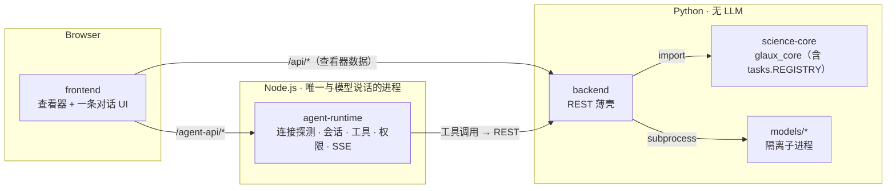

# 设计 · 退役 `orchestration/`

> **用途**：按奥卡姆剃刀清理仓库骨架——`orchestration/` 是 agent-runtime 出现之前建的"意图→任务"层，如今与参考智能体职责重叠。本文给出目标形态、把它拆成三块各归其位的方案、以及三阶段落地顺序。
> **日期**：2026-08-16 · **状态**：implemented（P1–P3 已落地，待验收） · **依据**：[纲领 §五](../roadmaps/charter.zh-CN.md)（智能体 = harness + 模型，Glaux 是 harness）· [仓库骨架总览](../architecture.zh-CN.md) · [SDD 00 参考智能体](../sdd/feats/00-reference-agent-conversations/README.md) · [SDD 02 智能体标注](../sdd/feats/02-agent-image-annotation/README.md) · 现状代码 `orchestration/glaux_orchestrator/*`、`backend/app/kernel.py`、`frontend/src/agent/useAgent.ts`
> **半衰期提醒**：本文引用的文件路径与行号对应 2026-08-16 的 `main`；P3 的触发条件绑定 SDD 02 的第一个工具落地，若 SDD 02 方向变化需复核 §5。

---

## 0. 一页纸

**问题**：`orchestration/`（`glaux_orchestrator`）把三件不同的事捆在一个包里，其中一件与参考智能体重复、一件放错了地方、一件在 agent-runtime 已经有 TypeScript 实现。副作用是 backend 主进程带着 `anthropic` SDK、前端存在两条聊天路径和两份连接状态。

**解法**：拆三块各归其位——

| 块 | 现位置 | 去向 | 理由 |
| --- | --- | --- | --- |
| **B. 任务注册表** `spec.TaskType/TaskSpec` + `tasks.py REGISTRY` | orchestration | **science-core** `glaux_core/tasks.py` | 它是"环境能做什么"的能力清单，只依赖 `glaux_core`；agent 的工具列表将来从这里生成 |
| **C. 模型连接探测** `vlm_providers.py`（ping / list_models / 视觉判定） | orchestration + backend `/intent/vlm/*` | **agent-runtime** `/agent-api/v1/connection/*` | agent-runtime 已用 pi-ai 构造同一套 provider；SDD 02 §8 已声明 VLM 调用与出站守卫都在 agent-runtime |
| **A. 意图解析** `intent.py`、`IntentResult/Scope`、`run.py` | orchestration + backend `/interpret` | **删除**，由 agent 的推理 + 工具调用取代 | 这是 agent 的本职；且现状它只是"闸门"不是路由（见 §1） |

**目标不变量**（本设计确立，现记录于[仓库骨架总览](../architecture.zh-CN.md)）：

- **只有 agent-runtime 与模型说话。** backend / science-core 不含任何 LLM SDK、不持有模型密钥、不发起对模型端点的请求。
- **能力清单单一事实源。** `glaux_core.tasks.REGISTRY` 是"环境能做什么"的唯一登记处；backend 端点、前端渲染、agent 工具都只读它。
- **前端一条对话路径。** 用户与智能体的所有交互都经 agent-runtime 的会话；不再有绕过会话直打 backend 的 NL 入口。

**不做**：改动 science-core 内核算法；改动 SDD 00 已冻结的会话/SSE 契约；实现 SDD 02 的三个标注工具（本设计只为它们腾地方）。

---

## 1. 现状（改造起点）

### 1.1 `orchestration/` 三块的真实用途

| 文件 | 被谁 import | 说明 |
| --- | --- | --- |
| `spec.py` `TaskType` / `TaskSpec` | backend `kernel.py` `api.py` `schemas.py`；`tasks.py` | 纯类型，跨任务共享 |
| `tasks.py` `REGISTRY` / `LIVER_KIDNEY_CLASSES` / `NUCLEI_CLASSES` / `plugin_to_view` | backend `kernel.py` `api.py` `dataset_ct.py` | 每个（模态, 任务）一行契约：适配器族、测量函数、面板度量、查看器、工具、overlay。**多模态脊柱**，无分支扩展的关键 |
| `spec.py` `IntentResult` / `Scope` + `intent.py`（`RuleBasedBackend` / `ClaudeVLMBackend` / `OpenAICompatVLMBackend`） | backend `kernel.py` `api.py`；`mock.py` 镜像其关键词表 | NL → 四态（in_scope / ambiguous / out_of_scope / chat）→ TaskSpec |
| `run.py` `run_spec` / `interpret_and_run` | **仅 orchestration 自身测试** | backend `kernel.py` 另有一份等价驱动逻辑；此文件已是死代码 |
| `vlm_providers.py` `AnthropicProvider` / `OpenAICompatProvider` / `make_provider` / 视觉启发式 | backend `kernel.py`（`/intent/vlm/test`、`/intent/vlm/models`）；`intent.py` | provider 探测：ping、列模型、按名/按 Ollama `/api/show` 判视觉能力 |

### 1.2 意图层只是闸门，不是路由

[useAgent.ts:25-60](../../frontend/src/agent/useAgent.ts)：前端把 NL 发给 `/interpret`，拿到 `scope`；若 `in_scope`，随后调用的是 `runCurrentTask(activeImage)`——**任务由当前模态决定，与 NL 内容无关**。NL 解析的全部产出是：拒绝 / 要求澄清 / 闲聊回复 / "请切换模态"提示。这正是一个通用 agent 在对话里天然会做的事。

### 1.3 前端两条聊天路径、两份连接状态

| 路径 | 入口 | 后端 | 状态存放 |
| --- | --- | --- | --- |
| 旧 | Workbench：`ActivityBar` Run 按钮、`TerminalView` | backend `/interpret` → `useAgent` | `store/session.ts` `connection`（provider / baseUrl / apiKey / model / models / lastTest） |
| 新（SDD 00） | Focus：`AgentConversation` / `FocusShell` → `useConversation` | agent-runtime `/agent-api/v1/sessions/*` | `store/agentSessions.ts` 以 `ConnectionInput` 随命令下发 |

`ConnectionConfig.tsx` 弹窗被两侧共用，但它的"测试连接 / 拉取模型"仍打 backend 的 `/intent/vlm/*`。

### 1.4 backend 因此背着的东西

- `pyproject.toml` 依赖 `anthropic>=0.40`——唯一用途是 A 与 C。
- `net_guard.py`（SSRF 守卫）——唯一调用点是 `api.py` 里的 VLM 探测端点。
- `mock.py` 里镜像意图关键词表的一段。

---

## 2. 目标形态

与 [架构总览](../architecture.zh-CN.md) 现图相比：`orchestration` 节点消失；`agent-runtime → backend` 出现（SDD 02 的工具调用通道）；Python 侧不再有任何模型出口。

### 2.1 各组件职责（收敛后）

| 组件 | 职责 | 明确不做 |
| --- | --- | --- |
| science-core | 环境底座：解码 · 标定 · 分割 · 测量 · 验证 · 产物 · 溯源；**任务注册表** | HTTP、LLM |
| backend | science-core 的 REST 薄壳（查看器数据 + agent 工具的执行面） | 意图解析、模型探测、持有模型密钥 |
| agent-runtime | 模型连接（配置 / 测试 / 列模型 / 视觉判定）、会话、工具注册与权限门控、SSE、出站守卫 | 科学计算 |
| frontend | 查看器 + 一条对话 UI + 连接配置 UI（调 agent-runtime） | 直接调用 backend 做 NL 相关的事 |

---

## 3. 详细方案

### 3.1 P1 · 任务注册表回 science-core

> ✅ **已完成（2026-08-16）**。`glaux_core/tasks.py` 落地（`TaskType` / `TaskSpec` / `REGISTRY` 及常量与
> `plugin_to_view`）；backend 六处 import 改路径；`orchestration/glaux_orchestrator/{spec,tasks}.py` 降为
> 兼容重导出；`run.py` 及其测试删除；`test_tasks.py` 迁入 science-core（+`TaskSpec` 校验用例）。
> 验证：science-core 167 ✓ · backend 156 ✓ · orchestration 8 ✓ · backend ruff 与基线持平。

**搬迁**：

| 从 | 到 |
| --- | --- |
| `orchestration/glaux_orchestrator/spec.py` 的 `TaskType`、`TaskSpec` | `science-core/glaux_core/tasks.py`（与 REGISTRY 同文件，避免为两个类型再开一个模块） |
| `orchestration/glaux_orchestrator/tasks.py` 全部 | `science-core/glaux_core/tasks.py` |
| `orchestration/tests/test_tasks.py` | `science-core/tests/test_tasks.py` |
| `orchestration/tests/test_spec.py` 中与 `TaskSpec` 校验相关的用例 | 并入 `science-core/tests/test_tasks.py`；意图相关用例随 P3 删除 |

**改 import**（backend 六处）：`kernel.py:56-65`、`api.py:331,406`、`dataset_ct.py:181`、`schemas.py` 文档引用；`glaux_orchestrator.spec/tasks` → `glaux_core.tasks`。

**删除**：`run.py`（死代码）。`config.py` 里挂 orchestration 到 `sys.path` 的逻辑暂留（P3 一并删）。

**边界注意**：`tasks.py` 已 import `glaux_core.*`，搬入后没有循环依赖；`TaskSpec` 里 `cubs_cf` / `roi` 等字段名保持不变（backend `schemas.py` 有同名 Pydantic 镜像）。

**验收**：`make test-backend`、science-core `pytest` 全绿；`grep -r glaux_orchestrator.spec\|glaux_orchestrator.tasks` 仅剩 `intent.py` 内部引用。

### 3.2 P2 · 模型连接探测搬到 agent-runtime

> ✅ **已完成（2026-08-16）**。agent-runtime 新增 `security/net-guard.ts`（移植 net_guard.py，含 IPv4/IPv6
> 分类）、`pi/connection-probe.ts`（移植 vlm_providers.py：anthropic 目录 / Ollama capabilities / 名称启发式）、
> `transport/connection-routes.ts`（`POST /agent-api/v1/connection/test|models`）；27 项单测覆盖守卫与三条视觉
> 判定路径。前端 `ConnectionConfig` 改调 `agentRuntimeApi.testConnection/listModels`；backend 删
> `/intent/vlm/*`、`kernel.vlm_test/vlm_models`、`ProbeRequest/TestResult/ModelListResult/VlmModelInfo`
> 与两份测试。**与原计划的两点偏差**：① provider 枚举**不改名**——前端 `toConnectionInput/toProbeInput`
> 已在边界做 `openai_compatible → openai-compatible` 映射，端点也接受两种拼法，改名只增风险；
> ② `backend/app/net_guard.py` **暂留**至 P3——`/interpret` 的 VLM 路径仍用它，随 `/interpret` 一起删。

**agent-runtime 新增两个端点**（对齐现有 `/agent-api/v1/sessions*` 风格）：

| 端点 | 入参 | 出参 |
| --- | --- | --- |
| `POST /agent-api/v1/connection/test` | `{ provider, base_url?, credential? }` | `{ ok, http_status?, reason, model_count? }` |
| `POST /agent-api/v1/connection/models` | 同上 | `{ models: [{ id, vision: "yes"\|"no"\|"unknown" }], reason? }` |

实现要点（移植自 `vlm_providers.py`，行为等价）：

- anthropic：用 pi-ai 已有的 `anthropicProvider()` 模型表判视觉（Claude 3+ 全系 yes；`claude-2/instant/1` no），列模型走 `GET {base_url}/v1/models`。
- openai-compatible：`GET {base_url}/models`；探到 Ollama（`{root}/api/version` 200）则逐模型查 `/api/show` capabilities；否则名称启发式（`_VISION_NAME_TOKENS` 表原样移植，**只判 yes 不判 no**）。
- 超时：连接 3s / 读 8s，与现状一致。
- 密钥只在请求内存里存活，经 `security/redact.ts` 保证不进日志（沿用 SDD 00 约束）。

**出站守卫移植**：`backend/app/net_guard.py` 的规则（私网 / fake-ip 拒绝、`GLAUX_VLM_ALLOW_FAKEIP` 放行开关等）移植为 agent-runtime `security/net-guard.ts`，两个新端点调用前把关。SDD 02 §8 本就要求"出站守卫（Node）对齐 net_guard"，此处提前兑现，后续 SAM API 客户端复用。

**前端**：

- `ConnectionConfig.tsx` 的 `vlmTest` / `vlmModels` 改调 `agent/runtime/client.ts` 新增的 `testConnection` / `listModels`。
- 连接状态**合并**：`store/session.ts` 的 `connection` 迁到 `store/agentSessions.ts`（或独立 `store/connection.ts`），形状对齐 `ConnectionInput`（`provider / model / base_url / credential / context_window / max_tokens`）+ UI 附加字段（`models` 缓存、`lastTest`）。`useAgent` 在 P3 删除前临时从新 store 读。
- provider 枚举值统一为 agent-runtime 的 `"anthropic" | "openai-compatible"`（现前端/后端用的是 `openai_compatible` 下划线，需一次性改名并处理 localStorage 旧值迁移）。

**backend 删除**：`/intent/vlm/test`、`/intent/vlm/models`（`api.py:135-157`）；`kernel.py` 里 `make_provider` 相关；`net_guard.py`（前端不再经 backend 探测）；`tests/test_vlm_providers.py`。`anthropic` 依赖此时还不能删（`ClaudeVLMBackend` 仍在），P3 删。

**验收**：ConnectionConfig 弹窗测试连接 / 拉模型走 `/agent-api/v1/connection/*`（浏览器 Network 面板无 `/api/intent/vlm/*`）；agent-runtime 单测覆盖 anthropic / OpenAI 兼容 / Ollama 三条视觉判定路径与守卫拒绝；backend `grep net_guard` 无结果。

### 3.3 P3 · 退役意图层与 `orchestration/`

> ✅ **已完成（2026-08-16）**。触发条件按 §5-Q1 以**过渡工具 `run_task`** 满足：agent-runtime 新增
> `pi/tools/run-task.ts`（封装 backend `POST /task/run`，结果放 `tool_execution_end.result.details`），
> `harness-registry` 挂工具集（`observe` 模式无工具，SDD 02 §7.3 首次接线）；prompt 命令新增可选
> `viewer` 上下文（`ViewerContext`：image_id / task / modality / method / cubs_cf / roi_box），系统提示词随之带上
> 当前图。前端 `useConversation.send` 随 prompt 下发 `toViewerContext()`，新增 `agent/toolBridge.ts` 把
> `run_task` 产出写回查看器（仅当 image_id 仍是当前活动对象）；删 `useAgent.ts`，ActivityBar Run →
> `reRunActiveModel()`，终端 `run <nl>` → 会话；`session.ts` 去掉 intentBackend(s)/lastScope。backend 删
> `/interpret`、`/intent/backends`、`kernel.interpret/intent_backends`、`mock.classify`、`net_guard.py`、
> `InterpretRequest/IntentResult/IntentBackendInfo/Scope`、`config.py` 的 orchestration sys.path、`anthropic` 依赖及
> 三份测试；新增不变量测试 `test_no_llm_sdk_loaded_in_main_process`。`orchestration/` 整目录删除。
> 验证：agent-runtime 62 ✓ · frontend 22 ✓（tsc/eslint 清） · backend 114 ✓（ruff 41 < 基线 42）· science-core 167 ✓。

**触发条件**：agent-runtime 已有第一个能触发任务执行的工具（SDD 02 的 `segment_region`/`propose_annotation`，或一个更小的过渡工具 `run_task(task, image_id)`——直接封装 backend `/task/run`）。在此之前 Workbench 的 NL 入口不能删。

**删除清单**：

| 层 | 删 |
| --- | --- |
| orchestration | 整个目录 |
| backend | `/interpret`、`/intent/backends`（`api.py:93-133`）；`kernel.py` 中 intent 相关；`mock.py` 意图关键词镜像；`schemas.py` 的 `InterpretRequest` / `IntentResult` / `IntentBackendInfo`；`config.py` 挂 orchestration 到 `sys.path` 的逻辑与 `GLAUX_ORCHESTRATION` 环境变量；`pyproject.toml` 的 `anthropic` 依赖；`tests/test_intent_vlm.py` |
| frontend | `agent/useAgent.ts`；`ActivityBar` Run 与 `TerminalView` 改为把文本投递到当前会话（`useConversation`）；`api/client.ts` 的 `interpret` / `intentBackends`；`store/session.ts` 的 `intentBackends` / `intentBackend` / `lastScope`；`api/types.ts` 对应类型 |
| docs | `architecture.zh-CN.md` 更新目录树与图；`backend/README.md` 去掉 orchestration 引用；`designs/2026-07-14-001-agent-connection-config` frontmatter 标 `status: superseded`（指向本文） |

**验收**：`make test` 全绿；`grep -r glaux_orchestrator` 无结果；Workbench 与 Focus 的 NL 输入都出现在同一个 agent 会话里。

---

## 4. 风险与对策

| 风险 | 对策 |
| --- | --- |
| P2 改 provider 枚举名（`openai_compatible` → `openai-compatible`）导致用户 localStorage 旧配置失效 | 前端 store 读取时做一次性映射；写回新值 |
| P2 视觉判定移植时行为漂移（Ollama 探测 / 启发式表） | 移植时把 `vlm_providers.py` 的注释与 `_VISION_NAME_TOKENS` 逐条对照；单测用同一组模型 id 断言 |
| P3 过早执行使 Workbench 短期没有 NL 入口 | 明确 P3 触发条件（§3.3）；必要时先加过渡工具 `run_task` |
| 出站守卫双实现期间（Python 与 Node 并存）规则不一致 | P2 完成即删 Python 版；Node 版单测覆盖 Python 版既有用例 |
| `TaskSpec` 搬家影响 backend `schemas.py` 的 Pydantic 镜像 | 字段名不动；仅改 import 路径 |

---

## 5. 开放问题

- [x] **Q1** P3 的过渡工具 `run_task` 是否值得做？——**已做**（2026-08-16）：SDD 02 仍为 `draft`，为避免 Workbench 空窗实现了最小版 `run_task`（见 §3.3 完成记录）；SDD 02 落地细粒度工具后由其取代。
- [ ] **Q2** 连接状态合并后的持久化：沿用 localStorage（现状）还是随 SDD 00 的会话元数据落 agent-runtime SQLite？本设计不改现状（localStorage），留给 SDD 00 后续修订。
- [ ] **Q3** `LIVER_KIDNEY_CLASSES` / `NUCLEI_CLASSES` 这类常量随 `tasks.py` 一起进 `glaux_core.tasks`，还是各归 `glaux_core.measurement.ct` / `.nuclei`？倾向前者（保持"注册表一处改"），评审时定。

---

## 6. 落地顺序（供后续 plan 展开）

1. **P1**（独立、机械）：搬注册表 → 改 import → 删 `run.py` → 跑测试。一个 PR。
2. **P2**（独立于 SDD 02）：agent-runtime 端点 + net-guard → 前端 ConnectionConfig 与 store 合并 → 删 backend 探测端点。可拆两个 PR（先加后删）。
3. **P3**（绑定 SDD 02 第一个工具）：删意图层与 `orchestration/`，更新文档。

P1、P2 建议现在开始；P3 在 SDD 02 进入 `implemented` 的同一迭代内完成。
