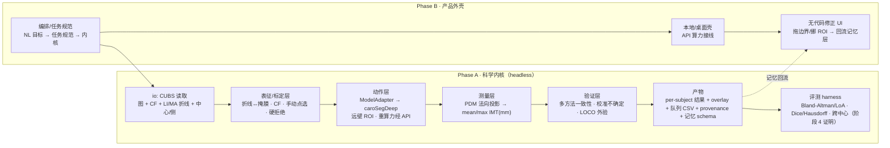

# feat: CUBS 颈动脉 IMT 首个楔子——分割→测量→验证端到端管线

> **用途**：把[第一份需求文档（CUBS IMT）](../brainstorms/20260705-01-cubs-imt-first-task.zh-CN.md)从 WHAT 落到 **HOW**——一份可动工的实现计划。
> **日期**：2026-07-05 · **深度**：deep（greenfield / 首个任务 / 跨环境四层）
> **依据**：[纲领](../roadmaps/charter.zh-CN.md) · [需求清单](../requirements.zh-CN.md) · [路线图 阶段 4](../roadmaps/20260705-product-roadmap.zh-CN.md) · [超声基准调研](../researches/20260705-02-research-ultrasound-benchmarks.zh-CN.md) · 2026-07-05 CUBS 技术调研（本计划新增）
> **半衰期提醒**：caroSegDeep 许可证 / CUBS CF 容器格式 / 依赖版本会变；动工前复核 §依赖 与 U2、U4 的 verify-first。

---

## 一、问题框定（Problem Frame）

这是 Glaux 的**第一个楔子**，也是路线图**阶段 4** 的验证：在公开的 **CUBS 颈动脉数据集**上跑通
`自然语言目标 → 分割 LI/MA 两条边界 → 量 ROI 内 IMT(mm) → 验证 → 结构化可复现产物`
的端到端闭环，作为环境四层（表征 / 动作 / 验证 / 记忆）的**首个实例**。

**它不是**：一个通用超声工具，也不是把大模型套个壳。它要证明的是纲领的核心命题——**护城河在环境，不在智能体**：正确的模态解码、带物理校准的确定性测量、可复现的验证底座、可复利的飞轮入口。§7 的成功标准**全部在 CUBS 上离线可测**，这决定了本计划的排序（先证科学内核，再包产品外壳）。

**关键技术事实**（本轮 CUBS 调研 + **2026-07-05 直接下载核对**坐实，直接决定模块设计）：

- **图像 = `.tiff` 灰度 B-mode**；主集文件名 `clin_XXXX_[L|R]`、技术集 `tech_XXX`；两中心（Cyprus 694 / Pisa 394）由临床 CSV **首列**编码。
- **边界 = 两行空格分隔 `.txt` 折线**（第 1 行 x=列坐标、第 2 行 y=深度），路径 `LIMA-Profiles/<method>/<id>-{LI,MA}.txt`，另有 `LIMA-Profiles-interpolated/`（每列一点）。**不是栅格掩膜、不是 .mat**——生成掩膜是我们的事，测量必须**曲线原生**。
- **CF = `CF/<id>_CF.txt`，每图一个纯文本标量**（如 `0.083300` mm/px；众数 0.060，范围 0.029–0.099）；`IMT = PDM(LI, MA) × CF`。临床 CSV **无 IMT、无 CF 列** → IMT 必须从边界+CF 算。
- 标注：主集 **4 位专家**——**A1**（金标准）、**A1′**（A1 一月后重描=观察者内）、**A2**（第二独立分析者=观察者间）、**A3**（每中心第三专家）；算法 5（2021）/ **7**（2022 技术集：CNR_IT / CREATIS / INESCTEC_PT / POLITO_IT / POLITO_UNET / TUM_DE / UCY_CY）+ `GT-FAMUS`（仿真已知 GT）。
- **官方 `Folds/f0..f4` 是随机 5 折、混合 clin+tech，非按中心分层**——leave-one-center-out 须**自建**按中心（CSV 首列）的分层切分。
- IMT 几何 = **Polyline Distance Method（PDM，法向投影 + 公共支撑）**，非欧氏、非 Hausdorff。
- 可集成模型 = **caroSegDeep**（CUBS 论文自带 CREATIS 基线，Keras，权重可下载，两段式：远壁检测 → IMC 分割 → LI/MA 曲线）。

---

## 二、范围边界（Scope Boundaries）

### 本计划之内（v0）
- **Phase A · 科学内核（headless）**：CUBS 读取与标定 → 分割动作（模型无关适配器 + caroSegDeep）→ PDM 测量 → 验证层（多方法一致性 + 校准不确定 + leave-one-center-out）→ 结构化产物 + provenance + 队列 CSV → **评测 harness（复现 CUBS 一致性指标，即阶段 4 证明）**。
- **Phase B · 产品外壳**：编排/任务规范层（NL/任务规范 → 内核）+ 本地/桌面壳（重算力经 API）+ 无代码修正 UI（拖边界 / 挪 ROI，回流记忆层）。

### 延后到后续工作（Deferred to Follow-Up，本产品之内、非本计划）
- 真实图完整标定链的鲁棒化：DICOM `SequenceOfUltrasoundRegions` 自动读取、屏幕标尺自动检测（v0 只做 **CUDS CF + 手动两点点选 + 硬拒绝**三档，DICOM/标尺自动化延后）。
- 纯本地 / WASM 轻算力兜底（"数据不出本机"严格场景）——v0 重算力走远程 API。
- 第二个适配器（nnU-Net / SAMUS 等）——接口留好，v0 只接 caroSegDeep。

### 延后（远期线，纲领「重建 / 更丰富表征」）
- **3D 建模 / 数字孪生**——CUBS 是 2D 纵切单平面，真 3D 需容积/多平面超声。可留意的低成本中间态：沿长轴渲染"管壁厚度剖面/带状图"的 2.5D 表征（记为未来轻量增强，非 v0）。
- 斑块、分叉 / ICA、近壁 IMT。

### 身份之外（永不做）
- 临床诊断 / 临床决策（研究非临床红线，见[纲领 §七](../roadmaps/charter.zh-CN.md)）。

---

## 三、关键技术决策（Key Technical Decisions）

1. **科学内核用 Python**（`science-core/`）。理由：可集成模型生态（caroSegDeep Keras、几何用 numpy）在 Python；同一套代码本地可跑、可部署为远程 API 承接重算力。（see origin: 需求 §4 产品形态）
2. **分割器"集成不自研"，且模型无关**：定义 `ModelAdapter` 接口，**caroSegDeep 作为首个适配器**，隔离在接口后，换/加模型成本低。（see origin: [纲领 §六 决策过滤器](../roadmaps/charter.zh-CN.md)）
3. **测量曲线原生，走 PDM**：LI/MA 以折线表征，IMT = 法向投影的公共支撑平均距离 × CF——**不塌缩成区域 IoU/掩膜面积**。确定性几何，不经 LLM 估值。
4. **标定三档 + 硬拒绝**：CUBS CF（已解决）→ 手动两点点选 → 硬拒绝；**绝不静默输出无标定的假 IMT**。DICOM/标尺自动化延后。
5. **验证层直接吃 CUBS 自带素材**：3 专家（A1/A1′/A2）建"观察者间/内包络"校准不确定；5–7 算法输出做多方法一致性；2 中心做 leave-one-center-out。
6. **先内核后外壳**：Phase A 全 headless 且以评测 harness 收口（阶段 4 指标可证），Phase B 再包桌面壳与修正 UI——即便外壳滑期，护城河指标仍可证。
7. **产物即 provenance**：每受试者结构化结果携带输入、模型版本、CF 来源、时间戳；记忆层捕获 `意图→流程→结果→人工校正→provenance` 用同一数据模型。

---

## 四、高层设计（High-Level Technical Design）

> 下图说明**意图上的数据流与模块边界**，是给评审校验方向的指引，**非实现规范**；实现智能体应把它当上下文，而非照抄的代码。



---

## 五、输出结构（Output Structure）

> 目标产出的目录形状（scope 声明，非约束；实现可微调）。各单元 `**文件**` 为权威清单。

```
science-core/
├── pyproject.toml
├── glaux_imt/
│   ├── io/            cubs.py（读取+CF）· boundaries.py（折线↔掩膜/表征）
│   ├── calibration/   calibration.py（三档来源 + 硬拒绝）
│   ├── segmentation/  base.py（ModelAdapter 接口）· carosegdeep.py（首个适配器）· roi.py（远壁 ROI）
│   ├── measurement/   pdm.py（Polyline Distance Method）
│   ├── verification/  consistency.py · uncertainty.py · crosscenter.py
│   ├── artifacts/     result.py（结果+provenance schema）· overlay.py · cohort.py（CSV）
│   └── memory/        capture.py（意图→…→校正 schema）
├── eval/              harness.py（复现 CUBS 一致性指标）
└── tests/             按模块镜像
orchestration/         glaux_orchestrator/（NL/任务规范 → 内核）   # Phase B
desktop/               src-tauri/ · src/（桌面壳 + 修正 UI）         # Phase B
```

---

## 六、实现单元（Implementation Units）

> U-ID 稳定，不因重排/拆分重编号。Phase A（U1–U8）是护城河脊柱且以评测收口；Phase B（U9–U11）包外壳。

### U1. 科学内核骨架与依赖

**目标**：建立 `science-core/` Python 包骨架、依赖、配置、lint/test 基座。
**需求**：需求 §4 产品形态（Python 内核）。
**依赖**：无。
**文件**：`science-core/pyproject.toml`、`science-core/glaux_imt/__init__.py`、各子包 `__init__.py`、`science-core/tests/__init__.py`、`science-core/README.md`。
**方法**：单包多模块；显式声明数值/图像依赖（numpy、scipy、Pillow/opencv、pandas）；caroSegDeep 的 TF/Keras 依赖隔离到 `segmentation` 可选 extra（避免整包强依赖旧 TF）。config 用简单数据类/TOML，不引重框架。
**遵循模式**：仓库现有中文文档头风格；标准 `src`-less 单包布局。
**测试场景**：Test expectation: none —— 纯骨架。
**验证**：`pip install -e .` 成功；空 `pytest` 通过；lint 干净。

---

### U2. CUBS 读取与标定加载 ✓ 格式已坐实

**目标**：把 CUBS Mendeley 下载解析成统一记录：图像数组 + 每图 CF + LI/MA 折线（按 A1/A1′/A2/A3 与各算法）+ 中心 + 侧（L/R）。
**需求**：需求 §5.1 表征层；成功标准依赖真实 GT。（see origin: 脑暴 §9#3——已于 2026-07-05 下载核对，格式确定）
**依赖**：U1。
**文件**：`science-core/glaux_imt/io/cubs.py`、`science-core/tests/io/test_cubs.py`、`science-core/tests/fixtures/`（几条脱敏样本 / 合成 CUBS 式样本）。
**已坐实的磁盘格式**（照此写解析，无需再猜）：
- 图像：`IMAGES/<id>.tiff`（灰度）；主集 `clin_XXXX_[L|R]`、技术集 `tech_XXX`。
- CF：`CF/<id>_CF.txt` = 单个浮点标量（mm/pixel），逐图一文件。
- 边界：`LIMA-Profiles/<method>/<id>-{LI,MA}.txt` = **两行**空格分隔浮点（行1=x/列、行2=y/深度）；`method` ∈ {Computerized-CNR_IT, -CREATIS, -INESCTEC_PT, -POLITO_IT, -POLITO_UNET, -TUM_DE, -UCY_CY, GT-FAMUS, Manual-A1, Manual-A2, (主集另有 A1′、A3)}；`LIMA-Profiles-interpolated/` 同构、已插值到每列一点。
- 中心：临床 CSV（**分号分隔 + 逗号小数**）首列（"Nicolaides - Cyprus" / Pisa）；`Patient ID` = `clin_XXXX`；**无 IMT、无 CF 列**。
- 切分：`Folds/f0..f4/{Train,Val,Test}List.txt`（随机 5 折、混 clin+tech，**非按中心**）。
**方法**：解析文件名 → subject_id + side；载入 CF 标量；边界读成 (x[],y[]) 折线（插值统一到每列一点放 U3）；中心从 CSV 首列映射；缺失某专家/算法标注不崩，记为缺席。
**遵循模式**：[caroSegDeep](https://github.com/nl3769/caroSegDeep) 对同目录/同 .txt 折线约定的读取与插值。
**测试场景**：
- happy：给定样本目录 → 记录列表，每条含 image、cf(float)、boundaries{A1,A1′,A2,A3,algos...}、center、side。
- edge：缺 A3 标注的图（如技术集仅 A1/A2）→ 该条 boundaries 标缺席，不抛异常。
- error：CF 文件缺失/不可解析 → 抛 `CalibrationUnavailable`（喂给 U3 硬拒绝），不静默置 0。
- format：两行 .txt 正确解析为等长 x/y 数组；行长不等 → 明确报错。
- integration：`clin_0006_R.tiff` → subject=0006, side=R；中心由 CSV 首列正确区分。
**验证**：在真实 CUBS 子集上列出 N 条记录，CF/边界/中心字段非空且量纲合理（CF∈[0.02,0.1]，实测样本 0.0833）。

---

### U3. 表征与标定层

**目标**：统一边界表征（折线↔掩膜、插值到每列一点、公共支撑）+ 标定三档来源与硬拒绝。
**需求**：需求 §5.1；决策 #3/#4；脑暴 §5.1、§9#1。
**依赖**：U2。
**文件**：`science-core/glaux_imt/io/boundaries.py`、`science-core/glaux_imt/calibration/calibration.py`、`science-core/tests/io/test_boundaries.py`、`science-core/tests/calibration/test_calibration.py`。
**方法**：
- boundaries：折线→栅格掩膜、掩膜→折线（供集成掩膜模型时反解）、shape-preserving 分段三次插值到每列一点、抽取 LI/MA 的**公共 x 支撑**（PDM 前置）。
- calibration：`resolve_cf(source)` 三档——① CUBS per-image CF；② 手动两点点选（已知标尺间距 → 算 CF）；③ 都无 → 抛 `HardReject`。留 DICOM/标尺自动检测的接口位（延后实现）。
**技术设计（指引，非规范）**：`CalibrationResult{cf: float, source: Enum(CUBS|MANUAL_CLICK|DICOM|RULER), provenance}`；`HardReject` 携带原因，绝不返回无标定结果。
**测试场景**：
- happy：折线→掩膜→折线 round-trip 在容差内；公共支撑正确裁出重叠 x 区间。
- edge：LI/MA 的 x 支撑不同 → 只在公共段量。
- calibration happy：CUBS CF 存在 → 直接用，source=CUBS。
- calibration fallback：无 CF + 两点点选（已知间距）→ 算出 CF，source=MANUAL_CLICK。
- calibration error：无 CF 且无点选 → 抛 `HardReject`（断言绝不静默输出）。
**验证**：round-trip 误差 < 亚像素阈；三档路径各有测试覆盖，硬拒绝路径确证无静默输出。

---

### U4. 分割动作层——模型无关适配器 + caroSegDeep + 远壁 ROI

**目标**：定义 `ModelAdapter` 接口，接入 caroSegDeep 输出 LI/MA 曲线；远壁 CCA ROI 自动检测；重算力经远程 API 可选路由。
**需求**：需求 §3.2/§5.2；决策 #2；脑暴 §5.2。
**依赖**：U3。
**文件**：`science-core/glaux_imt/segmentation/base.py`、`carosegdeep.py`、`roi.py`、`science-core/tests/segmentation/test_base_contract.py`、`test_carosegdeep.py`、`test_roi.py`。
**方法**：
- `base.ModelAdapter`：`segment(image, roi) -> {LI: polyline, MA: polyline, meta}`；契约测试用假适配器。
- caroSegDeep 适配器：封装其两段式（FW 检测 U-Net → IMC 分割 U-Net），加载 Dropbox 权重（`FW_custom_dilated_unet.h5`、`IMC_custom_dilated_unet.h5`），输出两条曲线（每列一点）。**隔离 TF/Keras 依赖**；权重路径/版本入 provenance。
- roi：远壁 CCA + ~1cm 段自动检测（可复用 caroSegDeep FW 段）；接受外部 ROI 覆盖（供 Phase B 微调）。
- 远程算力：适配器可指向远程 API 端点（本地不强依赖 GPU）；接口对本地/远程透明。
**技术设计（指引）**：`SegmentationRequest{image, roi, compute: LOCAL|REMOTE}` → `SegmentationResult{LI, MA, model_version, roi_used}`。
**遵循模式**：[caroSegDeep](https://github.com/nl3769/caroSegDeep) 的 FW→IMC 两段式与 4 点 ROI 初始化约定。
**测试场景**：
- 契约：假适配器满足接口，返回两条折线；缺 ROI 时走自动检测。
- caroSegDeep：给样本图返回两条曲线，形状=每列一点，落在远壁带内（若权重/环境不具备则标 skip 并在验证里说明）。
- roi happy：自动检测返回合理远壁带；外部 ROI 覆盖被尊重。
- error：模型/API 失败 → 抛错并携带上下文，**不返回静默空曲线**。
- remote：`compute=REMOTE` 走 mock 端点，契约一致。
**验证**：接口契约测试通过；caroSegDeep 在真实样本上产出可视化合理的 LI/MA；远程路径 mock 通过。

---

### U5. 测量层——Polyline Distance Method

**目标**：从 LI/MA 折线 + CF 确定性地算 mean/max IMT(mm)。
**需求**：需求 §5.3；决策 #3；成功标准 §7 测量准确。
**依赖**：U3（公共支撑、CF）。
**文件**：`science-core/glaux_imt/measurement/pdm.py`、`science-core/tests/measurement/test_pdm.py`。
**方法**：PDM——对一条曲线上每点，取到另一曲线线段的**法向投影距离**，在公共支撑上平均得 mean，取极值得 max，× CF 转 mm。纯函数、可复现、不经 LLM。显式区别于欧氏/Hausdorff。
**技术设计（指引）**：`imt(LI, MA, cf) -> {mean_mm, max_mm, per_column_um}`；实现须与 CUBS 论文的 PDM + 公共支撑一致（否则 bias 不可比）。
**测试场景**：
- happy：两条相距 d 像素的平行合成线 + 已知 CF → mean≈max≈d·CF（解析值容差内）。
- known-geometry：倾斜/弯曲边界 → PDM 法向投影结果匹配解析值。
- PDM≠EDM：在倾斜用例上，PDM 与朴素欧氏点对点结果不同，证明确为法向投影。
- edge：单列重叠 / 空 ROI → 定义化行为（抛或返回 NaN 标记，不静默 0）。
- Covers §7：用 A1 金标准边界 + 其 CF 复算 IMT，与数据集期望值在取整误差内一致。
**验证**：合成几何全部命中解析值；A1 复算 IMT 与预期吻合。

---

### U6. 验证层——一致性 · 校准不确定 · 跨中心

**目标**：多方法一致性 / 分歧暴露；用 3 专家建包络校准不确定；leave-one-center-out 外部验证。
**需求**：需求 §3.3/§5.4；决策 #5；成功标准 §7 泛化/不确定；脑暴 §5.4。**这是本楔子重心。**
**依赖**：U5。
**文件**：`science-core/glaux_imt/verification/consistency.py`、`uncertainty.py`、`crosscenter.py`、`science-core/tests/verification/test_*.py`。
**方法**：
- consistency：对同图的 N 个方法输出（我们的 + CUBS 5–7 算法）算逐点/整体一致度，高方差区标记。
- uncertainty：用 A1/A1′（观察者内）与 A1/A2（观察者间）建"专家分歧包络"；把预测分类 confident/unsure；在留出集上确保 **confident 子集误差 < unsure 子集误差**（校准可信）。
- crosscenter：中心 1 校准/拟合、中心 2 评估，报告差距。**注意：官方 `Folds` 是随机 5 折、非按中心**——leave-one-center-out 须**自建**按临床 CSV 首列（Cyprus / Pisa）的中心分层切分，勿直接套官方 fold。
**测试场景**：
- consistency：给 N 组输出 → 一致图 + 分歧热点；构造一个离群方法被标记。
- uncertainty happy：confident 子集平均绝对误差显著低于 unsure 子集（合成 + 真实各一）。
- crosscenter：LOCO 跑通，产出中心间 bias 差距表；fold 划分被正确使用。
- provenance：每次验证记录方法集、包络来源、划分。
**验证**：校准分流在留出集上成立（confident<unsure）；LOCO 表可复现。

---

### U7. 产物 · provenance · 记忆捕获 schema

**目标**：每受试者结构化结果 + overlay + 队列 CSV + provenance，并定义记忆层 `意图→流程→结果→校正→provenance` 数据模型（回流入口）。
**需求**：需求 §5.5/§5.6；决策 #7；脑暴 §5.5/§5.6。
**依赖**：U5、U6。
**文件**：`science-core/glaux_imt/artifacts/result.py`、`overlay.py`、`cohort.py`、`science-core/glaux_imt/memory/capture.py`、`science-core/tests/artifacts/test_*.py`、`tests/memory/test_capture.py`。
**方法**：
- result：per-subject `{mean_mm, max_mm, confidence, boundaries_ref, roi, provenance{inputs, model_version, cf_source, params, created_at}}`（时间戳由调用方注入，不在纯函数内取时钟）。
- overlay：原图 + LI/MA + ROI 叠加渲染。
- cohort：每受试者一行的稳定列 CSV。
- memory.capture：把一次运行的意图/流程/结果/人工校正/provenance 结构化落盘，校正事件可挂到某结果（供 Phase B U11 回流）。
**测试场景**：
- result：序列化/反序列化 round-trip；provenance 字段齐全。
- cohort：多受试者 → CSV 行数/列稳定，量纲正确。
- overlay：渲染产物含 LI/MA/ROI（像素级 smoke）。
- memory：capture round-trip；一个 correction 事件正确关联到目标 result。
**验证**：跑一小批 CUBS 受试者 → 得 overlay + 一张队列 CSV + 完整 provenance；memory schema 可承载校正回流。

---

### U8. 评测 harness（阶段 4 证明）

**目标**：复现 CUBS 一致性指标——Bland-Altman(bias+LoA)、逐边界 Dice/Hausdorff、跨中心表——作为阶段 4 的可发表证明。
**需求**：成功标准 §7 全项量化；脑暴 §7。
**依赖**：U6、U7。
**文件**：`science-core/eval/harness.py`、`science-core/tests/eval/test_harness.py`、`science-core/eval/README.md`（结果解读）。
**方法**：对某方法 vs A1 金标准算 Bland-Altman bias + 95% LoA（µm）、逐边界 Dice/Hausdorff、LOCO 跨中心表；对齐 CUBS 论文的 PDM + 公共支撑口径。以调研的已发布数为 sanity（caroSegDeep ~106±89µm；观察者内 160±140µm、观察者间 194±177µm）。
**测试场景**：
- happy：给合成"完美"预测 → bias≈0、Dice≈1；给已知偏移预测 → bias≈偏移量（验证度量正确）。
- sanity：caroSegDeep 在 CUBS 子集上的绝对 bias 落在已发布量级附近（宽容窗，环境具备时才跑）。
- 输出：Bland-Altman 数值 + Dice/Hausdorff + 跨中心表齐备。
**验证**：度量在合成 GT 上自证正确；真实子集产出与 §七成功阈对照的报告。

---

### U9. 编排 / 任务规范层（Phase B）

**目标**：NL 目标 → 结构化任务规范 → 驱动内核端到端；把 agent 意图理解列为独立评测面。
**需求**：需求 §2 主用例；脑暴 §9#5（agent 意图是独立失败面）。
**依赖**：U8（内核成立后再包编排）。
**文件**：`orchestration/glaux_orchestrator/spec.py`、`run.py`、`orchestration/tests/test_spec.py`、`orchestration/tests/intent_cases.md`（意图评测小集）。
**方法**：先定**结构化任务规范**（明确、可复现）作为内核入口；NL→规范做**薄映射**（v0 可模板化，聚焦规范用例"测远壁 CCA IMT"）。agent 意图理解另建小评测集，与分割 CV 解耦。
**测试场景**：
- happy：任务规范 → 内核在一张图上端到端跑通产出结果。
- NL happy：规范 NL 目标 → 正确任务规范（远壁 CCA IMT）。
- intent（独立面）：小意图集上映射正确率有基线数（歧义/超范围请求被识别，非静默错跑）。
**验证**：规范驱动 e2e 通过；NL→规范在 canonical 用例成立；意图评测有基线。

---

### U10. 本地 / 桌面壳 + API 算力接线（Phase B）

**目标**：本地/桌面壳加载图、触发内核（本地或远程 API），重算力经 API；如实提示"数据离开本机"。
**需求**：需求 §4 产品形态；决策 #1/#6；脑暴 §6。
**依赖**：U9。
**文件**：`desktop/src-tauri/`、`desktop/src/`、`desktop/README.md`、`desktop/tests/`（e2e smoke）。
**方法**：Tauri 式桌面壳（本地壳 + web UI），调用 `science-core`（本地进程或远程 API）；重算力（分割/大模型）路由远程端点，本地跑轻胶水；显式"数据出本机"告知（需求 §4 开放问题）。
**测试场景**：
- integration：壳启动 → 加载一张图 → 触发管线 → 显示 IMT + overlay。
- remote：重算力路由到远程 API（mock/stub），本地不依赖 GPU。
- privacy：触发远程算力前展示"数据离开本机"提示。
- Test expectation：以 e2e/集成 smoke 为主，单元轻。
**验证**：桌面壳端到端出一次 IMT 结果；远程算力路径可用；隐私提示出现。

---

### U11. 无代码修正 UI（Phase B）

**目标**：B 拖 LI/MA 控制点 / 挪 ROI（非脚本）修正，IMT 确定性重算，事件回流记忆层；对象级接受/拒绝。
**需求**：需求 §3.2 无代码修正（刚需）；脑暴 §5.2；决策 #7。
**依赖**：U10、U7（记忆 schema）。
**文件**：`desktop/src/correction/`、`desktop/tests/test_correction.*`。
**方法**：交互式拖动边界控制点 → 触发 U5 重算 IMT；移动/缩放 ROI → 重定测量范围；每次校正作为事件写入 U7 记忆层；结果对象级接受/拒绝（非像素级判对错）。
**测试场景**：
- happy：拖一个 LI 控制点 → 边界更新 → IMT 确定性重算。
- ROI：移动/缩放 ROI → 测量范围随之更新。
- memory：一次校正 → 事件按 U7 schema 落盘并关联该结果。
- accept/reject：对象级接受/拒绝被记录，影响队列产物。
**验证**：拖动→重算→回流闭环跑通；校正事件成为可回流数据资产。

---

## 七、成功指标（Success Metrics，量化 §7）

| 维度 | 阈值（据 CUBS 调研） |
| --- | --- |
| **测量准确** | CIMT 绝对 bias **≤ 160 µm**（落入观察者内 LoA），理想 **≤ 110 µm**（CREATIS_FR 级）；Bland-Altman signed bias ≤ 0.07 mm |
| **边界质量** | 逐边界 Dice **≥ 0.77**（LI/MA 区域代理），Hausdorff 报告并对标 |
| **跨中心泛化** | LOCO 外验：中心间 bias 差距有界（具体窗口 harness 出数后定，先报告差距） |
| **不确定可信** | confident 子集平均绝对误差 **显著低于** unsure 子集（校准分流成立） |
| **信任/切换（定性）** | 一个真实 B 在自有数据子集"低风险试一把"后愿意继续用 |

---

## 八、备选方案（Alternatives Considered）

- **自研分割器** —— 否。违反[纲领 §六](../roadmaps/charter.zh-CN.md)"集成不自研"；且 caroSegDeep 已是 CUBS 原生基线。
- **区域分割 + 掩膜 IoU 口径** —— 否。IMT 本质是两条近平行薄界面的**间距**，须曲线原生 + PDM；掩膜 IoU 会丢掉亚毫米间距这一临床量。
- **桌面优先 / 先做 UI** —— 否。§7 全部离线可测；先证科学内核（U1–U8）再包外壳，避免外壳滑期拖累护城河证明。
- **纯云 MVP** —— 否（用户已拍板）。MVP 本地/桌面 + API 算力；云仅可选部署目标。
- **SAM 系（UltraSam/SAMUS/MedSAM2）直接做 LI/MA** —— 暂否。调研确认存在真实结构错配（单区域掩膜 vs 双薄界面间距），无现成先例；留作 `ModelAdapter` 后续适配实验，非 v0 主路径。

---

## 九、依赖 / 前置（Dependencies / Prerequisites）

- **CUBS 下载**（CC BY 4.0，✅ 2026-07-05 已核对格式）：[fpv535fss7](https://data.mendeley.com/datasets/fpv535fss7/1)（主，2176 图 tiff + CF/ + SEGMENTATIONS/ + 临床 CSV，4 专家）+ [m7ndn58sv6](https://data.mendeley.com/datasets/m7ndn58sv6/1)（技术集 `DATASET_CUBS_tech.zip` 132MB，含 readme-tech、7 算法 + GT-FAMUS 仿真已知 GT + Folds）。公开 API 文件列表：`https://data.mendeley.com/public-api/datasets/<id>/files?folder_id=root&version=1`。
- **caroSegDeep**：[repo](https://github.com/nl3769/caroSegDeep) + Dropbox 权重（`FW_*`, `IMC_*` .h5）；companion [arXiv:2201.12152](https://arxiv.org/abs/2201.12152)。
- **Python 环境**：numpy/scipy/pandas/Pillow(或 opencv)；caroSegDeep 侧 TF/Keras（旧版，建议容器化隔离）。

---

## 十、风险与缓解（Risk Analysis & Mitigation）

| 风险 | 影响 | 缓解 |
| --- | --- | --- |
| **caroSegDeep 无许可证文件（默认 all-rights-reserved）** | 研究评测大概率可用；**随产品发行需作者授权** | 隔离在 `ModelAdapter` 后；联系作者确认授权；备选 nnU-Net/其他适配器 |
| ~~CUBS CF/边界格式未证实~~ | ~~解析器返工~~ | ✅ **已解除**（2026-07-05 下载核对）：CF=`CF/<id>_CF.txt` 标量、边界=两行 .txt 折线、图=.tiff、主集 4 专家、官方 Folds 非按中心——均写入 U2 |
| **caroSegDeep 为旧 Keras/TF（2022）** | 依赖/维护脆弱 | TF 依赖设为可选 extra + 容器化；内核其余部分不依赖 TF |
| **曲线原生被误塌缩成掩膜口径** | IMT bias 与已发布不可比 | 测量固定 PDM + 公共支撑；U8 以合成 GT 自证度量正确 |
| **远程 API = 数据出本机** | 隐私/合规 | 显式告知（U10）；纯本地/WASM 兜底列入延后 |
| **agent 意图理解是独立失败面** | 分割 CV 测不到"听懂 B 的人话" | U9 独立意图评测集，与 CV 解耦 |

---

## 十一、分阶段交付（Phased Delivery）

- **Phase A（护城河脊柱，headless）**：U1 → U2 → U3 → U4 → U5 → U6 → U7 → **U8（阶段 4 证明收口）**。到 U8 即可回答"环境是否成立、指标是否达标"。
- **Phase B（产品外壳）**：U9 → U10 → U11。把已证内核包成 B 能用的本地/桌面 + 无代码修正闭环。

> 排序铁律：**Phase A 先行且可独立收口**；Phase B 即便滑期，护城河指标已在 U8 证明。

---

## 变更记录

- **2026-07-05**：v1。由[CUBS IMT 需求文档](../brainstorms/20260705-01-cubs-imt-first-task.zh-CN.md)经 ce-plan 导出；新增 CUBS 技术调研，坐实边界=折线/CF=每图标量/PDM 几何/caroSegDeep 为首个适配器，并据此量化 §7 成功阈；确立"先科学内核后产品外壳"的两阶段排序。
- **2026-07-05**：v1.1。**直接下载 CUBS 两个 Mendeley 包核对磁盘格式**，解除 U2 的 verify-first 风险：确认图=.tiff、CF=`CF/<id>_CF.txt` 标量、边界=两行 .txt 折线、主集 4 专家（含 A3）、官方 Folds 随机非按中心（LOCO 须自建中心分层）。U2/U6、Problem Frame、风险表、依赖同步更新。
