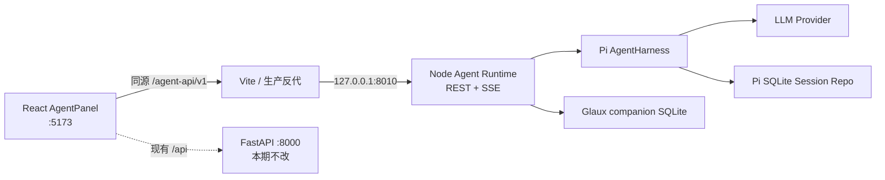
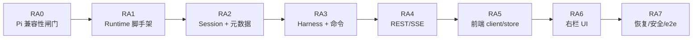

# 实现计划 · 内置参考 Agent 与本地会话管理

> **用途**：把[《内置参考智能体与本地会话管理》SDD](../sdd/feats/00-reference-agent-conversations/README.md)
> 拆成可逐项执行、验证和提交的实现任务。
>
> **日期**：2026-07-27 · **类别**：plan（ce-plan 风格） · **状态**：ready
>
> **范围**：第一阶段只交付右侧 Agent Dock 内的持续对话与本地会话管理。Pi 提供 Agent harness、Session、
> 消息树、停止和上下文压缩；Glaux 只建设 Node sidecar、薄 REST/SSE 适配层和产品 UI。
>
> **完成线**：用户可新建、搜索、切换、重命名、归档、恢复、删除会话，流式对话可停止和重新生成；
> 刷新前端或重启 Runtime 后，可从 Pi SQLite Session Storage 恢复活动路径和压缩结果。

---

## 1. 实施边界

### 1.1 本期目标

- 在现有右侧 `340px` Agent Dock 内完成现代 AI 对话和会话管理。
- 使用 `@earendil-works/pi-agent-core` 的 `AgentHarness`，不自行实现 Agent 循环。
- 使用 `@earendil-works/pi-storage-sqlite-node` 持久化 Pi Session，不自建消息、Run、摘要或事件表。
- 用独立 Node sidecar 暴露 SDD §6.3 的 `/agent-api/v1` REST/SSE 契约。
- 保留现有 Provider、Model、Base URL、API Key 配置入口；credential 仅随单次生成命令进入 Runtime 内存。
- 权限模式支持 `observe`、`suggest`、`controlled`、`autonomous` 四级持久化与展示，默认
  `controlled`；本期不执行工具。

### 1.2 明确不做

- 不提供会话分支、替代回答比较、历史消息编辑或“编辑后重发”。
- 不把 `/task/*`、影像上下文、人工校正、批量运行、数据外发接成 Agent 工具。
- 不使用实验性的 `@earendil-works/pi-server`，不引入完整 `pi-coding-agent`。
- 不修改 Python FastAPI、`science-core`、`orchestration` 的现有行为。
- 不建设新密钥系统；沿用当前浏览器本地配置，Runtime 和数据库不得保存 credential。
- 不将当前 Agent 实现固化为 Glaux 唯一入口；外部 Agent 接入另立 Feature。

### 1.3 SDD 不变量

1. Pi Session/Harness 是 transcript、活动 leaf、分支、phase 和 compaction 的唯一事实来源。
2. Glaux companion database 只保存 SDD §9.1 的标题、状态、权限模式和时间字段。
3. SSE 只有 `snapshot`、`pi.event`、`adapter.error` 三种事件；Pi 事件载荷不改名。
4. 同一 Session 同时至多运行一个 Harness 操作；不同 Session 可以并发。
5. 切换会话不触发 `abort()`；停止按钮才调用 Pi `abort()`。
6. Pi API 或事件与锁定版本不兼容时停止实施并修订 SDD，不用私有 API 兜底。

---

## 2. 当前状态证据

| 证据 | 当前状态 | 对计划的约束 |
| --- | --- | --- |
| [`Shell.tsx:33`](../../frontend/src/components/Shell.tsx#L33) | AgentPanel 已注册为右侧 Dock；默认宽度由同文件的布局构建保持为 `340px` | 只替换面板内部，不改 Dock 拓扑和持久化键 |
| [`tokens.css:53`](../../frontend/src/styles/tokens.css#L53) | `--agent-w: 340px` | 新 UI 必须在窄栏可用，不扩成全屏工作区 |
| [`AgentPanel.tsx:335`](../../frontend/src/components/AgentPanel.tsx#L335) | 面板把连接配置、任务卡、消息和单行输入混在一个文件中 | 先提取连接配置，再替换对话区域，降低回归面 |
| [`AgentPanel.tsx:342`](../../frontend/src/components/AgentPanel.tsx#L342) | Composer 直接调用现有 `useAgent().run()` | 新会话 Composer 改调 Agent Runtime；原领域任务 Hook 暂时保留 |
| [`useAgent.ts:17`](../../frontend/src/agent/useAgent.ts#L17) | 当前消息是 `/interpret` → `/task/*` 的一次性领域任务流程 | 不把它误当作 Pi 会话，也不在本期删除领域执行能力 |
| [`session.ts:191`](../../frontend/src/store/session.ts#L191) | 对话消息只存在当前 Zustand 内存 | 新增独立会话 store；不把 Pi transcript 复制进 localStorage |
| [`session.ts:224`](../../frontend/src/store/session.ts#L224) | 连接配置写入 `glaux.connection`；API Key 当前也随之本地保存 | 前端配置行为暂不迁移，命令发送时临时注入，服务端全面脱敏 |
| [`client.ts:41`](../../frontend/src/api/client.ts#L41) | 现有 API 客户端只面向 FastAPI `/api` | 新增独立 `/agent-api/v1` 客户端，不污染领域 API 类型 |
| [`vite.config.ts:46`](../../frontend/vite.config.ts#L46) | 开发代理只有 `/api → :8000` | 新增 `/agent-api → 127.0.0.1:8010`，保持浏览器同源和现有 CSP |
| [`Makefile:8`](../../Makefile#L8) | `make dev` 只启动 FastAPI 与 Vite | 增加第三个 `agent-runtime` 目标，文档改为 `make -j3 dev` |
| [`frontend/package.json:7`](../../frontend/package.json#L7) | 前端没有测试脚本或测试依赖 | 增加最小 Vitest/Testing Library 基座，覆盖 store、SSE 和关键 UI 状态 |
| [`.gitignore:38`](../../.gitignore#L38) | 只覆盖现有 Node/前端产物 | 忽略 Runtime 本地数据目录和构建产物，SQLite 文件不得入库 |

---

## 3. 目标结构与进程边界

```text
open-glaux/
├── agent-runtime/
│   ├── package.json
│   ├── package-lock.json
│   ├── tsconfig.json
│   ├── src/
│   │   ├── index.ts
│   │   ├── config.ts
│   │   ├── contracts.ts
│   │   ├── pi/
│   │   │   ├── compatibility.ts
│   │   │   ├── harness-registry.ts
│   │   │   ├── session-service.ts
│   │   │   └── command-service.ts
│   │   ├── storage/
│   │   │   └── glaux-meta-repo.ts
│   │   ├── transport/
│   │   │   ├── server.ts
│   │   │   ├── routes.ts
│   │   │   └── sse-broker.ts
│   │   └── security/
│   │       └── redact.ts
│   └── tests/
│       ├── compatibility/
│       ├── contract/
│       ├── integration/
│       └── security/
├── frontend/src/
│   ├── agent/runtime/{client,events,types}.ts
│   ├── agent/useConversation.ts
│   ├── store/agentSessions.ts
│   └── components/agent/
│       ├── AgentConversation.tsx
│       ├── ConnectionConfig.tsx
│       ├── ConversationComposer.tsx
│       └── SessionDrawer.tsx
└── docs/runbooks/reference-agent-conversations.md
```

进程与数据流：



实现约束：

- Runtime 固定只监听 `127.0.0.1`；默认端口为 `8010`，仅 `GLAUX_AGENT_PORT` 可覆盖。
- `/agent-api/v1` 是 Runtime 自身路由前缀；Vite 代理不重写语义路径。
- `GLAUX_AGENT_DATA_DIR` 指定数据目录；开发默认使用仓库根 `.glaux/agent/`，测试必须使用临时目录。
- HTTP 层使用 Fastify；Glaux companion database 使用 Node 22.19+ 内置 `node:sqlite`，不复用或扩展
  Pi Storage 的数据库连接。
- Pi Session database 与 `glaux-meta.sqlite` 分文件；Glaux 代码不得查询 Pi 数据库内部表。
- Runtime 使用独立 `agent-runtime/package-lock.json`；三个 Pi 包在 `package.json` 中写精确版本，不用
  `^` 或 `~`。

---

## 4. 实施单元

> 任务 ID `RA*` 稳定；每个任务完成时运行列出的验证并独立提交。除 `RA0` 外，不允许为了“先跑起来”
> 绕过锁定版本 Pi 的公开 API。

### RA0 · Pi 兼容性探针与版本闸门

**目的**：在写产品代码前证明 SDD 依赖的 Pi 能力真实存在，并冻结精确版本。

**新增**

- `agent-runtime/package.json`
- `agent-runtime/package-lock.json`
- `agent-runtime/tsconfig.json`
- `agent-runtime/src/pi/compatibility.ts`
- `agent-runtime/tests/compatibility/pi-public-api.test.ts`

**修改**

- `.gitignore`：加入 `agent-runtime/dist/`、`.glaux/` 和 Runtime 覆盖率产物。

**实施**

1. 建立 Node 22.19+、TypeScript、ESM 的最小包；测试采用 Vitest。
2. 安装并精确锁定：
   `@earendil-works/pi-agent-core`、`@earendil-works/pi-ai`、
   `@earendil-works/pi-storage-sqlite-node`。
3. 兼容性测试只调用公开导出，证明：
   - 可创建/打开/列出/删除指定 UUID 的 SQLite Session；
   - 可创建带 Session 的 `AgentHarness` 并订阅事件；
   - `prompt()`、`abort()`、`shouldCompact`、`compact()` 和 tree navigation 可调用；
   - Session 重开后活动路径、custom entry 和 compaction entry 可恢复；
   - SQLite migration 由官方 repo 自动处理；
   - `glaux.command.*` custom entry 在不注册 projector 时不进入模型上下文。
4. 记录当前前端 `anthropic`、`openai_compatible` 到 Pi provider/model 构造参数的集中映射，并用
   fake transport 验证；不得把前端枚举散落到 Harness 代码。
5. 用受控 fake provider/fake stream 完成测试，不依赖真实 API Key 或网络。
6. 测试显式断言所需事件名和关键字段；若失败，停止在 `RA0`，先修订 SDD §6、§7、§9 或 §15。

**验证**

```bash
cd agent-runtime
npm ci
npm test -- tests/compatibility/pi-public-api.test.ts
npm ls @earendil-works/pi-agent-core @earendil-works/pi-ai @earendil-works/pi-storage-sqlite-node
```

**完成标准**

- 三个 Pi 包均为精确解析版本。
- 依赖树中不存在 `@mariozechner/pi-agent-core` 和 `@earendil-works/pi-server`。
- 兼容性报告覆盖 SDD §15.5 指定的 Harness、abort、compaction、reopen 和 migration。

**提交建议**：`build(agent-runtime): pin and verify pi public APIs`

---

### RA1 · Runtime 脚手架、配置与安全日志

**依赖**：RA0

**新增**

- `agent-runtime/src/index.ts`
- `agent-runtime/src/config.ts`
- `agent-runtime/src/contracts.ts`
- `agent-runtime/src/security/redact.ts`
- `agent-runtime/src/transport/server.ts`
- `agent-runtime/tests/security/redact.test.ts`
- `agent-runtime/tests/contract/health.test.ts`

**修改**

- `agent-runtime/package.json`：补齐 `dev`、`build`、`start`、`test`、`typecheck`、`lint` 脚本。
- `Makefile`：增加 `agent-runtime`、`install-agent-runtime`、`test-agent-runtime`；`dev` 改为三个目标。

**实施**

1. 以轻量 Node HTTP 框架建立仅本机监听的 sidecar，注册统一前缀 `/agent-api/v1`。
2. 配置加载后立即校验 host、port、data dir；创建数据目录失败时以 `storage_error` 停止启动。
3. 定义 SDD §9.1～§9.3 的 Glaux-owned transport 类型；Pi 消息和事件类型直接引用 Pi 导出，不复制 schema。
4. 实现统一错误信封与 `trace_id`；未知错误映射为 `internal_error`，不向响应暴露堆栈。
5. 所有日志、错误和事件出口共用递归脱敏器，至少遮蔽：
   `credential`、`api_key`、`authorization`、Cookie、Bearer token。
6. `/health` 同时检查 Adapter、Pi 公共 API 兼容状态和两个 storage 的可打开状态。

**验证**

```bash
cd agent-runtime
npm run typecheck
npm test -- tests/security/redact.test.ts tests/contract/health.test.ts
npm run build
```

**完成标准**

- Runtime 只监听 loopback，健康响应不含路径、堆栈或敏感配置。
- credential 出现在任意深度输入对象时，日志和错误快照都不含原值。
- `make -j3 dev` 可同时启动 FastAPI、Vite 和 Agent Runtime。

**提交建议**：`feat(agent-runtime): scaffold local pi sidecar`

---

### RA2 · Pi Session Storage 与 Glaux 元数据

**依赖**：RA1

**新增**

- `agent-runtime/src/storage/glaux-meta-repo.ts`
- `agent-runtime/src/pi/session-service.ts`
- `agent-runtime/tests/integration/session-lifecycle.test.ts`
- `agent-runtime/tests/security/storage-leak.test.ts`

**实施**

1. 通过官方 `SqliteSessionRepo` 管理 Pi Session；只调用 `create/open/list/delete` 等公共 API。
2. 新建独立 `glaux-meta.sqlite`，只建 `glaux_session_meta` 一张表：
   `session_id`、`title`、`status`、`permission_mode`、`created_at`、`updated_at`。
3. 创建会话使用客户端 UUID；同 ID 同参数返回已有会话，不同参数返回幂等冲突。
4. 新建空会话前搜索并复用唯一未发送的活动空会话，确保空会话最多一个。
5. `SessionView` 从 Pi 活动 leaf 与 Glaux 元数据即时合并；消息、provider、model、context usage 不写 companion 表。
6. 首条 user entry 成功提交后，按 SDD §7.1 压缩空白并截取 30 个 Unicode 字符生成标题。
7. 列表按合并后的 `updated_at` 倒序；支持 active/archived 过滤。
8. 归档只更新元数据；恢复后可写。删除顺序为 Pi Session → companion 元数据，失败返回 `storage_error`。
9. 归档、删除和 Provider/Model 切换前检查 Harness phase；busy 时返回 `409 session_busy`。

**验证**

```bash
cd agent-runtime
npm test -- tests/integration/session-lifecycle.test.ts tests/security/storage-leak.test.ts
```

**完成标准**

- 20 个会话可隔离创建、搜索所需字段可读取、切换不串消息。
- 重启 repo 后活动路径、归档、标题、模型和权限模式一致。
- companion table 除 §9.1 字段外无其他列；代码中没有针对 Pi SQLite 表名的 SQL。
- 两个 SQLite 文件、custom entries 和测试日志中均找不到测试 credential。

**提交建议**：`feat(agent-runtime): persist pi sessions and glaux metadata`

---

### RA3 · Harness registry、命令执行与幂等

**依赖**：RA2

**新增**

- `agent-runtime/src/pi/harness-registry.ts`
- `agent-runtime/src/pi/command-service.ts`
- `agent-runtime/tests/integration/commands.test.ts`
- `agent-runtime/tests/integration/regenerate.test.ts`
- `agent-runtime/tests/integration/compaction.test.ts`

**实施**

1. 按 `session_id` 懒加载并缓存 `AgentHarness`；registry 独立保存不同 Session 的运行实例。
2. `prompt`/`regenerate` 接收临时 connection；credential 只在该命令运行期间保留，命令结束后立即释放引用。
3. 每次 `prompt`/`regenerate` 前在 Harness `idle` 时调用 Pi `shouldCompact`；命中后使用
   `DEFAULT_COMPACTION_SETTINGS` 调用 `AgentHarness.compact()`。
4. 不维护自定义 token 阈值、摘要表或消息裁剪逻辑；压缩失败按 SDD §13 映射。
5. 在 Pi Session 中写入 namespaced `glaux.command.accepted/settled` custom entries；
   只保存 command ID、命令类型、内容摘要哈希和脱敏结果码。
6. 实现 SDD §10 的四种重试结果：
   settled 返回当前 SessionView、运行中返回 `202`、重启后未 settled 返回
   `409 command_outcome_unknown`、哈希不一致返回 `409 idempotency_conflict`。
7. 同 Session busy 时拒绝第二个生成命令；不同 Session 可并行。
8. `abort` 直接调用 Pi `abort()`；idle 时幂等返回 snapshot。
9. `regenerate` 只解析活动路径最近一条 assistant 及其前一条 user：
   保存原 leaf → 导航到 user → 生成；成功保留新 leaf，失败或取消恢复原 leaf。
10. 会话切换不触碰 registry 中其他 Session 的 Harness，也不调用 `abort()`。

**验证**

```bash
cd agent-runtime
npm test -- \
  tests/integration/commands.test.ts \
  tests/integration/regenerate.test.ts \
  tests/integration/compaction.test.ts
```

**完成标准**

- 同一 command 重试不会新增第二条 user entry 或触发第二次 provider 调用。
- 同 Session 并发返回 `session_busy`，两个不同 Session 可同时生成。
- regenerate 成功切换活动 leaf，失败和 abort 后恢复原 leaf。
- compaction 使用 Pi 默认设置，重开 Session 后仍生效。

**提交建议**：`feat(agent-runtime): execute idempotent pi harness commands`

---

### RA4 · REST/SSE 薄适配契约

**依赖**：RA3

**新增**

- `agent-runtime/src/transport/routes.ts`
- `agent-runtime/src/transport/sse-broker.ts`
- `agent-runtime/tests/contract/sessions-api.test.ts`
- `agent-runtime/tests/contract/events-api.test.ts`
- `agent-runtime/tests/contract/error-mapping.test.ts`

**实施**

1. 严格实现 SDD §6.3 八个端点，不增加另一个 Message、Run 或 Event REST 资源。
2. HTTP 校验覆盖 UUID、非空 prompt、命令类型互斥字段、状态枚举和权限枚举。
3. 命令端点只同步校验并受理，返回 `202`；最终状态通过 Pi 事件和 snapshot 回到 `idle` 或 error。
4. SSE 建连顺序固定为：
   注册 Harness 监听器 → 暂存新事件 → 生成 snapshot → 首帧发送 snapshot →
   按序排空暂存事件 → 进入实时转发。
5. Pi `AgentHarnessEvent` 原样包入 `pi.event.event`；只补充外层 `session_id` 和可用的
   `command_id`。
6. SSE 断开只移除连接监听，不终止 Harness；重连不重放 token，只发送最新 snapshot 和后续事件。
7. Provider、Pi、Storage 和 transport 错误按 SDD §13 映射；`message_update` 不写日志。

**验证**

```bash
cd agent-runtime
npm test -- \
  tests/contract/sessions-api.test.ts \
  tests/contract/events-api.test.ts \
  tests/contract/error-mapping.test.ts
```

**完成标准**

- SSE 每次连接的第一个事件都是 `snapshot`。
- snapshot 构建窗口内产生的 Pi 事件按原顺序送达且不丢失。
- SSE event 名集合严格等于 `snapshot | pi.event | adapter.error`。
- 断开 SSE 或切换会话后，后台生成继续完成。

**提交建议**：`feat(agent-runtime): expose pi sessions over rest and sse`

---

### RA5 · 前端 Runtime 客户端与会话状态

**依赖**：RA4

**新增**

- `frontend/src/agent/runtime/types.ts`
- `frontend/src/agent/runtime/client.ts`
- `frontend/src/agent/runtime/events.ts`
- `frontend/src/agent/useConversation.ts`
- `frontend/src/store/agentSessions.ts`
- `frontend/src/agent/runtime/client.test.ts`
- `frontend/src/store/agentSessions.test.ts`
- `frontend/src/test/setup.ts`

**修改**

- `frontend/package.json`
- `frontend/package-lock.json`
- `frontend/vite.config.ts`
- `frontend/tsconfig.app.json`（仅在测试类型包含需要调整时修改）

**实施**

1. 新客户端只访问同源 `/agent-api/v1`，与现有 FastAPI `api` 客户端分离。
2. Vite 新增 `/agent-api → http://127.0.0.1:8010` 代理，不 rewrite 前缀；现有 `/api` 保持不变。
3. `agentSessions` store 管理：
   session list、current session ID、当前 `SessionView`、抽屉状态、搜索词、SSE 连接状态和安全错误。
4. transcript 的恢复真相只来自 snapshot/Pi 事件；不写 localStorage。仅当前 session ID 可作为 UI 偏好保存。
5. 每个打开或仍在运行的 Session 维护独立 SSE 订阅；切换时不发送 abort。
6. 收到 `pi.event` 时按锁定 Pi 事件类型更新当前流式投影；收到下一次 snapshot 时用服务端状态校正。
7. command ID 由浏览器生成 UUID；网络不确定时复用同一 ID 重试，不创建新 ID。
8. prompt/regenerate 从现有 `session.connection` 读取 provider、model、base URL、API Key；
   通过 RA0 冻结的单一映射函数转换 provider 标识；credential 只进入请求对象，错误对象和 store
   不保存它。
9. Runtime 离线时保留当前 snapshot，显示离线并禁用输入；恢复连接后主动刷新列表和当前会话。
10. 增加 Vitest、jsdom 和 Testing Library 的最小测试脚本，不扩大到全仓库组件重写。

**验证**

```bash
cd frontend
npm test -- src/agent/runtime/client.test.ts src/store/agentSessions.test.ts
npm run typecheck
npm run build
```

**完成标准**

- 20 个模拟会话切换后消息、phase 和错误互不串线。
- 切换 Session 不调用 abort；停止动作才产生 abort command。
- SSE 重连先应用 snapshot，再消费实时事件。
- localStorage 中不存在 transcript、Pi event 或 command receipt。

**提交建议**：`feat(frontend): add agent runtime session client`

---

### RA6 · 右侧栏会话 UI

**依赖**：RA5

**新增**

- `frontend/src/components/agent/ConnectionConfig.tsx`
- `frontend/src/components/agent/AgentConversation.tsx`
- `frontend/src/components/agent/ConversationComposer.tsx`
- `frontend/src/components/agent/SessionDrawer.tsx`
- `frontend/src/components/agent/AgentConversation.test.tsx`
- `frontend/src/components/agent/SessionDrawer.test.tsx`

**修改**

- `frontend/src/components/AgentPanel.tsx`
- `frontend/src/styles/global.css`
- `frontend/src/i18n/zh.ts`
- `frontend/src/i18n/en.ts`

**实施**

1. 从 `AgentPanel.tsx` 提取现有连接配置为 `ConnectionConfig`，保留测试连接、拉模型和本地服务快填。
2. `AgentPanel` 变为轻量容器，内部固定五区：
   顶栏、配置栏、消息区、Composer、面板内覆盖式会话抽屉。
3. 顶栏提供当前标题、会话抽屉、新建和更多菜单；新建复用服务端返回的唯一空会话。
4. 配置栏展示 Provider/Model、四级权限和 context usage；busy 时禁止切换 Provider/Model，
   但允许修改权限模式和标题。
5. 消息区仅渲染 Pi 活动 leaf 的 user/assistant 消息和流式状态；不渲染 `glaux.command.*` entries。
6. 只在活动路径最后一条 assistant 上提供“重新生成”；失败或取消后仍显示原活动回答。
7. Composer 改为多行文本，支持 Enter 发送、Shift+Enter 换行、发送/停止切换；
   空文本、归档、离线时禁用。附件入口禁用并标注未开放。
8. 会话抽屉支持搜索、切换、重命名、归档、恢复、删除；删除弹窗显示标题和“不可恢复”。
9. 不出现分支、版本切换、历史 user 编辑或领域工具授权按钮。
10. `useAgent.ts` 和现有 `/task/*` 领域路径暂时保留，但不再作为新 Composer 的对话后端；
    Python 与任务执行代码不改。
11. CSS 以现有 token 为准，保证 `340px` 默认宽度、Dock 拖动和布局恢复行为不变。

**验证**

```bash
cd frontend
npm test -- \
  src/components/agent/AgentConversation.test.tsx \
  src/components/agent/SessionDrawer.test.tsx
npm run lint
npm run build
```

**手工检查**

- 默认 `340px` 下标题、配置、消息、按钮无横向溢出。
- 新建 → 首条消息自动标题 → 新建第二会话 → 生成中切回前一会话，均不终止生成。
- 归档会话只读，恢复后可继续；删除必须二次确认。
- 右侧 Dock 拖宽、移动并刷新后，dockview 布局仍可恢复。

**提交建议**：`feat(frontend): replace agent panel with session conversations`

---

### RA7 · 故障恢复、安全扫描与端到端验收

**依赖**：RA6

**新增**

- `agent-runtime/tests/integration/restart-recovery.test.ts`
- `agent-runtime/tests/integration/multi-session-stream.test.ts`
- `agent-runtime/tests/security/credential-scan.test.ts`
- `docs/runbooks/reference-agent-conversations.md`

**修改**

- `Makefile`：根 `test`、`lint` 纳入 Agent Runtime 和前端测试/类型检查。
- `README.md` 或现有开发入口文档：补充三进程启动与本地数据目录。

**实施**

1. 用 fake provider 做无密钥端到端测试，覆盖并发 Session、SSE 断开重连、停止和 regenerate。
2. 模拟 Runtime 在生成中退出：重启后恢复最后已提交 Pi entry，phase 投影为 `idle`，
   未提交 token 允许丢失并显示 `runtime_interrupted`。
3. 自动扫描 Pi SQLite、companion SQLite、custom entries、日志、HTTP/SSE 错误快照，
   确认测试 credential、Authorization 和 Bearer token 均不存在。
4. 运行官方 SQLite migration/reopen 兼容测试；禁止测试代码直接读取 Pi 内部表，
   credential 扫描只对数据库文件做字节搜索。
5. Runbook 记录：
   安装、三进程启动、数据目录、Provider 配置、常见错误、备份/删除会话和恢复锁定版本的方法。
6. 对照 SDD §15 逐条回填证据；未通过的条目不得以“后续优化”关闭。

**自动验证**

```bash
make test
make lint
cd agent-runtime && npm run build
cd frontend && npm run build
```

**端到端验收矩阵**

| 场景 | 操作 | 必须结果 |
| --- | --- | --- |
| 普通对话 | 发送两轮并观察流式输出 | `message_update` 顺序显示，最终 snapshot 为 `idle` |
| 停止 | 生成中点击停止 | 1 秒内调用 Pi `abort()`，不自行拼接持久化回答 |
| 会话隔离 | 两个 Session 同时生成并来回切换 | 两边均继续运行，消息不串线 |
| 幂等 | 相同 command ID 重发 | 无第二条 user entry、无第二次 provider 调用 |
| 重连 | 断开 SSE 后恢复 | 首事件是 snapshot，断线期间已提交回答可见 |
| 重启 | 生成中强制退出 Runtime 再启动 | 恢复最后已提交 entry，数据库可继续使用 |
| 压缩 | fake 小 context 触发长会话 | 产生 Pi compaction entry，重启后仍可续聊 |
| regenerate | 最近 assistant 重新生成、再模拟失败 | 成功使用新 leaf；失败恢复原 leaf |
| 管理 | 20 会话搜索、归档、恢复、删除 | 排序正确，归档只读，删除有确认且不可恢复 |
| 安全 | 使用特征明显的测试 key 完成全流程 | 数据库、日志、错误、事件均无 key 明文 |
| UI 回归 | 调整并恢复 Dock；浏览影像和底部面板 | 右侧默认 340px，其他工作区行为不变 |

**提交建议**：`test(agent): verify recovery security and session acceptance`

---

## 5. 依赖与执行顺序



关键路径为 `RA0 → RA1 → RA2 → RA3 → RA4 → RA5 → RA6 → RA7`。本 Feature 有意串行推进：
前端类型和 UI 必须建立在已经通过 contract test 的 Adapter 上，避免形成第二套猜测契约。

阶段闸门：

- **G0 / Pi 闸门**：RA0 全绿，才允许写 Runtime 产品逻辑。
- **G1 / 存储闸门**：RA2 证明 Pi/Glaux 双库无字段越界和 credential，才允许接 Harness。
- **G2 / 契约闸门**：RA4 REST/SSE contract test 全绿，才允许接前端。
- **G3 / UI 闸门**：RA6 通过窄栏、Dock 恢复和无分支检查，才进入 e2e 收口。
- **G4 / 发布闸门**：RA7 完整映射 SDD §15，所有必选验收项有自动或手工证据。

---

## 6. 测试策略

| 层级 | 测试对象 | 工具 | 关键覆盖 |
| --- | --- | --- | --- |
| 兼容性 | 锁定 Pi 公共 API | Vitest + fake provider | Harness、事件、abort、tree、compaction、SQLite migration/reopen |
| Runtime 单元 | 脱敏、标题、校验、错误映射 | Vitest | 边界值和敏感字段 |
| Runtime 集成 | Session、registry、命令、双 SQLite | Vitest + 临时目录 | 幂等、busy、并发、重启、无私有表访问 |
| Contract | REST/SSE | Runtime inject/本地 HTTP | 八端点、状态码、snapshot-first、事件不改名 |
| 前端单元 | client、store、event reducer | Vitest + jsdom | 重连、会话隔离、credential 不入状态 |
| 前端组件 | 右栏与抽屉 | Testing Library | busy/archived/offline、确认删除、无分支入口 |
| 端到端 | 三进程闭环 | fake provider + 手工 Provider smoke | 流式、切换、停止、恢复、Dock 回归 |
| 安全 | 文件与输出扫描 | 字节扫描 + 结构断言 | SQLite、custom entry、日志、HTTP/SSE 无 credential |

测试数据原则：

- 自动测试默认使用 fake provider 和临时数据目录，不要求开发者提供 API Key。
- 至少一次手工 smoke 使用现有 Anthropic 或 OpenAI-compatible 配置验证真实流式响应。
- 所有安全测试使用唯一高辨识度假 key，测试结束扫描工作目录与捕获输出。
- 不通过查询 Pi 内部表来“验证”Pi 数据；Pi 状态只通过公开 Session/Harness API 断言。

---

## 7. 风险与缓解

| 风险 | 影响 | 闸门与缓解 |
| --- | --- | --- |
| Pi 包演进快、README 与发布包不一致 | 实现依赖不存在或事件漂移 | RA0 精确锁版并跑公开 API/event compatibility；不兼容先修 SDD |
| SQLite native 依赖在不同平台安装失败 | Runtime 无法启动 | Node 22+ 基线；RA0 在目标 WSL/桌面环境验证官方包安装和 migration |
| snapshot 与实时事件竞态 | 丢 token 或 UI 回退 | RA4 严格执行“先监听、后 snapshot、再排空”并构造竞态测试 |
| credential 经日志或 receipt 泄漏 | 严重安全问题 | 单次内存注入、统一递归脱敏、数据库/日志/错误字节扫描作为发布闸门 |
| 双数据库删除出现部分成功 | 残留孤儿元数据 | 固定先删 Pi Session 再删 meta；启动/列表时清理无对应 Pi Session 的 orphan meta |
| 生成中切换会话误停止 | 现代多会话体验失效 | registry 按 Session 隔离；前端切换测试显式断言未发送 abort |
| 新 UI 破坏现有影像任务入口 | 既有 demo 回归 | 不改 Python 和 `/task/*`；保留领域 Hook；RA7 跑既有测试和 Dock/影像手测 |
| 右栏 340px 信息密度过高 | 控件溢出、操作困难 | 抽屉在面板内覆盖；配置行紧凑；RA6 固定做 340px 与拖宽两档检查 |
| 测试为了方便复制 Pi schema | 形成隐性双事实源 | code review/rg 检查 SQL 只允许出现在 companion repo，兼容性断言走公开 API |

---

## 8. SDD §15 验收映射

| SDD 验收组 | 主要实施任务 | 证据 |
| --- | --- | --- |
| §15.1 会话与持久化 | RA2、RA5、RA6、RA7 | session lifecycle、20 会话、restart、UI 管理矩阵 |
| §15.2 流式运行 | RA3、RA4、RA5、RA7 | command、events、multi-session stream、abort 测试 |
| §15.3 重新生成与无分支 | RA3、RA6、RA7 | regenerate 测试 + UI 无入口断言 |
| §15.4 上下文 | RA0、RA3、RA7 | Pi compatibility、compaction、restart 测试 |
| §15.5 安全与兼容 | RA0、RA1、RA2、RA7 | 精确 lock、public API、credential scan、既有回归 |
| §15.6 Adapter 契约 | RA3、RA4、RA7 | REST/SSE contract、幂等和错误映射测试 |

---

## 9. Definition of Done

- `RA0`～`RA7` 全部完成，每个任务有独立提交和对应验证记录。
- `make -j3 dev` 可启动 FastAPI、Vite、Agent Runtime；前端通过同源 `/agent-api/v1` 通信。
- Pi 三个包精确锁版，未引入废弃包或实验性 server。
- SDD §6.3 八个端点和三种 SSE event 通过 contract test。
- 会话新建、搜索、切换、重命名、归档、恢复、删除、停止和重新生成均可用。
- 刷新与 Runtime 重启后，Pi 活动路径、compaction、标题、模型、归档和权限模式可恢复。
- 会话分支、历史编辑、领域工具、批量执行和数据外发不在 UI 或 Runtime 中出现。
- credential 不出现在 Pi SQLite、Glaux SQLite、custom entries、日志、错误或 SSE。
- Python FastAPI、science-core、现有 `/task/*` 测试通过；Dock 默认宽度和布局恢复无回归。
- Runbook 完成，SDD §15 每条验收标准都有可追溯证据。

## 10. 变更记录

- **2026-07-27**：v1。由 ready 状态 SDD 拆为 RA0～RA7；采用 Pi-first、兼容性先行、薄
  REST/SSE Adapter、右侧栏首期会话 UI 的串行实施路线。
