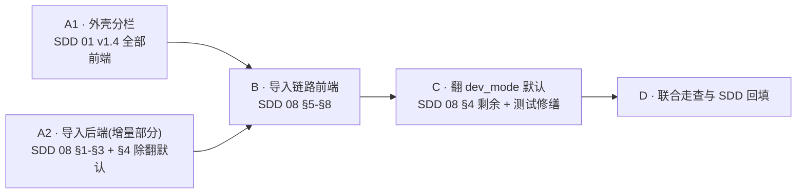

# 文件栏改造总计划（实施顺序）

统辖两份 `ready` 规范与其详细计划：

| 规范 | 详细计划 | 本文档负责 |
| --- | --- | --- |
| [SDD 08 数据导入优先的文件栏](../sdd/feats/08-data-import-first-explorer/README.md) | [import 计划](2026-08-30-data-import-first-explorer-plan.md) | — |
| [SDD 01 v1.4 舞台常驻 + 浏览器分栏](../sdd/feats/01-dual-mode-shell/README.md) | [split 计划](2026-08-30-focus-stage-browser-split-plan.md) | — |

**本文档只定三件事：波次顺序、两者的接缝、每波的准出门禁。** 具体步骤一律回两份详细计划，不在此重复。

## 1. 排序结论

**先做外壳分栏（SDD 01 v1.4），再做导入链路（SDD 08）；SDD 08 的后端与外壳分栏并行。**

理由：

1. **容器先定型，内容再填。** SDD 08 要新写空态卡与导入面板，它们的最终宿主是 240–480px 的浏览器窄列（SDD 01 §13）。若先在今天的整幅侧栏里做好再压窄，样式返工一次。
2. **分栏是纯前端、零后端依赖**，可与 SDD 08 的后端同时开工，不抢工。
3. **分栏本身就是用户提出的问题**（切一张图列表就被抢走），先落地先止血。
4. SDD 08 的后端是纯增量（新端点 + 新模块），落地后不改变任何现有界面，可以安全地先行合入。

## 2. 波次

| 波次 | 内容 | 依赖 | 可并行 |
| --- | --- | --- | --- |
| A1 | split 计划 §1–§5 全部 | 无 | 与 A2 并行 |
| A2 | import 计划 §1、§2、§3，以及 §4 中**除“翻 `dev_mode` 缺省”外**的部分 | 无 | 与 A1 并行 |
| B | import 计划 §5、§6、§7、§8 | A1（窄列宿主定型）+ A2（端点可调） | — |
| C | import 计划 §4 剩余：`dev_mode()` 缺省翻 0 + 受影响测试加显式 env + 开发脚本置 1 | B | — |
| D | 两份计划的收口段（split §6、import §9） | C | — |

## 3. 关键排序决定

### D-M1：`GLAUX_DEV_MODE` 缺省翻 0 放到最后一波（C），不跟其余后端一起走

翻默认是**唯一一处会让运行中的应用瞬间变空**的改动。若它在 A2 就落地，而前端空态（B）尚未存在，中间这段时间开发环境会呈现「后端什么都不返回、前端也不知道怎么显示」的坏状态，谁在这期间跑起来都会以为坏了。

拆法：A2 只做**增量**（`register_builtin_samples()` + `POST /datasources/samples` + `natural_image` 接入导入源），这些落地后行为与今天完全一致；C 才翻开关，此时前端已经会画空态和「加载示例数据」。

### D-M2：两波之间不共享 `frontend/src/store/session.ts` 的并发编辑

A1 改 `focusLayout`（`browserView` / `browserW`），B 改 `datasources` / `dsState` / `recentItems`。同一个文件、不同区段。波次串行即可规避，**不要**为了赶进度把 B 提前到 A1 未合入时开工。

### D-M3：`ExplorerView` 内部只在 B 波动一次

A1 明确**不改** `ExplorerView`（split 计划 §2 已声明），只换它的宿主。B 波才改它的内容（空态、导入面板、模态切换器来源）。这样「窄列适配」与「导入功能」不会在同一处反复对冲。

### D-M4：SDD 08 的验收里，空态相关项在 A1 合入前不具备验证条件

import 计划 §9 已写「若 feats/08 尚未落地，split 走查中空态卡一项记『无法验证』」。反向同理：B 波跑 SDD 08 §15 前端验收时，若 A1 未合入，「240px 窄列内可用」无从谈起。按本总计划的顺序，A1 先行，这条自然成立。

## 4. 接缝清单

两份计划真正相交的只有四处，其余互不接触：

| 接缝 | A1 侧 | B 侧 | 谁负责 |
| --- | --- | --- | --- |
| 浏览器列宽度约束 | 定义 `BROWSER_W = [240,480]`、`STAGE_MIN=360` | 空态卡与导入面板必须在 240px 内可用、不横向滚动 | 约束由 SDD 01 §13 出，实现落在 B |
| `ExplorerView` 宿主 | 换宿主，不改内容 | 改内容，不改宿主 | 各管一半，见 D-M3 |
| 模态切换器 | 不涉及 | 可见性改由 `/datasources` 派生（SDD 08 D-1） | B 独占 |
| 侧栏默认宽 | `SIDE_W.max` 规范校正为 1200 | 不涉及 | A1 独占 |

## 5. 每波准出门禁

一波不满足门禁，不开下一波。

**A1 准出**
- split 计划 §1–§5 全部完成。
- SDD 01 §15 v1.4 十三条中，除「无数据源时空态卡在 240px 内可用」外**全部**通过；该条记「无法验证（待 feats/08）」。
- `frontend` vitest + tsc + eslint 全绿。
- 人工走查：宽屏连点三张图列表不被抢走；缩窗 < 640px 降级且选图自动回舞台；刷新后 `browserView` / `browserW` 保持。

**A2 准出**
- import 计划 §1–§3 完成，§4 除翻默认外完成。
- `backend` pytest + ruff 全绿，且**未设** `GLAUX_DEV_MODE` 时行为与改动前一致（即此波尚未翻默认）。
- SDD 08 §15 后端十二条中，与 `dev_mode` 缺省相关的两条（第 9、10 项）暂记「待 C 波」，其余全部通过。

**B 准出**
- import 计划 §5–§8 完成。
- SDD 08 §15 前端十三条全部通过，其中空态相关项在真实 240px 窄列中走查。
- SDD 01 §15 v1.4 那条「无法验证」补齐为通过。

**C 准出**
- `GLAUX_DEV_MODE` 未设时全栈行为符合 SDD 08 §7 规则 4（前端不发数据请求、后端不返回 builtin）。
- 受影响的后端测试改为显式 `monkeypatch.setenv`，**不是**靠放宽断言绕过。
- `run-backend.sh` 等开发脚本启动后，开发者看到的界面与改动前一致。

**D 准出**
- 三服务起来，跑完 §6 的联合走查脚本。
- 两份 SDD 的 §15 各自记满「已完成 / 未完成 / 无法验证」三类。
- SDD 01 v1.4 由 `ready` → `implemented`；SDD 08 由 `ready` → `implemented`。`accepted` 由维护者走查后另行确认。

## 6. 联合走查脚本（D 波）

一条路径同时验两份规范，按顺序做：

1. 清空 `localStorage`，不设 `GLAUX_DEV_MODE`，启动三服务。
2. Focus 首屏 → 右侧栏应为**纯舞台 + 占位引导**；点「文件」标签 → 舞台在左、浏览器列贴最右缘（SDD 01 D19），浏览器列显示 SDD 08 空态卡。
3. 拖 2 张 JPEG 进空态卡 → 图出现在树中并自动选中首张，**舞台同屏更新**，浏览器列未被关闭。
4. 连点另一张图 → 舞台跟着换，列表始终在。
5. 拖第三条分隔条到 240 与 480 两端 → 被夹住，舞台不小于 360px，无横向滚动（← 变宽，见 D19）。
6. 缩窗到侧栏 < 640px → 退回整栏互斥；此时选图自动回舞台。放大到 ≥ 664px → 恢复分栏，浏览器仍是「文件」。
7. 点「加载示例数据」→ 医学模态出现，模态切换器渲染多个候选；切到某个医学模态确认舞台正常。
8. 会话里对上传图调 `segment_region` → 建议态多边形落在舞台上（验 SDD 08 跨组件项 + SDD 02 未回归）。
9. 移除上传的数据源 → 确认文案含「不会删除磁盘上的文件」；移除后回空态。
10. 刷新 → `browserView`、`browserW`、`sideW`、最近使用逐项保持。

## 7. 已知缺口与中断点

| 项 | 说明 | 处理 |
| --- | --- | --- |
| ~~模态切换器在 240px 窄列的排版~~ | 已于 2026-08-31 关闭：走查确认不可用，按流程先回 SDD 08 补 §5.5 与决策 D-9（阈值 = 候选数 × 120px，纵向单列兜底），再实现 | 已完成 |
| 上传总容量配额 | SDD 08 只定单文件与单次数量上限，无总量配额 | 已在 import 计划 §10 记为后续，不进本轮验收 |
| `accepted` 状态 | 两份 SDD 本轮最多到 `implemented` | 业务验收由维护者另行安排 |

可安全中断的点：**A1 合入后**、**A2 合入后**、**B 合入后**。C 波（翻默认）与 B 波之间不宜长期停留——B 已经把空态做好但默认仍是旧行为，界面会有一段「代码在但看不到」的状态，尽快接 C。
