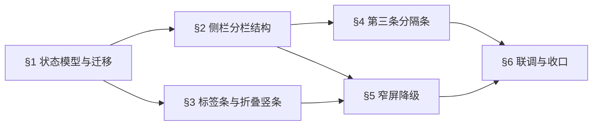

# Focus 右侧栏舞台常驻 + 浏览器分栏实施计划

约束来源：[Feature SDD 01](../sdd/feats/01-dual-mode-shell/README.md) v1.4（§7 第 2/7 条、§8、§9、§13、§15 v1.4、D16–D18）。

与 [feats/08 数据导入优先的文件栏](../sdd/feats/08-data-import-first-explorer/README.md) 的关系见 §6：两者都改 `ExplorerView` 的宿主环境，但不改它的内部，可并行推进。

## 0. 阶段与依赖

## 1. 状态模型与迁移（store）

- `frontend/src/store/session.ts`：
  - `FocusRightView` 类型删除，改为 `FocusBrowserView = "files" | "atlas"`；`FocusLayout` 的 `rightView` 换成 `browserView: FocusBrowserView | null` 与 `browserW: number | null`。
  - 新增常量 `BROWSER_W = { min: 240, max: 480, def: 300 }`、`STAGE_MIN = 360`、`SIDE_SPLIT_MIN = 640`。
  - `SIDE_W.max` 保持 `1200`（SDD §9 已按实现校正，不再改代码）。
  - `loadFocusLayout()` 增迁移分支：读到旧 `rightView` 时按 `stage → null` / `files → "files"` / `atlas → "atlas"` / 其他 → `null` 转换；`browserW` 走既有 `loadWidth` 校验。持久化键 `glaux.focusLayout.v1` 不 bump。
- 全仓搜 `rightView` 的读写点一次改净（`FocusTopBar` 的 chip 点击、feats/03 的 `revealExemplar`、各测试）。

验证：`frontend/src/store/atlasView.test.ts` 扩展——旧三值迁移、非法值回 `null`、`browserW` 越界夹回、损坏 JSON 回默认。

## 2. 侧栏分栏结构（FocusSidePanel）

- 展开态 DOM 改为 `[浏览器列?] [PaneResizer?] [StagePanel]`：
  - `browserView !== null && 可分栏` → 三者齐出。
  - `browserView === null` → 只有 `StagePanel`，占满侧栏。
  - StagePanel **无条件**渲染（SDD §9：`rightOpen` 即渲染）。
- `global.css` 的 Focus 段加 `.focus-side-split` 两列布局：浏览器列 `width: var(--focus-browser-w)` + `flex: 0 0 auto`，舞台 `flex: 1 1 auto; min-width: STAGE_MIN`。`--focus-browser-w` 由 `FocusSidePanel` 按 `browserW ?? BROWSER_W.def` 注入。
- 浏览器列开合动效沿用现有 200–280ms ease-out，并确认落在既有 `prefers-reduced-motion` 块内。

验证：`FocusSidePanel.test.tsx`——三种组合的 DOM 断言（SDD §15 v1.4 第 1/3/4 项）。

## 3. 标签条与折叠竖条

- `TABS` 由三项改为两项（files / atlas）；点击逻辑改为 toggle：`setFocusLayout({ browserView: browserView === tab.id ? null : tab.id })`。
- 折叠态竖条保持三枚图标：舞台图标 → `{ rightOpen: true, browserView: null }`；文件/图谱 → `{ rightOpen: true, browserView: tab.id }`。`TAB_ICON.stage` 继续复用，不动 [iconMap.ts](../../frontend/src/components/iconMap.ts)。
- `FocusTopBar` 的 `ImageContextChip` 点击改为 `{ rightOpen: true, browserView: "files" }`。
- feats/03「在图谱中打开」改为 `{ rightOpen: true, browserView: "atlas" }`。

验证：`FocusSidePanel.test.tsx` 覆盖 SDD §15 v1.4 第 2/5 项；`FocusTopBar.test.tsx` 与 `atlasView.test.ts` 的既有断言按新字段改写。

## 4. 第三条分隔条

- 在 `FocusSidePanel` 内渲染 `PaneResizer`（`side="left"`，复用组件，不新写）：
  - `value = browserW ?? BROWSER_W.def`
  - `min = BROWSER_W.min`
  - `max = min(BROWSER_W.max, 实测侧栏宽 − STAGE_MIN)` —— 与 `FocusShell.room()` 同一思路，防止把舞台挤到 360px 以下。
  - `onChange → setFocusLayout({ browserW: w })`；`onReset → setFocusLayout({ browserW: null })`。
- 侧栏宽度实测：`FocusSidePanel` 内加 `useLayoutEffect` + `ResizeObserver`（或复用 `FocusShell` 已有的 resize 监听并下传），得到当前侧栏像素宽。**不要**读 `sideW`——它为 `null` 时没有真值。
- 新增 i18n 键 `focus_resize_browser`（中英）。

验证：`PaneResizer.test.tsx` 无需改（组件未变）；`FocusSidePanel.test.tsx` 断言分隔条存在性与 `min`/`max` 计算（SDD §15 v1.4 第 6/7/8 项）。

## 5. 窄屏降级

- `FocusSidePanel` 由实测侧栏宽推导 `canSplit = width >= SIDE_SPLIT_MIN`。
- `!canSplit && browserView !== null` → 渲染 v1.1 的整栏互斥形态（浏览器内容占满，不渲染 StagePanel 与第三条分隔条）。
- 「选图 → 自动切舞台」的 `useEffect` **保留但加门控**：仅在 `!canSplit` 时执行 `setFocusLayout({ browserView: null })`。分栏态下该 effect 直接返回，不写 store。
- 降级切换**不得**改写 `browserView`（除上面那条选图路径外），保证宽度恢复后回到用户原来的浏览器。

验证：`FocusSidePanel.test.tsx` 用 mock 宽度覆盖 SDD §15 v1.4 第 10/11 项——分栏态选图 `browserView` 前后相等；降级态选图落为 `null`；宽度回升后形态恢复。

## 6. 联调与收口

- 与 feats/08 的接触面：`ExplorerView` 内部不由本计划改动；但 feats/08 的空态卡需在 240px 窄列内可用（SDD 01 §13）。两个计划都落地后，补一条联合走查：无数据源 → 文件浏览器显示空态卡 → 拖入图片 → 同屏看到舞台更新。
  - 若 feats/08 尚未落地，本计划以现状 `ExplorerView` 走查，空态卡一项记「无法验证」。
- 全量跑：`frontend` vitest + tsc + eslint；`backend` / `agent-runtime` 作回归（本计划不触及）。
- 浏览器走查：宽屏分栏下连点三张图确认列表不被抢走 → 拖第三条分隔条到两端确认夹持 → 缩窗到 < 640px 确认降级并且选图自动回舞台 → 放大恢复分栏 → 刷新确认 `browserView` / `browserW` 保持。
- 按 SDD §15 v1.4 逐条记「已完成 / 未完成 / 无法验证」，写回 SDD 01 §15；完成后 §0 的 v1.4 由 `ready` 推进为 `implemented`，人工走查通过后再由维护者确认 `accepted`。

## 7. 风险与应对

| 风险 | 影响 | 应对 |
| --- | --- | --- |
| `rightView` 是跨文件读写的老字段 | 漏改一处即出现"点了没反应" | §1 先全仓搜净再动结构；TypeScript 删掉旧字段后编译期即暴露所有引用点，不靠人工找 |
| 实测宽度在首帧为 0 | 首帧误判为窄屏，出现闪烁 | 与 `FocusShell` 同一惯例：实测为 0 时按 `canSplit = true` 走分栏，实测到位后再纠正；配合 CSS `min-width` 兜底不产生横向滚动 |
| 两条 resizer 的 max 互相牵制 | 拖外侧分隔条把内侧挤爆 | 内侧 `max` 每次渲染都按当前实测侧栏宽重算；外侧 `room()` 逻辑不变，两者都只夹自己那一段 |
| 浏览器列 240px 太窄放不下 `ExplorerView` | 文件名截断、模态切换器换行 | 本计划只保证不横向滚动；`ExplorerView` 的窄列适配（如模态切换器改下拉）若需要，属 feats/08 范围，回那份 SDD 加，不在此私自扩大 |
| 降级阈值 640px 是拍的 | 边界附近来回抖动 | 加 24px 迟滞（进入降级用 640，退出用 664），避免拖到临界时反复重排 |
