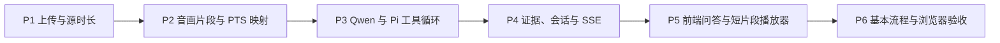

# SDD 11 视频理解 harness · 实施计划

依据：[SDD 11](../sdd/feats/11-video-understanding-harness/README.md)（`ready`）。一期仅接入 Qwen3.8-Omni-Flash；MiMo 不占用实现、测试或验收波次。实现时若发现接口、预算或精度门槛需改变，先修订 SDD 11，再改产品代码。

## 依赖顺序

## P1 · 视频上传与源时长

- 在现有 `/uploads/images` 中按 `SOURCES[*].formats` 判定模态，视频单独执行 512 MiB 上限；逐块写临时文件并算 SHA-256，成功验证后原子替换。图像仍按 32 MiB 限制。
- 视频流与可选音频流按 SDD 11 §4 的编码白名单解码探测；以 PTS 计算 `meta.duration_ms`。超 10 分钟、无有效时长、坏编码逐文件拒绝，保持 SDD 08 的部分受理语义。
- 同提交修订 SDD 08 的上传限制、拒绝原因与实现后的现状表述。

完成证据：大文件路径内存有界；边界文件和拒绝文件无临时残留；同名覆盖失败不损坏原对象。

## P2 · 音画区间资源

- 在视频 Source 上实现 SDD 11 §9 的 `resources.clip`，由后端统一读取 PTS、裁切并编码 H.264/AAC MP4；路由返回 `X-Glaux-Clip`，含源指纹、实际区间和编码信息。
- 对非零起始 PTS、可变帧率、非关键帧起点、音视频起点不同和无音轨文件验证时间映射。不能满足 §9 容差或 6 MiB 限额时按 §13 拒绝，不截断片段或丢弃音轨。
- 片段缓存以源指纹和编码参数为键；缓存只是加速，删除后能重建。

完成证据：音画内容与请求区间一致，模型抽帧档位变化不影响源时间引用。

## P3 · Qwen 与 Pi 工具循环

- 连接输入增加显式 `media_adapter="qwen-omni"`，只在准确型号和有效 `/compatible-mode/v1` 地址启用；其他连接展示 SDD 11 §13 的提示。
- 新增 `observe_video_interval` 工具及每轮预算。工具结果中的会话内容只存 `ClipObservation` 占位与元数据；出站 `onPayload` 在工具结果之后插入仅供本次请求的 `user` 视频内容块，确保 Qwen 同时接收声音与画面，设置 `modalities:["text"]` 和 `reasoning_effort:"low"`。
- 用真实 Pi 流式请求验证“首段观察 → 再取另一段 → 原生音画回答”。确认旧观测不在每次调用中重发 Base64，媒体正文不进入会话、日志或 SSE。

完成证据：同画面移声配对样本的答案随声音移动；静音样本不产生有效音频证据。

## P4 · 证据校验、会话与事件

- `submit_video_answer` 接收 SDD 11 §9 的 `VideoAnswer`；校验观测 ID、对象、源指纹、原视频区间、关键帧时间和区域。无效引用给一次修正机会；仍无效时返回无法判断。
- 使用 Pi custom entry 持久化观测和回答元数据；`snapshot.video_answers` 与 `video.answer` SSE 一致，按 `command_id` 去重。
- 回答复核从原源文件重建短片段；源丢失或指纹改变时保留回答并返回不可回放。

完成证据：刷新、重启、切换 Focus 后旧回答引用不漂移；越界引用不能进入证据卡。

## P5 · 前端问答与证据短片段播放器

- 上传前提示时长和文件大小，最终以后端逐文件结果为准；不在前端复制编码白名单作为事实源。
- 只对具备显式 Qwen 音画适配器的连接开放视频问答；不支持时准确提示，普通对话和 chat edition 不受影响。
- 结构化回答卡按事实与证据呈现；点击引用加载原声短片段，显示源时间与适用时的关键帧区域，并处理加载失败／源失效。

完成证据：同一会话多条视频问答可分别复核；证据卡不依赖模型自由文本中的时间戳。

## P6 · 评测和最终验收

- 使用用户配置的 Qwen 连接，在至少一段真实有声视频上走通 SDD 11 §15 的基本流程案例，并人工复核回答与证据；合成样本不能替代。
- 固定标注集与定量评测按 SDD 11 D-15 后置，不在本计划范围。
- 同步完成 SDD 10 递延的真实浏览器走查，以及 SDD 09 chat edition 回归；逐项记录 SDD 11 §15 的通过证据。
- 实现与开发验证完成后将 SDD 11 `ready → implemented`；业务验收全部通过后再转 `accepted`。SDD 10 依其自身验收结果独立转态。
