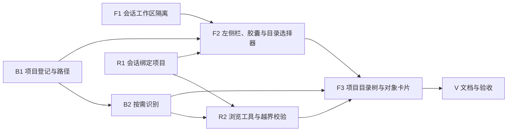

# SDD 13 项目文件夹与并行会话 · P1 实施计划

依据：[SDD 13](../sdd/feats/13-project-folder-sessions/README.md)（`ready`）。P1 覆盖 `natural_image`、`video`；CT、WSI 的 Source 改造属 P2，另立计划。实现中若发现契约需要改变，先修订 SDD 13，再改产品代码。

## 依赖顺序

三条轨道可并行推进，汇合于 F2、F3。每个波次单独提交，波末系统完整可用。

| 波次 | 依赖 | 对应 SDD 13 条款 | 波末状态 |
| --- | --- | --- | --- |
| F1 | — | §6.4、§6.5、§7.7、§9.6 | 既有会话之间已隔离；无项目概念 |
| B1 | — | §7.1、§9.1（`/fs/*`、`/projects`）、§9.4 | 后端可登记项目；前端未接入 |
| B2 | B1 | §6.3、§7.2、§9.1（entries、objects）、§9.2、§9.3 | 后端可按需打开项目内对象 |
| R1 | — | §7.6、§9.5 | 会话可带 `project_id` 创建；前端未接入 |
| R2 | B2、R1 | §7.3、§7.8 规则 4 | 绑定项目的会话挂载浏览工具 |
| F2 | F1、B1、R1 | §5.1、§7.4、§7.5 | 用户可打开项目并按项目组织会话 |
| F3 | F2、B2、R2 | §5.1、§7.8 | P1 功能完整 |
| V | F3 | §15 | 活文档同步；SDD 13 转 `implemented` |

## F1 · 会话工作区隔离

修复现存的串台问题，不依赖项目概念，先行落地。

- 新建 `frontend/src/store/sessionWorkspaces.ts`：按 `session_id` 保存 §9.6 的字段；提供 `capture(sessionId)`（从 `useSession` 读出）、`restore(sessionId)`（写回 `useSession`，缺省为空工作区）、`patch(sessionId, partial)`、`drop(sessionId)`；`modality`、`focus` 持久化到 localStorage `glaux.sessionWorkspace.v1`，读写均包 try/catch。
- `frontend/src/store/agentSessions.ts`：
  - `select`（`:151`）在切换前 `capture(当前)`，切换后 `restore(目标)`；目标焦点对象不在当前对象表时清空焦点。
  - `applyPiEvent`（`:337`）：`tool_execution_end` 按 `sessionId === currentSessionId` 分流，前台走 `applyToolExecutionEvent`，后台写该会话快照。
  - `deleteSession` 调用 `drop`。
- `frontend/src/agent/toolBridge.ts`：`applyToolExecutionEvent(event, target?)`，`target` 缺省为前台 `useSession`；对象一致性检查同时适用于快照目标。
- 未读与状态点所需的数据放在同一 store：记录各会话最近一次 `phase`，非当前会话由运行中转 `idle` 时置未读，`select` 时清除；只存内存。
- 单测（同目录 `*.test.ts`）：换入换出往返；后台 `run_task` 结果不改前台 `metrics`；两会话同焦点时互不覆盖；草稿与附件随会话恢复；刷新后焦点恢复；非法 localStorage 值回退空工作区；沿用 `agentSessions.test.ts` 的「切换 20 次不 abort」。

完成证据：SDD 13 §15.4 的六条在单测中覆盖；浏览器中两个会话交替运行 `run_task`，度量卡不串。

## B1 · 项目登记与路径

- 新建 `backend/app/paths.py`：
  - `to_posix(raw)`：识别 POSIX、`X:\…`、`\\wsl.localhost\<发行版>\…`、`\\wsl$\<发行版>\…` 四种写法；WSL 判定用 `WSL_DISTRO_NAME` 环境变量，发行版不一致抛 `ValueError`（映射 422）。
  - `display(path)`：WSL 下 `/mnt/<盘符>/…` 转 `<盘符>:\…`，其余原样。
- 新建回环守卫依赖 `require_loopback(request)`：`request.client.host` 不属于 `127.0.0.1`、`::1` 时 403。挂在 `/fs` 与 `/projects` 两个 router 上。测试用 `TestClient` 时客户端地址为 `testclient`，守卫需允许注入测试放行开关或在测试中覆盖依赖。
- `backend/app/datasource_registry.py`：
  - 新增 `Project` dataclass 与 `_PROJECTS`；`project_id = "prj-" + sha1(path)[:8]`。
  - `sources.json` 读写增 `projects` 键；缺失时按空处理。
  - 为 `_SOURCES`、`_PROJECTS` 的读改写与 `_save_persisted` 加模块级 `threading.Lock`（现为无锁，B2 的并发按需登记会竞争）。
  - `register_project(path)`、`remove_project(id)`（连带注销 `project_id` 相同的数据源）、`list_projects()`（实时判定 `status: ok | missing`）。
- 新建 `backend/app/routers/fs.py`（前缀 `/fs`）与 `backend/app/routers/projects.py`（前缀 `/projects`），在 `main.py:41-45` 注册。
- `schemas.py` 增 `DirEntry`、`ProjectView`；`DataSourceInfo` 增 `project_id`。
- 单测（`backend/tests/test_projects.py`、`test_paths.py`，隔离方式沿用 `test_datasource_registry.py:15-24` 的 monkeypatch `GLAUX_SOURCES_FILE` / `GLAUX_DATASETS_ROOT`）：三种写法得同一项目；尾斜杠与符号链接幂等；非回环 403；不存在 404；非目录 422；移除项目后磁盘文件不变；旧 `sources.json`（无 `projects` 键）可读。

完成证据：SDD 13 §15.1 第 1、6、7 条通过。

## B2 · 按需识别

- `backend/app/sources/base.py`：`Source` 协议增 `object_id_for(source, path) -> str | None`；`SourceBase` 缺省返回 `None`。
- `dataset_natural.py`：`object_id_for` 返回 `upload_store.image_id(source.id, path.name)`，要求 `path.parent == source.root` 且通过 `is_supported_file`。
- `dataset_video.py`：`object_id_for` 返回 `object_id(source.id, path.name)`，同样校验父目录与格式。
- `datasource_registry.py`：
  - `ensure_project_source(project, dir, modality)`：`(规范化目录, modality)` 派生 id，形如 `psrc-<sha1(f"{dir}\0{modality}")[:8]>`；已存在则直接返回；新建后 `invalidate_index()`。
  - `DataSource` 增 `project_id: str | None`，`origin` 增 `project`。
- `routers/projects.py` 增：
  - `GET /projects/{id}/entries?path=`：只列一层；跳过 `.` 开头与解析后越出项目根的条目；按后缀匹配 `SOURCES[*].formats` 给出候选模态；已登记文件回填 `object_id`。
  - `POST /projects/{id}/objects`：越界 422 `outside_project`；后缀无候选或 Source 不支持 `object_id_for` 返回 422 `unsupported_format`（P1 中 CT、WSI 走此分支）；魔数不符 422 `corrupt`；成功返回 `ObjectMeta`。
- `routers/uploads.py`：接受可选 `project_id`，登记的上传源带该值；落盘位置不变。
- 单测：同目录同模态只登记一个源；同目录 JPEG 与 MP4 登记两个源；`..` 与外链符号链接 422；`.txt` 候选为 `null`；CT 文件 422 `unsupported_format`；并发两次打开同一文件只登记一次（线程池并发调用）；打开后 `resolve_object` 可解析该 id；10 万文件目录的 `POST /projects` 不遍历目录（断言未调用 `iterdir`）。

完成证据：SDD 13 §15.1 第 2～5 条与 §15.5 第 4 条（上传归属）通过。

## R1 · 会话绑定项目

- `agent-runtime/src/contracts.ts`：`GlauxSessionMeta`、`CreateSessionInput` 增 `project_id`（`string | null`）。
- `transport/routes.ts`：`parseCreateSession`（`:128`）识别 `project_id`（非空字符串或缺省）。
- `pi/session-service.ts`：
  - `createSession`：`piRepo.create({ id, cwd, metadata: { glaux_project_id } })`；未归属不写 `metadata`；已存在的 id 比较 `project_id`，不同则 409 `idempotency_conflict`。
  - `findReusableEmptySession(projectId)`：只在同一 `project_id`（含空）内复用。
  - `listSessions`：改为先调用一次 `piRepo.list()` 建 `id → metadata` 映射，再与 meta 表合并，消除现有的每会话一次全表 list；列表项与 `toView` 带出 `project_id`。
- 单测（`agent-runtime/tests/contract/`）：不同项目各得一个空会话；同 id 不同 `project_id` 409；升级前无 `metadata` 的会话 `project_id` 为 `null`；列表只调用一次 `piRepo.list()`。

完成证据：SDD 13 §15.3 第 1、2、6 条的后端部分通过。

## R2 · 浏览工具与越界校验

- `pi/harness-registry.ts`：
  - `HarnessToolContext` 增 `projectId?: string`；`start()`（`:263`）在 `:276` 取得 `session` 后读 `getMetadata().metadata?.glaux_project_id` 放入上下文。
  - `TOOL_PROVIDERS` 增 `list_files`、`open_file`，`requires` 增 `project: true`，`availableProviders` 在无 `projectId` 时过滤；`promptFragment` 说明两工具只读、限项目内、`open_file` 不改用户舞台。
  - 越界守卫 `withProjectGuard`：包装读取对象的工具（`run_task`、`view_current_image`、`locate_roi`、`segment_region`、`propose_annotation`、两个视频工具）；执行前经 `GET /objects/{id}` 取 `source_id`、经 `GET /datasources` 取其 `project_id`，与会话 `projectId` 不一致即返回工具错误；同一回合内缓存查询结果。`consult_atlas` 不包装（图谱是全局库）。未归属会话要求对象的数据源 `project_id` 为空。
- 新建 `pi/tools/list-files.ts`、`pi/tools/open-file.ts`：经 `backendBaseUrl()`（`src/atlas/client.ts:55`）调用 B2 端点；`open_file` 成功后以 `ObjectMeta` 构造焦点（P1：`image` 空索引、`video` `t=0`），调用 `fetchObservation`（`src/observation/index.ts:39`），返回文本摘要 + 图像内容块，`details` 带 `ObjectMeta` 供前端渲染卡片。`list_files` 超过 200 条截断并返回 `total`。
- 单测（`tests/integration/`，仿 `view-image-tool.test.ts` 注入 `fetch`）：有无项目时的挂载差异；越界对象返回工具错误且未调用任务端点；`open_file` 返回图像块；截断语义。

完成证据：SDD 13 §15.2 第 1、4 条与 §15.5 第 3 条通过。

## F2 · 左侧栏、项目胶囊与目录选择器

- `frontend/src/api/client.ts`：增 `fsRoots`、`fsDirs`、`projects`、`openProject`、`removeProject`。`agent/runtime/client.ts`：`createSession` 增 `project_id`。类型同步 `api/types.ts`、`agent/runtime/types.ts`。
- 新建 `frontend/src/store/projects.ts`：项目列表、`projectOf(session)`、已移除项目判定。
- `agentSessions.ts`：`newSession(projectId?)`；缺省取当前会话的项目；`initialize` 首选会话逻辑不变。
- 重写 `components/agent/SessionDrawer.tsx`：项目组、「未归属」组（始终渲染组头）、「（已移除）」只读组；组头折叠（localStorage）、「＋」、菜单（移除项目，先查运行中会话）；会话行状态点；搜索跨组；「显示归档」开关；保留重命名、归档、删除。引用方 `SessionRail.tsx:132`、`AgentConversation.tsx:445` 接口不变。
- `components/focus/SessionRail.tsx`：「＋」在当前会话的项目下新建，`title` 显示项目名。
- 新建 `components/agent/ProjectChip.tsx`，挂在 `ConversationComposer` 上方：空会话可切项目（切到目标项目的空会话，带走草稿、附件、视频），有消息后只读。
- 新建 `components/agent/FolderPicker.tsx`：快捷根、面包屑、子目录列表、路径输入框；「打开」后 `openProject` → `newSession(projectId)`。
- `components/ImportPanel.tsx`：服务端文件夹部分**推迟到 P2 删除**。P1 的按需识别不支持 CT、WSI，此时删掉会让这两个模态在 P2 之前没有导入途径；P2 让 CT、WSI 支持 `object_id_for` 后，与 Source 改造同批删除。
- i18n 新键写入 `i18n/zh.ts`、`i18n/en.ts`；图标经 `iconMap.ts` 登记（SDD 06）。
- 单测：分组与排序；「＋」连点只得一个空会话；胶囊切换带走草稿；有消息后胶囊只读；已移除组不可发送；状态点四态；`SessionRail.test.tsx` 的 mock 更新。

完成证据：SDD 13 §15.3 全部条目通过（浏览器走查）。

## F3 · 项目目录树与对象卡片

- 新建 `components/ProjectTree.tsx`：按需展开目录（`GET /projects/{id}/entries`），可识别文件带模态图标，不可识别置灰；点击文件 → `POST /projects/{id}/objects` → `openObject(id)`（`data/actions.ts:119`）；根下虚拟节点「上传」列出本项目上传源的对象；单层条目过多时分批渲染。
- `components/SideBar.tsx`：`ExplorerView` 在项目会话中渲染 `ProjectTree`，未归属会话保持 `ExplorerTree`；「最近使用」按当前作用域过滤（`data/recent.ts` 的记录结构不变，显示时按对象所属数据源的 `project_id` 过滤）。
- 新建 `components/agent/ObjectCard.tsx`：渲染 `open_file` 的 `details`（文件名、模态、「在舞台打开」）；挂载方式仿 `AtlasRefCard`。
- 上传入口在项目会话中携带 `project_id`。
- 单测：目录树展开与点击打开；CT 文件点击后行内提示 P2 支持；对象卡片点击改焦点；切换项目会话时目录树切换。

完成证据：SDD 13 §15.2 第 2、3 条，§15.5 第 1、2 条通过（浏览器走查）。

## V · 文档与验收

- 同一提交更新活文档：`docs/architecture.zh-CN.md`（新端点、`sources.json` 结构、智能体工具）、`docs/runbooks/reference-agent-conversations.md`（项目与会话）、`docs/runbooks/atlas-import.md` 若涉及服务端文件夹入口一并修订、`frontend`/`backend`/`agent-runtime` 组件 README 中的相关段落。
- 逐条执行 SDD 13 §15（P1 范围），在 SDD 13 §15 勾选并写明证据；「P2」条目保持未勾选。
- SDD 13 §0 转 `implemented`（注明 P1），更新 SDD 索引。
- 全量门禁：前端 typecheck、lint、vitest；agent-runtime vitest；backend pytest；`scripts/ci/check-modality-literals.sh`。

## 风险与处理

| 风险 | 处理 |
| --- | --- |
| `TestClient` 的客户端地址不是回环地址，守卫会拦截测试 | 守卫读取可注入的放行判定；测试通过 FastAPI 依赖覆盖放行，另有一条测试专门验证拦截 |
| `/mnt/c` 上目录列举慢 | 只列一层；前端展开时显示加载态 |
| 按需登记并发写 `sources.json` | B1 加锁；B2 有并发单测 |
| F1 换入换出遗漏字段导致残留串台 | §9.6 字段表即检查清单；单测逐字段断言 |
| `open_file` 连续调用使上下文膨胀 | 图像沿用 `view_current_image` 的尺寸上限；`list_files` 截断 200 条 |
| SDD 00/01 工作区存在另一会话的未提交改动 | 提交时按文件、按 hunk 暂存本计划的改动 |
