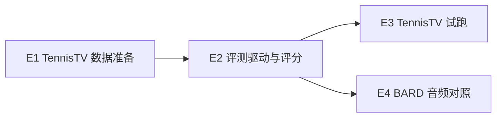

# 视频评测计划：TennisTV 与 BARD

依据：[体育视频评测集调研](../researches/20260925-02-research-sports-video-eval-datasets.zh-CN.md)、[SDD 11](../sdd/feats/11-video-understanding-harness/README.md) D-15。本计划给出业务定性所需的第一批定量结果，不构成 SDD 11 一期的验收门禁。

## 范围

- 模型与链路：SDD 11 一期的 Qwen3.8-Omni-Flash 与现有视频问答流程，不为评测改产品行为。
- 数据只在本机使用，放在 `data/eval/`（已被 `.gitignore` 忽略），不入库、不再分发。
- 不做：SportsTime、RefereeBench、NBA 自建集；任何需要审批或人工标注的数据。

## 依赖顺序

## E1 · TennisTV 数据准备

- 脚本 `scripts/eval/tennistv.py`，用法见 [scripts/eval/README.md](../../scripts/eval/README.md)。
- 子命令：
  - `questions`：拉取 ModelScope 的 8 个题目文件和 F3Set 的 `videos.csv`。
  - `plan`：按题量给比赛排序，写出选中比赛清单。
  - `download`：用 yt-dlp 分别下载 720p/25fps 视频流和音频流，不依赖 ffmpeg。
  - `slice`：按 `[起始帧, 结束帧)` 切出回合片段，输出 H.264/AAC MP4。
  - `manifest`：生成题目清单，MGG 题附标准时间区间（毫秒）。
- 试点：题量最多的 3 场比赛，约 430 题，覆盖全部 8 类任务。
- 人工步骤：YouTube 下载可能要求用户本人安装 yt-dlp 及其 JS 运行时，或提供 cookies；下载不到的视频向 F3Set 作者索取。

完成证据：`selftest` 通过；试点比赛的片段帧数与题目帧区间一致；抽查片段画面与题意相符，且带音轨。

进展（2026-09-25）：E1 完成。

- 试点比赛：
  - 2021 澳网半决赛 Tsitsipas–Medvedev；
  - 2022 Ostrava 决赛 Swiatek–Krejcikova；
  - 2018 温网半决赛 Nadal–Djokovic。
- 结果：222 个片段、431 题，8 类任务都有，其中 MGG 21 题；片段 3～30 秒，中位数约 10 秒。
- 抽查：9 个片段帧数与题目帧区间一致，首帧都是回合开始，都带原声，标准答案与画面相符。
- 部分 YouTube 视频现在只有 30/60 fps 版本，和按 25 fps 标注的帧号对不上。例如 2022 美网半决赛 Swiatek–Sabalenka、2021 美网半决赛 Djokovic–Zverev，这两场已换掉。脚本只接受 25 fps。
- YouTube 常附带多条自动配音音轨，脚本只取标为 `original` 的原声。

## E2 · 评测驱动与评分

- 无头驱动：每题新建会话，经 backend 上传片段，再经 agent-runtime 会话接口提问；题干附选项，要求回答写明所选字母。
- 记录：`VideoAnswer`、观察次数与区间、耗时、token 用量。只存元数据，不存媒体。
- 评分：

| 指标 | 适用 | 口径 |
| --- | --- | --- |
| 选项正确率 | 全部多选题 | 从回答中解析出唯一字母；解析失败按错误计 |
| 证据时间 IoU | MGG | 证据区间与标准区间的时间 IoU；另报 IoU ≥ 0.5 的比例 |
| 无法判断率 | 全部 | 未提交结构化回答，或只给出 `unanswered` 的比例 |

完成证据：10 题冒烟跑通，结果文件可复算上述指标。

## E3 · TennisTV 试跑

- 从试点比赛中每类抽 10～15 题，并包含试点比赛内的全部 MGG 题，约 100 题。
- 按任务类型报告正确率，另报 MGG 的时间 IoU；与 TennisTV 论文基线的对比只作参考，因为输入协议不同（论文抽帧，本仓库是原声片段）。
- 结果写成调研记录，放在 `docs/researches/`。

## E4 · BARD 音频对照

- 从 Hugging Face 抽 200 段片段，脚本把 `caption.json` 的动作描述转成多选题：动作类型、投篮结果、是否助攻、执行者球衣号。
- 每题跑两次：原声片段和去除音轨的片段，对比正确率。
- 结果与 E3 写入同一份调研记录。

## 风险

| 风险 | 处理 |
| --- | --- |
| YouTube 视频失效或版本不同（帧率、剪辑） | 下载后核对帧率与时长；不符的比赛换下一场，或向作者索取 |
| API 费用 | E3 前先用 10 题估算每题成本，再定题量 |
| 选项解析不稳定 | 题干约束输出格式；解析失败单独统计 |
