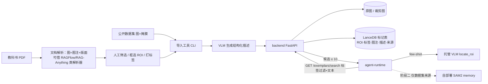

# 图像标注案例库技术调研（避免重复造轮子）

> **用途**：为"已验证标注案例库"（拟立项 Feature SDD 03）选定可直接复用的技术拼装件，回答"现有图像知识库方案能不能直接用"。
> **日期**：2026-08-16 · **类别**：tech（技术） · **状态**：v1
> **依据**：[SDD 02 智能体图像标注能力](../sdd/feats/02-agent-image-annotation/README.md) · [纲领](../roadmaps/charter.zh-CN.md) · [仓库骨架总览](../architecture.zh-CN.md)
> **半衰期提醒**：向量库 SDK、模型权重与论文代码变化很快；选型落地前到原始页面复核版本与许可证。

## 0. 一页纸结论

**问题**：Glaux 的 agent 标注闭环（SDD 02）会持续产出带溯源与人工裁决的标注。我们想把"人工确认过的标注"沉淀为案例库，供 agent 在定位（`locate_roi`）与分割（`segment_region`）时检索为先验。现有知识库技术几乎全是文本文档中心，需要确认有没有成熟的**图像 + 几何标注 + 相似检索**方案可直接使用。

**结论**：**没有任何一个现成"图像知识库"产品可以直接当我们的案例库；但每一层都有成熟拼装件，不需要造轮子。**

| 层 | 现成件 | 结论 |
| --- | --- | --- |
| 通用 RAG / 知识库平台（Dify、RAGFlow、RAG-Anything、LlamaIndex、R2R） | 文档中心，图片作为文档元素被文本化 | ❌ 不适用：不存几何、不做以图搜图、无裁决字段 |
| CV 数据集管理平台（FiftyOne 开源版、Encord、CVAT） | 图像 + 标注 + embedding + 相似检索四合一 | ⚠️ 离线策展用，不进运行时（独立平台、依赖 MongoDB） |
| 嵌入式向量存储（LanceDB、sqlite-vec） | 一表存图像引用 / 几何 / 元数据 / 向量 | ✅ **LanceDB** 为案例库存储层 |
| 医学图像编码器（BiomedCLIP、DINOv2） | 本地 torch 模型，医学检索有效 | ✅ 后置阶段引入，走隔离子进程 |
| 学术方法（Retrieval-augmented few-shot med seg：DINOv2 检索 + SAM2 memory） | 无训练、跨模态、优于点提示 SAM2 | ✅ 验证了"案例当先验"路径，且可深入到分割层 |

**推荐组合**（按 §6 决策修正后）：人工策展批量导入（教科书 PDF + 公开数据集）→ 导入期 VLM 生成结构化描述 → LanceDB（Python backend 侧，原图与标记分存）→ 运行期"标签过滤 + 文本匹配 → 候选 ≤ 10 → VLM few-shot"；SAM2 memory 为阶段二（仅数据集来源）；视觉 embedding 降为观察项；FiftyOne 只作离线策展。

**已拍板决策**（2026-08-16，项目维护者）：见 §6（D-1～D-8）。

---

## 1. 问题定义与评价标准

### 1.1 案例库要存什么

一条"案例"= 一次被人工裁决过的 agent 标注，字段基本就是 SDD 02 §5.2 溯源记录的持久化：

| 字段 | 来源 | 检索/使用用途 |
| --- | --- | --- |
| 影像引用（image_id / 帧号）+ **ROI 裁剪框 + 裁剪缩略图** | 前端视口上下文 | 视觉相似检索单元（决策 D-3） |
| 模态、解剖部位、任务类型（结构化标签） | agent 从指令抽取 + 人工确认 | 精确过滤 |
| 指令原文 | 会话消息 | 文本相似检索 |
| 几何结果（bbox / polygon / mask 引用） | `propose_annotation` 产物 | few-shot 示例、SAM2 memory |
| 精度层路由 + 置信度 + 供应商/模型 | 工具事件 | 路由参考 |
| 人工裁决（accept / adjust / reject）+ 调整后几何 | `annotation.resolved` 回执 | 正负样本 |
| trace_id、时间、像素间距 | 已有 | 复现与审计 |
| embedding（后置） | 编码器 | 视觉相似检索 |

规则：仅 `accepted` / `adjusted` 入库为正样本，`rejected` 入库为负样本，`suggested` 态永不入库（与 SDD 02 §5.3 一致）。

### 1.2 评价标准

1. 能否原生存"图像 + 几何 + 元数据 + 向量"于一体，且按标签过滤后再做相似排序；
2. 能否嵌入 Glaux 单机三进程形态（Python backend / Node agent-runtime / 前端），不引入常驻服务；
3. 与"主进程不加载重模型"不变量兼容（重模型走隔离子进程）；
4. 医学影像检索是否有可信证据（模型 / 论文）；
5. 是否有 Python SDK（存储放 backend 侧）。

---

## 2. 通用 RAG / 知识库平台——不适用

| 方案 | "多模态"的实际含义 | 与需求的差距 |
| --- | --- | --- |
| **Dify** | 知识库上传文档→切块→向量；图片走 Chatflow 分流给视觉模型识别，不进知识库检索 | 图片不是检索对象 |
| **RAGFlow** | 强在复杂 PDF 表格/版面解析 | 图片被解析成文本描述 |
| **RAG-Anything**（HKU） | 图、文、表、公式统一进多模态知识图谱 | 检索单元仍是文档节点，无几何、无以图搜图 |
| **LlamaIndex** MultiModal Vector Store Index / **R2R** | 支持图像 embedding 入库 | 只是通用向量存储封装，标注/裁决/ROI 全需自建 |

**判定**：用它们等于只借了 chunk 存储，其余全部自建，且引入不需要的文档解析栈。**排除。**

---

## 3. CV 数据集管理平台——离线策展用

### 3.1 FiftyOne（Voxel51，开源 Apache-2.0）

- 原生"图像 + 标注 + embedding + 相似检索"：`compute_similarity()` 建索引、`sort_by_similarity()` 检索，后端可接 Qdrant / Pinecone / LanceDB / Milvus。
- 官方有 **Medical Imaging Guide**，支持 DICOM / CT（示例：25 例脑扫描 + 左右海马标注）。
- 但它是独立 Python 数据平台（依赖 MongoDB、自带 App），面向数据集策展与模型评估，**不是可嵌入产品运行时的库**。

**用法定位**：把公开数据集（CUBS、HC18 等，见 [超声基准调研](20260705-02-research-ultrasound-benchmarks.zh-CN.md)）导入 FiftyOne 离线整理、看 embedding 分布、导出种子案例；**不进运行时依赖**。

### 3.2 Encord / CVAT / Label Studio

商业或以人工标注流为中心，相似检索为附属能力，且都是独立服务。定位同上，优先级低于 FiftyOne。

---

## 4. 嵌入式向量存储——LanceDB

| 方案 | 形态 | 优点 | 缺点 | 判定 |
| --- | --- | --- | --- | --- |
| **LanceDB** | 进程内库，Lance 列式格式 | 一张 schema 表可同时存图像 bytes/引用、标注、embedding、元数据；磁盘 IVF-PQ 索引不要求向量常驻内存；随机访问友好；Python / Node SDK 齐 | 新增一种存储格式（非 SQLite） | ✅ **选用** |
| **sqlite-vec** | SQLite 扩展 | 贴合现有 Pi SQLite 栈，零新格式 | 暴力检索，量大后慢 2–3 个数量级（paperless-ngx 曾从 LanceDB 迁到 sqlite-vec，理由是简化，非性能） | 备选：若案例量长期 < 数千条可回退 |
| Qdrant / Milvus / Weaviate | 常驻服务 | 过滤 + 向量成熟、TS/Python SDK 全 | pre-alpha 单机场景引入常驻服务过重 | ❌ |
| DuckDB + VSS | 进程内 | SQL 友好 | 生态较新，多模态存储不如 Lance | 观察 |

**LanceDB 关键契合点**：阶段一不做 embedding 时，表里向量列留空，仅用标签过滤 + 文本匹配；阶段二加向量列**零迁移**。图像 bytes 建议只存 ROI 裁剪缩略图，原图仍以 image_id 引用现有数据目录。

---

## 5. 医学图像编码器与学术方法

### 5.1 编码器

| 模型 | 训练数据 | 能力 | 用于案例库 |
| --- | --- | --- | --- |
| **BiomedCLIP**（Microsoft） | 1,500 万生物医学图文对（PMC）；文本塔 PubMedBERT | 图文共享空间，可"用文字搜图"，对临床术语/本体理解优于通用 CLIP | 指令原文 → 相似案例（跨模态检索） |
| **DINOv2**（Meta） | 自监督视觉 | 纯视觉相似度，医学 few-shot 分割文献中作检索键 | ROI 裁剪 → 视觉相似案例 |

两者都是本地 torch 模型（数百 MB 至 ~1 GB 权重），按 Glaux 不变量必须走**隔离子进程**（同 caroSegDeep 的 `.venv-csd` 模式），主进程只收向量。

### 5.2 与本思路直接对应的论文

**Retrieval-augmented Few-shot Medical Image Segmentation with Foundation Models**（arXiv 2408.08813；IEEE TNNLS 2025）：

- 用 **DINOv2 特征**做 query，从少量已标注样本中检索相似样本；
- 把检索到的（图, mask）编码为 **SAM2 memory**，借 SAM2 memory attention 以其为条件分割目标图；
- **无需训练/微调**，三个医学分割任务、多模态验证，一致优于点提示 SAM2。

同方向：**FUSE-RAG**（ACM TOMM，few-shot 通用分割 + RAG）、**SAM2-SGP**（support-set 引导提示）。汇总见 SAM4MIS 项目列表。

**含义**：案例库的价值不止"给 VLM 做 few-shot 定位"，可以直接**喂到分割层提精度**——但依赖 SAM2 memory attention 内部接口，托管 SAM API 给不了，必须自部署 SAM2。

---

## 6. 已拍板决策（2026-08-16）

| 编号 | 决策 | 影响 |
| --- | --- | --- |
| **D-1** | embedding 后置：阶段一只用"结构化标签精确过滤 + 指令文本"检索 | 阶段一零新模型依赖即可上线验证案例库价值 |
| **D-2** | **打开 SAM2 自部署条件** | 阶段二可走论文路径（案例 → SAM2 memory）；SDD 02 的 D-3（仅托管 API）需相应放宽或在 03 中覆盖 |
| **D-3** | 检索单元 = **ROI 裁剪 + 部位标签**（非整图） | 入库同时存裁剪框与裁剪缩略图；embedding 对裁剪计算 |
| **D-4** | LanceDB 放 **Python backend 侧** | agent-runtime 经 backend REST 查案例，不直连；与 science-core 分割入口接法一致 |
| **D-5** | 先出本调研文档，再讨论 03 需求 | 本文即依据 |
| **D-6** | 第一期**不做在线自动沉淀**：案例库由人工策展、批量导入、人工演进（含导入真实教科书） | 03 不依赖 02 的 `annotation.resolved` 回执；撤回/过期/正负例自动区分出范围；写入口只有"导入" |
| **D-7** | 用 VLM 视觉理解替代视觉向量：导入期由 VLM 为每图生成结构化描述，运行期"标签过滤 → 候选 ≤ 10 → VLM 精看/few-shot" | 视觉 embedding 从需求移除，仅当单桶候选超百张时再议 |
| **D-8** | 原图与标记分开存放，`exemplar_id` 关联，一图可挂多条标记 | 教科书图（ROI 框 + 图注，无掩膜）与数据集图（掩膜）可共存 |
| **D-9** | 产品形态：Glaux 内新增页面，命名 **Atlas / 图谱**（医学"图谱"即带插画的参考书，与心智模型一致；避开"知识库"） | Feature SDD 编号 `03-atlas`；REST 前缀 `/atlas/…` |
| **D-10** | 标签允许自由填写，不设受控词表 | 导入时联想已有标签、检索时做归一；同义合并不做 |

**心智模型**（用户提出）：案例库 = 一本带插画的教科书——策展过的标准样式，agent 通过"查阅"举一反三。修正后的第一期就是"人工编一本教材"，而不是"自动记日志"。

---

## 7. 推荐架构（供 SDD 03 起草，按 D-6～D-8 修正）

- **第一期**：写入口只有导入（CLI）；LanceDB 标记表 + 独立图像存储；backend REST 检索（标签过滤 + 图注/描述文本匹配，返回候选 ≤ 10）；`locate_roi` 接受 `exemplar_hint` 可选入参。
- **两种来源、两种读者**：教科书案例（ROI 框 + 图注，无掩膜）只喂 VLM few-shot；数据集案例（掩膜）可同时喂 SAM2 memory（阶段二）。
- **修正前文 §2 判定**：文档 RAG 平台"排除作存储"，但其 PDF 版面/图文配对解析器**可借作导入管线的解析件**。
- **不改 SDD 02 工具契约**，03 与 02 解耦，可先行。
- **视觉 embedding**（§5.1）降为观察项，触发条件：单个（模态 × 部位 × 任务）桶候选超百张。

---

## 8. 开放问题（带入 03 需求讨论）

1. ~~导入工具形态~~ → 已定 D-9：Glaux 内 Atlas 页面。
2. ~~受控词表~~ → 已定 D-10：自由填写。
3. **教科书版权与外发**：教科书案例须带来源（书名/页码），且**不得随 few-shot 外发给托管 VLM**——如何与 SDD 02 §7.4 的 `GLAUX_ANNOT_ALLOW_EGRESS` 门控统一（按案例来源分级）？
4. **VLM 描述生成的模板**：导入期让 VLM 输出哪些固定字段（切面、回声、位置、形态…），才能让文本匹配稳定？
5. **种子规模**：首个楔子需要多少教科书图 + 多少数据集图，才足以在 `locate_roi` 上体现差异？
6. **候选给 VLM 的形态**：候选图直接作为多图输入 few-shot，还是先让 VLM 从候选中挑 1–3 张最像的再定位（两次调用）？

---

## 9. 来源

- [Best Multimodal RAG Frameworks 2026 · Mixpeek](https://mixpeek.com/curated-lists/best-multimodal-rag-frameworks)
- [15 Best Open-Source RAG Frameworks in 2026 · Firecrawl](https://www.firecrawl.dev/blog/best-open-source-rag-frameworks)
- [RAG-Anything（HKU）多模态知识图谱](https://eu.36kr.com/en/p/3358608090400776)
- [Dify Chatflow 知识库 + 视觉识别双通道](https://cloud.tencent.com/developer/article/2599692)
- [Dify + RAGFlow 混合架构](https://www.cnblogs.com/looyee/p/18815725)
- [FiftyOne：向量搜索的计算机视觉接口](https://voxel51.com/blog/the-computer-vision-interface-for-vector-search)
- [FiftyOne Medical Imaging Guide](https://docs.voxel51.com/getting_started/medical_imaging/index.html)
- [FiftyOne Embeddings 文档](https://docs.voxel51.com/getting_started/manufacturing/02_embeddings.html)
- [BiomedCLIP 论文（arXiv 2303.00915）](https://arxiv.org/pdf/2303.00915)
- [BiomedCLIP 医学图像检索指南](https://dr7.ai/blog/medical/biomedclip-guide-boost-precision-in-medical-image-retrieval/)
- [LanceDB 官方文档](https://docs.lancedb.com/) · [LanceDB 多模态湖仓](https://www.lancedb.com/)
- [Lance 与 Iceberg 多模态数据](https://datalakehousehub.com/blog/2026-05-lance-iceberg-multimodal/)
- [嵌入式向量库对比：chromem-go / sqlite-vec / Bleve / LanceDB](https://shaharia.com/blog/choosing-embeddable-vector-database-go-application/)
- [paperless-ngx：LanceDB → sqlite-vec 迁移 PR](https://github.com/paperless-ngx/paperless-ngx/pull/12990)
- [Retrieval-augmented Few-shot Medical Image Segmentation with Foundation Models（arXiv 2408.08813）](https://arxiv.org/abs/2408.08813) · [IEEE TNNLS 版](https://ieeexplore.ieee.org/document/11021654/)
- [FUSE-RAG（ACM TOMM）](https://dl.acm.org/doi/10.1145/3807452)
- [SAM2-SGP: Support-Set Guided Prompting](https://arxiv.org/pdf/2506.19658)
- [SAM4MIS：医学 SAM 项目汇总](https://github.com/YichiZhang98/SAM4MIS)
- [Milvus：支持多模态检索的向量库](https://milvus.io/ai-quick-reference/what-vector-databases-support-multimodal-search-effectively)
- [Qdrant vs Milvus vs Weaviate 2026](https://dasroot.net/posts/2026/04/vector-databases-rag-qdrant-milvus-weaviate-comparison-2026/)
