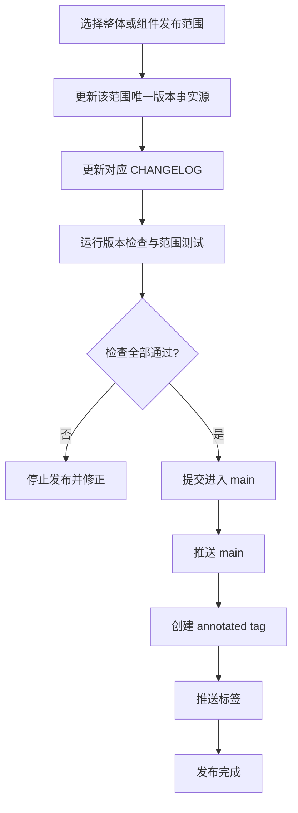
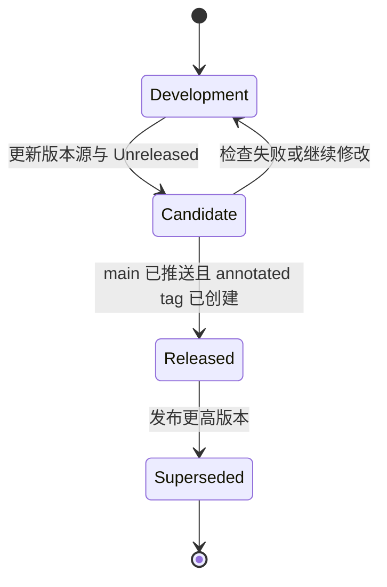

# 多组件版本与发布治理

## 0. 文档状态

| 字段 | 内容 |
| --- | --- |
| 状态 | accepted |
| 当前阶段 | 版本事实源、日志、运行时读取与检查入口已实现；v0.1.0 已发布（2026-08-26 打标签）；0.2.0 已写入 `VERSION` 与 CHANGELOG（2026-08-31），尚未打标签，按 R5–R7 还不算发布 |
| 关联主 SDD | [Glaux SDD 索引](README.md) |
| 负责人 | Glaux 项目维护者 |
| 最后更新 | 2026-09-23 |

> 状态合法值仅四个：`draft` → `ready` → `implemented` → `accepted`。

## 1. 本 SDD 负责什么

本 SDD 规定 Glaux monorepo 的整体产品版本与 Frontend、Backend、Agent Runtime、science-core 四个组件版本如何声明、读取、递增、记录和发布。它是版本事实源、Git 标签、CHANGELOG 与发布前验证的公共工程契约。

## 2. 本 SDD 不负责什么

| 相邻能力 | 归属 |
| --- | --- |
| 各 Feature 的产品边界和验收 | 对应 `docs/sdd/feats/<NN>-<name>/README.md` |
| 模型产物的 `model_version` | 各算法或任务 SDD；它标识模型，不是 Glaux 软件组件版本 |
| Atlas 的 `statement_version` | [SDD 03](feats/03-atlas/README.md)；它标识授权声明契约 |
| 自动发版、制品上传、GitHub Release 工作流 | 后续发布自动化 SDD；本阶段只规定可自动化的手工契约 |
| 分支策略和代码评审策略 | 仓库 Git 协作约定，不在本 SDD 内扩展 |

## 3. 当前阶段目标

- 建立“整体产品版本 + 四组件独立版本”的双层版本模型。
- 首个基线版本定为 `0.1.0`（现行版本以根 `VERSION` 与 CHANGELOG 为准）。
- 每个范围只有一个可编辑版本事实源，删除同组件运行时的重复硬编码。
- 建立整体与组件级 CHANGELOG、标签命名和发布门槛。
- 提供一个无第三方依赖的版本检查入口，验证并输出当前版本矩阵。

## 4. 输入来源

| 输入 | 格式与约束 | 使用方 |
| --- | --- | --- |
| 根 `VERSION` | UTF-8 单行 SemVer；不得带 `v` 前缀 | 整体发布检查、整体标签 |
| `frontend/package.json` 的 `version` | JSON 字符串 SemVer | Frontend 发布检查与包元数据 |
| `backend/pyproject.toml` 的 `project.version` | TOML 字符串 SemVer | Python 构建元数据、Backend 运行时与发布检查 |
| `agent-runtime/package.json` 的 `version` | JSON 字符串 SemVer | Node 包元数据、健康检查与发布检查 |
| `science-core/pyproject.toml` 的 `project.version` | TOML 字符串 SemVer | Python 构建元数据、`glaux_core.__version__` 与发布检查 |
| `package-lock.json` / `uv.lock` | 包管理器生成的版本镜像；不得作为人工修改事实源 | 版本检查只校验其与对应原生清单一致 |
| Git 发布目标 | `main` 上的提交、发布范围、目标标签 | 手工发布流程 |
| 对应 CHANGELOG | `Unreleased` 与带日期版本节 | 发布检查和发布说明 |

五个版本彼此独立；读取完整版本矩阵不代表要求版本值相等。

## 5. 输出结果

| 输出 | 格式与约束 |
| --- | --- |
| 当前版本矩阵 | `product`、`frontend`、`backend`、`agent-runtime`、`science-core` 五个 SemVer |
| Backend `/health.version` | Backend 发行包元数据版本；元数据不可用时为 `unknown` |
| Agent Runtime `/health.version` | `agent-runtime/package.json` 的版本 |
| `glaux_core.__version__` | science-core 发行包元数据版本；元数据不可用时为 `unknown` |
| 整体标签 | annotated tag：`v<version>` |
| 组件标签 | annotated tag：`<component>/v<version>` |
| 发布日志 | 整体日志记录组件矩阵；组件日志只记录该组件变化 |

## 6. 核心流程

整体发布必须在步骤 C 记录四组件版本矩阵，并在步骤 D 运行全仓测试；组件独立发布只验证受影响组件，不修改根 `VERSION`。

## 7. 核心规则

- **R1 双层独立**：整体版本表示一套集成验证基线；组件版本表示各组件自身演进。组件发布不自动提升整体版本。
- **R2 单一事实源**：同一范围只允许修改 §9 指定的事实源；运行时代码必须读取该来源或安装包元数据。`package-lock.json`、`uv.lock` 是包管理器生成镜像，CHANGELOG 的已发布版本是历史记录，二者都不是当前版本事实源。
- **R3 SemVer**：所有版本遵循 `MAJOR.MINOR.PATCH`，可使用 SemVer 预发布与构建后缀；事实源不带 `v`。
- **R4 递增口径**：兼容修复提升 PATCH；新增兼容能力提升 MINOR；`1.0.0` 之后的破坏性变更提升 MAJOR。`0.x` 阶段的破坏性变更至少提升 MINOR，并在日志明确标注。
- **R5 标签不可变**：正式标签只从 `main` 创建，不移动、不删除后重建；错误通过新 patch 版本修正。
- **R6 日志先行**：标签创建前，对应 CHANGELOG 必须存在目标版本和发布日期；整体日志还必须包含组件矩阵。
- **R7 发布顺序**：发布提交先进入并推送 `main`，随后才创建和推送正式标签。
- **R8 不伪造版本**：运行时元数据不可用时返回 `unknown`；不得用硬编码 `0.1.0` 掩盖读取失败。发布检查遇到 `unknown` 必须失败。

## 8. 涉及对象

| 对象 | 责任 |
| --- | --- |
| Product Release | 固化整体版本、同一提交上的组件版本矩阵和全仓验证结果 |
| Component Release | 固化单个组件版本、变更日志和组件验证结果 |
| Version Source | 保存某一发布范围当前版本的唯一可编辑文件字段 |
| Changelog | 保存 `Unreleased` 和不可变的历史版本说明 |
| Git Tag | 把发布版本绑定到 `main` 上的一个确定提交 |
| Version Check | 校验五个来源的格式并输出矩阵；不修改文件 |

本 SDD 不新增数据库表、跨库存储或持久化业务状态。

## 9. 数据或字段要求

| 范围 | 唯一事实源 | 字段/内容 | 初始值 | 标签 |
| --- | --- | --- | --- | --- |
| Product | `/VERSION` | 单行字符串 | `0.1.0` | `v0.1.0` |
| Frontend | `/frontend/package.json` | `version` | `0.1.0` | `frontend/v0.1.0` |
| Backend | `/backend/pyproject.toml` | `project.version` | `0.1.0` | `backend/v0.1.0` |
| Agent Runtime | `/agent-runtime/package.json` | `version` | `0.1.0` | `agent-runtime/v0.1.0` |
| science-core | `/science-core/pyproject.toml` | `project.version` | `0.1.0` | `science-core/v0.1.0` |

发布日志路径固定为 `/CHANGELOG.md` 与四个组件目录下的 `CHANGELOG.md`。每份日志保留 `Unreleased`；正式版本标题包含版本号和 ISO 日期 `YYYY-MM-DD`。根日志的整体版本节必须包含上述四个组件及其精确版本。

Frontend、Agent Runtime 的 `package-lock.json` 与 Backend、science-core 的 `uv.lock` 必须随原生清单更新，并由版本检查验证镜像版本一致；不得直接在锁文件中决定版本。`Unreleased` 不重复声明“当前候选版本”，避免形成随开发漂移的人工副本。

## 10. 重复执行规则

- 版本检查为只读操作，重复执行不修改工作区且输出相同矩阵。
- 对同一提交重复创建已存在标签时必须停止，不覆盖标签。
- 同一版本不得出现两个不同发布日期或两个不同提交；需要修正时递增版本。
- 重跑失败的发布前检查不会产生标签、提交或发布记录。

## 11. 版本生命周期规则

- `Development` 与 `Candidate` 允许继续修改，正式标签尚不存在。
- `Released` 后版本号、发布日期与标签提交不可更改。
- `Superseded` 只表示存在更高版本；旧标签与日志永久保留。

## 12. 审计或事件规则

- Git annotated tag 保存版本、发布日期和发布摘要，是提交级审计记录。
- CHANGELOG 保存面向人的变更分类；整体发布额外保存组件版本矩阵。
- 组件运行时通过健康接口或包属性暴露版本，便于问题现场记录。
- 本阶段不新增应用事件或审计数据库。

## 13. 异常和人工处理

| 异常 | 处理 |
| --- | --- |
| 版本为空或不是 SemVer | 版本检查失败，禁止创建标签 |
| 目标标签与事实源不一致 | 发布停止，人工修正事实源或标签参数 |
| Python 安装包元数据不可用 | 运行时暴露 `unknown`；发布检查失败，不回退硬编码值 |
| Agent Runtime 无法读取 `package.json` | 启动或版本测试失败，提示具体文件路径与解析原因 |
| CHANGELOG 缺目标版本/日期 | 发布停止，补齐日志后重跑 |
| 标签已存在 | 不覆盖；确认是否重复操作，需修正则发布新 patch |
| 组件组合集成失败 | 不提升整体版本；组件既有独立标签保持不变 |

## 14. 与其他 SDD 的调用关系

- 所有 [Feature SDD](README.md#feature-sdd) 在发布时受本规范约束，但本规范不改变其功能契约。
- [SDD 03](feats/03-atlas/README.md) 的 `statement_version` 与本规范的软件版本相互独立。
- [SDD 09](feats/09-chat-distribution/README.md) 的发行镜像版本号遵循本规范 §7 R3 的预发布后缀规则。
- 设计依据见 [多组件版本与发布治理设计](../plans/2026-08-26-version-release-governance-design.md)。

## 15. 验收标准

- [x] 根 `VERSION` 存在且内容为 `0.1.0`。
- [x] 五个事实源均能被版本检查读取并通过 SemVer 校验，输出五项均为 `0.1.0`。
- [x] 两个 `package-lock.json` 和两个 `uv.lock` 的项目版本镜像与对应组件事实源一致；任一漂移会使检查失败。
- [x] 根目录和四组件目录各有一份 CHANGELOG，均包含 `Unreleased`；根日志明确整体发布需记录组件矩阵。
- [x] Agent Runtime 健康检查不再硬编码发布版本，测试证明其值来自 `agent-runtime/package.json`。
- [x] Backend 的 `__version__` 与 `/health.version` 来自 `glaux-backend` 安装包元数据；元数据缺失时显式为 `unknown`。
- [x] `glaux_core.__version__` 来自 `glaux-core` 安装包元数据；元数据缺失时显式为 `unknown`。
- [x] 版本检查重复执行不修改工作区，非法版本输入会以非零状态退出并指出范围与来源文件。
- [x] 相关 Backend、Agent Runtime、science-core 测试与全仓版本检查通过。
- [x] `docs/sdd/README.md` 可导航到本规范，标签、日志和发布门槛与本文一致。

开发侧自查分类：

- **已完成**：上述 10 项验收全部完成；版本脚本 5 项测试、Backend 2 项测试、science-core 4 项测试、Agent Runtime 3 项测试和生产构建均通过，Backend 健康函数另行验证返回 `0.1.0`。
- **未完成**：无本 SDD 范围内未完成项。
- **无法验证**：全仓 Agent Runtime 测试类型检查受工作区既有的工具测试签名错误阻断；Backend 整个 `test_api.py` 在本地数据发现阶段长时间无输出。两者不影响本 SDD 定向验证，首次正式整体发布前仍须满足 §6 的全仓门槛。

## 16. 决策记录

| 编号 | 决策 | 备选 | 选择理由 | 时间 |
| --- | --- | --- | --- | --- |
| D-1 | 采用整体版本 + 组件独立版本 | 全仓统一版本；只有组件版本 | 同时表达集成交付基线和组件独立演进 |
| D-2 | 各组件使用原生清单作为事实源 | 根 `versions.toml`；Git 标签推导 | 避免同步副本，兼容各语言构建生态 |
| D-3 | 允许组件脱离整体版本独立发布 | 任一组件发布都提升整体版本 | 减少无意义整体版本膨胀 |
| D-4 | 整体与组件分别维护 CHANGELOG | 只有根日志；完全依赖提交记录 | 独立版本需要可独立阅读的发布历史 |
| D-5 | 本阶段使用手工发布契约 | 立即建设自动发版 CI | 先稳定事实源和门槛，再自动化不稳定流程 |
| D-6 | 当前整体和四组件版本均为 `0.1.0` | 从 `0.0.x` 起步 | 项目已有四组件 `0.1.0` 元数据，作为首个开发阶段基线 |
| D-7 | 锁文件版本只作为生成镜像并纳入一致性检查 | 忽略锁文件；把锁文件也当事实源 | 防止包管理器镜像漂移，同时不增加人工维护来源 |

## 17. 待确认问题

- 无。
