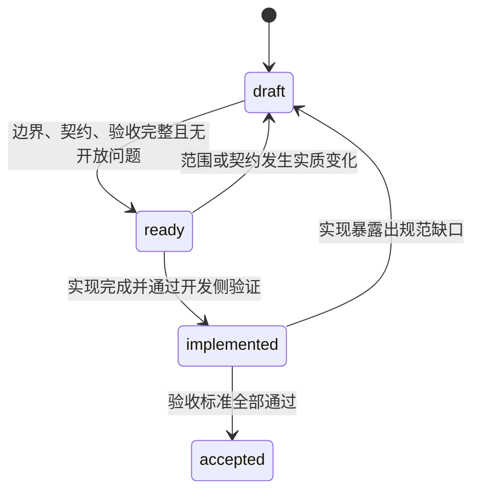

# Glaux SDD 索引

> SDD（Specification-Driven Development）用于在实现前冻结范围、契约、状态机与验收标准。实现计划和代码必须以状态为 `ready` 的 SDD 为输入。

## 生命周期

| 状态 | 含义 | 进入条件 |
| --- | --- | --- |
| `draft` | 规范编写中 | 仍有未决边界、契约或验收项 |
| `ready` | 可进入实现规划 | 范围、输入输出、状态机、错误处理与验收完整，开放问题为零 |
| `implemented` | 已按规范实现 | 实现完成并通过自动化与人工开发验证 |
| `accepted` | 已完成业务验收 | 第 15 节验收标准全部通过 |

## 公共规范

| 编号 | 规范 | 状态 | 负责人 | 更新时间 |
| --- | --- | --- | --- | --- |
| 01 | [多组件版本与发布治理](01-version-release-governance.md) | `implemented` | Glaux 项目维护者 | 2026-08-26 |

## Feature SDD

| 编号 | Feature | 状态 | 负责人 | 更新时间 |
| --- | --- | --- | --- | --- |
| 00 | [内置参考智能体与本地会话管理](feats/00-reference-agent-conversations/README.md) | `implemented`（v1.1 图像附件 D-021） | Glaux 项目维护者 | 2026-08-19 |
| 01 | [双模式外壳 Focus / Workbench](feats/01-dual-mode-shell/README.md) | `implemented`（v1.1 右侧栏；v1 `accepted`） | Glaux 项目维护者 | 2026-08-16 |
| 02 | [智能体图像标注能力](feats/02-agent-image-annotation/README.md) | `ready`（Q1–Q6 收敛，分割后端实测选型） | Glaux 项目维护者 | 2026-08-22 |
| 03 | [Atlas · 图谱（人工策展的图文案例库）](feats/03-atlas/README.md) | `implemented`（v1.2 接入会话 `consult_atlas`） | Glaux 项目维护者 | 2026-08-20 |
| 04 | [统一图像标注工具箱（bbox/polygon/brush）](feats/04-unified-annotation-toolbox/README.md) | `implemented`（浏览器走查验收待补） | Glaux 项目维护者 | 2026-08-17 |
| 05 | [键盘可达性与全局快捷键](feats/05-keyboard-shortcuts-a11y/README.md) | `implemented` | Glaux 项目维护者 | 2026-08-19 |
| 06 | [统一图标系统](feats/06-icon-system/README.md) | `implemented` | Glaux 项目维护者 | 2026-08-19 |

## 维护约定

- Feature 文档路径固定为 `feats/<NN>-<name>/README.md`。
- 每份 Feature SDD 使用第 0～17 节的统一结构。
- 状态变化、契约变化和非兼容决策必须同步更新 Feature 文档及本索引。
- `ready` 文档不得保留未关闭的开放问题；无法当场确定的事项应降级为 `draft`。
- 实现计划引用 SDD 的稳定章节与决策编号，不另行发明产品边界。
