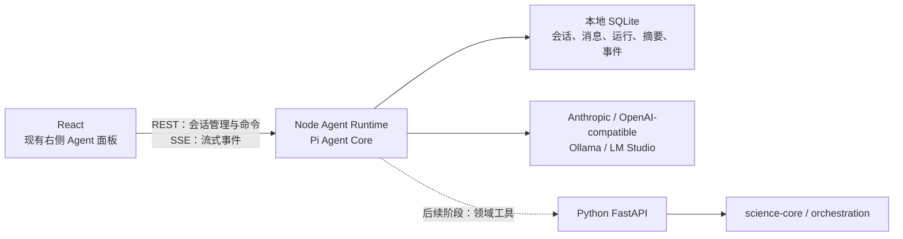
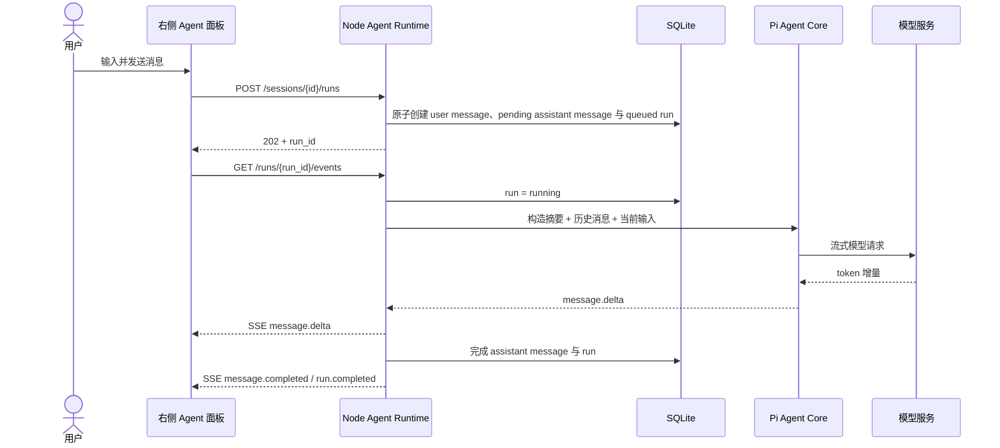
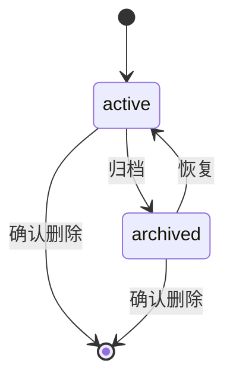
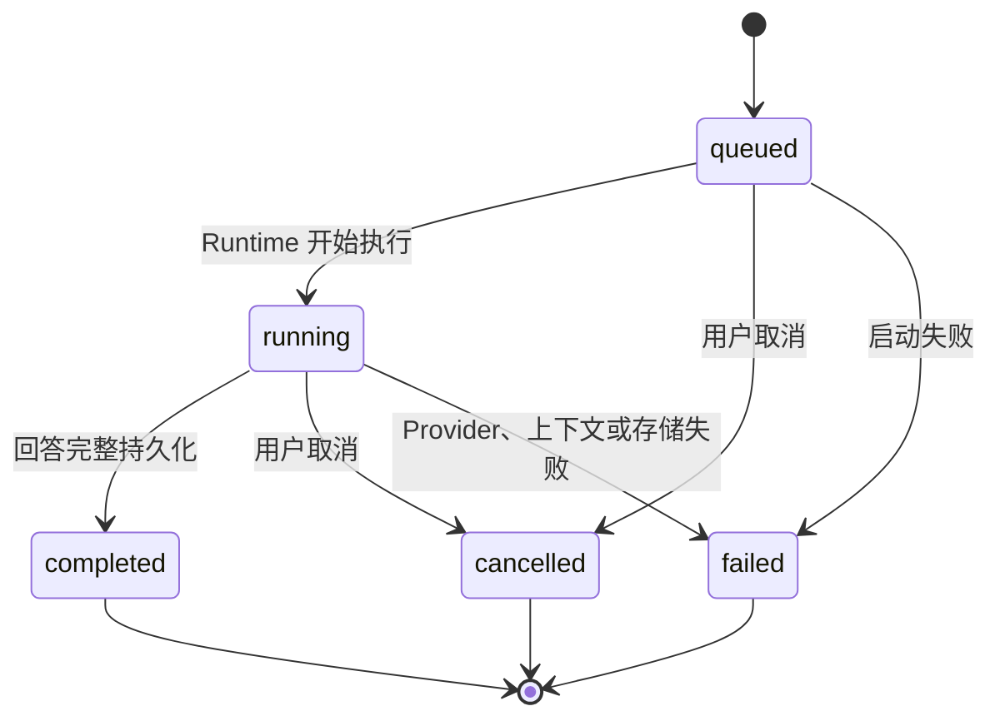
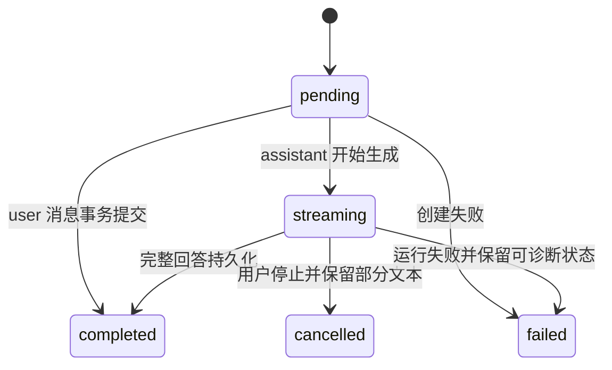
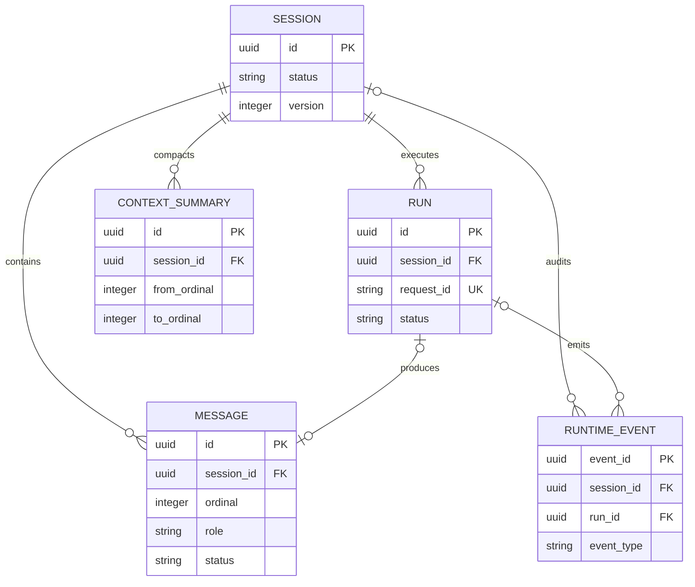

# 内置参考智能体与本地会话管理

## 0. 状态

| 项 | 值 |
| --- | --- |
| SDD 状态 | `ready` |
| 创建日期 | 2026-07-27 |
| 最近更新 | 2026-07-27 |
| 目标阶段 | 第一阶段：可持续使用的本地 AI 对话与会话管理 |
| 上位 SDD | [Glaux SDD 索引](../../README.md) |

进入 `ready` 的依据：本阶段范围、系统边界、持久化模型、HTTP/SSE 契约、生命周期、错误处理及验收标准均已确定，第 17 节无开放问题。

## 1. 负责人

| 角色 | 负责人 |
| --- | --- |
| 产品与范围 | Glaux 项目维护者 |
| 前端 | Glaux 前端维护者 |
| Agent Runtime | Glaux Agent Runtime 维护者 |
| 验收 | Glaux 项目维护者 |

## 2. 非目标

本阶段明确不包含：

- Glaux 领域工具调用，包括 `/task/*`、影像分割、测量、验证与任务编排。
- Agent 的自动规划、执行、验证和迭代闭环。
- MCP、Codex、外部 Agent 进程接入及多 Agent 协作。
- 批量运行、后台队列、定时任务和数据外发。
- 登录、账号、团队空间、云端存储及多设备同步。
- 会话分支、替代回答树、对历史消息编辑后重发。
- 对任意历史 assistant 消息重新生成；仅支持重新生成最近一条回答。
- 将 API Key 迁移至系统钥匙串或建设新的密钥管理系统。
- 重构编辑器、左侧栏、底部面板或 Dock 布局；本阶段只改造现有右侧 Agent 面板。
- 完整的工具权限执行引擎。会话只保存权限模式，为后续领域工具阶段预留契约。

## 3. 当前目标

Glaux 内置一套可独立工作的参考 Agent 会话基础设施，使用户无需外接 Agent 即可在现有右侧栏中完成现代 AI 对话：

- 新建、切换、重命名、归档和删除本地会话。
- 流式发送与接收消息，支持停止生成与重新生成最近回答。
- 重启应用后恢复会话、消息、上下文摘要和运行终态。
- 在上下文接近模型窗口上限时自动压缩历史消息。
- 为后续受控自治、领域工具和外部 Agent 接入提供稳定的运行时边界。

Glaux 仍是智能体运行环境；内置参考 Agent 是默认可用的 harness，不把具体 Agent 实现固化为平台唯一入口。

## 4. 输入

### 4.1 用户输入

| 输入 | 必填 | 说明 |
| --- | --- | --- |
| 消息文本 | 是 | UTF-8 文本；去除首尾空白后不得为空 |
| 当前会话 | 是 | 新会话可在首次发送前自动创建 |
| Provider | 是 | 来自现有 Agent 连接配置 |
| Model | 是 | 来自现有 Agent 连接配置 |
| API Key | 视 Provider 而定 | 每次运行临时传入 Runtime，不持久化、不记录日志 |
| Base URL | 否 | OpenAI-compatible、本地 Ollama/LM Studio 等连接可使用 |
| 权限模式 | 是 | `observe`、`suggest`、`controlled`、`autonomous`；首期默认 `controlled` |

### 4.2 系统输入

- 会话当前消息与最近一次上下文摘要。
- 模型上下文窗口及 token 使用估算。
- 现有 Agent 连接配置中的非敏感 Provider/Model 信息。
- Pi Agent Core 的流式 Agent 事件。

### 4.3 输入约束

- 第一阶段只接受纯文本消息；附件入口可保留视觉占位，但不可发送。
- 同一会话同一时刻至多存在一个 `queued` 或 `running` 的 Run。
- 归档会话只读；恢复为 `active` 后方可继续发送。
- API Key 只能存在于请求处理所需的内存中，禁止写入 SQLite、事件、错误详情和应用日志。

## 5. 输出

### 5.1 用户可见输出

- 按增量流式呈现的 assistant 文本。
- 明确的运行状态：等待、生成中、已完成、已停止、失败。
- 会话列表、归档状态、最近消息时间和当前上下文占用。
- 可恢复的错误提示与重试入口。
- 上下文压缩完成提示，不暴露内部摘要全文。

### 5.2 系统输出

- 持久化的 Session、Message、Run、ContextSummary 和 RuntimeEvent。
- 按第 6.3 节事件契约输出的 SSE 事件。
- 用于排障的 `trace_id`、错误码和经过脱敏的错误详情。

### 5.3 输出保证

- 每个 Run 必须落入且只落入一个终态：`completed`、`cancelled` 或 `failed`。
- SSE 断开不影响 Runtime 继续执行；客户端重连或重新查询后可恢复最终消息与 Run 终态。
- 不保证重放每一个 token 增量，但保证完成消息和终态可恢复。

## 6. 核心流程

### 6.1 系统边界



第一阶段中，React 不再是完整消息历史的事实来源；Node Runtime 与 SQLite 共同承担事实来源。Python FastAPI、`science-core` 和现有任务编排保持不变，也不在本阶段调用链中。

### 6.2 对话流程



### 6.3 HTTP 与 SSE 契约

统一前缀：`/agent-api/v1`。

| 方法 | 路径 | 用途 | 成功响应 |
| --- | --- | --- | --- |
| `GET` | `/health` | Runtime 存活与数据库状态 | `200` |
| `GET` | `/sessions?status=active\|archived` | 获取会话列表 | `200` |
| `POST` | `/sessions` | 新建会话 | `201` |
| `GET` | `/sessions/{session_id}` | 获取会话详情 | `200` |
| `PATCH` | `/sessions/{session_id}` | 重命名、归档/恢复、切换模型或权限模式 | `200` |
| `DELETE` | `/sessions/{session_id}` | 确认后永久删除会话及其从属数据 | `204` |
| `GET` | `/sessions/{session_id}/messages` | 获取按序消息 | `200` |
| `POST` | `/sessions/{session_id}/runs` | 发起普通生成或重新生成 | `202` |
| `GET` | `/runs/{run_id}` | 查询运行快照 | `200` |
| `GET` | `/runs/{run_id}/events` | 订阅流式事件 | `200 text/event-stream` |
| `POST` | `/runs/{run_id}/cancel` | 请求停止运行 | `202`；已终态时幂等返回当前状态 |

新建会话及发起 Run 必须携带 `Idempotency-Key`。更新会话必须携带 `expected_version`，版本冲突返回 `409 version_conflict`。

普通生成请求：

```json
{
  "mode": "prompt",
  "content": "解释当前影像中的可疑区域",
  "connection": {
    "provider": "openai-compatible",
    "model": "example-model",
    "base_url": "http://127.0.0.1:1234/v1",
    "credential": "ephemeral-api-key"
  }
}
```

重新生成请求：

```json
{
  "mode": "regenerate",
  "target_message_id": "msg_uuid",
  "connection": {
    "provider": "openai-compatible",
    "model": "example-model",
    "credential": "ephemeral-api-key"
  }
}
```

`credential` 仅存在于该请求的内存生命周期中。响应、日志、事件和数据库中均不得出现该字段值。

SSE 事件类型：

- `run.started`
- `message.started`
- `message.delta`
- `message.completed`
- `run.completed`
- `run.failed`
- `run.cancelled`
- `context.compacted`

所有事件使用统一 envelope：

```json
{
  "event_id": "evt_uuid",
  "event_type": "message.delta",
  "event_version": 1,
  "session_id": "session_uuid",
  "run_id": "run_uuid",
  "occurred_at": "2026-07-27T12:00:00.000Z",
  "trace_id": "trace_uuid",
  "sequence": 3,
  "payload": {}
}
```

同一 Run 的 `sequence` 从 1 严格递增。客户端可发送 `Last-Event-ID` 重连；Runtime 至少返回该 Run 的当前快照和尚未确认的持久化终态事件。

### 6.4 会话侧栏交互

现有右侧 Agent Dock 保持默认宽度 `340px`，布局位置和 Dock 持久化机制不变。面板内部划分为：

1. 顶栏：当前会话标题、会话列表、新建会话、更多菜单。
2. 配置栏：Provider/Model、权限模式、上下文占用。
3. 消息区：用户与 assistant 消息、流式状态、停止/重试/重新生成入口。
4. 输入区：多行文本、发送/停止；附件入口第一阶段禁用并标注未开放。
5. 会话抽屉：在右侧面板内部覆盖展开，支持搜索、切换、重命名、归档、恢复和删除。

不得新增分支按钮、历史消息编辑入口或替代回答版本选择器。

## 7. 规则

1. 首条用户消息成功入库时生成会话标题：压缩连续空白并截取前 30 个 Unicode 字符；不额外调用模型。
2. 新建但尚未发送消息的空会话最多保留一个；再次点击新建时复用该空会话。
3. 会话列表按 `last_message_at DESC, updated_at DESC` 排序。
4. 归档不删除数据；归档会话只读，恢复后可继续发送。
5. 删除是永久操作，前端必须展示会话标题和不可恢复提示后再调用接口。
6. 同一会话只能有一个活动 Run；不同会话可并发生成。
7. 切换会话不得取消正在生成的 Run。
8. 停止生成保留已经收到的部分文本，并把 Message 与 Run 标记为 `cancelled`。
9. 仅最近一条 assistant 消息可重新生成，且其前一条消息必须为 user。
10. 重新生成成功后更新同一个 assistant Message，消息数量不变，`revision` 加一；失败或取消时保留原回答不变。
11. 历史 user 消息不可编辑；任何“编辑后重发”能力必须作为未来分支 Feature 另行立项。
12. 上下文达到模型窗口估算值的 70% 时触发压缩，优先压缩最旧的完整轮次，目标降至 50% 以下。
13. 当前运行轮次、最新摘要之后的未完成消息和 system prompt 不参与压缩。
14. 压缩失败时不得静默丢弃消息；若仍能在模型硬限制内运行可继续，否则以 `context_overflow` 失败。
15. 权限模式按 `observe < suggest < controlled < autonomous` 排序。第一阶段不执行工具，但必须原样持久化并展示所选模式。
16. Pi 依赖使用 `@earendil-works/pi-agent-core` 与 `@earendil-works/pi-ai`，并由 lockfile 锁定精确解析版本；禁止使用已废弃的 `@mariozechner/pi-agent-core` 包名。
17. 普通生成直接把增量写入新建的 pending assistant Message；重新生成先把候选回答写入 Run 缓冲区，仅在成功时替换目标 Message。

## 8. 对象

| 对象 | 职责 |
| --- | --- |
| `Session` | 会话元数据、默认模型、权限模式、乐观锁版本 |
| `Message` | 有序的 user/assistant/system 内容及生成状态 |
| `Run` | 一次普通生成或重新生成的执行快照 |
| `ContextSummary` | 被压缩历史区间的结构化文本摘要 |
| `RuntimeEvent` | 可审计的持久化关键事件，不保存全部 token 增量 |
| `ConnectionInput` | 单次 Run 的模型连接输入；敏感 credential 不持久化 |

## 9. 字段

所有 ID 使用 UUID；时间使用 UTC ISO 8601，SQLite 中以带时区文本存储。

### 9.1 Session

| 字段 | 类型 | 约束 |
| --- | --- | --- |
| `id` | UUID | 主键 |
| `title` | text | 1～100 字符 |
| `status` | enum | `active`、`archived` |
| `provider` | text | 非空 |
| `model` | text | 非空 |
| `permission_mode` | enum | `observe`、`suggest`、`controlled`、`autonomous` |
| `version` | integer | 初始 1，每次更新加一 |
| `created_at` | datetime | 非空 |
| `updated_at` | datetime | 非空 |
| `last_message_at` | datetime nullable | 消息提交后更新 |

### 9.2 Message

| 字段 | 类型 | 约束 |
| --- | --- | --- |
| `id` | UUID | 主键 |
| `session_id` | UUID | 外键，删除会话时级联删除 |
| `ordinal` | integer | 会话内递增；`UNIQUE(session_id, ordinal)` |
| `role` | enum | `user`、`assistant`、`system` |
| `content_json` | JSON text | 第一阶段仅保存文本内容块 |
| `status` | enum | `pending`、`streaming`、`completed`、`cancelled`、`failed` |
| `revision` | integer | 初始 1；重新生成成功后加一 |
| `created_at` | datetime | 非空 |
| `completed_at` | datetime nullable | 进入终态时填写 |
| `input_tokens` | integer nullable | Provider 可返回时记录 |
| `output_tokens` | integer nullable | Provider 可返回时记录 |

### 9.3 Run

| 字段 | 类型 | 约束 |
| --- | --- | --- |
| `id` | UUID | 主键 |
| `session_id` | UUID | 外键 |
| `request_id` | text | 对应 `Idempotency-Key`；全局唯一 |
| `mode` | enum | `prompt`、`regenerate` |
| `target_message_id` | UUID nullable | `regenerate` 时必填 |
| `output_message_id` | UUID | 普通生成指向新 assistant Message；重新生成指向目标 Message |
| `output_buffer_json` | JSON text nullable | 重新生成候选回答的暂存区，禁止覆盖原回答 |
| `status` | enum | `queued`、`running`、`completed`、`cancelled`、`failed` |
| `provider_snapshot` | text | 本次运行实际 Provider |
| `model_snapshot` | text | 本次运行实际 Model |
| `trace_id` | UUID | 非空 |
| `error_code` | text nullable | 失败时填写 |
| `error_detail` | text nullable | 脱敏后的可诊断信息 |
| `started_at` | datetime nullable | 开始执行时填写 |
| `ended_at` | datetime nullable | 进入终态时填写 |

数据库必须通过事务或部分唯一索引保证每个 `session_id` 只有一个状态为 `queued`/`running` 的 Run。

### 9.4 ContextSummary

| 字段 | 类型 | 约束 |
| --- | --- | --- |
| `id` | UUID | 主键 |
| `session_id` | UUID | 逻辑关联，不设外键；会话删除后仍保留审计事件 |
| `from_ordinal` | integer | 摘要覆盖区间起点 |
| `to_ordinal` | integer | 摘要覆盖区间终点 |
| `content` | text | 不得为空 |
| `token_count` | integer | 摘要 token 估算 |
| `created_at` | datetime | 非空 |

同一会话运行时上下文只使用最新摘要及其 `to_ordinal` 之后的消息。

### 9.5 RuntimeEvent

| 字段 | 类型 | 约束 |
| --- | --- | --- |
| `event_id` | UUID | 主键 |
| `session_id` | UUID | 外键 |
| `run_id` | UUID nullable | 会话操作事件可为空 |
| `event_type` | text | 第 12 节定义的类型 |
| `event_version` | integer | 初始 1 |
| `sequence` | integer nullable | Run 事件内单调递增 |
| `payload_json` | JSON text | 禁止包含 credential |
| `trace_id` | UUID | 非空 |
| `occurred_at` | datetime | 非空 |

## 10. 幂等性

- `POST /sessions` 和 `POST /sessions/{id}/runs` 必须接受 `Idempotency-Key`。
- 相同 Key、相同请求体重复提交，返回首次创建的资源和相同状态，不重复创建消息或 Run。
- 相同 Key、不同请求体返回 `409 idempotency_conflict`。
- `POST /runs/{id}/cancel` 是幂等操作；Run 已终止时返回已有终态。
- `PATCH /sessions/{id}` 使用 `expected_version` 乐观锁；版本不一致时不做任何写入。
- 普通生成中，user Message、pending assistant Message 与 Run 必须在同一事务创建，避免孤立消息或孤立 Run。
- 重新生成的增量写入 `Run.output_buffer_json`；仅在新回答成功后以事务替换目标 Message 并清空缓冲区，失败或取消不改变原回答。

## 11. 生命周期

### 11.1 Session



### 11.2 Run



### 11.3 Message



Runtime 非正常退出后，下次启动必须将遗留的 `queued`/`running` Run 标记为 `failed(runtime_interrupted)`，对应未终态 assistant Message 标记为 `failed`，已有部分文本继续保留。

## 12. 审计与事件

以下事件必须持久化到 `RuntimeEvent`：

| 事件 | 触发点 | 最小 payload |
| --- | --- | --- |
| `session.created` | 创建会话 | `session_id` |
| `session.updated` | 标题、模型、权限或状态变化 | 变化字段名，不存敏感值 |
| `session.deleted` | 删除事务提交后 | `session_id`、`title` |
| `run.started` | Run 进入 `running` | Provider、Model |
| `message.completed` | assistant Message 完成 | `message_id`、token 统计 |
| `run.completed` | Run 完成 | `message_id` |
| `run.failed` | Run 失败 | `error_code` |
| `run.cancelled` | Run 被停止 | `message_id` |
| `context.compacted` | 新摘要生效 | 区间、压缩前后 token 估算 |
| `runtime.recovered` | 启动时处理遗留 Run | 受影响 Run ID |

`message.delta` 只通过 SSE 传输，不逐 token 持久化。日志、事件和错误详情统一通过敏感字段过滤器，至少遮蔽 `credential`、`api_key`、`authorization` 及 Bearer token。

## 13. 错误与人工处理

| 错误码 | HTTP/场景 | 用户表现 | 人工处理 |
| --- | --- | --- | --- |
| `runtime_unavailable` | UI 无法连接 Runtime | 顶部离线提示，输入只读 | 重启 Runtime，恢复后刷新 |
| `provider_auth_failed` | `401/403` | 提示检查连接凭据 | 打开现有连接配置重新验证 |
| `provider_rate_limited` | `429` | 显示可重试提示 | 等待后重试 |
| `provider_unreachable` | 网络/本地模型不可达 | 显示 Provider 与脱敏地址 | 启动本地模型或检查网络 |
| `context_overflow` | 无法压缩到硬限制内 | 保留原消息并说明上下文过长 | 新建会话或手动清理历史（后续能力） |
| `run_in_progress` | 同会话已有活动 Run | `409`，聚焦当前 Run | 停止当前生成或等待完成 |
| `version_conflict` | 会话版本过期 | `409`，重新拉取会话 | 刷新后重试操作 |
| `session_not_found` | 会话不存在 | `404` | 回到会话列表 |
| `message_not_regenerable` | 目标不是最近 assistant 消息 | `409` | 重新拉取消息并仅操作最新回答 |
| `runtime_interrupted` | Runtime 异常退出 | 部分回答标记失败，可重试 | 重新生成最近回答 |
| `storage_error` | SQLite 读写失败 | 禁止继续生成，保留诊断 ID | 检查磁盘、权限与数据库完整性 |

所有未知错误映射为 `internal_error`，仅向用户展示 `trace_id` 和安全摘要，禁止透出堆栈、请求头或 credential。

## 14. 关联关系



相关上位与既有文档：

- [Glaux 纲领](../../../roadmaps/charter.zh-CN.md)：Glaux 是环境/harness，参考 Agent 不是唯一入口。
- [产品路线图](../../../roadmaps/20260705-product-roadmap.zh-CN.md)：Agent 框架与 MCP 的阶段背景。
- [IDE 前端设计](../../../designs/2026-07-06-glaux-ide-frontend.zh-CN.md)：当前 Dock 与 Agent 面板位置。
- [Agent 连接配置设计](../../../designs/2026-07-14-001-agent-connection-config.zh-CN.md)：现有 Provider/Model/API Key 输入来源。
- [多模态架构设计](../../../designs/2026-07-07-glaux-multimodal-architecture.zh-CN.md)：后续领域任务与当前会话层的边界。

## 15. 验收标准

### 15.1 会话与持久化

- [ ] 可新建会话；发送首条消息后按第 7.1 条自动生成标题。
- [ ] 可在至少 20 个会话中搜索和切换，消息互不串线。
- [ ] 可重命名、归档、恢复和确认删除会话；归档会话只读。
- [ ] 刷新前端或重启应用后，会话、消息、归档状态、模型与权限模式保持一致。
- [ ] 新建多个空会话时，系统只保留一个未发送消息的空会话。

### 15.2 流式运行

- [ ] 普通生成按 SSE 增量展示，事件 `sequence` 严格递增。
- [ ] 切换到其他会话不取消生成；返回后可看到实时状态或最终回答。
- [ ] 点击停止后 1 秒内 Run 进入 `cancelled`，已经生成的部分文本可见。
- [ ] SSE 中断并重连后，最终消息与 Run 终态能够恢复。
- [ ] Runtime 异常退出再启动后，遗留 Run 进入 `failed(runtime_interrupted)`，部分文本不丢失。
- [ ] 同会话并发发起第二个 Run 返回 `409 run_in_progress`；不同会话可以并发运行。

### 15.3 重新生成与无分支约束

- [ ] 仅最近一条 assistant 回答显示“重新生成”。
- [ ] 重新生成成功后更新同一个 Message，`revision` 加一，消息数量不变。
- [ ] 重新生成失败或取消时原回答保持不变。
- [ ] UI 不出现会话分支、替代回答、编辑历史消息或编辑后重发入口。

### 15.4 上下文

- [ ] 测试上下文占用达到 70% 时自动压缩最旧完整轮次，并降至 50% 以下。
- [ ] 压缩后模型输入由 system prompt、最新摘要和摘要后的消息组成。
- [ ] 压缩失败不会静默删除消息；超过硬限制时返回 `context_overflow`。
- [ ] 压缩与 Run 终态在刷新后仍可恢复。

### 15.5 安全与兼容

- [ ] 自动扫描 SQLite、RuntimeEvent、应用日志和错误响应，API Key/Authorization/Bearer token 均不存在。
- [ ] Pi Agent Core 使用当前维护的包名并由 lockfile 锁定精确版本；依赖树中不存在废弃包 `@mariozechner/pi-agent-core`。
- [ ] 编辑器、左侧栏、底部面板及 Dock 布局行为无回归。
- [ ] Agent 面板仍位于右侧 Dock，默认宽度为 `340px`，用户调整后的 Dock 布局可恢复。
- [ ] Python FastAPI、`science-core` 与现有 `/task/*` 行为无需修改即可通过既有测试。

### 15.6 API 契约

- [ ] 新建会话与新建 Run 的重复 `Idempotency-Key` 不产生重复资源。
- [ ] 同 Key 不同请求体返回 `409 idempotency_conflict`。
- [ ] 会话 `expected_version` 冲突时返回 `409 version_conflict` 且无部分写入。
- [ ] 每个 Run 恰好一个终态，完成消息和终态事件均持久化。

## 16. 决策记录

| 编号 | 日期 | 决策 | 理由 |
| --- | --- | --- | --- |
| D-001 | 2026-07-27 | Glaux 内置参考 Agent harness，同时保留外部 Agent 接入边界 | 开箱即用，但不把平台锁死为单一 Agent |
| D-002 | 2026-07-27 | 使用 Pi Agent Core，不使用完整 `pi-coding-agent` | 复用精简 Agent loop、流式与状态能力，避免引入编码 Agent UI/CLI 假设 |
| D-003 | 2026-07-27 | Agent Runtime 采用 Node sidecar | Pi 原生 TypeScript，与 React/Python 主体解耦 |
| D-004 | 2026-07-27 | 第一阶段 UI 局限在现有右侧 Agent 面板 | 保持编辑器信息架构稳定，降低视觉与交互改造风险 |
| D-005 | 2026-07-27 | 命令与查询使用 REST，流式输出使用 SSE | 当前是单向流式需求，无需 WebSocket 复杂度 |
| D-006 | 2026-07-27 | 会话数据使用本地 SQLite | 支持可靠恢复和事务，无需账号与云同步 |
| D-007 | 2026-07-27 | 第一阶段砍掉会话分支和历史编辑重发 | 二者共享分支语义，超出首期“跑通对话与会话管理”目标 |
| D-008 | 2026-07-27 | 第一阶段只做对话，不接领域工具 | 先稳定 Agent harness 与会话事实来源 |
| D-009 | 2026-07-27 | API Key 每次运行临时传递，不写 SQLite | 延续现有连接配置且避免扩大敏感数据持久化面 |
| D-010 | 2026-07-27 | 会话标题从首条用户消息确定性截取 | 避免额外模型请求、延迟与失败点 |
| D-011 | 2026-07-27 | 同一会话最多一个活动 Run | 简化消息顺序、停止与恢复语义 |
| D-012 | 2026-07-27 | Pi 依赖使用维护中的包名并精确锁定 | Pi 演进较快，防止包迁移或次版本变化破坏运行时 |
| D-013 | 2026-07-27 | 第一阶段不修改 Python FastAPI 与 science-core | 对话层与领域执行层分离，为后续工具封装保留稳定边界 |
| D-014 | 2026-07-27 | 重新生成成功时原位更新最新 assistant Message | 满足重试需求，同时不引入替代回答树和分支模型 |

## 17. 开放问题

无（截至 2026-07-27）。
