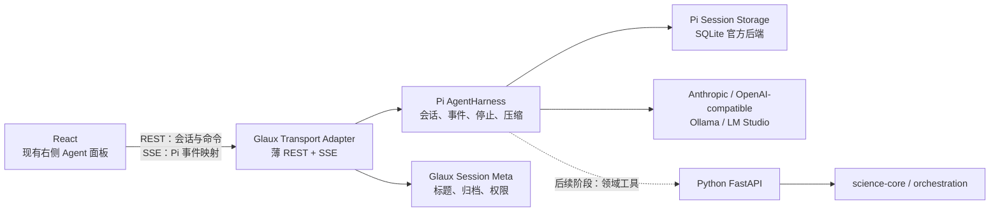
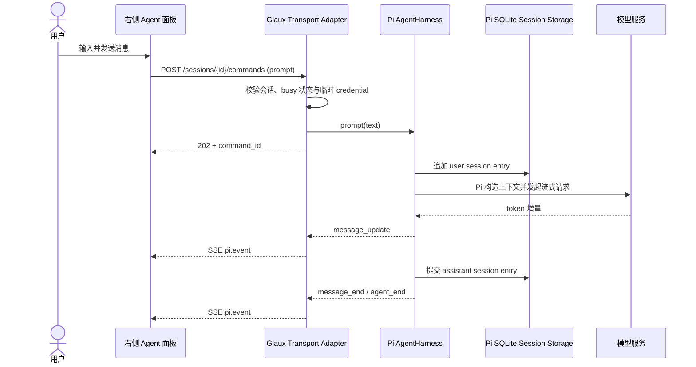
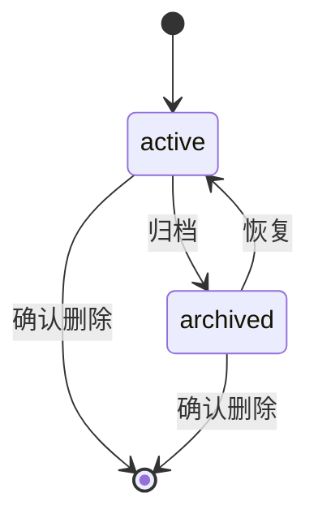
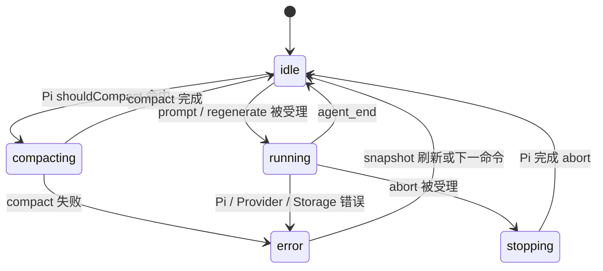
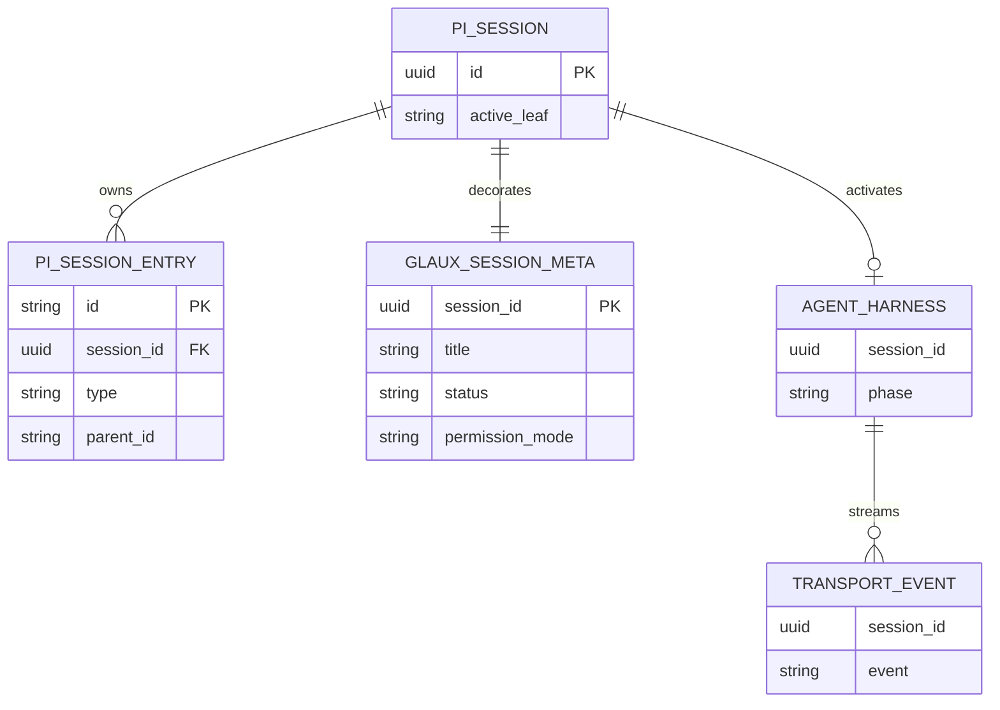

# 内置参考智能体与本地会话管理

## 0. 状态

| 项 | 值 |
| --- | --- |
| SDD 状态 | `implemented` |
| 创建日期 | 2026-07-27 |
| 最近更新 | 2026-08-19 |
| 目标阶段 | 第一阶段：可持续使用的本地 AI 对话与会话管理 |
| 上位 SDD | [Glaux SDD 索引](../../README.md) |

进入 `implemented` 的依据：Runtime、REST/SSE Adapter、右侧栏会话 UI 与运行手册已经完成；
Runtime、前端和既有 Python 测试均通过，编译产物健康检查返回 `adapter/pi/storage = ok`。真实
Provider smoke 与 Dock 拖动/刷新属于业务验收前的人工检查，因此尚未进入 `accepted`。

## 1. 负责人

| 角色 | 负责人 |
| --- | --- |
| 产品与范围 | Glaux 项目维护者 |
| 前端 | Glaux 前端维护者 |
| Agent Runtime | Glaux Agent Runtime 维护者 |
| 验收 | Glaux 项目维护者 |

## 2. 非目标

本阶段明确不包含：

- Glaux 领域工具调用，包括 `/task/*`、影像分割、测量、验证与任务编排。
- Agent 的自动规划、执行、验证和迭代闭环。
- MCP、Codex、外部 Agent 进程接入及多 Agent 协作。
- 批量运行、后台队列、定时任务和数据外发。
- 登录、账号、团队空间、云端存储及多设备同步。
- 面向用户的会话分支创建、导航、比较和替代回答树。Pi 可在内部保留消息树，但第一阶段只展示活动叶路径。
- 对任意历史 assistant 消息重新生成；仅支持重新生成最近一条回答。
- 将 API Key 迁移至系统钥匙串或建设新的密钥管理系统。
- 重构编辑器、左侧栏、底部面板或 Dock 布局；本阶段只改造现有右侧 Agent 面板。
- 完整的工具权限执行引擎。会话只保存权限模式，为后续领域工具阶段预留契约。

## 3. 当前目标

Glaux 内置一套可独立工作的参考 Agent 会话基础设施，使用户无需外接 Agent 即可在现有右侧栏中完成现代 AI 对话：

- 新建、切换、重命名、归档和删除本地会话。
- 流式发送与接收消息，支持停止生成与重新生成最近回答。
- 重启应用后从 Pi Session Storage 恢复会话、活动消息路径和上下文压缩结果。
- 复用 Pi 的上下文估算与压缩能力，避免建设第二套摘要系统。
- 为后续受控自治、领域工具和外部 Agent 接入提供稳定的运行时边界。

Glaux 仍是智能体运行环境；内置参考 Agent 由 Pi `AgentHarness` 提供默认 harness，Glaux 只增加产品元数据和浏览器 Transport Adapter，不把具体 Agent 实现固化为平台唯一入口。

## 4. 输入

### 4.1 用户输入

| 输入 | 必填 | 说明 |
| --- | --- | --- |
| 消息文本 | 是 | UTF-8 文本；去除首尾空白后不得为空。带图像附件时可为空（见 D-021） |
| 图像附件 | 否 | 粘贴、选择或拖放进 Composer 的图像；随该条 prompt 内联下发，见 §4.3 与 D-021 |
| 当前会话 | 是 | 新会话可在首次发送前自动创建 |
| Provider | 是 | 来自现有 Agent 连接配置 |
| Model | 是 | 来自现有 Agent 连接配置 |
| API Key | 视 Provider 而定 | 每次运行临时传入 Runtime，不持久化、不记录日志 |
| Base URL | 否 | OpenAI-compatible、本地 Ollama/LM Studio 等连接可使用 |
| Context Window | 自定义模型必填 | Pi 内置目录已知的模型可省略；否则提供模型上下文上限 |
| Max Output Tokens | 自定义模型必填 | Pi 内置目录已知的模型可省略；否则提供单次输出上限 |
| 权限模式 | 是 | `observe`、`suggest`、`controlled`、`autonomous`；首期默认 `controlled` |

### 4.2 系统输入

- Pi Session 的活动叶路径、模型选择、工具选择和 compaction entry。
- Pi `AgentHarness` 的阶段、上下文 token 估算及原生流式事件。
- 现有 Agent 连接配置中的非敏感 Provider/Model 信息。
- Glaux 会话元数据：标题、归档状态和权限模式。

### 4.3 输入约束

- 消息由文本与**图像附件**组成（2026-08-19，D-021）。附件在 Composer 里通过粘贴（`paste`）、
  文件选择或拖放加入，以 base64 内联在 `prompt` 命令中下发，不落 Glaux 侧独立文件存储。
  约束：MIME 限 `image/png`、`image/jpeg`、`image/webp`、`image/gif`；单张 base64 ≤ 12 MiB
  （与 `/atlas/describe` 同一上限）；单条消息 ≤ 6 张、合计 base64 ≤ 24 MiB。超限在 UI 侧
  拦截并提示，runtime 侧同样校验并返回 `invalid_request`。
- 文本与附件至少有其一非空；纯附件消息合法（用户贴图后直接发送，等同"看这张图"）。
- 图像附件仅限静态图像，不接受视频、PDF 或任意文件——领域影像（CT/WSI）仍走查看器上下文
  与 `run_task`，不经此通道（D-021 理由 ③）。
- 同一 Pi Session 同一时刻至多有一个非 `idle` 的 `AgentHarness` 操作。
- 归档会话只读；恢复为 `active` 后方可继续发送。
- API Key 只能存在于请求处理所需的内存中，禁止写入 SQLite、事件、错误详情和应用日志。
- Runtime 优先从 Pi 内置 model catalog 解析模型元数据。无法解析的自定义模型必须同时提供
  `context_window` 与 `max_tokens`；`context_window >= 1024`、`max_tokens >= 1` 且
  `max_tokens < context_window`，禁止由 Glaux 静默猜测默认值。
- 上条约束是 **runtime 契约层**的：runtime 收不到就报 `model_metadata_required`，永不自行代入。
  **UI 层（2026-08-19 决议）反过来负责让用户不必手填**：拉取模型时尽力探测上游元数据
  （Ollama `/api/show` 的 `model_info.*.context_length`；OpenAI 兼容 `/models` 条目上的
  `context_length` / `max_context_length` / `max_output_tokens` 等常见字段），探到即预填选定模型的值；
  探不到则预填默认 `context_window=128000`、`max_tokens=8192`。预填值**始终可见且可改**，
  因此送到 runtime 的仍是用户可核对的显式值——不是静默猜测。
- Glaux 不直接读写 Pi SQLite 内部表；所有 transcript、消息树和 compaction 操作必须通过 Pi Session/Harness API。

## 5. 输出

### 5.1 用户可见输出

- 按增量流式呈现的 assistant 文本（2026-08-13 起以 Markdown 渲染：react-markdown + GFM，不放行原始 HTML；用户消息保持纯文本）。
- 明确的运行状态：等待、生成中、已完成、已停止、失败。
- 会话列表、归档状态、最近消息时间和当前上下文占用。
- 可恢复的错误提示与重试入口。
- 上下文压缩完成提示，不暴露内部摘要全文。

### 5.2 系统输出

- 由 Pi Session Storage 持久化的 session entry、消息树和 compaction entry。
- 由 Glaux 持久化的最小产品元数据：标题、归档状态和权限模式。
- 按第 6.3 节映射的 Pi 原生 SSE 事件。
- 用于排障的 `trace_id`、错误码和经过脱敏的错误详情。

### 5.3 输出保证

- 每个 command 必须收到一次同步受理结果，并最终通过 Pi 事件回到 `idle` 或产生明确错误。
- SSE 断开不影响 `AgentHarness` 继续执行；客户端重连时先接收最新 session snapshot，再接收后续实时事件。
- 不持久化或重放每一个 token 增量；已提交到 Pi Session 的消息和压缩结果必须可恢复。
- Runtime 进程崩溃时允许丢失尚未提交的流式 token，但不得损坏上一次已提交的 Pi Session 状态。

## 6. 核心流程

### 6.1 系统边界



第一阶段中：

- Pi `AgentHarness` 是 Agent 执行、消息树、停止和上下文压缩的事实来源。
- `@earendil-works/pi-storage-sqlite-node` 是 transcript 与 Pi Session 的持久化实现。
- Glaux Transport Adapter 只负责浏览器传输、会话产品元数据、连接凭据注入和错误映射。
- Glaux 不复制 Pi 的 Message、Run、ContextSummary 或 RuntimeEvent 数据模型。
- 官方 `@earendil-works/pi-server` 当前是实验性 coding-agent/RPC 服务，不作为 Glaux 产品协议依赖。
- Python FastAPI、`science-core` 和现有任务编排保持不变，也不在本阶段调用链中。

### 6.2 对话流程



### 6.3 Glaux Transport Adapter 契约

统一前缀：`/agent-api/v1`。

| 方法 | 路径 | 用途 | 成功响应 |
| --- | --- | --- | --- |
| `GET` | `/health` | Adapter、Pi Harness 与 Storage 可用状态 | `200` |
| `GET` | `/sessions?status=active\|archived` | 获取会话列表 | `200` |
| `POST` | `/sessions` | 以客户端 UUID 创建 Pi Session 与 Glaux 元数据 | `201`；已存在且参数一致时 `200` |
| `GET` | `/sessions/{session_id}` | 获取元数据、活动叶消息、模型、context usage 与当前 phase | `200` |
| `PATCH` | `/sessions/{session_id}` | 重命名、归档/恢复、切换模型或权限模式 | `200` |
| `DELETE` | `/sessions/{session_id}` | 确认后删除 Pi Session 与 Glaux 元数据 | `204` |
| `POST` | `/sessions/{session_id}/commands` | `prompt`、`regenerate` 或 `abort` | `202`；校验失败时 `4xx` |
| `GET` | `/sessions/{session_id}/events` | 接收 snapshot 及 Pi 原生实时事件 | `200 text/event-stream` |

这些接口是 Glaux 面向浏览器的稳定适配契约，不是重新实现 Agent 协议。Adapter 内部必须调用 Pi Session/Harness 公共 API，禁止直接操作 Pi SQLite 表。

命令请求：

```json
{
  "command_id": "client-generated-uuid",
  "type": "prompt",
  "content": "解释当前影像中的可疑区域",
  "images": [
    { "data": "iVBORw0KGgo...", "mime_type": "image/png" }
  ],
  "connection": {
    "provider": "openai-compatible",
    "model": "example-model",
    "base_url": "http://127.0.0.1:1234/v1",
    "context_window": 32768,
    "max_tokens": 4096,
    "credential": "ephemeral-api-key"
  }
}
```

约束：

- `prompt` 必须包含非空 `content` 或非空 `images`（二者至少其一）。
- `images[]` 每项为 `{ data, mime_type }`：`data` 是**不带 `data:` 前缀**的 base64；
  `mime_type` 必须落在 §4.3 白名单内。数量与体积上限见 §4.3。
- `images` 只在 `type = "prompt"` 时允许出现；`regenerate` / `abort` 携带即 `invalid_request`。
- 带附件的 `prompt` **必须**同时带 `connection.vision = true`（D-022）。pi 在模型 `input` 不含
  `"image"` 时不报错，而是把用户消息里的图换成 `(image omitted: ...)` 文本占位，模型照常作答——
  漏传的表现是"能对话但读不懂图"，没有任何错误可循。`regenerate` 同样要带，因为它会连原图重发。
- `regenerate` 不接收任意目标 ID，只操作活动路径上的最近一条 assistant 回答。
- `abort` 不包含 `content` 或 `connection`。
- `credential` 仅存在于该命令的内存生命周期中，不得出现在响应、日志、事件或数据库。
- `context_window` 与 `max_tokens` 对 Pi 内置目录已知模型可省略；自定义模型必须成对提供并满足
  §4.3 的数值约束。
- `command_id` 关联 Pi namespaced `glaux.command.accepted/settled` entries，用于避免网络重试产生重复 prompt。

SSE 只定义三种 Adapter 事件，不复制 Pi 完整事件体系：

| SSE event | payload | 说明 |
| --- | --- | --- |
| `snapshot` | `SessionView` | 建立连接和每次重连时首先发送 |
| `pi.event` | `{ session_id, command_id?, event }` | `event` 原样承载当前锁定版本的 `AgentHarnessEvent` |
| `adapter.error` | `{ session_id, command_id?, code, message, trace_id }` | 传输、配置或事件映射失败 |

Pi 事件至少覆盖 `agent_start`、`turn_start`、`message_start`、`message_update`、`message_end`、`turn_end`、`agent_end` 以及 harness 的 compaction 事件。Adapter 不重命名 Pi 事件字段；升级 Pi 导致事件不兼容时必须先修订本 SDD。

SSE 不提供历史 token 重放，也不持久化第二份 RuntimeEvent。重连流程必须先注册 Pi 事件监听器、暂存其后事件，再生成并发送 `snapshot`，最后按发生顺序排空暂存事件，以避免 snapshot 与实时事件之间出现缺口。

### 6.4 会话侧栏交互

现有右侧 Agent Dock 保持默认宽度 `340px`，布局位置和 Dock 持久化机制不变。面板内部划分为：

1. 顶栏：当前会话标题、会话列表、新建会话、更多菜单。
2. 配置栏：Provider/Model、权限模式、上下文占用。
3. 消息区：用户与 assistant 消息、流式状态、停止/重试/重新生成入口。
4. 输入区：多行文本、发送/停止；附件入口第一阶段禁用并标注未开放。
5. 会话抽屉：在右侧面板内部覆盖展开，支持搜索、切换、重命名、归档、恢复和删除。

不得新增分支按钮、历史消息编辑入口或替代回答版本选择器。

## 7. 规则

1. 首条用户消息成功提交到 Pi Session 时生成会话标题：压缩连续空白并截取前 30 个 Unicode 字符；不额外调用模型。
2. 新建但尚未发送消息的空会话最多保留一个；再次点击新建时复用该空会话。
3. 会话列表按 Pi Session 的最近更新时间倒序排列。
4. 归档不删除数据；归档会话只读，恢复后可继续发送。
5. 删除是永久操作，前端必须展示会话标题和不可恢复提示；Adapter 通过 Pi Session Storage API 删除 transcript，再删除 Glaux 元数据。
6. 同一 Pi Session 只能有一个非 `idle` 的 Harness 操作；不同 Session 可由不同 Harness 实例并发生成。
7. 切换会话不得调用 `abort()`；仍在运行的 Harness 必须保留在 Runtime registry 中。
8. 停止生成调用 Pi `abort()`；部分回答是否形成 session entry 以锁定版本的 Pi 行为为准，Glaux 不自行拼接持久化。
9. 仅活动路径上的最近一条 assistant 消息可重新生成，且其前一条活动 entry 必须为 user。
10. 重新生成使用 Pi 原生消息树：保存原 leaf，导航到最近 user entry 的 parent，再以原 user 文本调用
    `prompt()` 生成新分支；成功后新分支成为活动路径，失败或取消时恢复原 leaf。该 replay 只用于内部
    分支生成，活动路径最终仍只包含一份该 user 消息。
11. 历史 user 消息不可编辑；任何“编辑后重发”能力必须作为未来分支 Feature 另行立项。
12. Adapter 在 `prompt`/`regenerate` 前、Harness 为 `idle` 时调用 Pi `shouldCompact`；命中后先完成 `AgentHarness.compact()` 再生成。触发阈值、cut point、摘要和 retained tail 全部使用锁定版本的 Pi 默认设置。
13. Glaux 不维护独立摘要表、不自行删除消息，也不规定与 Pi 默认值不同的 70%/50% 阈值。
14. Pi compaction 失败时不得静默丢弃 session entry；无法继续生成时映射为 `context_overflow`。
15. 权限模式按 `observe < suggest < controlled < autonomous` 排序。第一阶段不执行工具，但必须在 Glaux 元数据中持久化并展示。
16. Pi 依赖使用 `@earendil-works/pi-agent-core`、`@earendil-works/pi-ai` 与 `@earendil-works/pi-storage-sqlite-node`，并由 lockfile 锁定精确解析版本。
17. 禁止使用已废弃的 `@mariozechner/pi-agent-core`，禁止将实验性 `@earendil-works/pi-server` 作为稳定产品依赖。
18. Pi Storage 的 migration 和 materialized view 由官方包管理；Glaux 不复制、修改或查询其内部 schema。
19. 归档、删除和切换 Provider/Model 只允许在 Harness 为 `idle` 时执行；生成中返回 `409 session_busy`。重命名与权限模式修改不影响当前生成。
20. `glaux.command.*` custom entries 不注册 context projector，因此不得进入模型上下文或显示为聊天消息。

## 8. 对象

| 对象 | 职责 |
| --- | --- |
| `Pi Session` | transcript、消息树、活动 leaf、模型/工具变更及 compaction entries |
| `Pi AgentHarness` | prompt、abort、事件、重试、上下文构造与压缩 |
| `Pi Session Storage` | 使用官方 SQLite backend 持久化 Pi Session |
| `GlauxSessionMeta` | Pi 不负责的产品字段：标题、归档状态、权限模式 |
| `SessionView` | Adapter 合并 Pi Session 与 GlauxSessionMeta 后返回给前端的读模型 |
| `TransportCommand` | 前端发送给 Adapter 的 `prompt`、`regenerate`、`abort` 命令 |
| `TransportEvent` | Adapter 的 `snapshot`、`pi.event`、`adapter.error` SSE 输出 |
| `ConnectionInput` | 单次生成命令的模型连接输入；敏感 credential 不持久化 |

## 9. 字段

Pi Session、SessionEntry、AgentMessage 和 compaction 的字段结构以 lockfile 中锁定的 Pi 版本为准，本 SDD 不复制其内部 schema。

### 9.1 GlauxSessionMeta

| 字段 | 类型 | 约束 |
| --- | --- | --- |
| `session_id` | UUID | 主键；与 Pi Session ID 一致 |
| `title` | text | 1～100 字符 |
| `status` | enum | `active`、`archived` |
| `permission_mode` | enum | `observe`、`suggest`、`controlled`、`autonomous` |
| `created_at` | datetime | 非空 |
| `updated_at` | datetime | 非空 |

该对象保存在独立的 Glaux-owned SQLite companion database 中，与 Pi Storage 的数据库文件和 migration 隔离；只建这一张表，不得存储消息、摘要、模型输出、API Key 或 Pi 内部状态副本。

### 9.2 SessionView

| 字段 | 类型 | 约束 |
| --- | --- | --- |
| `session_id` | UUID | 非空 |
| `title` | text | 来自 GlauxSessionMeta |
| `status` | enum | `active`、`archived` |
| `permission_mode` | enum | 四级权限模式 |
| `provider` | text nullable | 从 Pi 活动路径解析 |
| `model` | text nullable | 从 Pi 活动路径解析 |
| `phase` | enum | `idle`、`running`、`stopping`、`compacting`、`error`；由 Harness phase 投影 |
| `messages` | array | Pi 活动 leaf 路径投影；不返回非活动分支 |
| `context_usage` | object nullable | Pi token 估算可用时返回 |
| `created_at` | datetime | 合并 Pi 与 Glaux 元数据 |
| `updated_at` | datetime | 最近 Pi entry 或元数据更新时间 |

### 9.3 TransportCommand

| 字段 | 类型 | 约束 |
| --- | --- | --- |
| `command_id` | UUID | 必填；客户端生成 |
| `type` | enum | `prompt`、`regenerate`、`abort` |
| `content` | text nullable | `prompt` 必填（`images` 非空时可为空串），其余禁止 |
| `images` | array nullable | 仅 `prompt` 可用；元素 `{ data: base64 text, mime_type: enum }`；≤ 6 项，见 §4.3 |
| `connection.provider` | text nullable | `prompt`/`regenerate` 必填 |
| `connection.model` | text nullable | `prompt`/`regenerate` 必填 |
| `connection.base_url` | text nullable | 自定义 Provider 可用 |
| `connection.context_window` | integer nullable | 自定义模型必填（由 UI 探测/默认预填，见 §4）；Pi 内置目录已知模型可省略 |
| `connection.max_tokens` | integer nullable | 自定义模型必填（由 UI 探测/默认预填，见 §4）；Pi 内置目录已知模型可省略 |
| `connection.credential` | text nullable | 临时敏感字段，禁止持久化 |
| `connection.vision` | boolean nullable | 是否按视觉模型构造 `Model.input`；带 `images` 时必须为 `true`（D-022） |

## 10. 幂等性

- `POST /sessions` 使用客户端生成的 `session_id`；相同 ID、相同创建参数重复提交返回已有 Session，不重复创建。
- `prompt` 与 `regenerate` 必须携带 `command_id`。Adapter 在执行前向 Pi Session 追加 `glaux.command.accepted` custom entry，记录 `command_id`、命令类型和内容摘要哈希（摘要覆盖 `content` **与 `images` 的逐张 sha256**，
  使"同一 command_id 换图"能被判为冲突而非重复），不记录 credential；结束后追加 `glaux.command.settled` 与结果。
- 同一 Session 中已存在相同 `command_id`、相同摘要哈希且已有 settled entry 时返回当前 SessionView，不再次调用 `AgentHarness`。
- 相同命令仍在当前 Runtime 执行时返回 `202`；只有 accepted entry、没有 settled entry 且 Runtime 已重启时返回 `409 command_outcome_unknown`，禁止自动重放。
- 相同 `command_id`、不同摘要哈希返回 `409 idempotency_conflict`。
- `abort` 是幂等操作；Harness 已是 `idle` 时返回当前 snapshot，不产生错误。
- Glaux 元数据更新使用单个 SQLite 事务；不引入跨客户端乐观锁，因为第一阶段是单用户本地 Runtime。

## 11. 生命周期

### 11.1 Session



### 11.2 Adapter 会话投影



该状态机是对 Pi Harness phase 的前端投影，不是独立持久化状态机。Runtime 非正常退出后，重启时重新打开 Pi Session 并投影为 `idle`；未提交的流式 token 可以丢失，最后一条已提交 session entry 必须保持有效。

## 12. 审计与事件

Pi Session entries 是对话、模型切换、工具变化、分支与 compaction 的审计事实来源。Glaux 不建立第二张 RuntimeEvent 表。

Glaux 传输命令使用 Pi namespaced custom entries 记录：

| custom entry | 触发点 | 最小数据 |
| --- | --- | --- |
| `glaux.command.accepted` | `prompt` 或 `regenerate` 执行前 | `command_id`、类型、内容摘要哈希 |
| `glaux.command.settled` | 命令完成、停止或失败 | `command_id`、结果类型、脱敏错误码 |

标题、归档和权限变更以 `GlauxSessionMeta.updated_at` 表示最新状态，不维护历史审计流。删除操作只写脱敏应用日志；Pi Session 删除后不保留第二份本地审计副本。

Pi 原生事件只用于当前 SSE 连接和 UI 更新，不额外持久化。`message_update` 等 token 事件不得写入应用日志。

日志、custom entry、SSE 错误和错误详情统一经过敏感字段过滤器，至少遮蔽 `credential`、`api_key`、`authorization`、Cookie 及 Bearer token。

## 13. 错误与人工处理

| 错误码 | HTTP/场景 | 用户表现 | 人工处理 |
| --- | --- | --- | --- |
| `runtime_unavailable` | UI 无法连接 Runtime | 顶部离线提示，输入只读 | 重启 Runtime，恢复后刷新 |
| `provider_auth_failed` | `401/403` | 提示检查连接凭据 | 打开现有连接配置重新验证 |
| `provider_rate_limited` | `429` | 显示可重试提示 | 等待后重试 |
| `provider_unreachable` | 网络/本地模型不可达 | 显示 Provider 与脱敏地址 | 启动本地模型或检查网络 |
| `model_metadata_required` | 自定义模型缺少上下文/输出上限 | 在连接配置中补充两个数值 | 查询模型服务或模型说明 |
| `context_overflow` | Pi compaction 后仍超过限制 | 保留 Pi Session 并说明上下文过长 | 新建会话 |
| `session_busy` | Harness phase 非 `idle` | `409`，聚焦当前生成 | 停止当前生成或等待完成 |
| `idempotency_conflict` | command ID 被不同内容复用 | `409` | 生成新的 command ID |
| `command_outcome_unknown` | Runtime 重启后只存在 accepted receipt | `409` | 刷新 SessionView，再决定重新发送或重新生成 |
| `session_not_found` | 会话不存在 | `404` | 回到会话列表 |
| `message_not_regenerable` | 活动路径末尾不满足重新生成条件 | `409` | 刷新 SessionView |
| `runtime_interrupted` | Runtime 异常退出 | 回退到最后已提交 Pi entry | 重新发送或重新生成 |
| `storage_error` | Pi SQLite backend 或元数据写入失败 | 禁止继续生成，保留诊断 ID | 检查磁盘、权限与数据库完整性 |
| `pi_incompatible` | 锁定 Pi 版本的事件/API 不符合 Adapter | Runtime 离线并阻止启动 | 恢复 lockfile 或升级 Adapter |

所有未知错误映射为 `internal_error`，仅向用户展示 `trace_id` 和安全摘要，禁止透出堆栈、请求头或 credential。

## 14. 关联关系



相关上位与既有文档：

- [Glaux 纲领](../../../roadmaps/charter.zh-CN.md)：Glaux 是环境/harness，参考 Agent 不是唯一入口。
- [产品路线图](../../../roadmaps/20260705-product-roadmap.zh-CN.md)：Agent 框架与 MCP 的阶段背景。
- [IDE 前端设计](../../../designs/2026-07-06-glaux-ide-frontend.zh-CN.md)：当前 Dock 与 Agent 面板位置。
- [Agent 连接配置设计](../../../designs/2026-07-14-001-agent-connection-config.zh-CN.md)：现有 Provider/Model/API Key 输入来源。
- [多模态架构设计](../../../designs/2026-07-07-glaux-multimodal-architecture.zh-CN.md)：后续领域任务与当前会话层的边界。
- [Pi Agent Core](https://github.com/earendil-works/pi/blob/main/packages/agent/README.md)：`Agent`、事件流和 Harness 入口。
- [Pi AgentHarness](https://github.com/earendil-works/pi/blob/main/packages/agent/src/harness/agent-harness.ts)：Session、compaction、消息树和运行控制。
- [Pi SQLite Storage](https://github.com/earendil-works/pi/blob/main/packages/storage/sqlite-node/src/sqlite/repo.ts)：官方 Node SQLite Session Repo，提供 create/open/list/delete/fork。
- [Pi Server](https://github.com/earendil-works/pi/tree/main/packages/server)：实验性服务，仅作调研参考，不作为产品依赖。

## 15. 验收标准

### 15.1 会话与持久化

- [x] 可新建会话；发送首条消息后按第 7.1 条自动生成标题。
- [x] 可在至少 20 个会话中搜索和切换，消息互不串线。
- [x] 可重命名、归档、恢复和确认删除会话；归档会话只读。
- [x] 刷新前端或重启应用后，Pi 活动叶消息、compaction 结果、归档状态、模型与权限模式保持一致。
- [x] 新建多个空会话时，系统只保留一个未发送消息的空会话。
- [x] transcript 与消息树由 `@earendil-works/pi-storage-sqlite-node` 保存；Glaux companion table 只含 §9.1 字段。
- [x] Adapter 代码和测试均不直接查询或修改 Pi SQLite 内部表。

### 15.2 流式运行

- [x] 普通生成把 Pi `message_update` 原样包装为 `pi.event` 并按发生顺序增量展示。
- [x] 切换到其他会话不取消生成；返回后可看到实时状态或最终回答。
- [x] 点击停止后 1 秒内调用 Pi `abort()`，SessionView 最终回到 `idle`。
- [x] SSE 建连与重连的第一个事件都是 `snapshot`；注册监听器到 snapshot 发送完成之间的 Pi 事件不丢失。
- [x] Runtime 异常退出再启动后，最后一条已提交 Pi session entry 可恢复，允许丢失未提交 token。
- [x] 同 Session 并发发送第二个生成命令返回 `409 session_busy`；不同 Session 可以并发运行。
- [x] SSE 输出只包含 `snapshot`、`pi.event`、`adapter.error`，不存在复制改名的第二套 Agent 事件。

### 15.3 重新生成与无分支约束

- [x] 仅最近一条 assistant 回答显示“重新生成”。
- [x] 重新生成调用 Pi 原生 tree/navigation API，新回答成功后成为活动 leaf 路径。
- [x] 重新生成失败或取消时恢复原 leaf，原回答仍是活动路径。
- [x] Pi 内部可以保留旧分支，但 SessionView 只返回活动路径。
- [x] UI 不出现会话分支、替代回答、编辑历史消息或编辑后重发入口。

### 15.4 上下文

- [x] 长会话达到 Pi 锁定版本的 `shouldCompact` 条件时，通过 `AgentHarness.compact()` 生成 compaction entry。
- [x] 压缩参数使用 Pi `DEFAULT_COMPACTION_SETTINGS`，Glaux 不维护独立阈值或摘要表。
- [x] 压缩失败不会静默删除 Pi session entry；无法继续时返回 `context_overflow`。
- [x] 重启后 Pi compaction entry 生效，后续对话可继续。

### 15.4b 图像附件（D-021）

- [x] 在 Composer 中 `Ctrl/Cmd+V` 粘贴剪贴板图像后出现缩略图，可逐张移除。
- [ ] 点击"＋"选择文件、拖放文件到 Composer 得到同样结果（与粘贴共用同一 intake 路径，待人工确认）。
- [x] 纯图像（文本为空）可以发送；文本与图像都为空时发送按钮保持禁用。
- [x] 图像随 Pi transcript 持久化：重新读取会话时用户消息上仍带 `image` 块（runtime 集成测试）。
- [ ] 已发送消息在会话流中以缩略图回显，刷新页面或切换会话后仍可见（待人工确认）。
- [ ] 附件草稿与文本草稿一样存活于 store：Focus/Workbench 模式切换导致对话列重挂载后不丢失（待人工确认）。
- [x] 非图像 MIME 与超 6 张在 UI 侧被拒绝并给出可见提示，不发出请求（组件测试覆盖 MIME 与张数；
  体积上限与之共用 `addFiles` 同一校验路径）。
- [x] runtime 侧独立校验同一组上限，越界返回 `400 invalid_request`；Fastify body 上限足以容纳
  合法上限（≥ 32 MiB）。
- [x] 同一 `command_id` 文本相同但图像不同时返回 `409 idempotency_conflict`。
- [x] 对带图像的用户消息执行"重新生成"时，原图像随新分支一并重发，不退化为纯文本。
- [x] 连接未声明 `vision` 时，pi 把用户消息里的图降级为文本占位而不报错——该行为由 Pi 兼容性
  测试锁定，pi 升级改变它时会先失败（`pi-public-api.test.ts`）。
- [x] 前端发图时恒传 `connection.vision = true`，`regenerate` 同样携带；transport 层透传该字段。
- [ ] 真实 vision provider（Anthropic / OpenAI 兼容）贴图对话 smoke——与 §15.5 同属人工验收。

### 15.5 安全与兼容

- [x] 自动扫描 Pi SQLite、Glaux companion table、custom entries、应用日志和错误响应，API Key/Authorization/Bearer token 均不存在。
- [x] 三个 Pi 包使用当前维护的包名并由 lockfile 锁定精确版本；依赖树中不存在 `@mariozechner/pi-agent-core` 和 `@earendil-works/pi-server`。
- [x] Pi API/Event compatibility test 覆盖 Harness 创建、prompt、abort、compaction、Session reopen 和 SQLite migration。
- [x] `glaux.command.*` entries 不出现在模型输入和聊天消息列表中。
- [x] Pi 内置目录已知模型可直接生成；自定义模型缺少 `context_window`/`max_tokens` 时返回
  `model_metadata_required`，不得使用 Glaux 自定义默认值。
- [x] 连接设置里选中一个 OpenAI 兼容模型后，上下文窗口/最大输出**已自动带值**（探到上游元数据用探测值，
  否则 128000/8192），用户不改任何数字即可发起对话；两个字段仍可见可改。
- [ ] 编辑器、左侧栏、底部面板及 Dock 布局行为无回归。
- [ ] Agent 面板仍位于右侧 Dock，默认宽度为 `340px`，用户调整后的 Dock 布局可恢复。
- [x] Python FastAPI、`science-core` 与现有 `/task/*` 行为无需修改即可通过既有测试。

### 15.6 Adapter 契约

- [x] 重复创建同一客户端 `session_id` 不产生重复 Pi Session。
- [x] 同一 `command_id` 和相同内容重复提交不产生第二条 user entry 或第二次模型调用；已 settled 时返回当前 SessionView。
- [x] 同一 `command_id` 携带不同内容返回 `409 idempotency_conflict`。
- [x] Runtime 重启后遇到未 settled 的旧 `command_id` 返回 `409 command_outcome_unknown`，不会自动重放 prompt。
- [x] `abort` 在 Harness 已 `idle` 时幂等返回当前 snapshot。
- [x] Provider、Pi 和 Storage 错误按第 13 节映射，响应不暴露堆栈或敏感连接字段。

### 15.7 开发侧验证证据

| 验证 | 结果 |
| --- | --- |
| Agent Runtime | 14 个测试文件、27 项测试通过；typecheck、lint、build 通过 |
| Frontend | 4 个测试文件、8 项测试通过；typecheck、lint、build 通过 |
| 既有后端 | 156 项 pytest 通过；本 Feature 未修改 Python 领域路径 |
| 编译产物 smoke | `GET /agent-api/v1/health` 返回 `adapter/pi/storage = ok` |
| 安全扫描 | 双 SQLite、Pi custom entries、事件、错误与脱敏日志快照均无特征测试 credential |
| 待业务验收 | 真实 Provider 两轮流式对话；Dock 在 340px、拖宽/移动及刷新后的视觉与布局恢复 |

## 16. 决策记录

| 编号 | 日期 | 决策 | 理由 |
| --- | --- | --- | --- |
| D-001 | 2026-07-27 | Glaux 内置参考 Agent harness，同时保留外部 Agent 接入边界 | 开箱即用，但不把平台锁死为单一 Agent |
| D-002 | 2026-07-27 | 使用 Pi `AgentHarness`、Session 与 compaction，不使用完整 `pi-coding-agent` | 复用完整通用 harness，同时避免编码 Agent UI/CLI 假设 |
| D-003 | 2026-07-27 | Agent Runtime 采用 Node sidecar | Pi 原生 TypeScript，与 React/Python 主体解耦 |
| D-004 | 2026-07-27 | 第一阶段 UI 局限在现有右侧 Agent 面板 | 保持编辑器信息架构稳定，降低视觉与交互改造风险 |
| D-005 | 2026-07-27 | Glaux 只提供薄 REST/SSE Transport Adapter | 浏览器仍需网络边界，但 Agent 语义和事件不另起体系 |
| D-006 | 2026-07-27 | Pi Session 使用官方 Node SQLite Storage | 复用官方 repo、migration 和 materialized view，不自建 transcript schema |
| D-007 | 2026-07-27 | 第一阶段砍掉会话分支和历史编辑重发 | 二者共享分支语义，超出首期“跑通对话与会话管理”目标 |
| D-008 | 2026-07-27 | 第一阶段只做对话，不接领域工具 | 先稳定 Agent harness 与会话事实来源 |
| D-009 | 2026-07-27 | API Key 每次运行临时传递，不写 SQLite | 延续现有连接配置且避免扩大敏感数据持久化面 |
| D-010 | 2026-07-27 | 会话标题从首条用户消息确定性截取 | 避免额外模型请求、延迟与失败点 |
| D-011 | 2026-07-27 | 同一 Session 最多一个非 idle Harness 操作 | 遵循 Pi phase 与 abort 语义，不再引入 Run 实体 |
| D-012 | 2026-07-27 | Pi 依赖使用维护中的包名并精确锁定 | Pi 演进较快，防止包迁移或次版本变化破坏运行时 |
| D-013 | 2026-07-27 | 第一阶段不修改 Python FastAPI 与 science-core | 对话层与领域执行层分离，为后续工具封装保留稳定边界 |
| D-014 | 2026-07-27 | 重新生成复用 Pi 消息树，UI 只暴露活动 leaf | 不篡改 Pi transcript，同时不在第一阶段提供分支产品功能 |
| D-015 | 2026-07-27 | 不使用实验性 `@earendil-works/pi-server` 作为产品依赖 | 官方明确标注 API/行为不稳定，且当前协议面向 coding-agent RPC |
| D-016 | 2026-07-27 | 不自建 Message、Run、ContextSummary、RuntimeEvent 表 | 这些能力已由 Pi Session/Harness/Storage 提供，重复建设会产生双事实来源 |
| D-017 | 2026-07-27 | SSE 原样承载 Pi AgentHarnessEvent | 降低映射成本并避免维护第二套 Agent 事件 taxonomy |
| D-018 | 2026-07-27 | Glaux companion storage 只持久化标题、归档状态、权限模式 | 传输 receipt 使用 Pi namespaced custom entries，companion table 只保存 Pi 不负责的产品语义 |
| D-019 | 2026-07-27 | 自定义模型显式提供 context window 与 max output tokens | Pi `Model` 强制需要两项元数据，官方 custom model 配置也要求显式声明；静默猜测会破坏压缩与溢出判断 |
| D-022 | 2026-08-20 | 带图的 prompt 恒声明 `vision: true`，不依赖 `/connection/models` 的探测结论 | ① D-021 落地后首次真机贴图即失败，根因是 `ConnectionInput.vision` 从未被前端填、也未被 transport 解析，模型按 `input:["text"]` 构造，pi `downgradeUnsupportedImages` 把图换成占位文本——**不报错**，表现为"能对话但读不懂图"，是最难诊断的一类失败；② 探测结论不可靠：多数 OpenAI 兼容端点的 `/models` 不含视觉字段，判定为 `unknown`，若据此不发图则大量可用模型被误伤；③ 用户显式贴图即意图明确，让 provider 返回明确错误远优于本地静默降级后照常作答（G5 失败可见）；④ 旧注释"用户消息中的图像块无条件转换"与 pi 实际行为不符，已在 `contracts.ts` 更正并由兼容性测试锁定 |
| D-021 | 2026-08-19 | Composer 支持粘贴/选择/拖放图像，随 `prompt` 以 base64 内联下发，不建 Glaux 侧附件存储 | ① 贴图提问是通用对话智能体的基础能力，"附件暂未开放"占位在有视觉模型可用时是纯粹的能力缺口；② Pi `AgentHarness.prompt(text, { images })` 与 pi-ai `ImageContent` 已原生支持，两条 provider 路径在 SDD 03 §7.6 落地时已核实，内联下发不需要新协议；③ 与领域影像分工明确——CT/WSI 等已入库对象走查看器上下文与 `run_task`（只传 id，不传像素），此通道只承载"用户手上这张图"，二者不合并；④ 不做独立附件存储：图像随 Pi transcript 持久化，天然获得会话删除、归档与重放语义，避免第二份生命周期 |
| D-020 | 2026-07-27 | regenerate 导航到最近 user 的 parent 后 replay 原文 | Pi 0.82.1 `AgentHarness` 没有公开 continue API；`prompt()` 会自行追加 user entry，该方式在不使用私有 API 的前提下生成等价新分支 |

## 17. 开放问题

无（截至 2026-07-27）。
