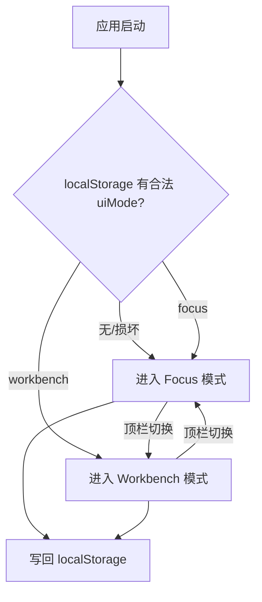
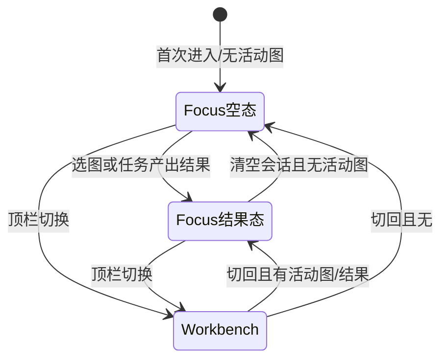

# 双模式外壳 —— Focus(对话优先)/ Workbench(工作台)

## 0. 状态

| 项 | 值 |
| --- | --- |
| SDD 状态 | `implemented`（v1.2 顶栏只读上下文标签 2026-08-19 实现完成、自查见 §15 v1.2；v1.1 右侧栏同为 `implemented`；v1 于 2026-08-13 `accepted`；待维护者验收后回 `accepted`） |
| 创建日期 | 2026-08-13 |
| 最近更新 | 2026-08-19 |
| 目标阶段 | 前端外壳分层:为首要用户 B 提供 Codex 式对话优先界面,现有 VSCode 式布局降级为专家模式 |
| 上位 SDD | [Glaux SDD 索引](../../README.md) |

进入 `accepted` 的依据(2026-08-13):产品维护者在真实数据环境(CUBS + 参考智能体)交互评审通过并确认阶段性验收;评审期间提出的空状态布局还原、状态行下移、Markdown 渲染、上下文环形图、徽标等打磨项均已实现并复验。§15 验收项全部通过。

进入 `implemented` 的依据(2026-08-13,按[实现计划](../../../plans/2026-08-13-001-feat-dual-mode-shell-plan.md)完成;tsc/eslint/vitest 18 项全绿):

- **已完成并走查**:清空存储默认 Focus 空状态(无 IDE 面板 DOM);损坏键回退不白屏;切换往返零请求(资源增量 0)、`uiMode`/`focusLayout` 持久化;顶栏选择器切图(4 模态 × 真实列表);舞台工具/度量摘要/角标随注册表与 store;度量与 Workbench 底部面板数值一致(同一 store);会话栏开合;Composer 草稿跨模式往返保留;刷新保持模式。
- **未完成**:无(§15 范围内)。
- **无法完全走查(结构保证)**:舞台内拖拽修正手势与 dockview 拖拽布局往返——headless 环境无法模拟拖拽;两者分别复用同一 Viewer/tool store 与既有 `glaux.layout.v1` 机制,留待业务验收人工确认。`prefers-reduced-motion` 降级为 CSS 层实现,经代码审阅确认。

进入 `ready` 的依据:① [设计稿](mockup.html)于 2026-08-13 经产品评审通过;② §17 待确认问题全部关闭(决议入 §16 D7–D9);③ 技术架构(组件分层、持久化键、切换语义)已补全 §6/§8/§9。上位原则见[前端设计纲领](../../../designs/frontend-design-charter.zh-CN.md)(本需求落地 G1–G4、G8;动效遵循纲领 §5,见本文 §7 第 7 条)。

## 1. 负责人

| 角色 | 负责人 |
| --- | --- |
| 产品与范围 | Glaux 项目维护者 |
| 前端 | Glaux 前端维护者 |
| 验收 | Glaux 项目维护者 |

## 2. 非目标

本需求明确不包含:

- 删除或重写 Workbench(现 VSCode 式 dockview 布局)。它完整保留,降级为"专家/开发模式"。
- 任何后端契约、任务管线、agent-runtime 的改动。Focus 模式零新增后端能力。
- 把插件市场、终端、底部面板迁入 Focus 模式(它们保持 Workbench 独占)。
- 主题系统 / 亮色主题(另立 SDD)。
- 移动端 / 窄屏适配。
- `uiMode` 的云端同步或多设备一致性(仅本机 localStorage)。
- 模式切换的使用埋点 / 遥测(暂不做,见 §12)。

## 3. 当前目标

**背景**:[需求清单 §1.1](../../../requirements.zh-CN.md) 定义首要用户 B 为"不会写宏/脚本、团队里没有计算影像的人"。现前端是完整的 IDE 隐喻(活动栏/侧栏/编辑器/底部面板/终端/可停靠拖拽),对 B 构成第一眼劝退;产品承诺"用自然语言描述研究目标",入口应长得像对话。参照 OpenAI Codex 的形态:**对话/任务流是主体,工作产物按需浮现,复杂度是被召唤出来的而非预先铺开的**。

本需求交付:

- 新增 **Focus 模式**:对话流为主体 + 图像舞台按需展开的简洁布局,面向 B。
- 现有布局命名为 **Workbench 模式**,面向专家与开发,保持不变。
- 顶栏一键**无损切换**:两模式共享同一份领域状态(会话、当前图、测量结果),切换不丢任何数据。
- **新用户默认进入 Focus**——demo 给 B 看的第一眼就是产品承诺本身。

## 4. 输入

### 4.1 用户输入

| 输入 | 必填 | 说明 |
| --- | --- | --- |
| 模式切换动作 | — | 顶栏按钮,双向切换 |
| 对话消息 | — | 沿用现有会话基础设施(feats/00),Focus 不改发送语义 |
| 图像选择 | — | Focus 内经右侧栏「文件」标签或对话完成(v1.2 起顶栏不再承担选择,D14);Workbench 仍经资源管理器 |
| 修正手势 | — | 点选/圈画,Focus 舞台内可用(B 刚需,见 §7) |

### 4.2 系统输入

- localStorage 持久化的 `uiMode`(键 `glaux.uiMode.v1`,见 §9)。
- 现有 zustand store 的全部领域状态(messages/activeImage/metrics/primitives/…)。
- Workbench 的 dockview 布局持久化(`glaux.layout.v1`),Focus 不读不写它。

### 4.3 输入约束

- 切换动作不得触发任何后端请求。
- 切换不得丢失:对话历史、当前图/volume/slide、metrics、primitives、输入框未发送草稿。
- 无持久化 `uiMode` 键时(含清空存储的老用户与内部同事)默认 `focus`(§16 D2/D9)。

## 5. 输出

### 5.1 用户可见输出

- Focus 布局:会话列表(可收起)/ 居中对话流 / **右侧栏**(可折叠,三个标签:舞台 · 文件 · 图谱;v1.1,D10)/ 极简顶栏(标识、**只读图像上下文标签**、设置、模式切换;v1.2,D14)。
- Workbench 布局:与现状逐像素一致(仅顶栏新增切换按钮)。
- 切换后界面即时呈现目标模式,数据原地保留。

### 5.2 系统输出

- localStorage 持久化的 `uiMode`,刷新后模式保持。

### 5.3 输出保证

- 两模式读写**同一份** store,不存在双份状态或状态搬运。
- Focus 与 Workbench 的布局持久化互不污染:往返切换后 Workbench 的 dockview 拖拽布局原样保留。

## 6. 核心流程

### 6.1 模式判定与切换(产品语义)



### 6.2 组件分叉(技术架构)

```mermaid
flowchart TD
    APP[App.tsx<br/>数据装载 effect 与模式无关,仅挂载时跑一次] --> M{useSession.uiMode}
    M -- focus --> FS[FocusShell 新增]
    M -- workbench --> WB[现状树:TitleBar + ActivityBar + Shell dockview + StatusBar]
    FS --> FT[FocusTopBar 新增<br/>标识 · 图像上下文标签(只读,点击→文件标签) · ⚙ 弹层 · ⇄]
    FS --> SR[SessionRail 新增薄壳<br/>复用 SessionDrawer]
    FS --> CC[对话列<br/>复用 AgentConversation + ConversationComposer]
    FS --> RP[FocusSidePanel v1.1<br/>右侧栏壳:标签条 + 折叠条]
    RP --> SP[StagePanel<br/>复用 Viewer / VolumeViewer / WsiViewer + Tool 子集工具条]
    RP --> FV[文件标签<br/>复用 SideBar.ExplorerView]
    RP --> AV[图谱标签<br/>复用 atlas/AtlasView compact(feats/03)]
    WB --> TB2[TitleBar 改:右侧加 ⇄ 按钮]
    STORE[(useSession 单一 zustand store<br/>领域状态两模式共享)] -.读写.- FS & WB
```

### 6.3 切换语义(技术)

1. `setUiMode(next)`:写 store → 同步写 `localStorage`(try/catch 吞异常,失败仅丢持久化不阻塞切换)。
2. App 按 `uiMode` 分叉渲染:目标模式子树挂载、原模式子树卸载。**不做双树常驻**(dockview/cornerstone 常驻内存成本高;卸载重挂的代价已被持久化覆盖)。
3. 切到 Workbench 时 dockview 经现有 `fromJSON(glaux.layout.v1)` 恢复拖拽布局(既有机制,零新代码);切离时其布局已由现有 `onDidLayoutChange` 持久化。
4. 数据装载(tasks/models/capabilities/…)只在 App 挂载时执行一次,与模式切换解耦——切换零请求由此保证。
5. 读 `uiMode`:仅接受字面量 `"focus" | "workbench"`,其余(缺失/损坏)一律回退 `focus`。

## 7. 交互规则

1. **对话优先**:Focus 下对话流是唯一常驻主体;空状态为居中输入框 + 示例任务卡(Codex 式空状态)。
2. **右侧栏(v1.1,替代原"舞台按需")**:Focus 右侧是一个**常驻可折叠**的侧栏(参考 Codex 桌面端右侧面板),顶部标签条切换三种内容——**舞台**(默认)· **文件**(模态切换 + 图像导航,复用 Workbench 资源管理器视图)· **图谱**(feats/03 `AtlasView`);一次只显示一个标签。折叠后收成 40px 竖条(三个图标 = 三个标签,点击即展开到该标签),与左侧会话栏对称。舞台标签在无活动图时显示占位引导("在「文件」标签选一张图"),不再整块消失。
   自动切换:在文件标签选中图像 → 切到舞台;`run_task` 结果写回查看器 → 若右侧栏展开则切到舞台;会话卡片"在图谱中打开" → 展开并切到图谱。用户手动选的标签在此之外不被抢占。
3. **舞台不可省**:点选/圈画修正手势与"低风险试一把"核对(需求清单 §2/§3.2)必须在 Focus 舞台可用——Focus 不是纯聊天,是**对话 + 舞台**。
4. **度量呈现**:目标形态为对话内 `taskrun` 任务卡片 + 舞台叠加;Focus 无常驻度量表格面板。**v0 落点**:参考智能体尚未接领域工具(feats/00 §2),Pi 会话内不产生任务运行,故 v0 度量摘要卡挂在舞台(同一 store.metrics 数据),对话内嵌卡片待领域工具接入后补(见[实现计划 §1.3](../../../plans/2026-08-13-001-feat-dual-mode-shell-plan.md))。
5. **设置收纳**:VLM 连接配置(designs/2026-07-14-001)在 Focus 收进顶栏 ⚙ 弹层;Workbench 入口不动。
6. **反长回规则(硬约束)**:后续新能力默认 Workbench 独占;进入 Focus 必须显式设计并更新本 SDD——防止 Focus 逐渐长回一个 IDE。
7. **动效**(按[纲领 §5](../../../designs/frontend-design-charter.zh-CN.md)):模式切换为 ≤320ms 朴素 crossfade(两模式是同一世界的两种视角,不做戏剧化转场);舞台/会话栏开合 200–280ms ease-out,退场更短;`prefers-reduced-motion` 下全部降级为瞬时切换,功能语义不依赖动效;动效时长/缓动用 token,不写死。

## 8. 涉及页面与组件

| 类别 | 组件 | 契约 |
| --- | --- | --- |
| 新增 | `FocusShell` | 纯布局壳:FocusTopBar + SessionRail + 对话列 + StagePanel;自身无领域逻辑 |
| 新增 | `FocusTopBar` | 标识 + 图像上下文标签(v1.2:**只读**,读 tasks/active* 派生「模态 · 当前对象 id」;点击 = `setFocusLayout({rightOpen:true, rightView:"files"})`,自身不写 active*)+ ⚙ 弹层(内嵌 ConnectionConfig)+ ⇄ 切换 |
| 新增 | `SessionRail` | SessionDrawer 的薄壳:默认收窄,点击展开;不改 SessionDrawer 内部 |
| 新增 | `StagePanel` | 按 modality 选用现有 Viewer / VolumeViewer / WsiViewer;顶部工具条为现有 `Tool` 集子集(cursor/editli/editma/roi/reset);角落显示图名 · 标定 · 坐标(承接 StatusBar 信息,D8);v1.1 起作为右侧栏"舞台"标签内容,无活动图时显示占位引导 |
| 新增(v1.1) | `FocusSidePanel` | 右侧栏壳:标签条(舞台 / 文件 / 图谱)+ 折叠按钮 + 折叠态 40px 图标竖条;按 `focusLayout.rightView` 渲染 StagePanel / `ExplorerView` / `AtlasView compact`;宽度沿用现有舞台列;自身无领域逻辑 |
| 复用不改(v1.1) | `SideBar.ExplorerView` | 导出后在右侧栏"文件"标签复用(模态切换 + images/methods 树);Workbench 侧栏行为不变 |
| 改动(v1.1) | `FocusTopBar` | 移除 v1.0 临时的 📖 图谱切换钮(feats/03 D-19 v1),右侧栏开合与标签切换全部收进 `FocusSidePanel` |
| 改动(v1.2) | `FocusTopBar` | 移除内部 `ImageContextPicker`(两级原生 `<select>`)及其与 `ExplorerView` 重复的模态/列表派生逻辑,改为只读 chip;选择动作唯一入口为右侧栏「文件」标签(D14) |
| 新增 | `ModeSwitch` | 无状态按钮,调 `setUiMode`;Focus/Workbench 顶栏共用 |
| 复用不改 | AgentConversation、SessionDrawer、ConnectionConfig、各 Viewer | 语义零改动;仅被新壳组合 |
| 复用微调 | ConversationComposer | 草稿从组件本地 state 升入 store(内存态,不落 localStorage)——两模式对话列是不同实例,切换重挂载时草稿必须保留(§15);发送清空/失败恢复语义不变 |
| 改动 | `App.tsx` | 按 `uiMode` 分叉渲染两棵子树(§6.2);数据装载 effect 不动 |
| 改动 | `TitleBar` | 右侧加 ModeSwitch |
| Focus 不渲染 | ActivityBar、SideBar、BottomPanel、TerminalView、StatusBar、dockview | DOM 级不存在(§15 有断言) |
| Focus 内 CSS 隐藏/重排 | AgentConversation 顶部工具条、其内嵌 SessionDrawer 浮层与空态占位;空状态下另隐藏连接/权限配置条;非空状态下连接/权限条经 flex order 移至输入框下方(Claude Code 式状态行) | 会话操作归 SessionRail、连接配置归顶栏 ⚙、空态归 FocusHero(G3 收纳);空状态 Composer 经 CSS 化为设计稿的「输入框卡片」;作用域覆盖集中在 global.css Focus 段并注释 |

## 9. 状态与展示字段

- store 新增 `uiMode: "focus" | "workbench"` + `setUiMode`;初始值由 loader 读 localStorage(§6.3 第 5 条校验)。
- localStorage 键:`glaux.uiMode.v1`,值为字面量字符串(不 JSON 包裹);改语义时 bump 版本后缀,旧键作废回默认(沿 `glaux.layout.v1` 惯例)。
- Focus 布局微状态(v1.1):`FocusLayout = { railOpen: boolean; rightOpen: boolean; rightView: "stage" | "files" | "atlas" }`,合并存 `glaux.focusLayout.v1`(JSON;损坏回默认 `{railOpen:false, rightOpen:true, rightView:"stage"}`;逐字段校验,非法字段回默认)。兼容:旧值 `stageOpen` 迁移为 `rightOpen`;旧 `rightView:"atlas"`(feats/03 v1)原样保留。属 UI 微状态,放 store 但不算领域字段。
- 舞台**可见性**不再由 `hasVisual` 门控:右侧栏 `rightOpen && rightView==="stage"` 即渲染 StagePanel;`hasVisual = activeImage || activeVolume || activeSlide` 只决定舞台内是显示查看器还是占位引导。
- 其余展示字段全部复用现有 store,零新增领域字段。
- 新增 i18n 键(mode 名称、空状态文案、示例卡、舞台工具提示)在实现计划中列全,中英齐备(G9)。

## 10. 重复操作规则

- 重复点击切换按钮:幂等,无副作用,无请求。
- 双标签页同开:各自持 localStorage 最后写入值,不做跨标签同步(接受不一致)。

## 11. 页面状态生命周期



## 12. 审计与事件

- 无新增后端事件。
- 模式切换埋点暂不做(§2 非目标);若未来需要,先回本 SDD 补契约。

## 13. 空状态、异常与降级

- 后端未起:沿用现状"不阻塞外壳"——Focus 对话框仍可见,示例任务卡置灰或提示后端不可用;舞台显示占位说明。
- 数据集为空:空状态引导文案(而非空白舞台)。
- VLM 连接未配置:沿用现有显式报错,不静默降级(designs/2026-07-14 既有约定)。

## 14. 与其他 SDD 的关系

| 相关 SDD | 关系 |
| --- | --- |
| [feats/00 参考智能体与会话](../00-reference-agent-conversations/README.md) | Focus 复用其全部会话 UI 与运行时,不改契约;其"只改造右侧面板"的边界由本 SDD 显式扩展为"该面板可作为 Focus 主体渲染" |
| [designs/2026-07-14-001 连接配置](../../../designs/2026-07-14-001-agent-connection-config.zh-CN.md) | Focus 侧入口迁入 ⚙ 弹层;契约不变 |
| [designs/2026-07-06 IDE 前端](../../../designs/2026-07-06-glaux-ide-frontend.zh-CN.md) | 其布局整体成为 Workbench 模式;该设计稿的"外壳=产品"前提被本 SDD 修正为"外壳=专家模式" |
| [designs/2026-08-13-001 双模式外壳设计](../../../designs/2026-08-13-001-dual-mode-shell.zh-CN.md) | 本 SDD 的交互设计展开(已评审通过) |
| [designs/前端设计纲领](../../../designs/frontend-design-charter.zh-CN.md) | 上位原则;本需求落地 G1(双模式)/G2(对话优先)/G3(反长回)/G4(舞台一等)/G8(单一真相源) |

## 15. 验收标准

- [x] 清空 localStorage 后首次进入,呈现 Focus 空状态(居中输入框 + 示例任务卡),不渲染 ActivityBar / SideBar / BottomPanel / StatusBar 的 DOM。
- [x] Focus 下发送消息、执行任务,产生与 Workbench 相同的 `taskrun` 卡片数据与舞台叠加(同一 store,断言引用相等或数据一致)。
- [x] Focus → Workbench → Focus 往返后:消息流、当前图、metrics、primitives、输入框草稿逐项不变。
- [x] 切换动作期间网络面板零新增请求。
- [x] 在 Workbench 拖拽改变 dockview 布局 → 切到 Focus → 切回,布局保持拖拽后的状态。
- [x] Focus 舞台内点选/圈画修正产生与 Workbench 编辑器一致的 store 变更。
- [x] 刷新页面后模式保持;localStorage 值损坏时回退默认 Focus 且不白屏。
- [x] 中英文界面文案齐全(i18n 键补全,无硬编码中文/英文)。
- [x] 开启 `prefers-reduced-motion` 后,模式切换与舞台/会话栏开合无位移/缩放动画,直接呈现终态,功能不受影响。

v1.1(Focus 右侧栏):

- [x] Focus 右侧栏顶部有 舞台 / 文件 / 图谱 三个标签;点击切换内容,同一时刻只渲染一个标签的内容。——`FocusSidePanel.test.tsx`;浏览器走查三标签内容
- [x] 折叠右侧栏后呈现 40px 图标竖条,点击任一图标展开并进入对应标签;`rightOpen`/`rightView` 刷新后保持。——`FocusSidePanel.test.tsx`;浏览器实测折叠宽 40px、点图标展开、localStorage 写回
- [x] 旧持久化值 `{railOpen, stageOpen}` 载入后:`stageOpen` 迁移为 `rightOpen`,`rightView` 缺省 `stage`,不白屏。——`atlasView.test.ts` / `uiMode.test.ts`;浏览器中旧值 `{stageOpen:true,rightView:"atlas"}` 迁移为 `{rightOpen:true,rightView:"atlas"}`
- [x] 无活动图时舞台标签显示占位引导而非空白;在文件标签选中一张图后自动切到舞台且图像可见。——StagePanel 占位分支;`FocusSidePanel.test.tsx` 自动切舞台 / 停留图谱不抢
- [x] 会话卡片"在图谱中打开"(feats/03)在 Focus 下展开右侧栏并切到图谱标签的对应案例。——`atlasView.test.ts` revealExemplar;`AtlasRefCard.test.tsx`
- [x] 中英文文案齐全;`prefers-reduced-motion` 下标签切换与开合无位移动画。——i18n 类型对齐编译期保证;右侧栏沿用 `.focus-stage` 的 stagein 动效,已在 reduced-motion 块内关闭(标签切换本身无动效)

v1.2(顶栏只读上下文标签):

- [x] Focus 顶栏不再出现任何 `<select>`;上下文区呈现「模态标签 · 当前对象 id」一枚 chip,无活动对象时呈现「选择图像…」提示态。——`FocusTopBar.test.tsx`「显示模态 · 当前对象」(断言 `querySelectorAll("select")` 为 0)与「无活动对象时呈现提示态」
- [x] 点击该 chip 展开右侧栏并切到「文件」标签(`rightOpen:true` / `rightView:"files"`);chip 自身不改变 `activeImage`/`activeVolume`/`activeSlide`。——`FocusTopBar.test.tsx`「点击展开右侧栏并切到文件标签」
- [x] 切换模态或选中图像后 chip 文案随之更新(与 `ExplorerView` 同一 store,不存在第二份派生规则)。——`FocusTopBar.test.tsx`「CT 下读 activeVolume」;`ImageContextPicker` 及其 `isCT ? volumes : ...` 派生已整体删除,顶栏只读 `active*`
- [x] chip 可键盘聚焦并以 Enter/Space 触发(`<button>` 语义),有 `aria-label`;中英文案齐全。——实现为原生 `<button type="button">` + `aria-label={t("focus_ctx_open")}`;新增 i18n 键 `focus_ctx_open` 中英齐全(键类型对齐编译期保证)
- [x] 舞台占位引导文案不再提及顶栏选图。——`focus_stage_empty` 中英改为只指向「文件」标签

## 16. 决策记录

| 编号 | 决策 | 理由 |
| --- | --- | --- |
| D1 | 模式命名 Focus / Workbench | "简洁/专业"含贬义暗示;Focus 表达"对话优先",Workbench 沿 IDE 语义 |
| D2 | 新用户默认 Focus | 默认值即产品立场;B 的第一眼必须是对话 |
| D3 | 单一 store、布局层分叉;不做双 store | 切换无损的最简实现;两模式是同一状态的两种视图 |
| D4 | 反长回规则:新能力默认 Workbench 独占 | 防止 Focus 复杂度回潮,把"进 Focus"变成显式设计决策 |
| D5 | 参照 Codex 的"对话+按需浮现",而非"删减版 IDE" | 删减版 IDE 仍是 IDE 隐喻;对话优先才匹配 B 的心智 |
| D6 | Focus 必须含图像舞台(非纯聊天) | 无代码修正与"低风险试一把"核对是 B 刚需(需求清单 §2/§3.2) |
| D7(v1.2 修订) | ~~Focus 顶栏保留轻量图像上下文**选择器**~~ → 顶栏只保留**只读上下文标签**,选图入口收敛到右侧栏「文件」标签与对话(关 Q2) | v1 的理由(纯对话选图对批量场景太绕)在 v1.1 落地「文件」标签后已由后者满足;见 D14 |
| D8 | Focus 彻底移除 StatusBar;图名/标定/坐标移入舞台角落(关 Q3) | 设计稿含该方案,评审通过;仪器信息就近呈现于其所描述的画面 |
| D9 | 老用户(含已有 `glaux.layout.v1` 者)同样默认 Focus(关 Q4) | 规则统一:无 `glaux.uiMode.v1` 键即 Focus;专家一键即可回 Workbench,成本极低 |
| D10(v1.1,2026-08-16) | Focus 右侧从"舞台按需展开"改为 Codex 式**常驻可折叠右侧栏 + 三标签(舞台/文件/图谱)** | feats/03 落地后右侧已有两种内容,"顶栏按钮二选一"是过渡形态;Codex 右侧面板"一次看一件事、随时折叠"与 G3 反长回一致——它是一个位置、三种视角,不是三块新面板 |
| D11(v1.1) | 折叠态为 40px 图标竖条,与左侧会话栏对称;不做"完全消失 + 顶栏按钮" | 图标条即入口,免去顶栏再长按钮;对称结构让空状态仍然居中干净 |
| D12(v1.1) | "文件"标签直接复用 Workbench 的 `ExplorerView`,不另写精简树 | 复用优先(charter 工程纪律);同一组件保证两模式导航语义一致;若日后过重再在同一组件内做 compact 变体 |
| D13(v1.1) | 舞台不再随无活动图整块消失,改为占位引导 | 三标签结构下标签消失会让标签条跳动;占位引导同时承担"下一步做什么"的提示 |
| D14(v1.2,2026-08-19) | 顶栏图像上下文由「模态 + 对象两级下拉」改为**只读 chip「模态 · 对象 id」,点击 = 展开右侧栏「文件」标签** | ① v1.1 的「文件」标签(D12 复用 `ExplorerView`)已含模态切换 + 图像列表 + 选中态,顶栏选择器把同一份派生规则(`isCT ? volumes : isWSI ? slides : images`)抄了第二遍,是两个真相源;② 顶栏在此处的真实价值是**常驻上下文显示**——右侧栏可折叠、且可能停在「图谱」标签,此时"当前在看哪张图"必须仍然可见,故不整块删除顶栏上下文区;③ 原生 `<select>` 箭头由系统绘制,与 feats/06 统一线性图标语言冲突,改 chip 后自然消失;④ 与 G3 反长回一致:一个位置只做一件事,顶栏显示、侧栏选择 |

## 17. 待确认问题

无。Q1(设计稿)于 2026-08-13 评审通过;Q2/Q3/Q4 决议分别入 §16 D7/D8/D9;v1.1 右侧栏方案 2026-08-16 由维护者口头确认(D10–D13)。
