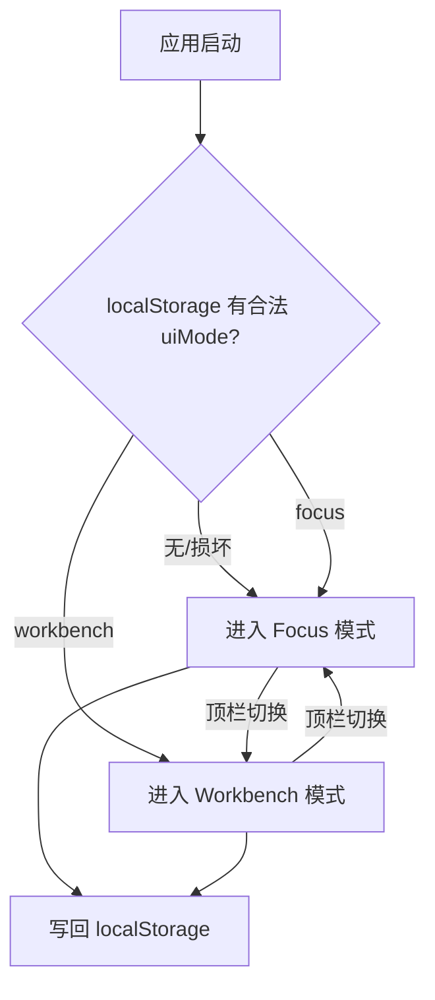
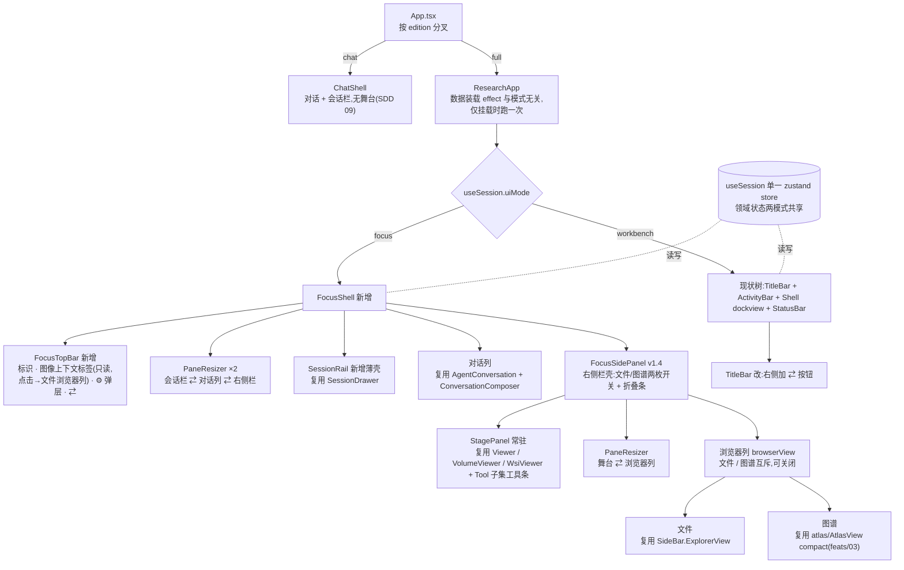
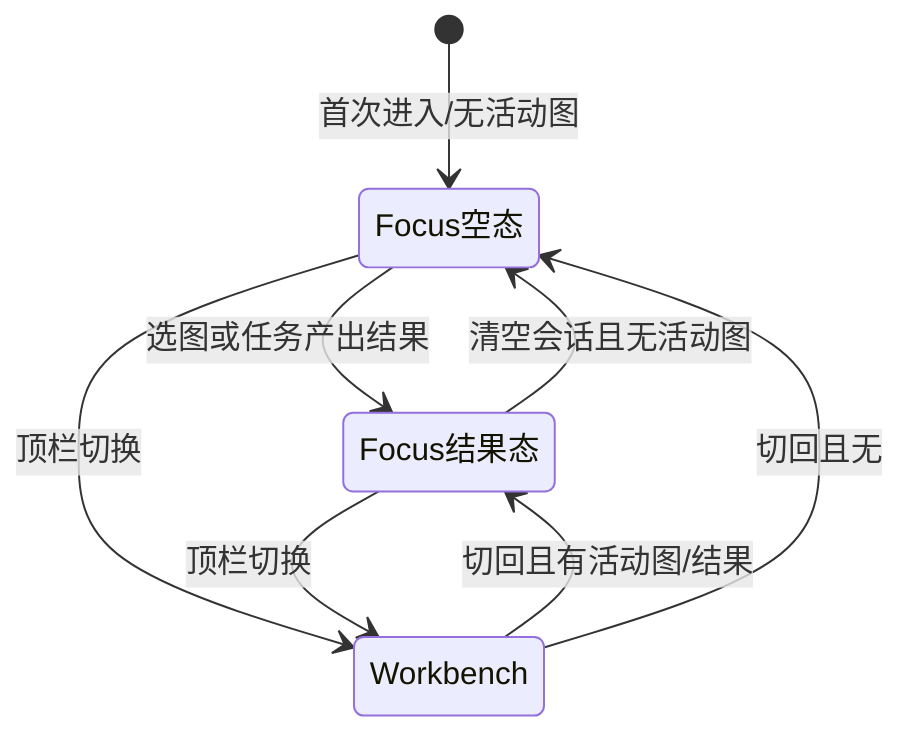

# 双模式外壳 —— Focus(对话优先)/ Workbench(工作台)

## 0. 状态

| 项 | 值 |
| --- | --- |
| SDD 状态 | `implemented`（v1.4 舞台常驻 + 浏览器分栏 2026-08-31 实现完成、自查见 §15 v1.4；v1.3 三栏宽度可拖拽 2026-08-19 实现完成、自查见 §15 v1.3；v1.2 顶栏只读上下文标签 2026-08-19 `implemented`、自查见 §15 v1.2；v1.1 右侧栏同为 `implemented`；v1 于 2026-08-13 `accepted`） |
| 创建日期 | 2026-08-13 |
| 最近更新 | 2026-09-23 |
| 目标阶段 | 前端外壳分层:为非技术研究者提供 Codex 式对话优先界面,现有 VSCode 式布局降级为专家模式 |
| 上位 SDD | [Glaux SDD 索引](../../README.md) |

进入 `accepted` 的依据(2026-08-13):产品维护者在真实数据环境(CUBS + 参考智能体)交互评审通过并确认阶段性验收;评审期间提出的空状态布局还原、状态行下移、Markdown 渲染、上下文环形图、徽标等打磨项均已实现并复验。§15 验收项全部通过。

进入 `implemented` 的依据(2026-08-13,按[实现计划](../../../plans/2026-08-13-001-feat-dual-mode-shell-plan.md)完成;tsc/eslint/vitest 18 项全绿):

- **已完成并走查**:清空存储默认 Focus 空状态(无 IDE 面板 DOM);损坏键回退不白屏;切换往返零请求(资源增量 0)、`uiMode`/`focusLayout` 持久化;顶栏选择器切图(4 模态 × 真实列表);舞台工具/度量摘要/角标随注册表与 store;度量与 Workbench 底部面板数值一致(同一 store);会话栏开合;Composer 草稿跨模式往返保留;刷新保持模式。
- **未完成**:无(§15 范围内)。
- **无法完全走查(结构保证)**:舞台内拖拽修正手势与 dockview 拖拽布局往返——headless 环境无法模拟拖拽;两者分别复用同一 Viewer/tool store 与既有 `glaux.layout.v1` 机制,留待业务验收人工确认。`prefers-reduced-motion` 降级为 CSS 层实现,经代码审阅确认。

进入 `ready` 的依据:① [设计稿](mockup.html)于 2026-08-13 经产品评审通过;② §17 待确认问题全部关闭(决议入 §16 D7–D9);③ 技术架构(组件分层、持久化键、切换语义)已补全 §6/§8/§9。上位原则见[前端设计纲领](../../../designs/frontend-design-charter.zh-CN.md)(本需求落地 G1–G4、G8;动效遵循纲领 §5,见本文 §7 第 8 条)。

## 1. 负责人

| 角色 | 负责人 |
| --- | --- |
| 产品与范围 | Glaux 项目维护者 |
| 前端 | Glaux 前端维护者 |
| 验收 | Glaux 项目维护者 |

## 2. 非目标

本需求明确不包含:

- 删除或重写 Workbench(现 VSCode 式 dockview 布局)。它完整保留,降级为"专家/开发模式"。
- 任何后端契约、任务管线、agent-runtime 的改动。Focus 模式零新增后端能力。
- 把插件市场、终端、底部面板迁入 Focus 模式(它们保持 Workbench 独占)。
- 主题系统 / 亮色主题(另立 SDD)。
- 移动端 / 窄屏适配。
- `uiMode` 的云端同步或多设备一致性(仅本机 localStorage)。
- 模式切换的使用埋点 / 遥测(暂不做,见 §12)。

## 3. 当前目标

**背景**:[前端设计纲领 G1–G2](../../../designs/frontend-design-charter.zh-CN.md) 要求界面同时服务非技术研究者与专家,并以对话优先为默认形态(非技术研究者即"不会写宏/脚本、团队里没有计算影像的人")。现前端是完整的 IDE 隐喻(活动栏/侧栏/编辑器/底部面板/终端/可停靠拖拽),对非技术研究者构成第一眼劝退;产品承诺"用自然语言描述研究目标",入口应长得像对话。参照 OpenAI Codex 的形态:**对话/任务流是主体,工作产物按需浮现,复杂度是被召唤出来的而非预先铺开的**。

本需求交付:

- 新增 **Focus 模式**:对话流为主体 + 图像舞台按需展开的简洁布局,面向非技术研究者。
- 现有布局命名为 **Workbench 模式**,面向专家与开发,保持不变。
- 顶栏一键**无损切换**:两模式共享同一份领域状态(会话、当前图、测量结果),切换不丢任何数据。
- **新用户默认进入 Focus**——demo 给非技术研究者看的第一眼就是产品承诺本身。

## 4. 输入

### 4.1 用户输入

| 输入 | 必填 | 说明 |
| --- | --- | --- |
| 模式切换动作 | — | 顶栏按钮,双向切换 |
| 对话消息 | — | 沿用现有会话基础设施(feats/00),Focus 不改发送语义 |
| 图像选择 | — | Focus 内经右侧栏「文件」标签或对话完成(v1.2 起顶栏不再承担选择,D14);Workbench 仍经资源管理器 |
| 修正手势 | — | 点选/圈画,Focus 舞台内可用(非技术研究者刚需,见 §7) |

### 4.2 系统输入

- localStorage 持久化的 `uiMode`(键 `glaux.uiMode.v1`,见 §9)。
- 现有 zustand store 的全部领域状态(messages/activeImage/metrics/primitives/…)。
- Workbench 的 dockview 布局持久化(`glaux.layout.v1`),Focus 不读不写它。

### 4.3 输入约束

- 切换动作不得触发任何后端请求。
- 切换不得丢失:对话历史、当前图/volume/slide、metrics、primitives、输入框未发送草稿。
- 无持久化 `uiMode` 键时(含清空存储的老用户与内部同事)默认 `focus`(§16 D2/D9)。

## 5. 输出

### 5.1 用户可见输出

- Focus 布局:会话列表(可收起)/ 居中对话流 / **右侧栏**(可折叠;舞台常驻,文件与图谱为贴右缘的浏览器列,二者互斥且可关闭;v1.4,D16–D19)/ 极简顶栏(标识、**只读图像上下文标签**、设置、模式切换;v1.2,D14)。
- Workbench 布局:与现状逐像素一致(仅顶栏新增切换按钮)。
- 切换后界面即时呈现目标模式,数据原地保留。

### 5.2 系统输出

- localStorage 持久化的 `uiMode`,刷新后模式保持。

### 5.3 输出保证

- 两模式读写**同一份** store,不存在双份状态或状态搬运。
- Focus 与 Workbench 的布局持久化互不污染:往返切换后 Workbench 的 dockview 拖拽布局原样保留。

## 6. 核心流程

### 6.1 模式判定与切换(产品语义)

### 6.2 组件分叉(技术架构)

### 6.3 切换语义(技术)

1. `setUiMode(next)`:写 store → 同步写 `localStorage`(try/catch 吞异常,失败仅丢持久化不阻塞切换)。
2. App 按 `uiMode` 分叉渲染:目标模式子树挂载、原模式子树卸载。**不做双树常驻**(dockview/cornerstone 常驻内存成本高;卸载重挂的代价已被持久化覆盖)。
3. 切到 Workbench 时 dockview 经现有 `fromJSON(glaux.layout.v1)` 恢复拖拽布局(既有机制,零新代码);切离时其布局已由现有 `onDidLayoutChange` 持久化。
4. 数据装载(tasks/models/capabilities/…)只在 App 挂载时执行一次,与模式切换解耦——切换零请求由此保证。
5. 读 `uiMode`:仅接受字面量 `"focus" | "workbench"`,其余(缺失/损坏)一律回退 `focus`。

## 7. 交互规则

1. **对话优先**:Focus 下对话流是唯一常驻主体;空状态为居中输入框 + 示例任务卡(Codex 式空状态)。
2. **右侧栏(v1.4,修订 v1.1 的三标签互斥)**:Focus 右侧是一个**常驻可折叠**的侧栏。侧栏内部分为两列——左列是**舞台**,**常驻**;右列是**浏览器**(**文件** = 模态切换 + 图像导航,复用 Workbench 资源管理器视图;**图谱** = feats/03 `AtlasView`;二者互斥,可整列关闭),贴屏幕最右缘(D19)。
   - 标签条只剩「文件」「图谱」两枚开关式标签:点击未激活标签 = 打开浏览器列并切到它;点击已激活标签 = 关闭浏览器列,侧栏回到纯舞台(等价于 v1.1 的「舞台标签」)。
   - 舞台不再是标签,不可关闭。无活动图时仍显示占位引导(D13),不整块消失。
   - 折叠后仍收成 40px 竖条,三枚图标 = 舞台 / 文件 / 图谱:点舞台图标 = 展开且浏览器列关闭;点另两枚 = 展开并打开对应浏览器。
   - 舞台与浏览器列之间有第三条拖拽分隔条(见第 7 条)。
   - **窄屏降级**:侧栏可用宽度 < `SIDE_SPLIT_MIN` 时无法并排,退回 v1.1 的整栏互斥形态——浏览器内容占满侧栏,且在文件浏览器选中图像后自动切回舞台。宽度回到阈值以上即恢复分栏,`browserView` 不因降级被改写。
   - 自动切换:仅在窄屏降级态存在(选图 → 回舞台)。分栏态下选图**不**关闭浏览器列——同屏切图正是本形态的目的。`run_task` 结果写回查看器、会话卡片"在图谱中打开"照旧展开右侧栏并切到对应内容。
3. **舞台不可省**:点选/圈画修正手势与"低风险试一把"核对(前端设计纲领 G4)必须在 Focus 舞台可用——Focus 不是纯聊天,是**对话 + 舞台**。
4. **度量呈现**:度量摘要卡挂在舞台,数据取自同一 `store.metrics`;agent 的 `run_task` 结果经 toolBridge 写回查看器与 store。对话内嵌 `taskrun` 卡片仍未落地(见[实现计划 §1.3](../../../plans/2026-08-13-001-feat-dual-mode-shell-plan.md))。
5. **设置收纳**:VLM 连接配置(designs/2026-07-14-001)在 Focus 收进顶栏 ⚙ 弹层;Workbench 入口不动。
6. **反长回规则(硬约束)**:后续新能力默认 Workbench 独占;进入 Focus 必须显式设计并更新本 SDD——防止 Focus 逐渐长回一个 IDE。
7. **栏宽可调(v1.3;v1.4 增第三条)**:Focus 栏间各有一条拖拽分隔条——会话栏 ⇄ 对话列、对话列 ⇄ 右侧栏,以及(v1.4)右侧栏内的**舞台 ⇄ 浏览器列**。第三条只在分栏态渲染:浏览器列关闭或处于窄屏降级态时不渲染。它夹在 `BROWSER_W` 范围内,并保证舞台不小于 `STAGE_MIN`;交互(双击复位、`role="separator"`、←/→ 16px、Home 复位)与前两条完全一致,复用同一 `PaneResizer`。拖拽**在允许范围内**改变两侧栏宽度,对话列吃剩余空间(始终 ≥ 360px);越界即被夹住,不产生横向滚动、不把任一栏拖没。折叠态的栏(40px 竖条)不可拖,分隔条隐藏;展开后恢复。双击分隔条复位为默认宽度。分隔条为 `role="separator"` 可聚焦,←/→ 每次 16px、Home 复位(与 feats/05 键盘可达一致)。宽度随 `focusLayout` 持久化,刷新与模式往返保持。
8. **动效**(按[纲领 §5](../../../designs/frontend-design-charter.zh-CN.md)):模式切换为 ≤320ms 朴素 crossfade(两模式是同一世界的两种视角,不做戏剧化转场);舞台/会话栏开合 200–280ms ease-out,退场更短;`prefers-reduced-motion` 下全部降级为瞬时切换,功能语义不依赖动效;动效时长/缓动用 token,不写死。

## 8. 涉及页面与组件

| 类别 | 组件 | 契约 |
| --- | --- | --- |
| 新增 | `FocusShell` | 纯布局壳:FocusTopBar + SessionRail + 对话列 + StagePanel;自身无领域逻辑 |
| 新增 | `FocusTopBar` | 标识 + 图像上下文标签(v1.2:**只读**,读 tasks/active* 派生「模态 · 当前对象 id」;点击 = `setFocusLayout({rightOpen:true, rightView:"files"})`,自身不写 active*)+ ⚙ 弹层(内嵌 ConnectionConfig)+ ⇄ 切换 |
| 新增 | `SessionRail` | SessionDrawer 的薄壳:默认收窄,点击展开;不改 SessionDrawer 内部 |
| 新增 | `StagePanel` | 按 modality 选用现有 Viewer / VolumeViewer / WsiViewer;顶部工具条为现有 `Tool` 集子集(cursor/editli/editma/roi/reset);角落显示图名 · 标定 · 坐标(承接 StatusBar 信息,D8);v1.1 起作为右侧栏"舞台"标签内容,无活动图时显示占位引导 |
| 新增(v1.1) | `FocusSidePanel` | 右侧栏壳:标签条(舞台 / 文件 / 图谱)+ 折叠按钮 + 折叠态 40px 图标竖条;按 `focusLayout.rightView` 渲染 StagePanel / `ExplorerView` / `AtlasView compact`;宽度沿用现有舞台列;自身无领域逻辑 |
| 改动(v1.4) | `FocusSidePanel` | 标签条改为「文件 / 图谱」两枚开关(点已激活者 = 关闭浏览器列);展开态渲染 `[StagePanel \| PaneResizer \| 浏览器列]` 两列,StagePanel 常驻且在左、浏览器列贴最右缘(D19);实测侧栏宽 < `SIDE_SPLIT_MIN` 时渲染 v1.1 的整栏互斥形态。**删除**「选图 → 自动切舞台」的 `useEffect`,该行为下沉为窄屏降级态专属(D17) |
| 复用不改(v1.4) | `PaneResizer` | 舞台 ⇄ 浏览器列的第三条分隔条复用同一受控组件,`side="right"`(被调宽度的是分隔条右侧的浏览器列);不新增组件 |
| 改动(v1.4) | `FocusTopBar` | 上下文 chip 的点击动作由 `{rightOpen:true, rightView:"files"}` 改为 `{rightOpen:true, browserView:"files"}`;显示语义不变 |
| 改动(v1.4) | feats/03「在图谱中打开」 | 由 `rightView:"atlas"` 改为 `browserView:"atlas"`;`AtlasView` 内部不动 |
| 新增(v1.3) | `PaneResizer` | Focus 栏间拖拽分隔条:受控组件(`value`/`min`/`max`/`onChange`/`onReset`),pointer 事件 + `setPointerCapture`,`role="separator"` + `aria-valuenow/min/max` + ←/→/Home 键盘调节;自身无领域逻辑,不读 store |
| 复用不改(v1.1) | `SideBar.ExplorerView` | 导出后在右侧栏"文件"标签复用(模态切换 + images/methods 树);Workbench 侧栏行为不变 |
| 改动(v1.1) | `FocusTopBar` | 移除 v1.0 临时的 📖 图谱切换钮(feats/03 D-19 v1),右侧栏开合与标签切换全部收进 `FocusSidePanel` |
| 改动(v1.2) | `FocusTopBar` | 移除内部 `ImageContextPicker`(两级原生 `<select>`)及其与 `ExplorerView` 重复的模态/列表派生逻辑,改为只读 chip;选择动作唯一入口为右侧栏「文件」标签(D14) |
| 新增 | `ModeSwitch` | 无状态按钮,调 `setUiMode`;Focus/Workbench 顶栏共用 |
| 复用不改 | AgentConversation、SessionDrawer、ConnectionConfig、各 Viewer | 语义零改动;仅被新壳组合 |
| 复用微调 | ConversationComposer | 草稿从组件本地 state 升入 store(内存态,不落 localStorage)——两模式对话列是不同实例,切换重挂载时草稿必须保留(§15);发送清空/失败恢复语义不变 |
| 改动 | `App.tsx` | 按 `uiMode` 分叉渲染两棵子树(§6.2);数据装载 effect 不动 |
| 改动 | `TitleBar` | 右侧加 ModeSwitch |
| Focus 不渲染 | ActivityBar、SideBar、BottomPanel、TerminalView、StatusBar、dockview | DOM 级不存在(§15 有断言) |
| Focus 内 CSS 隐藏/重排 | AgentConversation 顶部工具条、其内嵌 SessionDrawer 浮层与空态占位;空状态下另隐藏连接/权限配置条;非空状态下连接/权限条经 flex order 移至输入框下方(Claude Code 式状态行) | 会话操作归 SessionRail、连接配置归顶栏 ⚙、空态归 FocusHero(G3 收纳);空状态 Composer 经 CSS 化为设计稿的「输入框卡片」;作用域覆盖集中在 global.css Focus 段并注释 |

## 9. 状态与展示字段

- store 新增 `uiMode: "focus" | "workbench"` + `setUiMode`;初始值由 loader 读 localStorage(§6.3 第 5 条校验)。
- localStorage 键:`glaux.uiMode.v1`,值为字面量字符串(不 JSON 包裹);改语义时 bump 版本后缀,旧键作废回默认(沿 `glaux.layout.v1` 惯例)。
- Focus 布局微状态(v1.1):`FocusLayout = { railOpen: boolean; rightOpen: boolean; rightView: "stage" | "files" | "atlas" }`,合并存 `glaux.focusLayout.v1`(JSON;损坏回默认 `{railOpen:false, rightOpen:true, rightView:"stage"}`;逐字段校验,非法字段回默认)。兼容:旧值 `stageOpen` 迁移为 `rightOpen`;旧 `rightView:"atlas"`(feats/03 v1)原样保留。属 UI 微状态,放 store 但不算领域字段。
- 栏宽(v1.3;上界经 v1.4 校正):`FocusLayout` 增 `railW: number | null` 与 `sideW: number | null`,并入同一 `glaux.focusLayout.v1`。`null` = 未拖过,沿用默认(会话栏 236px;右侧栏按 `flex 1.15 : 1` 与对话列分成,随窗口自适应);一旦拖动即固化为像素值。载入时逐字段校验:非有限数/非正数回 `null`,数值 `clamp` 到 [`RAIL_MIN`=200, `RAIL_MAX`=420] / [`SIDE_MIN`=280, `SIDE_MAX`=1200]。窄窗口的上界由 CSS 兜底(`.focus-rail.open{max-width:30%}`、`.focus-side{max-width:55%}`),不需要监听 resize 改写持久化值。
  > v1.4 校正:v1.3 的 §9/§15 记 `SIDE_MAX=880`,实现落的是 `1200`。分栏形态需要更宽的侧栏,故以实现值为准,规范改记 `1200`;`SIDE_MIN` 维持 `280`(窄屏降级态仍要能用)。
- **右侧栏内部状态(v1.4)**:`FocusLayout` 的 `rightView: "stage"|"files"|"atlas"` 由两个字段取代——`browserView: "files" | "atlas" | null`(`null` = 浏览器列关闭,侧栏纯舞台)与 `browserW: number | null`。同存 `glaux.focusLayout.v1`,键名不 bump。
  - 迁移:旧 `rightView:"stage"` → `browserView:null`;`"files"` → `"files"`;`"atlas"` → `"atlas"`;缺失或非法值 → `null`。`browserW` 非有限数/非正数回 `null`,否则 `clamp` 到 [`BROWSER_MIN`=240, `BROWSER_MAX`=480]。
  - 常量:`BROWSER_W = {min:240, max:480, def:240}`(缺省即最窄,D19);`STAGE_MIN = 360`;`SIDE_SPLIT_MIN = 640`(= 浏览器最小 + 舞台最小 + 分隔条余量,低于此值即窄屏降级)。阈值带 24px 迟滞:分栏 → 降级取 `< 640`,降级 → 分栏取 `≥ 664`,避免拖到临界时反复重排。
  - 分栏判定读**实测**侧栏宽度(与 v1.3 `FocusShell.room()` 同一套实测机制),不读持久化的 `sideW`——`sideW` 为 `null` 时没有像素真相值。
- 舞台**可见性**:v1.1 为 `rightOpen && rightView==="stage"`;v1.4 起 `rightOpen` 即渲染 StagePanel(舞台常驻,浏览器列只是与它并排)。`hasVisual = activeImage || activeVolume || activeSlide` 仍只决定舞台内是显示查看器还是占位引导。
- 其余展示字段全部复用现有 store,零新增领域字段。
- 新增 i18n 键(mode 名称、空状态文案、示例卡、舞台工具提示)在实现计划中列全,中英齐备(G9)。

## 10. 重复操作规则

- 重复点击切换按钮:幂等,无副作用,无请求。
- 双标签页同开:各自持 localStorage 最后写入值,不做跨标签同步(接受不一致)。

## 11. 页面状态生命周期

## 12. 审计与事件

- 无新增后端事件。
- 模式切换埋点暂不做(§2 非目标);若未来需要,先回本 SDD 补契约。

## 13. 空状态、异常与降级

- 后端未起:沿用现状"不阻塞外壳"——Focus 对话框仍可见,示例任务卡置灰或提示后端不可用;舞台显示占位说明。
- 数据集为空:空状态引导文案(而非空白舞台)。
- VLM 连接未配置:沿用现有显式报错,不静默降级(designs/2026-07-14 既有约定)。
- **右侧栏放不下两列(v1.4)**:实测侧栏宽 < `SIDE_SPLIT_MIN` 时不并排,退回整栏互斥 + 选图自动回舞台;不产生横向滚动,不把任一列压到最小宽以下。恢复宽度后自动回到分栏,`browserView` 全程不被降级改写。
- **浏览器列内容为空(v1.4)**:文件浏览器在无数据源时渲染 [feats/08](../08-data-import-first-explorer/README.md) 的空态卡;该卡片必须在 `BROWSER_MIN`=240px 窄列内可用(不裁切、不横向滚动)。图谱无案例时沿用 `AtlasView` 既有空态。舞台不受浏览器列空态影响,照常渲染查看器或占位引导。

## 14. 与其他 SDD 的关系

| 相关 SDD | 关系 |
| --- | --- |
| [feats/00 参考智能体与会话](../00-reference-agent-conversations/README.md) | Focus 复用其全部会话 UI 与运行时,不改契约;其"只改造右侧面板"的边界由本 SDD 显式扩展为"该面板可作为 Focus 主体渲染" |
| [designs/2026-07-14-001 连接配置](../../../designs/2026-07-14-001-agent-connection-config.zh-CN.md) | Focus 侧入口迁入 ⚙ 弹层;契约不变 |
| [designs/2026-07-06 IDE 前端](../../../designs/2026-07-06-glaux-ide-frontend.zh-CN.md) | 其布局整体成为 Workbench 模式;该设计稿的"外壳=产品"前提被本 SDD 修正为"外壳=专家模式" |
| [designs/2026-08-13-001 双模式外壳设计](../../../designs/2026-08-13-001-dual-mode-shell.zh-CN.md) | 本 SDD 的交互设计展开(已评审通过) |
| [designs/前端设计纲领](../../../designs/frontend-design-charter.zh-CN.md) | 上位原则;本需求落地 G1(双模式)/G2(对话优先)/G3(反长回)/G4(舞台一等)/G8(单一真相源) |
| [feats/08 数据导入优先的文件栏](../08-data-import-first-explorer/README.md) | v1.4 的「文件」浏览器复用同一 `ExplorerView`(D12),故 feats/08 的空态卡、导入面板与模态切换器改造直接出现在此窄列中;两份 SDD 的宽度契约在本文 §13 对齐(空态卡须在 240px 内可用)。feats/08 不改右侧栏结构,本 SDD 不改 `ExplorerView` 内部 |

## 15. 验收标准

- [x] 清空 localStorage 后首次进入,呈现 Focus 空状态(居中输入框 + 示例任务卡),不渲染 ActivityBar / SideBar / BottomPanel / StatusBar 的 DOM。
- [x] Focus 下发送消息、执行任务,度量与舞台叠加和 Workbench 读同一 store(断言引用相等或数据一致);对话内嵌 `taskrun` 卡片未落地(见 §7 规则 4)。
- [x] Focus → Workbench → Focus 往返后:消息流、当前图、metrics、primitives、输入框草稿逐项不变。
- [x] 切换动作期间网络面板零新增请求。
- [x] 在 Workbench 拖拽改变 dockview 布局 → 切到 Focus → 切回,布局保持拖拽后的状态。
- [x] Focus 舞台内点选/圈画修正产生与 Workbench 编辑器一致的 store 变更。
- [x] 刷新页面后模式保持;localStorage 值损坏时回退默认 Focus 且不白屏。
- [x] 中英文界面文案齐全(i18n 键补全,无硬编码中文/英文)。
- [x] 开启 `prefers-reduced-motion` 后,模式切换与舞台/会话栏开合无位移/缩放动画,直接呈现终态,功能不受影响。

v1.1(Focus 右侧栏):

- [x] Focus 右侧栏顶部有 舞台 / 文件 / 图谱 三个标签;点击切换内容,同一时刻只渲染一个标签的内容。——`FocusSidePanel.test.tsx`;浏览器走查三标签内容
- [x] 折叠右侧栏后呈现 40px 图标竖条,点击任一图标展开并进入对应标签;`rightOpen`/`rightView` 刷新后保持。——`FocusSidePanel.test.tsx`;浏览器实测折叠宽 40px、点图标展开、localStorage 写回
- [x] 旧持久化值 `{railOpen, stageOpen}` 载入后:`stageOpen` 迁移为 `rightOpen`,`rightView` 缺省 `stage`,不白屏。——`atlasView.test.ts` / `uiMode.test.ts`;浏览器中旧值 `{stageOpen:true,rightView:"atlas"}` 迁移为 `{rightOpen:true,rightView:"atlas"}`
- [x] 无活动图时舞台标签显示占位引导而非空白;在文件标签选中一张图后自动切到舞台且图像可见。——StagePanel 占位分支;`FocusSidePanel.test.tsx` 自动切舞台 / 停留图谱不抢
- [x] 会话卡片"在图谱中打开"(feats/03)在 Focus 下展开右侧栏并切到图谱标签的对应案例。——`atlasView.test.ts` revealExemplar;`AtlasRefCard.test.tsx`
- [x] 中英文文案齐全;`prefers-reduced-motion` 下标签切换与开合无位移动画。——i18n 类型对齐编译期保证;右侧栏沿用 `.focus-stage` 的 stagein 动效,已在 reduced-motion 块内关闭(标签切换本身无动效)

v1.2(顶栏只读上下文标签):

- [x] Focus 顶栏不再出现任何 `<select>`;上下文区呈现「模态标签 · 当前对象 id」一枚 chip,无活动对象时呈现「选择图像…」提示态。——`FocusTopBar.test.tsx`「显示模态 · 当前对象」(断言 `querySelectorAll("select")` 为 0)与「无活动对象时呈现提示态」
- [x] 点击该 chip 展开右侧栏并切到「文件」标签(`rightOpen:true` / `rightView:"files"`);chip 自身不改变 `activeImage`/`activeVolume`/`activeSlide`。——`FocusTopBar.test.tsx`「点击展开右侧栏并切到文件标签」
- [x] 切换模态或选中图像后 chip 文案随之更新(与 `ExplorerView` 同一 store,不存在第二份派生规则)。——`FocusTopBar.test.tsx`「CT 下读 activeVolume」;`ImageContextPicker` 及其 `isCT ? volumes : ...` 派生已整体删除,顶栏只读 `active*`
- [x] chip 可键盘聚焦并以 Enter/Space 触发(`<button>` 语义),有 `aria-label`;中英文案齐全。——实现为原生 `<button type="button">` + `aria-label={t("focus_ctx_open")}`;新增 i18n 键 `focus_ctx_open` 中英齐全(键类型对齐编译期保证)
- [x] 舞台占位引导文案不再提及顶栏选图。——`focus_stage_empty` 中英改为只指向「文件」标签

v1.3(三栏宽度可拖拽):

- [x] 会话栏展开态与右侧栏展开态之间各有一条可见分隔条;折叠态下对应分隔条不渲染。——`FocusShell` 内 `railOpen && <PaneResizer/>` / `rightOpen && <PaneResizer/>` 条件渲染
- [x] 拖拽分隔条改变栏宽,超出 [200,420] / [280,880] 被夹住;对话列不小于 360px,页面无横向滚动。——`PaneResizer.test.tsx`「指针左移变宽/右移变窄」「超出范围被夹住」;对话列下限由 `FocusShell.room()` 用实测容器宽合成动态上界(`CONVERSATION_MIN_W`),窄窗口另有 CSS `max-width` 兜底
- [x] 拖拽后的宽度刷新后保持;Focus → Workbench → Focus 往返后保持;Workbench 的 `glaux.layout.v1` 不受影响。——宽度存 `focusLayout`/`glaux.focusLayout.v1`(`atlasView.test.ts`「合法值恢复;setFocusLayout 写回同一键」);未触碰 dockview 与其键
- [x] 双击分隔条复位默认宽度(会话栏 236px;右侧栏回到比例自适应)。——`PaneResizer.test.tsx`「双击复位」;复位即写 `null`,CSS 落回 `236px` / `flex 1.15:1`
- [x] 分隔条可 Tab 聚焦,←/→ 每次 16px、Home 复位,`aria-valuenow/min/max` 随宽度更新;中英文 `aria-label` 齐全。——`PaneResizer.test.tsx`「键盘」「a11y 语义齐备且可聚焦」;新增 i18n 键 `focus_resize_rail`/`focus_resize_side` 中英齐全
- [x] 持久化值损坏或越界(如 `sideW: -1` / `"x"`)载入后回退默认且不白屏。——`atlasView.test.ts`「越界值夹回范围,非法值回 null」
- 无法完全走查(结构保证):真实指针拖拽的跟手手感与窄窗口下的夹持观感——headless 无布局,jsdom 不实现指针捕获;换算与夹持逻辑已单测覆盖,手感留人工走查。

v1.4(舞台常驻 + 浏览器分栏):

- [x] 右侧栏展开且 `browserView="files"` 时,文件列表与舞台**同屏可见**;在列表中连续点选三张图,每次舞台内图像随之更换,且浏览器列始终不被关闭。
- [x] 标签条只有「文件」「图谱」两枚;点击已激活的「文件」标签后浏览器列关闭,舞台占满侧栏,`browserView` 落为 `null`。
- [x] 「文件」与「图谱」互斥:打开图谱时文件列不同时渲染。
- [x] `rightOpen=true` 且 `browserView=null` 时,StagePanel 仍渲染(舞台不可关闭);DOM 中不存在 `ExplorerView` 与 `AtlasView`。
- [x] 折叠态 40px 竖条含三枚图标;点舞台图标展开且 `browserView=null`,点文件/图谱图标展开且 `browserView` 为对应值。
- [x] 分栏态下 DOM 顺序为「舞台 → 分隔条 → 浏览器列」,浏览器列贴侧栏最右缘(D19)。
- [x] 未拖拽过时浏览器列宽为 `BROWSER_W.min`(240px);拖宽后刷新保持拖后值,Home/双击复位回 240px。
- [x] 舞台 ⇄ 浏览器列之间存在第三条 `role="separator"`;拖拽改变浏览器列宽,越出 [240,480] 被夹住,舞台不小于 360px,页面无横向滚动。
- [x] 第三条分隔条支持双击复位、←/→ 每次 16px、Home 复位,`aria-valuenow/min/max` 随宽度更新,中英 `aria-label` 齐全。
- [x] `browserW` 拖拽后刷新保持;Focus → Workbench → Focus 往返后保持。
- [x] 旧持久化值 `{rightView:"stage"}` 载入后迁移为 `browserView:null`;`"files"`/`"atlas"` 原样保留;非法值回 `null`;均不白屏。
- [ ] 侧栏实测宽 < 640px 时退回整栏互斥,且此时在文件浏览器选图会自动切回舞台;宽度回到 ≥ 640px 后恢复分栏,`browserView` 未被改写。
- [x] 分栏态下选图**不**触发任何自动标签切换(断言 `browserView` 前后相等)。
- [x] 无数据源时文件浏览器在 240px 窄列内渲染 feats/08 空态卡,无裁切与横向滚动;此时舞台照常显示占位引导。
- [x] 中英文案齐全;`prefers-reduced-motion` 下浏览器列开合无位移动画。

开发侧验证(2026-08-31,浏览器走查 + `187 passed` / eslint / tsc 全绿):

- **已完成**:分栏形态(舞台在左、分隔条、浏览器列贴最右缘)、标签 toggle 关闭浏览器列、
  文件/图谱互斥、纯舞台时不渲染两个浏览器、折叠态三图标、第三条分隔条两端夹持
  (240/480,舞台 479px ≥ 360)、`browserW` 刷新保持、旧 `rightView` 三值迁移、
  分栏态选图不切标签(实测连点两图 `browserView` 恒为 `files`)。
- **未完成**:无(§15 v1.4 范围内)。
- **无法完全验证(结构保证)**:窄屏降级的**自动**触发。预览工具的视口模拟既不触发
  `window.resize` 也不触发 `ResizeObserver`(用新装的原生监听器实测:元素宽度 960→578 期间
  两者回调均为 0 次)。手动派发 `resize` 后,523px 降级为整栏互斥、960px 恢复分栏、
  `browserView` 全程未被改写,阈值与迟滞逻辑均正确;单测另以打桩宽度覆盖三档判定。
  真实浏览器不存在此限制,故判定为工具侧限制而非实现缺陷。

## 16. 决策记录

| 编号 | 决策 | 理由 |
| --- | --- | --- |
| D1 | 模式命名 Focus / Workbench | "简洁/专业"含贬义暗示;Focus 表达"对话优先",Workbench 沿 IDE 语义 |
| D2 | 新用户默认 Focus | 默认值即产品立场;B 的第一眼必须是对话 |
| D3 | 单一 store、布局层分叉;不做双 store | 切换无损的最简实现;两模式是同一状态的两种视图 |
| D4 | 反长回规则:新能力默认 Workbench 独占 | 防止 Focus 复杂度回潮,把"进 Focus"变成显式设计决策 |
| D5 | 参照 Codex 的"对话+按需浮现",而非"删减版 IDE" | 删减版 IDE 仍是 IDE 隐喻;对话优先才匹配 B 的心智 |
| D6 | Focus 必须含图像舞台(非纯聊天) | 无代码修正与"低风险试一把"核对是 B 刚需(需求清单 §2/§3.2) |
| D7(v1.2 修订) | ~~Focus 顶栏保留轻量图像上下文**选择器**~~ → 顶栏只保留**只读上下文标签**,选图入口收敛到右侧栏「文件」标签与对话(关 Q2) | v1 的理由(纯对话选图对批量场景太绕)在 v1.1 落地「文件」标签后已由后者满足;见 D14 |
| D8 | Focus 彻底移除 StatusBar;图名/标定/坐标移入舞台角落(关 Q3) | 设计稿含该方案,评审通过;仪器信息就近呈现于其所描述的画面 |
| D9 | 老用户(含已有 `glaux.layout.v1` 者)同样默认 Focus(关 Q4) | 规则统一:无 `glaux.uiMode.v1` 键即 Focus;专家一键即可回 Workbench,成本极低 |
| D10(v1.1,2026-08-16) | Focus 右侧从"舞台按需展开"改为 Codex 式**常驻可折叠右侧栏 + 三标签(舞台/文件/图谱)** | feats/03 落地后右侧已有两种内容,"顶栏按钮二选一"是过渡形态;Codex 右侧面板"一次看一件事、随时折叠"与 G3 反长回一致——它是一个位置、三种视角,不是三块新面板 |
| D11(v1.1) | 折叠态为 40px 图标竖条,与左侧会话栏对称;不做"完全消失 + 顶栏按钮" | 图标条即入口,免去顶栏再长按钮;对称结构让空状态仍然居中干净 |
| D12(v1.1) | "文件"标签直接复用 Workbench 的 `ExplorerView`,不另写精简树 | 复用优先(工程取向);同一组件保证两模式导航语义一致;若日后过重再在同一组件内做 compact 变体 |
| D13(v1.1) | 舞台不再随无活动图整块消失,改为占位引导 | 三标签结构下标签消失会让标签条跳动;占位引导同时承担"下一步做什么"的提示 |
| D14(v1.2,2026-08-19) | 顶栏图像上下文由「模态 + 对象两级下拉」改为**只读 chip「模态 · 对象 id」,点击 = 展开右侧栏「文件」标签** | ① v1.1 的「文件」标签(D12 复用 `ExplorerView`)已含模态切换 + 图像列表 + 选中态,顶栏选择器把同一份派生规则(`isCT ? volumes : isWSI ? slides : images`)抄了第二遍,是两个真相源;② 顶栏在此处的真实价值是**常驻上下文显示**——右侧栏可折叠、且可能停在「图谱」标签,此时"当前在看哪张图"必须仍然可见,故不整块删除顶栏上下文区;③ 原生 `<select>` 箭头由系统绘制,与 feats/06 统一线性图标语言冲突,改 chip 后自然消失;④ 与 G3 反长回一致:一个位置只做一件事,顶栏显示、侧栏选择 |
| D15(v1.3,2026-08-19) | Focus 三栏宽度**在范围内可拖拽**,而非继续写死;不引入 dockview | ① 写死的 `flex 1.15 : 1` 在宽屏下右侧栏过宽、窄屏下对话列过窄,用户只能二选一地折叠整栏,粒度太粗;② 但 Focus 的立场是"简洁而非可组装"(D4/D5),故只给**宽度**自由,不给拖拽重排/停靠——那是 Workbench(dockview)的职责;③ 上下界 + 对话列最小宽度保证"怎么拖都还是一个对话优先的界面",范围本身就是产品立场;④ 复用现有 `focusLayout` 与 `glaux.focusLayout.v1`,不新增持久化键 |

| D16(v1.4,2026-08-30,**推翻 D10 的一半**) | 舞台由「三标签之一」升为右侧栏**常驻底座**,文件/图谱降为与它**左右分栏**的浏览器列;二者仍互斥,可整列关闭 | ① D10 把舞台、文件、图谱当同级视角,是**分类错误**:舞台是「你正在弄的东西」,文件与图谱是「喂给它的浏览器」——浏览器与被浏览物天然同屏,而不是二选一;② 直接后果是"切一张图就看不见列表、想连着翻得点回去",把逐图核对(纲领 G4 的同步核对回路)拆成了往返操作;③ D10 中真正成立的是「文件 ⇄ 图谱 一次只看一件事」,该部分**保留**;被推翻的只是「舞台也参与这场互斥」;④ 侧栏上界已是 1200px,宽屏下容得下两列,窄屏由 `SIDE_SPLIT_MIN` 降级兜底,不牺牲小窗口;⑤ 仍不引入 dockview——只加一条 `PaneResizer`,Focus 的"简洁而非可组装"立场(D4/D5/D15)不变 |
| D17(v1.4) | 「选图 → 自动切舞台」保留为**窄屏降级态专属**,分栏态下彻底不触发 | ① 分栏态下两者同屏,自动切换只会把用户正在用的列表抢走,正是 D16 要消除的症状;② 但窄屏降级回到整栏互斥后,该行为仍是必要的——否则选完图看不到结果;③ 相对"直接删掉",代价是多一条响应式分支要写进规范与测试,换来的是窄窗口下不退化,值得 |
| D18(v1.4) | `rightView` 三值枚举拆为 `browserView`(含 `null`)+ 常驻舞台,而非新增 `stageOpen` 布尔 | ① 舞台常驻后不存在"舞台开关",再加布尔会立刻出现 `browserView=null && stageOpen=false` 这种无意义组合;② `null` 直接表达"没有浏览器列",状态空间与界面形态一一对应;③ 沿用同一 `glaux.focusLayout.v1` 键 + 迁移规则,不 bump 版本(与 D15 ④ 一致) |
| D19(v1.4,2026-08-30,由维护者提出) | 浏览器列改置于舞台**右侧**、贴屏幕最右缘;缺省宽度取 `BROWSER_W.min`(240)而非 300 | ① 左起 `会话 → 对话 → 舞台 → 文件`,把舞台夹在对话与文件之间——对话谈论的正是舞台上那张图,二者相邻比隔着一列文件树更连贯;② 文件列是"伸手去够"的选取器而非阅读对象,贴屏幕边缘反而更好命中(边缘是无限大的目标);③ 缺省最窄:文件列表只需看清文件名,默认就把像素让给舞台,想宽再拖——默认值应服务常态而非峰值;④ 代价是与 Lightroom/QuPath 的"左浏览右画布"惯例相反,但那些工具左侧没有对话列,前提不同 |

## 17. 待确认问题

无。Q1(设计稿)于 2026-08-13 评审通过;Q2/Q3/Q4 决议分别入 §16 D7/D8/D9;v1.1 右侧栏方案 2026-08-16 由维护者口头确认(D10–D13);v1.3 栏宽可拖拽 2026-08-19 由维护者提出并确认范围约束(D15);v1.4 舞台常驻 + 左右分栏、窄屏保留自动跳转 2026-08-30 由维护者拍板(D16–D18),同日据实机走查追加浏览器列右置与缺省最窄(D19)。
