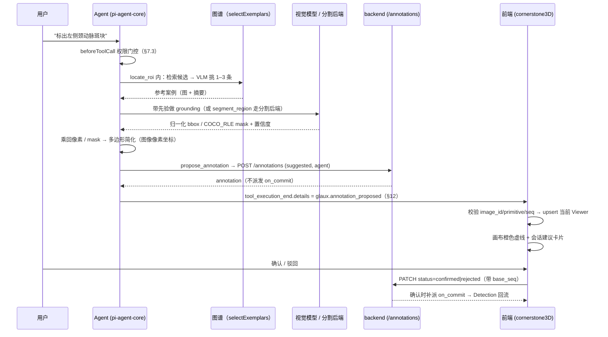
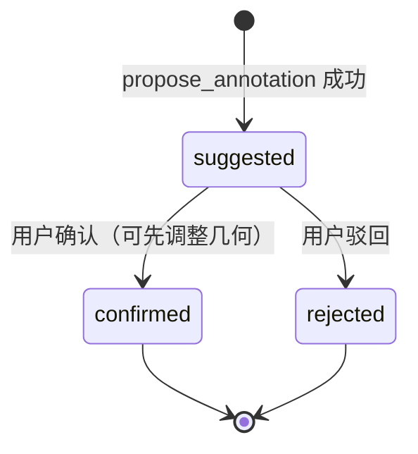

# 智能体图像标注能力（Agent-Assisted Annotation）

## 0. 状态

| 项 | 值 |
| --- | --- |
| SDD 状态 | `implemented` |
| 创建日期 | 2026-08-13 |
| 最近更新 | 2026-09-24 |
| 目标阶段 | 第一阶段：自然语言指令驱动的"建议态"标注闭环 |
| 上位 SDD | [Glaux SDD 索引](../../README.md) |

§17 六个开放问题已于 2026-08-22 全部收敛——分割后端选定 Gitee AI（模力方舟）`sam3`
并**实测**过全部关键契约（延迟、mask 编码、两处 schema 与实现不符、医学模态命中率），
其余五问的答案均已由实测或既有实现坐实。D-12 的实时 Viewer 写回与建议卡片快照持久化
已于 2026-08-26 实现并通过开发侧验证；完整浏览器确认/驳回走查完成后再转 `accepted`。

> 实测改变了工具分工：裸 SAM3 的开放词表建立在自然图像上，**医学模态实测 0 命中**，
> 故领域结构的定位由 `locate_roi`（视觉模型 grounding + 图谱先验）承担，`segment_region`
> 只负责通用场景的像素级边界。详见 §7.2 与 D-6。

## 1. 负责人

| 角色 | 负责人 |
| --- | --- |
| 产品与范围 | Glaux 项目维护者 |
| Agent Runtime（工具系统） | Glaux Agent Runtime 维护者 |
| 前端（标注渲染与确认流） | Glaux 前端维护者 |
| 精度层（science-core / 分割后端） | Glaux science-core 维护者 |
| 验收 | Glaux 项目维护者 |

## 2. 非目标

本阶段明确不包含：

- 浏览器自动化（Playwright / computer-use 式截图点击）。标注通过结构化工具直接写入
  前端标注状态，不模拟任何鼠标键盘操作（决策 D-1）。
- 操作外部第三方网页的通用浏览器工具（查文献、抓取、填表）。若立项另起 Feature SDD。
- MedSAM / SAM3 的自部署 GPU 推理服务；第一阶段只走托管 API（决策 D-3 / D-5）。
  医学微调权重的本地部署是 D-6 指出的下一步方向，但不在本阶段范围内。
- 自动确认标注。所有 agent 产出的标注一律为"建议态"，必须人工确认后才转正式标注。
- 3D 体数据的跨切片自动传播（SAM2 memory 传播）；第一阶段仅支持单帧/单切片标注。
- 标注的导出、版本管理、多人协作与审阅流。
- 将 Glaux 暴露为 MCP server 供外部 agent 调用（roadmap 方向，另立 SDD）。
- 通用工具权限执行引擎的完整形态；本阶段只实现标注工具所需的最小 `permission_mode`
  门控（见 §7.3），不承诺覆盖未来所有工具类别。

## 3. 当前目标

让内置参考 Agent 能够执行"自然语言指令 → 精确图像标注"的闭环：

- 用户在会话中说"标出左侧颈动脉斑块"，agent 经工具调用产出一个像素级精确的
  建议态标注，出现在当前影像视口中，等待人工确认。
- 为 agent-runtime 建立第一套真实工具系统（tool registry + 权限门控 + 工具事件流），
  作为后续所有领域工具的地基。
- science-core 已覆盖的任务走本地校准分割；未覆盖的通用场景走国内托管 SAM 推理 API。

## 4. 输入

### 4.1 用户输入

| 输入 | 必填 | 说明 |
| --- | --- | --- |
| 自然语言标注指令 | 是 | 会话消息，例如"框出图中最大的低回声区域" |
| 当前影像上下文 | 是 | 前端随会话提供 `ViewerContext{collection,task,method,object,focus}`；`focus.index` 定位切片或帧 |
| 权限模式 | 是 | 沿用会话 `permission_mode`（observe/suggest/controlled/autonomous） |
| 手动粗提示（可选） | 否 | 用户在画布上点一个点/画一个粗框，作为分割 prompt 的替代来源 |

### 4.2 系统输入

- 现有 VLM 连接配置（provider、model、base_url、API key），用于视觉粗定位。
- science-core 分割能力清单（当前：颈动脉超声 contour/carosegdeep 系、胎儿头围等）。
- SAM 推理 API 连接配置：供应商、endpoint、API key、数据外发开关（见 §7.4）。
- 对象元数据与焦点：`object.axes`、`object.calibration`、`focus.index`、`focus.region`；帧尺寸与坐标变换由 `X-Glaux-Frame` 给出。

### 4.3 输入约束

- 影像发往外部分割后端前，数据外发开关 `GLAUX_ANNOT_ALLOW_EGRESS`（D-7）必须显式开启；
  默认关闭，关闭时 `segment_region` 直接不注册（§7.3），该能力对模型不可见。
- 分割后端的 endpoint 必须通过出站守卫校验——复用 agent-runtime 已有的
  [`security/net-guard.ts`](../../../../agent-runtime/src/security/net-guard.ts)（2026-08-16 自
  backend `net_guard.py` 移植：解析后 IP 判定 + host 白名单 + fake-ip 显式开关）。
- API key 只存在于请求处理所需内存，禁止写入 SQLite、事件、日志（沿用
  [00-reference-agent-conversations](../00-reference-agent-conversations/README.md) 的约束）。

## 5. 输出

### 5.1 用户可见输出

- 会话中的工具调用状态行（沿用既有"⚙ 调用 &lt;tool&gt;"渲染）与产出卡片：图谱引用卡片、
  建议标注卡片（含"确认 / 驳回"，含失败与"本次未提出"两种降级态）。
- 影像视口中的建议态标注：**橙色虚线**，与人工标注的实线一眼可辨；确认后换回实线，
  驳回后从画布消失（库中留 `rejected`）。
- 来源标识：标注的 `source` 字段（`agent`），确认后保留不变，可审计。

### 5.2 系统输出

- 写入 cornerstone3D 标注状态的 annotation 对象（`annotation.state.addAnnotation`）
  或 labelmap 分割（`segmentation.addSegmentations`），状态为 `suggested`。
- 工具执行事件（经现有 SSE 通道），payload 见 §12。
- 标注溯源记录：指令原文、精度层路由、模型/供应商、置信度、trace_id。

### 5.3 输出保证

- 每次工具调用要么产出一个建议态标注，要么产出一个带错误码的明确失败事件；不允许静默失败。
- 建议态标注在人工确认前不进入任何测量、验证或下游流程。
- agent 不能修改或删除已确认的正式标注。
- `propose_annotation` 成功事件到达前端后，当前对象的 Viewer 必须立即出现建议态标注；
  不得依赖切图、刷新或轮询才能显示。
- 建议卡片必须随会话快照持久化；页面刷新后仍可恢复确认/驳回入口。

## 6. 核心流程

失败路径：定位/分割无结果、置信度全部低于阈值、几何退化、后端拒绝，处理见 §13——
"没找到"以正常空结果返回并明确要求模型不要编坐标，真错误才抛。

## 7. 核心规则

### 7.1 工具集（第一阶段）

标注与观测工具的目标**恒取查看器当前焦点**（`viewer.focus.object_id`），模型不能指定任意 image_ref——
避免它拿到不属于当前上下文的影像（D-9）。

| 工具 | 入参 | 出参 | 说明 |
| --- | --- | --- | --- |
| `locate_roi` | 目标描述, use_atlas, max_results, min_confidence | bbox 列表（对象像素）+ 置信度 + 理由 | 视觉模型 grounding；默认带图谱先验，复用 [03 §6.3](../03-atlas/README.md) 的 `selectExemplars`（D-6：**领域结构走这条**） |
| `segment_region` | 目标描述, max_results, min_confidence | 多边形列表（对象像素）+ 置信度 + 面积 | 走 §7.2 托管分割后端；通用场景的像素级边界 |
| `propose_annotation` | label, bbox **或** polygon, note | annotation_id、index | `index` 取自 `focus.index`；落建议态标注（`status=suggested, source=agent`） |

模型答**归一化坐标**再由 runtime 乘回像素（D-8）：模型不知道图有多少像素，逼它直接输出
像素坐标只会得到"1024 猜想"式的幻觉。四值全落在 `[0,1]` 才按归一化解读，否则按像素——
兼容直接答像素的模型。以 `X-Glaux-Frame.width/height` 乘回帧像素，再用
`toObjectCoords` 转成对象像素；`frame.index` 随标注写库。越界裁回图内，退化框丢弃。

工具由 [`harness-registry.ts`](../../../../agent-runtime/src/pi/harness-registry.ts) 的
`TOOL_PROVIDERS` 登记能力、焦点支持、创建函数与提示片段；`observe` 和 chat 发行包返回空工具集。
`run_task` 保留为命中任务注册表能力时的调用路径。需要图像字节的工具统一调用
`fetchObservation(base, focus)`，不各自读取 `/image/{id}`；分割供应商实现 `SegmenterPort.segment`。
前端已有把工具产出写回查看器的桥（`frontend/src/agent/toolBridge.ts`，监听 `tool_execution_end`）和
"⚙ 调用 <tool>"状态行渲染。工具桥必须按 `details.kind`/工具名显式分派：`run_task` 写回
Detection，`propose_annotation` 写回统一 Annotation Store；后者只在 `image_id` 仍等于
`focus.object_id` 时应用，视频还须匹配 `focus.index.t`。用户已切换焦点则丢弃实时写回。

### 7.2 精度层路由

按"谁认识这个结构"分派，而非按"谁更精确"：

1. 任务命中 science-core 已支持的能力 → `run_task` 本地调用（保留 dice 校验与校准溯源）。
   **校准测量恒走这条**，分割后端不产出带单位的量。
2. 领域结构（超声斑块、TEM 电子致密物、切片核等）→ `locate_roi`：视觉模型 grounding
   + 图谱先验。出矩形框，精度到不了像素级，但认识概念。
3. 通用场景的像素级边界 → `segment_region`：托管分割后端（Gitee AI `sam3`，见 D-5），
   要求外发开关已开启（§7.4）。
4. 都不可用或都无结果 → 如实失败，**不降级为让模型直接猜坐标**（工具描述里明写
   "Do not invent coordinates"；0 命中与低置信度全滤是两条不同的提示）。

> **为什么不是"SAM 兜底一切"**（推翻了 D-2 的隐含假设，见 D-6）：2026-08-24 实测，
> `sam3` 对 `ultrasound.png`（plaque / 斑块 / carotid artery / 颈动脉 / vessel /
> blood vessel / artery wall / anything / object 九组中英 prompt）、`ct.png`（liver）、
> `wsi.png`（cell nucleus）**全部 `num_segments: 0`**；同一接口对 `hand.png`(hand)、
> `eye.png`(eye) 正常返回，置信度 0.94。这不是接口问题，是领域缺口。

**分割后端契约**（实测值，2026-08-24；换后端须重新核对）：

| 项 | 值 |
| --- | --- |
| 端点 | `POST {base}/images/segmentation`，multipart |
| 必传字段 | `model`、`image`、**`prompt`** |
| 延迟 | 2.0–2.5s（1.3MB 图）；13 次中 1 次 120s 无响应 |
| 超时 / 重试 | 30s；超时与 5xx 重试一次，4xx 与额度错误不重试 |
| mask 编码 | `COCO_RLE_base64`（base64 外层 + COCO LEB128 变体，列优先游程） |
| 额度耗尽 | HTTP **400**（非 402），报文含"计费资源" → 单独错误码，不重试 |

两处 **schema 与实现不符**，实现按实测为准（D-10）：

1. **`prompt` 实际必传**，其 OpenAPI schema 完全未声明该字段（缺失时 400 `必传参数: prompt`）；
2. **`mask.size` 实为 `[width, height]`**，schema 声明为 `[height, width]`——按声明解读会让
   几何纵向糊成长条。回归测试以"解码 bbox 必须与后端自报 bbox 吻合"做交叉验证。

### 7.3 权限门控（permission_mode 首次接线）

| 模式 | 行为 |
| --- | --- |
| `observe` | 标注工具全部不可用；agent 只能文字描述其发现 |
| `suggest` | 允许 `locate_roi`；`segment_region`/`propose_annotation` 需逐次用户批准 |
| `controlled` | 三个工具均可用，`propose_annotation` 产物必须人工确认（本阶段默认） |
| `autonomous` | 同 `controlled`；本阶段不提供免确认路径（自动确认在 §2 非目标中） |

逐次批准门控实现于 pi-agent-core 的 `beforeToolCall` 钩子，读取会话 `permission_mode`；
交互形态为**会话内卡片**（Q5 → D-11），不弹窗。

除权限模式外，工具还有两层注册期门控（不满足则**不注册**，而非运行期报错——挂一个必然
失败的工具只会让模型反复重试，并把失败误读为"图里没有该结构"）：

| 工具 | 注册条件 | 理由 |
| --- | --- | --- |
| `locate_roi` | 有 `focus` 且 `connection.vision === true` | 要向模型发图；无视觉的模型收到的图会被 pi-ai 静默换成 "image omitted" 占位 |
| `segment_region` | 有 `focus`、`GLAUX_ANNOT_ALLOW_EGRESS` 放行 **且** `GLAUX_SEG_API_TOKEN` 存在 | 图要发往第三方分割服务 |
| `propose_annotation` | 有 `focus` 且非 `observe` | 只写本机 backend，且产出恒为建议态 |

### 7.4 数据外发规则

- 影像数据离开本机（发往分割后端）是显式 opt-in 行为：环境变量开关 `GLAUX_ANNOT_ALLOW_EGRESS`
  （缺省关闭，只认 `1`/`true`/`yes`；Q6 → D-7）+ 配置中写明供应商与外发内容；
  UI 在首次触发时提示一次。
- 外发内容仅限：当前帧图像（或其裁剪）、文本 prompt。禁止携带患者标识、文件路径、会话文本。
- pre-alpha 阶段仅允许对公开数据集影像开启外发。
- **`locate_roi` 不受该开关约束**：它只把图发往用户自己配置的模型连接（与会话同一条，
  用户已知情），不经第三方分割服务。但随行的图谱案例是否包含 `local-only`，仍由
  `egressFor(connection)` 判定——只有 base_url 解析为回环的本机模型才带（SDD 03 §7.4）。
- 该开关与 fake-ip（`198.18.0.0/15`）SSRF 策略一并进安全评审，评审前维持现状。

## 8. 涉及对象

| 对象 | 位置 | 说明 |
| --- | --- | --- |
| Tool registry 与门控 | `agent-runtime/src/pi/harness-registry.ts` 的 `TOOL_PROVIDERS` | 工具注册条件（§7.3）与提示片段同源 |
| 观测入口 | `agent-runtime/src/observation/index.ts` 的 `fetchObservation` | `/objects/{id}/frame` + `X-Glaux-Frame`；帧坐标转对象坐标 |
| `locate_roi` | `agent-runtime/src/pi/tools/locate-roi.ts` | grounding + 图谱先验；尺寸与坐标取自 ReferenceFrame |
| `segment_region` | `agent-runtime/src/pi/tools/segment-region.ts` | 调分割后端，出多边形 |
| `propose_annotation` | `agent-runtime/src/pi/tools/propose-annotation.ts` | 写建议态标注 |
| 分割后端客户端 | `agent-runtime/src/annotation/segmentation-client.ts` | 供应商适配、错误分类、重试 |
| 分割端口 | `agent-runtime/src/annotation/segmenter-port.ts` | `SegmenterPort.segment` 替换面 |
| mask → 多边形 | `agent-runtime/src/annotation/mask-to-polygon.ts` | COCO RLE 解码 + 轮廓 + 简化 |
| 视觉 grounding | `agent-runtime/src/pi/vision.ts` 的 `locateInImage` | 复用 `completeJson`；归一化坐标换算 |
| 出站守卫（Node） | `agent-runtime/src/security/net-guard.ts`（已有） | 复用，无需新增 |
| science-core 分割入口 | 现有 `/task/run`（D-9：不新开端点） | 校准测量恒走这条 |
| 建议态落库 | `backend/app/routers/annotations.py` + `annotations/store.py` | REST 暴露 `status`/`source`；建议态不派发 `on_commit`，确认时补派 |
| 建议态渲染 | `frontend/src/annotation/csAnno.ts` | `suggested` 橙色虚线；`rejected` 不进画布 |
| 确认流 | `frontend/src/annotation/bridge.ts` 的 `resolveSuggestion` | PATCH status；确认走 `applyHook` 回流 |
| 建议卡片 | `frontend/src/components/agent/SuggestionCard.tsx` | 确认/驳回；状态取 store 实时值 |
| 坐标转换 | 前端 `csAnno`（D-9） | 图像像素坐标 → cornerstone 世界坐标 |

## 9. 数据或字段要求

建议态标注**不另立实体**：直接用 SDD 04 的 `Annotation`，经 `POST /annotations` 落库
（Q3/Q4 → D-9）。REST 层暴露 `status` / `source` 两个字段，store 层原已支持。

| 字段 | 取值（agent 产出时） | 说明 |
| --- | --- | --- |
| `id` | 服务端分配 | 幂等键（§10） |
| `status` | `suggested` | 人工确认转 `confirmed`，驳回转 `rejected` |
| `source` | `agent` | **确认后保留不变**——溯源不被抹掉，可审计"哪些标注源于 agent" |
| `primitive` | `bbox` 或 `polyline(closed)` | **对象像素坐标**（不是世界坐标，见下） |
| `label` | agent 给出的语义标签 | |
| `index` | `focus.index` | 体数据为 `z`、视频为 `t`、切片为 `level`；`z` API 别名在 SDD 10 W7 删除 |
| `seq` | 服务端分配 | 乐观并发；确认/驳回须带 `base_seq` |

置信度、理由、trace_id 等**不进标注实体**，走工具结果的 `details`（§12）——它们是本次
产出的元信息，不是标注本身的属性；标注一旦确认就该与人工标注同形。

**坐标职责边界**（Q3 → D-9）：runtime 用 `ReferenceFrame` 将观测帧像素换成对象像素；
对象像素↔cornerstone 世界坐标的变换留在前端 `csAnno`。runtime 不碰视口变换，
但需要前端提供 `object` 与 `focus`。
mask 同理不穿过契约——在 runtime 侧解码简化成多边形，前端只见矢量几何。

## 10. 幂等规则

- 幂等键为 `annotation_id`，由 runtime 在 `propose_annotation` 受理时生成。
- 同一 `annotation_id` 的 `annotation.suggested` 事件重复送达时，前端只渲染一次。
- 实时事件重复到达时复用 Session Store 的 `upsertAnnotation`，不得追加同 ID 的第二个轮廓。
- 用户对同一 `annotation_id` 的 resolve（接受/拒绝）只生效一次，后续重复回执忽略。
- agent 重试整个工具链会产生新的 `annotation_id`（视为新建议），不复用旧键。

## 11. 状态或生命周期规则

状态名用 SDD 04 既有的 `confirmed`（不是 `accepted`）——同一实体不该有两套状态词表。

- `suggested` 态标注不参与测量/验证/导出；会话关闭不销毁，随影像上下文恢复。
- `confirmed` 后即 SDD 04 的正式标注，脱离本 SDD 管辖。
- **`on_commit` 任务钩子在建议态不派发**（D-9）：未经确认的猜测不得直接产生 Detection
  副作用。确认那一刻由确认路径补派，且仅 `suggested → confirmed` 这一跃迁触发，
  普通编辑不重复派。
- `rejected` 标注留在库里可审计，但不再渲染进画布——驳回不是删除。
- agent 对 `confirmed`/`rejected` 态标注无任何写权限；它也无法把自己的产出转成
  `confirmed`——`propose_annotation` 恒写 `suggested`，这是"绝不自动确认"的执行点。

## 12. 审计或事件规则

**不新增 SSE 事件类型**（D-11）：工具调用的起止已由 pi 既有事件流覆盖（前端已渲染
"⚙ 调用 &lt;tool&gt;"状态行），产出经**工具结果的 `details`** 进入会话，与 SDD 03 D-21 的
`glaux.atlas_referenced` 同一范式。这样卡片随会话历史天然持久化，不必另建回放通道。

Agent Runtime 的会话视图必须保留 `glaux.annotation_proposed` 与 `glaux.atlas_referenced` 两类
可展示 details，并剥离工具正文；`glaux.task_output` 等大型/纯 Viewer 结果不进入快照。前端实时
消费 `tool_execution_end` 时把合法的建议态 details upsert 到当前 Annotation Store；首次载图或
刷新仍以 Backend `GET /annotations` 为事实源（D-12）。

| details.kind | 产出方 | payload 要点 |
| --- | --- | --- |
| `glaux.roi_located` | `locate_roi` | image_id、target、boxes[{box, confidence, why}]、filtered_out、可选 atlas |
| `glaux.segment_region` | `segment_region` | image_id、target、regions[{label, confidence, bbox, points, area}]、filtered_out |
| `glaux.annotation_proposed` | `propose_annotation` | annotation_id（**可为 null** 表示本次未提出）、image_id、label、note、reason、primitive、index、seq |
| `glaux.atlas_referenced` | `locate_roi` 的图谱先验步 | 同 SDD 03 §12（复用同一契约与卡片组件） |

失败不另发事件：错误经 `RuntimeError` 走既有工具错误通道，模型收到可读原因后自行纠正
（如后端 422 的几何越界原样回传，便于改坐标重试）。

审计：每次外发（分割后端调用）记录一条审计日志：供应商、endpoint host、图像尺寸、
trace_id；不记录图像内容与 API key。

## 13. 异常和人工处理

"没找到"不是错误：0 命中与"低置信度全滤"都以正常结果返回，但文案区分两者，并明确
要求模型不要编坐标——把它当异常抛出反而会诱导重试。

| 失败类别 | 错误码 | 用户感知 | 处理 |
| --- | --- | --- | --- |
| 定位/分割无结果 | —（正常返回，空列表） | "未能定位目标，请补充描述或手动框选" | 提示改措辞、改走 `run_task`，或告知用户找不到 |
| 置信度全部低于阈值 | —（正常返回，`filtered_out` 计数） | 如实说明有候选但都不够可信 | 同上，且不展示低可信几何 |
| 外发开关关闭 | —（工具**不注册**） | 该能力不出现 | 不静默降级，也不挂必然失败的工具 |
| 分割后端未配 token | `segmentation_not_configured` | 提示需配置 | 构造即抛，不裸调打到 401 |
| 分割额度耗尽 | `segmentation_quota_exhausted` | "额度不足，请充值" | 不重试（与参数错误区分） |
| 分割后端超时/5xx | `segmentation_failed` | 可重试提示 | 重试一次后失败 |
| 未知 mask 编码 | `segmentation_failed` | 提示后端契约变化 | 直接报错，**不静默产出错误几何** |
| 取图失败 / 缺失或非法 `X-Glaux-Frame` | `image_unavailable` | 提示图不可用 | 不猜默认尺寸与坐标系 |
| 定位输出非法 JSON | `locate_failed` | 提示模型输出异常 | 重试一次后失败 |
| 建议态写入被拒 | `annotation_rejected` | 提示几何越界等原因 | 后端 422 原因原样回传，模型可改坐标重试 |
| 出站守卫拒绝 | `EGRESS_BLOCKED` | 提示 endpoint 不在白名单 | 运维处理 |

所有失败带 trace_id，可与审计日志串联排查。

## 14. 与其他 SDD 的调用关系

- 依赖 [00-reference-agent-conversations](../00-reference-agent-conversations/README.md)：
  会话、SSE 通道、`permission_mode` 字段契约。本 SDD 将其中"权限模式仅存储"升级为
  "在 beforeToolCall 中生效"，属于对该 SDD 预留缝隙的兑现，不构成契约冲突。
- 依赖 [04-unified-annotation-toolbox](../04-unified-annotation-toolbox/README.md)（`implemented`）：
  §11 "`confirmed` 后归影像标注既有逻辑"的实体与端点由 SDD 04 承接——建议态标注落库走
  `POST /annotations`（`status=suggested, source=agent`），确认/驳回即 PATCH status。
  Q3/Q4 已据其 §9 契约收敛为 D-9：不另立实体、不新开端点，只在 REST 层暴露 store
  早已支持的两个字段。SDD 04 §2 预留的"以 `source`/`status` 留接缝"至此兑现。
- 依赖 [03-atlas](../03-atlas/README.md)（`implemented`）：`locate_roi` 的图谱先验步直接
  复用其 §6.3 的 `selectExemplars` 与 `glaux.atlas_referenced` 卡片契约（03 D-21 已接通）。
- 依赖 backend / science-core 现有分割入口，以及 agent-runtime 的出站守卫与工具挂载点
  （[退役 orchestration 设计](../../../designs/2026-08-16-001-retire-orchestration.zh-CN.md) 已落地；引用代码路径见 §8）。
- 被未来"Glaux-as-MCP-server"、"外部网页浏览器工具"等 SDD 引用（均未立项）。

## 15. 验收标准

- [ ] 在 `controlled` 模式下对当前图下达自然语言指令，视口中出现建议态标注（橙色虚线），
      会话中出现带确认/驳回的建议卡片。
- [ ] `propose_annotation` 成功后无需切图或刷新，当前 Viewer 在同一轮工具事件中立即显示标注；
      同一事件重复送达不产生重复轮廓。
- [ ] 工具执行期间切换到另一对象时，旧 `image_id` 的建议不得写入当前 Viewer；重新打开原对象
      后可由 `/annotations` 恢复。
- [ ] 页面刷新并恢复同一会话后，建议卡片仍存在；当前对象的标注状态由 `/annotations` 恢复，
      卡片可继续确认或驳回。
- [ ] 领域结构（如 TEM 电子致密物）经 `locate_roi` 定位成功，且结果中带图谱先验引用；
      同一指令在 `use_atlas: false` 下也能返回（先验是加成不是前提）。
- [ ] 通用结构经 `segment_region` 产出像素级多边形，审计日志有对应外发记录。
- [ ] 外发开关关闭时 `segment_region` **不出现在工具集**，agent 不会尝试调用它；
      无任何对外请求发出。
- [ ] 分割 endpoint 配置为私网地址且未显式放行时，出站守卫拒绝并返回
      `EGRESS_BLOCKED`（fake-ip 段 `198.18.0.0/15` 默认放行，见 `agent-runtime/src/security/net-guard.ts`）。
- [ ] 非视觉连接下 `locate_roi` 不出现在工具集。
- [ ] `observe` 模式下三个标注工具均不可被调用，agent 回复中不出现工具调用。
- [ ] `suggest` 模式下 `segment_region` 触发逐次批准，用户拒绝后本次调用终止且无标注产出。
- [ ] 建议态标注创建时**不触发** `on_commit`；确认那一刻触发一次，普通编辑不重复触发。
- [ ] 用户驳回建议后该标注从视口消失（库中留 `rejected` 可查），agent 无法再引用/修改它。
- [ ] 建议态标注被确认前，不出现在任何测量或验证结果中。
- [ ] 确认后 `source` 仍为 `agent`——溯源不被抹掉。
- [ ] 分割/定位 0 命中时，agent 如实告知找不到，**不输出编造的坐标**。
- [ ] 任一失败路径均产生带 trace_id 的失败事件，且 API key 不出现在日志与事件 payload 中。

**开发侧已验证**（实现随 `ready` 同期落地，非验收替代品）：

| 项 | 证据 |
| --- | --- |
| mask → 多边形 | `mask-to-polygon.test.ts`（9 例）；fixture 为 `sam3` 真实响应，以解码 bbox 与后端自报 bbox 吻合做交叉验证 |
| 分割客户端 | `segmentation-client.test.ts`（8 例）+ 真实端到端（eye.png 2543ms / 2 段 / 14 与 18 点） |
| `segment_region` | `segment-region-tool.test.ts`（11 例，含门控四态） |
| `propose_annotation` | `propose-annotation-tool.test.ts`（12 例，含"恒 suggested+agent"） |
| `locate_roi` | `locate-roi-tool.test.ts`（15 例，含坐标换算/裁剪/退化/先验退化） |
| 建议态落库与确认 | `backend/tests/test_annotations.py`（8 例，含钩子派发时机） |
| 前端渲染与确认流 | `SuggestionCard.test.tsx`（11 例）+ `csAnno.test.ts` 建议态 3 例 |
| 建议态实时写回 | `toolBridge.test.ts`：bbox/polygon 即时 upsert、重复事件幂等、已确认状态不回退、切图/错误/畸形 details 拒绝；Frontend 全量 `150 passed` |
| 建议卡片快照 | `session-lifecycle.test.ts`：成功 details 保留且正文剥离、失败结果过滤；Agent Runtime 全量 `161 passed`；真实会话 `ad44e71f-…` 快照已恢复 `glaux.annotation_proposed` |

## 16. 决策记录

| 编号 | 决策 | 备选 | 选择理由 | 时间 |
| --- | --- | --- | --- | --- |
| D-1 | 标注经结构化工具直写前端状态，不用浏览器自动化 | Playwright 模拟点击；computer-use 截图+坐标 | 影像画布是 Canvas，DOM 选择器无效；VLM 坐标精度（像素~几十像素误差）不满足医学标注；Label Studio/CVAT 同为此模式 | 2026-08-13 |
| D-2 | 精度层双路：science-core 优先，分割后端兜底 | 仅 science-core；仅 SAM | science-core 覆盖有限但带校准溯源；分割后端补通用场景。**注**：其"SAM 能兜住医学场景"的隐含假设已被 D-6 推翻，双路结构不变但分派依据改为"谁认识这个结构" | 2026-08-13（D-6 修正 2026-08-22） |
| D-3 | SAM 走国内托管 API，不自部署 GPU | 自部署 MedSAM/SAM2 | 团队约束"优先 API"；免 GPU 运维；供应商见 D-5 | 2026-08-13 |
| D-4 | 全部标注为建议态 + 强制人工确认 | autonomous 免确认 | 医学场景精度责任划分；纲领 §三：生物医学方向只做研究、不做临床诊断 | 2026-08-13 |
| D-5 | 分割后端选 **Gitee AI（模力方舟）`sam3`** serverless（Q1 收敛） | 阿里云 ModelScope / 视觉智能开放平台、百度智能云、腾讯云 TI；自部署 SAM3 | 唯一实测可用的 SAM3 文本 prompt 分割托管 API：2.0–2.5s、契约清晰、按量计费、零运维。自部署 SAM3 需 10–12GB 显存，本机是 Intel Arc 核显跑不了 CUDA，另一台 4060 Ti 16G 尚未接通 | 2026-08-22 |
| D-6 | 领域结构定位归 `locate_roi`（视觉 grounding + 图谱先验），`segment_region` 只管通用场景 | 全部走 SAM 分割（D-2 的隐含假设） | 裸 SAM3 医学模态**实测 0 命中**（超声 9 组中英 prompt / CT / WSI 全空，同接口对自然图像置信度 0.94）——开放词表建立在自然图像概念上。这也让图谱先验从"锦上添花"变成刚需 | 2026-08-22 |
| D-7 | 外发开关用环境变量 `GLAUX_ANNOT_ALLOW_EGRESS`，缺省关闭（Q6 收敛） | 连接配置 UI 里的开关 | pre-alpha 阶段外发是运维决策不是用户偏好；环境变量不会被误点开，也便于在部署层统一管控。UI 开关待安全评审后再议 | 2026-08-22 |
| D-8 | 模型答**归一化坐标**，runtime 按 `ReferenceFrame.width/height` 乘回帧像素，再按 `origin/scale` 转对象像素 | 要求模型直接输出像素坐标 | 观测帧可能裁剪或缩放，尺寸与变换以 `X-Glaux-Frame` 为准（SDD 10 §6.4） | 2026-08-22 |
| D-9 | 建议态**不另立实体**，直接用 SDD 04 的 `Annotation`（`status=suggested, source=agent`）；写库坐标为对象像素，世界坐标变换留前端（Q2/Q3/Q4 收敛） | 建议态单独一套实体与端点；runtime 做世界坐标变换 | runtime 只处理观测帧→对象的 `ReferenceFrame` 变换，不处理视口世界坐标；`on_commit` 在建议态不派发、确认时补派 | 2026-08-22 |
| D-10 | 分割后端契约以**实测**为准，与其 OpenAPI schema 冲突处按实测实现并在代码注释里记明 | 按 schema 实现，出错再查 | 实测发现两处不符（`prompt` 必传但未声明、`size` 实为 `[w,h]`）。按 schema 写会得到纵向糊成长条的几何，且要到联调才暴露。回归测试用真实响应做 fixture 锁住这两点 | 2026-08-22 |
| D-11 | 不新增 SSE 事件类型，产出走**工具结果 `details`**；`suggest` 逐次批准用会话内卡片（Q5 收敛） | 新增 `annotation.*` 事件族；弹窗批准 | SDD 03 D-21 已验证 `details` 这条范式：卡片随会话历史天然持久化，不必另建回放通道。弹窗打断阅片节奏，且与既有会话交互不同构 | 2026-08-22 |
| D-12 | `propose_annotation` 成功后由 `tool_execution_end` 事件直接 upsert 当前 Viewer，快照保留建议 details | 成功后再请求 `/annotations`；轮询；只在切图时恢复 | details 来自 Backend 成功响应，已含 ID/几何/seq；直接写回延迟最低且无额外请求。活动对象守卫防止切图串入，`upsertAnnotation` 保证重复事件幂等，Backend 仍是刷新后的事实源 | 2026-08-26 |

## 17. 待确认问题

**全部收敛（2026-08-22）**——`ready` 文档不保留未关闭的开放问题。

- [x] **Q1 分割 API 供应商选型** → **D-5**：Gitee AI（模力方舟）`sam3`。实测通过，
      契约见 §7.2。原候选（阿里云 ModelScope / 视觉智能、百度、腾讯 TI）未提供
      SAM3 级别的文本 prompt 分割托管接口。
- [x] **Q2 mask 传输格式与解码** → **D-10 / §7.2**：`COCO_RLE_base64`；runtime 侧
      解码 → Moore 邻域轮廓跟踪 → Douglas-Peucker 简化，点数上限 256（实测 218/265 点
      简化到 15/16 点，压缩比 14–17×）。纯算法零依赖，TS 侧无 pycocotools。
- [x] **Q3 坐标转换职责边界** → **D-9 / SDD 10 §6.4**：runtime 把观测帧像素转换为对象像素，
      前端 `csAnno` 负责对象像素↔世界坐标；前端提供 `object` / `focus`，不提供视口变换矩阵。
- [x] **Q4 science-core 分割的 REST 契约** → **D-9**：现有 `/task/run` 够用，不新开端点；
      标注落库复用 SDD 04 的 `POST /annotations`（仅在 REST 层暴露 store 早已支持的
      `status`/`source` 两个字段）。
- [x] **Q5 逐次批准的交互形态** → **D-11**：会话内卡片，不弹窗。
- [x] **Q6 外发开关命名与位置** → **D-7**：环境变量 `GLAUX_ANNOT_ALLOW_EGRESS`，缺省关闭。
      与 fake-ip SSRF 策略一并进安全评审（评审是独立议题，不阻塞本 SDD 实现）。

**实现阶段需盯的两件事**（不是开放问题，是已知风险）：

1. **医学场景的分割精度尚无数字**。`locate_roi` 出的是矩形框，够定位不够测量；真正的
   医学像素级边界要么走 science-core，要么等本地医学微调权重（4060 Ti 那台机器接通后）。
   SDD 03 D-17 的 IoU 度量是检验这条的手段，需 10 张自有 TEM 图 + 人工框。
2. **全链路尚未做过"真模型 → 真分割 → 真画布"的完整走查**。各层分别验证过（单测、
   计算样式、客户端真实端到端），但端到端观感需人工过一遍。
