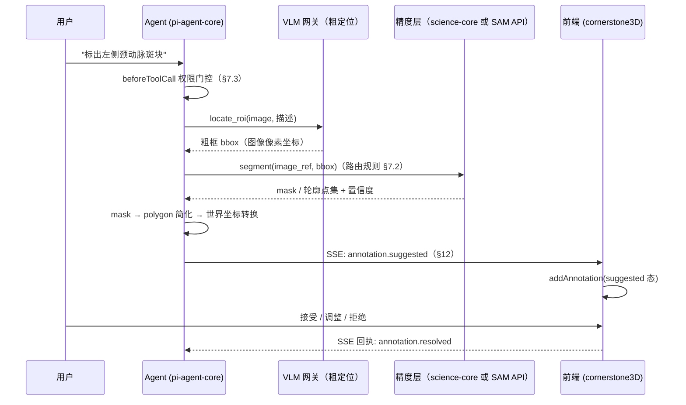
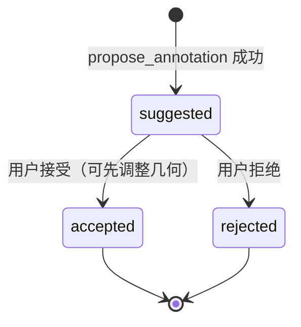

# 智能体图像标注能力（Agent-Assisted Annotation）

## 0. 状态

| 项 | 值 |
| --- | --- |
| SDD 状态 | `draft` |
| 创建日期 | 2026-08-13 |
| 最近更新 | 2026-08-13 |
| 目标阶段 | 第一阶段：自然语言指令驱动的"建议态"标注闭环 |
| 上位 SDD | [Glaux SDD 索引](../../README.md) |

草案要点：工具系统、精度层路由与前端标注写入的边界已经对齐；国内 SAM 推理 API 的
供应商选型、mask 传输格式与坐标转换细节仍是开放问题（见 §17），收敛后方可推进 `ready`。

## 1. 负责人

| 角色 | 负责人 |
| --- | --- |
| 产品与范围 | Glaux 项目维护者 |
| Agent Runtime（工具系统） | Glaux Agent Runtime 维护者 |
| 前端（标注渲染与确认流） | Glaux 前端维护者 |
| 精度层（science-core / SAM API） | Glaux science-core 维护者 |
| 验收 | Glaux 项目维护者 |

## 2. 非目标

本阶段明确不包含：

- 浏览器自动化（Playwright / computer-use 式截图点击）。标注通过结构化工具直接写入
  前端标注状态，不模拟任何鼠标键盘操作（决策 D-1）。
- 操作外部第三方网页的通用浏览器工具（查文献、抓取、填表）。若立项另起 Feature SDD。
- MedSAM / SAM2 的自部署 GPU 推理服务；第一阶段只走托管 API（决策 D-3）。
- 自动确认标注。所有 agent 产出的标注一律为"建议态"，必须人工确认后才转正式标注。
- 3D 体数据的跨切片自动传播（SAM2 memory 传播）；第一阶段仅支持单帧/单切片标注。
- 标注的导出、版本管理、多人协作与审阅流。
- 将 Glaux 暴露为 MCP server 供外部 agent 调用（roadmap 方向，另立 SDD）。
- 通用工具权限执行引擎的完整形态；本阶段只实现标注工具所需的最小 `permission_mode`
  门控（见 §7.3），不承诺覆盖未来所有工具类别。

## 3. 当前目标

让内置参考 Agent 能够执行"自然语言指令 → 精确图像标注"的闭环：

- 用户在会话中说"标出左侧颈动脉斑块"，agent 经工具调用产出一个像素级精确的
  建议态标注，出现在当前影像视口中，等待人工确认。
- 为 agent-runtime 建立第一套真实工具系统（tool registry + 权限门控 + 工具事件流），
  作为后续所有领域工具的地基。
- science-core 已覆盖的任务走本地校准分割；未覆盖的通用场景走国内托管 SAM 推理 API。

## 4. 输入

### 4.1 用户输入

| 输入 | 必填 | 说明 |
| --- | --- | --- |
| 自然语言标注指令 | 是 | 会话消息，例如"框出图中最大的低回声区域" |
| 当前影像上下文 | 是 | 当前视口加载的 image_id / 帧号，由前端随会话上下文提供 |
| 权限模式 | 是 | 沿用会话 `permission_mode`（observe/suggest/controlled/autonomous） |
| 手动粗提示（可选） | 否 | 用户在画布上点一个点/画一个粗框，作为分割 prompt 的替代来源 |

### 4.2 系统输入

- 现有 VLM 连接配置（provider、model、base_url、API key），用于视觉粗定位。
- science-core 分割能力清单（当前：颈动脉超声 contour/carosegdeep 系、胎儿头围等）。
- SAM 推理 API 连接配置：供应商、endpoint、API key、数据外发开关（见 §7.4）。
- 前端视口元数据：图像尺寸、像素间距、图像坐标 → cornerstone 世界坐标的变换参数。

### 4.3 输入约束

- 影像发往外部 SAM API 前，数据外发开关（`GLAUX_ANNOT_ALLOW_EGRESS`，命名待定）
  必须显式开启；默认关闭，关闭时通用场景路由直接失败并向用户说明原因。
- SAM API 的 endpoint 必须通过出站守卫校验——复用 agent-runtime 已有的
  [`security/net-guard.ts`](../../../../agent-runtime/src/security/net-guard.ts)（2026-08-16 自
  backend `net_guard.py` 移植：解析后 IP 判定 + host 白名单 + fake-ip 显式开关）。
- API key 只存在于请求处理所需内存，禁止写入 SQLite、事件、日志（沿用
  [00-reference-agent-conversations](../00-reference-agent-conversations/README.md) 的约束）。

## 5. 输出

### 5.1 用户可见输出

- 会话中的工具调用过程卡片：正在定位 → 正在分割 → 标注已生成（含失败态）。
- 影像视口中的建议态标注：与正式标注有明确视觉区分（虚线/半透明/角标，样式由前端定），
  附"接受 / 调整 / 拒绝"操作。
- 精度层来源标识：标注元数据中注明产自 science-core（含校准信息）还是外部 SAM API。

### 5.2 系统输出

- 写入 cornerstone3D 标注状态的 annotation 对象（`annotation.state.addAnnotation`）
  或 labelmap 分割（`segmentation.addSegmentations`），状态为 `suggested`。
- 工具执行事件（经现有 SSE 通道），payload 见 §12。
- 标注溯源记录：指令原文、精度层路由、模型/供应商、置信度、trace_id。

### 5.3 输出保证

- 每次工具调用要么产出一个建议态标注，要么产出一个带错误码的明确失败事件；不允许静默失败。
- 建议态标注在人工确认前不进入任何测量、验证或下游流程。
- agent 不能修改或删除已确认的正式标注。

## 6. 核心流程

失败路径：粗定位无结果、分割置信度低于阈值、外发开关关闭、出站守卫拒绝，均产出
明确失败事件并终止本次工具调用（§13）。

## 7. 核心规则

### 7.1 工具集（第一阶段）

| 工具 | 入参 | 出参 | 说明 |
| --- | --- | --- | --- |
| `locate_roi` | image_ref, 目标描述 | bbox 列表 + 置信度 | 走现有 VLM 网关 grounding；图谱先验直接复用 [03 §6.3](../03-atlas/README.md) 的 `selectExemplars`（已由 03 D-21 的 `consult_atlas` 接通并测到，本工具落地时并入即可） |
| `segment_region` | image_ref, bbox 或点提示 | mask/轮廓 + 置信度 + 来源 | 内部按 §7.2 路由 |
| `propose_annotation` | image_ref, 几何数据, 标签, 溯源 | annotation_id | 产出建议态标注并推送前端 |

工具注册在 agent-runtime 的 harness 创建处——
[`harness-registry.ts`](../../../../agent-runtime/src/pi/harness-registry.ts) 已有 `toolFactory`
（2026-08-16 随退役 orchestration P3 引入，`observe` 模式返回空工具集），当前挂着过渡工具
[`run_task`](../../../../agent-runtime/src/pi/tools/run-task.ts)（封装 backend `/task/run`）。本 SDD 的三个
标注工具在同一处登记，`run_task` 由 `segment_region` 等取代后删除。使用 pi-agent-core 原生 `AgentHarnessTool` 契约。
前端已有把工具产出写回查看器的桥（`frontend/src/agent/toolBridge.ts`，监听 `tool_execution_end`）和
"⚙ 调用 <tool>"状态行渲染，可直接沿用。

### 7.2 精度层路由

1. 任务命中 science-core 已支持的分割能力 → 本地调用（保留 dice 校验与校准溯源）。
2. 未命中 → 走托管 SAM 推理 API（国内供应商，见 §17-Q1），要求外发开关已开启。
3. 两者都不可用 → 失败，向用户说明（不降级为 VLM 直接猜坐标）。

### 7.3 权限门控（permission_mode 首次接线）

| 模式 | 行为 |
| --- | --- |
| `observe` | 标注工具全部不可用；agent 只能文字描述其发现 |
| `suggest` | 允许 `locate_roi`；`segment_region`/`propose_annotation` 需逐次用户批准 |
| `controlled` | 三个工具均可用，`propose_annotation` 产物必须人工确认（本阶段默认） |
| `autonomous` | 同 `controlled`；本阶段不提供免确认路径（自动确认在 §2 非目标中） |

门控实现于 pi-agent-core 的 `beforeToolCall` 钩子，读取会话 `permission_mode`。

### 7.4 数据外发规则

- 影像数据离开本机（发往 SAM API）是显式 opt-in 行为：环境变量开关 + 配置中写明
  供应商与外发内容；UI 在首次触发时提示一次。
- 外发内容仅限：当前帧图像（或其裁剪）、bbox/点提示。禁止携带患者标识、文件路径、
  会话文本。
- pre-alpha 阶段仅允许对公开数据集影像开启外发。

## 8. 涉及对象

| 对象 | 位置 | 说明 |
| --- | --- | --- |
| Tool registry 与门控 | `agent-runtime/src/pi/tools/`（已有 `run-task.ts`；本 SDD 新增三个工具）+ `harness-registry.ts` 的 `toolFactory` | 三个标注工具 + beforeToolCall |
| 出站守卫（Node） | `agent-runtime/src/security/net-guard.ts`（已有） | 复用，无需新增 |
| SAM API 客户端 | agent-runtime（新增） | 供应商适配、mask 解码、重试 |
| VLM 粗定位调用 | agent-runtime | 复用现有 provider 连接（`pi/model-runtime.ts`） |
| science-core 分割入口 | `science-core/glaux_core/segmentation/` | 经 backend REST 暴露给 runtime |
| SSE 事件扩展 | `agent-runtime/src/transport/` | 新增标注事件类型 |
| 标注渲染与确认 UI | `frontend/src/components/agent/`、影像视口组件 | 建议态样式 + 接受/拒绝 |
| 坐标转换 | 前端 | 图像像素坐标 → cornerstone 世界坐标 |

## 9. 数据或字段要求

建议态标注对象（前端标注状态内，字段名以实现时 cornerstone 契约为准）：

| 字段 | 类型 | 必填 | 说明 |
| --- | --- | --- | --- |
| `annotation_id` | string (uuid) | 是 | 幂等键（§10） |
| `status` | enum | 是 | `suggested` / `accepted` / `rejected` |
| `geometry` | polygon 点集或 bbox | 是 | 世界坐标系 |
| `label` | string | 是 | agent 给出的语义标签 |
| `source` | enum | 是 | `science-core` / `sam-api` |
| `provider` | string | source=sam-api 时必填 | 供应商标识 |
| `confidence` | number 0-1 | 是 | 精度层输出 |
| `trace_id` | string | 是 | 贯穿工具调用全链路 |
| `instruction` | string | 是 | 用户指令原文（溯源） |

## 10. 幂等规则

- 幂等键为 `annotation_id`，由 runtime 在 `propose_annotation` 受理时生成。
- 同一 `annotation_id` 的 `annotation.suggested` 事件重复送达时，前端只渲染一次。
- 用户对同一 `annotation_id` 的 resolve（接受/拒绝）只生效一次，后续重复回执忽略。
- agent 重试整个工具链会产生新的 `annotation_id`（视为新建议），不复用旧键。

## 11. 状态或生命周期规则

- `suggested` 态标注不参与测量/验证/导出；会话关闭不销毁，随影像上下文恢复。
- `accepted` 后转为正式标注，脱离本 SDD 管辖（归影像标注既有逻辑）。
- agent 对 `accepted`/`rejected` 态标注无任何写权限。

## 12. 审计或事件规则

新增 SSE 事件（复用现有 `pi.event` 通道与事件信封）：

| 事件 | 触发时机 | payload 要点 |
| --- | --- | --- |
| `annotation.tool.started` | 工具调用受理 | tool 名、trace_id |
| `annotation.suggested` | 建议态标注产出 | §9 全部字段 |
| `annotation.tool.failed` | 任一环节失败 | 错误码、脱敏详情、trace_id |
| `annotation.resolved` | 用户接受/拒绝 | annotation_id、结果、操作时间 |

审计：每次外发（SAM API 调用）记录一条审计日志：供应商、endpoint host、图像尺寸、
trace_id；不记录图像内容与 API key。

## 13. 异常和人工处理

| 失败类别 | 错误码（示意） | 用户感知 | 处理 |
| --- | --- | --- | --- |
| 粗定位无结果 | `ROI_NOT_FOUND` | "未能定位目标，请补充描述或手动框选" | 引导手动粗提示 |
| 分割置信度低于阈值 | `LOW_CONFIDENCE` | 展示但显著标记低置信度 | 仍走人工确认 |
| 外发开关关闭 | `EGRESS_DISABLED` | 明确提示需开启配置 | 不静默降级 |
| 出站守卫拒绝 | `EGRESS_BLOCKED` | 提示 endpoint 不在白名单 | 运维处理 |
| SAM API 超时/限流 | `PROVIDER_ERROR` | 可重试提示 | 有限重试后失败 |

所有失败带 trace_id，可与审计日志串联排查。

## 14. 与其他 SDD 的调用关系

- 依赖 [00-reference-agent-conversations](../00-reference-agent-conversations/README.md)：
  会话、SSE 通道、`permission_mode` 字段契约。本 SDD 将其中"权限模式仅存储"升级为
  "在 beforeToolCall 中生效"，属于对该 SDD 预留缝隙的兑现，不构成契约冲突。
- 依赖 [04-unified-annotation-toolbox](../04-unified-annotation-toolbox/README.md)（`ready`）：
  §11 "accepted 后归影像标注既有逻辑"的实体与端点由 SDD 04 承接——建议态标注落库走
  `POST /annotations`（`status=suggested, source=agent`），接受/拒绝即 PATCH status；
  推进本 SDD 至 `ready` 时应核对 SDD 04 §9 契约并收敛 §17-Q3/Q4。
- 依赖 backend / science-core 现有分割入口，以及 agent-runtime 的出站守卫与工具挂载点
  （[退役 orchestration 设计](../../../designs/2026-08-16-001-retire-orchestration.zh-CN.md) 已落地；引用代码路径见 §8）。
- 被未来"Glaux-as-MCP-server"、"外部网页浏览器工具"等 SDD 引用（均未立项）。

## 15. 验收标准

- [ ] 在 `controlled` 模式下，对 science-core 已支持的任务下达自然语言指令，视口中出现
      建议态标注，`source = science-core`，且未发生任何外部网络调用。
- [ ] 对 science-core 未覆盖的任务，在外发开关开启时走 SAM API 产出建议态标注，
      `source = sam-api` 且审计日志有对应外发记录。
- [ ] 外发开关关闭时，同样的指令返回 `EGRESS_DISABLED` 失败事件，无任何对外请求发出。
- [ ] SAM API endpoint 配置为私网地址且未显式放行时，出站守卫拒绝并返回
      `EGRESS_BLOCKED`（fake-ip 段 `198.18.0.0/15` 默认放行，见 `agent-runtime/src/security/net-guard.ts`）。
- [ ] `observe` 模式下三个标注工具均不可被调用，agent 回复中不出现工具调用。
- [ ] `suggest` 模式下 `segment_region` 触发逐次批准，用户拒绝后本次调用终止且无标注产出。
- [ ] 同一 `annotation.suggested` 事件重复送达时，前端视口中只出现一个标注。
- [ ] 用户拒绝建议态标注后，该标注从视口消失且 agent 无法再引用/修改它。
- [ ] 建议态标注被接受前，不出现在任何测量或验证结果中。
- [ ] 任一失败路径均产生带 trace_id 的失败事件，且 API key 不出现在日志与事件 payload 中。

## 16. 决策记录

| 编号 | 决策 | 备选 | 选择理由 | 时间 |
| --- | --- | --- | --- | --- |
| D-1 | 标注经结构化工具直写前端状态，不用浏览器自动化 | Playwright 模拟点击；computer-use 截图+坐标 | 影像画布是 Canvas，DOM 选择器无效；VLM 坐标精度（像素~几十像素误差）不满足医学标注；Label Studio/CVAT 同为此模式 | 2026-08-13 |
| D-2 | 精度层双路：science-core 优先，SAM API 兜底 | 仅 science-core；仅 SAM | science-core 覆盖有限但带校准溯源；SAM 补通用场景 | 2026-08-13 |
| D-3 | SAM 走国内托管 API，不自部署 GPU | 自部署 MedSAM/SAM2 | 团队约束"优先 API"；免 GPU 运维；供应商见 §17-Q1 | 2026-08-13 |
| D-4 | 全部标注为建议态 + 强制人工确认 | autonomous 免确认 | 医学场景精度责任划分；pre-alpha 边界"研究洞察非临床" | 2026-08-13 |

## 17. 待确认问题

- [ ] **Q1（关键）国内 SAM 推理 API 供应商选型。** 候选（均需实测核验：是否提供
      SAM/SAM2 交互式分割、是否支持 box/point prompt、延迟、计价、医学影像效果）：
      阿里云 ModelScope（魔搭）推理 API、阿里云视觉智能开放平台（通用分割）、
      百度智能云图像分割、腾讯云 TI 平台。若均无合格的 prompt 式分割 API，需回到
      D-3 重议（可能改为轻量自部署或推迟通用场景路由）。
- [ ] Q2 mask 传输格式：SAM API 返回的 mask（RLE/PNG/多边形）如何在 runtime 侧统一
      解码为 polygon；简化算法与点数上限。
- [ ] Q3 坐标转换职责边界：像素 → 世界坐标的变换在前端做还是 runtime 做；前端需要向
      runtime 暴露哪些视口元数据。
- [ ] Q4 science-core 分割经 backend REST 暴露给 agent-runtime 的接口契约（现有
      `/task/*` 是否够用，还是需要新端点）。
- [ ] Q5 `suggest` 模式"逐次批准"的 UI 交互形态（会话内卡片确认 vs 弹窗）。
- [ ] Q6 外发开关的最终命名与配置位置（环境变量 vs 连接配置 UI），并与安全评审中的
      SSRF 策略（fake-ip 议题）一并过审。
