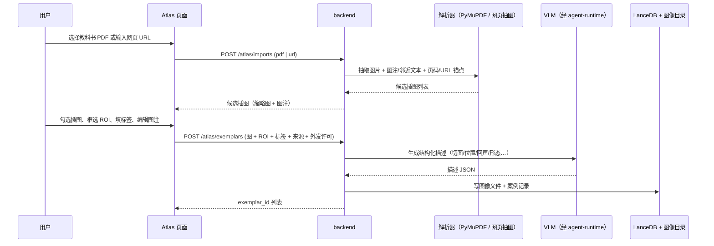
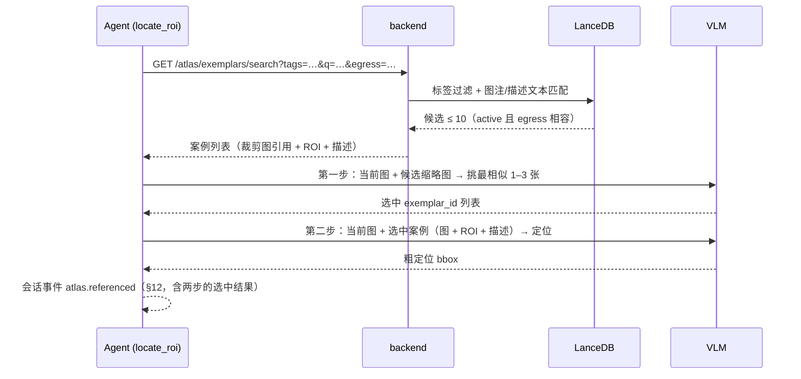
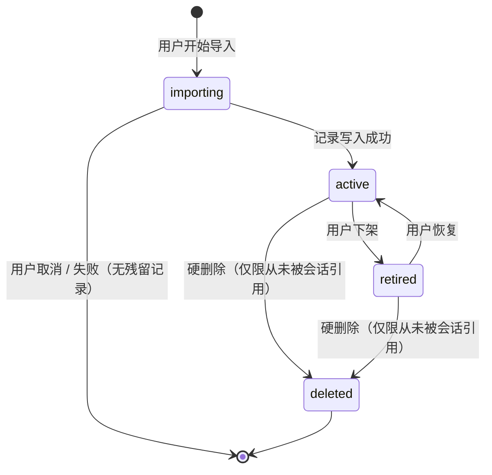

# Atlas · 图谱（人工策展的图文案例库）

## 0. 状态

| 项 | 值 |
| --- | --- |
| SDD 状态 | `ready` |
| 创建日期 | 2026-08-16 |
| 最近更新 | 2026-08-16 |
| 目标阶段 | 第一阶段：人工导入的图谱 + agent 检索先验（VLM 两步 few-shot） |
| 首个场景 | **膜性肾病 EDD（电子致密物）TEM 图谱**——肾脏超微病理，透射电镜图像 |
| 上位 SDD | [Glaux SDD 索引](../../README.md) |
| 依据 | [图像标注案例库技术调研](../../../researches/20260816-01-tech-annotation-exemplar-store.zh-CN.md)（决策 D-1～D-10） |

进入 `ready` 的依据：心智模型（"一本带插画的教科书"）、数据来源（教科书 PDF / 网页 / 标注数据集）、
存储（LanceDB 在 backend、原图与标记分存）、检索链（标签过滤 → 候选 ≤ 10 → VLM 先挑
1–3 张再定位）、下架机制、页面位置、首个场景与外发许可（勾选确认制）均已拍板（§16 D-1～D-17），
§17 开放问题为零。实现计划见 [2026-08-16-001-feat-atlas-plan](../../../plans/2026-08-16-001-feat-atlas-plan.md)。

## 1. 负责人

| 角色 | 负责人 |
| --- | --- |
| 产品与范围 | Glaux 项目维护者 |
| 后端（存储、导入、检索 REST） | Glaux backend 维护者 |
| 前端（Atlas 页面、导入交互） | Glaux 前端维护者 |
| Agent Runtime（检索先验接入） | Glaux Agent Runtime 维护者 |
| 验收 | Glaux 项目维护者 |

## 2. 非目标

本阶段明确不包含：

- **在线自动沉淀**：不从 agent 标注闭环（[02](../02-agent-image-annotation/README.md) 的
  `annotation.resolved`）自动入库；不区分正负样本；不做撤回/过期机制（决策 D-6）。
- 视觉 embedding / 向量检索（BiomedCLIP、DINOv2）；仅当单桶候选超百张时另议（决策 D-7）。
- 受控词表、标签同义合并、本体对齐（决策 D-10）。
- 自部署 SAM2 与 memory 注入（阶段二；依赖 02 的 D-3 修订）。
- 多人协作、权限、云端同步、案例分享/导出为数据集。
- 教科书 PDF 的通用文档问答（那是文档 RAG，不是图谱）。
- 修改 02 的三个工具契约；本 SDD 只向 `locate_roi` 提供可选先验输入。
- 扫描版 PDF 的 OCR / 版面分析（决策 D-8）；像素掩膜（labelmap / NIfTI / RLE）导入（决策 D-15）。
- 改变 Glaux 主线楔子（science-core 的颈动脉超声分割不受影响）；本 SDD 的 TEM 场景只是图谱
  的首个内容场景。

## 3. 当前目标

让 Glaux 拥有一本"可查阅的图谱"：用户把教科书插图、网页图片与标注数据集样本人工导入为
标准案例，agent 在定位目标前先"翻图谱"，用相似案例做 few-shot，举一反三。

首个场景（决策 D-12）：**膜性肾病的 EDD 电子致密物图谱**——透射电镜（TEM）下肾小球基底膜
上皮下电子致密物沉积的标准图例。选它的理由：范围极小（一种病、一种结构、一种成像）、维护者
熟悉、教科书/文献插图丰富、TEM 图是 2D 灰度图无需三维/多帧支持。

- 用户在 Atlas 页面导入教科书 PDF 或网页，挑选插图、框选 ROI、填标签，形成图文案例。
- 用户用脚本批量导入带多边形/检测框标注的数据集。
- 导入期由 VLM 为每张图生成结构化描述，运行期零模型依赖即可检索。
- agent 的 `locate_roi` 在定位前，先按标签与文本检索到 ≤ 10 条候选，再让 VLM 从中挑
  1–3 张最相似的作为 few-shot 定位当前图。
- 用户能看到 agent 引用了哪些案例，并可点开查看。

## 4. 输入

### 4.1 用户输入

| 输入 | 必填 | 说明 |
| --- | --- | --- |
| 教科书 PDF | 三选一 | 本地文件（文字版，非扫描版）；PyMuPDF 抽取嵌入图与邻近文本 |
| 网页 URL | 三选一 | 抽取页面内图片与其 alt / figcaption / 邻近段落；经出站守卫校验 |
| 标注数据集目录 | 三选一 | 图像 + 多边形/检测框标注文件（COCO / YOLO / LabelMe JSON）+ 元数据；经 CLI 导入 |
| ROI 框选 | 教科书/网页来源必填 | 用户在导入预览中框出目标结构；一图可多框 |
| 标签 | 是 | 模态 / 部位 / 目标结构 / 任务，自由填写，导入器联想已有标签 |
| 图注 / 说明 | 否 | 教科书图注默认带入，可编辑 |
| 来源信息 | 是 | 书名 / 版次 / 页码，或数据集名 / 许可证 |
| 外发许可 | 是 | `shareable`（可作 few-shot 外发给托管 VLM）/ `local-only`（仅本地使用）；缺省 `local-only`，改为 `shareable` 须勾选确认（D-16） |

### 4.2 系统输入

- 现有 VLM 连接配置（agent-runtime 探测与调用），用于导入期生成结构化描述。
- 现有影像查看器（cornerstone3D）用于导入预览与 ROI 框选。
- `GLAUX_DATA_ROOT` 数据目录约定（backend `config.py`），Atlas 图像存储位于其下独立子目录。

### 4.3 输入约束

- PDF / 网页解析只抽取图片与其图注/邻近文本，不入库正文全文；扫描版 PDF 不支持（无嵌入图则报 `NO_FIGURES_FOUND`）。
- 网页抓取走与 agent-runtime 一致的出站守卫规则（解析后 IP 判定 + 私网/fake-ip 拒绝），只抓 http(s)，不执行脚本。
- 标签自由填写，但归一（去首尾空白、全半角、大小写）后入库；不做同义合并。
- 外发许可缺省为 `local-only`；改为 `shareable` 须勾选"我确认有权将该图发往第三方模型服务"，勾选记录随案例保存（D-16）。

## 5. 输出

### 5.1 用户可见输出

- Atlas 页面：案例列表（按标签分组/筛选）、案例详情（原图 + ROI 叠加 + 图注 + VLM 描述 + 来源）、导入向导。
- 会话中：agent 引用案例时显示"参考图谱 N 条"卡片，可点开对应案例。

### 5.2 系统输出

- LanceDB 案例记录（§9）与独立存放的图像文件（原图 / 裁剪图）。
- backend REST（前缀 `/atlas`）：
  - `POST /imports/pdf`、`POST /imports/url` → 候选插图列表（不入库）；
  - `POST /exemplars`（批量创建）、`GET /exemplars`（列表+筛选）、`GET /exemplars/search`（检索，≤ 10）、`GET /exemplars/{id}`、`GET /exemplars/{id}/image|crop`（PNG）；
  - `POST /exemplars/{id}/retire|restore|describe`（下架 / 恢复 / 重试描述）、`DELETE /exemplars/{id}`；
  - `POST /exemplars/referenced`（runtime 回写"已被会话引用"，用于硬删除门禁）；`GET /tags`（标签频次，供联想）。
- agent-runtime 内部端点 `POST /agent-api/v1/atlas/describe`（backend 调用，生成 §7.6 描述）。
- runtime 模块（供 02 `locate_roi` 调用）：`AtlasClient.search()`、`selectExemplars()`（两步中的挑选步）、`atlas.referenced` 事件构造；`locate_roi` 的可选入参 `exemplar_hint` 即其产物。

### 5.3 输出保证

- 检索结果数量上限 10（可配置），仅返回与请求外发场景相容的案例（§7.4）。
- 案例只能经导入创建、经 Atlas 页面删除；agent 对图谱无写权限。
- 删除案例不影响已完成的会话记录（会话中只保留 `exemplar_id` 引用与快照缩略图）。

## 6. 核心流程

### 6.1 导入（教科书 PDF / 网页）

### 6.2 导入（标注数据集，CLI）

`glaux atlas import-dataset <dir> --format coco|yolo|labelme --tags ... --license ...`：逐样本读取图 + 多边形/检测框 → 多边形取外接框为 ROI、多边形本身存 `geometry` → 同 6.1 后半段（VLM 描述可批量、可跳过）。

### 6.3 检索与使用（两步 VLM）

候选为 0 时跳过两步、直接走无先验定位；候选 ≤ 3 时可跳过第一步直接作为 few-shot（实现期可配置）。

## 7. 核心规则

### 7.1 心智模型

图谱 = 一本人工编纂的、带插画的教科书。**策展过的标准样式**，不是使用日志。写入口只有导入；演进靠人工。

### 7.2 检索规则

1. 先按标签精确过滤（归一后相等）；无标签命中时退化为仅文本匹配。
2. 文本匹配对象：图注 + VLM 结构化描述 + 用户填写的说明；查询词来自 agent 的目标描述。
3. 结果按（命中标签数, 文本相关度）排序，截断为 ≤ 10。
4. 检索不调用任何模型，只返回 `active` 态案例；VLM 精看/挑选由 agent 侧完成（§6.3 两步）。

### 7.3 两种来源、两种读者

| 来源 | 携带几何 | 可喂给 |
| --- | --- | --- |
| 教科书插图 / 网页图片 | ROI 框（+ 可选多边形） | VLM few-shot |
| 标注数据集 | 多边形 + ROI 框 | VLM few-shot；阶段二 SAM2 memory（需多边形→掩膜栅格化） |

### 7.4 外发规则

- 案例图作为 few-shot 发往托管 VLM 属于数据外发，沿用 02 §7.4 的 `GLAUX_ANNOT_ALLOW_EGRESS` 门控。
- 在此之上按案例 `egress` 字段分级：仅 `shareable` 允许外发；`local-only` 案例只在本地 VLM/本地推理时可用，否则检索结果中直接排除并在会话中提示"N 条本地案例因外发限制未使用"。
- 缺省值与是否允许用户对教科书/网页来源改为 `shareable`：允许，须勾选确认（D-16）。

### 7.5 标签规则

- 自由填写；导入器提示已有标签（按使用频次）。
- 入库前归一：trim、全角转半角、大小写折叠；原文另存以便展示。

### 7.6 VLM 结构化描述模板

通用模板，不按模态分叉；固定字段 + 扩展字段：

| 字段 | 说明 |
| --- | --- |
| `modality` | 成像方式（如 TEM / 超声 / CT），模型判断 |
| `subject` | 图中主体结构（如 肾小球基底膜、上皮下区） |
| `findings` | 关键所见列表，每项 `{name, location, appearance}`（如 电子致密物 / 上皮下 / 均质高电子密度） |
| `pattern` | 整体分布/形态模式（如 弥漫、颗粒状、节段） |
| `summary` | 一句话概括，供文本检索 |
| `extra` | 键值对，模型自行提炼的其他关键字段（放大倍数、染色、伪影提示等） |

模板在导入期一次生成，允许用户在页面上修正；`summary` + `findings[].name` + `extra` 的值一并进入文本检索。

### 7.7 下架规则

- 案例可"下架"（`retired`）：保留记录与图像，不再出现在检索与默认列表中；历史会话引用仍可打开。
- 下架可恢复为 `active`；硬删除仅对从未被会话引用过的案例开放。

## 8. 涉及对象

| 对象 | 位置 | 说明 |
| --- | --- | --- |
| Atlas 页面（Workbench） | `frontend/src/components/atlas/`（新增）；`store/session.ts` 的 `View` 增加 `"atlas"`；ActivityBar 新增入口 | 左侧侧栏视图：列表 / 详情 / 导入向导 |
| Atlas 页面（Focus） | `frontend/src/components/focus/` 右侧拓展视图（参考 Codex 桌面端右侧面板的设计） | 同一组件在 Focus 模式下挂到右侧拓展区 |
| ROI 框选 | 复用 `CornerstoneViewer` 的矩形标注工具 | 导入预览中框选 |
| 案例存储 | `backend/app/atlas/`（新增）：LanceDB 表 + `GLAUX_DATA_ROOT/atlas/images/` | 原图与标记分存 |
| PDF 解析 | backend 依赖 PyMuPDF（`pymupdf`），主进程可用（IO 库，非重模型） | 抽嵌入图 + 同页邻近文本 |
| 网页解析 | backend：`httpx` + HTML 解析；出站守卫需在 Python 侧按 `agent-runtime/src/security/net-guard.ts` 规则重建（backend 的 `net_guard.py` 已在退役 orchestration P3 删除） | 抽 `` + alt / figcaption / 邻近段落 |
| VLM 描述生成 | agent-runtime 新增内部端点 `/agent-api/v1/atlas/describe`，backend 调用 | 复用现有 provider 连接 |
| REST | `backend/app/routers/atlas.py`（新增） | §5.2 端点 |
| 检索先验接入 | `agent-runtime/src/pi/tools/`（02 的 `locate_roi` 内部）| 调 search，拼 few-shot |
| 会话卡片 | `frontend/src/components/agent/` | "参考图谱 N 条" |
| CLI | `scripts/` 或 backend 模块入口 | 数据集批量导入 |

## 9. 数据或字段要求

案例记录（LanceDB 表 `exemplars`）：

| 字段 | 类型 | 必填 | 说明 |
| --- | --- | --- | --- |
| `exemplar_id` | string (uuid) | 是 | 主键 |
| `image_ref` | string | 是 | 原图文件相对路径（`atlas/images/...`） |
| `crop_ref` | string | 否 | ROI 裁剪图路径（教科书来源建议必有） |
| `roi` | bbox（图像像素坐标） | 是 | 目标框 |
| `geometry` | polygon（像素坐标点集） | 否 | 数据集来源的多边形；第一期不支持像素掩膜 |
| `tags` | string[] | 是 | 归一后标签 |
| `tags_raw` | string[] | 是 | 用户原文 |
| `caption` | string | 否 | 图注 / 说明 |
| `description` | JSON | 否 | VLM 结构化描述（§7.6 模板：固定字段 + `extra`） |
| `source_type` | enum | 是 | `textbook` / `web` / `dataset` |
| `source` | JSON | 是 | 书名/版次/页码，或 URL + 抓取时间，或数据集名/许可证 |
| `egress` | enum | 是 | `shareable` / `local-only` |
| `egress_consent` | JSON | `egress=shareable` 时必填 | `{confirmed_at, import_batch_id, statement_version}`：用户勾选"我确认有权将该图发往第三方模型服务"的记录（D-16） |
| `status` | enum | 是 | `active` / `retired`（§11） |
| `describe_status` | enum | 是 | `done` / `pending`（VLM 描述失败待重试）/ `skipped`（CLI 跳过） |
| `image_sha256` | string | 是 | 原图内容哈希（幂等键组成部分，§10） |
| `created_at` | datetime | 是 | 导入时间 |
| `import_batch_id` | string | 是 | 同一次导入的批次号（幂等与批量下架） |

一图多标记：同一 `image_ref` 可对应多条记录（不同 `roi`/`tags`）。

引用记录（表 `exemplar_refs`）：`exemplar_id`、`trace_id`、`referenced_at`；由 runtime 经 `POST /atlas/exemplars/referenced` 写入，硬删除前查询是否存在（§7.7）。

前端状态：`FocusLayout` 新增 `rightView: "stage" | "atlas"`（默认 `stage`，损坏回退 `stage`），决定 Focus 右侧拓展区渲染舞台还是图谱（D-14）。

## 10. 幂等规则

- 导入幂等键：`(source_type, source, image_sha256, roi)`；重复导入相同项返回已有 `exemplar_id`，不新建。
- CLI 批量导入可重跑；同一 `import_batch_id` 重跑只补缺不重复。
- 检索为只读，无幂等问题。

## 11. 状态或生命周期规则

- 案例无"建议态"，写入即 `active`。
- `retired` 不参与检索与默认列表，历史会话引用仍可打开；可恢复。
- 硬删除仅对从未被 `atlas.referenced` 引用过的案例开放；被引用过的只能下架。
- 与会话生命周期解耦：删会话不动案例，下架/删除案例不改会话。

## 12. 审计或事件规则

| 事件 | 触发时机 | payload 要点 |
| --- | --- | --- |
| `atlas.import.completed` | 一次导入批次结束 | batch_id、条数、source_type、trace_id |
| `atlas.referenced` | agent 在一次 `locate_roi` 中使用了案例 | 候选 exemplar_id 列表、VLM 选中的 1–3 条、被外发限制排除的条数、trace_id |
| `atlas.exemplar.retired` / `.restored` | 用户下架 / 恢复 | exemplar_id、trace_id |
| `atlas.exemplar.deleted` | 用户硬删除 | exemplar_id、trace_id |

审计：每次案例图外发（作为 few-shot 发往托管 VLM）记录 exemplar_id、目标 host、trace_id；不记录图像内容。

## 13. 异常和人工处理

| 失败类别 | 错误码（示意） | 用户感知 | 处理 |
| --- | --- | --- | --- |
| PDF 无可抽插图（含扫描版） | `NO_FIGURES_FOUND` | 提示"未识别到嵌入图，可手动截图导入" | 引导手动上传图片 |
| 网页 URL 被出站守卫拒绝 / 抓取失败 | `FETCH_BLOCKED` / `FETCH_FAILED` | 提示地址不允许或不可达 | 用户改地址或手动上传 |
| VLM 描述生成失败 | `DESCRIBE_FAILED` | 案例仍入库，描述为空并标记"待补描述" | 页面可重试生成 |
| 检索无结果 | 非错误 | agent 正常走无先验路径，会话中不提示或轻提示 | — |
| 案例被外发限制排除 | 非错误 | 会话卡片提示"N 条本地案例未使用" | 用户可切本地模型 |
| 存储写入失败 | `ATLAS_WRITE_FAILED` | 明确报错，批次回滚 | 带 trace_id 排查 |

## 14. 与其他 SDD 的调用关系

- 被 [02-agent-image-annotation](../02-agent-image-annotation/README.md) 的 `locate_roi` 调用（可选先验）；02 不依赖 03 即可 `ready`。
- 依赖 [00-reference-agent-conversations](../00-reference-agent-conversations/README.md) 的会话与 SSE 通道（会话卡片、事件）。
- 依赖 [01-dual-mode-shell](../01-dual-mode-shell/README.md) 的外壳：Atlas 为 Workbench 模式下的侧栏视图。
- 依赖 agent-runtime 现有 VLM 连接与出站守卫（导入期描述生成、few-shot 外发）。
- 阶段二与 02 的 D-3 修订（SAM2 自部署）联动。

## 15. 验收标准

- [ ] 导入一份含嵌入图的文字版 PDF，Atlas 页面出现候选插图与邻近文本；勾选、框 ROI、填标签后，案例出现在列表中，`source_type = textbook`。
- [ ] 导入一个扫描版 PDF，返回 `NO_FIGURES_FOUND` 并提示手动上传，无残留记录。
- [ ] 输入一个公网网页 URL，页面内图片与 alt/figcaption 出现在候选列表；输入私网/fake-ip 地址返回 `FETCH_BLOCKED`，无对外请求。
- [ ] 用 CLI 导入一个 COCO 多边形标注目录，`geometry` 为多边形、`roi` 为其外接框；重跑同一命令不产生重复记录。
- [ ] 同一图重复导入相同 ROI，返回同一 `exemplar_id`。
- [ ] 标签"电子致密物"与"电子致密物 "（尾空格）/ 全角输入检索结果一致。
- [ ] `search` 请求 `egress=shareable` 时结果不含任何 `local-only` 案例；不含任何 `retired` 案例。
- [ ] `locate_roi` 在图谱中有 ≥ 4 条匹配候选时，先出现一次 VLM 挑选调用（返回 1–3 个 exemplar_id），再出现一次带这些案例的定位调用；会话中出现"参考图谱 N 条"卡片，可点开对应案例。
- [ ] `locate_roi` 在图谱无匹配时行为与无 Atlas 时一致，无额外 VLM 调用与错误。
- [ ] 外发开关关闭时，任何案例都不发往外部 VLM，卡片提示被排除数量。
- [ ] 下架案例后，它不再出现在检索与默认列表，引用它的历史会话卡片仍可打开；恢复后重新可检索。
- [ ] 对被会话引用过的案例执行硬删除被拒绝；从未引用过的可硬删除。
- [ ] VLM 描述生成失败时案例仍入库，页面显示"待补描述"并可重试；成功时 `description` 含 §7.6 全部固定字段且 `extra` 为对象。
- [ ] 检索链路不加载任何本地模型（backend 进程无 torch 导入）。

## 16. 决策记录

| 编号 | 决策 | 备选 | 选择理由 | 时间 |
| --- | --- | --- | --- | --- |
| D-1 | 图谱由人工策展、批量导入、人工演进；不做在线自动沉淀 | 从 02 的裁决回执自动入库 | 解耦 02、砍掉撤回/过期/正负例复杂度；"教科书不是日志" | 2026-08-16 |
| D-2 | 用 VLM 视觉理解替代视觉向量：导入期生成描述，运行期标签+文本检索 | BiomedCLIP/DINOv2 embedding | 零运行期模型依赖；桶内候选量小时 VLM 精看足够 | 2026-08-16 |
| D-3 | LanceDB 在 Python backend 侧，原图与标记分存 | sqlite-vec；agent-runtime 直连 | 一表存几何/元数据/未来向量；与 science-core 入口接法一致 | 2026-08-16 |
| D-4 | 检索单元 = ROI 裁剪 + 部位标签 | 整图 | 教科书一图多结构；few-shot 更聚焦 | 2026-08-16 |
| D-5 | 产品形态为 Glaux 内页面，命名 Atlas / 图谱 | CLI-only；"知识库" | 医学"图谱"即带插画参考书；避开文档问答联想 | 2026-08-16 |
| D-6 | 标签自由填写，不设受控词表 | 定死词表 | 教科书目录即天然词表，先跑通再看发散程度 | 2026-08-16 |
| D-7 | 按案例 `egress` 字段分级外发（`shareable` / `local-only`），叠加在全局开关之上 | 统一走全局开关 | 版权内容不得随 few-shot 外发；缺省与改写规则见 D-16 | 2026-08-16 |
| D-8 | PDF 解析用 PyMuPDF 抽嵌入图 + 邻近文本；不支持扫描版 | RAGFlow / MinerU 类版面解析器 | 轻量、主进程可用；扫描版 OCR 收益低 | 2026-08-16 |
| D-9 | 首版支持网页导入（图 + alt/figcaption/邻近段落） | 仅 PDF | 文献/教学网页是 TEM 图例的重要来源 | 2026-08-16 |
| D-10 | VLM 描述模板通用、不按模态分叉：固定字段 + `extra` 扩展字段，模型自行提炼 | 按模态分模板 | 跨模态一致的检索文本；扩展字段吸收领域差异 | 2026-08-16 |
| D-11 | 两步 VLM：先从候选挑 1–3 张，再带选中案例定位 | 候选直接多图 few-shot | 降低多图 few-shot 的噪声与 token；对 provider 多图能力要求更低 | 2026-08-16 |
| D-12 | 首个内容场景 = 膜性肾病 EDD TEM 图谱 | 颈动脉超声 | 场景极小、维护者熟悉、教科书图例丰富、2D 灰度图；不改 science-core 主线楔子 | 2026-08-16 |
| D-13 | 下架机制：`retired` 保留记录不参与检索；被引用过的案例只能下架不能硬删 | 仅硬删除 | 保护历史会话引用；图谱是可修订的教材 | 2026-08-16 |
| D-14 | 页面位置：Workbench 左侧侧栏视图；Focus 右侧拓展视图（参考 Codex 桌面端） | 编辑区独立标签页 | 与现有双模式外壳布局一致 | 2026-08-16 |
| D-15 | 数据集几何第一期只支持多边形与检测框（COCO / YOLO / LabelMe） | 像素掩膜 / NIfTI / RLE | 对齐通用 CV 标注场景；掩膜留给阶段二 SAM2 路径 | 2026-08-16 |

| D-16 | 外发许可：缺省 `local-only`；导入时可逐条/逐批改为 `shareable`，但必须勾选确认"我确认有权将该图发往第三方模型服务"，勾选记录（时间、批次）随案例保存 | 强制 `local-only` 仅本地 VLM；按网页许可证自动判定 | TEM 首场景种子几乎全来自教科书/网页，强制 local-only 会让托管 VLM 下图谱无案例可用；责任交给用户显式承担 | 2026-08-16 |
| D-17 | 价值验证方式：固定 10 张自有 TEM 图，比较有/无图谱时 VLM 定位 bbox 与人工框的 IoU；种子规模不预设，以此度量迭代 | 预设种子条数 | 无法先验知道多少图例够用 | 2026-08-16 |

## 17. 待确认问题

无。历史问题已全部转入 §16（Q1 → D-16，Q2 → D-17）。
