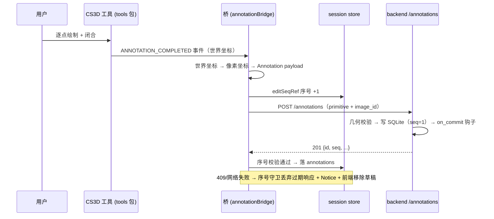
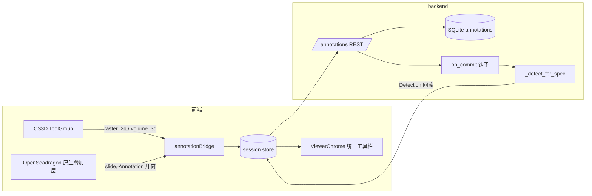
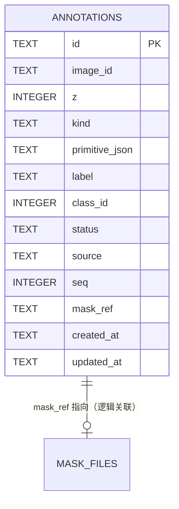
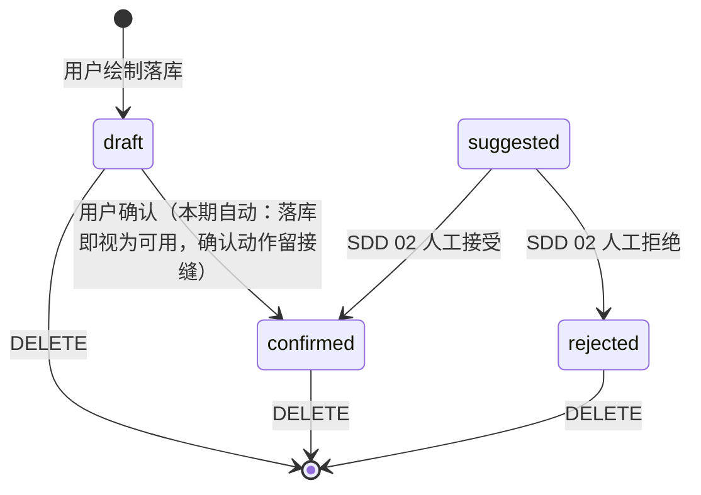

# 统一图像标注工具箱（Unified Annotation Toolbox）

## 0. 文档状态

| 字段 | 内容 |
| --- | --- |
| 状态 | `implemented` |
| 当前阶段 | 代码完成并与 SDD 对齐；浏览器走查验收待补（自动化浏览器渲染进程冻结，人工恢复后按 §15 逐项过） |
| 上位 SDD | [Glaux SDD 索引](../../README.md) |
| 承接需求 | [脑暴 20260816-02 · 统一图像标注工具箱](../../../brainstorms/20260816-02-unified-annotation-toolbox.zh-CN.md)（D-1～D-7 已拍板） |
| 负责人 | Glaux 项目维护者 |
| 最后更新 | 2026-09-24 |

## 1. 本 SDD 负责什么

跨模态统一的人工标注能力：**bbox / polygon / brush** 三个通用标注工具在全部查看器引擎（`raster_2d` / `volume_3d` 逐切片 / `wsi`）上的绘制、编辑、持久化与任务联动，以及承载它们的**统一工具框架**（工具语义进 store、工具声明进注册表、工具栏走统一 chrome）。标注产物是独立于任务模型结果（Detection）的一等实体 `Annotation`。

## 2. 本 SDD 不负责什么

| 相邻能力 | 归属 |
| --- | --- |
| agent 自然语言 → 建议态标注的产出流（`locate_roi` / `segment_region` / `propose_annotation`、SAM API、权限门控） | [SDD 02 · 智能体图像标注](../02-agent-image-annotation/README.md)（`implemented`）；其建议态（`suggested`）经人工确认转为 `confirmed` 后，即本 SDD 的正式标注实体 |
| 任务模型结果的生成与测量（`/task/run`、`/task/measure`、Detection 管线） | 任务注册表现有契约，本 SDD 零改动 |
| CT labelmap 编辑端点本身（`POST /objects/{id}/edits` + base_seq，旧路径 `POST /volume/{id}/mask-edit` 为其 alias） | 归 SDD 10，本 SDD 只换前端交互层 |
| 点标注（point）手动编辑、WSI brush、3D 跨切片传播、标注导出（COCO/LabelMe）、多人协作审阅 | 非目标（脑暴 §10）；`point` 只作为存储取值开放（§9.1），不提供人工工具、不设能力位 |
| 标注与 Atlas 的联动（已验证标注沉淀为案例） | 远期；本期仅以 `source` / `status` 字段留接缝 |

## 3. 当前阶段目标

一期交付：

1. 前端三个查看器的 bbox / polygon（`volume_3d` 另含 brush）可绘制、可编辑、刷新后仍在（后端持久化）；
2. 全部标注 UI 走统一工具栏与 chrome（主题 CSS + i18n），查看器内无残留私有浮动工具条；
3. 现有任务专属工具统一替换为通用工具（IMT 手柄 / WSI ROI / CT 私有画笔），测量与任务行为不回退；
4. 后端 `annotations` REST + SQLite 存储 + `on_commit` 任务联动钩子。

## 4. 输入来源

| 输入 | 必填 | 说明 |
| --- | --- | --- |
| 用户画布交互 | 是 | CS3D 工具事件（image / volume）或 OpenSeadragon 原生叠加层事件（slide）产出的几何 |
| 当前对象上下文 | 是 | `image_id`（经 `resolve_object` 可解析的对象 id）+ 可选 `index`（第三轴索引，`volume`=z / `video`=t / `slide`=level；`z` 为一版 API 别名） |
| 注册表 | 是 | `GET /tasks` 下发的引擎能力位与 `on_commit` 钩子声明 |
| `base_seq` | 更新/删除必填 | 乐观并发序号，取最近一次成功响应的 `seq` |

输入约束：几何坐标为对应对象的像素坐标（WSI 为 level-0 px），不得越出图像 dims（后端校验）。

## 5. 输出结果

- REST 响应：创建/更新返回完整 `Annotation`（含服务端 `id` / `seq`）；
- 前端 store：`annotations` 列表 + `tool` / `toolOptions` 状态；
- 任务联动副作用：`on_commit` 钩子派发的 Detection 更新（如 WSI 框完跑核检测），经既有回流通道呈现；
- 错误：领域错误码 → HTTP 映射（§13），前端以 Notice 胶囊提示。

不产生服务端事件流（SSE）；agent 对标注的感知留待 SDD 02（其事件契约在该 SDD §12）。

## 6. 核心流程

### 6.1 标注创建（以 raster_2d polygon 为例）



### 6.2 三引擎交互管线



三个引擎的 `polygon` 都是逐点点击、显示圆形顶点，至少三个顶点后点击首点闭合。`FrameStackViewer` 的 image / volume 分支使用 CS3D `SplineROITool` 的 `LINEAR` 类型，保存 `data.handles.points` 中的控制点，不保存插值轮廓；已存标注从同一点列重建。WSI 使用 SVG 叠加层，双击末点或 Enter 也可完成，Escape 取消草稿；闭合命中与重复末点过滤使用屏幕像素距离，持久化几何始终为 level-0 坐标，点列不重复首点。`cursor` 工具拖动 WSI 已保存顶点时，编辑预览保留至 `PATCH /annotations` 返回；失败恢复旧几何并提示，刷新时从服务端重载。

### 6.3 任务工具替换映射

| 现有 | 替换为 | 行为保持 |
| --- | --- | --- |
| IMT `editli/editma` 高斯手柄 | CS3D 自定义 BaseTool（D-12/D-17） | 拖手柄形变壁线不变；入口是独立的 `wall` 按钮（不再占用 `polygon`） |
| WSI `roi` 框选 | 通用 `bbox` | 框落库为标注 + `on_commit` 触发核检测（双语义） |
| CT 私有画笔 | 通用 `brush`（CS3D） | 提交走任务结果编辑端点（§7.4） |

## 7. 核心规则

### 7.1 工具集合与声明

- 统一 `Tool` 集合：`cursor / bbox / polygon / brush / reset`，外加任务专属编辑工具 `wall`（IMT 壁线形变，D-17）；`TaskPlugin.tools[]` 可携带 `key` 供 SDD 05 的快捷键与速查面板共用；store 的 `toolOptions`（`brush: {mode, class_id, radius}`、`voi: {ww, wl}`）随 `switchModality` 复位；
- 工具选项条由 `CHROME_SEGMENTS` 按 `TaskView.capabilities` 装配，`brush` 与 `voi` 段由 Workbench 和 Focus 共用。
- `TaskPlugin` 新增引擎级能力声明：`raster_2d` 支持 cursor/bbox/polygon/brush（IMT 另有 `wall`）；`volume_3d` 同左 + `{z_scroll, voi}`；`wsi` 支持 cursor/bbox/polygon（brush 无服务端落点，禁用）；
- **通用工具的语义不因模态而变**：`polygon` 在任何模态都是自由多边形（落 `/annotations`）。任务专属编辑另立工具位，通过能力位限定可见范围——把专属交互塞进通用按钮会让该按钮在那个模态下"画不出东西"，且在前置产物缺失时静默失效；
- 工具栏显示 = 引擎能力 ∩ 任务推荐；StatusBar 工具展示从注册表取，禁止硬编码表；
- `reset` 只重跑活动模型（影响 Detection），不清标注。

### 7.2 标注与模型结果的边界

- 跑模型产物（LI/MA 壁线、颅骨椭圆、labelmap、核质心）归 Detection 管线渲染，**不进** annotations 表；
- 用户绘制/编辑的产物一律先成 `draft` 标注落库，不打断操作流；
- **任务绑定几何例外**：直接参与任务测量的模型产物（IMT 的 LI/MA 壁线）的编辑仍走既有 `/task` 编辑端点（需同步重算测量），不走 `/annotations`——其交互换成统一框架的通用折线编辑（D-12），但数据归属仍是 Detection；自由标注（与测量无关的额外 polygon/bbox）才落 annotations；
- "模型结果转标注"本期不做（留接缝）。

### 7.3 on_commit 钩子

- 声明于 `TaskPlugin`（如 WSI：`on_commit={"bbox": {"action": "run_task"}}`），后端在标注创建成功后派发，复用 `kernel.run_task`（含 SDD 10 的公共前缀）；
- 钩子失败不影响标注落库（标注已 201），失败走 Notice 提示（§13）。

### 7.4 CT brush 例外

画笔写契约由 [SDD 10](../10-object-convergence/README.md) 承载（其 §7 规则 17、D-6），本节只引用。

- CT labelmap 是任务结果而非标注，画笔编辑**不走** `/annotations`，走任务结果编辑端点 `POST /objects/{id}/edits`（`EditRequest{task, method, base_seq, ops}`，`base_seq` 乐观并发，冲突 409），由 `Detector.apply_edit` 派发并按注册表重测。
- 旧端点 `POST /volume/{id}/mask-edit` 是其 alias（同一实现、同一响应）；前端已在 SDD 10 W4 切到新端点，alias 于 W7 删除。
- 前端两条提交路径经注入的 `MaskSink` 区分：`annotationMaskSink`（2D 画笔 → `/annotations` kind=mask）与 `editMaskSink`（任务结果编辑 → `/objects/{id}/edits`），二者不合并；`task` / `method` 取自当前 `TaskView`，不写常量。
- `/annotations` 在 CT 下承载的是逐切片 bbox/polygon 标注。画笔宿主实施期为 overlay 自持笔迹缓冲（D-15）。

## 8. 涉及对象

| 对象 | 位置 | 说明 |
| --- | --- | --- |
| `Annotation` 契约 | `science-core/glaux_core/contracts.py` + `frontend/src/api/types.ts` 镜像 | 新增实体；`bbox` 原语新增、`mask` 原语落地 |
| annotations 存储 | backend `<ANNOTATIONS_ROOT>/annotations.sqlite` + `masks/` 目录 | 新模块 `app/annotations/`（store + router） |
| annotationBridge | `frontend/src/annotation/` | CS3D 事件 ↔ Annotation 契约 ↔ API 的桥；收敛 editSeqRef/回滚范式 |
| ViewerChrome | `frontend/src/components/` | 统一工具栏 / 选项条 / 信息条（主题 CSS + i18n） |
| TaskPlugin | `science-core/glaux_core/tasks.py` | 引擎能力位 + `on_commit` 声明；`plugin_to_view` 同步下发 |
| IMT 形变手柄工具 | `frontend/src/viewer/`（CS3D 自定义 BaseTool） | 领域特化，扩展 tools 框架 |

存储关系（`mask_ref` 为文件路径引用，逻辑关联，非外键）：



## 9. 数据或字段要求

### 9.1 `annotations` 表（SQLite，数据字典）

| 字段 | 类型 | 可空 | 默认值 | 键/约束 | 索引 | 用途 | 数据来源 |
| --- | --- | --- | --- | --- | --- | --- | --- |
| `id` | TEXT | 否 | — | PK | — | 标注唯一 id（uuid4） | 服务端生成 |
| `image_id` | TEXT | 否 | — | 逻辑关联至数据源对象 | `idx_annotations_image(image_id, z)` | 挂靠对象（图/卷/切片 id） | 前端上下文 |
| `z` | INTEGER | 是 | NULL | — | 同上 | 对象当前第三轴取值：`volume`=z / `video`=t / `slide`=level；未绑定索引（含全部 2D 对象）为 NULL | `index` 或别名 `z` |
| `kind` | TEXT | 否 | — | CHECK(kind IN ('bbox','polyline','mask','point'))，取值由 `store.py` 的 `_KINDS` 生成 | — | 原语判别；`point` 仅为 `point_set` 原语与 agent 产出预留 | payload |
| `primitive_json` | TEXT | 否 | — | — | — | 几何原语 JSON（§9.2） | payload |
| `label` | TEXT | 否 | `''` | — | — | 语义标签（双语取 i18n 键或自由文本） | 用户 |
| `class_id` | INTEGER | 是 | NULL | — | — | 可选类别（颜色走 ClassSpec） | 用户 |
| `status` | TEXT | 否 | `'draft'` | CHECK(status IN ('draft','confirmed','suggested','rejected')) | — | 生命周期态（§11） | 服务端 |
| `source` | TEXT | 否 | `'manual'` | CHECK(source IN ('manual','model','agent')) | — | 产出方（SDD 02 接缝） | 服务端 |
| `seq` | INTEGER | 否 | `1` | — | — | 乐观并发序号 | 服务端递增 |
| `mask_ref` | TEXT | 是 | NULL | 逻辑关联至 `masks/` 文件 | — | kind='mask' 时的 PNG 相对路径 | 服务端落盘 |
| `created_at` | TEXT | 否 | — | — | — | ISO8601 | 服务端 |
| `updated_at` | TEXT | 否 | — | — | — | ISO8601 | 服务端 |

`status` / `source` 的 CHECK 同样由 `_STATUSES` / `_SOURCES` 生成，DDL 不另写取值。

库结构版本：`PRAGMA user_version = 1`（`store.py` 的 `SCHEMA_VERSION`）。打开库时按版本处理：

| `user_version` | 处理 |
| --- | --- |
| 无 `annotations` 表 | 按当前结构建表与索引，置 `1` |
| `0`（kind 三值 CHECK 的首版库） | 单个事务内：建新表 → `INSERT INTO ... SELECT` 搬全部行 → 删旧表 → 新表改名 → 重建 `idx_annotations_image` → 置 `1`；不新增列、不回填 `z` |
| `1` | 不做任何事 |
| 大于 `1` | 拒绝打开 |

迁移任一步失败整体回滚并抛错，服务拒绝启动，原库保持 `user_version = 0` 与原数据，不做部分迁移（SDD 10 §9.5、§13）。

mask 文件存 `<ANNOTATIONS_ROOT>/masks/<id>.png`，删除标注时同步删文件。

### 9.2 `Annotation` JSON 契约（前后端镜像）

```
{
  id, image_id,
  index: {z} | {t} | {level} | {},   // 响应必带；请求可选
  z?,                                // index 的 API 别名，W7 删
  primitive: {kind:"bbox", x0,y0,x1,y1}
           | {kind:"polyline", closed:true, points:[[x,y],...], role}
           | {kind:"mask", ref}
           | {kind:"point", x, y},     // 仅存储域，无人工工具
  label, class_id?,
  status: "draft"|"confirmed"|"suggested"|"rejected",
  source: "manual"|"model"|"agent",
  seq
}
```

`bbox` 原语同步加入 science-core `contracts.py` 的 Primitive 联合与 `primitive_to_dict`。

`index` 与 `z` 的规则（`POST /annotations`）：

- `index` 至多一个轴非空；`index` 与 `z` 同传时取值须相等；违反任一条 → 422 `INVALID_GEOMETRY`；
- 只传 `z` 时按对象的第三轴解释（`volume`=z / `video`=t / `slide`=level）；
- 存储列 `z` 取 `index` 的唯一非空值，否则取 `z`；两者皆空则为 NULL，不做索引校验；
- 非空时经 `resolve_object` + `ObjectMeta.check_index` 校验：越界或对象无此轴（如 2D 对象传 `z`）→ 422 `INVALID_GEOMETRY`；
- 响应的 `z` 为存储列原值；`index` 以对象第三轴命名该值，列为 NULL 时为 `{}`；对象已无法解析时回落为 `{z: v}`。

`GET /annotations` 的过滤参数：`z`（第三轴精确匹配）、`index_from` / `index_to`（闭区间，整数 ≥ 0，可单独使用，`index_from > index_to` → 422）。区间过滤在 SQL 中执行，不返回 `z` 为 NULL 的行。

## 10. 幂等规则

- 幂等键为 `id`（服务端生成）；`POST` 每次产生新标注，不做客户端去重（绘制交互每次闭合即新意图）；
- `PATCH` / `DELETE` 必带 `base_seq`：`base_seq != 当前 seq` → `409 CONFLICT`，不产生任何写；
- 前端并发守卫沿用 editSeqRef 序号范式：过期响应（含过期的 409 回滚）一律丢弃；
- `on_commit` 钩子重复派发以 Detection 管线既有幂等性为准（重跑覆盖），不重复落标注。

## 11. 状态或生命周期规则



- `draft`：人工绘制产物的默认态，参与渲染，不参与任务测量；
- `confirmed`：本期人工标注落库后前端即按可用处理；显式"确认"动作不做 UI，态值预留；
- `suggested` / `rejected`：仅由 SDD 02 流程写入，本 SDD 的实现保证其可存储、可渲染区分（虚线/半透明），不实现其转换入口；
- `reset`（重跑模型）不触碰任何标注。

## 12. 审计或事件规则

- 本 SDD 不产生服务端事件流（无 SSE）；标注变更的可追溯性由 `source` + `updated_at` + `seq` 承担；
- agent 通道的标注事件（`annotation.suggested` 等）属 SDD 02 §12，本 SDD 只保证其落地实体兼容；
- 前端 Notice（info/crit）不算事件，提示文案走 i18n。

## 13. 异常和人工处理

| 失败类别 | 错误码 | HTTP | 用户感知 | 处理 |
| --- | --- | --- | --- | --- |
| 标注不存在 | `NOT_FOUND` | 404 | Notice 提示并刷新列表 | 前端移除本地副本 |
| 并发冲突 | `CONFLICT` | 409 | "标注已被更新，请重试" | 丢弃本次编辑，重拉最新 |
| 几何非法（越界/点数不足/自交多边形面积为零） | `INVALID_GEOMETRY` | 422 | Notice 指明原因 | 前端移除草稿 |
| `index` 非法（越界、对象无此轴、多轴、与 `z` 不一致） | `INVALID_GEOMETRY` | 422 | Notice 指明轴名与合法范围 | 前端移除草稿 |
| 标注库迁移失败 | — | 服务不启动 | 后端启动报错 | 事务回滚，原库保持 `user_version = 0`（§9.1） |
| on_commit 钩子失败 | — | 标注仍 201 | Notice：标注已保存，检测未触发 | 用户可 reset 或重新框选 |
| 网络失败 | — | — | Notice + 回滚 | editSeqRef 守卫，不静默 |

前端空状态：无标注时画布照常显示 Detection 结果，不额外提示；工具未启用引擎能力时工具栏不出现该按钮（不置灰）。

## 14. 与其他 SDD 的调用关系

- **[02-agent-image-annotation](../02-agent-image-annotation/README.md)**（被依赖）：其 §11 "`confirmed` 后归影像标注既有逻辑"由本 SDD 承接——`propose_annotation` 落库走本 SDD `POST /annotations`（`status=suggested, source=agent`），接受/拒绝即 PATCH status。本 SDD 先行实现，SDD 02 已据本契约把其 §17-Q3/Q4 收敛为 D-9。
- **[01-dual-mode-shell](../01-dual-mode-shell/README.md)**：ViewerChrome 落入 Workbench 编辑区既有布局，不改外壳结构。
- **[03-atlas](../03-atlas/README.md)**：无直接调用；远期"已验证标注沉淀案例"另立需求。
- 各 SDD 的当前状态见 [SDD 索引](../../README.md)。
- 依赖任务注册表（`GET /tasks`）现有下发通道扩展字段（能力位 / on_commit），不构成新 SDD。

## 15. 验收标准

- [ ] 三个引擎上 bbox / polygon（`volume_3d` 另含 brush）可绘制、可编辑（移动/缩放/顶点增删），刷新页面后标注仍在（读自 `GET /annotations`）。
- [ ] 全部标注工具 UI 走统一工具栏：查看器组件内无内联样式浮动工具条、无硬编码中文工具文案（i18n 双语可切换验证）。
- [ ] CT 模态 `store.tool === "brush"` 生效（共享工具栏画笔按钮可用），`FrameStackViewer` 的 CT 分支走 `editMaskSink`；StatusBar 工具显示随注册表，`TOOL_LABEL` 硬编码表删除。
- [ ] WSI 用 bbox 框选：框落库为标注且触发核检测（`on_commit`），检测行为（计数/密度）与旧 ROI 工具一致；框选过小（<24px）仍提示不触发。
- [ ] WSI 多边形逐点显示圆形顶点，点击首点、双击末点或 Enter 完成后只保存不重复的 level-0 点列；`cursor` 下拖动顶点，保存期间不回跳，刷新后与底图对齐。
- [ ] image / volume 的 `polygon` 与 WSI 一样逐点显示圆形顶点、点击首点闭合；保存的点列仅含点击的控制点，刷新后可拖动顶点且与原图对齐。
- [ ] IMT 壁线编辑经统一框架完成，`/task/measure` 输出与替换前一致（同一图像同一形变的 IMT_mean 偏差 ≤ 1e-6 mm）。
- [ ] IMT 模态下 `polygon` 画的是自由多边形并落 `/annotations`；壁线形变在独立的 `wall` 按钮下（D-17），两者互不遮蔽。
- [ ] `PATCH` 携带过期 `base_seq` 时返回 409 且不落写；前端收到 409 时 Notice 提示并丢弃过期响应，不覆盖最新态。
- [ ] `POST` 几何越出图像 dims 时返回 422 `INVALID_GEOMETRY`，前端草稿被移除。
- [ ] `switchModality` 后 `tool` 回 `cursor`、`toolOptions` 复位，无跨模态状态泄漏（连续切换三模态后各工具行为正常）。
- [ ] 标注读写回流范式仅一份实现（annotationBridge）；任务绑定编辑（IMT 壁线测量 / CT 对象编辑）属 Detection 链路，各自领域内单一 seq 守卫（wallSeq / editMaskSink），三查看器无标注回流复制代码。
- [ ] `on_commit` 钩子失败时标注仍成功落库（201），用户收到"标注已保存、检测未触发"提示。
- [ ] 2D brush 产物落库为 `kind='mask'`，`masks/<id>.png` 存在且重新加载后叠加渲染一致。

## 16. 决策记录

承接脑暴 D-1～D-7（含后端持久化 / 全模态 / 统一替换 / 路线 A / 复用 `@cornerstonejs/tools` / Annotorious / SQLite），本 SDD 新增收敛决策：

| 编号 | 决策 | 备选 | 选择理由 | 时间 |
| --- | --- | --- | --- | --- |
| D-8 | ~~polygon 工具用 CS3D `PlanarFreehandROITool`~~ **已被 D-19 替代** | `SplineROITool`、自绘 | 当时偏向自由手绘；后续真实走查发现其拖拽手势与 WSI 逐点多边形不一致 | 2026-08-16 |
| D-9 | 2D brush 产物落 `/annotations`（kind=mask，PNG 传输）；宿主实现见 D-15（实施期从 CS3D segmentation 退化为自持缓冲） | 自持 mask 缓冲 | PNG 传输格式与 CT mask-edit 一致；宿主选型随 spike3 结果收敛 | 2026-08-16 |
| D-10 | ~~Annotorious W3C 格式在前端映射~~ **已被 D-18 替代** | 后端映射 | 后端只认一份 Annotation 契约 | 2026-08-16 |
| D-11 | `ANNOTATIONS_ROOT` 默认 `~/glaux_annotations`，环境变量 `GLAUX_ANNOTATIONS_ROOT` 覆盖 | 放数据集根下 | 对齐 `GLAUX_ATLAS_ROOT` 惯例（不污染数据集） | 2026-08-16 |
| D-12 | IMT 高斯形变手柄实现为 CS3D 自定义 BaseTool | 保留手写 overlay 交互 | 复用成熟框架而非平行实现 | 2026-08-16 |
| D-13 | CT brush 不走 `/annotations`，经 `editMaskSink` 调 `/objects/{id}/edits` | 统一到 annotations | labelmap 是任务结果而非标注；编辑语义不变 | 2026-08-16 |
| D-14 | IMT 壁线编辑仍走既有 `/task` 编辑端点（交互换通用折线编辑），不走 `/annotations` | 统一到 annotations | 壁线编辑必须同步重算测量（`/task/measure` 权威口径）；数据归属 Detection 而非自由标注 | 2026-08-16 |
| D-15 | 2D/CT brush 宿主使用 overlay 自持 mask 缓冲（提交分别经 annotationMaskSink / editMaskSink）；CS3D segmentation 原生交互与渲染留后续 | D-9 的 CS3D labelmap 宿主 | T0 spike3 未打通 StackViewport labelmap（3.33.5 需预建派生 imageId + 引用校验）；画笔缓冲共用且保留两条写语义 | 2026-08-17 |
| D-16 | ~~IMT 模态的 `polygon` 按钮专属壁线形变（ImtWallHandleTool），不与自由多边形并存~~ **已被 D-17 推翻** | 双入口并存 | 主键交互只能激活一个工具；自由标注已有 bbox 承接，壁线编辑是 IMT 核心操作 | 2026-08-17 |
| D-17 | 壁线形变独立成 `wall` 工具（IMT 专属能力位），`polygon` 归还给自由多边形；两者各占一个工具位 | 维持 D-16 的单入口复用 | D-16 的前提「主键交互只能激活一个工具」不成立——工具位本就互斥切换，多一个按钮不冲突。实际代价是：IMT 上「多边形标注」画不出多边形，且 caroSegDeep 未产出壁线时（`editableWalls()` 为空）连形变都没有，按下鼠标直接 return，用户看到的是**完全静默**的按钮。通用工具的语义必须跨模态一致 | 2026-08-30 |
| D-18 | WSI 的 bbox / polygon 改由 OpenSeadragon 原生 SVG 叠加层绘制与编辑，直接使用 Annotation 几何与现有写桥；删除 Annotorious 与 W3C 映射 | 继续使用 Annotorious | Annotorious 内嵌 pixi 在现有 CSP 下初始化失败；WSI 只需要 bbox 与 polygon，原生叠加层可保留 level-0 坐标与后端权威写契约 | 2026-09-23 |
| D-19 | image / volume 的 `polygon` 改用 CS3D `SplineROITool` 的 `LINEAR` 类型，三个引擎统一逐点、圆点、首点闭合；写桥保存控制点 | 保持 D-8 的自由手绘；三引擎共写一套叠加层 | 维护者确认统一逐点交互；原生 CS3D 工具保留已有坐标与顶点编辑能力，避免再造叠加层 | 2026-09-24 |

## 17. 待确认问题

无（脑暴 Q1～Q5 已收敛为 D-8～D-12；实现期若暴露契约缺口，按铁律先回本 SDD）。
