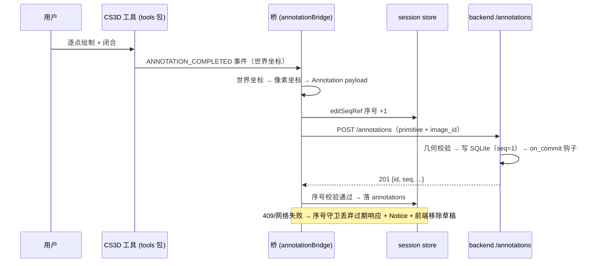
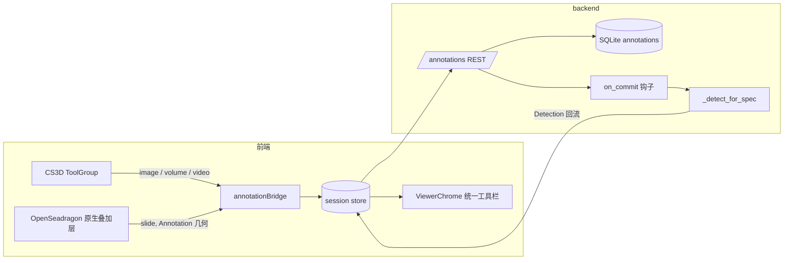
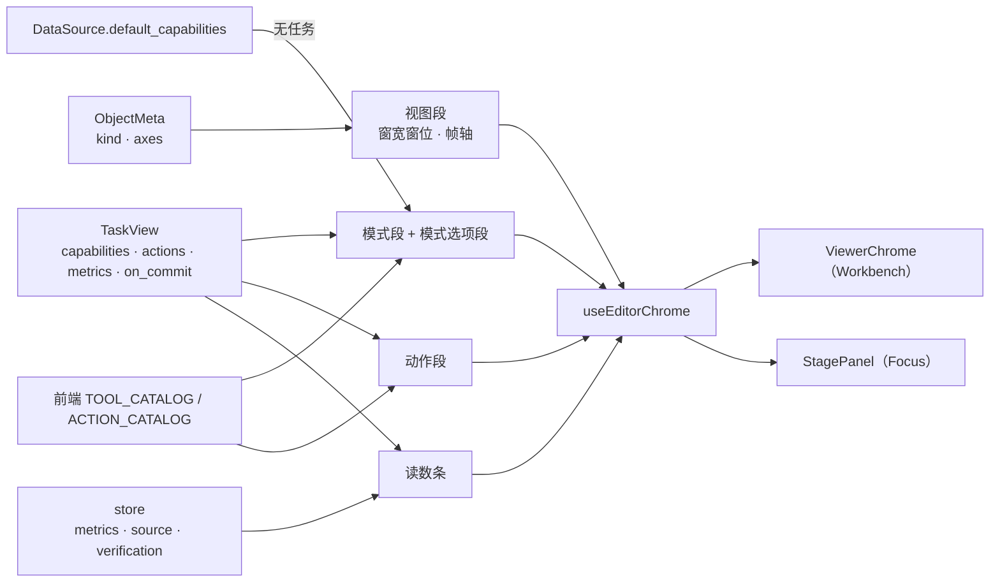
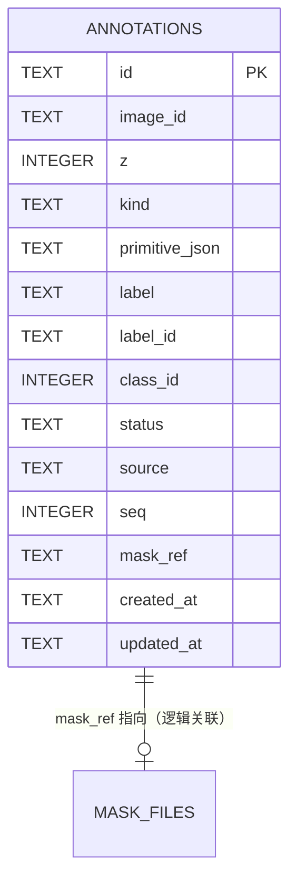
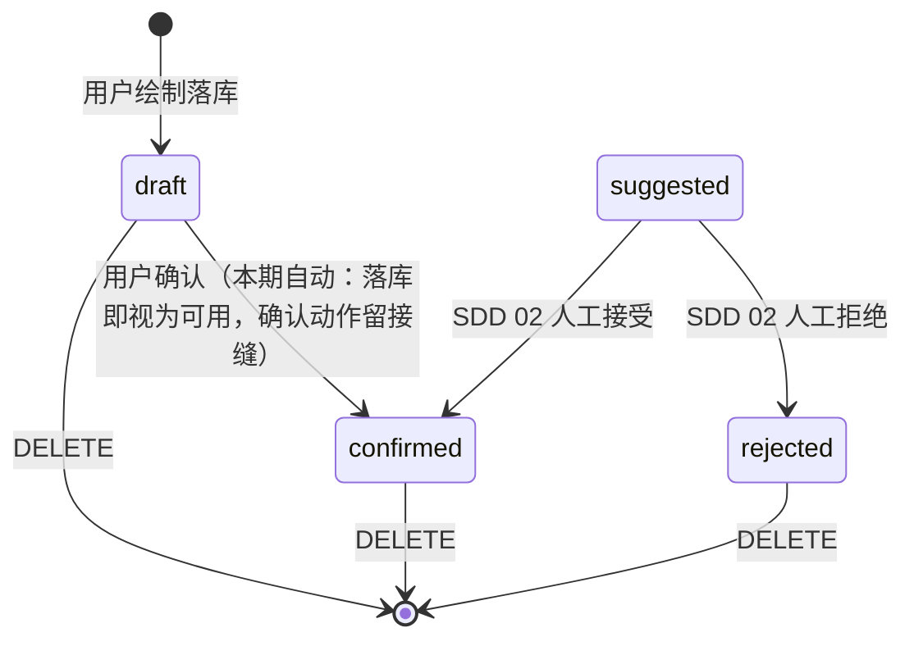

# 统一图像标注工具箱（Unified Annotation Toolbox）

## 0. 文档状态

| 字段 | 内容 |
| --- | --- |
| 状态 | `implemented`（v1.1 编辑区四类模型 2026-09-27 实现完成、自查见 §15 v1.1；v1 浏览器走查验收待补） |
| 当前阶段 | v1：代码完成并与 SDD 对齐，浏览器走查按 §15 v1 逐项过（自动化浏览器渲染进程冻结，待人工恢复）。v1.1：代码、自动化门禁与开发侧浏览器走查完成，待业务验收 |
| 上位 SDD | [Glaux SDD 索引](../../README.md) |
| 承接需求 | [脑暴 20260816-02 · 统一图像标注工具箱](../../../brainstorms/20260816-02-unified-annotation-toolbox.zh-CN.md)（D-1～D-7 已拍板） |
| 实现计划 | v1.1：[编辑区四类模型实施计划](../../../plans/2026-09-27-editor-chrome-model-plan.md) |
| 负责人 | Glaux 项目维护者 |
| 最后更新 | 2026-09-27 |

## 1. 本 SDD 负责什么

跨模态统一的人工标注能力：**bbox / polygon / brush** 三个通用标注工具在 `FrameStackViewer`（image / volume / video）与 `PyramidViewer`（slide）上的绘制、编辑、持久化与任务联动，以及承载它们的统一工具框架。标注产物是独立于任务模型结果（Detection）的一等实体 `Annotation`。

同时负责查看器编辑区（工具条、选项段、读数条）的统一分类：模式、视图、动作、读数四类元素各自的事实来源与位置（v1.1，§7.5）。

## 2. 本 SDD 不负责什么

| 相邻能力 | 归属 |
| --- | --- |
| agent 自然语言 → 建议态标注的产出流（`locate_roi` / `segment_region` / `propose_annotation`、SAM API、权限门控） | [SDD 02 · 智能体图像标注](../02-agent-image-annotation/README.md)（`implemented`）；其建议态（`suggested`）经人工确认转为 `confirmed` 后，即本 SDD 的正式标注实体 |
| 任务模型结果的生成与测量（`/task/run`、`/task/measure`、Detection 管线） | 任务注册表现有契约，本 SDD 零改动 |
| CT labelmap 编辑端点本身（`POST /objects/{id}/edits` + base_seq） | 归 SDD 10，本 SDD 只换前端交互层 |
| 点标注（point）手动编辑、WSI brush、3D 跨切片传播、标注导出（COCO/LabelMe）、多人协作审阅 | 非目标（脑暴 §10）；`point` 只作为存储取值开放（§9.1），不提供人工工具、不设能力位 |
| 标注与 Atlas 的联动（已验证标注沉淀为案例） | 远期；本期仅以 `source` / `status` 字段留接缝 |
| 画布角标（图名、标定、坐标、模型版本）与舞台布局 | [SDD 01](../01-dual-mode-shell/README.md) §8 `StagePanel`（D8） |
| 度量值的数值格式与单位换算（如 mm³ 换 mL） | 不在本 SDD；读数条只规定位置与来源 |
| 「恢复模型输出」动作（丢弃人工对 Detection 的编辑、不重跑） | 另立需求（D-25） |
| 快捷键分发与速查面板 | [SDD 05](../05-keyboard-shortcuts-a11y/README.md)；本 SDD 只提供工具目录中的 `key` |

## 3. 当前阶段目标

一期交付：

1. 各几何族的 bbox / polygon（支持的模态另含 brush）可绘制、可编辑、刷新后仍在（后端持久化）；
2. 全部标注 UI 走统一工具栏与 chrome（主题 CSS + i18n），查看器内无残留私有浮动工具条；
3. 现有任务专属工具统一替换为通用工具（IMT 手柄 / WSI ROI / CT 私有画笔），测量与任务行为不回退；
4. 后端 `annotations` REST + SQLite 存储 + `on_commit` 任务联动钩子。

v1.1 目标（编辑区统一模型，§7.5）：

1. 编辑区每个元素归入模式、视图、动作、读数之一，按类别固定位置；
2. 同一工具 id 在所有对象上标签、图标、快捷键一致；
3. 能力位只表达模式工具；视图控件由对象推导；任务动作由 `TaskPlugin.actions` 声明；
4. 无任务对象不出现任务动作；病理「复现验证」进入工具条动作段，结果进入读数条；
5. Workbench 与 Focus 共用一个编辑区装配入口。

## 4. 输入来源

| 输入 | 必填 | 说明 |
| --- | --- | --- |
| 用户画布交互 | 是 | CS3D 工具事件（image / volume）或 OpenSeadragon 原生叠加层事件（slide）产出的几何 |
| 当前对象上下文 | 是 | `image_id`（经 `resolve_object` 可解析的对象 id）+ 可选 `index`（第三轴索引，`volume`=z / `video`=t / `slide`=level） |
| 注册表 | 是 | `GET /tasks` 下发的引擎能力位、`on_commit` 钩子与任务动作（v1.1 `actions`）声明 |
| 对象元数据 | 是 | `ObjectMeta.kind`、`ObjectMeta.axes`：推导视图段（v1.1，§7.5 规则 4） |
| `base_seq` | 更新/删除必填 | 乐观并发序号，取最近一次成功响应的 `seq` |

输入约束：几何坐标为对应对象的像素坐标（WSI 为 level-0 px），不得越出图像 dims（后端校验）。

## 5. 输出结果

- REST 响应：创建/更新返回完整 `Annotation`（含服务端 `id` / `seq`）；
- 前端 store：`annotations` 列表 + `tool` / `toolOptions` 状态 + `verification`（v1.1，复现验证结果）；
- 任务联动副作用：`on_commit` 钩子派发的 Detection 更新（如 WSI 框完跑核检测），经既有回流通道呈现；
- 错误：领域错误码 → HTTP 映射（§13），前端以 Notice 胶囊提示。

不产生服务端事件流（SSE）；agent 对标注的感知留待 SDD 02（其事件契约在该 SDD §12）。

## 6. 核心流程

### 6.1 标注创建（以 image polygon 为例）


```mermaid
sequenceDiagram
    participant U as 用户
    participant T as CS3D 工具 (tools 包)
    participant B as 桥 (annotationBridge)
    participant S as session store
    participant API as backend /annotations

    U->>T: 逐点绘制 + 闭合
    T->>B: ANNOTATION_COMPLETED 事件（世界坐标）
    B->>B: 世界坐标 → 像素坐标 → Annotation payload
    B->>S: editSeqRef 序号 +1
    B->>API: POST /annotations（primitive + image_id）
    API->>API: 几何校验 → 写 SQLite（seq=1）→ on_commit 钩子
    API-->>B: 201 {id, seq, ...}
    B->>S: 序号校验通过 → 落 annotations
    Note over B,S: 409/网络失败 → 序号守卫丢弃过期响应 + Notice + 前端移除草稿
```

### 6.2 三引擎交互管线


```mermaid
flowchart LR
    subgraph FE[前端]
        TG[CS3D ToolGroup] -->|image / volume / video| CB[annotationBridge]
        AN[OpenSeadragon 原生叠加层] -->|slide, Annotation 几何| CB
        CB --> ST[(session store)]
        ST --> Chrome[ViewerChrome 统一工具栏]
    end
    subgraph BE[backend]
        API[/annotations REST/] --> SQ[(SQLite annotations)]
        API --> HOOK[on_commit 钩子]
        HOOK --> DET[_detect_for_spec]
    end
    ST --> API
    DET -->|Detection 回流| ST
```

两个引擎的 `polygon` 都是逐点点击、显示圆形顶点，至少三个顶点后点击首点闭合。`FrameStackViewer` 的 image / volume / video 路径使用 CS3D `SplineROITool` 的 `LINEAR` 类型，保存 `data.handles.points` 中的控制点，不保存插值轮廓；已存标注从同一点列重建。volume 与 video 的标注带当前 `index.z` / `index.t`，`GET /annotations` 用 `index_from=index_to` 只加载当前层或帧。视频画笔经 `annotationMaskSink` 按 `index.t` 落库，任务绑定的 CT 画笔仍经 `editMaskSink`。WSI 使用 SVG 叠加层，双击末点或 Enter 也可完成，Escape 取消草稿；闭合命中与重复末点过滤使用屏幕像素距离，持久化几何始终为 level-0 坐标，点列不重复首点。`cursor` 工具拖动 WSI 已保存顶点时，编辑预览保留至 `PATCH /annotations` 返回；失败恢复旧几何并提示，刷新时从服务端重载。

### 6.3 任务工具替换映射

| 现有 | 替换为 | 行为保持 |
| --- | --- | --- |
| IMT `editli/editma` 高斯手柄 | CS3D 自定义 BaseTool（D-12/D-17） | 拖手柄形变壁线不变；入口是独立的 `wall` 按钮（不再占用 `polygon`） |
| WSI `roi` 框选 | 通用 `bbox` | 框落库为标注 + `on_commit` 触发核检测（双语义） |
| CT 私有画笔 | 通用 `brush`（CS3D） | 提交走任务结果编辑端点（§7.4） |

### 6.4 编辑区装配（v1.1）


```mermaid
flowchart LR
    OBJ["ObjectMeta<br/>kind · axes"] --> VIEW["视图段<br/>窗宽窗位 · 帧轴"]
    TV["TaskView<br/>capabilities · actions · metrics · on_commit"] --> MODE["模式段 + 模式选项段"]
    DS["DataSource.default_capabilities"] -->|无任务| MODE
    TV --> ACT["动作段"]
    TV --> READ["读数条"]
    ST["store<br/>metrics · source · verification"] --> READ
    CAT["前端 TOOL_CATALOG / ACTION_CATALOG"] --> MODE
    CAT --> ACT
    MODE & VIEW & ACT & READ --> HOOK["useEditorChrome"]
    HOOK --> WB["ViewerChrome（Workbench）"]
    HOOK --> FC["StagePanel（Focus）"]
```

工具条从左到右：模式段 → 绘制提示 → 模式选项段 → 视图段 → 弹性占位 → 动作段 → 运行中指示。读数条在工具条下方独立一行。

## 7. 核心规则

### 7.1 工具集合与声明

- 统一 `Tool` 集合只含模式工具：`cursor / bbox / polygon / brush`，外加任务专属编辑工具 `wall`（IMT 壁线形变，D-17）；`reset` 移出 `Tool` 集合，改为任务动作 `rerun`（v1.1，D-22）；store 的 `toolOptions`（`brush: {mode, class_id, radius}`、`voi: {ww, wl}`）随 `switchModality` 复位；
- 工具的标签、图标、`key` 由前端 `TOOL_CATALOG` 提供，SDD 05 的快捷键与速查面板共用；任务不重命名工具（v1.1，D-21；v1 为 `TaskPlugin.tools[]`）；
- 模式选项段、视图段、动作段、读数条的装配见 §7.5；
- `TaskPlugin.capabilities` 是有任务模态的工具能力来源；无任务模态读取 `DataSource.default_capabilities`；两者取值只含模式工具 id（v1.1，§7.5 规则 3）。`cursor` 为常驻工具，任务专属能力（如 `wall`）由注册表声明；
- **通用工具的语义不因模态而变**：`polygon` 在任何模态都是自由多边形（落 `/annotations`）。任务专属编辑另立工具位，通过能力位限定可见范围——把专属交互塞进通用按钮会让该按钮在那个模态下"画不出东西"，且在前置产物缺失时静默失效；
- 模式段显示 = 常驻工具 + 当前能力位；StatusBar 工具展示从 `TOOL_CATALOG` 取，禁止另建硬编码表；
- `rerun` 动作只重跑活动模型（影响 Detection），不清标注。

### 7.2 标注与模型结果的边界

- 跑模型产物（LI/MA 壁线、颅骨椭圆、labelmap、核质心）归 Detection 管线渲染，**不进** annotations 表；
- 用户绘制/编辑的产物一律先成 `draft` 标注落库，不打断操作流；
- **任务绑定几何例外**：直接参与任务测量的模型产物（IMT 的 LI/MA 壁线）的编辑仍走既有 `/task` 编辑端点（需同步重算测量），不走 `/annotations`——其交互换成统一框架的通用折线编辑（D-12），但数据归属仍是 Detection；自由标注（与测量无关的额外 polygon/bbox）才落 annotations；
- "模型结果转标注"本期不做（留接缝）。

### 7.3 on_commit 钩子

- 声明于 `TaskPlugin`（如 WSI：`on_commit={"bbox": {"action": "run_task"}}`），后端在标注创建成功后派发，复用 `kernel.run_task`（含 SDD 10 的公共前缀）；
- 钩子失败不影响标注落库（标注已 201），失败走 Notice 提示（§13）。

### 7.4 CT brush 例外

画笔写契约由 [SDD 10](../10-object-convergence/README.md) 承载（其 §7 规则 17、D-6），本节只引用。

- CT labelmap 是任务结果而非标注，画笔编辑**不走** `/annotations`，走任务结果编辑端点 `POST /objects/{id}/edits`（`EditRequest{task, method, base_seq, ops}`，`base_seq` 乐观并发，冲突 409），由 `Detector.apply_edit` 派发并按注册表重测。
- 前端两条提交路径经注入的 `MaskSink` 区分：`annotationMaskSink`（2D 画笔 → `/annotations` kind=mask）与 `editMaskSink`（任务结果编辑 → `/objects/{id}/edits`），二者不合并；`task` / `method` 取自当前 `TaskView`，不写常量。
- `/annotations` 在 CT 下承载的是逐切片 bbox/polygon 标注。画笔宿主实施期为 overlay 自持笔迹缓冲（D-15）。

### 7.5 编辑区四类模型（v1.1）

编辑区指查看器画布外框内的工具条与读数条（Workbench `ViewerChrome`、Focus `StagePanel`）；画布角标归 SDD 01。每个元素只属于下表一类：

| 类别 | 定义 | 取值 | 事实来源 | 位置 | 交互形态 |
| --- | --- | --- | --- | --- | --- |
| 模式 | 互斥、持续到切换为止的指针模式 | `cursor` `bbox` `polygon` `brush` `wall` | 启用集：`TaskView.capabilities`，无任务读 `DataSource.default_capabilities`；标签、键位、提示：`TOOL_CATALOG`；图标：`TOOL_ICON`（SDD 06） | 工具条左段 | 切换按钮，`aria-pressed` |
| 模式选项 | 当前模式的参数 | 画笔：涂 / 擦、类别、半径 | 当前模式 + `classes` | 紧随模式段，仅对应模式激活时显示 | 按钮、下拉、滑块 |
| 视图 | 只改显示、不改数据的状态 | 窗宽窗位（预设 + WW / WL）、帧轴（`z` 或 `t`） | `ObjectMeta.kind`、`ObjectMeta.axes` | 工具条中段 | 滑块、预设按钮 |
| 动作 | 一次性命令，调后端 | `rerun` `verify` | `TaskView.actions`；标签、处理函数、不可执行原因：`ACTION_CATALOG`；图标：`ACTION_ICON`（SDD 06） | 工具条右段（弹性占位之后） | 普通按钮，无选中态；执行中或不可执行时禁用，原因经 `title` 呈现 |
| 读数 | 任务输出与出处 | 度量、来源角标、复现结果 | `TaskView.metrics` + store `metrics` / `source` / `verification` | 工具条下方独立一行 | 只读 |

规则：

1. 模式工具的标签、图标、`key` 只来自 `TOOL_CATALOG`，与任务无关。任务对工具的附加行为由既有声明派生提示：`on_commit[tool].action == "run_task"` 时，该工具的绘制提示追加「松手后运行 {任务标签}」（WSI 的 `bbox`），不新增字段。
2. `cursor` 常驻；其余模式工具按启用集显示，未启用不渲染（§13 不置灰）。
3. `capabilities` 与 `default_capabilities` 的取值集合为 `bbox` `polygon` `brush` `wall`。`voi`、`timeline`、`z_scroll`、`verify` 移出能力位。
4. 视图段由对象推导，不经能力位：
   - 窗宽窗位：`kind == "volume"` 时显示，初值取 `FrameSource.defaultVoi`；预设（腹部 / 纵隔 / 肺 / 骨）对全部 `volume` 显示（D-26）；
   - 帧轴：`axes` 含 `z` 或 `t` 时显示一个滑块，`z` 显示「层 i/n」，`t` 显示「帧 i/n」，`fps` 可得时追加秒数；滑块与滚轮翻层写同一 `focus.index`；
   - 2D 对象（无 `z` / `t`）无视图段。
5. 动作段只在有 `TaskView` 时出现；无任务对象（通用图像、视频）工具条无动作段。
6. `rerun`：以当前 `focus.region` 与活动模型重跑任务，不清标注（§11）；标签统一「重新运行」。`trigger == "on_region"` 且无 region 时按钮禁用，`title` 提示先框选。v1 的「重置为模型输出」「重新检测」标签一并改为「重新运行」；不提供不重跑的「恢复模型输出」（D-25）。
7. `verify`：调 `GET /wsi/{slide_id}/verify`，结果写 store `verification`，读数条显示「复现 F1 x.xx（pred/ref）」；不可用时 Notice `wsi_verify_unavailable`，读数条不显示复现结果。
8. 查看器引擎（`FrameStackViewer`、`PyramidViewer`）只渲染画布与画布内几何，不渲染工具条元素（D-24）。
9. Workbench 与 Focus 经 `useEditorChrome` 取四类元素，外壳只负责布局；紧凑模式（只留图标）判据不变（SDD 01 §8）。读数条只在 Focus 舞台渲染，Workbench 读数由底部面板承载（D-27）。Workbench 沿用画布浮层布局：右上工具块为模式段、分隔线、动作段，顶部居中块为提示、模式选项段与视图段。
10. 切换对象时 `verification` 清空，`tool` 回 `cursor`。
11. 查看器上下文中按 `Esc` 执行 `setTool("cursor")`，不触发任何动作（SDD 05 D-7）。

## 8. 涉及对象

| 对象 | 位置 | 说明 |
| --- | --- | --- |
| `Annotation` 契约 | `science-core/glaux_core/contracts.py` + `frontend/src/api/types.ts` 镜像 | 新增实体；`bbox` 原语新增、`mask` 原语落地 |
| annotations 存储 | backend `<ANNOTATIONS_ROOT>/annotations.sqlite` + `masks/` 目录 | 新模块 `app/annotations/`（store + router） |
| annotationBridge | `frontend/src/annotation/` | CS3D 事件 ↔ Annotation 契约 ↔ API 的桥；收敛 editSeqRef/回滚范式 |
| ViewerChrome | `frontend/src/components/` | 统一工具栏 / 选项条 / 信息条（主题 CSS + i18n） |
| TaskPlugin | `science-core/glaux_core/tasks.py` | 引擎能力位 + `on_commit` + `actions`（v1.1）声明；`tools` 字段删除（v1.1）；`plugin_to_view` 同步下发 |
| `DEFAULT_CAPABILITIES` | `backend/app/sources/base.py` | v1.1 去掉 `z_scroll`、`timeline`，只含模式工具 id |
| `TOOL_CATALOG` / `ACTION_CATALOG` | `frontend/src/viewer/toolCatalog.ts`、`actionCatalog.ts` | v1.1 新增：工具 id → i18n 标签键、`key`、绘制提示；动作 id → i18n 标签键、处理函数、不可执行原因；替代 `TaskPlugin.tools[]`、`GENERIC_TOOLS` 与 `toolHint.ts`。图标仍在 `components/iconMap.ts` 的 `TOOL_ICON` / `ACTION_ICON`（SDD 06 单一图标源） |
| `EditorActions` / `ReadoutBar` | `frontend/src/components/EditorActions.tsx`、`components/focus/ReadoutBar.tsx` | v1.1 新增：动作段（两种外壳共用，按钮直接作为工具条子元素，保证紧凑判据按 `.focus-tool` 计宽）；读数条（度量、复现结果、来源） |
| `useEditorChrome` | `frontend/src/viewer/` | v1.1 新增：合并 `useTaskTools` 与两处外壳中的选项段、`classes`、帧轴计算，输出四类元素 |
| `ChromeSegments` | `frontend/src/viewer/chromeSegments.tsx` | v1.1 取代按能力位登记的 `CHROME_SEGMENTS`：渲染模式选项段（画笔）与视图段（窗宽窗位、z / t 帧轴），显隐由 `useEditorChrome` 判定 |
| `PyramidViewer` | `frontend/src/viewer/PyramidViewer.tsx` | v1.1 删除画布内复现验证按钮与结果 |
| `globalKeys` | `frontend/src/keys/globalKeys.ts` | v1.1：`Esc` 改 `setTool("cursor")`；速查面板的 `Esc` 行常驻，不再依赖声明了 `reset` |
| IMT 形变手柄工具 | `frontend/src/viewer/`（CS3D 自定义 BaseTool） | 领域特化，扩展 tools 框架 |

存储关系（`mask_ref` 为文件路径引用，逻辑关联，非外键）：


```mermaid
erDiagram
    ANNOTATIONS ||--o| MASK_FILES : "mask_ref 指向（逻辑关联）"
    ANNOTATIONS {
        TEXT id PK
        TEXT image_id
        INTEGER z
        TEXT kind
        TEXT primitive_json
        TEXT label
        TEXT label_id
        INTEGER class_id
        TEXT status
        TEXT source
        INTEGER seq
        TEXT mask_ref
        TEXT created_at
        TEXT updated_at
    }
```

## 9. 数据或字段要求

### 9.1 `annotations` 表（SQLite，数据字典）

| 字段 | 类型 | 可空 | 默认值 | 键/约束 | 索引 | 用途 | 数据来源 |
| --- | --- | --- | --- | --- | --- | --- | --- |
| `id` | TEXT | 否 | — | PK | — | 标注唯一 id（uuid4） | 服务端生成 |
| `image_id` | TEXT | 否 | — | 逻辑关联至数据源对象 | `idx_annotations_image(image_id, z)` | 挂靠对象（图/卷/切片 id） | 前端上下文 |
| `z` | INTEGER | 是 | NULL | — | 同上 | 对象当前第三轴取值：`volume`=z / `video`=t / `slide`=level；未绑定索引（含全部 2D 对象）为 NULL | `index` |
| `kind` | TEXT | 否 | — | CHECK(kind IN ('bbox','polyline','mask','point'))，取值由 `store.py` 的 `_KINDS` 生成 | — | 原语判别；`point` 仅为 `point_set` 原语与 agent 产出预留 | payload |
| `primitive_json` | TEXT | 否 | — | — | — | 几何原语 JSON（§9.2） | payload |
| `label` | TEXT | 否 | `''` | — | — | 语义标签文本；有 `label_id` 时读取以目录名称为准 | 用户 |
| `label_id` | TEXT | 是 | NULL | 逻辑关联至 `labels.id` | `idx_annotations_label` | 标签目录引用（[SDD 23](../23-annotation-labels/README.md) §7.2）；人工绘制必填，库结构 v2 起有此列 | 用户 / 目录匹配 |
| `class_id` | INTEGER | 是 | NULL | — | — | 可选类别（颜色走 ClassSpec） | 用户 |
| `status` | TEXT | 否 | `'draft'` | CHECK(status IN ('draft','confirmed','suggested','rejected')) | — | 生命周期态（§11） | 服务端 |
| `source` | TEXT | 否 | `'manual'` | CHECK(source IN ('manual','model','agent')) | — | 产出方（SDD 02 接缝） | 服务端 |
| `seq` | INTEGER | 否 | `1` | — | — | 乐观并发序号 | 服务端递增 |
| `mask_ref` | TEXT | 是 | NULL | 逻辑关联至 `masks/` 文件 | — | kind='mask' 时的 PNG 相对路径 | 服务端落盘 |
| `created_at` | TEXT | 否 | — | — | — | ISO8601 | 服务端 |
| `updated_at` | TEXT | 否 | — | — | — | ISO8601 | 服务端 |

`status` / `source` 的 CHECK 同样由 `_STATUSES` / `_SOURCES` 生成，DDL 不另写取值。

库结构版本：`PRAGMA user_version = 1`（`store.py` 的 `SCHEMA_VERSION`）。打开库时按版本处理：

| `user_version` | 处理 |
| --- | --- |
| 无 `annotations` 表 | 按当前结构建表与索引，置 `1` |
| `0`（kind 三值 CHECK 的首版库） | 单个事务内：建新表 → `INSERT INTO ... SELECT` 搬全部行 → 删旧表 → 新表改名 → 重建 `idx_annotations_image` → 置 `1`；不新增列、不回填 `z` |
| `1` | 不做任何事 |
| 大于 `1` | 拒绝打开 |

迁移任一步失败整体回滚并抛错，服务拒绝启动，原库保持 `user_version = 0` 与原数据，不做部分迁移（SDD 10 §9.5、§13）。

mask 文件存 `<ANNOTATIONS_ROOT>/masks/<id>.png`，删除标注时同步删文件。

### 9.2 `Annotation` JSON 契约（前后端镜像）

```
{
  id, image_id,
  index: {z} | {t} | {level} | {},   // 响应必带；请求可选
  primitive: {kind:"bbox", x0,y0,x1,y1}
           | {kind:"polyline", closed:true, points:[[x,y],...], role}
           | {kind:"mask", ref}
           | {kind:"point", x, y},     // 仅存储域，无人工工具
  label, class_id?,
  status: "draft"|"confirmed"|"suggested"|"rejected",
  source: "manual"|"model"|"agent",
  seq
}
```

`bbox` 原语同步加入 science-core `contracts.py` 的 Primitive 联合与 `primitive_to_dict`。

`index` 与 `z` 的规则（`POST /annotations`）：

- `index` 至多一个轴非空；`index` 与 `z` 同传时取值须相等；违反任一条 → 422 `INVALID_GEOMETRY`；
- 只传 `z` 时按对象的第三轴解释（`volume`=z / `video`=t / `slide`=level）；
- 存储列 `z` 取 `index` 的唯一非空值，否则取 `z`；两者皆空则为 NULL，不做索引校验；
- 非空时经 `resolve_object` + `ObjectMeta.check_index` 校验：越界或对象无此轴（如 2D 对象传 `z`）→ 422 `INVALID_GEOMETRY`；
- 响应的 `z` 为存储列原值；`index` 以对象第三轴命名该值，列为 NULL 时为 `{}`；对象已无法解析时回落为 `{z: v}`。

`GET /annotations` 的过滤参数：`z`（第三轴精确匹配）、`index_from` / `index_to`（闭区间，整数 ≥ 0，可单独使用，`index_from > index_to` → 422）。区间过滤在 SQL 中执行，不返回 `z` 为 NULL 的行。

### 9.3 `TaskView` 与能力位契约（v1.1）

前后端同一提交更新，不保留旧字段。

| 字段 | v1 | v1.1 |
| --- | --- | --- |
| `TaskView.tools` | `[{id, glyph, label, key?}]` | 删除；显示元数据归 `TOOL_CATALOG` |
| `TaskView.capabilities` | 工具 id 与 `voi` / `z_scroll` / `timeline` / `verify` 混合 | 只含 `bbox` `polygon` `brush` `wall` |
| `TaskView.actions` | 无 | 新增 `string[]`，取值 `rerun` `verify`；`TaskPlugin` 缺省 `("rerun",)` |
| `DataSource.default_capabilities` | image `bbox polygon`；volume 另含 `z_scroll`；video 另含 `timeline brush` | video `bbox polygon brush`，其余 `bbox polygon` |
| store `verification` | 无（`PyramidViewer` 组件内状态） | `{f1, count_pred, count_ref}` 或 `null` |

注册表取值：

| 任务 | `capabilities` | `actions` |
| --- | --- | --- |
| 颈动脉远壁 IMT | `bbox` `polygon` `brush` `wall` | `rerun` |
| 胎儿头围 | `bbox` `polygon` `brush` | `rerun` |
| CT 肝 + 双肾 | `bbox` `polygon` `brush` | `rerun` |
| 病理 WSI 核检测 | `bbox` `polygon` | `rerun` `verify` |

## 10. 幂等规则

- 幂等键为 `id`（服务端生成）；`POST` 每次产生新标注，不做客户端去重（绘制交互每次闭合即新意图）；
- `PATCH` / `DELETE` 必带 `base_seq`：`base_seq != 当前 seq` → `409 CONFLICT`，不产生任何写；
- 前端并发守卫沿用 editSeqRef 序号范式：过期响应（含过期的 409 回滚）一律丢弃；
- `on_commit` 钩子重复派发以 Detection 管线既有幂等性为准（重跑覆盖），不重复落标注。

## 11. 状态或生命周期规则


```mermaid
stateDiagram-v2
    [*] --> draft: 用户绘制落库
    draft --> confirmed: 用户确认（本期自动：落库即视为可用，确认动作留接缝）
    suggested --> confirmed: SDD 02 人工接受
    suggested --> rejected: SDD 02 人工拒绝
    draft --> [*]: DELETE
    confirmed --> [*]: DELETE
    rejected --> [*]: DELETE
```

- `draft`：人工绘制产物的默认态，参与渲染，不参与任务测量；
- `confirmed`：本期人工标注落库后前端即按可用处理；显式"确认"动作不做 UI，态值预留；
- `suggested` / `rejected`：仅由 SDD 02 流程写入，本 SDD 的实现保证其可存储、可渲染区分（虚线/半透明），不实现其转换入口；
- `rerun`（重跑模型）不触碰任何标注。

## 12. 审计或事件规则

- 本 SDD 不产生服务端事件流（无 SSE）；标注变更的可追溯性由 `source` + `updated_at` + `seq` 承担；
- agent 通道的标注事件（`annotation.suggested` 等）属 SDD 02 §12，本 SDD 只保证其落地实体兼容；
- 前端 Notice（info/crit）不算事件，提示文案走 i18n。

## 13. 异常和人工处理

| 失败类别 | 错误码 | HTTP | 用户感知 | 处理 |
| --- | --- | --- | --- | --- |
| 标注不存在 | `NOT_FOUND` | 404 | Notice 提示并刷新列表 | 前端移除本地副本 |
| 并发冲突 | `CONFLICT` | 409 | "标注已被更新，请重试" | 丢弃本次编辑，重拉最新 |
| 几何非法（越界/点数不足/自交多边形面积为零） | `INVALID_GEOMETRY` | 422 | Notice 指明原因 | 前端移除草稿 |
| `index` 非法（越界、对象无此轴、多轴、与 `z` 不一致） | `INVALID_GEOMETRY` | 422 | Notice 指明轴名与合法范围 | 前端移除草稿 |
| 标注库迁移失败 | — | 服务不启动 | 后端启动报错 | 事务回滚，原库保持 `user_version = 0`（§9.1） |
| on_commit 钩子失败 | — | 标注仍 201 | Notice：标注已保存，检测未触发 | 用户可 `rerun` 或重新框选 |
| 复现验证不可用（缺 reference 或隔离环境） | — | 非 2xx | Notice `wsi_verify_unavailable` | 读数条不显示复现结果（v1.1） |
| 网络失败 | — | — | Notice + 回滚 | editSeqRef 守卫，不静默 |

前端空状态：无标注时画布照常显示 Detection 结果，不额外提示；工具未启用引擎能力时工具栏不出现该按钮（不置灰）；无任务对象无动作段；无度量时读数条不渲染（v1.1）。

## 14. 与其他 SDD 的调用关系

- **[02-agent-image-annotation](../02-agent-image-annotation/README.md)**（被依赖）：其 §11 "`confirmed` 后归影像标注既有逻辑"由本 SDD 承接——`propose_annotation` 落库走本 SDD `POST /annotations`（`status=suggested, source=agent`），接受/拒绝即 PATCH status。本 SDD 先行实现，SDD 02 已据本契约把其 §17-Q3/Q4 收敛为 D-9。
- **[01-dual-mode-shell](../01-dual-mode-shell/README.md)**：ViewerChrome 落入 Workbench 编辑区既有布局，不改外壳结构。
- **[03-atlas](../03-atlas/README.md)**：无直接调用；远期"已验证标注沉淀案例"另立需求。
- 各 SDD 的当前状态见 [SDD 索引](../../README.md)。
- 依赖任务注册表（`GET /tasks`）现有下发通道扩展字段（能力位 / on_commit / v1.1 `actions`），不构成新 SDD。
- v1.1 同步修订的相邻 SDD：
  - [SDD 01](../01-dual-mode-shell/README.md) §8 `StagePanel`：工具条按 §6.4 的段顺序，装配读 `useEditorChrome`；
  - [SDD 05](../05-keyboard-shortcuts-a11y/README.md) R4 与 D-7：`key` 来源为 `TOOL_CATALOG`；`Esc` 回 `cursor`；
  - [SDD 10](../10-object-convergence/README.md) §9.3 / §9.4：`capabilities` 与 `default_capabilities` 取值收窄为模式工具 id，复现验证入口位置归本 SDD。

## 15. 验收标准

### v1

- [ ] image、volume、video、slide 四类对象上 bbox / polygon 可绘制、可编辑（移动/缩放/顶点增删），刷新页面后标注仍在（读自 `GET /annotations`）；video 与 volume 的标注只在所属帧或层显示，video 画笔写 `index.t`。
- [ ] 全部标注工具 UI 走统一工具栏：查看器组件内无内联样式浮动工具条、无硬编码中文工具文案（i18n 双语可切换验证）。
- [ ] CT 模态 `store.tool === "brush"` 生效（共享工具栏画笔按钮可用），`FrameStackViewer` 的 CT 分支走 `editMaskSink`；StatusBar 工具显示随注册表，`TOOL_LABEL` 硬编码表删除。
- [ ] WSI 用 bbox 框选：框落库为标注且触发核检测（`on_commit`），检测行为（计数/密度）与旧 ROI 工具一致；框选过小（<24px）仍提示不触发。
- [ ] WSI 多边形逐点显示圆形顶点，点击首点、双击末点或 Enter 完成后只保存不重复的 level-0 点列；`cursor` 下拖动顶点，保存期间不回跳，刷新后与底图对齐。
- [ ] image / volume 的 `polygon` 与 WSI 一样逐点显示圆形顶点、点击首点闭合；保存的点列仅含点击的控制点，刷新后可拖动顶点且与原图对齐。
- [ ] IMT 壁线编辑经统一框架完成，`/task/measure` 输出与替换前一致（同一图像同一形变的 IMT_mean 偏差 ≤ 1e-6 mm）。
- [ ] IMT 模态下 `polygon` 画的是自由多边形并落 `/annotations`；壁线形变在独立的 `wall` 按钮下（D-17），两者互不遮蔽。
- [ ] `PATCH` 携带过期 `base_seq` 时返回 409 且不落写；前端收到 409 时 Notice 提示并丢弃过期响应，不覆盖最新态。
- [ ] `POST` 几何越出图像 dims 时返回 422 `INVALID_GEOMETRY`，前端草稿被移除。
- [ ] `switchModality` 后 `tool` 回 `cursor`、`toolOptions` 复位，无跨模态状态泄漏（连续切换三模态后各工具行为正常）。
- [ ] 标注读写回流范式仅一份实现（annotationBridge）；任务绑定编辑（IMT 壁线测量 / CT 对象编辑）属 Detection 链路，各自领域内单一 seq 守卫（wallSeq / editMaskSink），三查看器无标注回流复制代码。
- [ ] `on_commit` 钩子失败时标注仍成功落库（201），用户收到"标注已保存、检测未触发"提示。
- [ ] 2D brush 产物落库为 `kind='mask'`，`masks/<id>.png` 存在且重新加载后叠加渲染一致。

### v1.1 编辑区四类模型

- [x] 通用图像、视频、CT、WSI、IMT、HC 六类对象上，`cursor` 标签均为「选择 / 平移」，`bbox` 均为「框标注」；同一工具 id 的图标与快捷键一致。——浏览器走查通用图像、视频、CT、WSI、IMT；六类由 `ViewerChrome.test` 覆盖
- [x] 通用图像与视频的工具条无动作段；逐个点击工具条按钮，不存在无可见效果的按钮。——浏览器走查 + `ViewerChrome.test`、`editorChrome.test`
- [x] 有任务对象的工具条右段有「重新运行」；WSI 未框选时该按钮禁用且 `title` 提示先框选。——浏览器走查（Focus 与 Workbench）+ `ViewerChrome.test`
- [x] WSI「复现验证」位于工具条动作段，画布内无按钮；结果显示在读数条；切换到其他对象后结果消失。——浏览器走查按钮位置与不可用提示；成功写入、切走丢弃、失败清空由 `actions.test`、`ReadoutBar.test`、`editorChrome.test` 覆盖
- [x] WSI 选中 `bbox` 时绘制提示含「松手后运行」与任务标签。——浏览器走查 + `ViewerChrome.test`
- [x] CT 工具条显示「层 i/n」滑块，拖动滑块与滚轮翻层后 `focus.index.z` 一致；视频显示「帧 i/n」与秒数；2D 图像无帧轴与窗宽窗位。——浏览器走查（滑块与滚轮双向同步）+ `ViewerChrome.test`
- [x] `GET /tasks` 响应不含 `tools`，`capabilities` 只含 `bbox` `polygon` `brush` `wall`，`actions` 与 §9.3 注册表取值一致；`GET /datasources` 的 `default_capabilities` 只含模式工具 id。——实测端点 + backend `test_api` / `test_objects`、science-core `test_tasks`
- [x] `ViewerChrome` 与 `StagePanel` 不直接引用 `CHROME_SEGMENTS`、`frameAxisFor`、`useTaskTools`，只消费 `useEditorChrome`。——代码审阅；`CHROME_SEGMENTS` 与 `useTaskTools` 已删除
- [x] 快捷键 v / r / p / b / w 在六类对象上的行为与 v1 一致（SDD 05 回归）；选中任一模式工具后按 `Esc`，`tool` 为 `cursor` 且未发起 `POST /task/run`。——`globalKeys.test` + 浏览器走查 WSI 上 `Esc`

v1.1 自查（2026-09-27）：

- 已完成：上述九项；门禁为 science-core `pytest` 213 项、backend `pytest` 499 项与 `ruff`、`check-modality-literals --strict`、frontend `lint`、`test` 362 项、`build`。
- 未完成：无。
- 无法在开发走查中验证：HC 任务对象与 WSI 复现验证成功路径。项目会话的文件栏只列项目目录，内置 HC 数据集与带 reference 的 `slide_001` 需在未归属会话中打开；两者由单元测试覆盖，留待业务验收人工确认。

## 16. 决策记录

承接脑暴 D-1～D-7（含后端持久化 / 全模态 / 统一替换 / 路线 A / 复用 `@cornerstonejs/tools` / Annotorious / SQLite），本 SDD 新增收敛决策：

| 编号 | 决策 | 备选 | 选择理由 | 时间 |
| --- | --- | --- | --- | --- |
| D-8 | ~~polygon 工具用 CS3D `PlanarFreehandROITool`~~ **已被 D-19 替代** | `SplineROITool`、自绘 | 当时偏向自由手绘；后续真实走查发现其拖拽手势与 WSI 逐点多边形不一致 | 2026-08-16 |
| D-9 | 2D brush 产物落 `/annotations`（kind=mask，PNG 传输）；宿主实现见 D-15（实施期从 CS3D segmentation 退化为自持缓冲） | 自持 mask 缓冲 | PNG 传输格式与 CT mask-edit 一致；宿主选型随 spike3 结果收敛 | 2026-08-16 |
| D-10 | ~~Annotorious W3C 格式在前端映射~~ **已被 D-18 替代** | 后端映射 | 后端只认一份 Annotation 契约 | 2026-08-16 |
| D-11 | `ANNOTATIONS_ROOT` 默认 `~/glaux_annotations`，环境变量 `GLAUX_ANNOTATIONS_ROOT` 覆盖 | 放数据集根下 | 对齐 `GLAUX_ATLAS_ROOT` 惯例（不污染数据集） | 2026-08-16 |
| D-12 | IMT 高斯形变手柄实现为 CS3D 自定义 BaseTool | 保留手写 overlay 交互 | 复用成熟框架而非平行实现 | 2026-08-16 |
| D-13 | CT brush 不走 `/annotations`，经 `editMaskSink` 调 `/objects/{id}/edits` | 统一到 annotations | labelmap 是任务结果而非标注；编辑语义不变 | 2026-08-16 |
| D-14 | IMT 壁线编辑仍走既有 `/task` 编辑端点（交互换通用折线编辑），不走 `/annotations` | 统一到 annotations | 壁线编辑必须同步重算测量（`/task/measure` 权威口径）；数据归属 Detection 而非自由标注 | 2026-08-16 |
| D-15 | 2D/CT brush 宿主使用 overlay 自持 mask 缓冲（提交分别经 annotationMaskSink / editMaskSink）；CS3D segmentation 原生交互与渲染留后续 | D-9 的 CS3D labelmap 宿主 | T0 spike3 未打通 StackViewport labelmap（3.33.5 需预建派生 imageId + 引用校验）；画笔缓冲共用且保留两条写语义 | 2026-08-17 |
| D-16 | ~~IMT 模态的 `polygon` 按钮专属壁线形变（ImtWallHandleTool），不与自由多边形并存~~ **已被 D-17 推翻** | 双入口并存 | 主键交互只能激活一个工具；自由标注已有 bbox 承接，壁线编辑是 IMT 核心操作 | 2026-08-17 |
| D-17 | 壁线形变独立成 `wall` 工具（IMT 专属能力位），`polygon` 归还给自由多边形；两者各占一个工具位 | 维持 D-16 的单入口复用 | D-16 的前提「主键交互只能激活一个工具」不成立——工具位本就互斥切换，多一个按钮不冲突。实际代价是：IMT 上「多边形标注」画不出多边形，且 caroSegDeep 未产出壁线时（`editableWalls()` 为空）连形变都没有，按下鼠标直接 return，用户看到的是**完全静默**的按钮。通用工具的语义必须跨模态一致 | 2026-08-30 |
| D-18 | WSI 的 bbox / polygon 改由 OpenSeadragon 原生 SVG 叠加层绘制与编辑，直接使用 Annotation 几何与现有写桥；删除 Annotorious 与 W3C 映射 | 继续使用 Annotorious | Annotorious 内嵌 pixi 在现有 CSP 下初始化失败；WSI 只需要 bbox 与 polygon，原生叠加层可保留 level-0 坐标与后端权威写契约 | 2026-09-23 |
| D-19 | image / volume 的 `polygon` 改用 CS3D `SplineROITool` 的 `LINEAR` 类型，三个引擎统一逐点、圆点、首点闭合；写桥保存控制点 | 保持 D-8 的自由手绘；三引擎共写一套叠加层 | 维护者确认统一逐点交互；原生 CS3D 工具保留已有坐标与顶点编辑能力，避免再造叠加层 | 2026-09-24 |
| D-20 | 编辑区元素分模式、视图、动作、读数四类，按类别固定位置（§7.5） | 维持能力位平铺 | v1 `capabilities` 一个列表混合工具、视图控件、交互方式、任务动作四种语义；同类元素位置不一（「重新检测」在工具条，「复现验证」在画布内） | 2026-09-26 |
| D-21 | 工具显示元数据归前端 `TOOL_CATALOG`，任务不重命名工具；任务差异由 `on_commit` 派生提示表达 | 保留 `TaskPlugin.tools[]` | 同一 id 出现「框标注」与「框选 ROI」、「选择 / 平移」与「平移 / 缩放」；§7.1 要求通用工具语义跨模态一致，标签随之一致；有专属交互的工具（`wall`）本就需要前端代码 | 2026-09-26 |
| D-22 | `reset` 改为任务动作 `rerun`，无任务对象不出现 | 保留常驻 `reset` | 无任务对象上 `reset` 调 `runTask` 立即返回 false，按钮无效果；重跑是一次性命令，不是指针模式 | 2026-09-26 |
| D-23 | 视图控件（窗宽窗位、帧轴）由对象 `kind` / `axes` 推导，不经能力位 | 继续用 `voi` / `timeline` / `z_scroll` 能力位 | 视图控件取决于数据形态而非任务；`z_scroll` 与 `verify` 能力位前端无消费方；`frameAxisFor` 已统一 z / t，但只有 `t` 有滑块 | 2026-09-26 |
| D-24 | 查看器引擎不渲染工具条元素 | 引擎内渲染任务专属按钮 | 与 §3 目标 2「查看器内无私有浮动工具条」一致；`PyramidViewer` 的复现验证按钮是遗留 | 2026-09-26 |
| D-25 | 本期只提供 `rerun`；「恢复模型输出」（丢弃人工对 Detection 的编辑、不重跑）另立需求 | 本期新增 `revert` 动作 | `revert` 需要逐任务保存模型原始输出并定义与 `base_seq` 的关系，超出编辑区分类的范围；v1 的「重置为模型输出」实际行为就是重跑，改名「重新运行」不减少现有能力 | 2026-09-27 |
| D-26 | 窗宽窗位预设对全部 `volume` 对象显示，不引入强度单位字段 | 新增 `meta.intensity_unit`，非 CT 体数据隐藏预设 | 当前体数据只有 CT；出现非 CT 体数据时再加字段 | 2026-09-27 |
| D-27 | 读数条只在 Focus 舞台渲染，Workbench 读数继续由底部面板承载 | Workbench 工具条下也渲染读数条 | Workbench 底部面板已按注册表渲染度量与运行日志，再加一行是重复展示 | 2026-09-27 |

## 17. 待确认问题

无（脑暴 Q1～Q5 已收敛为 D-8～D-12；v1.1 的三个开放问题已收敛为 D-25～D-27；实现期若暴露契约缺口，按铁律先回本 SDD）。
