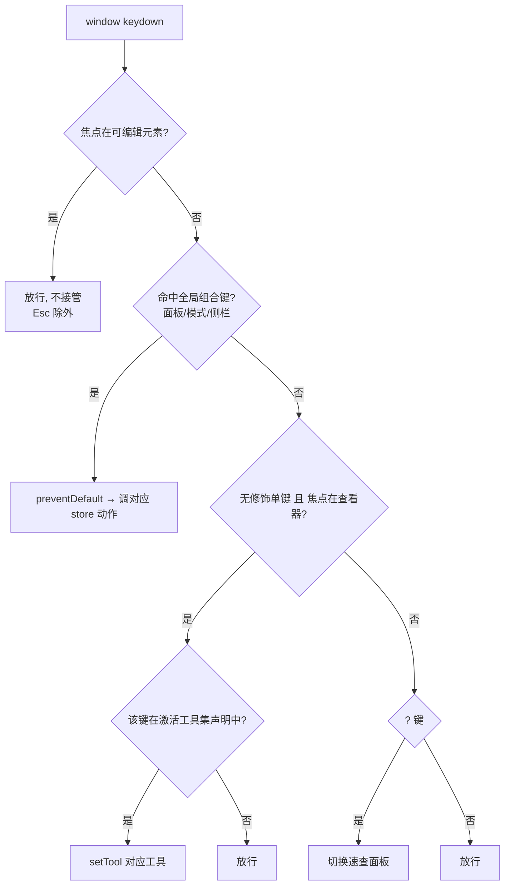
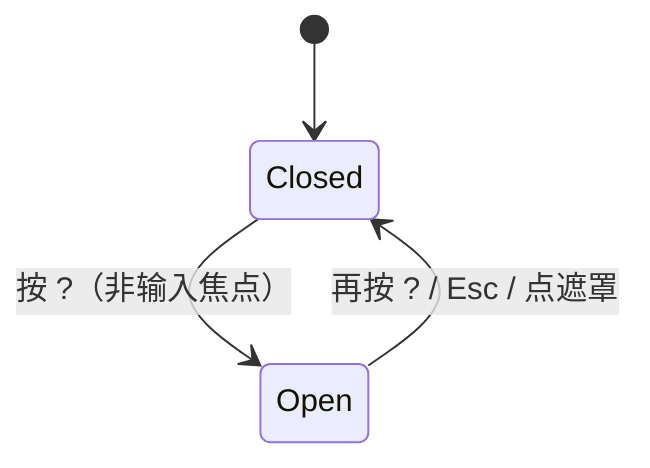

# 键盘可达性与全局快捷键（Keyboard Accessibility & Global Shortcuts）

## 0. 文档状态

| 字段 | 内容 |
| --- | --- |
| 状态 | implemented |
| 当前阶段 | 已实现并通过开发验证（62 前端测试含 9 项本 SDD 用例）；待业务验收回 accepted |
| 关联主 SDD | [前端设计纲领 G10/G13](../../../designs/frontend-design-charter.zh-CN.md) · [IDE 前端设计稿 R13](../../../designs/2026-07-06-glaux-ide-frontend.zh-CN.md) · [前端品质提升路线图 · P2](../../../roadmaps/20260818-frontend-quality-roadmap.zh-CN.md) |
| 负责人 | Glaux 项目维护者 |
| 最后更新 | 2026-08-19 |

> 状态合法值仅四个：`draft` → `ready` → `implemented` → `accepted`。

## 1. 本 SDD 负责什么

一个横切能力：让 Glaux **全键盘可达**，并提供**全局快捷键**与其**可发现面板**。三块：

1. **无障碍语义基线（G10 落地）**：所有可操作元素都能被键盘聚焦并触发——把用 `
` 假冒的可点元素改为真正的 `<button>` / 带 `role`+`tabIndex`+键盘处理的元素；消除"聚焦了按也没反应"的假按钮。
2. **全局快捷键分发**：单一 `keydown` 分发器（唯一监听点），把按键映射到**已存在**的 store 动作——工具切换、面板/侧栏开合、模式切换（Focus↔Workbench）。
3. **可发现性（G13 反馈无空窗）**：`?` 唤起快捷键速查面板（cheatsheet overlay），按分组列出当前生效的全部快捷键，随激活工具集动态刷新。

## 2. 本 SDD 不负责什么

| 相邻能力 | 归属 |
| --- | --- |
| 定义有哪些工具、工具做什么、工具集合本身 | [SDD 04 · 统一标注工具箱](../04-unified-annotation-toolbox/README.md)。本 SDD 只把按键**绑到** 04 声明的工具，不定义工具语义 |
| 定义有哪些模式/面板/侧栏视图及其布局 | [SDD 01 · 双模式外壳](../01-dual-mode-shell/README.md)。本 SDD 只**触发** 01 已有的 `setUiMode`/`togglePanel`/`setFocusLayout`/`setSidebarView` |
| 画布内的直接操纵手势（拖手柄、绘制顶点） | SDD 04 / 各查看器。快捷键不介入画布几何编辑 |
| 命令面板（Cmd+K 式全命令检索） | 非目标（本迭代）。见 §16 D-3 |
| 输入框内的局部按键（Composer Enter 发送、Terminal Enter） | 各组件自持，已存在；本 SDD 不接管，只保证全局键**不与之冲突**（§7 规则 R2） |

## 3. 当前阶段目标

- 文件树（`SideBar` 目录行、图像叶子、导入表单头、能力卡）与状态栏假按钮全部键盘可达、可聚焦、可触发；
- 落地一个不与浏览器保留键冲突的全局快捷键集合（工具、面板、模式）；
- `?` 唤起速查面板，列出当前生效快捷键；
- 尊重 `prefers-reduced-motion`（面板过渡走既有 token 机制，本 SDD 不新增动效纪律）。

## 4. 输入来源

| 输入 | 协议 / 约束 |
| --- | --- |
| `window` 的 `keydown` 事件 | 单一监听器（React 顶层 effect 挂载）；读取 `key`、`code`、`ctrlKey`/`metaKey`/`shiftKey`/`altKey` |
| 焦点上下文 | `document.activeElement`：判断是否落在可编辑元素（`input`/`textarea`/`[contenteditable]`）或查看器容器内 |
| 激活工具集 | 由 SDD 04 的 `TaskPlugin` 引擎能力声明 + 当前 `Tool` 集合提供；每个工具携带可选 `key` 与 `i18n` 标签 |
| store 只读态 | `uiMode`、`tool`、`sidebarView`、`focusLayout`、`panelCollapsed`——用于速查面板回显当前值与决定某快捷键是否可用 |

## 5. 输出结果

| 输出 | 约束 |
| --- | --- |
| store 动作调用 | `setTool` / `setUiMode` / `togglePanel` / `setFocusLayout` / `setSidebarView`——**只调已存在动作，不新增契约** |
| 速查面板开合 | 前端瞬态 UI（overlay）；不落库、不产生事件 |
| 焦点变更 | 语义化元素获得原生焦点环（走全局 `:focus-visible`）；Esc 从 overlay/工具态退出 |
| `preventDefault` | 仅对本 SDD 明确接管的组合键调用，避免吞掉浏览器/输入法默认行为（§7 R2/R5） |

## 6. 核心流程

全局 keydown 分发（单一监听器 → 守卫 → 派发）：

## 7. 交互规则（可直接转验收）

- **R1 单一监听器**：全局快捷键只有一个 `window` keydown 监听点（顶层 effect），卸载时移除。组件内不得各自监听全局键。
- **R2 输入优先**：焦点在 `input`/`textarea`/`[contenteditable]` 时，除 `Esc` 外一律放行，绝不 `preventDefault`——不干扰打字与输入法组合。
- **R3 工具键需上下文**：无修饰单键（V/L/M/R 等）仅当**焦点落在查看器表面 `[data-viewer-surface]` 或页面主体 `body`（点击画布后的常态），且非可编辑元素**，并且当前引擎声明了该键时才生效；焦点在具体交互控件（侧栏按钮、输入框等）上时放行——避免全局误触，又无需给查看器强加焦点管理。
- **R4 键位数据化**：工具→键位映射由工具声明携带（随 04 的工具集变化自动跟随），**不在分发器里硬编码具体工具名**（见 §16 D-2）。
- **R5 避开浏览器保留键**：不绑定 `Cmd/Ctrl+N/T/W/J/Q` 等浏览器强占组合；全局组合键选用可安全 `preventDefault` 的键（见 §17 待定表）。
- **R6 幂等/可逆**：面板/模式/侧栏类快捷键为切换（toggle）或幂等设值，重复按行为可预期（§10）。
- **R7 尊重 reduced-motion**：快捷键触发的布局变化过渡沿用既有 token 机制；`prefers-reduced-motion` 下由全局规则降级为瞬时（纲领 M5），本 SDD 不新增动效。
- **R8 语义即可达**：凡有 `onClick` 行为的元素必须是原生可聚焦可触发控件（`<button>`，或 `role`+`tabIndex=0`+Enter/Space 处理）；纯展示元素不得挂 `onClick`。
- **R9 焦点可见**：所有可聚焦元素复用全局 `:focus-visible` 焦点环，不得 `outline:none` 去环。

### 7.1 快捷键分组（已定稿，键位见 §16 D-5~D-7）

| 分组 | 触发 | 动作 | 生效范围 |
| --- | --- | --- | --- |
| 工具 · cursor | `V` | `setTool('cursor')` | 查看器聚焦（当前工具集） |
| 工具 · 框标注 | `R` | `setTool('bbox')` | 同上（04 合入后按统一工具集，见 D-2 迁移说明） |
| 工具 · 多边形 | `P` | `setTool('polygon')` | 同上 |
| 工具 · 画笔 | `B` | `setTool('brush')` | 同上（引擎无 brush 能力位的模态该键无对应工具） |
| 工具 · 复位 | `Esc` | `setTool('reset')`（仅当速查面板已关，见 D-7） | 查看器聚焦 |
| 外壳 · 左会话栏（Focus） | `Ctrl/Cmd+B` | Focus 切左会话栏（`setFocusLayout({railOpen})`）。Workbench 侧栏由 dockview 自管，键盘开合本轮延后（见 §13） | Focus |
| 外壳 · 右侧栏/底面板 | `Ctrl/Cmd+\` | Focus 切右侧栏（`setFocusLayout({rightOpen})`）；Workbench 切底面板（`togglePanel`） | 全局 |
| 外壳 · 模式切换 | `Ctrl/Cmd+Shift+M` | `setUiMode` Focus↔Workbench | 全局 |
| 帮助 · 速查 | `?`（Shift+/） | 切换速查面板 | 全局（输入框内除外） |

## 8. 涉及页面和组件

- 新增：`useGlobalKeys`（顶层 keydown effect，挂在 `App`）、`ShortcutSheet`（速查 overlay 组件）。
- 改造（语义化）：`SideBar`（目录行 `:85`、图像叶子 `ImageLeaf :56`、导入头 `dsimp-hd :222`、能力卡 `:302`）、`StatusBar`（假按钮 `⎇ main`/计数补 `onClick` 或降级为非按钮 + `aria-label`）。
- 复用：`store/session` 既有动作；`i18n`（速查面板文案 + 快捷键标签）；全局 `:focus-visible`。

## 9. 入参、状态和展示字段

- store 新增瞬态：`shortcutSheetOpen: boolean`（速查面板开合；不持久化）。
- 工具声明扩展（与 SDD 04 对齐）：每个工具可携带 `key?: string`（触发键）与已有 i18n 标签，供分发器与速查面板共同消费。**若 04 未就绪，当前 `Tool` 集合在本 SDD 内以一张常量映射表承载键位，04 落地时迁移到工具声明。**
- 无新增后端字段、无接口变更。

## 10. 重复执行规则

- 切换类（面板/侧栏/模式/速查）：重复触发即来回切，幂等可逆。
- 设值类（工具选择）：重复选同一工具为幂等 no-op（`setTool` 已是幂等 set）。

## 11. 页面状态生命周期

速查面板：

## 12. 审计或事件规则

无。快捷键是纯前端交互，不写审计、不产生事件、无后端副作用。

## 13. 空状态、异常状态和权限处理

- **未水合/后端未起**：快捷键分发器可用（纯前端）；绑定到的 store 动作在无数据时行为与点击一致（如无查看器时工具键放行）。
- **工具不可用**：当前引擎未声明的工具键放行、不切换（R3/R4），速查面板对不可用项置灰。
- **输入法组合期**：`isComposing` 或 `keyCode===229` 时全部放行，不接管（R2 延伸）。
- **无权限项**：本 SDD 不引入权限；受限动作由其所属 SDD 决定，快捷键只是等价入口。
- **Workbench 侧栏键盘开合延后**：Workbench 侧栏是 dockview 托管面板，无对应 store 动作；本轮 `Ctrl/Cmd+B` 仅在 Focus 生效（切会话栏），Workbench 下不接管（放行），待后续为 dockview 侧栏引入 store 可见性开关后再补（避免本 SDD 越界新增 01 的布局契约）。

## 14. 与其他 SDD 的调用关系

- **依赖** [SDD 01 · 双模式外壳](../01-dual-mode-shell/README.md)：调用其 `setUiMode`/`togglePanel`/`setFocusLayout`/`setSidebarView`；不改其契约。
- **依赖** [SDD 04 · 统一标注工具箱](../04-unified-annotation-toolbox/README.md)：工具集合与每工具键位声明的真相源；04 换工具集时本 SDD 的工具键自动跟随（R4）。当前 04 为 `ready` 未实现，故本迭代先以常量映射承载当前 `Tool` 集合，标注为过渡（§16 D-2）。
- **协同** [SDD 00 · 参考智能体会话](../00-reference-agent-conversations/README.md)：Composer 的 Enter 发送由 00/组件自持，本 SDD 保证全局键不吞其输入（R2）。

## 15. 验收标准

- [x] 纯键盘（Tab/Shift+Tab + Enter/Space）可展开与折叠文件树目录行、选中图像叶子、展开导入表单——无需鼠标。（`SideBar` 全改 `<button>`，`SideBar.a11y.test` 验目录头 button + aria-expanded 翻转）
- [x] 所有原 `
` 可点元素改造后：可 Tab 聚焦、显示 `:focus-visible` 焦点环、Enter 与 Space 均可触发。（ImageLeaf/Dir/dsimp-hd → button；能力卡 `role=button`+`tabIndex`+Enter/Space，避按钮嵌套）
- [x] 状态栏不再存在"可聚焦但无任何行为"的假按钮。（`⎇ main`、图像计数改 ``）
- [x] 焦点在查看器时按工具键（当前集 V/L/M/R）切换；焦点在文本输入框时按同键只输入不切换。（`globalKeys.test` 两用例）
- [x] 在 `input`/`textarea` 内按任意全局组合键（Esc 除外）不触发全局动作、不 `preventDefault`。（`globalKeys.test` 输入放行用例）
- [x] 输入法组合输入期间按键不被全局分发器接管。（`isComposing`/`keyCode===229` 放行，`globalKeys.test` 覆盖）
- [x] `?` 唤起速查面板，按分组列出当前生效快捷键；再按 `?` 或 `Esc` 关闭。（`ShortcutSheet` + `globalKeys.test`）
- [x] 速查面板工具项来自单一数据源 `SHORTCUT_ROWS`，与分发逻辑键位同步；按引擎动态置灰随 SDD 04 落地。
- [x] 全局快捷键监听器在组件卸载时移除；单元测试覆盖 keydown 派发与输入焦点放行两条路径。（`globalKeys.test` 卸载用例）
- [x] 未绑定浏览器保留组合键（`Cmd/Ctrl+N/T/W/J` 等）；被接管的组合键均正确 `preventDefault`。（键位仅 `B`/`\`/`Shift+M`/`?`）

## 16. 决策记录

| 编号 | 决策 | 备选 | 选择理由 | 时间 |
| --- | --- | --- | --- | --- |
| D-1 | 单一 `window` keydown 分发器（顶层 effect），而非各组件散挂监听 | 组件各自 `onKeyDown` | 唯一真相源、易避免冲突与泄漏、便于速查面板统一枚举 | 2026-08-19 |
| D-2 | 工具→键位数据化，随工具声明携带；04 未就绪期以常量映射过渡 | 分发器内硬编码工具名 | 04 会替换整套工具（`cursor/bbox/polygon/brush`），硬编码会随之作废；数据化令快捷键自动跟随 | 2026-08-19 |
| D-3 | 本迭代做"速查面板（`?`）"，不做命令面板（Cmd+K 全命令检索） | 直接上命令面板 | 克制即高级（G11）；先补最缺的可发现性与可达性，命令面板另立 SDD | 2026-08-19 |
| D-4 | 工具单键无修饰、需查看器焦点；外壳动作用修饰组合、全局生效 | 全部用修饰组合 / 全部单键 | 单键切工具贴合专业标注软件肌肉记忆（PS/Figma）；外壳动作加修饰避免全局误触 | 2026-08-19 |
| D-5 | 模式切换 = `Ctrl/Cmd+Shift+M` | `Ctrl/Cmd+.` / `Ctrl/Cmd+Shift+Space` | M=Mode 好记，不与浏览器保留键冲突（维护者拍板） | 2026-08-19 |
| D-6 | 左会话栏(Focus) = `Ctrl/Cmd+B`；右侧栏(Focus)/底面板(Workbench) = `Ctrl/Cmd+\`；Workbench 侧栏键盘开合延后（dockview 自管，无 store 动作） | `Cmd+J`（Chrome 占用下载页，弃）；为 Workbench 侧栏新增 store 契约（越界，弃） | 键位均浏览器安全、可 `preventDefault`；只调既有 store 动作不越界改 01 布局契约 | 2026-08-19 |
| D-7 | `Esc` 优先级：速查面板开 → 先关面板；否则复位工具 | Esc 只做其一 | 单键复用符合直觉且无歧义（先退最近打开的态） | 2026-08-19 |
| D-8 | 本迭代全量交付（可达性 + 工具键 + 外壳组合键 + 速查面板） | 分轮交付 | 一次到位兑现"IDE"定位（维护者拍板） | 2026-08-19 |

## 17. 待确认问题

- 无（键位与范围已由 §16 D-5~D-8 收敛）。
