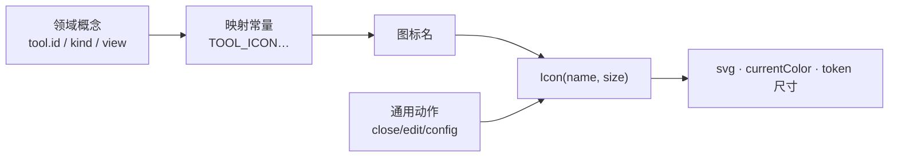

# 统一图标系统（Unified Icon System）

## 0. 文档状态

| 字段 | 内容 |
| --- | --- |
| 状态 | implemented |
| 当前阶段 | 已实现并通过开发验证（66 前端测试含 4 项 Icon 用例；包体 gzip +6.7KB）；待业务验收回 accepted |
| 关联主 SDD | [前端设计纲领 G7/G11/G12](../../../designs/frontend-design-charter.zh-CN.md) · [前端品质提升路线图](../../../roadmaps/20260818-frontend-quality-roadmap.zh-CN.md) |
| 负责人 | Glaux 项目维护者 |
| 最后更新 | 2026-08-19 |

> 状态合法值仅四个：`draft` → `ready` → `implemented` → `accepted`。

## 1. 本 SDD 负责什么

把全前端的**图标语言统一到一套线性 SVG 图标系统**，消除当前"Unicode 符号 + emoji + 少量手绘 SVG"三者并存的杂糅。交付：

1. 一个 `Icon` 组件（尺寸走 token、`currentColor` 着色、默认 `aria-hidden`）；
2. 一层**领域概念 → 图标名**映射（工具、能力类型、右侧栏标签、文件树、通用动作 close/edit/config…）；
3. 一次**清扫**：把散落的 glyph/emoji 全部替换为 `Icon`。

**根因**：当前界面用 `▸◠◡▭⟲ ▣▤ ✦◈▦⚖⊹⇄⧉❋↺ « ☰ ✕ ✎ ⚙` 等符号字符、以及 `📖 📁 👁` 等彩色 emoji 冒充图标——粗细/对齐/风格不统一，是"不像商业级"最直接的静态观感暴露点（违背 G11 秩序之美、G7 仪器质感）。而 `ActivityBar` 已用干净的线性 SVG（24px、`stroke=currentColor`、strokeWidth 1.6），证明"对的图标语言"已在库内，只是没有推广。

## 2. 本 SDD 不负责什么

| 相邻能力 | 归属 |
| --- | --- |
| 后端 `/tasks` 注册表里 `tool.glyph` 字段的存废与语义 | 后端 / [SDD 04](../04-unified-annotation-toolbox/README.md)。本 SDD 前端改为按 `tool.id` 映射图标、不再渲染后端 glyph 串；字段本身不动（§14） |
| 品牌标识 `OwlLogo`（枭） | 保留自绘，非通用图标，不纳入本系统（§16 D-3） |
| 图标承载的交互语义（点了做什么） | 各功能 SDD。本 SDD 只换"长相"，不改行为 |
| 语义色 / 状态色规则 | 前端设计纲领 + `tokens.css`。图标一律 `currentColor`，颜色由上下文类名决定，本 SDD 不引入图标专属色 |
| 加载 spinner 的动效纪律 | 纲领 §5 / SDD 无。本 SDD 仅可把 `⟳` 字形替换为图标形态（见 §17） |

## 3. 当前阶段目标

- 引入选定图标库（§17 确认）与 `Icon` 封装；
- 建立领域概念 → 图标映射，替换 §8 清单列出的全部 glyph/emoji 站点；
- 图标尺寸走 `--icon-*` token、颜色 `currentColor`；装饰图标 `aria-hidden`，交互图标载 `aria-label`；
- 观感至少持平、实为提升；主题切换时图标随 `currentColor` 自动适配。

## 4. 输入来源

| 输入 | 说明 |
| --- | --- |
| 领域数据 | `tool.id`（cursor/bbox/polygon/brush/reset，SDD 04 统一工具集）、`capability.kind`（skill/model/dataset/…）、`FocusRightView`（stage/files/atlas）等——映射为图标名的键 |
| 图标库 | 选定库（推荐 `lucide-react`，见 §16 D-1）提供的 SVG 图标组件集 |
| 设计 token | 新增 `--icon-sm/md/lg` 尺寸阶（见 §9） |

## 5. 输出结果

| 输出 | 约束 |
| --- | --- |
| `Icon` 组件渲染 | 输出 `<svg>`，`width/height` = token，`stroke/fill` = `currentColor`；`aria-hidden` 或 `aria-label` |
| 概念映射表 | `TOOL_ICON` / `KIND_ICON` / `TAB_ICON` / 通用 `ICONS` 常量——单一真相源 |
| 无后端输出、无接口变更、无事件 | 纯前端呈现层 |

## 6. 核心流程

## 7. 交互规则（可直接转验收）

- **R1 单一图标系统**：全前端只用一套图标库；不得再新增 Unicode 符号或 emoji 充当 UI chrome 图标。
- **R2 currentColor 着色**：图标不自带颜色，一律 `currentColor`，随上下文文本色/语义类名变化——主题切换零改。
- **R3 token 尺寸**：图标尺寸只取 `--icon-sm/md/lg`，组件内禁止写死像素。
- **R4 无障碍**：装饰性图标 `aria-hidden="true"`；图标即唯一可视标签的交互控件（如纯图标按钮）必须有 `aria-label` 或 `title`。
- **R5 emoji 清零**：UI chrome（按钮、标签、状态、卡片）中不出现彩色 emoji（`📖📁👁` 等）。（正文/用户内容中的 emoji 不在此列。）
- **R6 观感不回退**：替换后每处图标语义等价、对齐规整；线宽/尺寸与 `ActivityBar` 现有 SVG 语言一致。
- **R7 数据化映射**：`tool.id`→图标为前端常量（与 SDD 05 键位映射同构，随 04 工具集迁移，D-2）；不在渲染点内联散写。

## 8. 涉及页面和组件（清扫清单）

| 站点 | 当前 glyph | 概念 |
| --- | --- | --- |
| `StatusBar` TOOL_GLYPH | `▸ ◠ ◡ ▭ ⟲` | 工具 cursor/bbox/polygon/brush/reset（SDD 04 合入后按统一集重打键；文案改查注册表） |
| `StagePanel` / `Editor` / `ViewerChrome` | `tl.glyph`（后端串） | 工具（改按 id 映射；SDD 04 合入后工具条统一收在 `ViewerChrome`） |
| `FocusSidePanel` TABS | `▣ ▤ 📖` | 右侧栏 stage/files/atlas |
| `FocusTopBar` | `📁`、`⚙` | 图像上下文标签（SDD 01 v1.2 起只读）、连接配置 |
| `SideBar` KIND_GLYPH | `✦ ◈ ▦ ⚖ ⊹ ⇄ ⧉ ❋ ↺ ◇` | 能力类型 10 种 + 兜底 |
| `SideBar` 文件树 | `▤ ▸ ▾ ●` | 文件、展开/折叠 chevron、选中点 |
| `SessionRail` / `AgentConversation` | `« ☰` | 会话栏开合 |
| 通用动作（多处） | `✕ ✎ ⚙ ✦` | 关闭 / 编辑 / 配置 / 星标 |
| `ConnectionConfig` | `👁 ⊘` | 视觉能力 有/无 |
| `AtlasRefCard` | `📖` | 图谱引用 |
| `ErrorBoundary` | `⚠` | 错误标记（可保留或替换，见 §17） |
| `VolumeViewer` | `✓` | 画笔开 |

> 新增：`Icon` 组件 + 映射常量模块。保留：`OwlLogo`（品牌）。可选迁移：`ActivityBar` 手绘 SVG → 统一库（§17）。

## 9. 入参、状态和展示字段

- `Icon` props：`name`（图标标识）、`size?`（`sm|md|lg`，默认 `md`）、`label?`（有则 `aria-label`，无则 `aria-hidden`）、`className?`。
- `tokens.css` 新增：`--icon-sm: 14px` · `--icon-md: 16px` · `--icon-lg: 20px`（与字号阶协调；ActivityBar 大图标 22px 可另设 `--icon-xl` 或保留其局部值）。
- 无后端字段变更；无新增 store 状态。

## 10. 重复执行规则

不适用（纯呈现，无副作用、无幂等问题）。

## 11. 页面状态生命周期

不适用（图标为无状态展示组件）。

## 12. 审计或事件规则

无。

## 13. 空状态、异常状态和权限处理

- 映射缺失（未知 `kind`/`tool.id`）：`Icon` 回退到一个中性兜底图标（替代现 `◇`），不崩、不空白。
- 图标库按需引入（tree-shaking）：只打包用到的图标，不整包引入（见 §16 D-1）。

## 14. 与其他 SDD 的调用关系

- **协同后端 `/tasks` 契约**：`api/types.ts` 的 `tool.glyph` 字段保留（不破坏后端契约），但前端渲染改为按 `tool.id` 映射本地图标；后续如需彻底移除该字段，另在后端/04 立项。
- **依赖** [SDD 04](../04-unified-annotation-toolbox/README.md)：04 换工具集后 `TOOL_ICON` 随新集调整（与 [SDD 05](../05-keyboard-shortcuts-a11y/README.md) 键位映射同源同步）。
- **落地** [前端品质路线图 P3](../../../roadmaps/20260818-frontend-quality-roadmap.zh-CN.md)：图标清扫时，查看器内联样式/裸 hex 顺带收敛（P3 一箭双雕）。

## 15. 验收标准

- [x] UI chrome 中不再出现彩色 emoji（`📖📁👁` 等）——JSX grep 无残留（仅注释/终端日志内的 `→←` 文本箭头保留）。
- [x] §8 清单所列 glyph 站点全部替换为 `Icon`；未知 `kind`/`tool.id` 走 `FALLBACK_ICON`（`Icon.test` 覆盖）。
- [x] 所有图标 `currentColor` 着色（lucide 默认 stroke=currentColor），无写死色值。
- [x] 图标尺寸取自 `--icon-*` token（`.icon-sm/md/lg/xl` 覆盖 lucide 默认 24），组件内无写死图标像素。
- [x] 纯图标交互控件（顶栏 `⚙`、关闭 `✕` 等）具备 `aria-label`/`title`；装饰图标 `aria-hidden`（`Icon` 封装默认）。
- [x] 图标按需引入（tree-shaking），生产包体 gzip 增量 JS +6.1KB / CSS +0.6KB（约 35 图标），可接受。
- [x] `ActivityBar` 手绘 SVG 一并迁移到 lucide，全站图标同一线性家族（stroke 1.6）。
- [x] lint/typecheck/构建净；既有测试不回退（66 通过，含 4 项新 Icon 用例）。

## 16. 决策记录

| 编号 | 决策 | 备选 | 选择理由 | 时间 |
| --- | --- | --- | --- | --- |
| D-1 | 采用 `lucide-react`（MIT，SVG 组件，tree-shakeable） | Codicons（VS Code 图标字体）；自绘全套 SVG | `ActivityBar` 现有图标即 feather/lucide 线性风格（stroke 1.6、24px、currentColor），lucide **与现状一致**；Codicons 是 16px 填充像素网格，会与现有 SVG **冲突**；lucide 为 SVG 组件、无字体加载闪烁、按需打包 | 2026-08-19 |
| D-2 | `tool.id`→图标为前端常量，随 04 工具集迁移 | 渲染后端 `tool.glyph` 串 | 后端 glyph 是符号字符（正是要消除的），且 04 会重定义工具集；前端映射可控、与 05 键位映射同源 | 2026-08-19 |
| D-3 | `OwlLogo` 保留自绘，不纳入图标系统 | 用库图标替代品牌标识 | 品牌标识是身份，非通用图标 | 2026-08-19 |
| D-4 | 图标 `currentColor` + `--icon-*` token 尺寸 | 每处写死颜色/尺寸 | 主题适配零改、尺寸统一（G11） | 2026-08-19 |
| D-5 | 全量统一：§8 全部 glyph/emoji + `ActivityBar` 手绘 SVG 迁移 + spinner `⟳`→`Loader2` + `⚠`→`AlertTriangle` | 只换 glyph/emoji，保留 ActivityBar 两套并存 | 维护者拍板"全站一套"；避免长期两套并存的细微不一致 | 2026-08-19 |

> 备注：D-1 修正了品质路线图初稿"设计资产借鉴"一节里对 Codicons 的初步建议——落到本仓现状后，lucide 才与既有 SVG 语言自洽。路线图该节将同步订正。

## 17. 待确认问题

- 无（依赖与范围已由 §16 D-1/D-5 收敛：采用 lucide-react、全量统一）。
