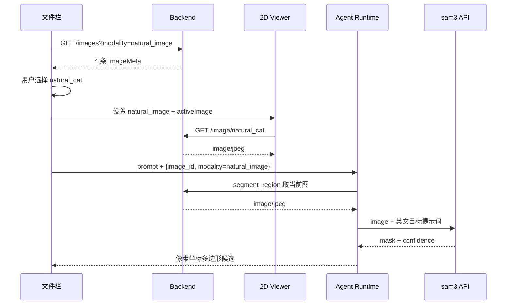
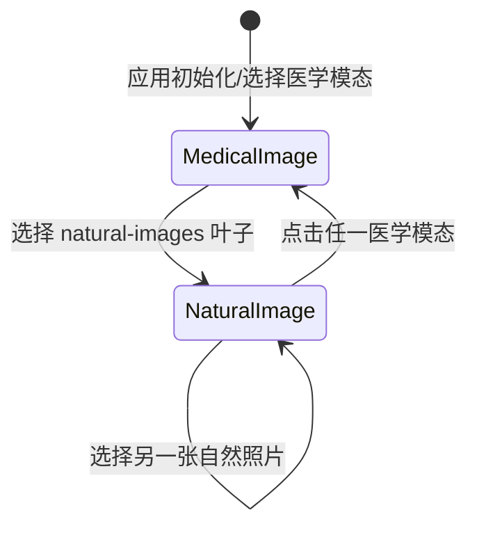

# 自然图像 SAM 演示集合

## 0. 文档状态

| 字段 | 内容 |
| --- | --- |
| 状态 | `implemented` |
| 当前阶段 | 代码与真实 SAM 两图外发验证完成，待建议态标注 UI 验收 |
| 关联主 SDD | [Glaux SDD 索引](../../README.md) |
| 负责人 | Glaux 项目维护者 |
| 最后更新 | 2026-09-23 |

## 1. 本 SDD 负责什么

为 Glaux 增加一组可随仓库分发的真实自然照片，使用户能从文件栏打开照片，并用
[`segment_region`](../02-agent-image-annotation/README.md) 走查 Gitee AI `sam3` 的通用目标分割与建议态标注链路。

本 SDD 冻结自然图像资产、数据发现/取图接口、文件栏选择行为和 Viewer Context 契约。

## 2. 本 SDD 不负责什么

- 不新增 science-core `TaskPlugin`、自然图像测量任务或带单位结果。
- 不改变 `segment_region` 的供应商、mask 解码、错误映射或外发门控；这些由 [SDD 02](../02-agent-image-annotation/README.md) 负责。
- 不实现在线搜索或生产级自然图像数据管理。**任意图片上传与目录导入自 2026-08-31 起由 [SDD 08](../08-data-import-first-explorer/README.md) 负责**（原为本 SDD 的非目标）。
- 不改变 [SDD 04](../04-unified-annotation-toolbox/README.md) 的建议态标注实体和人工确认流。
- 不把自然照片伪装成任何医学模态，也不自动调用 `/task/run`。

## 3. 当前阶段目标

- 加载示例数据（或 `GLAUX_DEV_MODE=1`）后，文件栏展示 4 张真实照片。
- 选择照片后由现有 2D 查看器加载，Agent Runtime 可经 `/image/{id}` 取得同一字节。
- Viewer Context 明确标记 `modality=natural_image`，且不携带医学任务、模型或标定。
- 使用现有 SAM 配置完成至少两张照片的端到端手工走查。

## 4. 输入来源

### 4.1 固定图片资产

图片均存放于 `data/natural/`，固定 ID 与来源如下：

| `image_id` | 文件 | 主体 | 来源页面 | 许可 |
| --- | --- | --- | --- | --- |
| `natural_cat` | `cat.jpg` | 猫 | Wikimedia Commons `File:Cat image.jpg` | CC0 1.0 |
| `natural_coffee` | `coffee.jpg` | 咖啡杯 | Wikimedia Commons `File:Coffee cup seen from above.jpg` | CC0 1.0 |
| `natural_car` | `car.jpg` | 街道上的汽车 | Wikimedia Commons `File:Car on street.jpg` | 美国联邦政府作品，Public Domain |
| `natural_dog` | `dog.jpg` | 公园中的狗 | Wikimedia Commons `File:Dog park and pub with great dane.jpg` | CC0 1.0 |

`data/natural/README.md` 必须记录原始页面、下载 URL、作者、许可和建议英文提示词。

### 4.2 调用输入

- 前端初始化：`GET /images?modality=natural_image`。
- 查看器取图：`GET /image/{image_id}`。
- 会话上下文：当前选中照片的 `image_id`。
- SAM 调用输入与外发权限：完全沿用 SDD 02 §4、§7.2、§7.4。

## 5. 输出结果

### 5.1 数据发现

`GET /images?modality=natural_image` 返回 `ImageMeta[]`：

```json
[
  {
    "id": "natural_cat",
    "center": "Natural images",
    "cf": null,
    "methods": [],
    "modality": "natural_image"
  }
]
```

### 5.2 图片响应

`GET /image/natural_cat` 等返回对应 JPEG 字节与 `image/jpeg`；未知或伪造 ID 返回 404。

### 5.3 前端与 Agent 输出

- 示例数据加载后，文件栏出现这 4 张照片的叶子项。
- 选择后 2D 查看器显示照片，活动对象为对应 `image_id`。
- 标题、HUD、状态栏与 Focus 顶栏不得显示医学任务、`CF` 或医学活动模型；模态切换器标签按 SDD 08 D-3 显示为“通用图像 / General images”（i18n `mod_general_images`）；Focus 顶栏上下文仍显示“自然图像 / Natural images”（i18n `natural_images`）。
- Viewer Context 为 `{ image_id, modality: "natural_image" }`，不含 `task`、`method`、`cubs_cf`、`roi_box`。
- SAM 多边形与建议态标注输出沿用 SDD 02 §5、§12。

## 6. 核心流程



## 7. 核心规则

1. 自然图像是独立模态 `natural_image`，但不是任务；任务注册表不得为它制造占位任务。
2. 自然图像列表与 ID 来自后端固定白名单，前端不得拼本地路径。
3. 选择自然图像必须清空 `activeVolume`、`activeSlide`、ROI、医学 metrics/primitives 和旧标注视图状态。
4. 选择自然图像不得调用 `/task/run`；SAM 只在用户通过会话触发 `segment_region` 时调用。
5. 通用图像作为模态切换器的一个候选出现（有活动数据源时）。**原「文件栏在任意医学模态下都常驻展示 `natural-images/`」已由 [SDD 08](../08-data-import-first-explorer/README.md) §7 规则 13 取代**：示例照片随示例数据显式加载,不再硬编码常驻。
6. `natural_image` 没有 `TaskView` 时，Viewer 使用既有 `raster_2d` 兜底。
7. Agent Viewer Context 不得泄漏残留医学 `task`、`method` 或标定。
8. 图片必须逐张有可再分发许可；来源不清晰的候选不得提交。
9. 自然图像界面不得以 `CF —`、CUBS/HC 任务名或医学活动模型填充空位；无医学字段时直接隐藏。
10. 自然图像尺寸必须进入统一 Annotation 范围校验；越界 bbox/polygon 与医学图像一样返回 422。
11. 缺失、损坏或未知的自然图像不得进入列表，也不得作为统一 Annotation 的目标；请求返回 404/422，不能降级到未知对象的 best-effort 校验。

## 8. 涉及对象

| 对象 | 职责 |
| --- | --- |
| `data/natural/` | 固定照片与许可清单 |
| Backend `Modality` / `ImageMeta` | 暴露 `natural_image` 元数据契约 |
| Backend `/images` | 发现固定自然照片 |
| Backend `/image/{id}` | 按白名单安全返回照片，并向统一标注层提供像素尺寸 |
| Frontend Session Store | 保存 `naturalImages` 与当前自然图像状态 |
| Frontend Explorer | 示例数据加载后渲染自然图像叶子与选择动作 |
| Frontend Viewer Context | 向 Agent Runtime 发无医学任务的当前图上下文 |
| `segment_region` | 沿用现有 SAM 取图和分割链路，不改契约 |

## 9. 数据或字段要求

### 9.1 `Modality`

后端 Pydantic 契约与前端 TypeScript 联合类型都增加字面量 `natural_image`。

### 9.2 自然图像 `ImageMeta`

| 字段 | 类型 | 必填 | 值/约束 | 来源 |
| --- | --- | --- | --- | --- |
| `id` | string | 是 | `natural_cat` 等固定白名单 ID | 后端自然图像适配器 |
| `center` | string | 是 | `Natural images` | 后端固定值 |
| `cf` | null | 是 | 恒为 `null`，无医学标定 | 后端固定值 |
| `methods` | string[] | 是 | 恒为空数组 | 后端固定值 |
| `modality` | string | 是 | 恒为 `natural_image` | 后端固定值 |

### 9.3 前端状态

| 字段 | 类型 | 约束 |
| --- | --- | --- |
| `naturalImages` | `ImageMeta[]` | 与医学 `images` 分开保存，初始化加载 |
| `modality` | `Modality` | 选自然照片时为 `natural_image` |
| `activeImage` | `string \| null` | 自然照片选中时为固定白名单 ID |

不新增数据库表、持久化字段、事件 payload 或迁移。

## 10. 重复执行规则

- 自然图像列表按固定 ID 稳定排序；重复请求返回相同顺序与元数据。
- 重复选择同一照片只重载同一活动对象，不追加列表项，不触发医学任务。
- 重复调用 `segment_region` 的行为、建议态 annotation ID 规则沿用 SDD 02 §10。

## 11. 页面状态生命周期



- 进入 `NaturalImage`：设置 `modality=natural_image`、`activeImage`，清空 3D/WSI 与医学结果状态。
- 离开 `NaturalImage`：复用现有 `switchModality` 加载目标医学模态首个对象。
- 未加载示例数据时文件栏不出现自然图像项；列表为空时不自动选择，也不报全局错误。

## 12. 审计或事件规则

- 本功能不新增事件类型。
- 本地列图、取图和选择不写外发审计。
- 真正调用 SAM 时继续遵守 SDD 02 §12 的外发审计规则，不记录图片内容或 API key。

## 13. 异常和人工处理

| 场景 | 系统行为 | 用户感知 |
| --- | --- | --- |
| 某固定文件缺失/格式不支持 | 不出现在列表；直接请求返回 404 | 目录中不显示该项 |
| 未知或路径穿越 ID | 404，不读取任意文件 | 图片无法打开 |
| 对未知或损坏自然图像创建标注 | 422，不写入 Annotation Store | 显示目标图像无效 |
| 自然图像列表为空 | 返回空数组 | 无活动数据源时按 SDD 08 渲染空态卡，不影响医学模态 |
| SAM 外发未开启/token 缺失 | `segment_region` 不注册 | 会话中无该工具能力 |
| SAM 超时、额度不足、零命中 | 沿用 SDD 02 §13 | 显示现有明确错误/空结果提示 |

图片下载失败或许可页与预期不符时，由开发者更换为同类 CC0/Public Domain 照片，并先更新本 SDD §4 与决策记录。

## 14. 与其他 SDD 的调用关系

- 依赖 [02-agent-image-annotation](../02-agent-image-annotation/README.md)：`segment_region`、外发门控、SAM 契约、建议态工具结果与错误处理由其负责；本 SDD 只补真实自然图像输入。
- 依赖 [04-unified-annotation-toolbox](../04-unified-annotation-toolbox/README.md)：自然图像上的 polygon 建议沿用统一 Annotation 实体、渲染与确认流。
- 不修改 science-core 任务注册表；因此与 CT、WSI、IMT、HC TaskPlugin 无调用关系。

## 15. 验收标准

- [x] `GET /images?modality=natural_image` 返回 4 个固定 ID，字段符合 §5.1/§9.2。
- [x] 4 个 `/image/{id}` 均返回非空 JPEG；未知 ID 与 `../` 类伪造 ID 不读取文件并返回 404。
- [x] 自然图像上的越界 bbox/polygon 被 `/annotations` 以 422 拒绝，合法像素坐标可创建建议态标注。
- [x] 缺失、损坏或未知自然图像不进入列表，且不能作为 `/annotations` 的目标。
- [x] 加载示例数据（或 `GLAUX_DEV_MODE=1`）后文件栏显示这 4 张照片；未加载时不显示。
- [x] 选择任一自然照片后挂载 2D Viewer，显示正确照片且 `modality=natural_image`。
- [x] 选择自然照片不调用 `/task/run`，并清空此前医学 metrics/primitives/3D/WSI 状态。
- [x] 自然图像 Viewer Context 精确为当前 `image_id` + `natural_image`，不含医学 `task`、`method`、`cubs_cf`、`roi_box`。
- [x] Workbench 与 Focus 中自然图像显示双语模态标签，且不显示 `CF`、医学任务名或医学活动模型。
- [x] 在外发开关和 token 已配置时，至少两张照片可通过英文名词提示获得 `segment_region` 多边形候选。
- [ ] 至少一个 SAM 候选可经 `propose_annotation` 显示为建议态，并可人工确认或驳回。
- [x] 外发关闭时 `segment_region` 仍不注册，选择自然照片本身不产生外发请求。
- [x] `data/natural/README.md` 对 4 张照片逐一记录来源、作者、许可与测试提示词。

开发侧验证（2026-08-25）：

| 分类 | 结果 |
| --- | --- |
| 已完成 | Backend `183 passed`；Frontend `145 passed`；Agent Runtime `160 passed`；三服务健康检查通过；Vite 代理与 4 条自然图像元数据/取图接口通过；Gitee AI `sam3` 真实两图调用通过：`natural_cat` / `cat` 命中 1 区域（confidence `0.9575`，159 点），`natural_coffee` / `coffee cup` 命中 1 区域（confidence `0.7275`，49 点） |
| 未完成 | 无代码实现项 |
| 无法验证 | `propose_annotation` 卡片显示及人工确认/驳回仍需在浏览器会话中手工走查 |

## 16. 决策记录

| 编号 | 决策 | 备选 | 选择理由 | 时间 |
| --- | --- | --- | --- | --- |
| D-1 | 使用独立 `natural_image` 数据集合 | 混入 CUBS/HC；仅前端静态资源 | 避免错误医学上下文，并保持前端与 Agent Runtime 共用 `/image/{id}` | 2026-08-25 |
| D-2 | 不新增自然图像 TaskPlugin | 增加空任务或 SAM 任务 | SAM 需要用户文本目标，不是 science-core 校准测量任务 | 2026-08-25 |
| D-3 | 文件栏常驻自然图像目录（已由 SDD 08 D-4 取代：示例数据需显式加载） | 只在单独模态页显示 | 用户可从任意医学场景快速切入 SAM 测试，且无需伪造任务切换项 | 2026-08-25 |
| D-4 | 资产选 Wikimedia Commons 的 CC0/Public Domain 照片 | Unsplash/Pexels；软件包测试图 | 逐张许可页稳定、来源与作者可审计、允许仓库再分发 | 2026-08-25 |
| D-5 | 固定 4 个白名单 ID | 任意扫描目录路径映射 | 演示资产范围小；固定映射最易阻断路径穿越并保持测试稳定 | 2026-08-25 |
| D-6 | 自然图像隐藏医学 HUD 字段 | 用 `—` 占位 | `CF —` 或 caroSegDeep 会让 SAM 测试看起来仍属于医学测量，造成错误认知 | 2026-08-25 |

## 17. 待确认问题

无。范围、资产、接口、页面状态与验收标准均已收敛。
