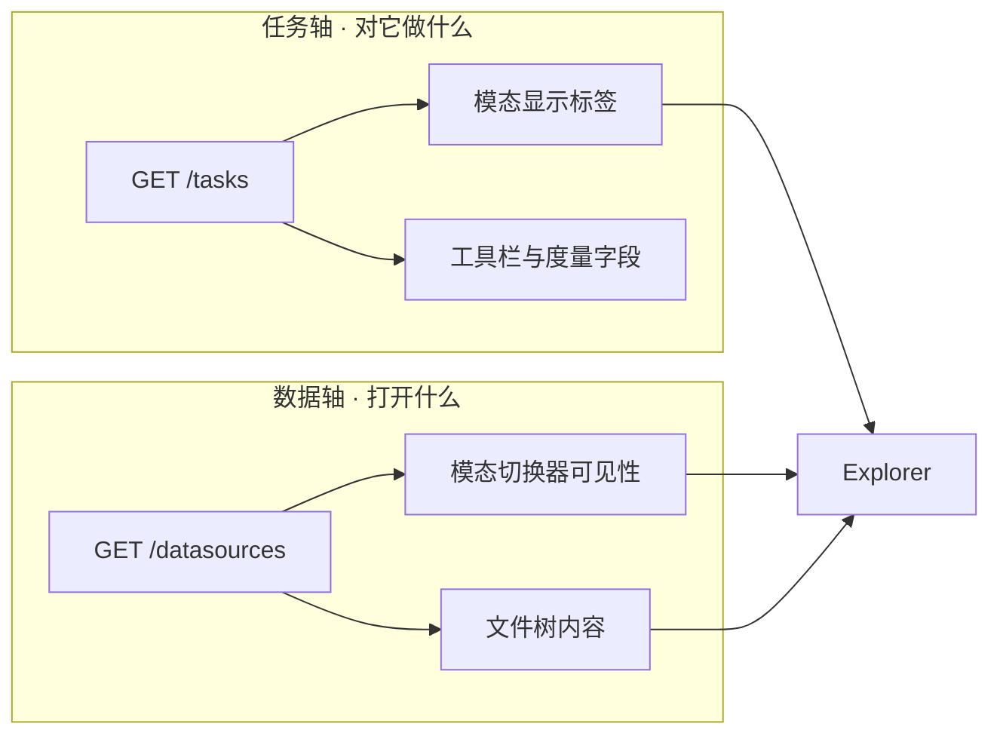
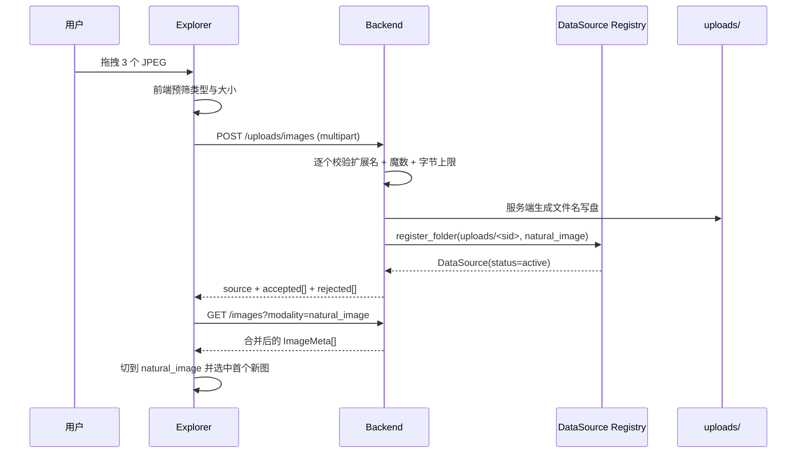
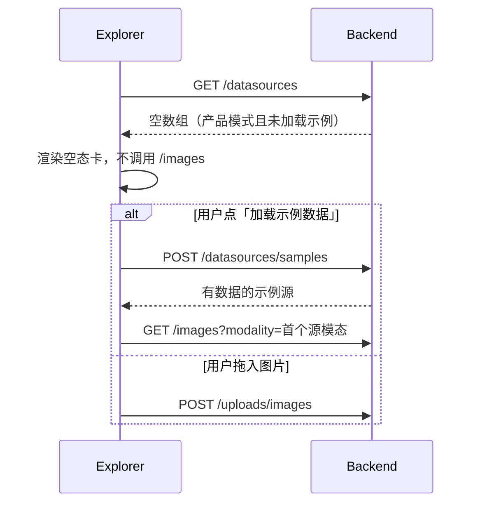
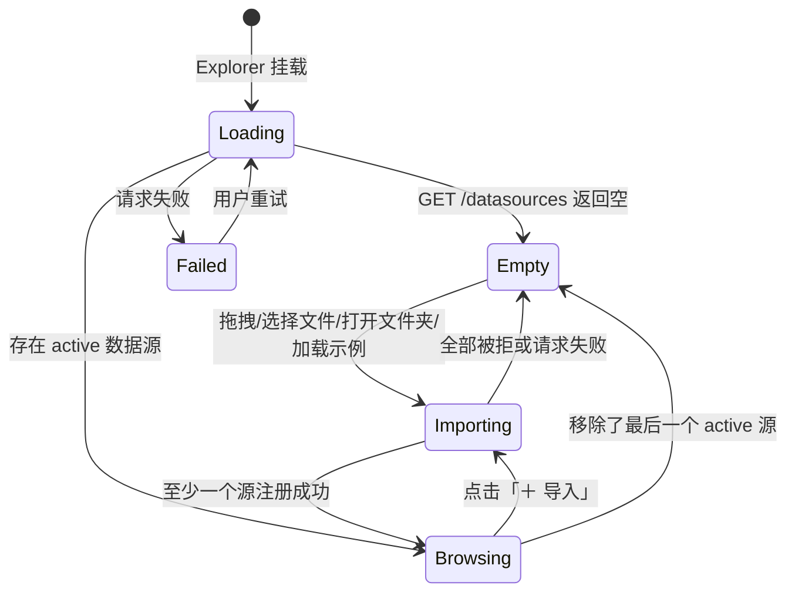

# 数据导入优先的文件栏

## 0. 文档状态

| 字段 | 内容 |
| --- | --- |
| 状态 | `implemented` |
| 当前阶段 | 代码完成并通过开发侧走查（见 §15 自查）；业务验收待维护者确认后转 `accepted` |
| 关联主 SDD | [Glaux SDD 索引](../../README.md) |
| 负责人 | Glaux 项目维护者 |
| 最后更新 | 2026-08-30 |

## 1. 本 SDD 负责什么

把 Glaux 文件栏从「展示仓库自带演示数据」改为「先让用户把自己的图像放进来」，并把混在一起的两根轴拆开：**数据轴**（打开什么）由数据源注册表决定，**任务轴**（对它做什么）由 science-core 任务注册表决定。

本 SDD 冻结四件事：

1. Explorer 的空态与导入入口（打开服务端文件夹 / 浏览器上传 / 加载示例数据 / 最近使用）。
2. 新的浏览器图像上传接口 `POST /uploads/images` 及其安全边界。
3. 模态切换器的可见性来源由 `/tasks` 改为 `/datasources`。
4. `GLAUX_DEV_MODE` 缺省值由 `1` 翻为 `0`，示例数据改为显式加载。

## 2. 本 SDD 不负责什么

- 不新增 science-core `TaskPlugin`，不改任务注册表内容，也不改 `/tasks` 契约本身。
- 不放开医学模态（`carotid_imt` / `fetal_hc`）的文件夹导入；本期医学导入仍限 `pathology` / `ct_abdomen`，且仍走「服务端文件夹路径」而非浏览器上传（决策 D-5）。
- 不支持通过浏览器上传 WSI / NIfTI 等大体积医学卷（决策 D-5）。
- 不改 `segment_region`、SAM 供应商、外发门控或建议态标注流；见 [SDD 02](../02-agent-image-annotation/README.md) 与 [SDD 04](../04-unified-annotation-toolbox/README.md)。
- 不改 `/images?modality=carotid_imt` 在无数据源时回退合成 mock 的既有语义（见 §7 规则 9）。
- 不实现多数据源并存选择、云端连接器、数据集版本管理或权限模型。
- 不做导入图像的自动分类、缩略图生成或元数据抽取。

## 3. 当前阶段目标

- 无任何活动数据源时，Explorer 首屏是导入引导，而不是四个演示数据集。
- 用户可以在浏览器里直接把 JPEG / PNG 拖进 Explorer 完成导入，无需接触服务端文件系统。
- 上传后的图像与仓库自带演示图走**同一条** `/images` / `/image/{id}` 契约，Agent Runtime 无需改动即可取到。
- 模态切换器只显示「当前真的有数据」的模态；选中通用图像时有对应 tab 高亮（修复现存不一致）。
- 开发者仍可通过 `GLAUX_DEV_MODE=1` 或「加载示例数据」一键回到今天的演示状态。

## 4. 输入来源

### 4.1 用户输入

| 入口 | 输入 | 约束 |
| --- | --- | --- |
| 拖拽 / 文件选择器 | 一批本地图像文件 | JPEG 或 PNG；单文件 ≤ 32 MiB；单次 ≤ 20 个文件 |
| 打开服务端文件夹 | 服务端路径 + 模态 | 路径须在 `GLAUX_DATASETS_ROOT`（缺省 `~/glaux_datasets`）下；模态限 `pathology` / `ct_abdomen` |
| 加载示例数据 | 无 | 仅注册 `config` 内置根中**确实有数据**的模态 |
| 最近使用 | 无 | 从浏览器本地记录读取 |

### 4.2 服务端输入

- 内置示例根：`config.DATA_ROOT` / `HC18_ROOT` / `CT_ROOT` / `WSI_ROOT` / `NATURAL_ROOT`。
- 导入源白名单根：`datasource_registry.datasets_root()`。
- 上传落盘根：`datasource_registry.datasets_root() / "uploads"`。
- 已落盘的导入源清单：`sources.json`。

### 4.3 环境开关

| 变量 | 旧缺省 | 新缺省 | 含义 |
| --- | --- | --- | --- |
| `GLAUX_DEV_MODE` | `1` | `0` | `1` 时内置示例源自动可见（今天的行为）；`0` 时须显式加载示例 |
| `GLAUX_DATASETS_ROOT` | `~/glaux_datasets` | 不变 | 导入与上传的允许根 |
| `GLAUX_UPLOAD_MAX_BYTES` | 不存在 | `33554432` | 单文件上限（32 MiB） |
| `GLAUX_UPLOAD_MAX_FILES` | 不存在 | `20` | 单次请求文件数上限 |

## 5. 输出结果

### 5.1 上传接口

`POST /uploads/images`（`multipart/form-data`，字段名 `files`，可重复）

```json
{
  "source": {
    "id": "imported-3f2a9c11",
    "name": "上传 · 2026-08-30 14:05",
    "modality": "natural_image",
    "root": "/home/zhentai/glaux_datasets/uploads/imported-3f2a9c11",
    "origin": "imported",
    "calibration": {},
    "status": "active"
  },
  "accepted": [
    { "id": "nat-3f2a9c11-8b1d0e42", "filename": "IMG_0042.JPG", "bytes": 2483910 }
  ],
  "rejected": [
    { "filename": "scan.tiff", "reason": "unsupported_type" }
  ]
}
```

- `accepted[].id` 是后续 `/image/{id}` 的稳定 ID，由服务端派生，**不含**任何客户端文件名片段。
- `rejected[].reason` 取值：`unsupported_type` | `too_large` | `corrupt`。
- 全部文件被拒时返回 `422`，不创建数据源。

### 5.2 数据源列表

`GET /datasources` 契约不变（`DataSourceInfo[]`）。变化仅在于：`GLAUX_DEV_MODE=0` 时返回值不含 `origin=builtin` 的条目，直到用户加载示例。

`POST /datasources/samples` 返回 `DataSourceInfo[]`（本次注册成功的示例源）。

### 5.3 图像发现

`GET /images?modality=natural_image` 返回内置白名单图（若示例已加载）**与**全部已导入 `natural_image` 源下的图，合并后按「示例在前、导入源按注册顺序、源内按文件名」稳定排序。

导入图的 `ImageMeta`：

```json
{
  "id": "nat-3f2a9c11-8b1d0e42",
  "center": "上传 · 2026-08-30 14:05",
  "cf": null,
  "methods": [],
  "modality": "natural_image"
}
```

### 5.4 前端输出

- 无活动数据源 → Explorer 渲染空态卡（标题 + 三个入口），不渲染任何目录树。
- 有活动数据源 → 渲染「最近使用」区（非空时）+ 目录树，Explorer 头部常驻「＋ 导入」按钮。
- 模态切换器只渲染有活动数据源的模态；`natural_image` 标签为「通用图像 / General images」。

### 5.5 模态切换器的窄列排版（决策 D-9）

Explorer 会被放进很窄的容器：Workbench 侧栏缺省 260px，Focus 浏览器列缺省 240px
（[SDD 01](../01-dual-mode-shell/README.md) §9）。横向分段在这个宽度下会折行成小方块。

阈值随候选数变化，而不是一个固定宽度——「够不够横排」取决于每枚分段能分到多少像素：

| 条件 | 排版 |
| --- | --- |
| 容器宽度 ≥ 候选数 × 120px | 横向分段 |
| 否则 | **纵向单列**，每行一枚模态 |

即 2 个候选 ≥ 240px 即可横排，5 个候选要 ≥ 600px。120px 是最长模态标签
（`细胞核检测 (病理 WSI)`）单行放得下的宽度；低于它横排必然折行，那正是要消除的形态。

硬约束，两种排版都适用：

- 判据是**容器宽度与候选数**，不是外壳模式——两种外壳都可能窄，也都可能被拖宽。
- 任何宽度下都不截断标签、不横向滚动、不把候选藏进滚动区（藏起来的选项等于不存在）。
- 无论排版如何，当前模态始终有可见的选中态。

## 6. 核心流程

### 6.1 两根轴的关系



改动要点：`/tasks` 不再决定**有没有**这个 tab，只决定这个 tab **叫什么**。

### 6.2 浏览器上传



### 6.3 首次进入（空态）



## 7. 核心规则

1. **可见性来自数据源，标签来自任务注册表。** 前端不得再用 `/tasks` 判断某模态是否应出现在切换器里。
2. 模态切换器只显示至少有一个 `status=active` 数据源的模态；候选少于 2 个时不渲染切换器（沿用现状）。
3. `natural_image` 在任务注册表中没有 `TaskPlugin`，其切换器标签取前端 i18n 常量，不得为它伪造任务。
4. 无任何活动数据源时，Explorer 只渲染空态，**不得**调用 `/images` / `/volumes` / `/slides` / `/task/run`。
5. 上传只接受 JPEG 与 PNG，且必须同时通过扩展名与文件头魔数校验；魔数不符按 `corrupt` 拒绝。
6. **客户端文件名一律不进入文件系统路径。** 服务端为每个接受的文件生成落盘名与图像 ID；原始文件名只回显在响应与 UI 中。
7. 图像 ID 形如 `nat-<source_hash8>-<file_hash8>`，由「数据源 id + 源内相对文件名」确定性派生；同一文件重复列举得到同一 ID。
8. 上传目录必须落在 `datasets_root()/uploads/` 下，并复用 `register_folder` 的白名单校验；越界一律 422。
9. 某模态无活动数据源时，后端既有的 mock 回退与 503 语义不变；由前端规则 4 保证不会走到那里。
10. 移除导入源只做注销，**不删除磁盘文件**；UI 必须明示这一点（决策 D-6）。
11. 「加载示例数据」只注册内置根中 `config.root_has_data` 为真的模态；空目录不注册、不报错。
12. 最近使用记录只存在浏览器本地，不落服务端、不进任何接口契约；引用的对象已不存在时静默剔除。
13. 示例数据（含 SDD 07 的 4 张自然照片）在 `GLAUX_DEV_MODE=0` 且未加载示例时不出现在文件栏（决策 D-4，覆盖 SDD 07 §7.5）。
14. 上传失败、部分失败、越限均不得让 Explorer 进入不可恢复状态；已接受的文件保留，被拒的逐条列出原因。

## 8. 涉及对象

| 对象 | 职责 | 变更类型 |
| --- | --- | --- |
| `backend/app/routers/uploads.py` | `POST /uploads/images`：校验、落盘、注册数据源 | 新增 |
| `backend/app/upload_store.py` | 落盘目录、文件名与图像 ID 派生、魔数校验 | 新增 |
| `backend/app/datasource_registry.py` | `MODALITIES` 增 `natural_image`；`dev_mode()` 缺省翻 0；新增 `register_builtin_samples()` | 修改 |
| `backend/app/dataset_natural.py` | 列图/取图从「内置白名单」扩为「内置白名单 + 导入源」 | 修改 |
| `backend/app/routers/api.py` | 新增 `POST /datasources/samples`；`/images`、`/image/{id}` 自然图像分支接入导入源 | 修改 |
| `backend/app/schemas.py` | 新增 `UploadResult` / `UploadAccepted` / `UploadRejected` | 修改 |
| `backend/app/config.py` | 新增上传上限环境变量 | 修改 |
| `frontend/src/components/SideBar.tsx` | `ModalitySwitch` 改数据源驱动；Explorer 空态、拖拽区、最近使用、头部「＋ 导入」 | 修改 |
| `frontend/src/components/ImportPanel.tsx` | 统一导入面板（上传 / 文件夹路径 / 加载示例） | 新增 |
| `frontend/src/data/actions.ts` | `uploadImages` / `loadSamples` / `refreshDataSources` / 最近使用读写 | 修改 |
| `frontend/src/store/session.ts` | `recentItems` 状态与 setter | 修改 |
| `frontend/src/api/client.ts` 与 `types.ts` | 上传与示例加载调用、`UploadResult` 类型 | 修改 |
| `frontend/src/i18n/zh.ts` 与 `en.ts` | 空态、上传、示例、通用图像标签文案 | 修改 |
| `scripts/dev/run-backend.sh` 等开发脚本 | 显式置 `GLAUX_DEV_MODE=1`，保持开发体验不变 | 修改 |

## 9. 数据或字段要求

### 9.1 `POST /uploads/images` 请求

| 字段 | 类型 | 必填 | 约束 |
| --- | --- | --- | --- |
| `files` | multipart 文件，可重复 | 是 | 1 ≤ 个数 ≤ `GLAUX_UPLOAD_MAX_FILES`；单个 ≤ `GLAUX_UPLOAD_MAX_BYTES` |
| `name` | form 字段 | 否 | 数据源展示名；缺省为 `上传 · <本地时间>` |

模态固定为 `natural_image`，**不接受**客户端指定（决策 D-2）。

### 9.2 `UploadResult` 响应

| 字段 | 类型 | 必填 | 约束 |
| --- | --- | --- | --- |
| `source` | `DataSourceInfo` | 是 | 本次写入的数据源；重复上传到同一目录时为更新而非新建 |
| `accepted` | `UploadAccepted[]` | 是 | 至少一条（全拒时接口返回 422） |
| `accepted[].id` | string | 是 | 匹配 `^nat-[0-9a-f]{8}-[0-9a-f]{8}$` |
| `accepted[].filename` | string | 是 | 客户端原始文件名，仅用于回显 |
| `accepted[].bytes` | int | 是 | 落盘字节数 |
| `rejected` | `UploadRejected[]` | 是 | 可为空数组；逐条给出原因 |
| `rejected[].filename` | string | 是 | 客户端原始文件名 |
| `rejected[].reason` | enum | 是 | `unsupported_type` 或 `too_large` 或 `corrupt` |

### 9.3 `natural_image` 图像 ID

| 来源 | ID 形态 | 稳定性 |
| --- | --- | --- |
| 内置示例（SDD 07） | `natural_cat` 等固定白名单 | 由 SDD 07 冻结，不变 |
| 导入源 | `nat-<source_hash8>-<file_hash8>` | 同源同文件名恒定；源被移除后 ID 失效返回 404 |

两类 ID 空间不重叠：内置 ID 不以 `nat-` 前缀开头。

### 9.4 前端状态

| 字段 | 类型 | 约束 |
| --- | --- | --- |
| `datasources` | `DataSourceInfo[]` | 已存在；本 SDD 起成为模态可见性的唯一依据 |
| `recentItems` | `RecentItem[]` | 最多 10 条，最近在前 |
| `RecentItem` | `{ modality, id, label, at }` | `at` 为 ISO 8601 字符串 |

`recentItems` 持久化键：`glaux.recent.v1`（`localStorage`）。读取到非法 JSON 或结构不符时按空数组处理，不抛错。

不新增数据库表、事件 payload 或迁移。

## 10. 重复执行规则

- 同一批文件重复上传到同一数据源：文件按内容覆盖同名落盘文件，`accepted[].id` 不变，数据源不重复创建（`register_folder` 已按解析后路径生成确定性 id）。
- `POST /datasources/samples` 幂等：重复调用不产生重复源，仅刷新状态。
- `GET /images?modality=natural_image` 重复请求返回相同顺序与相同 ID 集合。
- 重复点击同一「最近使用」项只重载同一对象，不追加记录，只更新其 `at` 并前移。

## 11. 页面状态生命周期



- `Loading`：显示骨架，不渲染空态文案（避免闪烁）。
- `Failed`：显示错误与重试按钮，**不得**降级为空态卡。
- `Empty`：只渲染空态卡；不调用任何数据端点。
- `Importing`：入口按钮置忙，允许取消返回上一态；已接受文件不回滚。
- `Browsing`：正常文件树 + 最近使用 + 头部导入按钮。

## 12. 审计或事件规则

- 本功能不新增事件类型，不产生外发请求。
- 上传是本地服务端写盘操作，仅记录常规访问日志；**不得**记录文件内容。
- 数据源注册/注销沿用 `sources.json` 落盘，即为其审计痕迹。

## 13. 异常和人工处理

| 场景 | 系统行为 | 用户感知 |
| --- | --- | --- |
| 上传非 JPEG/PNG | 该文件计入 `rejected`，`reason=unsupported_type` | 列出被跳过的文件与原因 |
| 扩展名合法但魔数不符 | `rejected`，`reason=corrupt` | 同上 |
| 单文件超上限 | `rejected`，`reason=too_large` | 提示上限值 |
| 单次文件数超上限 | 整体 `422`，不写盘 | 提示一次最多 N 个 |
| 全部文件被拒 | `422`，不创建数据源 | 停留在导入态，可重试 |
| 磁盘写入失败 | `500`，已写入的部分文件保留但不注册数据源 | 提示导入失败，可重试 |
| 服务端文件夹路径越界 | `422`（沿用 `register_folder`） | 提示须在允许根下 |
| 加载示例但内置根无数据 | 返回空数组，`200` | 提示未发现示例数据，仍停留在空态 |
| 移除最后一个数据源 | 回到 `Empty` 态 | 显示空态卡，不报错 |
| 最近使用指向已删除对象 | 该条静默剔除并持久化 | 列表中消失 |
| `GET /datasources` 失败 | 进入 `Failed` 态 | 显示错误与重试按钮，不伪装成空态 |

## 14. 与其他 SDD 的调用关系

- **覆盖** [07-natural-image-sam-demo](../07-natural-image-sam-demo/README.md)：
  - 该 SDD §2 的「不实现任意图片上传、目录导入」边界由本 SDD 接管。
  - 该 SDD §7.5「文件栏在任意医学模态下都展示 `natural-images/`」被本 SDD §7 规则 13 取代——示例照片改为随示例数据一起显式加载。
  - 4 张固定白名单照片的 ID、许可与取图安全边界**保持不变**，仍由 SDD 07 负责。
  - 实现时必须同步修订 SDD 07 §2 / §7.5 与根 README 状态说明。
- 依赖 [02-agent-image-annotation](../02-agent-image-annotation/README.md)：上传图经同一 `/image/{id}` 供 Agent Runtime 取字节，`segment_region` 无需改动。
- 依赖 [04-unified-annotation-toolbox](../04-unified-annotation-toolbox/README.md)：上传图上的标注沿用统一 Annotation 实体与范围校验（图像尺寸越界仍 422）。
- 不修改 science-core 任务注册表，因此与 IMT / HC / CT / WSI 的 `TaskPlugin` 无契约变更。

## 15. 验收标准

后端：

- [x] `POST /uploads/images` 上传 2 个合法 JPEG 后返回 `accepted` 两条、`rejected` 空，且 `source.status=active`。
- [x] 上传 `.tiff` 返回 `rejected[].reason=unsupported_type`；上传改名为 `.jpg` 的文本文件返回 `reason=corrupt`。
- [x] 上传单个超过 `GLAUX_UPLOAD_MAX_BYTES` 的文件返回 `reason=too_large`，且不落盘。
- [x] 单次上传超过 `GLAUX_UPLOAD_MAX_FILES` 个文件返回 422，且 `uploads/` 下无新增文件。
- [x] 客户端文件名为 `../../etc/passwd` 时，落盘路径仍在 `datasets_root()/uploads/` 下，返回 ID 匹配 `^nat-[0-9a-f]{8}-[0-9a-f]{8}$`。
- [x] 同一批文件重复上传到同一数据源，`GET /datasources` 条目数不增加，`accepted[].id` 与首次一致。
- [x] `GET /images?modality=natural_image` 同时返回内置白名单图（示例已加载时）与上传图，重复请求顺序一致。
- [x] `GET /image/{上传ID}` 返回对应字节；删除该数据源后同一 ID 返回 404。
- [x] `GLAUX_DEV_MODE` 未设置时 `GET /datasources` 返回不含 `origin=builtin` 的条目。
- [x] `GLAUX_DEV_MODE=1` 时 `GET /datasources` 与本改动前的返回值一致。
- [x] `POST /datasources/samples` 连调两次，`GET /datasources` 中示例源不重复。
- [x] 内置根均无数据时 `POST /datasources/samples` 返回 `200` 与空数组，不抛异常。

前端：

- [x] `GET /datasources` 返回空数组时，Explorer 渲染空态卡，且测试断言未发起 `/images`、`/volumes`、`/slides`、`/task/run` 任一请求。
- [x] `GET /datasources` 失败时渲染错误与重试，不渲染空态文案。
- [x] 只有 `natural_image` 有活动源时，模态切换器不渲染（候选 < 2）；选中通用图像时不出现「无 tab 高亮」状态。
- [x] 同时存在 `natural_image` 与 `pathology` 活动源时，切换器渲染两个候选，通用图像标签为「通用图像 / General images」。
- [x] 任务注册表有但无活动数据源的模态，不出现在切换器中。
- [x] 切换器候选无论多少，标签均完整渲染（不截断、不省略号），当前模态有选中态。
- [ ] 5 个候选时：容器 240px 为纵向单列，拖到 600px 以上变回横向分段且不折行；2 个候选时 240px 即横排。两种排版下容器均无横向滚动（浏览器走查）。
- [x] 拖入 2 个 JPEG 后自动切到 `natural_image` 并选中首个新图，文件树出现对应叶子。
- [x] 上传部分被拒时，逐条显示被拒文件名与原因，已接受的图正常出现在树中。
- [x] 移除最后一个数据源后回到空态卡，无未捕获错误。
- [x] 移除导入源的确认文案明示「不会删除磁盘上的文件」。
- [x] 打开过的对象出现在「最近使用」，最多 10 条、最近在前；刷新页面后仍在。
- [x] `localStorage` 中 `glaux.recent.v1` 被写入非法 JSON 时，Explorer 正常渲染且最近使用为空。
- [x] 中英文两种语言下空态、上传结果与错误文案均无缺 key。

跨组件：

- [x] 上传图作为当前对象时，Agent Viewer Context 为 `{ image_id, modality: "natural_image" }`，不含医学 `task` / `method` / `cubs_cf` / `roi_box`。
- [x] Agent Runtime 经 `/image/{上传ID}` 可取到与浏览器一致的字节。
- [x] 上传图上的越界 bbox/polygon 仍被 `/annotations` 以 422 拒绝。
- [x] `scripts/dev/run-backend.sh` 启动的开发后端行为与本改动前一致（示例数据默认可见）。

开发侧验证（2026-08-31）：

| 分类 | 结果 |
| --- | --- |
| 已完成 | Backend `214 passed`（3 项既有失败与本 SDD 无关，见下）；Frontend `187 passed`；Agent Runtime `171 passed` 回归无变化；ruff / eslint / tsc 全绿。浏览器走查覆盖：产品模式空态首屏、经文件选择器真实上传两图（自动选中首图上舞台、浏览器列不被关闭）、连续切图、分隔条两端夹持（240/480，舞台 479px ≥ 360）、加载示例数据后 5 模态出现、移除源确认文案、刷新后 `browserView`/`browserW`/最近使用保持；跨组件经 HTTP 验证上传图取图 200、越界 bbox 422、未知 `nat-*` 404 |
| 未完成 | 无（§15 范围内） |
| 无法验证 | ① 切换器排版的**自动**重排：预览工具的视口模拟既不触发 `window.resize` 也不触发 `ResizeObserver`（已用新装监听器实测两者均 0 次回调），手动派发 `resize` 后降级/恢复与分档均正确，真实浏览器不存在此限制；② `segment_region` 端到端：SAM 外发开关与 token 均已就绪，但会话需要已配置的 VLM 模型连接，本次未配 |

走查中发现并修复的缺陷（各补一条回归用例）：

1. `_dims_for` 只认 `natural_` 前缀，上传图的 `nat-` ID 落进「未知对象 → 跳过范围校验」的
   best-effort 分支，越界 bbox 被静默接受（201 而非 422）——违反 SDD 07 §7.11。
2. `prunedRecent` 把「列表为空」当成「对象不存在」，启动期列表尚未加载完就把有效的最近记录
   永久剔除并写回 `localStorage`。
3. 移除数据源的确认文案（D-6 要求明示不删磁盘文件）i18n 键已定义但未接线。

## 16. 决策记录

| 编号 | 决策 | 备选 | 选择理由 | 时间 |
| --- | --- | --- | --- | --- |
| D-1 | 模态切换器可见性改由 `/datasources` 决定，标签仍取自 `/tasks` | 继续由 `/tasks` 全权决定；新增专门的「可见模态」端点 | 任务注册表是静态能力清单，天然与「用户有没有数据」无关。今天二者被强行合并，直接后果是选中自然图像时四个 tab 全不高亮 | 2026-08-30 |
| D-2 | 浏览器上传固定归入 `natural_image`，不接受客户端指定模态 | 新增 `user_image` 模态；让用户在上传时选模态 | `natural_image` 已经是「无 TaskPlugin、无标定、走 raster_2d 兜底」的通用图像通道，语义完全吻合；再开一根轴会让前端多一处等价分支 | 2026-08-30 |
| D-3 | UI 标签由「自然图像」改为「通用图像 / General images」 | 保持「自然图像」 | 用户上传的可能是自己的截图、示意图或非演示照片，「自然图像」是学术用语且会误导；线上契约值 `natural_image` 保持不变以免破坏兼容 | 2026-08-30 |
| D-4 | `GLAUX_DEV_MODE` 缺省翻为 `0`，示例数据（含 SDD 07 的 4 张照片）改为显式加载 | 保持缺省 `1`；只对医学示例生效、自然照片仍常驻 | 新用户首屏应当是「把你的数据放进来」。若自然照片仍常驻，空态永远不为空，引导入口失去位置。开发脚本显式置 `1` 保证开发体验不回退 | 2026-08-30 |
| D-5 | 本期医学模态导入维持现状（服务端文件夹路径 + 仅 `pathology`/`ct_abdomen`） | 医学模态也支持浏览器上传文件夹 | 大体积 WSI/NIfTI 的分片上传、目录结构重建与标定回填是独立难题，塞进本期会同时放大工作量与出错面 | 2026-08-30 |
| D-6 | 移除导入源只注销、不删磁盘文件 | 一并删除上传目录 | 删除用户数据是不可逆操作，不应作为一次点击的副作用；代价是磁盘残留，由 UI 明示换取安全 | 2026-08-30 |
| D-7 | 图像 ID 由服务端确定性派生，客户端文件名不进入路径 | 用清洗后的原始文件名作 ID | 沿用 SDD 07 D-5 的同一条防线：任何用户字符串都不参与文件系统路径拼接，路径穿越在结构上不可能 | 2026-08-30 |
| D-8 | 「最近使用」只存浏览器本地 | 存服务端并进 `/datasources` 契约 | 最近使用是单机浏览习惯而非项目事实，落服务端会引入无谓的多端一致性问题 | 2026-08-30 |
| D-9（2026-08-30，实机走查后补） | 模态切换器窄列改**纵向单列**，判据是「容器宽度 ≥ 候选数 × 120px」，用 CSS 容器查询 + 候选数属性实现 | 下拉选择器；横向滚动；折行分段 | ① 原生 `<select>` 的箭头由系统绘制，与 [feats/06](../06-icon-system/README.md) 的统一线性图标语言冲突——[SDD 01](../01-dual-mode-shell/README.md) D14 正是为此把顶栏选择器换掉的，这里不该再引回来；② 横向滚动会把候选藏起来，藏起来的选项等于不存在，而这个控件的全部价值就是「让你看见有哪些模态」；③ 折行分段是现状，正是它挤成小方块；④ 纵向单列多占约 5 行高度，但换来全部候选可见、标签不截断、零新增控件；⑤ 用容器查询而非外壳模式判断：两种外壳都可能窄也都可拖宽，绑外壳会立刻出现「拖宽了还是竖着」的错配；⑥ 阈值随候选数变化而非固定值：实测 384px 下 5 个候选仍在折行，固定阈值只是把问题挪到另一个宽度 | 2026-08-30 |

## 17. 待确认问题

无。范围、接口契约、ID 规则、页面状态与验收标准均已收敛。
