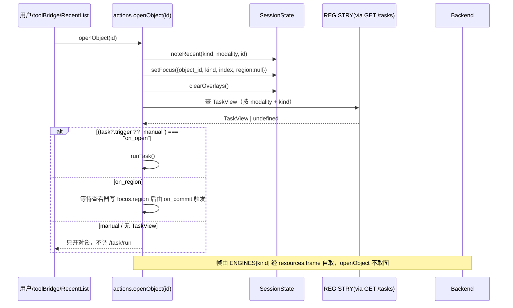
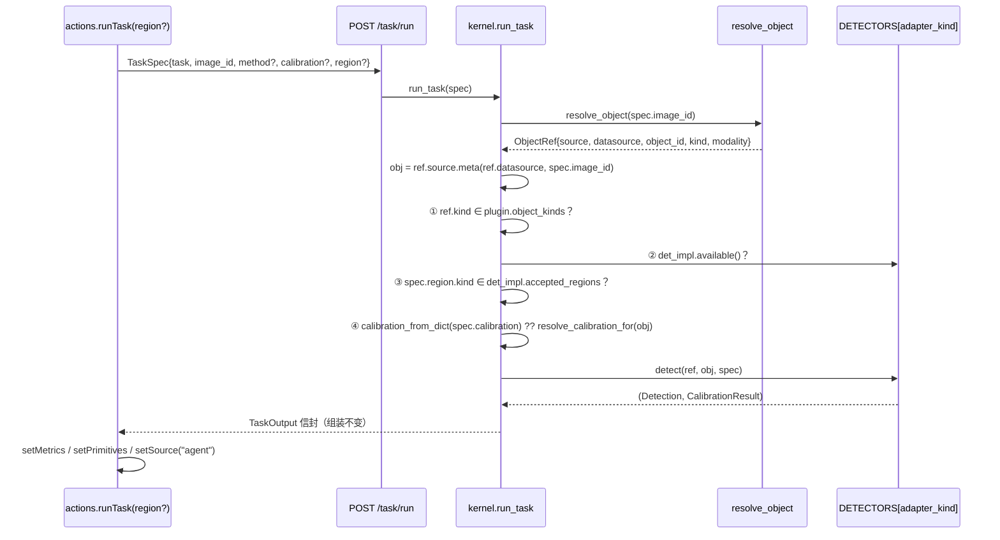
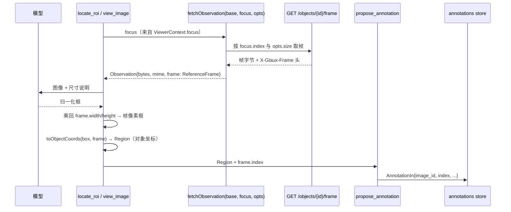
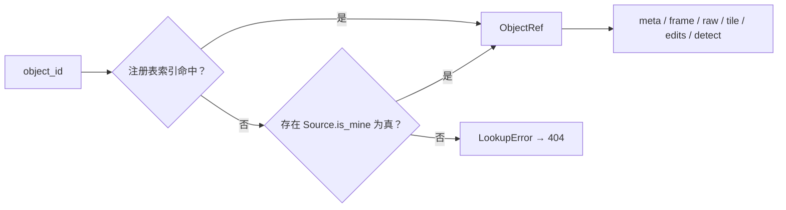
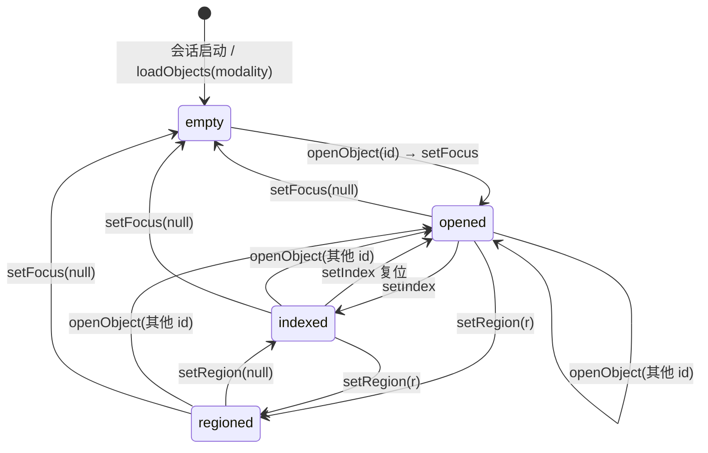

# 10 · 视觉对象与数据源收敛

## 0. 文档状态

| 字段 | 内容 |
| --- | --- |
| 状态 | `draft` |
| 当前阶段 | W0 立起契约冻结稿；§17 的 Q1～Q5 全部关闭后转 `ready`，转 `ready` 后方可进入 W1 |
| 上游依据 | [模态通用化技术债审计](../../../todo/2026-09-18-001-code-review-modality-generalization.zh-CN.md)（`kind: record`，§7 目标抽象、§8 分波计划） |
| 过程证据 | `docs/todo/2026-09-18-002-object-convergence-execution-log.zh-CN.md`（`kind: record`，W0 产出；承载 grep 基线、零改清单、手工回归签字表） |
| 关联主 SDD | [Glaux SDD 索引](../../README.md) |
| 波次口径 | 本 SDD 冻结的契约覆盖 W0～W7；波次编号与审计 §8.2 一一对应，不另行划分 |
| 负责人 | Glaux 项目维护者 |
| 最后更新 | 2026-09-23 |

## 1. 本 SDD 负责什么

Glaux 每接入一个模态，同一个语义就在三层各多出一份并列副本。「当前打开的对象」在前端是三个互斥槽（`frontend/src/store/session.ts:226-229` 的 `activeImage` / `activeVolume` / `activeSlide`，外加 `wsiRoi`），在后端是前缀正则加 `is_*` 谓词加 mock 回退三套并列的 ID 判别约定（`backend/app/routers/api.py:364-382`），在 agent-runtime 是两个摊平的领域字段（`agent-runtime/src/contracts.ts:94-101` 的 `cubs_cf` / `roi_box`）。同样的复制发生在元数据（`cf` / `voxel_spacing_mm` / `mpp_um` / `dims` 四个并列可空字段）、表征端点、查看器选择与工具装配上。接第六个模态（视频）时，若不先收敛，就是照抄第六份副本。

本 SDD 冻结七件事：

1. **六个跨层名词的定义权**：`ObjectMeta`、`Focus`、`Calibration`、`Region`、`ReferenceFrame`、`Index` 的字段、取值与三端同名镜像规则（见 §9）。
2. **`ObjectKind` 与 `modality` 的分界**：`kind` 是几何族（引擎、解码与校验的分派键），`modality` 是数据集路由键，二者不得互相顶替（见 §7）。
3. **三张后端表**：`SOURCES`（键 modality，数据轴）、`DETECTORS`（键 adapter_kind，动作轴）、`REGISTRY`（键 task，任务轴，只追加 `object_kinds` / `trigger` / `classes` 三个字段，不新增行）的职责切分。
4. **四个前端注册面**：`ENGINES`（键 `ObjectKind`）、`PAINTERS`、`CHROME_SEGMENTS`、`registerTaskTool`，以及 runtime 的 `TOOL_PROVIDERS`。
5. **`/objects` 表征面**：`GET /objects/{id}`、`GET /objects/{id}/frame`、`GET /objects/{id}/raw`、`GET /objects/{id}/tiles/{level}/{col}/{row}`、`POST /objects/{id}/edits` 五个端点及其错误语义（见 §5、§13）。
6. **两个动作的语义**：`openObject(id)` 与 `runTask(region?)`，含 `trigger = task?.trigger ?? "manual"` 的显式 no-task 契约（D-18）。
7. **过渡物的形态与删除时点**：旧四字段由 `SourceBase` 单侧回填、旧端点退 alias、`ViewerContext` 旧字段映射，全部在 W7 清除（D-10）。

## 2. 本 SDD 不负责什么

以下条目的素材取自审计 §7.9「明确不采纳」与 §8.7「非目标」，逐条给出归属。

- **不引入插件层**：不建插件框架、不建四端同名 pack 目录、不写 `check-packs.py`、不引入 `packs.json`、不做 `plugins/` 目录迁移，也不做 entry_points 与前端动态 `import()` 的运行期加载。插件化的产物只是「每张注册表 + 一行」（D-1）。
- **不做视频自动跟踪**：不含 `TrackDetector`、`segment_video.py`、`REGISTRY` 的 `track_objects` 行、`track_region` 工具、`SegmenterPort.track`，也不定死 Track/Event 两个新原语与逐帧编辑语义。真实跟踪任务出现后在 [SDD 04](../04-unified-annotation-toolbox/README.md) 修订中补。
- **不重写 `REGISTRY`**：`TaskPlugin` 与 `REGISTRY` 保持单文件单一事实源，只追加 `object_kinds` / `trigger` / `classes` 三个字段并为既有各行补能力位，不新增任务行；不由包合并生成，也不为 natural_image / video 造空行（D-18）。
- **不改数据轴入口**：`GET /images?modality=` 的路径与查询参数不动，也不新建 `GET /objects` 列表端点（D-5）；[SDD 08](../08-data-import-first-explorer/README.md) 中的「冻结」改读作「路径与查询参数冻结，响应体按本 SDD 演进」。
- **不做 `image_id` → `object_id` 改名**：`TaskSpec.image_id` 与 `AnnotationIn.image_id` 是 [SDD 04](../04-unified-annotation-toolbox/README.md) 冻结的写契约与落盘字段名（D-8）。
- **不规范化既有对象 id**：不改 `tech_` / `hc_` / `ct_` / `slide_` / `natural_` / `nat-` 的拼写与前缀，只建注册表索引（D-7）。
- **不重写 science-core 既有实现**：measurement 纯函数、`segmentation/base.py` 的 `Adapter` ABC、Detection/Measurement/TaskOutput 三信封结构均不动；后端 `Detector` 与 `Adapter` 同名字空间但不继承（D-12）。
- **不新建公共验证器端点**：不做 `POST /task/verify`，不搬迁复现验证按钮，只把 `GET /wsi/{slide_id}/verify` 的实现收进 `Detector.verify`（见 §5.3）。
- **不做实时视频播放、转码与流媒体**：第一版是逐帧 StackViewport，零新引擎。
- **不定义视频理解的观测形状**：时间以秒寻址、长视频的分层导航、音画按时间区间同步交付、模型时序发现的记录原语，均不在本 SDD 范围。本 SDD 只负责把音轨**声明**出来并保留取流入口（D-23），消费形状另立 SDD 11「视频理解 harness」，见 §17。
- **不把非模态插件纳入范围**：工作台、舞台、图谱、分割与测量工具的插件化与对象抽象正交，落点是 `edition.ts`、`ToolProvider`、`CHROME_SEGMENTS`，另立 SDD。
- **不处理与模态无关的既有债**：net-guard SSRF、edition 门控本身、atlas 选择器、会话压缩不在本 SDD 范围。
- **不重做文档摸排，也不把过程证据写进活文档**：grep 基线、git diff 零改清单、手工回归签字表一律进执行记录 record，本 SDD 正文只写最新结论。

## 3. 当前阶段目标

本 SDD 冻结的契约覆盖 W0～W7 八个波次。波次口径、依赖与安全中断点如下。依赖与审计 §8.2 逐字对应；标题取审计标题冒号（或括号）前的短名，冒号后的范围落在本表「交付边界」列。

| 波 | 标题 | 依赖 | 交付边界 | 波末安全中断点状态 |
| --- | --- | --- | --- | --- |
| W0 | 安全网、契约冻结与文档上游 | — | 测试改绑语义不变量；本 SDD 与 SDD 04 §7.4 修订稿就位 | 产品代码未变（仅两处注释），测试与文档已就位 |
| W1 | 后端数据轴塌缩 | W0 | `SOURCES` + `resolve_object` + `ObjectMeta`，同波注册 VideoSource 数据轴 | 旧字段由 `SourceBase` 回填，前端与 runtime 零改，视频在数据轴可见 |
| W2 | 后端动作轴与表征面 | W1 | `DETECTORS` + `run_task` 公共前缀 + `/objects` 端点族 + 标注库迁移 | 旧端点 alias 双通，前端与 runtime 零改 |
| W3 | 前端状态与动作收敛 | W1、W2 | 一个 `Focus`、一张对象表、三个动作；内部走三拍 | 引擎仍是三份但只读 props；波内 PR 之间不是安全点 |
| W4 | 查看器引擎收敛 | W3 | `ENGINES` 按 `ObjectKind` + 三注册面 + 画笔宿主合一 | 引擎收敛完成或按 D-21 降级，三注册面就位 |
| W5 | agent 上下文、观测通道与工具注册面 | W2、W3 | `ViewerContext` 收敛为五字段；`fetchObservation` + `TOOL_PROVIDERS` | agent 观测通道打通，旧字段映射仍在 |
| W6 | 视频表征落地 | W4、W5 | 能看、能标、能被 agent 观测；关闭 D6、D7 | 过渡物仍在，系统完整可发布 |
| W7 | 过渡物清除 | W6 | 删过渡字段、端点 alias、`ViewerContext` 旧字段、`TaskPlugin.viewer`、`Detection.roi_used` | 过渡物清除，CI grep 门禁由统计转阻断 |

阶段目标按以下口径判定：

- **视频是协议验收，不是能力考核**。W1 用 VideoSource 检验 `SOURCES` 协议是否真的做到「第六个模态零改核心文件」；W6 只承诺「能看、能标、能被 agent 观测」，不承诺跟踪、播放或转码能力。视频以「无 `TaskView` 的模态」形态与 natural_image 同形走完 Source → 表征 → 观测全链路。
- **过渡物只活到 W7**。逐项过渡物的引入波次与过渡期形态见 §11.3；删除是 W7 的独立准出项，不随发行周期延后，若 W7 前置不满足而顺延，必须在本节登记新时点（D-10）。
- **验收以 W1、W2、W6、W7 四波为准**。W1、W2 判定后端两根轴是否收敛为单一入口，W6 判定第六个模态是否零 `=== "video"` 走通全链路，W7 判定并列副本是否真正消失且 CI 门禁转阻断。W0、W3、W4、W5 的门禁是过程性准出，其证据入执行记录 record，不构成本 SDD 的业务验收条件。
- **W4 允许降级**。若 CS3D mock `RenderingEngine` smoke 测试在 W0 做不出，引擎合并降为「只抽纯函数 + 共用 hooks + 手工回归清单」，合并顺延为独立立项，不阻塞 W5～W7（D-21）。

## 4. 输入来源

本节冻结输入边界：哪些东西喂进对象收敛这一层，形态是什么，约束由谁保证。审计是设计输入而非运行时输入，其结论经本 SDD 转写后即以本 SDD 为准。

运行时输入分三类：数据源输入（谁提供字节）、对象输入（哪个 id 指向哪个对象）、任务与编辑输入（对对象做什么）。三类输入的字段语义统一以 §9.1／§9.2 的类型草图为准，本节只写入口、形态与约束。

### 4.1 数据源输入

数据源轴由 `SOURCES`（键为 modality）承接。每个 `Source` 实现把一个 `dataset_*.py` 模块包装成对象，模块内既有函数体零改。`MODALITIES = tuple(SOURCES)`，取代 `backend/app/datasource_registry.py:32` 的五元组字面量。

| 入口 | 输入 | 约束 |
| --- | --- | --- |
| `SOURCES[modality].probe(root)` | 一个数据根目录 `Path` | 取代 `backend/app/config.py:119` `root_has_data` 的模态 if 阶梯；返回 `False` 即该源在 `GET /datasources` 标 unavailable，不得抛异常 |
| `SOURCES[modality].list_ids(source)` | 一个 `DataSource` | 返回该源下全部对象 id；同时是 `resolve_object` 索引的构建输入（见 §4.2） |
| `SOURCES[modality].formats` | 无 | `tuple[tuple[str, bytes, int], ...]`，即 `(后缀, 魔数, offset)`；是 `backend/app/upload_store.py:20` `_MAGIC` 与 `GET /datasources` 的 `importable` 的唯一来源，取代 `backend/app/routers/uploads.py` 固定模态 `natural_image` 的写法 |
| `SOURCES[modality].detect_calibration(root)` | 数据根目录 | 取代 `backend/app/datasource_detect.py:56-61` 的 `pathology`／`ct_abdomen` 两条模态 if；探测不出返回 `{}`，落为 `status=needs_calibration`，不得出假值 |
| `SOURCES[modality].builtin_sample()` | 无 | 返回 `DataSource \| None`，取代 `backend/app/datasource_registry.py:92` `_builtin_specs` 的硬编码列表；provider／license 在此提供 |
| `SOURCES[modality].invalidate()` | 无 | 取代 `backend/app/caches.py` 的 `_CACHED` 模块级缓存；数据源注册／删除时逐 Source 调用 |
| `dev_mode()` 下显式注册 | 环境开关，见 `backend/app/datasource_registry.py:68` | 合成源 `synthetic-us`、`synthetic-hc` 只在 `dev_mode()` 为真时进入 `SOURCES`；非开发态无数据即空态，不存在 mock 隐式回退 |

浏览器上传与服务端目录导入是同一张表的两个入口：`POST /uploads/images` 的落盘目标必在导入白名单根之下，模态由 `formats` 与 `probe` 推断而非客户端指定；`POST /datasources` 的 `modality` 必须命中 `SOURCES` 键，否则 422。

### 4.2 对象输入

对象输入是一个字符串 id。`resolve_object(object_id) -> ObjectRef` 是唯一解析入口，取代现状散落的三套判别约定（`dataset_ct.is_ct`、`dataset_wsi.is_wsi`、`backend/app/routers/api.py:364` `GET /image/{image_id}` 里的 `startswith(("natural_", "nat-"))`）。解析算法见 §6.5。

| 入口 | 输入 | 约束 |
| --- | --- | --- |
| 注册表索引 | `id → ObjectRef` 映射 | 主路径。由各 `Source.list_ids` 在 register／seed／invalidate 时重建；命中即返回，不做前缀猜测 |
| `Source.is_mine(object_id)` | 对象 id | 仅在索引未命中时遍历兜底（D-7）；任一 Source 认领即返回该 `ObjectRef` |
| 未命中 | 对象 id | `LookupError` → HTTP 404。**无 mock 回退**：未知 id 一律 404，不得由合成图吞掉 |
| 既有 id 拼写 | `tech_`／`hc_`／`ct_`／`slide_`／`natural_`／`nat-` | 原样保留，不规范化（D-7）；新源（含 `vid-`）一律服务端派生 id |
| `Index` 越界 | `ObjectMeta.check_index(index)` | 越界 → `ValueError` → 422；取代 `backend/app/routers/annotations.py` 的 `_dims_for` 阶梯 |

`ObjectRef{source, datasource, object_id, kind, modality}` 是解析结果，供 `/objects/*` 与 `run_task` 共用；它不是下发契约，不出现在任何响应体中。

### 4.3 任务与编辑输入

任务轴的单一事实源仍是 `glaux_core.tasks.REGISTRY`（键为 task），本 SDD 不新增任务、不为无任务模态造空行（D-18）。本节只规定送入任务轴的请求形态。

| 入口 | 输入 | 约束 |
| --- | --- | --- |
| `POST /task/run` | `TaskSpec{task, image_id, method, calibration, region}` | 字段名 `image_id` 保留，语义为对象 id（D-8）；`region` 为判别联合，`box` 语义固定为 `(x0, y0, x1, y1)`（D-9） |
| `TaskSpec` 过渡字段 | `cubs_cf`、`roi`、`roi_box` | 过渡一版，由 validator 映射为 `calibration{mm_per_px}`／`region{column_window}`／`region{box}`；映射时 warn 并计数，W7 删除 |
| `POST /task/measure` | `TaskMeasureRequest` 的 `cf` → `calibration` | 收 `Calibration` 而非恒为 `mm_per_px` 的浮点（现状 `backend/app/schemas.py` `cf: float = Field(gt=0)` 对 CT／WSI 必错）；未知 `Calibration.kind` → `HardReject` |
| `POST /objects/{id}/edits` | `EditRequest{task, method, base_seq, ops}`，`EditOp{index, class_id, mode, mask_png}` | `task`／`method` 由前端从 `TaskView` 取，不得为常量；`base_seq` 是乐观并发输入，冲突 409 |
| 任务能力门控 | `TaskPlugin.object_kinds`、`trigger`、`classes`、`capabilities` | `run_task` 用 `object_kinds` 门控几何族，不做 modality 相等比较（D-13）；`trigger` 取值 `on_open\|on_region\|manual`，缺任务时按 `manual`（D-18） |
| 区域门控 | `Detector.accepted_regions` | `spec.region.kind` 不在其中 → 422；由 `run_task` 公共前缀统一判定，Detector 不重复校验 |

## 5. 输出结果

产出契约是 `/objects` 表征面：一个对象的元数据与其全部表征字节都从这一族端点取，前端与 agent-runtime 不再拼路径、不再按模态挑端点。列表面不动，仍是 `GET /images?modality=`（D-5）。

### 5.1 ObjectMeta 下发形态

`ObjectMeta` 在 `backend/app/schemas.py` 定义，frontend `frontend/src/api/types.ts` 与 `agent-runtime/src/contracts.ts` 逐字镜像。字段语义与取值约束见 §9.1／§9.3，本节只给下发形态与端点侧约定。

```json
{
  "id": "ct_0001",
  "kind": "volume",
  "modality": "ct_abdomen",
  "source_id": "amos-ct",
  "display_name": "AMOS 0001",
  "axes": [
    { "name": "x", "size": 512, "spacing": 0.68, "unit": "mm" },
    { "name": "y", "size": 512, "spacing": 0.68, "unit": "mm" },
    { "name": "z", "size": 120, "spacing": 5.0, "unit": "mm" }
  ],
  "calibration": { "kind": "voxel_mm", "value": [0.68, 0.68, 5.0], "source": "nifti_header", "provenance": {} },
  "resources": {
    "frame": "/objects/ct_0001/frame",
    "raw": "/objects/ct_0001/raw"
  },
  "methods": [{ "name": "totalsegmentator_v2", "role": "agent" }],
  "meta": {},
  "cf": null, "voxel_spacing_mm": [0.68, 0.68, 5.0], "mpp_um": null, "dims": [512, 512, 120]
}
```

下发约定：

- `resources` 是服务端下发的 URL 模板，`frame` 必有，`raw`／`tiles` 按 kind 存在与否给出；缺席即该表征不可用。前端与 runtime **只读 `resources`，不得自行拼接路径**，`frontend/src/api/client.ts:123` `volumeUrl` 与 `:136` `wsiTileUrl` 因此删除。
- `tiles` 模板含 `{level}/{col}/{row}` 三个占位段，仅 `kind="slide"` 下发。
- `audio` 仅在 `streams[]` 含 `kind="audio"` 时下发，是为音频观测保留的取流入口。**本 SDD 只冻结键名与下发条件，不冻结该端点的请求与响应形状**（区间取样、与帧的时间对齐属观测形状，见 §17 与 SDD 11）；在 SDD 11 冻结前该键不得被消费（§7 规则 22）。
- `axes` 的轴序固定：`image` 为 `[x,y]`，`volume` 为 `[x,y,z]`，`slide` 为 `[x,y,level]`，`video` 为 `[x,y,t]`。
- 过渡字段 `cf`／`voxel_spacing_mm`／`mpp_um`／`dims` 由 `SourceBase` 从 `axes`／`calibration` 统一回填，服务端只有一套真相（D-10）；前端 lint 禁读，W7 删除。`ImageMeta = ObjectMeta` 别名同期删除。
- 同一个 `ObjectMeta` 同时是 `GET /images?modality=` 列表元素与 `GET /objects/{id}` 响应体，两处逐字段等价。

### 5.2 `/objects` 端点族

新建 `backend/app/routers/objects.py`。五个端点内部全部走 `resolve_object`，无任何模态 if。错误码全表见 §13，本节只列端点特有约束。

| 方法 | 路径 | 请求 | 响应 | 取代了什么 | 何时删除 alias |
| --- | --- | --- | --- | --- | --- |
| GET | `/objects/{id}` | 无 | `ObjectMeta`（见 §5.1） | `GET /volumes`、`GET /slides` 的元数据用途 | 两个列表 alias 于 W7 删除 |
| GET | `/objects/{id}/frame` | 查询参数 `z`、`t`、`level`、`roi`、`size`、`window` | 单帧 `image/png`（`window` 缺省时按源类型可为 `image/jpeg`），响应头 `X-Glaux-Frame` | `GET /image/{id}` 的表征用途；CT／WSI 此前无统一取帧面 | `/image/{id}` **有意保留**，见 §5.3 |
| GET | `/objects/{id}/raw` | 无 | 原始字节流 `application/octet-stream` | `GET /volume/{id}` 的 NIfTI 流 | W7 |
| GET | `/objects/{id}/tiles/{level}/{col}/{row}` | 路径段 | `image/jpeg` 瓦片 | `GET /wsi/{slide_id}/tile/{level}/{col}/{row}` | W7 |
| POST | `/objects/{id}/edits` | `EditRequest{task, method, base_seq, ops}` | 编辑结果信封（含新 `base_seq`） | `POST /volume/{id}/mask-edit` 与其 `task` Literal、`VolumeMaskEditRequest` | W7 |

`GET /objects/{id}/frame` 的参数约束：

| 参数 | 类型 | 取值范围 | 约束 |
| --- | --- | --- | --- |
| `z` | int | `0 ≤ z < axes[z].size` | 仅 `kind="volume"` 接受；越界 422 |
| `t` | int | `0 ≤ t < axes[t].size` | 仅 `kind="video"` 接受；越界 422 |
| `level` | int | `0 ≤ level < axes[level].size` | **`kind="slide"` 强制提供**，缺失 422；其余 kind 提供即 422 |
| `roi` | `x0,y0,x1,y1` | level-0／帧像素，`x0<x1`、`y0<y1` | 语义与 `Region.box` 一致（D-9）；`(x1-x0)*(y1-y0) > 64 Mpx` → 413，不截断、不降采样后静默返回 |
| `size` | int | `64 ≤ size ≤ 4096`，缺省 1024 | 输出图最长边像素上限；`size > 4096` → 413 |
| `window` | `ww,wl` | 两个浮点 | 仅 `kind` 为 `volume`／`image` 且该 `Source` 声明支持窗宽窗位（灰度帧栈）时生效；其余 kind 或源不支持时忽略该参数并按缺省窗位出图；`ww ≤ 0` → 422 |

上表的 `size` 缺省 1024、上限 4096 与 `roi` 的 64 Mpx 阈值为本 SDD 冻结取值；W6 实测如需调整，按 §16 体例新增 `D-23` 起的决策行并同步修订本表、§13 与 §15.1 I 组。

`X-Glaux-Frame` 响应头：

- 取值为 `ReferenceFrame` 的紧凑 JSON（UTF-8、无空格），字段为 `object_id`、`index`、`origin`、`scale`、`width`、`height`，语义见 §9.1。
- `origin` 是该帧左上角在对象 level-0／帧坐标系中的位置，`scale` 是「对象坐标 → 返回图像素」的缩放因子；未裁剪未缩放时为 `origin=[0,0]`、`scale=1`。
- agent-runtime 的 `fetchObservation` 是唯一取图处，其 `Observation.frame` 直接取自本头；`toObjectCoords` 用它把模型输出的像素框换算回 `Region`。
- 四种 `ObjectKind` 各取一帧断言 `origin`／`scale`／`width`／`height`，是 W2 的准出门禁之一。

五个端点的失败分支（未知 id、kind 与端点不符、依赖不可用、超限）一律按 §13 处理，端点侧不另设语义。

### 5.3 保留面与 alias 清单

保留面不改路径、不改查询参数，只换内部分派为 `resolve_object` + `SOURCES`／`DETECTORS`；其响应体随 §5.1 演进。

| 路径 | 处置 | 说明 |
| --- | --- | --- |
| `GET /images?modality=` | 保留 | SDD 08 冻结的数据轴列表入口，返回的本就是 `ObjectMeta`；五分支收为 `SOURCES[m]` 一行，`mock.dataset()` 回退删除 |
| `GET /datasources`、`POST /datasources/samples` | 保留 | 新增下发 `kind`、`label`、`label_key`、`importable` 四字段 |
| `GET /tasks`、`POST /task/run`、`POST /task/measure`、`GET /capabilities` | 保留 | 任务轴面，只换内部分派 |
| `GET /annotations`、`POST /annotations` | 保留 | 增 `index`（`z` 作别名一版）与 `index_from`／`index_to` 过滤 |
| `POST /uploads/images` | 保留 | 魔数表来源改为 `SOURCES[*].formats` |
| `GET /image/{id}` | **有意保留** | 通用图像的既有直取面，前缀判别改 `resolve_object`、删 mock 合成回退；不退 alias、不设删除时点 |
| `GET /wsi/{slide_id}/verify` | **有意保留** | 路径与前端按钮位置不动，内部实现收进 `Detector.verify`；不新立 `POST /task/verify` |
| `GET /volumes`、`GET /slides` | alias 一版 | 内部改 `SOURCES[m].list_ids`，W7 删除 |
| `GET /volume/{id}` | alias 一版 | 内部改 `/objects/{id}/raw`，W7 删除 |
| `GET /volume/{id}/labelmap?task=&method=` | **有意保留** | 任务结果字节面，不属 `/objects` 表征族；URL 由任务输出的 `ref` 模板下发（`backend/app/kernel.py:157`、`backend/app/routers/api.py:273`），前端不拼路径；不退 alias、不设删除时点 |
| `POST /volume/{id}/mask-edit` | alias 一版 | 内部改 `/objects/{id}/edits`，W7 删除 |
| `GET /wsi/{slide_id}/tile/{level}/{col}/{row}` | alias 一版 | 内部改 `/objects/{id}/tiles/{level}/{col}/{row}`，W7 删除 |

alias 期间的硬约束：每条 alias 与其新端点对每个模态返回**同一字节流**（响应头允许新端点多出 `X-Glaux-Frame`）。alias 保留到 W7，前端切到新端点在 W4；W7 删除是独立准出，不随发行周期延后（D-10）。

## 6. 核心流程

本节只画链路与调用次序。端点参数与响应体见 §5，字段语义见 §9，失败分支的错误码见 §13。

### 6.1 三条轴与一个焦点

```mermaid
flowchart LR
    subgraph FE["frontend"]
        STORE["SessionState.focus<br/>唯一焦点"]
        ACT["openObject / runTask / loadObjects"]
        VIEW["Viewer.tsx → ENGINES[kind]"]
    end
    subgraph RT["agent-runtime"]
        VC["ViewerContext{collection,task,method,object,focus}"]
        OBS["fetchObservation → Observation{bytes,mime,frame}"]
        TP["TOOL_PROVIDERS"]
    end
    subgraph BE["backend"]
        RESOLVE["resolve_object(id) → ObjectRef"]
        SRC["SOURCES[modality]<br/>数据轴"]
        DET["DETECTORS[adapter_kind]<br/>动作轴"]
    end
    REG["glaux_core.tasks.REGISTRY<br/>任务轴"]

    ACT --> STORE --> VIEW
    STORE --> VC --> OBS
    ACT -->|POST /task/run| RESOLVE
    OBS -->|GET /objects/{id}/frame| RESOLVE
    RESOLVE --> SRC
    RESOLVE --> DET
    REG --> DET
    REG --> ACT
    TP --> OBS
```

`Focus` 是三端同名的同一个物：前端 store 是唯一写入者，runtime 以 `ViewerContext.focus` 只读消费，backend 以 `TaskSpec.region` 与 `Index` 接收其投影。

### 6.2 打开对象（`openObject`）

现状是四个 select 函数各自一套（`frontend/src/data/actions.ts:164`、`:178`、`:194`、`:205`），差异只有「是否自动跑」与「跑时带哪种 region」。收敛后只剩一条：



触发判定只读 `TaskView.trigger`，无 `TaskView` 的模态（`natural_image`、`video`）走 `"manual"` 缺省，不在 `REGISTRY` 中为其建空行（D-18）。

### 6.3 运行任务（`runTask`）

`runTask(region?)` 取代 `runCurrentTask`（`frontend/src/data/actions.ts:141`）与 `runWsiTask`（`:216`）两份复制。四个入参来源固定：

| 入参 | 来源 | 说明 |
| --- | --- | --- |
| `TaskSpec.image_id` | `focus.object_id` | 字段名 `image_id` 保留，语义为对象 id（D-8） |
| `TaskSpec.calibration` | `activeObject().calibration` | 不再从 `imageMeta.cf` 取单值；为 `null` 时不下发，由后端 `resolve_calibration_for(obj)` 兜底 |
| `TaskSpec.region` | 实参 `region` ?? `focus.region` | 实参用于 `on_region` 提交的即时区域；两者皆空则不下发 |
| `TaskSpec.method` | `activeModel` | 为 `null` 时不下发 |



①～④ 是四个公共前缀，一律在 `run_task` 内完成，`Detector` 实现只负责取数与调用模型；四步的失败映射见 §13。

### 6.4 智能体取观测（`fetchObservation`）

现状是四个看图工具各自拼 `/image/{id}`（`agent-runtime/src/pi/tools/locate-roi.ts:102`），拿到的 PNG 没有任何坐标系信息。收敛后 runtime 只有一个取图口，且观测必然携带 `ReferenceFrame`：



`toObjectCoords` 用 `frame.origin` 与 `frame.scale` 把帧像素还原到对象坐标，这是 CT／WSI／视频三类对象「观测不等于对象本身」的唯一换算处。`frame.index` 原样进 `AnnotationIn.index`，不再假定第三轴是 CT 层号。

### 6.5 后端解析对象 id（`resolve_object`）

现状是「前缀 → `is_hc` → mock 回退」三层猜测（`backend/app/routers/api.py:365`）。收敛后是一个入口、两级查找、一个终态：

1. **查索引**。注册表在 `register_folder` / seed / `invalidate` 时调 `Source.list_ids` 重建 `id → ObjectRef` 索引；命中直接返回 `ObjectRef`。
2. **`is_mine` 兜底**。索引未命中时按注册顺序遍历 `SOURCES`，调 `Source.is_mine(object_id)`；首个为真者构造 `ObjectRef` 返回。该级仅服务于惰性派生 id 的合成源（`synthetic-hc` 等），不作为常规路径。
3. **`LookupError`**。两级都未命中即抛出，路由层统一转 404。**不存在 mock 回退分支**：无数据的模态返回空列表或 404，绝不返回合成图。



`/objects/*` 五个端点、`/task/run`、`/task/measure`、`/annotations` 写入校验与所有退 alias 的旧端点，内部一律先过这一步，之后只通过 `ObjectRef.source` 取数。索引的建立与失效时机见 §11.2。

## 7. 核心规则

以下规则为本 SDD 的判定依据，每条都可用于判断一段代码是否违规。D-n 见 §16。

1. **`kind`、`modality`、`AtlasDescription.modality` 三个词互不替代（D-3）。** `kind` 是几何族（`ObjectKind`，引擎、解码与索引校验的分派键）；`modality` 是数据集路由键（`SOURCES` 与 `objects` 的键，类型为 `string`）；`AtlasDescription.modality` 是成像方法，属图谱领域词表。任何用其中一个的值去查另一个的表、或把一个赋给另一个的字段，即违规；`agent-runtime` 侧用 `ViewerContext.collection` 承接数据集路由键以避撞名。
2. **引擎只由对象几何决定（D-11）。** `ENGINES` 以 `ObjectKind` 为键，`Viewer.tsx` 从 `activeObject().kind` 取引擎、用 `axisFor(meta)` 从 `axes` 派生帧轴。读 `TaskView.viewer` 选引擎即违规（现状 `frontend/src/components/Viewer.tsx:11-30` 正是此形态）；`ENGINES` 缺键时渲染「查看器引擎尚未接入」空态，不得回落到任何缺省引擎。
3. **前端不拼资源路径，一律读 `resources`。** 帧、原始数据与瓦片的 URL 由后端在 `ObjectMeta.resources{frame, raw, tiles}` 中下发模板，前端与 runtime 只做模板填充。在 `frontend/src/api/client.ts` 或任何组件里用字符串拼接构造 `/image/`、`/volume/`、`/wsi/…/tile/` 路径即违规（现状 `client.ts:117`、`:123`、`:136`）。
4. **store 只存 `focus`，对象实体靠 `activeObject()` 反查。** `SessionState` 中不得再有 `activeImage` / `activeVolume` / `activeSlide` / `wsiRoi` 这类按模态分槽的活动对象字段（现状 `frontend/src/store/session.ts:226-229`）。组件需要对象元数据时调 `activeObject(s)`，需要列表时调 `objectsOf(s, modality)`；`focus` 的唯一写入者是 `setFocus` / `setIndex` / `setRegion`，组件不得持有本地的层号或帧号副本。
5. **`Index` 是唯一的索引类型。** 第三轴一律写成 `Index{z?, t?, level?}`，由 `axes` 决定哪一维有意义。新增裸 `z: number` / `t: number` / `frame: number` 参数或字段即违规；`Annotation.z` 作为 `index` 的过渡别名保留一版，不得新增读点。
6. **`Region` 是判别联合，`box` 的四元组语义为 `(x0, y0, x1, y1)`（D-9）。** 坐标系为 level-0 像素（`slide`）或帧像素（其余 `kind`）。用 `[x, y, w, h]` 解释该四元组、或并列保留 `roi` 与 `roi_box` 两个字段即违规；`TaskSpec` 上的 `roi` / `roi_box` 仅由过渡 validator 单向映射为 `Region`，不作为新代码的写入口。
7. **`Calibration.kind` 是开放集，未知 kind 以 `HardReject` 终止（D-16）。** 标定一律经 `calibration_from_dict` 构造、经 `resolve_calibration_for(obj)` 派发。对 `kind` 做穷举 `Literal` 校验、或在未知 kind 时取缺省值继续计算，均违规。前端对未知 kind 只展示 `source`，不渲染数值。
8. **过渡期只有一套服务端真相（D-10）。** `cf`、`voxel_spacing_mm`、`mpp_um`、`dims` 由 `SourceBase` 在 `meta()` 之后从 `axes` / `calibration` **单向**回填；任何 `Source` 实现直接写这四个字段，或反过来从它们推导 `axes` / `calibration`，均违规。前端与 runtime 读取这四个字段由 lint 规则禁止，命中即构建失败。
9. **核心目录禁止对 `modality` 写字面量比较（D-14，门禁）。** 受管范围为 `frontend/src`（`plugins/` 除外）与 `backend/app`（`sources/`、`detectors/` 除外）。出现 `modality === "natural_image"`、`modality == "ct_abdomen"`、`if modality in ("pathology", …)` 一类比较即违规，由 `scripts/ci/check-modality-literals.sh` 统计命中数。模态差异一律通过 `SOURCES` / `TaskView.capabilities` / `ObjectMeta.kind` 表达。
10. **先清零字面量，再放宽类型（D-14）。** `Modality` 与 `TaskType` 由枚举放宽为 `str` 的改动，必须晚于规则 9 的门禁命中数归零。顺序颠倒会让既有 `===` 比较静默走 `else` 分支而不报错，因此「放宽类型」的提交里不得同时存在未清零的字面量比较。
11. **触发策略显式取自任务轴（D-18）。** `openObject` 只写 `const trigger = task?.trigger ?? "manual"`，无 `TaskView` 的模态即 `manual`，这是本 SDD 明确的 no-task 契约。为 `natural_image` 或 `video` 在 `REGISTRY` 中添加空的 `TaskPlugin` 行以「补齐」触发规则，违规。
12. **`resolve_object` 是后端唯一的 id 解析入口，且无隐式回退（D-7、D-17）。** 任何端点、路由或任务实现中出现 `id.startswith("ct_")` 一类前缀判别、模块级 `_ID_RE` 匹配用于跨模块寻址、或 `if not _has_data(): return mock…` 分支，均违规。合成数据只能作为 `dev_mode()` 下显式注册的 `synthetic-us` / `synthetic-hc` Source 出现。
13. **`run_task` 持有公共前缀，`Detector` 只取数（D-12）。** 对象解析、`object_kinds` 门控、`available()` 探测、`region.kind` 校验与标定解析固定在 `run_task` 内；`Detector` 实现里重复这几步，或反过来在 `run_task` 外绕开它们直接调 `DETECTORS[...]`，均违规。不变量：`set(plugin.adapter_kind for plugin in REGISTRY.values()) == set(DETECTORS)`。
14. **任务门控用 `TaskPlugin.object_kinds`，不用 modality 相等（D-13）。** 判断一个任务能否作用于一个对象，只比对 `ObjectRef.kind ∈ plugin.object_kinds`；写 `plugin.modality != ref.modality` 即违规。
15. **表征面只加不改（D-5、D-8）。** 列表入口仍是 `GET /images?modality=`，不得新建 `GET /objects` 列表端点；`TaskSpec` 与 `AnnotationIn` 的字段名 `image_id` 保留（语义为对象 id），把它改成 `object_id` 即违规。退 alias 的旧端点在存活期内必须与新端点字节等价，不得只在 alias 上打补丁。
16. **观测必须携带 `ReferenceFrame`，runtime 只有一个取图口。** `agent-runtime` 中任何直接 `fetch` 图像字节的代码即违规，一律经 `fetchObservation` 返回 `Observation{bytes, mime, frame}`。模型给出的归一化框在写库前必须经 `toObjectCoords(box, frame)` 换算为 `Region`，并带上 `frame.index`；把「取到的位图尺寸」直接当对象像素尺寸使用，违规。
17. **画笔提交经 `MaskSink`（D-6）。** 查看器不得直连任何写端点，掩膜一律交给注入的 `MaskSink.commit(mask, dims, index)`；两个实现（`annotationMaskSink` 与 `editMaskSink`）分别对应标注写入与任务结果编辑两条语义路径，二者不合并。`task` 与 `method` 从当前 `TaskView` 取，不得写成常量。
18. **只有 `agent-runtime` 与模型通信。** `backend`、`frontend` 与 `science-core` 中出现模型提供商端点调用或密钥读取即违规。本 SDD 新增的 `SegmenterPort`、`ToolProvider` 与 `fetchObservation` 全部位于 `agent-runtime`，不构成例外。
19. **`glaux_core.tasks.REGISTRY` 是任务能力的单一事实源。** 任务、方法角色、触发策略、类表与能力位只在 `REGISTRY` 行中声明，经 `GET /tasks` 下发。`SOURCES` 与 `DETECTORS` 只管数据轴与取数，不得声明能力位；前端不得内置任务能力的第二份表（工具白名单、能力位默认集与图标表按 §9.4 由下发数据驱动）。
20. **前端只有一条会话路径。** 所有智能体交互经 `useConversation` 与 `toViewerContext` 汇成单一上下文（现状入口 `frontend/src/agent/useConversation.ts:15`）；新增第二条向 runtime 发起会话的通道即违规。`toViewerContext` 的产物固定为 `{collection, task, method, object, focus}`，按模态分支拼装上下文、或在其中挟带活动模型以外的方法名，违规；工具结果的目标比对一律用 `focus.object_id`（必要时加 `focus.index.t`），不得保留按模态取活动 id 的 `activeTargetId` 形态（现状 `frontend/src/agent/toolBridge.ts:87`）。

21. **`ToolProvider.requires.egress` 专指「向模型连接之外的第三方服务发送图像数据」。** 发往用户自配模型连接的数据不属此列：`GLAUX_ANNOT_ALLOW_EGRESS` 全仓只在 `agent-runtime/src/pi/tools/segment-region.ts:91` 读取，管的是托管分割后端。案例随行的数据敏感度由 `agent-runtime/src/atlas/client.ts:115` 的 `egressFor(connection)` 按 `base_url` 是否全部解析到回环判定，返回 `any`／`shareable`，与工具可用性正交。把这两条机制压进同一个布尔位、或用 `GLAUX_ANNOT_ALLOW_EGRESS` 去门控模型连接本身，均违规。
22. **音轨只声明、不解释（D-23）。** 视频自带的音频由 `ObjectMeta.streams[]` 声明存在与参数，取流入口由 `resources.audio` 下发。任何组件或工具从 `resources.raw` 自行解复用音频、或按模态假定音轨存在与否，均违规。在 SDD 11 冻结音频观测形状之前，前端与 `agent-runtime` 不得消费 `resources.audio`。

## 8. 涉及对象

本节只登记对象、职责与变更类型；端点形状见 §5，字段定义见 §9，错误码见 §13。

变更类型取以下六个值，全文统一：**新建**（本 SDD 前不存在的文件）、**重构**（文件保留、内部结构改写）、**扩展**（只追加字段/分支，既有语义不变）、**合并**（内容迁入他处后本文件删除）、**退 alias**（对外形状保留、内部改走新分派）、**包装零改**（函数体一字不改，仅被新协议类包装）。

### 8.1 六个名词

六个跨层名词的定义权由本 SDD 收口。「定义处」是唯一可以改结构的文件，其余进程一律镜像。

| 名词 | 定义处 | 归属进程 | 唯一写入者 | 取代了什么 |
| --- | --- | --- | --- | --- |
| `ObjectMeta` | `backend/app/schemas.py` | backend 定义，frontend / agent-runtime 逐字镜像 | `Source.meta()`（经 `SourceBase` 回填过渡字段） | `schemas.py:58` 的 `ImageMeta`：`cf`/`voxel_spacing_mm`/`mpp_um`/`dims` 四个并列可空字段与必填的 `center` |
| `Focus` | `frontend/src/api/types.ts` | frontend store 持有；agent-runtime 只读；backend 不持有 | `frontend/src/store/session.ts` 的 `setFocus`/`setIndex`/`setRegion` | `session.ts:226-229` 的 `activeImage`/`activeVolume`/`activeSlide`/`wsiRoi` 四槽，加 `VolumeViewer.tsx` 的组件本地 `z` |
| `Calibration` | `backend/app/schemas.py`（实现在 `science-core/glaux_core/calibration/calibration.py`） | backend 定义，三端镜像 | `Source.detect_calibration()` 与 `calibration_from_dict()` | 三种分立标定构造各自成路、无派发入口；`TaskSpec.cubs_cf` 单一 mm/px 假设 |
| `Region` | `backend/app/schemas.py` | backend 定义，三端镜像 | `TaskSpec.region` / `Focus.region`（前端 `setRegion`） | `schemas.py:24-25` 的 `roi`（列窗）与 `roi_box`（框选）两个并列可空字段 |
| `ReferenceFrame` | `backend/app/schemas.py` | backend 产出，agent-runtime 消费 | `Source.frame()` 的第三个返回值，经 `X-Glaux-Frame` 下发 | 「观测 = 整幅 2D 位图」的隐含假设（agent 拿不到缩放与原点，回写坐标只能靠巧合对齐） |
| `Index` | `backend/app/schemas.py` | 三端共用 | `Focus.index`（前端）、`AnnotationIn.index`（写标注时） | `AnnotationIn.z`（`routers/annotations.py:41`）把第三轴钉死为 CT 层号 |

### 8.2 三张表

| 表 | 键 | 定义处 | 唯一写入者 | 职责 |
| --- | --- | --- | --- | --- |
| `SOURCES` | `modality` | `backend/app/sources/__init__.py`（新建） | 各 `dataset_*.py` 模块末尾的 `Source` 实现，导入时注册 | 数据轴：`probe` / `list_ids` / `is_mine` / `meta` / `frame` / `raw` / `tile` / `detect_calibration` / `builtin_sample` / `invalidate`；`MODALITIES = tuple(SOURCES)` |
| `DETECTORS` | `adapter_kind` | `backend/app/detectors/__init__.py`（新建） | 四个 `Detector` 实现（由 `kernel.py` 的四支分支拆出） | 动作轴：`available` / `methods` / `detect` / `reference` / `apply_edit` / `verify` |
| `REGISTRY` | `task` | `science-core/glaux_core/tasks.py:188` | `tasks.py` 内的字面注册行 | 任务能力单一事实源，本 SDD 只为 `TaskPlugin` 追加 `object_kinds`/`trigger`/`classes` 并扩 `capabilities` 开放集，不迁移、不拆包 |

`SOURCES` 与 `DETECTORS` 只管数据轴与取数，不得成为第二份能力清单；`REGISTRY` 的单一事实源地位不变（见 §7 规则 19）。

### 8.3 文件清单

#### frontend

| 对象 | 职责 | 变更类型 |
| --- | --- | --- |
| `frontend/src/api/types.ts` | `ObjectKind`/`Axis`/`Calibration`/`ObjectMeta`/`Index`/`Region`/`Focus`/`ReferenceFrame`/`TaskView` 镜像；`Modality` 放宽为 `string` | 扩展 |
| `frontend/src/api/client.ts` | 四个列表方法收敛为 `objects(modality)`；`volumeUrl`/`wsiTileUrl` 删，改读 `resources` 模板；`volumeMaskEdit` → `objectEdits`；`taskMeasure(cf)` → `taskMeasure(calibration)` | 重构 |
| `frontend/src/store/session.ts` | 四槽 + `wsiRoi` → `focus`；四列表 → `objects`；`coords` 扩 `Index`；`toolOptions` 按能力位分槽；新增 `activeObject`/`objectsOf` | 重构 |
| `frontend/src/data/actions.ts` | `loadImages`/`switchModality` → `loadObjects`；四个 select + `runWsiTask` → `openObject`；`runCurrentTask` → `runTask` | 重构 |
| `frontend/src/data/recent.ts` | `RecentItem` 增 `kind`、`modality` 放宽；`glaux.recent.v1` → `v2` 迁移 | 扩展 |
| `frontend/src/components/Viewer.tsx` | 查看器树中唯一读 store 处（`frontend/src/viewer/` 下不得读 store）；按 `ObjectKind` 查 `ENGINES`，`axisFor` 从 `axes` 派生；缺键渲染「查看器引擎尚未接入」 | 重构 |
| `frontend/src/viewer/contract.ts` | `ViewerProps`/`FrameSource`/`FrameAxis`/`MaskSink`/`Painter`/`ENGINES`/`PAINTERS`/`CHROME_SEGMENTS`/`axisFor`/`registerTaskTool`/`registerFrameLoader` | 新建 |
| `frontend/src/viewer/FrameStackViewer.tsx` | `image`/`volume`/`video` 三个 `ObjectKind` 的唯一引擎 | 新建 |
| `frontend/src/viewer/PyramidViewer.tsx` | `slide` 引擎；私有 UI 与内联中文迁出，ROI 写 `focus.region` | 新建 |
| `frontend/src/viewer/overlay/painters.ts` | 按原语 kind 的绘制函数表，算法自 `CornerstoneViewer.tsx:142-244` 迁入不重写 | 新建 |
| `frontend/src/viewer/maskPng.ts` | `maskToPng` 单份实现 | 新建 |
| `frontend/src/components/CornerstoneViewer.tsx` | 内容迁入 `FrameStackViewer` + `painters` + `maskPng` | 合并 |
| `frontend/src/components/VolumeViewer.tsx` | 同上；本地 `z` 并入 `Focus.index` | 合并 |
| `frontend/src/components/WsiViewer.tsx` | 内容迁入 `PyramidViewer` | 合并 |
| `frontend/src/components/ViewerChrome.tsx` | `isCt` 删；选项条改 `CHROME_SEGMENTS`；工具过滤改 `ALWAYS ∪ capabilities`；抽 `useTaskTools()` | 重构 |
| `frontend/src/components/SideBar.tsx` | 四模态布尔与 `??` 链删，改读 `DataSource` 与 `ObjectMeta`；`onSelect`/`RecentList.open` 统一 `openObject` | 重构 |
| `frontend/src/components/ImportPanel.tsx` | 格式白名单改读 `/datasources` 的 `importable` | 重构 |
| `frontend/src/components/focus/StagePanel.tsx` | 随 `CHROME_SEGMENTS` 与 `useTaskTools()` 调整装配，不改布局 | 扩展 |
| `frontend/src/components/Editor.tsx` | 工具过滤白名单改读能力位 | 扩展 |
| `frontend/src/components/iconMap.ts` | `TOOL_ICON` 改 `Partial`，`Tool` 放宽为 `string` | 扩展 |
| `frontend/src/components/toolHint.ts` | 提示按 `TaskView.tools` 生成 | 扩展 |
| `frontend/src/keys/globalKeys.ts` | `TOOL_KEYS` 随 `Tool` 放宽；`SHORTCUT_ROWS` 按当前 `TaskView.tools` 生成 | 扩展 |
| `frontend/src/i18n/zh.ts`、`frontend/src/i18n/en.ts` | 删 `natural_images` 等逐模态键，抽 `useModalityLabel`；新增「查看器引擎尚未接入」 | 扩展 |
| `frontend/src/agent/useConversation.ts` | `toViewerContext` 只产出 `{collection, task, method, object, focus}` | 重构 |
| `frontend/src/agent/toolBridge.ts` | `activeTargetId` 删，比对改 `focus.object_id`（视频再加 `index.t`）；`:24-84` 的严格校验与 seq 幂等不动 | 扩展 |
| `frontend/src/annotation/bridge.ts` | 唯一写桥，`editSeq` 守卫/乐观草稿/409/422 回滚不改，仅参数改名 | 包装零改 |
| `frontend/src/annotation/csAnno.ts` | 仅删 `:313-330` 的 `web:`／`nifti:#z=` 字符串解析目标推导，落库目标改由 `focus.object_id` + `Index` 给出；`:51-183` 的往返映射保留 | 扩展 |
| `frontend/src/viewer/imtWallTool.ts` | `:47` 不再读 `activeImage` 自拼 `web:` 前缀，objectId 改从 `registerTaskTool` 的工具配置取 | 扩展 |
| `frontend/src/viewer/csTools.ts` | 提供 `registerTaskTool(name, ToolClass, activate)` 实现（契约在 `viewer/contract.ts`），删 `:133` 的 `"wall"` 特判；`:57-93, 102-144` 的 `createToolGroup`/`activateTool` 保留、不做目录搬家 | 扩展 |
| `frontend/src/components/StatusBar.tsx` | 改读 `activeObject()`/`objectsOf()`，计数不再取 `images.length` 残留 | 重构 |
| `frontend/src/components/TitleBar.tsx` | 删按模态猜扩展名与 `"CUBS-tech"` 回退，改渲染 `${display_name} — ${datasource.name}`，方法角色读 `methods[].role` | 重构 |
| `frontend/src/components/focus/FocusTopBar.tsx` | 9 处旧字段改 `activeObject()`，模态标签改 `useModalityLabel` | 重构 |
| `frontend/src/components/focus/FocusSidePanel.tsx` | 11 处旧字段改 `activeObject()` | 重构 |

#### backend

| 对象 | 职责 | 变更类型 |
| --- | --- | --- |
| `backend/app/schemas.py` | `Axis`/`Calibration`/`Index`/`Region`/`ReferenceFrame`/`ObjectMeta`/`EditRequest` 定义处；`Modality`/`TaskType`（`:16-17`）由 `Literal` 改 `str` + validator | 扩展 |
| `backend/app/sources/base.py` | `Source` Protocol 与 `SourceBase` 缺省实现（过渡字段回填在此） | 新建 |
| `backend/app/sources/__init__.py` | `SOURCES` 注册表 | 新建 |
| `backend/app/detectors/base.py` | `Detector` Protocol | 新建 |
| `backend/app/detectors/`（四支实现） | `kernel.py` 的四个任务分支各拆一类；`_enrich_gold`（`kernel.py:214`）归位为 `reference` | 新建 |
| `backend/app/routers/objects.py` | `/objects/*` 表征面 | 新建 |
| `backend/app/datasource_registry.py` | `MODALITIES`（`:32`）改 `tuple(SOURCES)`；`_builtin_specs` 改由 `builtin_sample` 提供；新增 `resolve_object` 与 id 索引；`DataSource`（`:36`）增 `kind`/`label`/`label_key`/`importable`；`dev_mode()`（`:68`）不动 | 扩展 |
| `backend/app/routers/api.py` | `/images`（`:130`）改走 `SOURCES`；`/volumes`（`:150`）、`/slides`（`:302`）、`/volume/{id}`（`:158`）、`/volume/{id}/mask-edit`（`:233`）、`/wsi/{id}/tile`（`:309`）改内部 alias；`/volume/{id}/labelmap`（`:179`）只换内部分派为 `resolve_object` + `DETECTORS`，路径与查询参数不动；`/image/{id}`（`:364`）改 `resolve_object` 并删 mock 回退 | 退 alias |
| `backend/app/routers/annotations.py` | `AnnotationIn`（`:39`）增 `index`（`z` 作别名）；`_dims_for`/`_plugin_for` 改 `resolve_object`；`GET` 增 `index_from`/`index_to` | 扩展 |
| `backend/app/annotations/store.py` | `_KINDS`（`:25`）与 `_SCHEMA`（`:29`）的 `kind` CHECK 扩展，带 `PRAGMA user_version` 迁移；`base_seq`/`status`/`source`/mask 落盘与 `image_id` 字段名不动 | 扩展 |
| `backend/app/kernel.py` | `run_task`（`:251`）四条公共前缀上提；`measure_task`（`:277`）收 `Calibration`；`models()`（`:288`）汇总 `DETECTORS`；`_DS_META`（`:433`）删，改读 `builtin_sample` | 重构 |
| `backend/app/config.py` | `root_has_data` 的模态 if 改 `SOURCES[m].probe`；`*_data_available` 降为薄 alias | 重构 |
| `backend/app/caches.py` | `_CACHED`（`:21`）删，改 `Source.invalidate()` | 合并 |
| `backend/app/datasource_detect.py` | 两条模态 if 迁入 `Source.detect_calibration` | 重构 |
| `backend/app/upload_store.py` | `_MAGIC`（`:20`）改由 `SOURCES[*].formats` 汇总并按 offset 校验；哈希派生落盘名与 ID 不动 | 扩展 |
| `backend/app/routers/uploads.py` | 上传模态由 `probe`/`formats` 推断；新源 id 服务端派生 | 扩展 |
| `backend/app/dataset_ct.py` | 末尾追加 `Source` 实现；`guarded_patch_labelmap` 的锁与 `base_seq` 乐观并发作为 `apply_edit` 实现保留 | 包装零改 |
| `backend/app/dataset_wsi.py` | 末尾追加 `Source` 实现；瓦片缓存与三套坐标系保留 | 包装零改 |
| `backend/app/dataset_natural.py` | 末尾追加 `Source` 实现 | 包装零改 |
| `backend/app/hc_dataset.py`、`hc_real.py`、`hc_synth.py` | 追加 `Source` 实现；`hc_real`/`hc_synth` 改为两个 `DataSource`，合成源改 `dev_mode()` 显式注册 | 包装零改 |
| `backend/app/mock.py` | 改 `dev_mode()` 下的显式合成源，不再作隐式回退 | 重构 |
| `backend/app/dataset_video.py` | `video` 模态的 `Source`：帧解码（seek+decode 一帧 PNG + `ReferenceFrame`，解码结果 LRU 按 `(id, t, size)`，`roi` 在解码后裁剪不入该 LRU）、`t` 轴、`time_base` 标定；`meta()` 经 PyAV 解复用探测音轨并落 `streams[]`（无音轨则 `[]`），探到音轨时下发 `resources.audio`（D-23） | 新建 |
| `backend/app/segment_ts.py` | 取 NIfTI 路径改走 `dataset_ct.nifti_path`；隔离子进程模板不动 | 扩展 |

#### science-core 与 agent-runtime

| 对象 | 职责 | 变更类型 |
| --- | --- | --- |
| `science-core/glaux_core/contracts.py` | 各 `Primitive` 加 `at`；`Detection` 增 `region`（`roi_used` 保留一版）；`primitive_to_dict`/`from_dict` 同步 | 扩展 |
| `science-core/glaux_core/calibration/calibration.py` | `CFSource.TIME_BASE`；`resolve_calibration_for(obj)` 按 `Calibration.kind` 派发；`calibration_from_dict`（未知 kind → `HardReject`） | 扩展 |
| `science-core/glaux_core/tasks.py` | `TaskPlugin`（`:115`）增 `object_kinds`/`trigger`/`classes`，`capabilities` 转开放集，`viewer` 标 deprecated；`REGISTRY`（`:188`）各行补能力位 | 扩展 |
| `science-core/glaux_core/segmentation/base.py` | `Adapter` ABC 是进程内像素层契约，与 `Detector` 同名字空间但不继承 | 零改 |
| `agent-runtime/src/contracts.ts` | `ViewerContext`（`:94-101`）增 `collection`/`object`/`focus` 并保留旧字段一版；`Observation`/`ReferenceFrame`/`ToolProvider` 镜像 | 扩展 |
| `agent-runtime/src/observation/`（新） | `fetchObservation` 唯一取图处；`toObjectCoords` | 新建 |
| `agent-runtime/src/transport/routes.ts` | `parseViewer` 按 `object.kind` 判别校验，旧字段仅在缺失时映射并 warn | 重构 |
| `agent-runtime/src/pi/harness-registry.ts` | `TOOL_PROVIDERS` 注册面取代固定 if 序列；`:215-270` 不动 | 重构 |
| `agent-runtime/src/pi/tools/view-image.ts`、`locate-roi.ts`、`run-task.ts`、`propose-annotation.ts`、`segment-region.ts`、`consult-atlas.ts` | 改由 `ToolProvider` 注册、取图经 `fetchObservation`、提示词领域无关；`propose-annotation` 加 `index` | 重构 |
| `agent-runtime/src/annotation/segmenter-port.ts` | `SegmenterPort`（`track` 推迟） | 新建 |
| `agent-runtime/src/annotation/segmentation-client.ts` | 实现 `SegmenterPort.segment`；供应商实测约定不动 | 扩展 |
| `agent-runtime/src/pi/vision.ts` | `:283-305 toPixelBox` 不动，仅改由 `ReferenceFrame` 供参 | 扩展 |

## 9. 数据或字段要求

本节是全篇的词表基准：类型名、字段名、可空性以本节为准，其余章节只引用不重述。代码块取自审计 §7.2，字段名、类型与可空性一字不改，仅精简注释。

### 9.1 TypeScript 类型草图

定义处 `frontend/src/api/types.ts` 与 `frontend/src/viewer/contract.ts`；`agent-runtime/src/contracts.ts` **逐字镜像** `ObjectMeta`、`Focus`、`Region`、`Calibration`、`ReferenceFrame` 五个类型，不得在 runtime 侧增删字段或改可空性。

```ts
/** kind = 几何族（引擎/解码/校验的分派键）。modality = 数据集路由键。
 *  AtlasDescription.modality = 成像方法。三者不互换（D-3）。 */
export type ObjectKind = "image" | "volume" | "slide" | "video";
export type AxisName = "x" | "y" | "z" | "t" | "level";
export interface Axis { name: AxisName; size: number; spacing?: number; unit?: "px" | "mm" | "um" | "ms" | "factor" }

/** 开放集：kind 为 string，前端按已知 kind 渲染、未知 kind 只显示 source。 */
export interface Calibration { kind: "mm_per_px" | "voxel_mm" | "mpp_um" | "time_base" | (string & {}); value: unknown; source: string; provenance?: Record<string, unknown> }

/** 与 axes 正交的附加流：轴描述采样网格，流描述同一条 t 轴上的另一路数据。开放集，当前只有 audio。 */
export interface Stream { kind: "audio" | (string & {}); sample_rate?: number; channels?: number; duration_ms?: number; codec?: string }

export interface ObjectMeta {
  id: string;                       // 原样保留 tech_/hc_/ct_/slide_/natural_/nat-；新源服务端派生（D-7）
  kind: ObjectKind;
  modality: string;                 // 放宽为 string；核心目录禁止 === 字面量（D-14 门禁）
  source_id: string;
  display_name: string;
  axes: Axis[];                     // image:[x,y] volume:[x,y,z] slide:[x,y,level] video:[x,y,t]
  calibration: Calibration | null;
  resources: { frame: string; raw?: string; tiles?: string; audio?: string };   // 后端下发 URL 模板，前端不拼路径
  streams: Stream[];                // 附加流声明，默认 []；video 探到音轨时含一条 kind="audio"（D-23）
  methods: { name: string; role: "gold" | "agent" | "reference" }[];
  meta: Record<string, unknown>;    // 原 center 等自由元数据（不再必填）
  /** 过渡一版（第 7 波删）：cf / voxel_spacing_mm / mpp_um / dims，由 SourceBase 从 axes/calibration 回填，前端 lint 禁读 */
}
export type ImageMeta = ObjectMeta;  // 过渡别名一版

export interface Index { z?: number; t?: number; level?: number }
export type Region =
  | { kind: "box"; x0: number; y0: number; x1: number; y1: number }          // level-0 / 帧像素（D-9）
  | { kind: "column_window"; x0: number; x1: number }
  | { kind: "slice"; z: number }
  | { kind: "frame_range"; t0: number; t1: number; seed?: { t: number; box: [number, number, number, number] } };
export interface Focus { object_id: string; kind: ObjectKind; index: Index; region: Region | null }
export interface ReferenceFrame { object_id: string; index: Index; origin: [number, number]; scale: number; width: number; height: number }

export interface TaskView {
  task: string; modality: string; object_kinds: ObjectKind[]; tools: ToolDef[];
  capabilities: string[];           // 开放集：bbox|polygon|brush|wall|voi|z_scroll|timeline|verify
  trigger: "on_open" | "on_region" | "manual"; classes?: ClassSpec[];
  metrics: MetricDef[]; overlays: OverlaySpec[]; /* viewer 保留但 Viewer.tsx 不再读（D-11） */
}
export interface TaskSpec { task: string; image_id: string; method?: string; calibration?: Calibration; region?: Region }   // 字段名 image_id 保留（D-8）

// ---- store ----
interface SessionState {
  modality: string | null; activeModel: string | null;
  objects: Record<string, ObjectMeta[]>;   // key = modality；缺键 = 未加载，空数组 = 已加载为空
  focus: Focus | null;                     // 取代三槽 + wsiRoi + VolumeViewer 本地 z
  coords: { x: number; y: number } & Index;
  toolOptions: Record<string, Record<string, unknown>>;   // 按能力位分槽：brush / voi / playback
  setFocus(f: Focus | null): void; setIndex(p: Index): void; setRegion(r: Region | null): void;
  setObjects(modality: string, list: ObjectMeta[]): void;
}
export const activeObject = (s: SessionState): ObjectMeta | null =>
  s.focus ? objectsOf(s, s.modality).find(o => o.id === s.focus!.object_id) ?? null : null;

// ---- actions ----
export async function loadObjects(modality: string): Promise<void>;
export async function openObject(id: string): Promise<void>;
export async function runTask(region?: Region): Promise<boolean>;

// ---- 查看器契约（frontend/src/viewer/contract.ts）----
export type FrameAxis = { kind: "none" } | { kind: "z" | "t"; index: number; count: number; fps?: number; onIndex(i: number): void };
export interface FrameSource { objectId: string; imageIds(): Promise<string[]>; dims(): Promise<{ columns: number; rows: number; frames: number }>; defaultVoi?: { ww: number; wl: number } }
export interface MaskSink { commit(mask: Uint8Array, dims: { columns: number; rows: number }, index: Index): Promise<void> }   // annotationMaskSink / editMaskSink（D-6）
export type Painter = (ctx: CanvasRenderingContext2D, p: Primitive, proj: (x: number, y: number) => [number, number], o: { color: string; index: Index; classes?: ClassSpec[] }) => void;
export interface ViewerProps { object: ObjectMeta; focus: Focus; task: TaskView | null; source: FrameSource; axis: FrameAxis; voi: { ww: number; wl: number } | null;
  primitives: Primitive[]; annotations: Annotation[]; tool: string; toolOptions: Record<string, unknown>; maskSink: MaskSink; painters: Record<string, Painter>; onCoords(c: SessionState["coords"]): void }
export const ENGINES: Record<ObjectKind, ComponentType<ViewerProps>> = { image: FrameStackViewer, volume: FrameStackViewer, video: FrameStackViewer, slide: PyramidViewer };
export const axisFor = (o: ObjectMeta): "z" | "t" | null => o.axes.find(a => a.name === "z" || a.name === "t")?.name ?? null;
export const PAINTERS: Record<string, Painter>;
export const CHROME_SEGMENTS: { cap: string; Seg: ComponentType }[];              // voi→VoiSeg, timeline→TimelineSeg, brush→BrushSeg
export function registerTaskTool(name: string, ToolClass: unknown, activate: (tg: unknown) => void): void;

// ---- agent-runtime ----
export interface ViewerContext {           // 名字不改，字段收敛
  collection?: string;                     // 原 modality（数据集键）
  task?: string; method?: string;
  object?: Pick<ObjectMeta, "id" | "kind" | "axes" | "calibration">;
  focus?: Focus;
  /** 过渡一版：image_id / modality / cubs_cf / roi_box；object/focus 优先，旧字段仅在缺失时映射并 warn（D-9） */
}
export interface Observation { bytes: Uint8Array; mime: string; frame: ReferenceFrame }
export function fetchObservation(base: string, focus: Focus, opts?: { size?: number; signal?: AbortSignal }): Promise<Observation>;   // 唯一取图处
export function toObjectCoords(box: [number, number, number, number], frame: ReferenceFrame): Region;
export interface ToolProvider { name: string; requires: { vision?: boolean; egress?: boolean; runtime?: boolean };
  supports(focus: Focus | undefined): boolean; create(ctx: HarnessToolContext): HarnessTool; promptFragment(ctx: HarnessToolContext): string }
export const TOOL_PROVIDERS: ToolProvider[];
export interface SegmenterPort { segment(req: SegmentRequest): Promise<SegmentResult> }   // track? 推迟
```

`DataSource` 在前端的镜像新增四个字段：`kind`（`ObjectKind`）、`label`（服务端兜底文案）、`label_key`（i18n 键，前端优先）、`importable`（该源可导入的后缀集合，`ImportPanel` 的唯一来源）。`RecentItem` 新增 `kind`，`modality` 由 `Modality` 放宽为 `string`。

### 9.2 Python 类型草图

定义处 `backend/app/sources/base.py`、`backend/app/detectors/base.py`、`backend/app/schemas.py` 与 science-core。`Source` 与 `Detector` 两个 Protocol 的方法签名在此列全，实现方不得增删必选参数。

```python
class Source(Protocol):
    """一个模态一个实现；把现有 dataset_*.py 的函数装进对象，模块内部函数零改。"""
    modality: str
    kind: str                                          # ObjectKind
    formats: tuple[tuple[str, bytes, int], ...]        # (后缀, 魔数, offset)，供 upload_store 与 /datasources.importable
    def probe(self, root: Path) -> bool: ...           # 取代 config.root_has_data 的 if 分支
    def list_ids(self, source: DataSource) -> list[str]: ...
    def is_mine(self, object_id: str) -> bool: ...     # 仅作 resolve_object 索引未命中时的兜底（D-7）
    def meta(self, source: DataSource, object_id: str) -> ObjectMeta: ...
    def frame(self, source: DataSource, object_id: str, index: Index, *, roi: Region | None = None,
              size: int | None = None, window: tuple[float, float] | None = None) -> tuple[bytes, str, ReferenceFrame]: ...
    def raw(self, source: DataSource, object_id: str) -> tuple[Path | bytes, str] | None: ...
    def tile(self, source: DataSource, object_id: str, level: int, col: int, row: int) -> bytes | None: ...
    def detect_calibration(self, root: Path) -> dict: ...   # 取代 datasource_detect.detect 的模态 if
    def builtin_sample(self) -> DataSource | None: ...      # 取代 _builtin_specs 硬编码；provider/license 在此
    def invalidate(self) -> None: ...                       # 取代 caches._CACHED

class SourceBase:
    """缺省实现基类：meta() 后统一从 axes/calibration 回填过渡期旧字段——服务端只有一套真相（D-10）。"""

SOURCES: dict[str, Source] = {}                        # datasource_registry.MODALITIES = tuple(SOURCES)

@dataclass(frozen=True)
class ObjectRef:
    source: Source; datasource: DataSource; object_id: str; kind: str; modality: str

def resolve_object(object_id: str) -> ObjectRef:
    """唯一 id 解析入口。先查注册表索引（id→ObjectRef，register/seed/invalidate 时由 list_ids 重建），
    未命中再遍历 SOURCES.is_mine 兜底。未知 → LookupError → 404，无 mock 回退。"""

class Axis(BaseModel):        name: Literal["x","y","z","t","level"]; size: int; spacing: float | None = None; unit: str = "px"
class Calibration(BaseModel): kind: str; value: object; source: str; provenance: dict = {}
class Stream(BaseModel):      kind: str; sample_rate: int | None = None; channels: int | None = None; duration_ms: int | None = None; codec: str | None = None
class Index(BaseModel):       z: int | None = None; t: int | None = None; level: int | None = None
class Region(BaseModel):      kind: Literal["box","column_window","slice","frame_range"]; x0: int | None = None; y0: int | None = None; x1: int | None = None; y1: int | None = None; z: int | None = None; t0: int | None = None; t1: int | None = None; seed: dict | None = None
class ReferenceFrame(BaseModel): object_id: str; index: Index; origin: tuple[float, float]; scale: float; width: int; height: int

class ObjectMeta(BaseModel):
    id: str; kind: str; modality: str; source_id: str; display_name: str = ""
    axes: list[Axis]; calibration: Calibration | None = None
    resources: dict[str, str]; methods: list[dict] = []; meta: dict = {}
    streams: list[Stream] = []                          # D-23；video 探到音轨时含一条 kind="audio"
    cf: float | None = None; voxel_spacing_mm: list[float] | None = None
    mpp_um: list[float] | None = None; dims: list[int] | None = None   # 过渡一版
    def axis(self, name: str) -> Axis | None: ...
    def check_index(self, index: Index) -> None: ...   # 越界 → ValueError；取代 _dims_for + _check_within_dims 阶梯
ImageMeta = ObjectMeta                                  # 过渡别名一版

class TaskSpec(BaseModel):
    task: str; image_id: str; method: str | None = None
    calibration: Calibration | None = None; region: Region | None = None
    cubs_cf: float | None = None; roi: tuple[int, int] | None = None; roi_box: tuple[int, int, int, int] | None = None   # 过渡一版
    @model_validator(mode="after")
    def _legacy(self): ...   # cubs_cf→calibration{mm_per_px}; roi→region{column_window}; roi_box→region{box,(x0,y0,x1,y1)}

class EditRequest(BaseModel): task: str; method: str; base_seq: int; ops: list[EditOp]   # EditOp{index, class_id, mode, mask_png}

# backend/app/detectors/base.py —— 动作轴（与 science-core Adapter.kind 同名字空间，但不继承）
class Detector(Protocol):
    kind: str                                                       # == TaskPlugin.adapter_kind
    accepted_regions: tuple[str, ...]
    def available(self) -> bool: ...
    def methods(self) -> list[MethodSpec]: ...
    def detect(self, ref: ObjectRef, obj: ObjectMeta, spec: TaskSpec) -> tuple[Detection, CalibrationResult]: ...
    def reference(self, ref: ObjectRef, obj: ObjectMeta) -> Detection | None: ...     # _enrich_gold 归位
    def apply_edit(self, ref: ObjectRef, obj: ObjectMeta, req: EditRequest) -> EditResult | None: ...
    def verify(self, ref: ObjectRef, obj: ObjectMeta, output: TaskOutput) -> VerifyReport | None: ...

DETECTORS: dict[str, Detector] = {}
```

science-core 侧只追加：`contracts.py` 各 `Primitive` 加 `at: Index | None = None`，`Detection` 增 `region`（`roi_used` 保留一版）；`calibration.py` 增 `CFSource.TIME_BASE`、`resolve_calibration_for(obj)` 与 `calibration_from_dict`（未知 `Calibration.kind` → `HardReject`）；`tasks.py` 的 `TaskPlugin` 增 `object_kinds`/`trigger`/`classes`，`capabilities` 转开放集，`viewer` 标 deprecated。

### 9.3 逐字段约束

| 字段 | 类型 | 必填 | 约束 | 期限 |
| --- | --- | --- | --- | --- |
| `ObjectMeta.id` | `str` | 是 | 原样保留既有前缀 `tech_`/`hc_`/`ct_`/`slide_`/`natural_`/`nat-`/`vid-`；新源由服务端派生，前缀不承载语义，任何代码不得按前缀判别类型（D-7） | 长期 |
| `ObjectMeta.kind` | `ObjectKind` | 是 | 闭集四值；引擎、解码与 `check_index` 的唯一分派键 | 长期 |
| `ObjectMeta.modality` | `str` | 是 | 开放集；必须是 `SOURCES` 的键；核心目录禁止与字面量比较（D-14） | 长期 |
| `ObjectMeta.source_id` | `str` | 是 | 指向 `DataSource.id` | 长期 |
| `ObjectMeta.display_name` | `str` | 否（默认 `""`） | 展示用；空串时前端回退到 `id`，不得再拼数据集名（取代 `SideBar` 的 `??` 链） | 长期 |
| `ObjectMeta.axes` | `list[Axis]` | 是 | 按 kind 定形：`image` 为 `[x,y]`，`volume` 为 `[x,y,z]`，`slide` 为 `[x,y,level]`，`video` 为 `[x,y,t]`；`axisFor` 与 `check_index` 只读此字段 | 长期 |
| `Axis.size` | `int` | 是 | `> 0`；该轴的索引上界 | 长期 |
| `Axis.spacing` / `Axis.unit` | `float \| None` / `str` | 否（`unit` 默认 `"px"`） | `unit` 取 `px`/`mm`/`um`/`ms`/`factor` | 长期 |
| `ObjectMeta.calibration` | `Calibration \| None` | 是（可为 `null`） | `null` 表示未标定；任务需要标定而为 `null` 时由 `resolve_calibration_for` 决定是否 `HardReject` | 长期 |
| `Calibration.kind` | `str` | 是 | 开放集，已知值 `mm_per_px`/`voxel_mm`/`mpp_um`/`time_base`；前端按已知 kind 渲染，未知 kind 只显示 `source` | 长期 |
| `Calibration.value` | `object` / `unknown` | 是 | 形状由 `kind` 决定；跨进程一律按 `kind` 解释，不做结构猜测 | 长期 |
| `Calibration.source` / `provenance` | `str` / `dict` | `source` 是，`provenance` 否 | `source` 为来源标识，用于未知 kind 的兜底展示 | 长期 |
| `ObjectMeta.resources` | `{frame, raw?, tiles?, audio?}` | 是；`frame` 必填 | 后端下发 URL 模板，前端与 agent-runtime 一律取用，不得自行拼路径；`audio` 在 SDD 11 前不得消费 | 长期 |
| `ObjectMeta.streams[]` | `Stream[]` | 是（默认 `[]`） | 与 `axes` 正交的附加流声明：`axes` 描述采样网格，`streams` 描述同一条 `t` 轴上的另一路数据。`kind` 为开放集，当前只有 `audio`；不得为此新增逐模态可空字段（D-23） | 长期 |
| `ObjectMeta.methods[].role` | `"gold" \| "agent" \| "reference"` | 是 | 闭集三值 | 长期 |
| `ObjectMeta.meta` | `dict` | 否（默认 `{}`） | 自由元数据；原 `ImageMeta.center` 降入此处并由必填改可选 | 长期 |
| `ObjectMeta.cf` / `voxel_spacing_mm` / `mpp_um` / `dims` | 四个可空标量/数组 | 否 | 由 `SourceBase` 从 `axes`/`calibration` 回填；服务端单一真相，前端 lint 禁读 | **过渡，第 7 波删** |
| `ImageMeta`（Python 与 TS 别名） | `= ObjectMeta` | — | 仅为兼容既有导入 | **过渡，第 7 波删** |
| `Index.z` / `t` / `level` | `int \| None` | 否 | 全部可空；语义由 `kind` 决定（`volume`=z / `video`=t / `slide`=level）；越界由 `check_index` 抛错 | 长期 |
| `Region.kind` | 四值判别 | 是 | `box`/`column_window`/`slice`/`frame_range`；坐标一律 level-0 或帧像素（D-9）；`Detector.accepted_regions` 不含该 kind 时拒绝 | 长期 |
| `Region.seed` | `{t, box}` | 否 | 仅 `frame_range` 使用 | 长期 |
| `Focus.object_id` / `kind` | `str` / `ObjectKind` | 是 | `kind` 与所指对象的 `ObjectMeta.kind` 必须一致；不一致按 §13 处理 | 长期 |
| `Focus.index` | `Index` | 是（可为空对象） | 由 `setIndex` 单独写入，不随 `setFocus` 复位以外的路径改动 | 长期 |
| `Focus.region` | `Region \| null` | 是（可为 `null`） | `null` 表示全幅；唯一写入者 `setRegion` | 长期 |
| `ReferenceFrame.origin` / `scale` | `tuple[float,float]` / `float` | 是 | 观测图像像素 → 对象坐标的仿射参数；`toObjectCoords` 的唯一输入 | 长期 |
| `ReferenceFrame.width` / `height` | `int` | 是 | 实际下发帧的像素尺寸，不是对象原始尺寸 | 长期 |
| `TaskSpec.image_id` | `str` | 是 | **字段名保留 `image_id`，不得改写为 `object_id`**（D-8） | 长期 |
| `TaskSpec.cubs_cf` / `roi` / `roi_box` | 三个可空字段 | 否 | 由 `_legacy` validator 映射到 `calibration`/`region` | **过渡，第 7 波删** |
| `TaskView.object_kinds` | `ObjectKind[]` | 是 | 对象几何族与任务不符时由 `run_task` 公共前缀①拒绝 | 长期 |
| `TaskView.trigger` | `on_open \| on_region \| manual` | 是 | 缺省 `manual`；`openObject` 只在 `on_open` 时自动跑任务 | 长期 |
| `TaskView.capabilities` | `string[]` | 是（可为空） | 开放集 `bbox\|polygon\|brush\|wall\|voi\|z_scroll\|timeline\|verify`；驱动 `CHROME_SEGMENTS` 与工具过滤 | 长期 |
| `TaskView.viewer` | `str` | 否 | 保留字段，`Viewer.tsx` 不再读（D-11） | **过渡，第 7 波删** |
| `EditRequest.base_seq` | `int` | 是 | 乐观并发基线，语义与 `dataset_ct.guarded_patch_labelmap` 既有实现一致 | 长期 |
| `EditOp.index` / `class_id` / `mode` / `mask_png` | — | 是 | `index` 定位被编辑的切片/帧 | 长期 |
| `AnnotationIn.image_id` | `str` | 是 | **字段名保留**（D-8），与 `annotations/store.py` 的列名一致 | 长期 |
| `AnnotationIn.index` | `Index` | 否 | 新入口；语义 `volume`=z / `video`=t / `slide`=level | 长期 |
| `AnnotationIn.z` / `Annotation.z` | `int \| None` | 否 | `index.z` 的 API 别名；**存储列 `z` 保留**，不做第二次库迁移 | **API 别名过渡，第 7 波删** |
| `Detection.region` | `Region \| None` | 否 | 取代 `roi_used` | 长期 |
| `Detection.roi_used` | — | 否 | 取值与字段名在过渡期不变 | **过渡，第 7 波删** |
| `Primitive.at` | `Index \| None` | 否 | 帧级/层级定位；`None` 表示不绑定索引，与 2D 现状兼容 | 长期 |
| `Source.formats` | `tuple[tuple[str, bytes, int], ...]` | 是（可为空元组） | 后缀、魔数、offset 三者齐备；`upload_store._MAGIC` 与 `/datasources` 的 `importable` 由此汇总，二者不得各存一份 | 长期 |
| `Detector.accepted_regions` | `tuple[str, ...]` | 是 | 元素取 `Region.kind` 的四个值 | 长期 |
| `DataSource.kind` / `label` / `label_key` / `importable` | `ObjectKind` / `str` / `str` / 后缀集合 | `kind` 是，其余否 | 前端取标签的顺序固定为 `label_key`（i18n 键，命中即用）→ `label`（服务端兜底文案）→ `modality` 原文；三者皆缺不允许 | 长期 |
| `RecentItem.kind` | `ObjectKind` | 是（v2 起） | v1 记录迁移时由 `modality` 推断，推断不出则丢弃该条 | 长期 |

跨进程镜像关系：`ObjectMeta`、`Focus`、`Region`、`Calibration`、`ReferenceFrame` 五个类型由 backend 定义、frontend 与 agent-runtime **逐字镜像**；`Index`、`TaskSpec`、`EditRequest` 由 backend 定义、frontend 镜像，agent-runtime 只经 `ViewerContext` 与 `fetchObservation` 间接接触；`Observation`、`ToolProvider`、`SegmenterPort` 只在 agent-runtime 内存在，不进后端契约；`ViewerProps`、`FrameSource`、`FrameAxis`、`MaskSink`、`Painter` 只在 frontend 内存在。

### 9.4 无 TaskView 模态的能力位默认集

`natural_image` 与 `video` 没有 `TaskPlugin`，且不得为其在 `REGISTRY` 造空行（D-18）。这两个模态的 `capabilities` 由 `Source.kind` 的默认集提供，`GET /capabilities` 下发，`trigger` 恒为 `manual`。

默认集按 `Source.kind` 逐值定表，不按 modality 手写：

| `Source.kind` | 默认能力位 |
| --- | --- |
| `image` | `bbox`、`polygon` |
| `volume` | `bbox`、`polygon`、`z_scroll` |
| `slide` | `bbox`、`polygon` |
| `video` | `bbox`、`polygon`、`timeline`、`brush` |

据此，`natural_image`（`kind=image`）得 `[bbox, polygon]`，`video`（`kind=video`）得 `[bbox, polygon, timeline, brush]`。`video` 的 `brush` 是 W6「视频能标」的必要位：画笔经 `useBrushBuffer` + `annotationMaskSink.commit(mask, dims, {t})` 落库，`bridge.ts` 零改；无此位则画笔按钮不出现，W6 门禁不可达。

四条约束：

- 有 `TaskPlugin` 的模态一律以 `TaskPlugin.capabilities` 为准，默认集不参与合并，避免出现第二份能力清单。
- 默认集不含 `voi`、`wall`、`verify`：这三位需要任务侧的窗宽窗位、壁线原语或验证器，无任务时无处取值；`brush` 只在 `kind=video` 下给出，落点是 `annotationMaskSink`（标注路径），不涉及任务结果编辑。
- 默认集是「无 `TaskPlugin` 对象」的兜底，不是任务能力的第二事实源（§7 规则 19 的唯一例外）：判定点在 `GET /capabilities` 的汇总处——该对象有 `TaskPlugin` 即整体取 `TaskPlugin.capabilities`，否则整体取默认集，两者永不合并。
- 默认集的推导函数位于 backend，前端与 agent-runtime 只消费下发结果，不复算。

默认集取值随 W6 视频端到端门禁实测复核；如实测推翻本表，按 §16 体例新增 `D-23` 起的决策行并修订本小节，不因此回退 `status`。

### 9.5 存储迁移

两处持久化随本 SDD 变更，各自一次、幂等、可跳过（幂等口径见 §10）。

#### 标注库（SQLite）

`backend/app/annotations/store.py:25` 的 `_KINDS` 与 `:29` `_SCHEMA` 中内联的 `kind TEXT NOT NULL CHECK(kind IN (...))` 是同一约束的两份写法，CHECK 写在建表 DDL 里，因此扩充取值必须走表迁移，不能只改常量。

| 项 | 迁移前 | 迁移后 |
| --- | --- | --- |
| `PRAGMA user_version` | `0`（当前无版本标记） | `1` |
| `_KINDS` | `("bbox", "polyline", "mask")` | 追加 `"point"`（track/event 随原语推迟）；`point` 仅为 `point_set` 原语与 agent 产出预留，本 SDD 不提供人工点标注工具、不为其设能力位 |
| `kind` 列 CHECK | 三值 | 与 `_KINDS` 同步 |
| `z` 列 | `INTEGER`，语义为 CT 层号 | 列名与类型不变，语义改为 `Index` 的当前轴取值（`volume`=z / `video`=t / `slide`=level）；W7 删的是 API 别名，不是这一列 |

迁移步骤：读 `user_version`，为 `0` 则在一个事务内建新表、`INSERT INTO ... SELECT` 搬数据、改名、重建索引、置 `user_version = 1`；非 `0` 直接返回。不新增列、不回填历史行的 `z`。

#### 最近使用（localStorage）

| 项 | v1 | v2 |
| --- | --- | --- |
| 键名 | `glaux.recent.v1` | `glaux.recent.v2` |
| `RecentItem.modality` | `Modality` 闭集 | `string` |
| `RecentItem.kind` | 无 | `ObjectKind`，必填 |
| `id` / `label` / `at` | — | 不变 |

迁移在首次读取时执行：读 v1 → 逐条按 `modality` 推断 `kind`，推断不出的条目丢弃 → 写 v2 → 删 v1 键。`localStorage` 不可用、JSON 非法或结构不符时按空数组处理，不抛错（沿用 `recent.ts` 既有约定）。v2 键存在时不再读 v1。

## 10. 幂等规则

以下规则约束「同一输入重复执行」的可观察结果。全部为断言级要求，验收见 §15。

- **`openObject(id)` 重复调用恒等**：对同一 `id` 连续调用，终态 `focus` 逐字段相等（`object_id`、`kind`、`index`、`region` 均取该对象的默认值），`noteRecent` 只把该项提到队首而不产生重复条目，`clearOverlays` 可重复执行。差异只允许出现在 `trigger === "on_open"` 引起的一次 `runTask()`——该调用的幂等性由下一条承担。
- **`runTask(region?)` 以「重跑覆盖」为幂等语义**：同一 `TaskSpec`（`task` + `image_id` + `method` + `calibration` + `region` 全等）重复提交，返回的 `TaskOutput` 信封逐字段相等，且不追加任何标注记录。任务结果与标注是两条语义路径，重跑覆盖前者、不触碰后者。
- **`resolve_object(object_id)` 恒等且与索引状态无关**：对同一 `object_id`，无论走注册表索引命中还是 `is_mine` 兜底，返回的 `ObjectRef` 的 `source`、`datasource`、`object_id`、`kind`、`modality` 必须一致。索引只是加速手段，不得成为结果差异的来源。
- **索引重建幂等**：`register_folder` / `register_builtin_samples` / `remove` 触发的 `id → ObjectRef` 索引重建，对同一份磁盘状态重复执行产生同一张索引（键集合与取值均相同）。重建过程不得改变任何既有对象 id 的拼写（D-7）。
- **`Source.invalidate()` 幂等**：连续调用与调用一次等效；对未建立过缓存的 Source 调用不得抛异常。`_invalidate_dataset_caches`（`backend/app/datasource_registry.py:243`）改为遍历 `SOURCES` 后，遍历顺序不影响结果。
- **`GET /objects/{id}/frame` 按全部影响响应的参数做缓存键**：键为 `(id, z, t, level, roi, size, window)`（该 `kind` 不接受的参数取空位）。键相同即返回同一字节流与同一 `X-Glaux-Frame` 头；任一参数不同即为不同条目，各自解码，不得复用。`X-Glaux-Frame` 的 `index` / `origin` / `scale` 由该键唯一决定（与 §15.1 E 的头部契约断言一致）。
- **`POST /objects/{id}/edits` 以 `base_seq` 做乐观并发**：`base_seq` 与当前序号不符时整请求拒绝且不产生任何写（错误见 §13）；`base_seq` 相符时同一 `ops` 列表重放产生同一 labelmap，`EditOp` 的应用顺序即列表顺序。
- **旧端点 alias 与新端点字节等价**：W2 至 W7 期间，`GET /volume/{id}`、`POST /volume/{id}/mask-edit`、`GET /wsi/{slide_id}/tile/{level}/{col}/{row}`、`GET /volumes`、`GET /slides` 与对应的 `/objects/{id}/*` 对同一对象返回同一字节流。alias 只是转调，不得有第二套取数实现。
- **存储迁移不重复触发**：`annotations` 库的 `PRAGMA user_version` 升级路径以版本号为幂等键，升级完成后再次启动不再建表、不再拷数据；`glaux.recent.v1` → `v2` 是单向迁移，迁移后重复读取不再执行转换。两者的结构见 §9.5。
- **过渡字段回填幂等且只有一份真相**：`SourceBase` 从 `axes` / `calibration` 回填 `cf`、`voxel_spacing_mm`、`mpp_um`、`dims`，对同一 `ObjectMeta` 反复回填结果不变；前端与 runtime 一律不得自算一份（D-10）。

## 11. 状态或生命周期规则

### 11.1 `Focus` 生命周期

`Focus` 是前端 store 的唯一观测焦点，写入者只有 `setFocus` / `setIndex` / `setRegion` 三个 setter；`activeObject` 与 `objectsOf` 是只读派生，不构成状态。



| 状态 | 判据 | 语义与约束 |
| --- | --- | --- |
| `empty` | `focus === null` | 未选中任何对象。查看器渲染无数据空态；`toViewerContext` 不下发 `focus`；需要 `focus` 的 ToolProvider 的 `supports(undefined)` 返回 false，不挂载。 |
| `opened` | `focus !== null` 且 `index` 为该对象的默认索引、`region === null` | `openObject(id)` 的落点。`index` 默认值由 `axes` 决定：`volume` 取 `{z: 0}`，`video` 取 `{t: 0}`，`slide` 取最粗 `level`，`image` 为空对象。 |
| `indexed` | `index` 被用户或 agent 显式移动过 | 逐层/逐帧/换层级后的状态。`index` 必须先过 `ObjectMeta.check_index` 才允许写入 store，越界处理见 §13。 |
| `regioned` | `region !== null` | 框选/列窗/切片/帧区间已确立。`region.kind` 与对象 `kind` 的允许组合、以及与 `Detector.accepted_regions` 的匹配在提交任务时校验，不在 store 层拦截。`trigger === "on_region"` 的任务在进入本状态时触发一次 `runTask(region)`。 |

补充规则：

- **切对象即重置**：`openObject` 到另一个 `id` 必须整体重建 `Focus`，不得保留上一个对象的 `index` 或 `region`。`toolBridge` 依据 `focus.object_id`（视频再加 `index.t`）拒绝过期的工具执行事件，现状实现见 `frontend/src/agent/toolBridge.ts:87-91`。
- **切模态即清空**：`loadObjects(modality)` 把 `focus` 置 `null`；`modality` 不在 `activeModalities()` 中时 `activeModel` 置 `null`（`modality`／`activeModel` 均为 `string | null`，不兜底字符串），不跨模态泄漏。
- **`Focus` 不落盘**：它是会话内状态。跨会话可恢复的只有 `glaux.recent.v2` 里的 `{id, kind, modality}`，恢复路径是重新调用 `openObject`，而不是还原 `index` / `region`。
- **runtime 侧只读**：`ViewerContext.focus` 由 `toViewerContext` 单向投影，agent-runtime 永不反写 `Focus`；agent 改变观测位置的唯一途径是工具调用经 `toolBridge` 回到前端 setter。

### 11.2 对象索引的建立与失效

| 时机 | 动作 | 说明 |
| --- | --- | --- |
| 进程启动 / `init()` | 惰性建立 | 首次 `resolve_object` 时按 `SOURCES[*].list_ids` 建 `id → ObjectRef` 索引。 |
| `register_folder`（`backend/app/datasource_registry.py:265`） | 失效并重建 | 新导入源的对象立即可解析。 |
| `register_builtin_samples`（同文件 `:326`，即 `POST /datasources/samples`） | 失效并重建 | 内置示例打开后其 id 进入索引。 |
| `remove`（同文件 `:344`） | 失效并重建 | 被移除源的 id 从索引消失，其后解析走 404 而非兜底命中。 |
| `Source.invalidate()` | 失效 | 数据缓存与索引一并作废；重建在下次解析时发生。 |

索引未命中时按 D-7 遍历 `SOURCES[*].is_mine` 兜底；兜底仍未命中即 `LookupError`，不得回落到任何合成源（D-17）。`synthetic-us` / `synthetic-hc` 只在 `dev_mode()` 下作为正常 Source 注册，其对象与真实对象走同一条解析路径。

### 11.3 过渡物生命周期

过渡物一律「引入 → 回填/映射 → 第 7 波删除」，删除是 W7 的独立准出，不随发行周期顺延（D-10）。

| 过渡物 | 引入 | 过渡期形态 | 删除 |
| --- | --- | --- | --- |
| `ObjectMeta` 的 `cf` / `voxel_spacing_mm` / `mpp_um` / `dims` | W1 | `SourceBase` 从 `axes` / `calibration` 回填；前端 lint 禁读 | W7 |
| `ImageMeta`（TS 与 Python 别名） | W1 | 指向 `ObjectMeta` | W7 |
| `TaskSpec` 的 `cubs_cf` / `roi` / `roi_box` | W1 | `_legacy` validator 映射为 `calibration` / `region` | W7 |
| 端点 alias（`/volumes`、`/slides`、`/volume/{id}`、`/volume/{id}/mask-edit`、`/wsi/{slide_id}/tile/{level}/{col}/{row}`） | W2 | 内部转调 `/objects/*`，双通 | W7 |
| `ViewerContext` 的 `image_id` / `modality` / `cubs_cf` / `roi_box` | W5 | `object` / `focus` 优先，旧字段仅在缺失时映射并 warn | W7 |
| `TaskPlugin.viewer` | W2 标 deprecated | 保留字段但 `Viewer.tsx` 不再读（D-11） | W7 |
| `Detection.roi_used` | W2 | 与新增的 `Detection.region` 并存，取值与字段名不变 | W7 |
| `Annotation.z` API 别名 | W2 | 与 `index` 并存 | W7 删 API 别名；**存储列 `z` 保留**，不做第二次库迁移 |

W7 的前置条件是三端 grep 门禁零命中且 W5 的旧字段映射 warn 计数为 0；不满足则整波顺延，并在 §3 登记新时点。

## 12. 审计或事件规则

- **本 SDD 不新增服务端事件流**。对象、数据源与观测均无 SSE 通道；agent 侧的事件语义归 SDD 02，标注变更的可追溯性归 SDD 04 的 `source` + `updated_at` + `seq`。本 SDD 只改一处 details 字段归属：`glaux.annotation_proposed` 的 `z` 改为 `index`（`Index` 结构见 §9.1），改动在 SDD 02 同提交落地。
- **旧字段映射必须 warn 且可计数**：`parseViewer`（`agent-runtime/src/transport/routes.ts:325`）在 `object` / `focus` 缺失而回落到 `image_id` / `modality` / `cubs_cf` / `roi_box` 时，每次输出一条 warn 并累加计数；后端 `TaskSpec._legacy` 命中 `cubs_cf` / `roi` / `roi_box` 时同样 warn。计数为 0 是 W7 的准入条件，故计数必须可在一次完整回归后读出。
- **`Calibration` 开放集的未知 `kind` 不静默**：`calibration_from_dict` 遇未知 `kind` 抛 `HardReject`（D-16），不得回落为默认标定；该路径必须留日志，说明收到的 `kind` 与 `source`。
- **索引兜底留痕**：`resolve_object` 走 `is_mine` 兜底命中时记一条 info 级日志（含 `object_id` 与命中的 `source`）。兜底命中率异常升高意味着索引重建时机有缺口。
- **可选依赖缺失是状态不是错误**：`VideoSource` 在 PyAV 缺失时 `probe` 返回 `False`，在 `GET /datasources` 标 `unavailable`，只记一条启动期 info，不在每次请求时刷日志。
- **门禁检查落在 CI 而非运行时**：`scripts/ci/check-modality-literals.sh` 统计 `frontend/src`（除 `plugins/`）与 `backend/app`（除 `sources/`、`detectors/`）的模态字面量比较命中数，W0 起只打印基线，W7 转阻断并纳入 `make test` 前置。模态字面量不做运行时检测。
- **过程证据不进活文档**：grep 基线数、新旧 meta 逐字段 diff、git diff 零改清单、手工回归签字表一律写入执行记录 record（见 §0）。本 SDD 正文只保留最新结论。

## 13. 异常和人工处理

错误码在本节集中列全，其余章节只引本节。`size` / `window` / `roi` 的具体上限与 413 阈值见 §5.2。

| 失败类别 | 错误码 | HTTP | 用户感知 | 处理 |
| --- | --- | --- | --- | --- |
| 未知对象 id（索引与 `is_mine` 均未命中） | `LookupError` | 404 | Notice「对象不存在」并刷新列表 | `resolve_object` 抛出，前端移除本地条目；**不得回落到合成源**（D-17） |
| 对象已被移除但 `glaux.recent.v2` 仍有条目 | `LookupError` | 404 | 最近列表中该项打开后提示不存在 | 前端从 recent 中剔除该条，不报错弹窗 |
| `Index` 越界（`check_index` 失败） | `ValueError` | 422 | Notice 指明轴名与合法范围 | `ObjectMeta.check_index` 抛出；前端把 `focus.index` 回退到上一合法值，不写入 store |
| 请求的轴不存在（如对 `image` 传 `z`） | `ValueError` | 422 | 同上 | `ObjectMeta.axis(name)` 返 `None` 即拒绝，不静默忽略该参数 |
| 标注几何非法（x/y 越界、点数不足、自交多边形面积为零） | `INVALID_GEOMETRY` | 422 | Notice 指明越界的轴与合法范围 | 校验数据源由 `dims` 改为 `ObjectMeta.axes[].size`（`x`/`y` 轴），取代 `routers/annotations.py` 的 `_dims_for` + `_check_within_dims` 阶梯；`dims` 在 W7 删除后该路径不受影响 |
| `roi` / `size` / `window` 超出上限 | — | 413 | Notice「选区过大，请缩小范围或降低分辨率」 | `/objects/{id}/frame` 拒绝，前端保留 `focus.region` 不清空，允许用户直接改小 |
| `slide` 取帧未给 `level` | `ValueError` | 422 | Notice 提示需指定层级 | `slide` 强制 `level`，不代选默认层 |
| `kind` 与端点不符（如对 `image` 请求 `/tiles`） | `ValueError` | 422 | Notice「该对象没有此表征」 | 由 `resolve_object` 得到的 `kind` 判定；`resources` 未下发的表征不得被拼出来访问 |
| 对象几何族与任务不符（`ref.kind` 不在 `plugin.object_kinds` 中） | `ValueError` | 422 | Notice「该任务不适用于当前对象」 | `run_task` 公共前缀①拦截（D-13），任务不执行 |
| `Detector` 不可用（模型层/可选依赖未装配） | `RuntimeError` | 503 | Notice「该能力未装配」，工具按钮不置灰而是不出现 | `run_task` 公共前缀②拦截；`Detector.available()` 为假即不下发该能力位 |
| `region.kind` 不在 `Detector.accepted_regions` 中 | `ValueError` | 422 | Notice 指明该任务接受的选区类型 | `run_task` 公共前缀③拦截；已画出的选区保留 |
| 未知 `Calibration.kind` | `HardReject` | 422 | Notice「标定类型无法识别」，不显示任何测量数值 | `calibration_from_dict` 抛出（D-16），**不得回落为默认标定或输出近似值** |
| `Source.probe` 未命中（源目录无该模态数据） | — | — | 该模态不出现在切换器、`/datasources` 标 `unavailable`、ImportPanel 无该项 | 数据源层状态而非请求错误；不产生 4xx |
| 可选依赖缺失（如 PyAV 未装） | — | — | 同上，`/datasources` 标 `unavailable` | 惰性 import 失败即 `probe` 返 `False`，不影响其他模态 |
| 编辑并发冲突（`base_seq` 不符） | `CONFLICT` | 409 | 「内容已被更新，请重试」 | `POST /objects/{id}/edits` 整请求拒绝且不产生写；前端丢弃乐观草稿并重拉 |
| `Focus.kind` 与所指对象的 `ObjectMeta.kind` 不一致 | — | — | 无用户可见差异 | 以 `ObjectMeta.kind` 为准重建 `Focus` 并记一条 warn；不得按 `Focus.kind` 选引擎 |
| 新旧字段同时出现（`object`/`focus` 与 `image_id`/`roi_box` 并存） | — | — | 无用户可见差异 | **新字段优先，旧字段整体忽略**；`parseViewer` 仅在新字段缺失时映射旧字段并 warn（D-9）。两者不做逐字段合并，避免半新半旧的混合焦点 |
| 旧字段语义不合契约（`roi_box` 非四数） | `invalid_request` | 400 | agent 回合内报错 | `parseViewer` 拒绝，不猜测语义；契约测试在 W0 已固化 |
| `ENGINES` 缺该 `ObjectKind` | — | — | 查看器区域渲染 i18n「查看器引擎尚未接入」 | 空态分支必须显式实现，不得由任何默认引擎兜底（D-11） |
| 当前模态无任何对象 | — | — | 空态 + 导入优先入口 | `objects[modality]` 缺键为「未加载」、空数组为「已加载为空」，两者渲染不同：前者转圈，后者空态 |
| 对象无对应 `TaskPlugin`（`natural_image`、`video`） | — | — | 不自动跑任务，工具集按默认能力位给出 | `trigger = task?.trigger ?? "manual"` 的显式 no-task 契约（D-18）；**不为其在 `REGISTRY` 造空行**，能力位默认集见 §9.4 |
| 标注库版本低于当前 `user_version` | — | — | 启动期一次性升级，用户无感 | 建新表/拷数据/换名/重建索引；升级失败则拒绝启动并保留原库，不做部分迁移 |

人工处理边界：以上全部为自动处理，无需人工介入的运维动作。唯一需要人工判断的是「新旧 meta 逐字段 diff 不为空」——按缺陷处理、不得修改期望值，处置记录进执行记录 record。

## 14. 与其他 SDD 的调用关系

本 SDD 是对象模型与数据源注册面的定义方，对下列多数 SDD 为**上游**：它们的契约字段按本 SDD 演进，本 SDD 不反向依赖其实现细节。

- **[00-reference-agent-conversations](../00-reference-agent-conversations/README.md)**（`implemented`，**本 SDD 为上游**）：会话回合携带的查看器上下文由 `toViewerContext` 投影为 `ViewerContext{collection, task, method, object, focus}`，字段定义见 §9.1。会话本身的存储、压缩与回放不受影响；不新增第二条上下文通道。
- **[01-dual-mode-shell](../01-dual-mode-shell/README.md)**（`implemented`，**本 SDD 为上游**）：其 §8 的 Focus 模式示例卡文案改为领域中立措辞、以「对象」替代「图像」，`EXAMPLES` 仍是静态 i18n 键（动态生成属推迟项）。外壳结构、`uiMode`、栏宽与布局壳不在本 SDD 范围。注意 SDD 01 的「Focus 模式」是外壳形态，与本 SDD 的 `Focus` 类型同名不同物。
- **[02-agent-image-annotation](../02-agent-image-annotation/README.md)**（`implemented`，**本 SDD 为上游，且需其反向修订**）：`ViewerContext` 收敛为五字段、新增观测通道（`fetchObservation` 经 `GET /objects/{id}/frame` 取图并回 `ReferenceFrame`）、`run_task` 工具透传 `calibration` / `region`、`propose_annotation` 携 `index`、身份措辞改「visual analysis harness」、新增 `ToolProvider` 与 `SegmenterPort` 注册面。其 D-9 与 §17 Q3 的「不需要视口元数据」立场随本 SDD 撤回；D-8「尺寸从 PNG/JPEG 字节头读」由 `X-Glaux-Frame` 的 `width`／`height` 取代；其 §12 details 表中 `glaux.annotation_proposed` 的 `z` 改为 `index`。
- **[03-atlas](../03-atlas/README.md)**（`implemented`，**无调用关系，仅名字空间约束**）：`AtlasDescription.modality` 语义为成像方法，与本 SDD 的 `ObjectMeta.modality`（数据集路由键）、`ObjectKind`（几何族）三者不互换；runtime 侧用 `collection` 承接数据集键以避撞名。图谱的卡片载体与选择器逻辑不在本 SDD 范围。
- **[04-unified-annotation-toolbox](../04-unified-annotation-toolbox/README.md)**（`implemented`，**互为上下游**）：本 SDD **依赖**其 §7.4 修订稿（`MaskSink` 两实现 + `POST /objects/{id}/edits`）先行到 `ready`，该修订稿是 W2 端点改造的前置（D-6，另见 §17 的 Q1）。本 SDD 又是其**上游**：`Annotation.index` 语义定稿为 `volume`=z / `video`=t / `slide`=level，`_KINDS` 与存储迁移按 §9.5，`capabilities` 放宽为开放集并与 `CHROME_SEGMENTS` 对应，`Tool` 放宽为 `string`，任务专属工具经 `registerTaskTool` 注册且路径仍在 `frontend/src/viewer/`。其 §7.1 的「工具栏显示 = 引擎能力 ∩ 任务推荐」由 `ALWAYS = {cursor, reset}` 与 `TaskView.capabilities` 的并集取代，引擎级能力声明（`raster_2d`／`volume_3d`／`wsi` 三键）随 `capabilities` 开放集一并作废；其 §2 的「点标注为非目标」不变，本 SDD 只扩 `_KINDS` 的存储取值域。其「labelmap 是任务结果非标注」立场不变，`AnnotationIn.image_id` 字段名不改（D-8）；`GET /volume/{id}/labelmap` 作为任务结果字节面有意保留（见 §5.3）。
- **[05-keyboard-shortcuts-a11y](../05-keyboard-shortcuts-a11y/README.md)**（`implemented`，**本 SDD 为上游**）：`TOOL_KEYS` 随 `Tool` 放宽为 `string`，`wall` 等任务专属键位由任务声明而非核心写死，`SHORTCUT_ROWS` 按当前 `TaskView.tools` 生成；其 §7 键位表需同提交更新。可达性规则本身不变。
- **[06-icon-system](../06-icon-system/README.md)**（`implemented`，**本 SDD 为上游，影响面最小**）：`TOOL_ICON` 改为 `Partial` 映射以容纳开放集工具名；未登记图标的工具走既有兜底。`KIND_ICON` / `TAB_ICON` 与图标单一真相源的约定不变。
- **[07-natural-image-sam-demo](../07-natural-image-sam-demo/README.md)**（`implemented`，**本 SDD 为上游**）：`natural_image` 由「特例模态」改述为「无 `TaskView` 的模态」，走 §13 的显式 no-task 契约与通用空态，能力位默认集见 §9.4；`SegmentationClient` 改为 `SegmenterPort` 的首个实现。逐条对照：其 §1 冻结的 Viewer Context 契约改指向本 SDD §9.1 的五字段 `ViewerContext`；§5.3／§9.3 的 `naturalImages`／`activeImage` 随 §9.1 的 `objects` + `focus` 作废；§7 规则 3「选择自然图像必须清空 `activeVolume`／`activeSlide`／ROI」由 §11.1 的「切对象即重置」取代；§7 规则 6 的 `raster_2d` 兜底由 D-11 的「`ENGINES` 缺键渲染空态」取代。
- **[08-data-import-first-explorer](../08-data-import-first-explorer/README.md)**（`implemented`，**互为边界，本 SDD 为响应体上游**）：数据轴入口 `GET /images?modality=`、`GET /datasources`、`POST /datasources/samples` 的**路径与查询参数不变**，`/objects/{id}/*` 挂在其数据轴之下；其 §1 的「冻结」需改写为「路径与查询参数冻结，响应体按 SDD 10 演进」，并新增「SOURCES 与 DataSource 的关系」小节。其 D-1 的「标签仍取自 `/tasks`」与 §7 规则 1、规则 3 由本 SDD §9.3 的 `label_key` → `label` → `modality` 顺序取代（D-22）；其 §2 与 §7 规则 9 的 mock 回退承诺由 D-17 取代，须在同提交删除，原「503 语义」按本 SDD §13 的「`Source.probe` 未命中不产生 4xx」重述；其 §9.4 的 `glaux.recent.v1` 与 `RecentItem` 结构由本 SDD §9.5 的 v2 单向迁移取代（新增必填 `kind`，`modality` 放宽为 `string`）。以上四处须在同提交修订。`DataSource` 增 `kind` / `label` / `label_key` / `importable`；ImportPanel 的 `accept` 由 `/datasources` 的 `importable` 下发而非前端白名单；上传模态由 `Source.formats` 推断；mock 与 hc_synth 改 `dev_mode()` 下显式注册。`dev_mode()`、`resolve_root`、`register_folder` 的白名单、确定性 id 与 `sources.json` 三项不动。
- **[09-chat-distribution](../09-chat-distribution/README.md)**（`implemented`，**本 SDD 为上游，且是每波的回归约束**）：chat 发行包镜像内无 Python 后端，`useConversation` 中 `CHAT_EDITION ? undefined : toViewerContext()` 的短路是唯一保护。凡触碰 `toViewerContext`、示例卡或观测通道的改动，准出都必须包含 `frontend/src/chatEdition.test.tsx` 与 `agent-runtime/tests/integration/chat-edition.test.ts` 两份用例绿灯，并断言 chat 模式下不挂载需要 `focus` 的工具、不发起 `fetchObservation`。
- **[公共规范 01 · 多组件版本与发布治理](../../01-version-release-governance.md)**（`implemented`，**本 SDD 为下游**）：新增 backend 可选依赖 `av`（PyAV）须同提交更新 `scripts/version_matrix.py` 并通过 `make test-version`；chat 镜像、桌面壳与 agent-runtime 是三个独立发布物，过渡物删除的时点受其版本关系约束（见 §11.3 的 W7 前置）。

- **SDD 11「视频理解 harness」**（未建，**本 SDD 为上游**）：以本 SDD 的 `ObjectMeta.streams[]`、`resources.audio`、`Focus.index.t`、`ReferenceFrame` 与 `fetchObservation` 为底座，冻结视频观测的形状——时间以秒寻址、长视频的分层导航、音画按时间区间同步交付、模型时序发现的记录原语。本 SDD 不反向依赖它；在它 `ready` 之前，`resources.audio` 不得被消费（§7 规则 22）。起草时点建议在 W2 之后，届时 `GET /objects/{id}/frame` 与 `X-Glaux-Frame` 已可运行，观测通道可实测而非纸面推演。

三条架构不变量在上述全部关系中保持不变，其规范表述见 §7 规则 18～20。

## 15. 验收标准

验收对象是**抽象本身**：六个名词（`ObjectMeta`、`Focus`、`Calibration`、`Region`、`ReferenceFrame`、`Index`）、三张表（`SOURCES`、`DETECTORS`、`REGISTRY`）各自有可观察的落地证据，以及根本目标——**第七个模态不必改核心**。断言按验收对象分组，不按交付波次分组；各波的准出门禁见审计 §8.3，波次口径见 §3，本节不重复。

命令一律在 WSL 内、仓库根执行；`make test` 含 `test-version`、`test-agent-runtime`、`test-frontend`、`test-backend`、`test-science-core`。

### 15.1 可自动化断言

#### A. ObjectMeta（元数据单一形状）

- [ ] 过渡期（W1～W7）：`GET /images?modality=ct_abdomen` 返回的首个元素的键集合等于 `ObjectMeta` 的字段集合（`id, kind, modality, source_id, display_name, axes, calibration, resources, methods, meta` 加四个过渡字段 `cf, voxel_spacing_mm, mpp_um, dims`），无其它额外顶层字段。
- [ ] 同一对象经 `GET /images?modality=` 与 `GET /objects/{id}` 返回的公共字段逐字段相等（同一构造路径，非两处各算一份）。
- [ ] 过渡期快照测试：`SourceBase` 回填的 `cf`、`voxel_spacing_mm`、`mpp_um`、`dims` 与收敛前各模块直出值逐字段 diff 为空（含舍入与轴序）。diff 不空按缺陷处理，不得改期望值。
- [ ] `ObjectMeta.axes` 对四种 `kind` 均非空，且 `axes[].name` 取自 `x/y/z/t/level`、`size > 0`；`meta.center` 缺失时任何消费方不抛异常。
- [ ] W7 后：该键集合等于 `id, kind, modality, source_id, display_name, axes, calibration, resources, streams, methods, meta`，`cf`／`voxel_spacing_mm`／`mpp_um`／`dims` 不再出现在响应中。
- [ ] 音轨声明（D-23）：对一段含音轨的 mp4，`GET /objects/{vid}` 的 `streams[]` 含且仅含一条 `kind="audio"` 且 `sample_rate`／`channels`／`duration_ms` 非空，`resources.audio` 非空；对一段无音轨的 mp4，`streams` 为 `[]` 且 `resources` 无 `audio` 键。两例均不得因音轨有无而改变 `axes` 与 `calibration`。
- [ ] 音轨不被消费：`rg "resources\.audio|streams\[" frontend/src agent-runtime/src` 无命中（SDD 11 冻结观测形状前，§7 规则 22）。
- [ ] W7 后：在核心目录（排除 `backend/app/sources/`、`backend/app/detectors/`、`frontend/src/plugins/`）grep `cf`、`voxel_spacing_mm`、`mpp_um`、`dims`、`ImageMeta` 零命中。

#### B. Focus（唯一当前观测焦点）

- [ ] `make test-frontend`：`openObject(id)` 后 `activeObject().id === id`，且 `toViewerContext()` 携带的对象 id 与之一致。
- [ ] 切对象后 `applyToolExecutionEvent` 以旧 `focus.object_id` 的事件被拒绝（含 `index.t` 维度）。
- [ ] grep `activeImage`、`activeVolume`、`activeSlide`、`wsiRoi` 在 `frontend/src` 零命中；`useSession` 在 `frontend/src/viewer` 下零命中，查看器树中仅 `frontend/src/components/Viewer.tsx` 读 store。
- [ ] `setIndex` / `setRegion` 不改变 `focus.object_id`；`setObjects` 不清空既有 `focus`（除非当前对象已不在列表中）。
- [ ] `agent-runtime/tests/contract/viewer-context.test.ts`：`parseViewer` 在只有 `object`/`focus` 时通过；只有旧字段时映射成功并发出一次 warn 且计数加一；两者冲突时以 `object`/`focus` 为准。

#### C. Calibration（开放集与统一派发）

- [ ] `resolve_calibration_for(obj)` 对四种 `kind` 各返回 `CalibrationResult`，四路均不绕过派发入口直接构造。
- [ ] `calibration_from_dict` 收到未注册 `kind` 时返回 `HardReject`，不返回缺省值、不抛未捕获异常。
- [ ] `POST /task/measure` 携 `calibration.kind = voxel_mm` 成功；携 `time_base` 成功（`CFSource.TIME_BASE` 可解析）。
- [ ] `backend/app/schemas.py` 中不存在对 `Calibration.kind` 的 `Literal` 约束（开放集，D-16）。

#### D. Region（判别联合）

- [ ] `POST /task/run` 携 `region.kind = column_window` 对 `kind = volume` 的对象返回 422；携 `frame_range` 对 `kind = image` 返回 422（错误码见 §13）。
- [ ] `Region` 的 `box` 分支序列化后字段名为 `x0,y0,x1,y1`，三端契约测试断言同一语义（D-9）。
- [ ] `Detection.region` 存在且 `roi_used` 字段名与取值在 W7 前未变（三信封未被静默改写）。

#### E. ReferenceFrame 与 Index（观测坐标与索引维）

- [ ] `X-Glaux-Frame` 契约测试：四种 `kind` 各取一帧，断言 `object_id`、`index`、`origin`、`scale`、`width`、`height` 齐备且与请求的 `z`/`t`/`level`/`roi` 一致。
- [ ] 观测正确性：CT 停在第 N 层时经 `fetchObservation` 取帧，`X-Glaux-Frame` 的 `index.z` 等于 N；slide 在 level 加 ROI 下同理；video 在 `t = 10` 下 `index.t` 等于 10。
- [ ] `toObjectCoords` 往返：`ReferenceFrame` 下的像素框换算回对象坐标后再换算回帧坐标，误差为 0（整数域）。
- [ ] `POST /annotations` 携 `index` 越界时返回 422（经 `resolve_object` 与 `meta.check_index`，不再按前缀猜）；`GET /annotations` 的 `index_from`/`index_to` 只返回区间内条目；`z` 作为 `index` 别名在过渡期等价。
- [ ] 各 `Primitive.at` 为空时行为与收敛前一致（可选字段不改变既有快照）。

#### F. SOURCES（数据轴单一表）

- [ ] `MODALITIES == tuple(SOURCES)`，且 `GET /datasources`、`GET /images?modality=`、上传魔数表、缓存失效、`register_folder` 校验各处的模态集合均由 `SOURCES` 派生（不变量测试）。
- [ ] `check-modality-literals.sh` 的后端基线：`backend/app`（排除 `sources/`、`detectors/`）中模态字面量零命中。
- [ ] `resolve_object` 对未知 id 返回 404；对既有五类前缀（`tech_`、`hc_`、`ct_`、`slide_`、`natural_`/`nat-`）与 `vid-` 均命中，且 id 拼写与收敛前逐字相同。
- [ ] `GLAUX_DEV_MODE` 未设置且无数据时：`GET /images?modality=` 返回空数组、不返回任何合成 id；`dev_mode()` 下 `synthetic-us`/`synthetic-hc` 作为显式注册的 Source 出现在 `GET /datasources`。
- [ ] `scripts/dev/health.sh`、`scripts/dev/restart-backend.sh` 的健康判据只依赖 `GET /datasources` 与 `GET /capabilities`，无数据机器不误报服务不可用。

#### G. DETECTORS（动作轴单一表）

- [ ] 不变量测试：`set(plugin.adapter_kind for plugin in REGISTRY.values()) == set(DETECTORS)`。
- [ ] `Detector` 协议七件（`detect`、`reference`、`apply_edit`、`verify`、`methods`、`available`、`kind`）在每个实现上存在；`GET /capabilities` 的方法清单由 `Detector.methods()` 汇总，无 `_DS_META` 常量表。
- [ ] `run_task` 的公共前缀（resolve → `object_kinds` 门控 → `available` → `region.kind` 校验 → 标定）在 `backend/app/kernel.py` 中只出现一次；任一 detector 不可用时返回 503 而非降级为合成结果。
- [ ] `kernel.py` 中不存在按模态的四分支，也不存在恒定方法名回退（原 `kernel.py:277-282` 的恒 CUBS 行为消失）。

#### H. REGISTRY（任务轴单一事实源）

- [ ] `REGISTRY` 中不存在 `natural_image`、`video` 的空行（D-18）；`GET /tasks` 返回的 `TaskView` 数量等于 `REGISTRY` 行数。
- [ ] 无任务模态：`openObject(id)` 的触发判定为 `trigger = task?.trigger ?? "manual"`，测试断言未发起 `POST /task/run`。
- [ ] `TaskView.capabilities` 为开放集，CT 行含 `voi`、`z_scroll`，WSI 行含 `verify`；前端工具过滤等于 `ALWAYS ∪ capabilities`，无 `isCt` 之类的模态判断。
- [ ] `TaskPlugin.viewer` 在 W4 后无任何读取点（`frontend/src`、`agent-runtime/src` 中 `.viewer` 零命中），W7 后字段删除。

#### I. `/objects` 表征面与保留面

- [ ] 五端点各自 200：`GET /objects/{id}`、`/frame`、`/raw`、`/tiles/{level}/{col}/{row}`、`POST /objects/{id}/edits`。
- [ ] alias 等价：`GET /volume/{id}`、`GET /wsi/{slide_id}/tile/{level}/{col}/{row}`、`GET /volumes`、`GET /slides` 与对应 `/objects/*` 响应**字节相同**（W7 前双通，W7 后旧路径 404 且有用例断言）。
- [ ] `POST /objects/{id}/edits` 的 `base_seq` 乐观并发：过期 `base_seq` 返回 409，重放同一 `EditRequest` 不产生第二次写入。
- [ ] `GET /objects/{id}/frame` 的 `size`/`window`/`roi` 超出 §5.2 所列上限时返回 413；`kind = slide` 缺 `level` 返回 422。
- [ ] `GET /images?modality=`、`GET /datasources`、`POST /datasources/samples`、`GET /tasks`、`POST /task/run`、`POST /task/measure`、`GET /capabilities`、`GET/POST /annotations`、`POST /uploads/images`、`GET /image/{id}`、`GET /wsi/{slide_id}/verify` 的路径与查询参数与收敛前逐字相同。
- [ ] 无 `GET /objects` 列表端点（D-5）：请求该路径返回 404 或 405。

#### J. 根本目标：第七个模态不必改核心

- [ ] **新增一个 Source 的改动文件数不超过 3**：新建 `backend/app/dataset_<modality>.py`（Source 实现加注册）、`backend/pyproject.toml`（仅当引入新依赖）、`scripts/version_matrix.py`（同上）。以 `backend/app/dataset_video.py` 为实测样本，`git diff --name-only` 的结果不含 `datasource_registry.py`、`config.py`、`caches.py`、`annotations/*`、`upload_store.py`、`routers/*`、`kernel.py`、`schemas.py`。
- [ ] **前端零专属代码**：新模态在模态切换器出现、可打开、可滚动索引、可画标注，`git diff --name-only frontend/src` 除注册表一行（`ENGINES`/`PAINTERS`/`CHROME_SEGMENTS`，视是否需要新几何族）外无改动；`kind` 已有引擎时该行也不需要。
- [ ] **删源用例（D-14）**：从 `SOURCES` 删除任一 Source 后，三端均可启动、`make test` 中与该模态无关的用例全绿，且该模态同时从 `GET /datasources`、`GET /images?modality=`、模态切换器、上传魔数表四处消失，无残留分支。
- [ ] **字面量门禁**：`check-modality-literals.sh` 在 `frontend/src`（除 `plugins/`）与 `backend/app`（除 `sources/`、`detectors/`）上命中数为 0；W7 后该脚本为阻断式并纳入 `make test` 前置。
- [ ] `Modality` / `TaskType` 放宽为 `str` 之后，上述门禁仍为 0（先清零再放宽，D-14）。

#### K. 结构性不变量与发行包

- [ ] 只有 agent-runtime 与模型通信：`frontend/src`、`backend/app` 中模型提供商端点字符串零命中。
- [ ] `glaux_core.tasks.REGISTRY` 是任务能力的单一事实源：`GET /tasks`、`GET /capabilities`、runtime 的 `run_task` 工具描述均由其派生，无第二处任务清单。
- [ ] 前端只有一条会话路径：向 runtime 发起会话的代码仅命中既有单一会话模块。
- [ ] chat 发行包：`frontend/src/chatEdition.test.tsx` 与 `agent-runtime/tests/integration/chat-edition.test.ts` 绿；chat 模式不挂载需要 `focus` 的工具、不发起 `fetchObservation`、不触达 `/datasources`；`docker/Dockerfile` 镜像构建通过。
- [ ] 存储迁移：预置 `PRAGMA user_version = 0` 的标注库升级后老数据可读、新 `kind` 可写、索引存在，重复启动不再次触发迁移；`glaux.recent.v1` → `v2` 单向迁移，非法 JSON 时「最近使用」为空且不抛异常。
- [ ] `make test` 与 `make lint` 全绿。

### 15.2 人工走查

| 场景 | 路径 | 观察点 |
| --- | --- | --- |
| 缺引擎空态 | 新模态已在 `SOURCES` 注册但 `ENGINES` 无对应 `ObjectKind` → 切换器选中该模态 → 打开任一对象 | 舞台渲染「查看器引擎尚未接入」空态，中英文两语均无缺 key；无未捕获错误；侧栏与最近使用仍可用 |
| 无数据空态 | 未设 `GLAUX_DEV_MODE`、无任何数据源 → 首屏 | 空态卡加导入入口；不出现任何合成对象；未发起 `/images`、`/task/run` |
| 视频端到端 | 导入 mp4 → 切换器选 video → 逐帧滚动 → 某帧画 bbox 提交 → 刷新重开 → 交由 agent 调 `view_current_image` / `propose_annotation` | 时间轴出现且仅在 `capabilities` 含 `timeline` 时出现；角标显示 `coords.t`；标注落库的 `index.t` 与提交帧一致；重开后原语只在对应帧显示；agent 取到的帧与界面一致 |
| CT 逐层画笔 | 打开 CT 对象 → 滚动到第 N 层 → 画笔提交 → 撤销 → 重提交 | 提交经 `MaskSink`，`base_seq` 冲突时给出可理解提示；层号与 `focus.index.z` 一致；VOI 控件按 `capabilities` 出现 |
| WSI ROI 与验证 | 打开 slide → 缩放到某 level → 框选 ROI → 运行任务 → 点验证 | ROI 写入 `focus.region`，信息条经 `ViewerChrome` 泛型 metrics 渲染，无引擎私有 UI；验证按钮位置与 `GET /wsi/{slide_id}/verify` 路径未变 |
| 壁线工具与键位 | 打开 IMT 任务对象 → `w` 键 → 画壁线 | 壁线工具经 `registerTaskTool` 注册后仍可用，快捷键与 SDD 05 键表一致 |
| 引擎合并回归（D-21 降级时） | 2D 壁线 5 条 / CT 逐层画笔 5 条 / WSI ROI 5 条手工清单 | 逐条签字，结果进执行记录 record，不进本活文档 |
| 双语与标签 | 中英文切换 → 模态切换器、空态、导入结果、错误文案 | 模态标签走 `label_key` 加兜底 `label`，无单语硬编码；无缺 key |

### 15.3 开发侧验证

开发侧验证结论在实现波次完成后按 §15.1、§15.2 的条目逐项补入本小节。

## 16. 决策记录

承接审计 `docs/todo/2026-09-18-001-code-review-modality-generalization.zh-CN.md` §7.8 的 DEC-1～DEC-21，本 SDD 按 `D-n = DEC-n` 一一对应重述，不另编号。本 SDD 自生的新决策从 `D-22` 起，「选择理由」列注明「本 SDD 新增」。

| 编号 | 决策 | 备选 | 选择理由 | 时间 |
| --- | --- | --- | --- | --- |
| D-1 | 骨架取「增量收敛」：不引入新层，每处「N 份并列」收成「1 份加判别字段」；跨端走「新入口 → 旧入口 alias → 改断言 → 删旧」四拍，单端内部走三拍 | 模态包（四端同名目录加六注册表）；VisualObject-first（三层契约同时改名） | 现有骨架方向已对，债务全是历史遗留的并列副本，合并重复定义是最小 diff；纲领要求加深环境要素而非新建基础设施 | 2026-09-18 |
| D-2 | `ObjectMeta` 用 `axes: Axis[]` 表达几何，保留 `kind` 作分派键 | `Geometry{depth?, frames?, levels?}`；纯 axes 无 kind | 并列可空字段与现状是同类的缺陷，第七个模态（4D CT 的 z 加 t、多光谱 c 轴）会再加可空字段；`axisFor` 与 `check_index` 从 axes 派生；slide 的 level 是缩放不是采样，引擎仍需显式分派键 | 2026-09-18 |
| D-3 | 三概念显式分界：`kind` 为几何族，`modality` 为数据集路由键，`AtlasDescription.modality` 为成像方法（runtime 用 `collection` 承接后者避撞名） | 只在 runtime 侧用 `collection` 避撞名 | `objects` 按 modality 索引与 `ENGINES` 按 kind 索引两个索引键并存，不写清就会重演「拿 modality 当 kind 用」 | 2026-09-18 |
| D-4 | `Focus{object_id, kind, index, region}` 为三端同名的当前观测焦点；`Index` 是唯一索引类型 | active 加 cursor 加 region 三字段；索引语义靠 kind 隐式约定 | 前端 selector 返回物与 runtime `ViewerContext` 本是同一物，三端统一省一层映射；volume 用 `z`、video 用 `t` 不再隐式 | 2026-09-18 |
| D-5 | 表征与观测走 `/objects/{id}/…` 端点族；列表端点保留 `GET /images?modality=`；旧端点退 alias 一版 | `/image/{id}` 叠参数升格为观测端点；`/objects` 全家含列表 | `/image` 承载 volume/slide/video 全部表征语义过载，且与纲领「对象」措辞相反；列表端点是 SDD 08 冻结面，返回的本就是 `ObjectMeta` | 2026-09-18 |
| D-6 | 画笔提交落 `MaskSink` 两实现，端点换名不换语义；SDD 04 §7.4 修订稿先 ready 再动代码 | 统一到 `/annotations`；保留原路径 | 两条语义路径的立场不变，只把端点从 `/volume` 泛化为 `POST /objects/{id}/edits` 以便视频传播式编辑复用；`task`/`method` 从 `TaskView` 取而非常量 | 2026-09-18 |
| D-7 | `resolve_object` 以注册表索引为主、`is_mine` 仅兜底；既有 id 原样保留；新源 id 一律服务端派生 | 纯遍历前缀正则；全部 id 规范化 | 线性扫描加各 Source 维护前缀只是把四套判别约定分散到各 Source；改既有 id 会牵连标注库、`glaux.recent`、atlas 引用 | 2026-09-18 |
| D-8 | `TaskSpec` / `AnnotationIn` 保留字段名 `image_id`（语义为对象 id）；`ObjectMeta` 为正名、`ImageMeta` 作别名一版；`center` 改为 `meta.center` 可选 | `image_id` 改名 `object_id` | `AnnotationIn.image_id` 是 SDD 04 冻结的写契约且是落盘字段，改名是纯噪声；`center` 必填对视频与自然图像不成立 | 2026-09-18 |
| D-9 | `Region` 的 `box` 统一为 `(x0,y0,x1,y1)`；`parseViewer` 过渡映射按此语义，`object`/`focus` 优先、旧字段仅在缺失时映射并 warn；契约测试前置 | 按旧注释的宽高语义映射 | 实际生产者与后端全链一致为 `(x0,y0,x1,y1)`，旧注释是错的；不选定语义则错位以新名字延续 | 2026-09-18 |
| D-10 | 过渡期只有一套服务端真相：`SourceBase` 从 `axes`/`calibration` 回填旧四字段，前端 lint 禁读；「删过渡物」是独立一波的准出，不可延后 | 删除随发行周期延后 | 既往过渡物正是这样滞留的；「视频落地」的定义包含旧字段、端点 alias、`ViewerContext` 旧字段全部删除 | 2026-09-18 |
| D-11 | 引擎只由对象几何决定：`ENGINES` 按 `ObjectKind` 键，`axisFor` 从 axes 派生；`TaskPlugin.viewer` 保留一版但不再被读 | 任务与几何双来源 | 任务轴决定引擎与「引擎由对象几何决定」矛盾，无任务的视频与自然图像仍要靠核心里的映射表；引擎是表征关切，属于对象 | 2026-09-18 |
| D-12 | 后端 `DETECTORS` 元素是带七件的 `Detector` 协议，公共前缀上提到 `run_task`；`Detector.kind` 与 science-core `Adapter.kind` 同名字空间但不继承 | 裸 Callable 表；直接继承 science-core 的 `Adapter` ABC | 裸表无协议约束、各 detector 重复校验；而 `Adapter.run` 吃进程内像素，后端做的是取数加子进程加标定，硬继承会让后端 import 模型层或让 science-core 感知文件系统。同名字空间由不变量测试保证 | 2026-09-18 |
| D-13 | `run_task` 门控用 `TaskPlugin.object_kinds` 而非 modality 相等；`Detection` 只加 `region`（`roi_used` 保留一版），这是对三信封的唯一触碰 | modality 相等比对；直接改 `roi_used` | 任务接受的是几何族，`natural_image` 上的通用任务与视频帧级任务才能复用同一行；列窗装不下帧区间 | 2026-09-18 |
| D-14 | CI 门禁：`frontend/src`（除 `plugins/`）与 `backend/app`（除 `sources/`、`detectors/`）禁止模态字面量比较；「删一个 Source 后三端可启动且该模态从四处同时消失」作为准出用例；`Modality` 放宽为 `str` 前必须先清零字面量 | 只在风险里写「grep 归零」；改为校验四端目录 id 一致 | 这是唯一能客观证明「视频没再长 if」的验收；`Literal` 放宽后 TS 不再报错、会静默走 else，顺序不可颠倒 | 2026-09-18 |
| D-15 | runtime 做最小 `ToolProvider` 注册表，六个现有工具包成 provider；`SegmenterPort` 只立 `segment` 单方法 | `supports(kind)` 门控推迟；一并立 `track` | 视频第一版即需要 `sample_frames`；而 `track` 无第二实现，等真有视频后端再谈 | 2026-09-18 |
| D-16 | `Calibration.kind` 为开放集（string），`value` 任意加 `source` 加 `provenance`；未知 kind 走 `HardReject` | `Literal` 四值 | DICOM 超声多区域与 WSI 各 level 的 mpp 下一个格式就要再改；`HardReject` 保证未知 kind 不出假值 | 2026-09-18 |
| D-17 | 删除 mock / hc_synth 隐式回退，改为 `dev_mode()` 下显式注册的 `synthetic-us` / `synthetic-hc` Source；无数据首屏为空态加导入优先 | 保留无数据回退分支 | mock 回退让伪造 id 看似成功（代码注释已自述此风险）；同波须改 `scripts/dev/health.sh` 与 `scripts/dev/restart-backend.sh`，否则无数据机器会误报服务不可用 | 2026-09-18 |
| D-18 | `openObject` 触发规则显式化为 `trigger = task?.trigger ?? "manual"`，无任务模态写成显式 no-task 契约，`REGISTRY` 不为其造空行 | 「无行即 manual」的隐式规则；为 `natural_image` 加空行 | 隐式缺省与「REGISTRY 是能力清单单一事实源」冲突；而 REGISTRY 是任务清单，造空行反而污染任务轴 | 2026-09-18 |
| D-19 | `VideoSource` 提前落地注册，只做数据轴；表征、任务与 agent 观测排在后续波次 | 视频整体放最后一波 | 数据轴前置既是 Source 协议的真实验收（第六个模态零改核心文件），也让视频表征波只剩前端与观测 | 2026-09-18 |
| D-20 | 设计落为本 Feature SDD 10「视觉对象与数据源收敛」；`docs/designs` 只写决策理由记录；SDD 02/04/08/01/05/07 的修订以本 SDD 为上游 | 只新建 `docs/designs` 一篇 | 改了三份以上冻结契约字段而无自己的 SDD，会重演「设计意图在 designs、落地在 SDD、二者脱节」；仓库规则要求跨层契约立 Feature SDD | 2026-09-18 |
| D-21 | 登记降级路径：若 CS3D mock `RenderingEngine` smoke 测试做不出，引擎合并降为「只抽纯函数加共用 hooks 加手工回归清单」，合并顺延独立立项 | 无降级路径，硬做合并 | 两引擎合计 1044 行、零组件测试兜底，是全计划最高风险单步，不应阻塞其后三波 | 2026-09-18 |
| D-22 | 模态切换器标签来源改由 `/datasources` 下发：顺序固定为 `label_key` → `label` → `modality` 原文 | 沿用 SDD 08 D-1 的「标签取自 `/tasks`」 | 本 SDD 新增。`natural_image`／`video` 没有 `TaskPlugin`，标签取自 `/tasks` 对无任务模态不成立；标签属数据源展示属性，与任务能力无关 | 2026-09-22 |
| D-23 | 视频自带音频是一等观测内容：W1 即由 `VideoSource.meta()` 探测音轨，以 `ObjectMeta.streams[]`（与 `axes` 正交的开放集）声明参数、以 `resources.audio` 保留取流入口；消费形状留给 SDD 11 | 一、留到视频理解立项时再加字段；二、以 `meta` 自由字段承载；三、把音频写成第四根轴 | 本 SDD 新增。音画同步理解是视频特性的产品前提，契约位置晚定一次就是第二次迁移（`ObjectMeta` 是三端镜像类型，迁移成本按三倍算）。选 `streams[]` 而非可空字段，是因为逐模态可空字段正是本 SDD 要消除的形态（对比被取代的 `cf`／`voxel_spacing_mm`／`mpp_um`／`dims` 四并列）；音频不是采样网格，写成轴会让 `axes` 的轴序约定与 `check_index` 失效。只声明不消费，是为了不在观测形状未定时预设 API | 2026-09-22 |

## 17. 待确认问题

本 SDD 状态为 `draft`。转 `ready` 需关闭 Q1～Q5 全部问题（依据 [SDD 索引](../../README.md)：`ready` 要求范围、输入输出、状态机、错误处理与验收完整，开放问题为零）。

- [ ] **Q1 SDD 04 §7.4 修订稿未 ready**：`MaskSink` 两实现与 `POST /objects/{id}/edits` 的写契约须先在 SDD 04 评审至 `ready`，本 SDD §5 才能引用（D-6）。
- [ ] **Q2 引擎合并可行性未决**：CS3D mock `RenderingEngine` smoke 测试（渲染一帧、画一条 polyline、提交一次画笔）能否写出，决定 D-21 的降级是否触发。结论进执行记录 record，§3 据此确定引擎收敛的交付边界。
- [ ] **Q3 模态标签 i18n 归属待裁定**：`label_key` → `label` → `modality` 原文的回退顺序已写入 §9.3，须经 W0 裁定确认后方可视为冻结。
- [ ] **Q4 字面量基线未产出**：`check-modality-literals.sh` 的三端命中基线未测，D-14「先清零再放宽」的前置条件当前不可判，§15.1 J 组的门禁数值无法定稿。
- [ ] **Q5 `Focus` 一词在前端 store 内撞名**：`frontend/src/store/session.ts` 已有 `uiMode: "focus" | "workbench"`（SDD 01 的 Focus 模式）、`focusLayout` 与 `setFocusLayout`，另有 `frontend/src/components/focus/` 整个目录。本 SDD 要向**同一个 store** 加 `focus: Focus | null` 与 `setFocus`——`setFocus` 与 `setFocusLayout` 只差一个词，前者是「现在观测哪个对象的哪一帧哪个区域」，后者是「右侧栏开不开」。备选是把观测焦点改名 `Viewpoint`（三端同步改名，`Observation` 不可用，已被 `agent-runtime` 的取图结果占用）。W3 动手前必须裁定；在此之前只是全文替换一个词，成本为零，动手后则是三端七个类型的改名。§14 中 SDD 01 一条已记录「同名不同物」的事实，但不构成裁定。

**视频理解的观测形状不在本 SDD 内，且不构成开放问题**：2026-09-22 确定视频特性的形态是「给模型做理解视频的 harness」，工程约束尽量薄、不预先写死工具集，因此本 SDD 只冻结衬底（对象、焦点、索引、观测的参照系与取图口），不冻结模型怎么用它。以下四项一并落入 SDD 11，其中前三项已由本 SDD 备好底座、第四项待触发：一是时间以秒寻址而非帧号（`Index.t` 当前是帧索引，`Calibration{kind:"time_base"}` 已带 `fps`，缺的是观测返回把时间戳写进 `ReferenceFrame` 的兄弟结构、工具签名以秒计）；二是长视频的分层导航（一小时 25fps 即九万帧，抽帧必须先粗后细，由模型指定区间放大，而非核心预设抽样策略）；三是音画按时间区间同步交付（D-23 已把音轨声明与取流入口备好，缺的是「一个时间区间 → 帧集合加音频片段，共享同一 time base」的观测形状）；四是模型时序发现的记录原语（Track/Event），其触发条件由审计 §8.6 的「出现跟踪任务需求」改写为「第一次需要验证模型的时序判断」——纯观测能让模型说出结论，但纲领四要素中的验证器与回合轨迹需要结论可落库。

审计 §8.6 的推迟项**不构成开放问题**：每项都有明确触发条件，在触发前本 SDD 的范围、契约与验收均可判定。具体为——视频自动跟踪（Track/Event 原语、`track_objects` 行、`SegmenterPort.track`）待出现真实跟踪任务需求；`POST /task/verify` 与通用验证器待验证器独立排期；`frontend/src/plugins/imt/` 目录搬迁待真正分包；运行期插件加载待出现仓库外作者；示例卡动态化待插件化立项；两引擎真正合并由 Q2 决定；CS3D 实时播放待连续播放需求；对象 id 规范化待实际 id 冲突；标注库 `z` 列改名待多轴索引需求；非模态插件设计另立 SDD；视频文件夹级导入待超上限数据集；Tool 集合扩展待第二个需要专属交互工具的任务。触发发生时按 §16 体例新增 `D-23` 起的决策行并同步修订相应小节。

以下两项已降为参数标定，不作为开放问题：无 `TaskView` 模态的能力位默认集（§9.4）与 `/objects/{id}/frame` 的 `size`／`roi` 上限（§5.2），二者均为本 SDD 冻结取值，W6 实测若需调整按 `D-23` 起的决策行修订。另有一项随任务结果面演进：`GET /volume/{id}/labelmap?task=&method=` 是否最终并入 `TaskOutput.ref` 的新形状而改名，超出本 SDD 范围，待任务结果面单独立项时裁定，本 SDD 不断言其删除时点。
