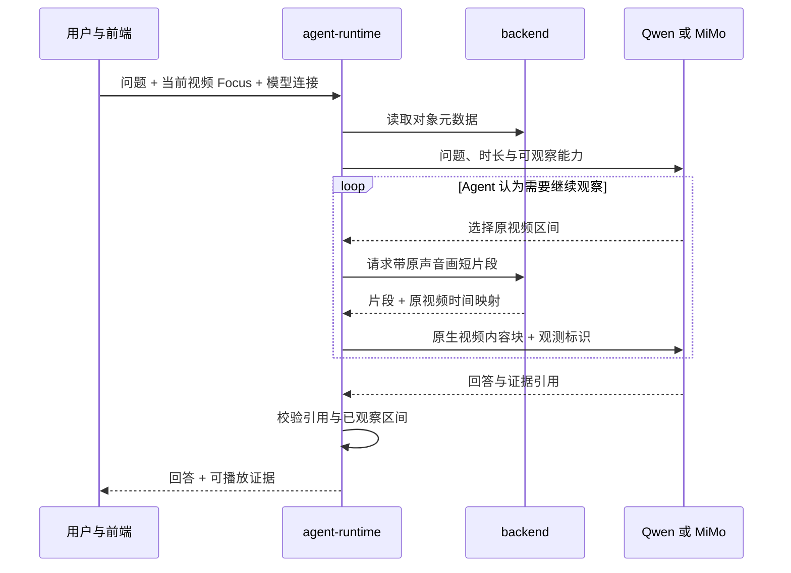
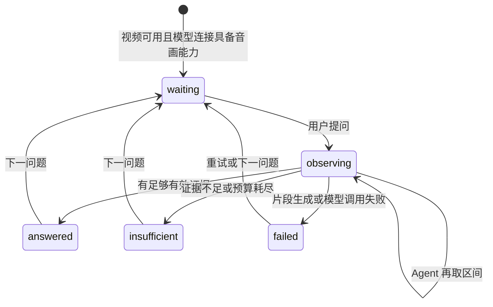

# 11 · 视频理解 harness

## 0. 文档状态

| 字段 | 内容 |
| --- | --- |
| 状态 | `draft` |
| 当前阶段 | 一期范围已确认；Qwen 合成音画对照与 API 工具循环通过，MiMo 真实调用、片段预算与证据精度待实测后冻结 |
| 上游依据 | [Glaux 纲领](../../../roadmaps/charter.zh-CN.md)、[SDD 10](../10-object-convergence/README.md)、[一期范围设计](../../../plans/2026-09-24-video-understanding-harness-design.md) |
| 过程证据 | [Qwen 与 MiMo 原生音视频接口实测](../../../researches/20260924-01-tech-omni-video-api-probe.zh-CN.md) |
| 负责人 | Glaux 项目维护者 |
| 最后更新 | 2026-09-24 |

本 SDD 可以先于 SDD 10 的 W6、W7 起草。实现消费视频音轨前，本 SDD 必须达到 `ready`；与查看器和会话的端到端验收依赖 SDD 10 W6。§17 的开放问题关闭前不得据本草案开始产品实现。

## 1. 本 SDD 负责什么

为用户自带的原生全模态模型提供视频理解环境：浏览器导入不超过 10 分钟的视频，Agent 根据问题自主请求带原声的短视频区间，按需再次观察，最终给出可回到原视频复核的回答。

本 SDD 冻结视频导入的专属限制、按秒寻址的音画片段观测、Qwen 与 MiMo 两个模型连接的能力门控、回答证据、证据短片段播放和失败语义。模型负责理解、推理和选择下一步；Glaux 负责可寻址的观测、原视频时间映射、证据约束及复核入口。

## 2. 本 SDD 不负责什么

- 不做数小时视频的分层导航；一期输入时长上限为 10 分钟。长视频方案另行立项。
- 不接入语音转写或“画面加转写”回退。后续由用户配置转写服务时另定降级语义。
- 不做完整视频播放器、实时流媒体、自动跟踪、剪辑、配音或成片摘要流水线。界面只需播放回答所引用的短片段。
- 不以 Track/Event 记录或验证复杂时序推断；首次出现验证模型时序判断的需求时再定原语。
- 不修改 SDD 10 的对象、焦点、取帧和标注契约；一期在它们之上增加视频区间观测。

## 3. 当前阶段目标

一期验收场景是视频问答与证据定位。问题可涉及画面、语音、环境声和有限的跨片段关联。一次回答可引用多个区间；复杂因果推断不作为必达项。

| 目标 | 一期边界 |
| --- | --- |
| 输入 | 浏览器上传视频，视频时长 `0 < duration_ms ≤ 600000`；超限拒绝导入，不截断 |
| 模型 | 用户配置并选择 Qwen3.8-Omni-Flash 或 MiMo-V2.6-Flash；两者都须通过真实音画及证据用例 |
| 观察 | Agent 自主选择原视频区间；每次给模型原生带原声短视频片段，可再次取区间 |
| 回答 | 每条可核查事实附至少一项实际观察过的证据；缺证据时明确无法判断 |
| 复核 | 引用定位到原视频时间区间，视觉证据适用时定位到关键帧区域；点击引用可播放原声短片段 |

视频独立字节上限、单次片段和整轮观察预算在 §17 待定；不能把现有 32 MiB 图像上传上限当作视频验收上限。

## 4. 输入来源

| 输入 | 来源 | 约束 |
| --- | --- | --- |
| 视频文件 | 浏览器上传；沿用 SDD 08 的服务端命名、魔数校验及白名单目录 | 时长由服务端解复用得到；大于 600000 ms 的文件不注册为新对象；MP4 与 WebM 的输入／转换关系待 §17 冻结 |
| 视频对象 | SDD 10 的 `ObjectMeta`、`Focus`、`streams[]`、`Calibration{kind="time_base"}` | `kind="video"`；对象不存在或源失效时不能构造观测 |
| 用户问题 | 现有单一会话路径 | 与当前 `Focus.object_id` 关联，不从消息文本猜对象 id |
| 模型连接 | 用户的连接设置 | 一期只启用经过实测的两个原生音视频型号；不得按名称启发式把未知模型判为可用 |
| 区间选择 | Agent 的观察动作 | 以原视频毫秒为单位，`0 ≤ start_ms < end_ms ≤ duration_ms`；单次上限待实测 |

对已在旧版本导入、但超过 10 分钟的视频，保留既有对象读取能力，禁用本 SDD 的视频问答并提示时长超限。

## 5. 输出结果

1. **音画观测**：带原声短视频、观测标识、所请求与实际截取的原视频时间范围、媒体格式、源对象标识，以及片段播放时间到原视频时间的映射。模型请求只携带生成的片段，不发布可公开访问的视频 URL。
2. **带证据的回答**：可核查事实与一条或多条证据引用关联；每条引用指向已经产生的观测及原视频时间区间。视觉证据在适用时携带关键帧时间与对象坐标区域。精确字段形状待 §9 与 §17 冻结。
3. **证据复核视图**：点击引用播放对应原声短片段、显示原视频时间和适用时的关键帧区域。原视频已失效时说明无法回放，不伪造替代画面。
4. **无法判断**：证据不足、观察预算耗尽或模型返回无效引用时，明确说明无法判断的部分；无有效证据的事实不作为已证实结论展示。

## 6. 核心流程

Agent 自主决定观察顺序、区间和停止时机；runtime 施加文件大小、调用次数和总媒体量边界，不预设固定“整片上传再摘要”流程。实现须保持只有 agent-runtime 与模型通信。

## 7. 核心规则

1. 时间寻址一律以原视频的毫秒为准。模型收到的短片段可以从 0 开始计时，但引用在下发前必须映射回原视频；不能把片段内时间直接当成原视频时间。
2. 片段须同时保留所选区间的画面与原声音轨。源视频无音轨时仍允许视觉问答，证据类型不得伪称音频。
3. 一期只把原生音画片段交给经实测的 Qwen、MiMo 连接。模型不支持、接口拒绝或媒体超预算时，不静默改用抽帧或转写。
4. 每条可核查事实须关联已观察证据；引用的对象、时间和区域须在边界内。用户问题预设的事件也必须先核验是否存在，不能把提问本身当成证据。系统校验引用结构，语义支持关系用人工标注集验收。
5. 视觉区域只在结论确有局部画面依据时要求。区域坐标通过 SDD 10 的 `ReferenceFrame` 转为对象坐标；不存在定位依据时不凭空画框。
6. 同一问题允许引用多个片段。超出观察预算仍无证据时，返回无法判断，并保留已生成的观测记录供复核。
7. 片段传给模型的媒体正文不写入会话 SQLite、日志或事件。会话保存足以重建证据的对象、源文件指纹、时间和编码参数；源文件被删除时引用保持可读但回放明确失败。
8. 浏览器上传的视频时长由服务端最终判定；前端预检只为即时提示，不代替服务端限制。

## 8. 涉及对象

| 对象 | 职责 | 所属组件 |
| --- | --- | --- |
| `ObjectMeta` / `Focus` / `ReferenceFrame` | 视频对象、当前焦点与关键帧空间参照 | SDD 10 跨端契约 |
| 区间观测 | 原视频时间范围、片段字节、时间映射与观测标识 | backend 生成；agent-runtime 持有与交付 |
| 模型适配 | 按 Qwen / MiMo 的请求体发送原生片段并解析模型响应 | agent-runtime |
| 证据引用 | 把结论关联到实际观测的原视频区间与可选画面区域 | agent-runtime 校验；frontend 呈现 |
| 短片段播放器 | 播放证据音画并显示区域 | frontend |

不新增业务数据库表。媒体片段的缓存位置、生命周期和会话引用的持久化格式待 §17 冻结。

## 9. 数据或字段要求

以下是待冻结的语义草图，字段名和媒体端点仍属 `draft`。

| 结构 | 必要信息 | 约束 |
| --- | --- | --- |
| `VideoInterval` | `object_id`, `start_ms`, `end_ms` | 半开区间 `[start_ms, end_ms)`，在原视频有效时长内 |
| `ClipObservation` | `observation_id`, `object_id`, `requested_interval`, `actual_interval`, `mime`, `sha256`, 时间映射 | 观测标识只绑定同一原文件版本和编码参数；片段 bytes 不进持久会话 |
| `EvidenceRef` | `observation_id`, `kind`, `source_interval`, 可选 `frame_time_ms`、`region` | 区间须包含在该观测实际覆盖的原视频时间内；视觉区域须通过 `ReferenceFrame` 校验 |
| `VideoAnswer` | 事实结论与证据引用的关联、无法判断部分 | 每条可核查事实至少一项有效引用 |

后端视频上传的专属字节上限、时长拒绝原因、片段生成端点与响应头；runtime 的模型能力位和结构化证据事件；frontend 的引用卡片格式，在模型实测后补成逐字段契约。

## 10. 重复执行规则

- 同一对象、原视频区间和编码参数的重复观察，可复用已有片段；复用不改变时间映射或证据语义。
- 用户重新生成回答可重用仍存在的观测记录，也可由 Agent 再次取片；一次回答只引用其可访问的观测。
- 重复上传同一源文件沿用 SDD 08 的服务端派生 ID 规则；时长超限的文件不得先写入再以有效对象呈现。

## 11. 状态或生命周期规则

切换视频对象后，后续观测只绑定新 `Focus.object_id`。已完成回答的证据仍指向原对象；对象丢失时保持引用文本，播放器报告源不可用。

## 12. 审计或事件规则

记录每次区间观察的对象 id、原视频区间、媒体摘要、模型 id、耗时、结果状态及可关联的会话／轮次标识。不得记录 API Key、片段 Base64 或完整模型请求体。前端证据卡的结构化事件名与字段、会话恢复行为待 §17 冻结。

## 13. 异常和人工处理

| 情况 | 一期行为 |
| --- | --- |
| 上传文件超过 10 分钟 | 拒绝该文件并说明上限；不截断，不注册新对象 |
| 视频字节超限、格式或编码不受理、无视频流 | 拒绝该文件，标出具体原因；同批文件沿用 SDD 08 的部分受理语义 |
| 已有视频超过 10 分钟 | 对象仍可查看，本功能提示不支持该时长 |
| 当前模型连接未通过音画能力判定 | 视频问答不可用，普通对话继续可用 |
| 片段超模型大小或次数预算 | 拒绝本次观察并向 Agent 给出可操作的区间限制；不得静默丢弃声音 |
| 原文件在会话后被删除 | 回答引用仍可读，证据播放器明确报告无法回放 |
| 无效证据引用 | 不把该引用展示为有效；无法形成有证据结论时说明无法判断 |
| 模型 API 失败或中途断开 | 保留会话和既有观测，给出错误并允许重试 |

HTTP 错误码及每文件 `UploadRejected.reason` 值需与 SDD 08 同步冻结。

## 14. 与其他 SDD 的调用关系

- [SDD 10 · 视觉对象与数据源收敛](../10-object-convergence/README.md) 是上游：提供 `VideoSource`、`ObjectMeta`、`Focus`、`ReferenceFrame` 与单一观测通道；本 SDD 不等待 W7 清理，但端到端界面验收依赖 W6。SDD 10 §14、§17 中对 SDD 11 的“长视频分层导航、抽帧加音频”预期需随本 SDD 的 `ready` 修订为一期短音画片段和后续长视频归属。
- [SDD 08 · 数据导入优先的文件栏](../08-data-import-first-explorer/README.md) 提供浏览器上传入口与文件级受理语义；本 SDD 增加视频独立大小和时长限制，实施时同步修订 SDD 08。
- [SDD 00 · 内置参考智能体与本地会话](../00-reference-agent-conversations/README.md) 提供会话、连接、SSE 与持久化入口；本 SDD 扩展媒体观测和证据，但仍用同一会话路径。
- [SDD 02 · 智能体图像标注](../02-agent-image-annotation/README.md) 的区域坐标与建议态机制可用于关键帧区域；本 SDD 不把视频问答改造成自动标注任务。
- [SDD 09 · 对话发行包](../09-chat-distribution/README.md) 的 chat edition 不含 Python backend；本功能只在 full edition 可用，chat edition 的回归门禁须保持。

## 15. 验收标准

以下为一期验收方向；模型准确率、时间／区域容差与调用预算仍在 §17，关闭后才能成为 `ready` 门禁。

- [ ] 浏览器导入 `duration_ms ≤ 600000` 的受理视频成功；`> 600000` 的文件明确拒绝且不生成新对象。文件大小与时长均由服务端执行限制。
- [ ] 含音轨的区间观察把原视频同一时间范围内的画面与声音交给模型；无音轨视频的视觉问答仍可运行。
- [ ] Qwen 和 MiMo 分别对同一人工标注样本完成真实原生 MP4 调用、二次区间观察及证据回答，不依赖公开媒体 URL。
- [ ] 模型输出的片段内时间映射回原视频；引用超出已观察区间、对象不符或区域越界时不能展示为有效证据。
- [ ] 可核查事实有有效引用；证据不足的样本明确回答无法判断，不捏造时间或声音。
- [ ] 静音且视觉画面与有声样本相同的视频，针对“蜂鸣时是什么颜色”的问题不得回答出颜色或时间；任何 `end_ms > duration_ms` 的引用均被拒绝。
- [ ] 证据短片段播放器从引用打开后能播放原声、显示原视频时间，并在适用时叠加关键帧区域。
- [ ] 模型连接不具备原生音画能力时，视频问答不可用且不触发转写或抽帧回退；普通对话仍可用。
- [ ] 会话日志与持久存储中无 API Key、Base64 片段或完整模型请求体。
- [ ] SDD 10 的三条架构不变量与 SDD 09 的 chat edition 门禁仍成立。

## 16. 决策记录

| 编号 | 决策 | 备选 | 选择理由 | 时间 |
| --- | --- | --- | --- | --- |
| D-1 | 一期以视频问答与证据定位为主，有限支持跨片段引用 | 长视频检索或复杂时序推断优先 | 先验收有出处的回答 | 2026-09-23 |
| D-2 | 视频自带声音参与问答 | 仅看画面 | 语音与环境声属于同一观测内容 | 2026-09-23 |
| D-3 | 视觉证据在适用时含关键帧区域，声音证据含音频区间 | 仅给时间戳 | 让结论回到具体画面与声音复核 | 2026-09-23 |
| D-4 | Agent 自主选择观察区间及次数，系统施加预算 | 固定整片摘要或固定抽样流水线 | 保留模型自主规划并控制资源 | 2026-09-23 |
| D-5 | 一期模型输入为带原声的原生短视频片段 | 抽样帧加独立音频 | 保留连续动作与音画同步 | 2026-09-23 |
| D-6 | 新导入视频最长 10 分钟，超限拒绝 | 静默截取前 10 分钟或尽力处理长视频 | 避免回答遗漏后半段却看似完整 | 2026-09-23 |
| D-7 | 浏览器直接上传视频 | 只从服务端目录登记 | 满足一期用户路径 | 2026-09-23 |
| D-8 | Qwen 和 MiMo 各一款经真实接口验收 | 只支持一家或承诺任意兼容端点 | 验证可替换性且保持可验收范围 | 2026-09-23 |
| D-9 | 每条可核查事实附证据，无证据说明无法判断；引用用短片段播放器复核 | 仅文本时间戳或完整播放器 | 对应 Glaux 的可溯源目标 | 2026-09-23 |
| D-10 | 语音转写回退留到后续，届时由用户配置转写服务 | 一期同时接入转写 | 一期先验证原生全模态链路 | 2026-09-23 |

## 17. 待确认问题

1. Qwen 的合成音画对照与 API 层工具循环已通过，但本仓 pi-ai 接线和真实视频定位未测；MiMo 缺凭据，原生音画与工具循环均未实测。以[实测记录](../../../researches/20260924-01-tech-omni-video-api-probe.zh-CN.md)继续关闭；失败时先修订范围和 D-8，不以文档声明代替测试。
2. 浏览器视频单文件字节上限、支持的输入编码以及 WebM 转为模型可受理 MP4 的条件是什么？上传应采用何种流式落盘方案，避免现有整文件内存缓冲。
3. 单次观察最长时长、Base64 字节预算、每轮调用次数和总媒体预算是多少？先按两家真实接口和 10 分钟样本标定。
4. 片段真实 PTS 到原视频时间的映射、关键帧定位和区域坐标容差如何定义？需覆盖可变帧率与截取偏移。
5. 回答／证据的逐字段格式、会话恢复、片段缓存生命周期和结构化 SSE 事件形状是什么？
6. 人工标注评测集大小、答案正确率、时间定位误差、区域命中率和拒答门槛是多少？两款模型应使用同一口径。Qwen 在静音样本上曾捏造越界时间，强化提示后单例拒答；需要更多无答案问法和结构校验实测，不能以提示词单例通过代替门槛。
7. Qwen 的 workspace 区域地址、MiMo 的请求字段和 pi-ai 现有仅文本／图像内容块的适配方式，经真实调用后确定。
