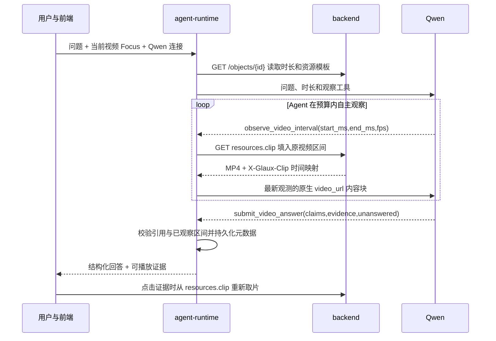
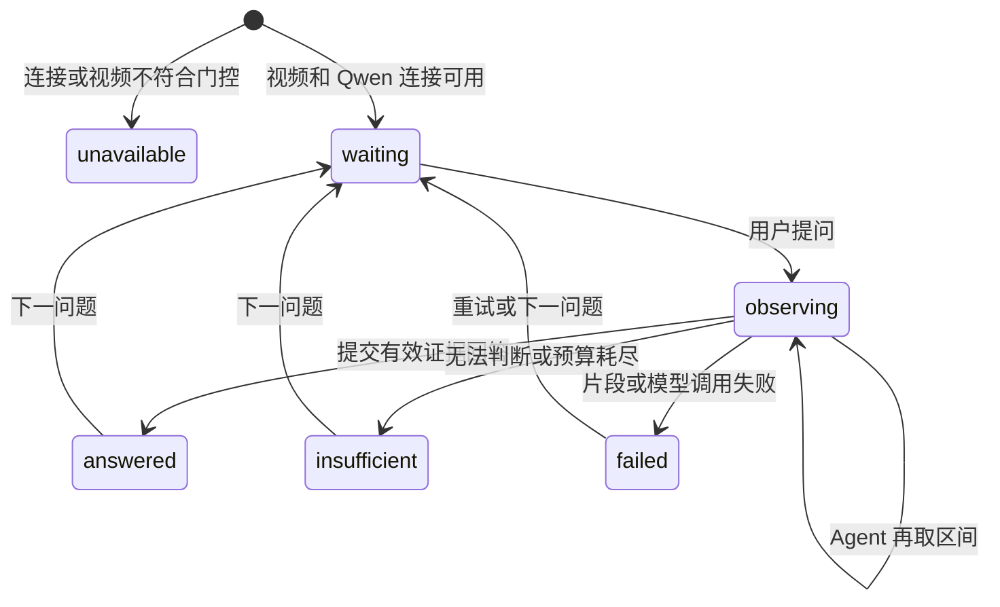

# 11 · 视频理解 harness

## 0. 文档状态

| 字段 | 内容 |
| --- | --- |
| 状态 | `ready` |
| 当前阶段 | 一期契约冻结，实施中；Qwen 的 Pi 工具循环已通过 9 秒蓝／绿／静音合成对照，真实视频与完整标注集仍待验收 |
| 上游依据 | [Glaux 纲领](../../../roadmaps/charter.zh-CN.md)、[SDD 10](../10-object-convergence/README.md)、[一期范围设计](../../../plans/2026-09-24-video-understanding-harness-design.md) |
| 可行性证据 | [原生接口实测](../../../researches/20260924-01-tech-omni-video-api-probe.zh-CN.md)、[Qwen 工具音轨入口](../../../researches/20260924-02-tech-qwen-tool-audio-placement.zh-CN.md)、[Pi 合成对照](../../../researches/20260924-03-tech-qwen-pi-video-loop.zh-CN.md)；MiMo 调研仅为历史候选，不属于本期准出 |
| 负责人 | Glaux 项目维护者 |
| 最后更新 | 2026-09-24 |

`ready` 表示实现边界与验收方法已确定，不表示模型在真实视频上已经验收。SDD 10 的 W4～W7 代码与自动化门禁已完成；其递延的浏览器走查和本 SDD 的端到端验收一起进行。§17 无开放问题。

## 1. 本 SDD 负责什么

为用户配置的 Qwen3.8-Omni-Flash 提供视频理解环境：浏览器导入不超过 10 分钟的视频，Agent 根据问题自主请求带原声的短视频区间，按需再次观察，最后提交可回到原视频复核的回答和证据。Glaux 负责可寻址观测、原视频时间映射、证据校验、会话恢复与短片段复核。

## 2. 本 SDD 不负责什么

- MiMo 及其他备用模型的一期接入或验收。新增模型须单独验证协议与同一验收集，再修订本 SDD。
- 数小时视频的分层导航、完整视频播放器、实时流媒体、自动跟踪、剪辑、配音或自动摘要流水线。
- 语音转写及“画面加转写”回退；后续由用户配置转写服务时另定降级契约。
- Track/Event 的持久记录与复杂时序推断验证。
- 改变 SDD 10 已有的对象、焦点、取帧和标注语义；本 SDD 只扩展视频区间资源与证据结果。

## 3. 当前阶段目标

一期验收视频问答与证据定位：画面、语音、环境声及有限跨片段关联。回答可引用多个区间；复杂因果推断不是必达项。

| 目标 | 一期边界 |
| --- | --- |
| 输入 | 浏览器上传 MP4 或 WebM；单文件不超过 512 MiB，`0 < duration_ms ≤ 600000`；超限拒绝，不截断 |
| 模型 | `openai-compatible` 连接中显式选择 `qwen-omni` 媒体适配器，模型 ID 固定为 `qwen3.8-omni-flash`；一期只验收此组合 |
| 观察 | Agent 自主选择原视频区间，一次最长 60 秒；带原声 MP4 私有 Base64 交给模型，可重复观察 |
| 回答 | 每条可核查事实至少关联一项实际观察过的证据；证据不足时列出无法判断的部分 |
| 复核 | 引用定位到原视频时间区间；局部视觉结论适用时定位到关键帧区域；点击引用播放原声短片段 |

## 4. 输入来源

| 输入 | 来源 | 约束 |
| --- | --- | --- |
| 视频文件 | SDD 08 的 `POST /uploads/images`；沿用服务端命名、魔数和白名单目录 | 容器为 MP4（H.264 视频，可选一条 AAC 音轨）或 WebM（VP8/VP9 视频，可选一条 Opus 音轨）；必须能解码视频；有音轨时也必须可解码。服务端从流时间戳判定时长，未知或非法时长拒绝 |
| 视频对象 | SDD 10 的 `ObjectMeta`、`Focus`、`streams[]`、`Calibration{kind="time_base"}` | `kind="video"`；`meta.duration_ms` 是经服务端验证的视频呈现时长；不以 `axes[t].size × spacing` 推断可变帧率视频时长 |
| 用户问题 | 现有单一会话路径 | 绑定提问时的 `Focus.object_id`；不从消息文本猜对象 id，切换当前对象不改旧回答引用 |
| 模型连接 | 用户配置的连接 | 显式媒体适配器、准确模型 ID、兼容 Chat Completions 地址和凭据；普通 `vision` 能力位不能代替音画能力位 |
| 区间选择 | Agent 的 `observe_video_interval` 动作 | 原视频毫秒半开区间：`0 ≤ start_ms < end_ms ≤ duration_ms`，且 `end_ms-start_ms ≤ 60000` |

旧版本已导入的超 10 分钟视频保留查看能力，但禁用视频问答并提示时长超限。模型地址须指向用户 workspace 所在地域的 `/compatible-mode/v1`；`/api/v1` 不是本适配器的 Chat Completions 地址，配置错误要明确报错。凭据仍沿用连接设置，不写入文档。

## 5. 输出结果

1. **音画观测**：私有 MP4、`observation_id`、源对象及源文件指纹、请求与实际覆盖的原视频区间、媒体摘要、片段时间到原视频时间的映射。模型请求仅携带本轮所需片段，不发布公开媒体 URL。
2. **带证据的回答**：结构化 `VideoAnswer` 的每条事实包含证据引用；音频、视觉、音画联合证据区分类型。无证据部分单独说明，不作为已证实结论展示。
3. **证据复核视图**：点击引用打开对应原声短片段，显示原视频时间；有区域时显示关键帧与框。源文件丢失或指纹变化时保留文字与引用元数据，并报告无法回放。

## 6. 核心流程

模型独自选择观察顺序、区间、`fps` 和停止时机；runtime 只执行预算与证据约束。模型通信只发生在 agent-runtime。Pi 的消息类型目前只有文本／图像；适配器在出站 `onPayload` 中保留工具结果的文字标识，并紧接新观测的工具结果插入一条仅用于本次请求的 `user` 媒体消息，标明它是环境观测而非新用户指令，内容为 Qwen `video_url`。真实调用显示 `video_url` 放在 `tool` 内容块时只计视频 token、不计音频 token；放在受控媒体消息时音视频 token 都出现。适配器同时设置 `modalities:["text"]` 与 `reasoning_effort:"low"`。旧观测在后续请求中保留文字标识和元数据，不重复发送 Base64；Agent 要重新看时再次调用工具。

## 7. 核心规则

1. 时间寻址只用源视频毫秒，以首个视频呈现 PTS 为 0，音频保留相对视频的原始同步偏移。片段从 0 计时，`source_ms = clip_ms + actual_interval.start_ms`；后端必须依据源视频 PTS 裁切与重建时间戳，不能用平均帧率推算可变帧率源视频时间。
2. 片段画面与声音来自同一请求区间。有音轨时编码后必须保留可听音频；无音轨时允许视觉问答，证据不得声称听到了声音。不能静默改用抽帧或转写。
3. 单次观测最多 60 秒、MP4 原始字节最多 6 MiB，含 `data:` 前缀的 Base64 请求块须严格小于 10 MB；每轮最多 12 次观测、累计请求区间时长最多 600 秒、累计片段原始字节最多 48 MiB。重复观察同样计入预算。后端尽量编码在 6 MiB 内，不能无声或缺帧地缩减区间；做不到则返回 `clip_too_large`，由 Agent 缩短区间。
4. 后端统一输出 H.264/AAC MP4：最长边不超过 640 像素、画面最高 15 fps、有音轨时 AAC 单声道 64 kbit/s。Qwen `video_url.fps` 由 Agent 选择 `0.5`、`2` 或 `5`，默认 `2`；它控制模型抽帧密度，不改变片段原视频时间映射。源文件本身不被转码覆盖。
5. 一期只对准确型号和显式 `qwen-omni` 适配器启用音画工具。连接探测成功不等于视频能力已通过；接口拒绝媒体时禁用本轮视频问答并说明。其他连接明确提示“该连接不支持音画联合问答”，普通对话继续可用。`observe` 权限可挂只读视频观察和证据提交工具，不挂写入类领域工具。
6. 每条可核查事实关联已观察证据；预设事件（如“蜂鸣时”）须先验证存在。runtime 校验对象、源指纹、观测标识、区间和区域；语义支持关系由人工标注集验收。模型自由文本中的时间戳不自动变成证据。
   未成功调用 `submit_video_answer` 的轮次只能展示“无法形成有证据的回答”，不能把模型自由文本作为已证实的结果卡。
7. 局部视觉结论需要区域时，区域以源帧像素坐标表达，并用对应 `ReferenceFrame` 校验；全局画面或纯音频结论不强制画框。无法确定区域时不得编造。
8. 会话、日志、SSE 和 SQLite 只保存元数据，不保存凭据、片段 Base64、完整模型请求体或媒体正文。上传的源文件仍按 SDD 08 存储；临时片段缓存仅用于当前会话观测和短时播放，可删除且不承担事实存储。
9. 前端预检用于即时提示；时长、字节、解码和证据边界均以服务端或 runtime 校验为准。

## 8. 涉及对象

| 对象 | 职责 | 所属组件 |
| --- | --- | --- |
| `ObjectMeta` / `Focus` / `ReferenceFrame` | 视频对象、焦点和源帧空间参照 | SDD 10 跨端契约 |
| `ClipObservation` | 片段、PTS 映射、摘要及观测 id | backend 生成，agent-runtime 持有并持久化非媒体元数据 |
| `qwen-omni` 适配器 | 仅为准确型号发送原生 `video_url`、接收工具调用 | agent-runtime |
| `EvidenceRef` / `VideoAnswer` | 事实到观测和源视频区间的关联 | agent-runtime 校验与会话存储；frontend 呈现 |
| 证据短片段播放器 | 播放音画、显示时间和区域 | frontend |

不新增业务数据库表；复用 Pi 会话 custom entry。片段临时缓存可由后端按源指纹、区间和编码配置做有界 LRU，进程重启后按源文件重建。

## 9. 数据或字段要求

| 结构／接口 | 字段或形状 | 约束 |
| --- | --- | --- |
| `ObjectMeta` 视频扩展 | `meta.duration_ms: int`；`resources.clip: string` | `duration_ms > 0`，来自容器流 PTS；`clip` 仅 `kind="video"` 下发，模板为 `/objects/{id}/clip?start_ms={start_ms}&end_ms={end_ms}`。前端和 runtime 只填资源模板，不自行拼路径 |
| `GET /objects/{id}/clip` | `start_ms`, `end_ms` 整数查询；复核时可附 `source_sha256`；响应 `video/mp4`、`X-Glaux-Clip` JSON | 半开区间，最长 60000 ms；源指纹不符返回 409；头包含 `object_id,source_sha256,requested_interval,actual_interval,mime,clip_sha256,encoding`；响应不含公开 URL |
| `GET /objects/{id}/frame-at` | `time_ms` 整数查询；复核时可附 `source_sha256`；响应 PNG/JPEG、`X-Glaux-Frame`、`X-Glaux-Frame-Time`、`X-Glaux-Frame-Tolerance` | 按源 PTS 找最近有效帧，返回真实 `Index.t`、对象坐标参照、实际帧时间和局部帧周期容差；超出视频时长返回 422，源指纹不符返回 409 |
| `VideoInterval` | `start_ms:int`, `end_ms:int` | 原视频半开区间；实际覆盖区间须在请求区间内，不能跨出源时长 |
| `ClipObservation` | `observation_id,object_id,source_sha256,requested_interval,actual_interval,mime,clip_sha256,encoding,fps` | `observation_id` 为源指纹、实际区间、编码配置和 Qwen 抽帧档位的确定性 SHA-256；片段字节只驻留本轮内存或临时缓存 |
| `EvidenceRef` | `observation_id,kind,source_interval,frame_time_ms?,region?` | `kind` 为 `visual`／`audio`／`av`；区间在该观测实际覆盖内；视觉区域为源帧 `box{x0,y0,x1,y1}`，需要 `frame_time_ms` 且该时刻在引用区间内 |
| `VideoAnswer` | `object_id,claims:[{text,evidence:EvidenceRef[]}],unanswered:string[]` | 每条 `claim` 证据非空；无可证实事实时 `claims=[]` 且 `unanswered` 非空；不得引用其他对象或源版本 |
| `ConnectionInput` 扩展 | `media_adapter?: "qwen-omni"` | 只在 `provider="openai-compatible"` 且 `model="qwen3.8-omni-flash"` 时允许；`vision=true` 仍独立保留 |
| Qwen 原生媒体块 | `{"type":"video_url","video_url":{"url":"data:;base64,...","fps":0.5\|2\|5}}` | `tool` 消息只留观测标识；紧随其后注入本次出站的 `user` 媒体消息，包含观测 id、说明文字和 `video_url`；每次出站只展开新观测，且顶层含 `modalities:["text"]`、`reasoning_effort:"low"`；媒体消息不写入 Pi 会话 |

`actual_interval` 根据输出片段中首末有效视频／音频 PTS 计算；编码时以 `actual_interval.start_ms` 为零点。允许首尾因帧／音频采样边界缩短，但不得包含请求外内容：起点偏移不大于一帧周期或 100 ms（取较大者），终点偏移不大于 100 ms。若达不到容差，拒绝生成而非报告虚假的精确时间。`X-Glaux-Clip` 头只含上述短元数据，不含 Base64。

`region` 使用 SDD 10 的对象坐标边界，runtime 查源帧 `ReferenceFrame` 后校验 `0 ≤ x0 < x1 ≤ width`、`0 ≤ y0 < y1 ≤ height`；`frame_time_ms` 以源 PTS 找最近有效帧及对应 `Index.t`，不能用平均 fps 直接换算帧号，偏差不得超过一帧周期或 100 ms（取较大者）。音频证据不得带视觉区域。

## 10. 重复执行规则

- 同一源指纹、请求区间和编码配置可复用片段；复用不得改变返回的 PTS 映射。
- 重试同一个 `command_id` 沿用 SDD 00 的幂等回执；同一轮重复观测仍消耗该轮预算，但不重复持久化同一个 `observation_id`。
- `submit_video_answer` 成功后以 `command_id` 关联一次回答；重放 SSE 或恢复会话不得生成第二张证据卡。
- 同名重传沿用 SDD 08 的对象 ID 规则；文件指纹变化后旧引用仍可读，但不得用于新文件回放。

## 11. 状态或生命周期规则

每轮观测只绑定提问时的视频对象与源指纹。切换当前 Focus 不重绑定旧引用。回答及观测元数据通过 `glaux.video.observation`、`glaux.video.answer` 两类 Pi custom entry 保存；会话 `snapshot` 增加 `video_observations` 与 `video_answers`，按 `observation_id`、`command_id` 关联。恢复时不恢复 Base64，用户点击证据时附源指纹从源文件重新生成片段；源缺失或指纹变化时进入“不可回放”状态。

## 12. 审计或事件规则

`agent-runtime` 在现有 SSE 上新增 `video.answer` 事件，载荷为 `{session_id,command_id,answer:VideoAnswer}`；连接时 `snapshot.video_answers` 给出同一结构的已存回答。前端以 `command_id` 去重。区间观察仍走现有 `pi.event` 工具事件，工具 details 只含 `ClipObservation` 元数据，不含媒体。

审计每次观测的会话／轮次、对象和源指纹、请求／实际区间、片段摘要与大小、模型 id、耗时和结果状态；回答审计引用校验结果。不得记录 API Key、Base64、源文件内容或完整模型请求体。

## 13. 异常和人工处理

| 情况 | HTTP／结果 | 一期行为 |
| --- | --- | --- |
| 上传文件超过 512 MiB | 每文件 `UploadRejected.reason="too_large"` | 拒绝且临时文件清理；不截断、不注册对象 |
| 视频时长超过 600000 ms | 每文件 `reason="duration_exceeded"` | 拒绝该文件；同批其余文件继续按 SDD 08 受理 |
| 编码不在白名单、无视频流、无法解码、时长未知 | 每文件 `reason="unsupported_codec"` 或 `"corrupt"` | 拒绝并说明具体原因，不保留损坏文件 |
| 当前连接未显式通过音画门控 | 视频问答不可用 | 提示“该连接不支持音画联合问答”；普通对话可用，不触发转写 |
| 区间非法／超过 60 秒／对象不符 | 422 | 返回合法范围，允许 Agent 重新选区间 |
| 片段无法压入 6 MiB 或总预算耗尽 | 413 `clip_too_large`／工具结果 `observation_budget_exceeded` | 建议缩短区间；无足够证据时回答无法判断，不静默丢声 |
| 源文件丢失或指纹变化 | 404／409 | 旧回答文字保留；回放失败，不把新内容冒充旧证据 |
| 无效证据引用 | `submit_video_answer` 工具拒绝并给出字段错误 | 不展示为有效；模型可修正一次，仍无有效引用则只展示无法判断 |
| 模型 API 拒绝媒体或断开 | 错误事件 | 保留已有观测和会话，提示重试；不降级为抽帧或转写 |

视频上传沿用现有接口与部分受理语义，但采用逐块流式写入服务端派生名的临时文件，边读边执行独立的 512 MiB 上限与 SHA-256，验证容器、视频和音频解码及时长后原子替换目标文件；失败清理临时文件。不能把 512 MiB 装入当前 `bytearray`。图片仍适用 SDD 08 的 32 MiB 上限；实施同提交同步修订其活文档与上传原因枚举。

## 14. 与其他 SDD 的调用关系

- [SDD 10](../10-object-convergence/README.md) 是上游：提供视频对象、音轨声明、焦点、参照帧和资源模板规则。本 SDD 增加 `resources.clip` 与 `meta.duration_ms`，保留 `resources.audio` 的既有声明，不通过 `raw` 自行解复用。SDD 10 W6/W7 代码已完成，真实浏览器走查并入本期最终验收。
- [SDD 08](../08-data-import-first-explorer/README.md) 提供浏览器上传与部分受理；本 SDD 增加视频独立字节、编码、时长和流式落盘，实施时同提交修订 SDD 08。
- [SDD 00](../00-reference-agent-conversations/README.md) 提供用户连接、会话、Pi custom entry 和 SSE；本 SDD 扩展音画适配与证据快照，仍用单一会话路径。
- [SDD 02](../02-agent-image-annotation/README.md) 的对象坐标可用于证据区域；本功能不自动提交标注。
- [SDD 09](../09-chat-distribution/README.md) 的 chat edition 无 Python backend，本功能只在 full edition 可用；其回归门禁继续成立。

## 15. 验收标准

实现侧应建立固定版本的人工标注集：至少 6 段视频、24 个问题，包含画面、语音、环境声、音画交叉、至少 4 个需引用两段的题、至少 4 个无答案或错误前提题、无音轨视频、WebM 和 9～10 分钟视频。记录源文件指纹、真值答案、可接受时间区间及局部视觉题的真值框；同一集用于后续模型扩展。

- [ ] 上传 MP4、WebM（含有声与无声）均按容器和编码白名单受理；`>512 MiB`、`>600000 ms`、未知时长及坏编码逐文件拒绝，无半成品对象；大文件处理不随文件长度线性增长进程内存。
- [ ] Qwen 真实连接通过本仓 Pi 工具循环：Agent 自主取首段、再次取不同区间、接收两次原生音画 `video_url`，提交结构化证据；全链不依赖公开 URL。
- [ ] 用相同画面、移动蜂鸣区间的配对样本确认声音改变答案；静音配对样本不捏造蜂鸣。模型媒体拒绝或连接不符时给出明确提示，不调用转写。
- [ ] 每段片段时长、6 MiB 原始大小和严格小于 10 MB 的 Base64 限制均执行；每轮 12 次、600 秒、48 MiB 三项预算均执行，失败不静默截断或丢声。
- [ ] 可变帧率、非零起始 PTS 和非关键帧起点样本的片段映射符合 §9 容差；引用超出观察、源时长、对象或区域边界时不能展示为有效证据。
- [ ] 标注集上 Qwen `reasoning_effort=low`：事实正确题至少 80% 回答正确；有答案题至少 80% 的证据区间与真值事件重叠且事件边界误差各不超过 3 秒；需局部区域的题至少 70% 达到框 IoU ≥ 0.3。全部无答案题不得给出有证据的虚假结论；结构性越界引用零容忍。
- [ ] 每条可核查事实均有有效 `EvidenceRef`；证据不足时展示 `unanswered`，不把未经校验的模型自由文本包装成已证实答案。
- [ ] 点击证据卡播放原声短片段并显示源时间、适用时的关键帧区域；重启、刷新、切换对象后仍能恢复旧回答，源文件失效时明确无法回放。
- [ ] 会话 SQLite、日志、SSE 中无 API Key、Base64 视频或完整模型请求体；SDD 10 三条架构不变量和 SDD 09 chat edition 门禁保持。

## 16. 决策记录

| 编号 | 决策 | 备选 | 选择理由 | 时间 |
| --- | --- | --- | --- | --- |
| D-1 | 一期以视频问答与证据定位为主，有限支持跨片段引用 | 长视频检索或复杂时序推断优先 | 先验收有出处的回答 | 2026-09-23 |
| D-2 | 视频自带声音参与问答 | 仅看画面 | 语音与环境声属于同一观测 | 2026-09-23 |
| D-3 | 局部视觉证据适用时含关键帧区域，声音证据含音频区间 | 仅给时间戳 | 让结论回到具体画面与声音复核 | 2026-09-23 |
| D-4 | Agent 自主选择观察区间及次数，系统施加预算 | 固定整片摘要 | 保留模型自主规划并控制资源 | 2026-09-23 |
| D-5 | 模型输入为带原声的原生短视频片段 | 抽样帧加独立音频 | 保留连续动作与音画同步 | 2026-09-23 |
| D-6 | 新导入视频最长 10 分钟，超限拒绝 | 静默截取前 10 分钟 | 避免遗漏后半段却看似完整 | 2026-09-23 |
| D-7 | 浏览器直接上传视频 | 只从服务端目录登记 | 满足一期用户路径 | 2026-09-23 |
| D-8 | 原定 Qwen 和 MiMo 各一款真实接口验收；由 D-11 调整 | 只支持一家 | 记录原始范围，现不再是一期门禁 | 2026-09-23 |
| D-9 | 每条可核查事实附证据，无证据说明无法判断；短片段播放器复核 | 仅文本时间戳 | 对应可溯源目标 | 2026-09-23 |
| D-10 | 转写回退留待后续，届时由用户配置转写服务 | 一期同时接入 | 一期先验证原生音画链路 | 2026-09-23 |
| D-11 | 一期只接入 Qwen3.8-Omni-Flash，MiMo 不作为备用或准出条件 | 继续双模型并行 | 用户调整范围；Qwen 已有真实音画和 API 工具循环证据 | 2026-09-24 |
| D-12 | 视频上传 512 MiB、观察 60 秒／6 MiB、每轮 12 次／600 秒／48 MiB | 沿用图像 32 MiB 或无预算 | 覆盖 10 分钟输入并留在 Qwen 单片段 10 MB Base64 限制内 | 2026-09-24 |
| D-13 | 结构化回答和会话元数据持久化；片段按源指纹重建 | 持久保存所有 Base64 | 引用可恢复且不膨胀会话或泄漏媒体正文 | 2026-09-24 |

## 17. 待确认问题

无。Pi 出站媒体替换、真实视频评测和完整浏览器走查是 §15 的实现与验收门禁；若其结果推翻预算、精度或模型选择，先修订本 SDD，再继续实现。
