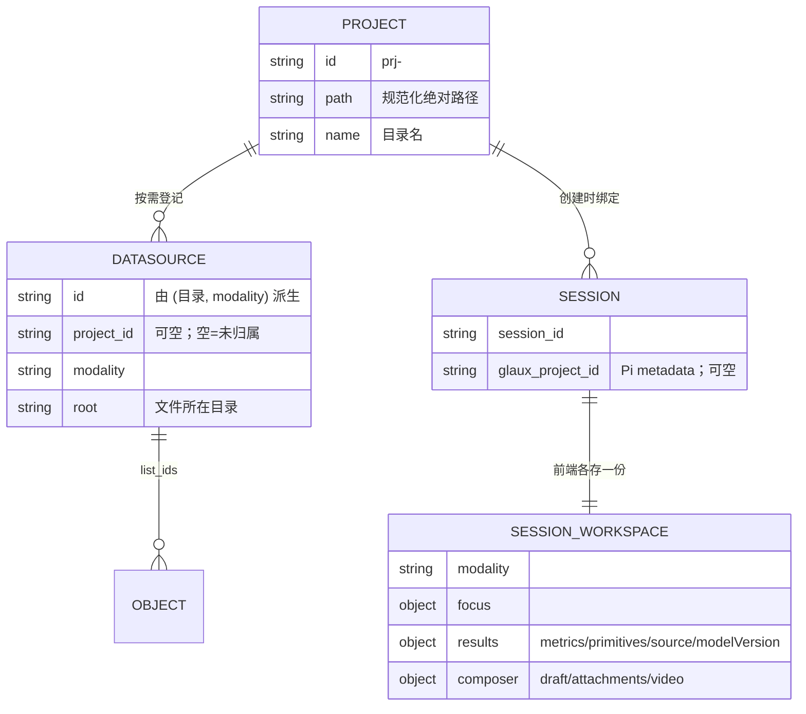
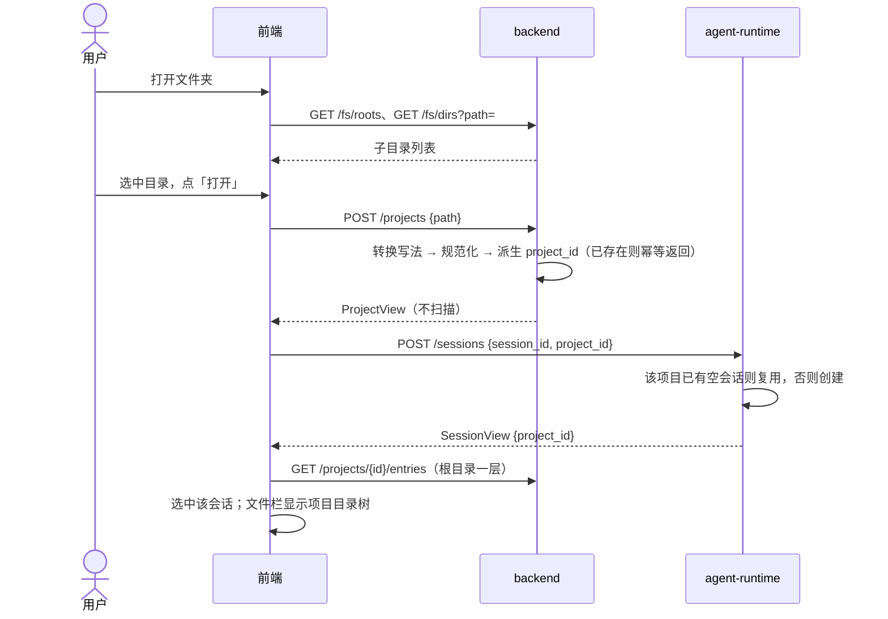
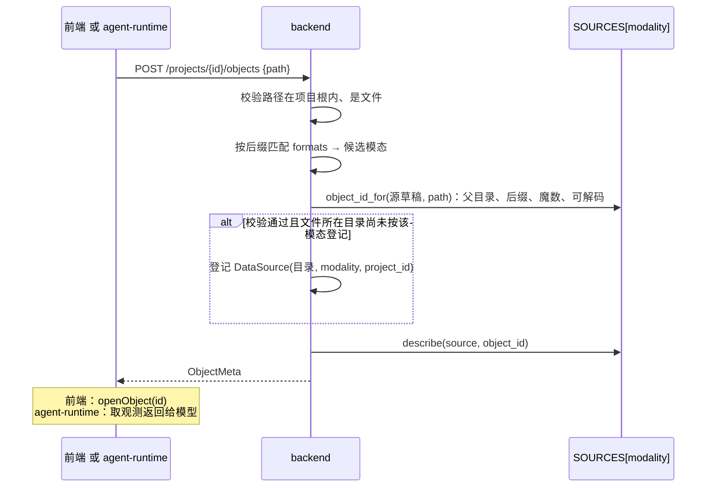
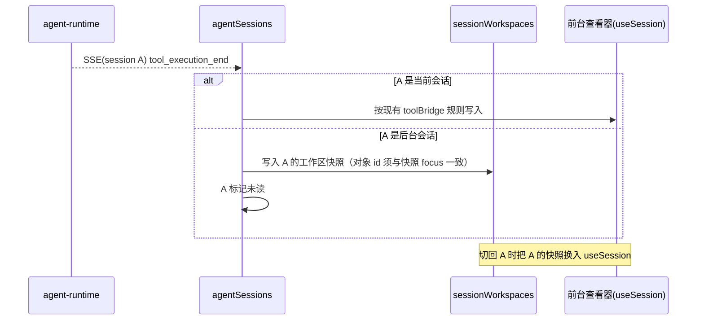
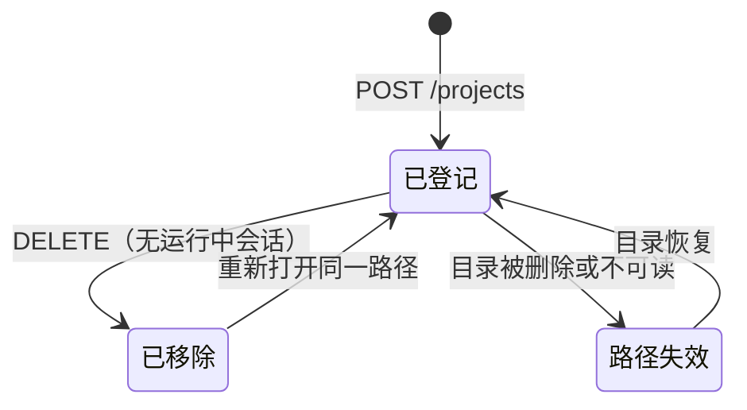
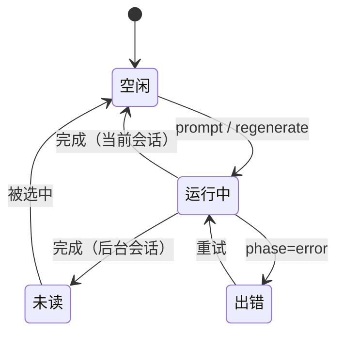
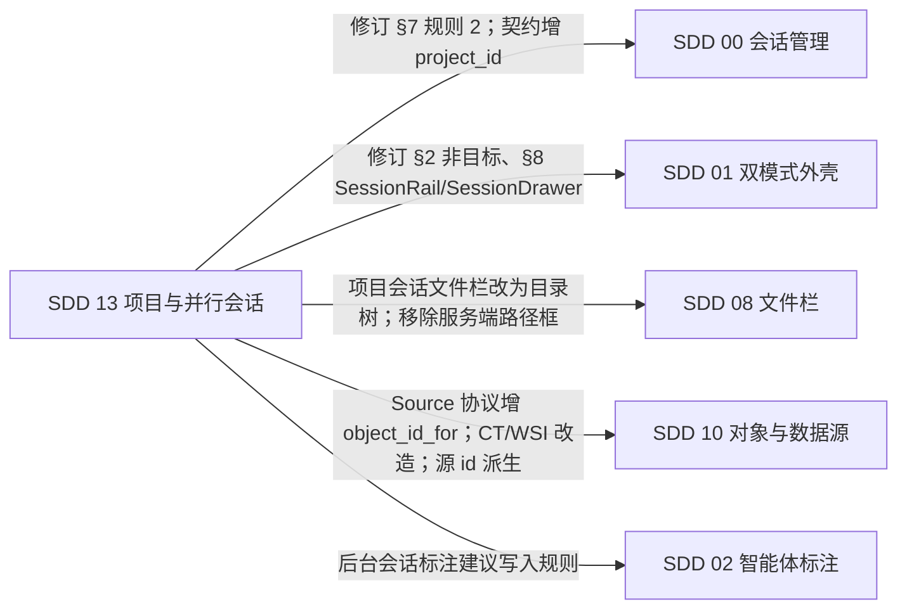

# 13 · 项目文件夹与并行会话

## 0. 文档状态

| 字段 | 内容 |
| --- | --- |
| 状态 | `implemented`（P1、P2） |
| 当前阶段 | P1（通用图像、视频）已实现并通过自动化门禁与开发侧浏览器走查，自查见 §15；P2（CT、WSI）已实现并通过自动化门禁与开发侧浏览器走查；业务验收待补 |
| 关联主 SDD | [Glaux SDD 索引](../../README.md) · [SDD 00 会话管理](../00-reference-agent-conversations/README.md) · [SDD 01 双模式外壳](../01-dual-mode-shell/README.md) · [SDD 08 文件栏](../08-data-import-first-explorer/README.md) · [SDD 10 对象与数据源](../10-object-convergence/README.md) |
| 负责人 | Glaux 项目维护者 |
| 最后更新 | 2026-09-25 |

> 状态合法值仅四个：`draft` → `ready` → `implemented` → `accepted`。

## 1. 本 SDD 负责什么

左侧栏的会话列表改为按**项目**分组。项目是本机的一个目录，目录下可含多种模态的数据。同一项目下可并行运行多个会话，会话之间状态完全隔离。项目内的数据**按需识别**：打开项目不预扫描，文件在被用户或智能体打开时才识别并登记。

本 SDD 冻结七件事：

1. **项目**的定义、登记与移除。
2. **按需识别**：项目目录浏览、按路径打开对象、数据源的惰性登记。
3. **会话与项目的绑定**：创建时绑定，之后不可改；绑定信息的存放位置。
4. **左侧栏**的分组结构、会话状态指示与操作入口；**输入区项目胶囊**与左侧栏的联动。
5. **会话状态隔离**：查看对象、工具结果、输入草稿按会话各存一份，后台会话的事件不写入前台界面。
6. **项目作用域**：文件栏与智能体只触及当前会话所属项目的数据。
7. **智能体的项目浏览工具**：`list_files`、`open_file`。

## 2. 本 SDD 不负责什么

- 不做 worktree、分支或版本控制概念。
- 不支持把会话移到另一个项目。
- 不做项目级设置（默认模型、权限模式、系统提示）。
- 不把标注库、图谱库迁入项目目录；`GLAUX_ANNOTATIONS_ROOT`、`GLAUX_ATLAS_ROOT` 保持全局。图谱是跨项目的策展库。
- 不向项目目录写入任何文件；Glaux 对项目目录只读。
- 不做文件内容编辑，不给智能体写文件或 shell 工具。
- 不支持以目录为单位的对象（如 DICOM 序列）与多文件切片格式（`.mrxs`、`.vms`）；对象一律对应单个文件。
- 颈动脉超声（`carotid_imt`）与胎儿头围（`fetal_hc`）绑定特定公开数据集的命名与标注，不能按文件识别，不进入项目；它们仍经示例源在「未归属」中可用。
- 不设全局并发上限；并发成本由用户自行控制。
- 不适配 Docker chat 发行包（SDD 09）；`CHAT_EDITION` 下的行为不在本 SDD 验收范围。
- 不做多窗口、分屏或多标签页之间的会话状态同步。

## 3. 当前阶段目标

分两个阶段交付，每阶段结束系统完整可用。

| 阶段 | 交付 | 覆盖模态 |
| --- | --- | --- |
| P1 | 项目登记、目录浏览、按需打开、左侧栏分组、项目胶囊、状态隔离、智能体浏览工具 | `natural_image`、`video` |
| P2 | CT、WSI 的 Source 改造：非内置源去掉 `ct_*`、`slide_*` 文件名约定与全局根，`list_ids` 按数据源目录列举，对象 id 按文件派生，声明 `formats` 并关闭浏览器上传（§7.2 规则 7、10～13）；项目源登记即为 `active`；检测器可用性改按活动数据源判定；同批移除 `ImportPanel` 的服务端文件夹路径框（D-21） | `ct_abdomen`、`pathology` |

阶段目标按以下口径判定：

- 用户能从左侧栏或输入区打开本机任意目录作为项目，打开耗时与目录大小无关。
- 文件栏以目录树展示项目内容，可识别的文件可直接打开到舞台。
- 智能体能在项目内列目录、打开文件并观测内容，不需要用户先把文件打开到舞台。
- 同一项目下两个会话同时生成时，互不改写对方的查看对象、工具结果与草稿；切回一个会话时，界面恢复为该会话自己的状态。
- 既有会话与既有导入源零迁移可用，归入「未归属」。

## 4. 输入来源

### 4.1 用户输入

| 入口 | 输入 | 约束 |
| --- | --- | --- |
| 左侧栏「打开文件夹」 | 目录选择器选中的目录 | 后端所在文件系统上的可读目录 |
| 输入区项目胶囊 →「打开文件夹…」 | 同上 | 同上；仅当前会话为空会话时可用（§7.5） |
| 目录选择器路径框 | 手输或粘贴的绝对路径 | 接受 POSIX 路径、Windows 盘符路径、`\\wsl.localhost\<发行版>\…` 路径三种写法（§7.1 规则 8） |
| 文件栏目录树 | 展开目录、点击文件 | 只触及项目根目录以内 |
| 项目组头「＋」 | 无 | 在该项目下新建或复用空会话 |
| 项目组头「移除项目」按钮 | 无 | 移除前该项目下不得有非 `idle` 会话 |

### 4.2 智能体输入

| 工具 | 输入 | 约束 |
| --- | --- | --- |
| `list_files` | 项目内相对路径（缺省为根） | 只列一层；不得越出项目根目录 |
| `open_file` | 项目内相对路径 | 只接受文件；识别规则同用户打开（§7.2） |

### 4.3 服务端输入

| 来源 | 内容 |
| --- | --- |
| `sources.json`（`GLAUX_SOURCES_FILE`） | 新增 `projects` 数组；数据源条目新增 `project_id`；既有 `sources`、`samples` 不变 |
| Pi 会话 `metadata` | 创建时写入 `glaux_project_id`；Pi 不提供更新接口，写入即冻结 |
| `SOURCES[*].formats` | `(后缀, 魔数, offset)`；按需识别的唯一依据（SDD 10 §4.1） |
| 请求来源地址 | `/fs/*` 与 `/projects*` 只接受回环地址来源（§7.1 规则 3） |

## 5. 输出结果

### 5.1 用户可见输出

- 左侧栏展开态：顶部「新建会话」「搜索」；「项目」小节列出各项目组，其后是「未归属」组与已移除项目组（§7.4）。
- 每个会话行左侧有状态点：运行中、已完成未读、出错、空闲（§7.4 规则 5）。
- 输入区上方的项目胶囊：文件夹图标 + 当前会话所属项目名；悬停显示完整路径。
- 目录选择器对话框：快捷根、面包屑、子目录列表、路径输入框、「打开」按钮。
- 项目会话的文件栏：项目目录树；可识别文件带模态图标，不可识别文件置灰；根下有虚拟节点「上传」列出本项目的上传文件。
- 智能体调用 `open_file` 后，对话内出现对象卡片，含文件名、模态与「在舞台打开」按钮。

### 5.2 系统输出

- `sources.json` 的 `projects` 数组与带 `project_id` 的数据源条目。
- Pi 会话 `metadata.glaux_project_id`。
- localStorage `glaux.sessionWorkspace.v1`：各会话的查看对象与模态（§9.6）。
- localStorage `glaux.projects.known.v1`：见过的项目名与路径，供「（已移除）」组显示原名、重新打开，以及项目列表加载失败时兜底分组。
- localStorage `glaux.projects.collapsed.v1`：折叠的组。

## 6. 核心流程

### 6.1 实体关系



### 6.2 打开项目



### 6.3 按需打开对象

用户点击文件与智能体调用 `open_file` 走同一个后端端点。



### 6.4 后台会话的工具结果



### 6.5 切换会话

1. 把 `useSession` 中属于会话工作区的字段（§9.6）写回当前会话的快照。
2. 若目标会话与当前会话属于不同项目：切换文件栏作用域（§7.8）。
3. 把目标会话的快照换入 `useSession`；快照不存在时用空工作区（无焦点、草稿为空）。
4. 目标会话的 `focus` 指向的对象已不在项目作用域内或已不存在时，清空 `focus`。
5. 清除目标会话的未读标记。
6. 切换不调用 `abort()`，不断开任何会话的 SSE（SDD 00 §7 规则 7）。

## 7. 核心规则

### 7.1 项目

1. 项目 = 后端所在文件系统上的一个目录。登记时路径做写法转换（规则 8）、`expanduser`、`resolve`，得到规范化绝对路径。
2. `project_id = "prj-" + sha1(规范化路径)[:8]`。同一路径重复打开得到同一项目，幂等。
3. `/fs/*` 与 `/projects*` 只接受回环地址（`127.0.0.1`、`::1`、`::ffff:127.0.0.1`）来源的请求，其他来源返回 403。直连地址、`X-Forwarded-For` 的每一跳、`Forwarded` 头的每个 `for=` 值都须为回环；前端开发服务器的 `/api` 代理开启 `xfwd`，以免 `vite --host` 对局域网开放时经代理绕过（D-22）。该约束替代 `GLAUX_DATASETS_ROOT` 白名单对项目目录的限制。
4. `GLAUX_DATASETS_ROOT` 白名单仍约束浏览器上传的落盘位置（SDD 08 §7 规则 8）。
5. 项目名取目录名，不可改；两个项目目录名相同时，组头追加父目录名以区分。
6. 移除项目只注销项目与其数据源，不删除磁盘文件、不删除会话；UI 明示这一点。
7. 移除项目前，该项目下不得有非 `idle` 会话，否则拒绝并提示原因。检查由前端在调用 `DELETE /projects/{id}` 前查询 agent-runtime 会话列表完成；检查与删除之间不保证原子性，窗口内新启动的会话在项目移除后进入「已移除」只读组（§7.4 规则 4）。
8. 路径写法：后端运行在 WSL 时，输入 `C:\a\b` 转换为 `/mnt/c/a/b`；输入 `\\wsl.localhost\<发行版>\a\b`（含 `\\wsl$\…`）转换为 `/a/b`，发行版与后端所在发行版不一致时返回 422。转换在后端完成，规范化路径与 `project_id` 以转换后的 POSIX 路径为准，因此同一目录的不同写法得到同一项目。
9. 路径显示：后端运行在 WSL 且路径位于 `/mnt/<盘符>/` 下时，UI 显示 Windows 写法 `<盘符>:\…`；其余路径显示 POSIX 写法。

### 7.2 按需识别

1. 打开项目不扫描目录，不登记任何数据源。
2. 列目录（`GET /projects/{id}/entries`）只列一层；对文件只按后缀匹配 `SOURCES[*].formats` 标注候选模态，不读文件内容。
3. 打开对象（`POST /projects/{id}/objects`）时：按后缀确定候选模态，再按魔数校验；校验通过后，若文件所在目录尚未按该模态登记，则登记一个 `DataSource`（`origin = "project"`、`root = 文件所在目录`、`project_id = 所属项目`）。
4. 数据源以「目录 + 模态」为粒度登记：同一目录下同模态的其他文件复用该数据源，无需再登记；数据源 id 由 `(规范化目录, modality)` 派生（D-11）。
5. 同一后缀命中多个模态时，按 `SOURCES` 声明顺序取第一个魔数校验通过的模态。
6. 登记时沿用 `detect_calibration`，结果只作源级提示；项目源登记即为 `active`，不因源级标定缺失置 `needs_calibration`。标定以对象级为准（CT 取 NIfTI 头的体素间距，WSI 取切片的 mpp）；对象缺标定时 `ObjectMeta.calibration` 为空，依赖标定的任务按 `/task/run` 既有语义返回 422，不出假值（D-24）。
7. Source 参与按需识别须满足：声明 `formats`；`list_ids(source)` 只列 `source.root` 下的对象；不依赖文件名前缀；实现 `object_id_for(source, path)`。P1 满足者为 `natural_image`、`video`；`ct_abdomen`、`pathology` 在 P2 改造后满足（SDD 10 协议修订，见 §14）。
8. 目录列举跳过以 `.` 开头的条目；符号链接解析后落在项目根以外的条目不列出。
9. 路径参数含 `..` 或解析后越出项目根，返回 422 `outside_project`。
10. **文件识别**：CT 接受 `.nii.gz`（gzip 魔数 `1f 8b`，解压后为 NIfTI-1 单文件头）与 `.nii`（偏移 344 处为 `n+1\0`）；WSI 接受单文件 TIFF 族 `.svs`、`.tif`、`.tiff`、`.ndpi`、`.scn`、`.bif`，以 OpenSlide 能识别格式为准。多文件切片格式不接受（§2）。
11. **对象 id**：内置示例源（`ct-demo`、`wsi-demo`）保留既有 id 与文件名约定（`ct_001`、`slide_001`）；导入源（SDD 08）与项目源一律按「数据源 id + 文件名」派生，形如 `ct-<源哈希8>-<文件哈希8>`、`wsi-<源哈希8>-<文件哈希8>`，与通用图像、视频同规则（D-25）。
12. **按 id 取文件**：按 id 读取体数据、切片、瓦片、原始文件与任务输入时，一律经 `resolve_object` 找到所属数据源，再在该源目录下定位文件；不再经「首个活动源」的全局根。内置源与导入源、项目源可以并存，互不遮蔽。
13. **浏览器上传资格独立于 `formats`**：`SourceBase` 增 `browser_upload`（缺省真），CT、WSI 为假；上传受理表与 `importable` 只汇总 `browser_upload` 为真的 Source，医学卷仍不走浏览器上传（SDD 08 D-5，D-23）。
14. **检测器可用性**：`VolumeDetector`、`WsiDetector` 的方法可用性与 `/wsi/{id}/verify` 的就绪判定改为「该模态存在活动数据源」（WSI 另需 OpenSlide 可用），不再探测全局根下的 `ct_*`、`slide_*`（D-26）。WSI 参考核验文件仍只对内置示例源提供。

### 7.3 智能体浏览工具

1. `list_files` 与 `open_file` 注册在 `TOOL_PROVIDERS`，只对绑定了项目的会话挂载；「未归属」会话不挂载；`observe` 权限模式不挂载。`open_file` 另要求连接声明视觉能力（无视觉模型收到的图像块会被静默替换，同 SDD 03 D-21）。
2. `list_files(path?)` 返回一层条目：名称、类型（目录 / 文件）、候选模态、已登记时的对象 id。单次最多返回 200 条，超出时返回总数并提示缩小范围。
3. `open_file(path)` 调用 §6.3 的端点，成功后经 SDD 10 的观测通道取首帧或代表帧返回给模型，同时返回 `ObjectMeta` 摘要。
4. `open_file` **不改变**会话的查看焦点；前端在对话内渲染对象卡片，用户点「在舞台打开」后才改焦点（D-18）。
5. `run_task` 等作用于「当前对象」的工具仍以会话焦点为准，行为不变。
6. 两个工具的错误（越界、不支持的格式、文件损坏）以工具错误返回模型，不中断回合。

### 7.4 左侧栏

1. 分组顺序：项目组按组内最近会话的 `updated_at` 倒序；无会话的项目排在有会话的项目之后，按登记时间倒序。
2. 组内会话按 `updated_at` 倒序（SDD 00 §7 规则 3）。
3. 「未归属」组收纳 `project_id` 为空的会话，排在所有项目组之后；可在组内新建会话（D-20）；组内无会话时仍渲染组头，以保留新建入口。
4. `project_id` 指向已移除项目的会话，归入组头为「<项目名>（已移除）」的只读组：可查看、可删除，不可发送；组头提供「重新打开」，调用 `POST /projects` 恢复同一 `project_id`。
5. 会话状态点：

   | 状态 | 条件 | 表现 |
   | --- | --- | --- |
   | 运行中 | `phase ∈ {running, stopping, compacting}` | 强调色，呼吸动画；`prefers-reduced-motion` 下静止 |
   | 已完成未读 | 非当前会话从运行中转为 `idle`，且此后未被选中 | 强调色实心点 |
   | 出错 | `phase = error` | 语义色 `--crit` |
   | 空闲 | 其余 | 不显示点 |

6. 未读标记只存于内存，刷新后清空。
7. 搜索按标题跨项目匹配；有搜索词时展开所有命中的组。
8. 归档会话默认隐藏；侧栏底部「显示归档」开关打开或有搜索词时，归档会话在各自组内以次级样式显示。
9. 顶部「新建会话」在当前会话所属项目下新建；当前会话属于「未归属」时在「未归属」下新建。
10. 折叠态 40px 竖条的「＋」语义同规则 9；`title` 显示目标项目名。
11. 组头可折叠，折叠状态存 localStorage；当前会话所在组不可折叠到隐藏当前会话。
12. 项目列表加载失败（后端不可用、非回环来源被拒）时，按 `glaux.projects.known.v1` 中见过的项目分组，不判为「已移除」，也不据此置只读。

### 7.5 项目胶囊

1. 胶囊显示当前会话所属项目；「未归属」会话显示「未选择项目」。
2. 当前会话**没有任何 message entry** 时，胶囊可点击，弹出项目列表、「未归属」与「打开文件夹…」。
3. 选中另一项目 = 切换到该项目的空会话（复用或新建）；当前的空会话保留，每个项目最多一个空会话。
4. 切换时当前输入草稿、附件、视频随之带到目标会话，原空会话草稿清空。
5. 当前会话已有消息时，胶囊只读，点击无动作；`title` 显示完整路径。
6. 左侧栏选中哪个会话，胶囊就显示哪个会话的项目；两处不存在各自独立的「当前项目」状态。

### 7.6 会话绑定

1. 会话在创建时绑定项目，绑定值写入 Pi 会话 `metadata.glaux_project_id`；Pi 不提供更新接口，绑定不可改。
2. Pi `cwd` 保持现状（`workspaceDir`），不承载项目语义（D-5）。
3. 空会话复用按项目区分：同一 `project_id`（含空值）下最多一个空会话（修订 SDD 00 §7 规则 2）。
4. 同一 `session_id` 再次创建且 `project_id` 不同，返回 409 `idempotency_conflict`。
5. agent-runtime 不持有项目登记，不校验 `project_id` 是否已登记；前端只从 `GET /projects` 的结果中取值。

### 7.7 状态隔离

1. **会话级**字段（§9.6）每个会话各存一份；切换会话时换入换出（§6.5）。
2. **项目级**状态（文件栏目录树展开状态、数据源列表、最近使用的显示）随当前会话所属项目切换。
3. **全局**状态（布局、主题、语言、连接配置、标注工具偏好 `tool`/`toolOptions`）不随会话变化。
4. 发送消息时，`ViewerContext` 只取当前会话的工作区；不存在「发送时读到别的会话焦点」的路径。
5. 后台会话的 `tool_execution_end` 只写该会话的快照，不写 `useSession`，不触发查看器重绘。
6. 标注是对象级持久数据，按对象共享：两个会话在同一对象上产生的建议标注都写入该对象的标注集，查看器按后端结果显示；这不属于串台。
7. 后台会话的快照写入仍遵守 toolBridge 的对象一致性检查：结果的对象 id 与该会话快照 `focus.object_id` 不一致时丢弃。

### 7.8 项目作用域

1. 项目会话的文件栏显示项目目录树（§5.1），替代模态切换器与按模态的对象列表。
2. 「未归属」会话的文件栏保持 SDD 08 的形态（模态切换器 + 对象列表），作用域是 `project_id` 为空的数据源，即既有导入源、上传源与示例源。
3. 「最近使用」只显示属于当前作用域的条目；记录本身不按项目拆分存储。
4. 智能体工具只接受当前会话项目内的对象；越界时工具返回错误，不执行。校验在 agent-runtime 工具执行前完成：对象 `ObjectMeta.source_id` 对应数据源的 `project_id` 须等于会话的 `project_id`。受校验的对象 id 包括查看焦点与工具参数中显式指定的对象（`run_task.image_id`、`submit_video_answer.object_id`）；同一回合内缓存查询结果。
5. 浏览器上传的数据源归属当前会话的项目；文件仍落在 `GLAUX_DATASETS_ROOT/uploads/`，不写入项目目录，落盘子目录按「项目 + 上传名」派生，不同项目的同名上传互不覆盖。项目目录树根下的虚拟节点「上传」列出这些文件。

## 8. 涉及对象

### 8.1 backend

| 文件 | 改动 |
| --- | --- |
| `backend/app/datasource_registry.py` | `DataSource` 增 `project_id`；`origin` 增 `project`；项目登记与移除；按需登记；`sources.json` 增 `projects` |
| `backend/app/sources/base.py` | `Source` 协议增 `object_id_for(source, path)` |
| `backend/app/dataset_natural.py`、`dataset_video.py` | 实现 `object_id_for`（P1） |
| `backend/app/dataset_ct.py`、`dataset_wsi.py` | 声明 `formats`；`probe`、`list_ids` 按 `source.root`，去文件名前缀约定；实现 `object_id_for`（P2） |
| `backend/app/routers/projects.py`（新） | `/projects` 端点族 |
| `backend/app/routers/fs.py`（新） | `/fs/roots`、`/fs/dirs` |
| `backend/app/paths.py`（新） | 路径写法转换与显示写法 |
| `backend/app/schemas.py` | `ProjectView`、`DirEntry`、`ProjectEntry`；`DataSourceInfo` 增 `project_id` |
| `backend/app/routers/uploads.py` | 上传接受 `project_id`，登记的数据源带该值 |

### 8.2 agent-runtime

| 文件 | 改动 |
| --- | --- |
| `agent-runtime/src/contracts.ts` | `GlauxSessionMeta`、`CreateSessionInput` 增 `project_id` |
| `agent-runtime/src/transport/routes.ts` | `parseCreateSession` 识别 `project_id` |
| `agent-runtime/src/pi/session-service.ts` | 创建写 Pi `metadata`；空会话复用按项目；列表带出 `project_id` |
| `agent-runtime/src/pi/harness-registry.ts` | 按会话项目挂载浏览工具；工具执行前的项目越界校验 |
| `agent-runtime/src/pi/tools/list-files.ts`、`open-file.ts`（新） | §7.3 |

### 8.3 前端

| 文件 | 改动 |
| --- | --- |
| `frontend/src/components/agent/SessionDrawer.tsx` | 重写为项目分组列表；Focus 与 Workbench 共用 |
| `frontend/src/components/focus/SessionRail.tsx` | 竖条「＋」语义（§7.4 规则 10） |
| `frontend/src/components/agent/ProjectChip.tsx`（新） | 输入区项目胶囊 |
| `frontend/src/components/agent/FolderPicker.tsx`（新） | 目录选择器对话框 |
| `frontend/src/components/ProjectTree.tsx`（新） | 项目目录树 |
| `frontend/src/components/agent/ObjectCard.tsx`（新） | `open_file` 结果卡片 |
| `frontend/src/store/projects.ts`（新） | 项目列表与目录树缓存 |
| `frontend/src/store/sessionWorkspaces.ts`（新） | 会话工作区快照、换入换出、未读标记 |
| `frontend/src/store/agentSessions.ts` | `newSession(projectId)`；切换时换入换出；事件按会话路由 |
| `frontend/src/agent/toolBridge.ts` | `applyToolExecutionEvent` 接受写入目标（前台 store 或会话快照） |
| `frontend/src/components/SideBar.tsx` | 项目会话渲染 `ProjectTree`，未归属会话保持 `ExplorerTree` |
| `frontend/src/components/ImportPanel.tsx` | P2 移除「打开服务端文件夹」路径框，由打开项目取代（D-21） |

## 9. 数据或字段要求

### 9.1 backend 端点

| 方法 | 路径 | 请求 | 响应 | 错误 |
| --- | --- | --- | --- | --- |
| GET | `/fs/roots` | — | `DirEntry[]`：主目录、`GLAUX_DATASETS_ROOT`、WSL 下各 `/mnt/<盘符>` | 403 非回环来源 |
| GET | `/fs/dirs?path=` | 绝对路径（三种写法） | `{path, display_path, parent, entries: DirEntry[]}`，只含目录 | 403；404 不存在；422 非目录或写法无法转换；403 无读权限 |
| GET | `/projects` | — | `ProjectView[]` | — |
| POST | `/projects` | `{path}` | `ProjectView`；新建 201，已存在 200 | 403；404；422 |
| DELETE | `/projects/{id}` | — | 204 | 404 |
| GET | `/projects/{id}/entries?path=` | 项目内相对路径，缺省为根 | `{path, entries: ProjectEntry[], total}` | 404 `project_not_found` / `not_found`；422 `outside_project` / `not_directory` |
| POST | `/projects/{id}/objects` | `{path}` 项目内相对路径 | `ObjectMeta` | 404 `project_not_found` / `not_found`；422 `outside_project` / `not_file` / `unsupported_format` / `corrupt` |

`/projects/{id}/*` 的错误体为 `{"detail": {"code", "message"}}`（与 `/atlas` 一致）；其余端点沿用 `{"detail": "<说明>"}`。目录存在但不可读时 `POST /projects` 与 `/fs/dirs` 返回 403；相对路径与 `\\server\share` 类网络共享路径返回 422。

| 类型 | 字段 |
| --- | --- |
| `DirEntry` | `{name, path, display_path, has_children: bool}` |
| `ProjectView` | `{id, name, path, display_path, created_at, status: "ok" \| "missing"}` |
| `ProjectEntry` | `{name, path, type: "dir" \| "file", modality: string \| null, object_id: string \| null}` |

`ProjectEntry.modality` 只按后缀判定，为候选值；`object_id` 仅在该文件已登记时非空。

### 9.2 `Source` 协议增量（修订 SDD 10 §9.2）

| 成员 | 签名 | 说明 |
| --- | --- | --- |
| `object_id_for` | `(source: DataSource, path: Path) -> str \| None` | 返回该文件在此数据源下的对象 id；不属于该源或校验失败返回 `None` |

### 9.3 `DataSourceInfo` 增量

| 字段 | 类型 | 说明 |
| --- | --- | --- |
| `project_id` | `string \| null` | 所属项目；空为未归属 |
| `origin` | 增加取值 `project` | 按需登记的源 |

### 9.4 `sources.json`

```json
{
  "sources": [{ "id": "…", "project_id": "prj-1a2b3c4d", "origin": "project", "…": "…" }],
  "samples": [],
  "projects": [{ "id": "prj-1a2b3c4d", "path": "/mnt/c/cases/liver", "created_at": "2026-09-25T10:00:00+08:00" }]
}
```

既有文件没有 `projects` 键、数据源没有 `project_id` 时，按空数组与 `null` 读取。

### 9.5 agent-runtime 契约增量

| 位置 | 字段 | 说明 |
| --- | --- | --- |
| `POST /sessions` 请求 | `project_id?: string` | 缺省为 `null`（未归属） |
| `SessionView` / `SessionListItem` | `project_id: string \| null` | 来自 Pi `metadata.glaux_project_id` |
| Pi 会话 `metadata` | `{ "glaux_project_id": string }` | 未归属会话不写 `metadata` |

`glaux_session_meta` 表不增列（SDD 00 D-018）。

### 9.6 会话工作区（前端）

| 字段 | 来源（现 `useSession`） | 持久化 |
| --- | --- | --- |
| `modality` | `modality` | 是 |
| `focus` | `focus` | 是 |
| `metrics` / `primitives` / `source` / `modelVersion` | 同名字段 | 否 |
| `activeModel` | `activeModel` | 否 |
| `composerDraft` / `composerAttachments` / `composerVideo` | 同名字段 | 否 |

localStorage 键 `glaux.sessionWorkspace.v1`：`{[session_id]: {modality, focus}}`。会话删除时删除对应条目；读取失败或值非法时按空工作区处理。

## 10. 幂等规则

- `POST /projects` 以规范化路径为键：重复调用返回同一项目，不产生重复条目。
- `POST /projects/{id}/objects` 对同一文件重复调用返回同一对象 id，不重复登记数据源。
- 按需登记的数据源 id 由 `(规范化目录, modality)` 派生，重复登记得到同一 id。
- `POST /sessions` 以 `session_id` 为键；同 id 同参数返回原会话，`project_id` 不同返回 409。
- 同一项目连续点「＋」只得到一个空会话。

## 11. 状态或生命周期规则

### 11.1 项目



- 「已移除」不是持久状态：项目条目被删除，前端依据会话的 `project_id` 找不到项目来判定。
- 「路径失效」由 `GET /projects` 实时判定（`status = "missing"`）：组头显示警示，会话可查看、不可发送。前端在页面加载、打开项目、移除项目时拉取项目列表；目录恢复后刷新页面即恢复。

### 11.2 按需登记的数据源

- 首次打开该目录下该模态的文件时创建，随项目移除而注销。
- 目录被删除后，数据源状态为 `empty`，已登记的对象 id 打开时返回 404。

### 11.3 会话状态点



## 12. 审计或事件规则

- 不埋点、不上报。
- 不新增 SSE 事件类型；前端依据既有事件与 `phase` 推导状态点。
- `open_file` 结果的 `details`（`kind: glaux.object_opened`）进入会话快照，对象卡片随历史持久呈现，与图谱引用卡片同一机制。

## 13. 异常和人工处理

| 场景 | 处理 |
| --- | --- |
| 目录不存在或无读权限 | 选择器内提示，不关闭对话框 |
| 项目内没有可识别的文件 | 目录树照常显示，文件全部置灰；智能体 `list_files` 返回的候选模态均为空 |
| 打开的文件后缀可识别但魔数不符 | 422 `corrupt`；文件栏行内提示，智能体收到工具错误 |
| 打开 CT、WSI 文件（P1 期间） | 422 `unsupported_format`，提示该模态将在 P2 支持 |
| 数据源需要标定 | 状态 `needs_calibration`，沿用 SDD 08 处理 |
| 项目目录在运行期被删除 | 见 §11.1「路径失效」 |
| 切回会话时其焦点对象已不存在 | 清空焦点，舞台显示占位引导 |
| 非回环来源访问 `/fs/*`、`/projects*` | 403，响应体说明原因 |
| 已被旧导入源登记的目录在项目中再次打开 | 新登记为项目源；旧导入源保留在「未归属」，两者对象 id 不同，旧标注不跟随（D-11） |
| 目录单层条目过多 | 文件栏分批渲染；`list_files` 截断到 200 条并返回总数 |

## 14. 与其他 SDD 的调用关系



本 SDD 在以下条款修订了上游 SDD，上游条款随本 SDD 实现：

| SDD | 条款 | 修订内容 |
| --- | --- | --- |
| 00 | §2「重构左侧栏」非目标；§7 规则 2；§6.4 会话抽屉 | 左侧栏由本 SDD 接管；空会话按项目各一个；抽屉改为项目分组 |
| 01 | §2「Focus 零新增后端能力」；§8 SessionRail「不改 SessionDrawer 内部」、SessionDrawer「复用不改」 | 登记本 SDD 为例外；SessionDrawer 由本 SDD 重写；新增项目胶囊与目录树 |
| 08 | §1 第 1 项「打开服务端文件夹」；§4.1 路径白名单；§2「不实现多数据源并存选择」 | 服务端文件夹入口改为打开项目；项目目录不受白名单约束；项目会话的文件栏为目录树 |
| 10 | §4.1 数据源协议与 id；§9.2 `Source` 签名 | 增 `object_id_for`；项目源 id 按 `(目录, modality)` 派生；CT、WSI 的 `probe`/`list_ids` 按数据源目录并去文件名约定 |

`docs/architecture.zh-CN.md` 同步新增端点、智能体工具与 `sources.json` 结构说明。

## 15. 验收标准

自查口径：「单测」指自动化用例；「走查」指 2026-09-25 开发侧浏览器走查（隔离后端 + 前端，项目目录含两张 JPEG 与一个 txt）。全量门禁 `make test`：agent-runtime 273、前端 301、backend 439、science-core 213 全部通过。

### 15.1 项目与按需识别

- [x] `POST /projects` 用 `C:\cases\liver`、`/mnt/c/cases/liver`、`/mnt/c/cases/liver/` 三种写法各调用一次，得到同一 `project_id`，`sources.json` 中项目不重复。——单测 `test_projects.py`、`test_paths.py`（盘符写法在规范化层断言）
- [x] 打开含 10 万个文件的目录作为项目，`POST /projects` 响应时间与空目录处于同一量级（不扫描）。——单测以「登记时不枚举目录、不登记数据源」的结构断言代替计时
- [x] `GET /projects/{id}/entries` 对 `.jpg`、`.mp4` 文件返回候选模态，对 `.txt` 返回 `null`，以 `.` 开头的条目不出现。——单测 `test_project_objects.py`；走查
- [x] 打开项目内某 JPEG：返回 `ObjectMeta`，同目录登记一个 `natural_image` 数据源；再打开同目录另一 JPEG，不新增数据源。——单测；走查（登记 `psrc-…`，`origin=project`）
- [x] 同一目录同时含 JPEG 与 MP4，分别打开后登记两个数据源，互不覆盖。——单测
- [x] 路径含 `..` 或符号链接指向项目外时，返回 422 `outside_project`。——单测
- [x] 非回环来源请求 `/fs/dirs`、`POST /projects` 返回 403。——单测（含 `X-Forwarded-For`、`Forwarded` 逐跳校验）
- [x] 移除项目后磁盘文件不变，会话仍在存储中；重新打开同一路径，会话回到原项目组。——单测；走查
- [x] 项目下有运行中会话时，移除操作被拒绝并提示原因。——单测 `SessionDrawer.test.tsx`
- [x] P2：文件名不以 `ct_` 开头的 `.nii.gz` 与 `.nii`、不以 `slide_` 开头的 `.svs` 可在项目中打开，舞台可显示（CT 切层、WSI 瓦片）。——单测 `test_project_ct_wsi.py`；走查（`patient A.nii.gz`、`patient B.nii`、`tissue A.svs`）
- [x] P2：内置示例源开启时，项目源与导入源的 CT、WSI 仍可列出与读取，内置对象 id 保持 `ct_001`、`slide_001`。——单测（三源同名文件并存）；走查（内置 `ct_001` 与项目 CT 同屏切换）
- [x] P2：只有项目源时，`/tasks` 中 CT、WSI 任务的方法可用，`/task/run` 能以项目对象为输入运行（无标定的 WSI 返回 422）。——单测；走查（两个项目 CT 打开即触发 TotalSegmentator 实跑，结果按派生 id 缓存）
- [x] P2：浏览器上传 `.nii`、`.nii.gz`、`.svs`、`.tiff` 仍被拒为 `unsupported_type`。——单测
- [x] P2：缺 mpp 的切片在项目中可打开浏览，`calibration` 为空。——单测（手写 generic tiled TIFF）
- [x] P2：文件栏导入面板不再有服务端文件夹路径框。——前端改动与测试（`895cede`）

### 15.2 智能体浏览

- [x] 绑定项目的会话挂载 `list_files`、`open_file`；未归属会话不挂载。——单测 `project-tools.test.ts`
- [ ] 用户未在舞台打开任何对象时，智能体可通过 `list_files` + `open_file` 找到并描述项目内的一张图像。——工具链路单测通过（注入后端响应）；真实模型走查待补
- [x] `open_file` 后会话焦点不变；对话内出现对象卡片，点「在舞台打开」后焦点变为该对象。——单测 `ObjectCard.test.tsx`、`project-tools.test.ts`
- [x] `open_file` 传入项目外路径或不支持的格式，模型收到工具错误，回合继续。——单测（harness 级断言 `isError` 与回合继续）

### 15.3 左侧栏与胶囊

- [x] 会话按项目分组，组内按更新时间倒序；未归属会话出现在「未归属」组，组内可新建会话。——单测 `sessionGroups.test.ts`、`SessionDrawer.test.tsx`；走查
- [x] 组头「＋」在该项目下新建会话；连续点击两次只产生一个空会话。——单测 `session-projects.test.ts`、`SessionDrawer.test.tsx`；走查（胶囊往返复用同一空会话）
- [x] 空会话的胶囊切换到项目 B 后，侧栏选中项移到 B 组的空会话，草稿随之带过去。——单测 `ProjectChip.test.tsx`、`agentSessions.test.ts`；走查
- [x] 已发送消息的会话，胶囊不可点击。——单测
- [x] 后台会话生成期间显示运行中状态点；完成后显示未读点，选中后消失。——单测（store 相位迁移 + 抽屉渲染）；真实并行生成的走查待补
- [x] 升级前已有的会话在升级后全部可见、可继续对话，位于「未归属」组。——单测（无 metadata 会话 `project_id` 为 null）；走查（既有 15 个会话均在「未归属」）

### 15.4 状态隔离

- [x] 会话 A 焦点为对象 X，会话 B 焦点为对象 Y；A 在后台完成 `run_task` 后，B 的查看器与度量卡不变。——单测；走查（注入 A 的 `tool_execution_end`，前台度量不变、A 快照得结果）
- [x] 两个会话焦点同为对象 X；A 在后台完成 `run_task` 后，B 的度量卡不变；切回 A 显示 A 的结果。——单测
- [x] 在 A 中切换焦点到 Y 后切到 B 发消息，B 本轮 `ViewerContext.focus` 为 B 自己的焦点。——单测（切换后前台焦点即 B 的快照；`ViewerContext` 只读前台）
- [x] A 中输入草稿与附件，切到 B 时 B 输入框为空；切回 A 草稿与附件恢复。——单测；走查
- [x] 刷新页面后，每个会话的焦点对象与模态恢复为刷新前的值。——单测；走查
- [x] 切换 20 次会话不触发 `abort`（沿用 `agentSessions.test.ts`）。——单测

### 15.5 项目作用域

- [x] 项目会话的文件栏显示项目目录树；切到另一项目的会话后，目录树随之切换。——走查（`med`、`liver` 与未归属之间切换）
- [x] 未归属会话的文件栏为 SDD 08 形态，只列 `project_id` 为空的数据源对象。——走查（未归属会话的 CT 列表只有内置 `ct_001`，不含项目 CT）；缺自动化用例
- [x] 智能体工具收到其他项目对象的 id 时返回错误，不执行任务。——单测（焦点与 `run_task.image_id` 两条路径）
- [ ] 在项目会话中上传图像，新数据源的 `project_id` 为该项目，出现在目录树「上传」节点下。——后端归属单测通过；「上传」节点缺自动化用例与走查

### 15.6 工程

- [x] typecheck、前端、agent-runtime、backend 既有测试不回退。——`make test` 全绿；前端 lint 通过；`check-modality-literals.sh` 门禁 0
- [x] 新增单测覆盖：路径写法转换、项目 id 派生与幂等、按需登记与越界拒绝、`object_id_for`、空会话按项目复用、工作区换入换出、后台事件路由、浏览工具挂载条件。
- [ ] 业务验收。

## 16. 决策记录

| 编号 | 决策 | 备选 | 选择理由 | 时间 |
| --- | --- | --- | --- | --- |
| D-1 | 项目 = 一个目录，可含多种模态的数据 | 项目 = 单个数据源 | 一个研究课题常跨模态；单源项目需要用户手动拆目录 | 2026-09-25 |
| D-2 | 项目目录可选本机任意路径；以「仅回环来源」替代白名单 | 限定 `GLAUX_DATASETS_ROOT` 以内 | 用户数据散落在本机各处；Glaux 是本机应用，回环限制覆盖对外暴露风险 | 2026-09-25 |
| D-3 | 会话状态完整隔离（焦点、结果、草稿） | 仅阻止后台事件写查看器 | 只修事件无法避免「发送时读到别的会话焦点」，该错误会让智能体基于错误对象作答且不易察觉 | 2026-09-25 |
| D-4 | 不适配 Docker chat 发行包 | 同步适配 | 维护者决定不再维护 chat 版 | 2026-09-25 |
| D-5 | 项目绑定写入 Pi 会话 `metadata`，`cwd` 不承载项目语义 | 写入 Pi `cwd`；`glaux_session_meta` 增列 | Pi `cwd` 与 `metadata` 均不可更新，二者等价；既有会话的 `cwd` 都是仓库根，复用会让旧会话误归属；增列违反 SDD 00 D-018 | 2026-09-25 |
| D-6 | 项目登记由 backend 持有，存入 `sources.json` | agent-runtime 持有；独立文件 | 项目是数据概念，与数据源同生命周期；同一文件原子写，避免两处不一致 | 2026-09-25 |
| D-7 | 会话创建时绑定、不可改；胶囊切换 = 切到目标项目的空会话 | 允许修改空会话的项目 | Pi 不支持更新 `metadata`；切换空会话语义等价且无需新增更新接口 | 2026-09-25 |
| D-8 | 前端隔离采用会话工作区快照换入换出，组件仍读 `useSession` | 所有组件改为按 `sessionId` 读状态 | 改动集中在切换点与事件路由，查看器、舞台组件零改 | 2026-09-25 |
| D-9 | 按需识别：打开项目不扫描，文件被打开时才识别并以「目录 + 模态」为粒度登记数据源 | 打开项目时预扫描子目录 | 打开耗时与目录大小无关（`/mnt/c` 上遍历大目录很慢）；无需猜测扫描深度；由智能体按需探索项目内容 | 2026-09-25 |
| D-10 | 既有会话与导入源归入「未归属」，不做迁移 | 启动时自动迁移到某个项目 | 零迁移风险；旧数据无可靠的项目归属依据 | 2026-09-25 |
| D-11 | 项目源 id 由 `(规范化目录, modality)` 派生；既有导入源 id 规则不变 | 沿用只由路径派生 | 只由路径派生时同一目录的两个模态互相覆盖；代价是同一目录先后作为导入源与项目源登记时对象 id 不同，旧标注不跟随 | 2026-09-25 |
| D-12 | 上传文件仍落 `GLAUX_DATASETS_ROOT/uploads/`，只把数据源归属当前项目 | 写入项目目录 | 保持 Glaux 对项目目录只读 | 2026-09-25 |
| D-13 | 项目越界校验在 agent-runtime 工具执行前完成 | backend 各端点按 `project_id` 校验 | 会话与项目的绑定只在 agent-runtime 可见；backend 端点保持与会话无关 | 2026-09-25 |
| D-14 | 未读标记只存内存 | 存 localStorage | 未读是本次浏览的提示，刷新后无保留价值 | 2026-09-25 |
| D-15 | 路径输入接受 POSIX、Windows 盘符、`\\wsl.localhost` 三种写法，后端统一转为自身文件系统的 POSIX 路径；`/mnt/<盘符>/` 下的路径按 Windows 写法显示 | 只接受 POSIX 路径 | 后端运行在 WSL，只能按 Linux 路径打开文件；用户在 Windows 侧复制的路径是另两种写法 | 2026-09-25 |
| D-16 | 移除项目前的运行中检查由前端查询 agent-runtime 完成，不保证原子性 | backend 调用 agent-runtime | 实现简单；竞态窗口内的会话落入「已移除」只读组，不丢数据 | 2026-09-25 |
| D-17 | 智能体新增只读工具 `list_files`、`open_file`，只对绑定项目的会话挂载 | 不给智能体浏览能力，只能看用户打开的对象 | 按需识别要求智能体能自行找到数据；只读、限项目根，不引入写或执行能力 | 2026-09-25 |
| D-18 | `open_file` 不改会话焦点，以对话内对象卡片提供「在舞台打开」 | `open_file` 同时切换舞台 | 智能体连续查看多个文件时不抢占用户正在看的画面；`run_task` 等仍以用户焦点为准，行为可预期 | 2026-09-25 |
| D-19 | 分两阶段：P1 通用图像与视频，P2 改造 CT、WSI 的 Source | 一次交付全部模态 | CT、WSI 现依赖 `ct_*`、`slide_*` 文件名约定与全局根，需先改 Source；P1 不被其阻塞 | 2026-09-25 |
| D-20 | 「未归属」组允许新建会话 | 首次使用必须先打开文件夹 | 保留无需选目录的快速对话入口 | 2026-09-25 |
| D-21 | `ImportPanel` 的服务端文件夹路径框推迟到 P2 移除 | P1 即移除 | P1 的按需识别不支持 CT、WSI，提前移除会让这两个模态在 P2 之前没有导入途径 | 2026-09-25 |
| D-22 | 回环守卫逐跳校验 `X-Forwarded-For` 与 `Forwarded`，前端开发代理开启 `xfwd` | 只看直连地址 | `vite --host` 对局域网开放时，经代理的请求直连地址恒为回环，只看直连会被绕过 | 2026-09-25 |
| D-23 | `SourceBase` 增 `browser_upload`，与 `formats` 解耦 | 不给 CT、WSI 声明 `formats`，另设项目识别表 | `formats` 是后缀与魔数的唯一来源（SDD 10 §4.1），项目识别与上传都应读它；是否允许浏览器上传是另一维度，由单独开关表达 | 2026-09-25 |
| D-24 | 项目源登记即 `active`，标定以对象级为准 | 缺源级标定时置 `needs_calibration` | WSI 的 mpp 逐张不同，源级标定无意义；置 `needs_calibration` 会让源退出索引、对象打开即 404；任务已按对象级标定校验，缺失时显式 422 | 2026-09-25 |
| D-25 | 内置示例源保留 `ct_001`、`slide_001`；导入源与项目源按文件派生 id | 全部改为派生 id；全部沿用文件名 | 内置 id 被测试、脚本、演示与标注引用（SDD 10 D-7 不规范化既有 id）；文件名作 id 在多源并存时冲突，派生 id 与通用图像、视频一致 | 2026-09-25 |
| D-26 | 检测器可用性按活动数据源判定 | 保留全局根下探测 `ct_*`、`slide_*` | 只有项目源时全局根探测恒为假，CT、WSI 任务被误判不可用 | 2026-09-25 |

## 17. 待确认问题

- 无。
