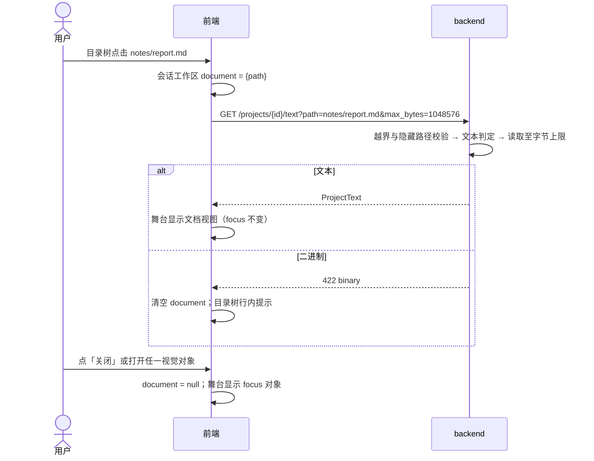
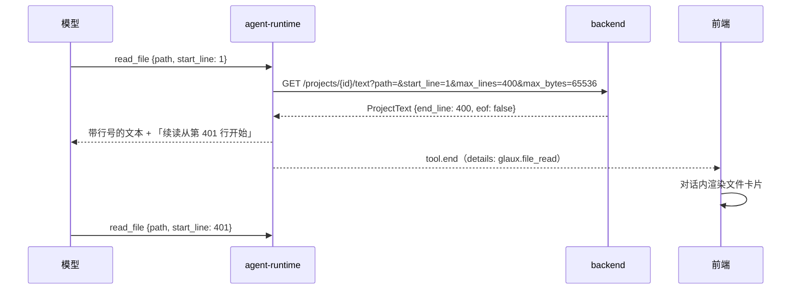
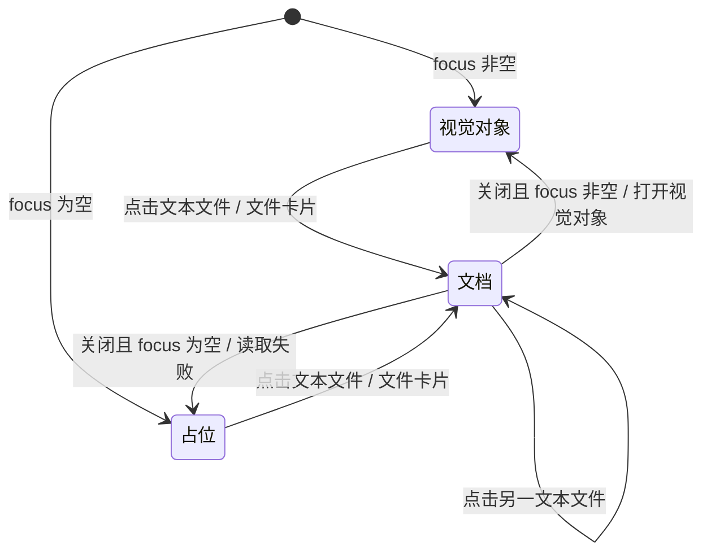
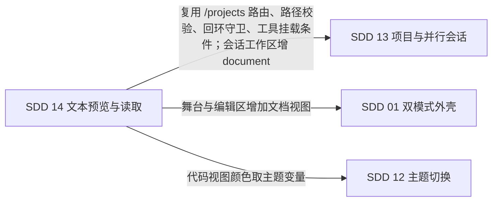

# 14 · 项目文本文件预览与读取

## 0. 文档状态

| 字段 | 内容 |
| --- | --- |
| 状态 | `implemented` |
| 当前阶段 | 已实现并通过自动化门禁与开发侧浏览器走查，自查见 §15；真实模型走查、Workbench 走查与业务验收待补 |
| 关联主 SDD | [Glaux SDD 索引](../../README.md) · [SDD 13 项目文件夹与并行会话](../13-project-folder-sessions/README.md) · [SDD 01 双模式外壳](../01-dual-mode-shell/README.md) · [SDD 10 对象与数据源](../10-object-convergence/README.md) |
| 负责人 | Glaux 项目维护者 |
| 最后更新 | 2026-09-26 |

> 状态合法值仅四个：`draft` → `ready` → `implemented` → `accepted`。

## 1. 本 SDD 负责什么

项目目录里的文本文件（报告、标注 JSON、配置、脚本、日志）可以被用户只读预览、被智能体分段读取。文本文件不是视觉对象，不进入数据源体系，不登记、不派生对象 id。

本 SDD 冻结五件事：

1. **文本判定**：按内容判定一个文件是否为文本，以及用什么编码解码。
2. **读取端点**：`GET /projects/{id}/text`，按行区间和字节上限返回文本。
3. **用户预览**：目录树中非模态文件可点击，舞台区显示只读文档视图；按扩展名选择渲染方式。
4. **智能体工具**：`read_file`，按行区间分段读取，结果在对话内以文件卡片呈现。
5. **会话隔离**：正在预览的文档作为会话级字段，随会话换入换出。

## 2. 本 SDD 不负责什么

- 不做编辑、保存、新建、删除；Glaux 对项目目录只读（SDD 13 §2）。编辑能力另立 SDD。
- 不执行脚本，不渲染 HTML，不做 Notebook 单元格视图（`.ipynb` 按 JSON 显示）。
- 不做表格视图（`.csv`、`.tsv` 按纯文本显示）。
- 不支持 PDF、Office 文档等二进制文档格式。
- Markdown 中的相对路径图片不加载，相对链接不跳转。
- 不做文件内容全文检索；只提供预览内的查找（编辑器内 `Ctrl+F`）。
- 不把用户正在预览的文档写入 `ViewerContext`（SDD 10 §7 规则 20 的五字段不变，D-8）。
- 不做敏感内容过滤；项目内非隐藏文本对智能体可读（D-4）。
- 「未归属」会话不涉及：文本预览只存在于项目目录树。

## 3. 当前阶段目标

一次交付，交付后以下口径成立：

- 用户在项目目录树中点击 `.md`、`.py`、`.json`、`.txt` 等文本文件，舞台区显示只读内容；Markdown 渲染为排版文档，代码有语法高亮与行号。
- 用户关闭文档视图后，舞台恢复为此前的视觉对象，查看状态不丢。
- 智能体在绑定项目的会话中能用 `list_files` 找到文本文件、用 `read_file` 分段读完，并据此回答。
- 两个会话各自预览不同文档，切换会话时舞台显示各自的文档。

## 4. 输入来源

### 4.1 用户输入

| 入口 | 输入 | 约束 |
| --- | --- | --- |
| 项目目录树 | 点击无候选模态的文件 | 只触及项目根以内；隐藏路径不列出（SDD 13 §7.2 规则 8） |
| 文档视图「关闭」按钮 | 无 | 回到视觉对象 |
| 文档视图「渲染 / 源码」切换 | 无 | 仅 Markdown 可用 |
| 对话内文件卡片「在舞台打开」 | 无 | 打开卡片对应的文件 |

### 4.2 智能体输入

| 工具 | 输入 | 约束 |
| --- | --- | --- |
| `read_file` | `path`：项目内相对路径；`start_line`：起始行（从 1 起，缺省 1）；`max_lines`：行数（1～400，缺省 400） | 单次返回不超过 64 KiB；不得越出项目根；隐藏路径拒绝 |

### 4.3 服务端输入

| 来源 | 内容 |
| --- | --- |
| 项目登记（SDD 13 §9.4） | 项目根目录 |
| 文件内容 | 只读；判定编码时读取文件开头至多 64 KiB |
| 请求来源地址 | 端点位于 `/projects*` 下，沿用回环守卫（SDD 13 §7.1 规则 3） |

## 5. 输出结果

### 5.1 用户可见输出

- 目录树中非模态文件由置灰改为可点击；点击后该行显示选中态。文件不是文本时，行内提示「不是文本文件」。
- 舞台区文档视图：顶栏显示文件名、项目内路径、大小、编码与「关闭」按钮，Markdown 另有「渲染 / 源码」切换；正文按 §7.3 渲染；截断时正文上方显示截断提示。
- Focus 模式的舞台（`StagePanel`）与 Workbench 模式的编辑区（`Editor`）行为一致。
- 智能体调用 `read_file` 后，对话内出现文件卡片：文件名、读取的行区间、「在舞台打开」按钮。

### 5.2 系统输出

- `GET /projects/{id}/text` 响应（§9.1）。
- localStorage `glaux.sessionWorkspace.v1` 的条目增加 `document` 字段（§9.4）。
- `read_file` 结果的 `details`（`kind: glaux.file_read`）进入会话快照，卡片随历史持久呈现。

## 6. 核心流程

### 6.1 用户预览

### 6.2 智能体读取

## 7. 核心规则

### 7.1 文本判定与解码

1. 判定只看内容，扩展名只决定渲染方式（D-2）。
2. 读取文件开头至多 64 KiB 作为样本：
   - 以 UTF-8 BOM 开头 → `utf-8-sig`。
   - 以 UTF-16 LE/BE BOM 开头 → `utf-16`。
   - 样本含 NUL 字节 → 二进制，返回 422 `binary`。
   - 样本能按 UTF-8 严格解码 → `utf-8`；样本末尾被截断的多字节序列不算解码失败。
   - 否则能按 GB18030 严格解码 → `gb18030`。
   - 否则 → 二进制，返回 422 `binary`。
3. 编码确定后，正文按该编码解码，样本以外遇到非法字节以 U+FFFD 替换，不报错。
4. 空文件是文本：`text` 为空串，`total_lines` 为 0，`eof` 为真。
5. 换行统一为 `\n`；`\r\n` 与单独的 `\r` 均按一个换行计行。

### 7.2 读取端点

1. 路径校验沿用 SDD 13 的 `_inside`：含 `..`、绝对路径或解析后越出项目根返回 422 `outside_project`。
2. 路径中任一段以 `.` 开头返回 422 `hidden_path`，与目录列举跳过隐藏条目一致（D-4）；`..` 不在此列，按规则 1 判越界。请求路径与解析符号链接后的项目内路径都做该检查，指向隐藏文件的符号链接同样拒绝。
3. 目标不存在返回 404 `not_found`；不是普通文件返回 422 `not_file`。
4. 从 `start_line` 起顺序读取，直到满足任一条件：已读 `max_lines` 行、再读一行将超过 `max_bytes`（按 UTF-8 编码后的字节计）、到达文件末尾。
5. 本次第一行的正文（不含换行）超过 `max_bytes` 时，截取该行前 `max_bytes` 字节（按字符边界），`end_line` 等于该行，`line_truncated` 为真，本次读取到此为止。
6. `max_bytes` 取值 1～1 MiB，缺省 1 MiB；`max_lines` 取值 1～100000，缺省不按行数限制；`start_line` ≥ 1。超出范围返回 422。
7. `start_line` 超过文件总行数时返回空 `text`，`eof` 为真，`total_lines` 为实际行数。
8. `eof` 表示 `end_line` 之后已无行；`total_lines` 只在 `eof` 为真时给出，否则为 `null`；端点不为计数而额外扫描全文件。
9. 端点不登记数据源、不写任何文件。

### 7.3 用户预览

1. 项目目录树中 `modality` 为空的文件可点击，点击即以文本打开；`modality` 非空的文件行为不变（SDD 13 §6.3）。
2. 预览请求 `max_bytes = 1 MiB`、不限行数；`eof` 为假或 `line_truncated` 为真时显示截断提示「文件过大，只显示前 1 MiB」。
3. 渲染方式按扩展名（大小写不敏感）：

   | 扩展名 | 渲染 |
   | --- | --- |
   | `.md`、`.markdown` | 复用 `components/agent/Markdown.tsx`（`react-markdown` + `remark-gfm`）；可切换到源码视图 |
   | `.json`、`.ipynb` | 未截断且能解析时，按 2 空格缩进格式化后以代码视图显示；否则按原文以代码视图显示 |
   | 其余 | 代码视图 |

4. 代码视图使用 CodeMirror 6，只读（`EditorState.readOnly` 与 `EditorView.editable` 均为假），显示行号，支持编辑器内查找。语法高亮按扩展名选择：`.py` → Python；`.json`、`.ipynb` → JSON；`.md`、`.markdown` → Markdown；`.yaml`、`.yml` → YAML；`.js`、`.mjs`、`.cjs`、`.ts`、`.tsx`、`.jsx` → JavaScript/TypeScript；其余不高亮（D-5）。
5. CodeMirror 与语言包按需懒加载，不进入首屏包。
6. 代码视图颜色取自主题 CSS 变量，随深色 / 浅色主题切换（SDD 12）。
7. Markdown 渲染不解析原始 HTML；`http:`、`https:` 链接在新标签页打开并带 `rel="noopener noreferrer"`；其他链接与相对路径图片只显示文字（alt 文本），不发请求。
8. 文档视图不改变 `focus`。打开任一视觉对象（目录树、「最近使用」、对象卡片、智能体结果）时，`document` 置空，舞台显示该对象。
9. 文档视图覆盖在查看器之上，查看器保持挂载，关闭后缩放、窗位、帧索引不变；文档视图打开期间舞台工具栏与度量摘要不显示。
10. 读取失败（`binary`、`not_found` 等）时 `document` 置空，目录树行内显示错误；由文件卡片发起的读取失败显示在卡片内。
11. Focus 右侧栏处于窄屏降级态（文件列占满整栏）时，打开文本预览自动切回舞台，与选图的行为一致（SDD 01 D17）。
12. 文档视图打开期间，舞台工具单键与 `Esc` 复位不作用于被覆盖的查看器。
13. 启动或切换数据源时自动打开首个对象是装配动作，不关闭已恢复的文档视图；只有用户打开对象才关闭。

### 7.4 智能体工具

1. `read_file` 注册在 `TOOL_PROVIDERS`，`requires: { project: true }`，挂载条件与 `list_files` 相同：只对绑定项目的会话挂载，「未归属」会话与 `observe` 权限模式不挂载。不要求视觉能力。
2. 请求固定 `max_bytes = 65536`，`max_lines` 取模型参数（缺省 400，上限 400）。
3. 返回给模型的文本每行带行号前缀（`<行号>\t<内容>`）；单行超过 2000 字符时截断并标注「行已截断」。
4. 文本末尾写明读取区间；`eof` 为假时写明「续读从第 N 行开始」；`eof` 为真时写明总行数。
5. 错误（越界、隐藏路径、二进制、不存在）以工具错误返回模型，不中断回合。
6. `list_files` 的工具说明与提示片段补充：候选模态为 `-` 的文件可能是文本，可用 `read_file` 读取。
7. `read_file` 不改变会话的 `focus` 与 `document`；用户点文件卡片「在舞台打开」后才改变 `document`。

### 7.5 会话隔离

1. `document` 是会话级字段（SDD 13 §7.7 规则 1），切换会话时换入换出并持久化。
2. 切回会话时若 `document` 对应文件已不可读，`document` 置空，舞台显示 `focus` 对象或占位引导。

## 8. 涉及对象

### 8.1 backend

| 文件 | 改动 |
| --- | --- |
| `backend/app/textfile.py`（新） | 文本判定、编码识别、按行区间与字节上限读取 |
| `backend/app/routers/projects.py` | 新增 `GET /projects/{id}/text`；错误码增 `hidden_path`、`binary` |
| `backend/app/schemas.py` | `ProjectText` |

### 8.2 agent-runtime

| 文件 | 改动 |
| --- | --- |
| `agent-runtime/src/pi/tools/read-file.ts`（新） | §7.4 |
| `agent-runtime/src/pi/tools/list-files.ts` | 工具说明补充 `read_file`（§7.4 规则 6） |
| `agent-runtime/src/pi/harness-registry.ts` | 注册 `read_file` 与提示片段 |

### 8.3 前端

| 文件 | 改动 |
| --- | --- |
| `frontend/src/components/DocumentView.tsx`（新） | 文档视图：顶栏、截断提示、按扩展名分派渲染 |
| `frontend/src/components/CodeView.tsx`（新） | CodeMirror 6 只读封装，懒加载语言包，主题取 CSS 变量 |
| `frontend/src/components/agent/FileCard.tsx`（新） | `glaux.file_read` 卡片 |
| `frontend/src/components/agent/AgentConversation.tsx` | 渲染文件卡片 |
| `frontend/src/components/ProjectTree.tsx` | 非模态文件可点击，选中态与行内错误 |
| `frontend/src/components/focus/StagePanel.tsx`、`frontend/src/components/Editor.tsx` | `document` 非空时渲染 `DocumentView` |
| `frontend/src/components/focus/FocusSidePanel.tsx` | 窄屏降级态打开文本预览切回舞台（§7.3 规则 11） |
| `frontend/src/keys/globalKeys.ts` | 文档视图打开时屏蔽舞台工具单键与 `Esc` 复位（§7.3 规则 12） |
| `frontend/src/store/session.ts`、`frontend/src/store/sessionWorkspaces.ts` | `document` 字段与换入换出、持久化；瞬态字段 `documentError`、`documentLoading` 不入工作区 |
| `frontend/src/data/actions.ts` | `openProjectDocument`、`closeDocument`；打开视觉对象时清空 `document` |
| `frontend/src/api/client.ts`、`frontend/src/api/types.ts` | `projectText`、`ProjectText` |
| `frontend/package.json` | 新增 `@codemirror/state`、`@codemirror/view`、`@codemirror/language`、`@codemirror/search`、`@codemirror/lang-json`、`@codemirror/lang-python`、`@codemirror/lang-markdown`、`@codemirror/lang-yaml`、`@codemirror/lang-javascript`、`@lezer/highlight` |
| `frontend/src/i18n/zh.ts`、`en.ts` | 文案 |

## 9. 数据或字段要求

### 9.1 backend 端点

| 方法 | 路径 | 请求 | 响应 | 错误 |
| --- | --- | --- | --- | --- |
| GET | `/projects/{id}/text?path=&start_line=&max_lines=&max_bytes=` | §7.2 | `ProjectText` | 404 `project_not_found` / `not_found`；422 `outside_project` / `hidden_path` / `not_file` / `binary`；422 参数越界（FastAPI 校验错误体）；403 非回环来源或无读权限 |

错误体沿用 `{"detail": {"code", "message"}}`（SDD 13 §9.1）。

| 字段 | 类型 | 说明 |
| --- | --- | --- |
| `path` | `string` | 项目内相对路径（POSIX 分隔） |
| `name` | `string` | 文件名 |
| `size` | `int` | 文件字节数 |
| `encoding` | `"utf-8" \| "utf-8-sig" \| "utf-16" \| "gb18030"` | §7.1 规则 2 |
| `start_line` | `int` | 本次起始行，从 1 起 |
| `end_line` | `int` | 本次最后一行；未读到任何行时为 `start_line - 1` |
| `text` | `string` | 各行拼接，每行保留行尾 `\n`（文件末行无换行时除外）；换行统一为 `\n`；不含行号 |
| `eof` | `bool` | `end_line` 之后是否已无行 |
| `total_lines` | `int \| null` | 仅 `eof` 为真时给出 |
| `line_truncated` | `bool` | 最后一行是否因字节上限被截断（§7.2 规则 5） |

### 9.2 `read_file` 工具

| 项 | 内容 |
| --- | --- |
| 参数 | `{path: string, start_line?: integer ≥ 1, max_lines?: integer 1～400}` |
| 返回 `content` | 单个文本块：区间说明 + 带行号正文 + 续读提示（§7.4 规则 3、4） |
| 返回 `details` | `{kind: "glaux.file_read", path, name, start_line, end_line, eof, total_lines}` |

### 9.3 前端类型

| 类型 | 字段 |
| --- | --- |
| `ProjectText` | 同 §9.1 |
| `DocumentRef` | `{path: string}`；项目由会话绑定决定，不重复存 |

### 9.4 会话工作区增量（修订 SDD 13 §9.6）

| 字段 | 来源 | 持久化 |
| --- | --- | --- |
| `document` | `useSession.document: DocumentRef \| null` | 是 |

localStorage `glaux.sessionWorkspace.v1` 条目变为 `{modality, focus, document}`；旧条目缺 `document` 时按 `null` 读取，不升版本号。文档正文不持久化，切回会话时重新请求。

## 10. 幂等规则

- `GET /projects/{id}/text` 是只读请求，同一参数重复调用结果相同（文件未变时）。
- 重复点击同一文件只发起一次请求；请求返回前再次点击不重复发起。

## 11. 状态或生命周期规则

### 11.1 舞台显示

### 11.2 文档视图加载态

| 状态 | 展示 |
| --- | --- |
| 加载中 | 顶栏显示文件名，正文显示加载指示 |
| 已加载 | 正文按 §7.3 渲染 |
| 失败 | 回到 §11.1 的前一状态，目录树行内显示错误 |

## 12. 审计或事件规则

- 不埋点、不上报。
- 不新增 SSE 事件类型。
- `read_file` 的 `details` 进入会话快照，与 `glaux.object_opened` 同一机制。

## 13. 异常和人工处理

| 场景 | 处理 |
| --- | --- |
| 点击二进制文件（如 `.zip`、`.pdf`） | 422 `binary`；行内提示「不是文本文件」 |
| 文件大于 1 MiB | 预览显示前 1 MiB 与截断提示；智能体可按行分段读完 |
| 单行极长（压缩后的 JSON） | 预览按字节上限截断该行；智能体侧每行截到 2000 字符 |
| 非 UTF-8 且非 GB18030 的文本（如 Latin-1） | 判为二进制或按 GB18030 误解码；不做更多编码探测，属已知限制 |
| 文件在预览期间被外部修改 | 不自动刷新；重新点击该文件获取最新内容 |
| 请求隐藏文件（如 `.env`） | 422 `hidden_path` |
| CodeMirror 语言包加载失败 | 退回无高亮的代码视图，正文照常显示 |
| 项目目录失效 | 沿用 SDD 13 §11.1「路径失效」 |

## 14. 与其他 SDD 的调用关系

本 SDD 在以下条款修订上游 SDD，上游条款已同步修改：

| SDD | 条款 | 修订内容 |
| --- | --- | --- |
| 13 | §5.1「不可识别文件置灰」 | 改为「无候选模态的文件可点击以文本预览」 |
| 13 | §1 第 7 项、§7.3、§4.2 | 智能体浏览工具增加 `read_file`，指向本 SDD |
| 13 | §9.6 会话工作区 | 增加 `document` 字段 |
| 01 | §8 `StagePanel`、`Editor` | 增加文档视图分支 |

`docs/architecture.zh-CN.md` 与 `docs/runbooks/reference-agent-conversations.md` 同步新增端点与工具说明。

## 15. 验收标准

### 15.1 文本判定与端点

- [x] UTF-8、UTF-8 BOM、UTF-16 LE BOM、GB18030 编码的文件返回正确的 `encoding` 与正文。——单测 `test_project_text.py`；走查（GB18030 报告）
- [x] 含 NUL 字节的文件、PNG、ZIP 返回 422 `binary`。——单测；走查（`.zip`、`.jpg`）
- [x] 样本边界恰好切断 UTF-8 多字节字符的文件仍判为 `utf-8`。——单测
- [x] 路径含 `..`、指向项目外的符号链接返回 422 `outside_project`；`.env`、`.git/config` 返回 422 `hidden_path`。——单测（含指向 `.env` 的符号链接）；走查（`.env`、`../etc/passwd`）
- [x] 1000 行文件以 `start_line=401&max_lines=400` 读取，返回第 401～800 行，`eof` 为假，`total_lines` 为 `null`；以 `start_line=801` 读取，返回第 801～1000 行，`eof` 为真，`total_lines` 为 1000。——单测
- [x] 5 MiB 文件以 `max_bytes=1048576` 读取，返回正文不超过 1 MiB，`eof` 为假。——单测
- [x] 单行 3 MiB 的文件以缺省参数读取，`line_truncated` 为真，正文不超过 1 MiB。——单测
- [x] 空文件返回 `text=""`、`total_lines=0`、`eof=true`。——单测
- [x] `\r\n` 换行的文件返回的正文不含 `\r`，行数与 `\n` 换行版本一致。——单测
- [x] 非回环来源请求返回 403。——单测
- [x] 读取后 `sources.json` 不变，项目目录内无新文件。——单测

### 15.2 用户预览

- [x] 目录树中 `.md`、`.py`、`.json`、`.txt`、`.yaml`、无扩展名文本文件可点击，舞台显示文档视图；`.jpg`、`.mp4` 点击行为与 SDD 13 一致。——单测 `ProjectTree.test.tsx`；走查（`.md`、`.py`、`.json`、`.txt`、`.yaml`、`NOTES`、`.jpg`）
- [x] `.md` 显示为排版文档，表格与任务列表（GFM）正确渲染；切换「源码」显示原文与行号。——走查（1 个表格、2 个任务项、源码视图 20 行行号）
- [x] Markdown 内嵌 `<script>` 与 `` 不执行、不渲染为元素；相对路径图片不产生网络请求。——单测 `DocumentView.test.tsx`；走查（无 `script`、`img` 元素，无 `figs/a.png` 请求，外链带 `noopener noreferrer`）
- [x] `.json` 未截断时按缩进格式化显示；非法 JSON 按原文显示，不报错。——单测；走查（`labels.json`、`bad.json`）
- [x] `.py` 有语法高亮与行号；编辑器内 `Ctrl+F` 可查找；正文不可编辑。——走查（高亮 token、`contenteditable=false`、`Ctrl+F` 打开查找栏并聚焦）
- [x] 大于 1 MiB 的文件、单行超过 1 MiB 的文件均显示截断提示。——单测（两种情况）；走查（2 MiB `big.log`）
- [x] 点击 `.zip` 行内提示「不是文本文件」，舞台保持原状。——单测；走查
- [x] 焦点为图像 X 时打开文档，再点「关闭」，舞台回到 X，缩放与窗位不变。——走查（关闭后同一 `canvas` 元素仍在，查看器未重建）
- [x] 文档视图打开时点击目录树中的图像，舞台显示该图像。——单测 `actions.test.ts`；走查
- [ ] Focus 与 Workbench 两种模式下行为一致。——Focus 走查通过；Workbench 入口缺省关闭，`Editor` 覆盖层已实现，未走查
- [x] 深色、浅色主题下代码视图颜色随主题切换。——走查（切换 `data-theme` 后编辑器背景与前景色随之变化）
- [x] 首屏 JS 包不包含 CodeMirror（构建产物中 CodeMirror 位于独立分块）。——构建产物检查（CodeMirror 与 Lezer 只在经动态 `import()` 加载的分块）

### 15.3 智能体

- [x] 绑定项目的会话挂载 `read_file`；「未归属」会话与 `observe` 模式不挂载。——单测 `project-tools.test.ts`
- [x] 连接未声明视觉能力时 `read_file` 仍挂载。——单测
- [x] 读取 1000 行文件：首次返回 400 行并提示续读起点；按提示续读两次后读完，末次写明总行数。——单测
- [x] 读取 `.env`、二进制文件、项目外路径时模型收到工具错误，回合继续。——单测（harness 级断言 `isError` 与回合继续）
- [x] `read_file` 后会话 `focus` 与 `document` 不变；对话内出现文件卡片，点「在舞台打开」后舞台显示该文件。——单测 `FileCard.test.tsx`、`project-tools.test.ts`
- [ ] 真实模型走查：项目内放一份含测量要求的 `README.md`，用户只说「按项目说明做」，智能体用 `list_files` + `read_file` 读到说明并据此行动。——工具链路单测通过；待维护者在已配置模型的环境走查

### 15.4 会话隔离

- [x] 会话 A 预览 `a.md`、会话 B 预览 `b.py`；来回切换，舞台显示各自文档。——单测 `sessionWorkspaces.test.ts`；走查（项目会话与未归属会话来回切换）
- [x] 刷新页面后，各会话的 `document` 恢复并重新加载正文。——单测；走查
- [x] 旧版本写入的 `glaux.sessionWorkspace.v1` 条目（无 `document`）正常读取。——单测
- [x] 切回会话时文档已被删除，舞台回到视觉对象或占位引导，不报未捕获异常。——单测（读取失败清空 `document`，`focus` 不变）

### 15.5 工程

- [x] typecheck、lint、前端、agent-runtime、backend 既有测试不回退；`check-modality-literals.sh` 门禁 0。——backend 492、agent-runtime 288、前端 340 全部通过；lint、build 通过；门禁 0
- [x] 新增单测覆盖：编码判定、行区间与字节上限、隐藏路径与越界、`read_file` 输出格式与挂载条件、`document` 换入换出与持久化、扩展名到渲染方式的分派。——backend 33、agent-runtime 16、前端约 33 个用例
- [ ] 业务验收。

## 16. 决策记录

| 编号 | 决策 | 备选 | 选择理由 | 时间 |
| --- | --- | --- | --- | --- |
| D-1 | 用户预览与智能体读取同期交付，共用一个后端端点 | 只做其一 | 两者读的是同一份内容；共用端点使越界、隐藏路径、编码规则只有一处实现 | 2026-09-25 |
| D-2 | 文本判定按内容（NUL 字节 + 严格解码），扩展名只决定渲染方式 | 扩展名白名单 | 白名单总会漏掉 `.toml`、`.R`、`.cfg`、无扩展名文件；内容判定只多读 64 KiB | 2026-09-25 |
| D-3 | 预览上限 1 MiB 且截断显示；智能体单次上限 400 行或 64 KiB，按行续读 | 统一上限；超限拒绝 | 预览要一次看到尽量多；模型上下文有限，分段读取可覆盖任意大小的文件 | 2026-09-25 |
| D-4 | 智能体可读项目内非隐藏文本，隐藏路径一律拒绝；不做敏感内容过滤；`observe` 模式不挂载 | 增加项目级「禁止读文本」开关；内容过滤 | 打开项目即授权智能体浏览（SDD 13 D-17）；隐藏路径覆盖 `.env`、`.git` 等常见密钥位置；开关与过滤等有实际需要再加 | 2026-09-25 |
| D-5 | 代码视图用 CodeMirror 6 只读模式 | Monaco；Shiki | CodeMirror 6 是完整编辑器，日后编辑只需关闭只读；体积约 150 KB 且可按语言懒加载；颜色直接读 CSS 变量；无 CDN 依赖。Monaco 数 MB、缺省从 CDN 加载、主题需另行同步；Shiki 无行号、查找与可视区渲染 | 2026-09-25 |
| D-6 | Markdown 复用现有 `react-markdown` 组件，不解析原始 HTML | 引入 `rehype-raw` 渲染 HTML | 项目文件来源不受控，渲染原始 HTML 需要额外的净化层；现有组件已在对话中使用 | 2026-09-25 |
| D-7 | 文档视图是会话级 `document` 字段，与 `focus` 并存且不改变 `focus` | 把文本文件做成一种视觉对象 | 文本不是观测对象，没有帧、坐标与任务；并入对象体系需改 SDD 10 的 `ObjectKind` 与数据源协议 | 2026-09-25 |
| D-8 | 不把正在预览的文档写入 `ViewerContext` | 增加 `ViewerContext.document` | SDD 10 §7 规则 20 固定五字段；用户可直接在对话中说出文件名，智能体用 `read_file` 读取 | 2026-09-25 |
| D-9 | 编码只识别 UTF-8（含 BOM）、UTF-16（带 BOM）、GB18030 | 引入 `charset-normalizer` 做通用探测 | 覆盖中英文报告与代码的主流编码；通用探测对短文本误判率高且增加依赖 | 2026-09-25 |

## 17. 待确认问题

- 无。
