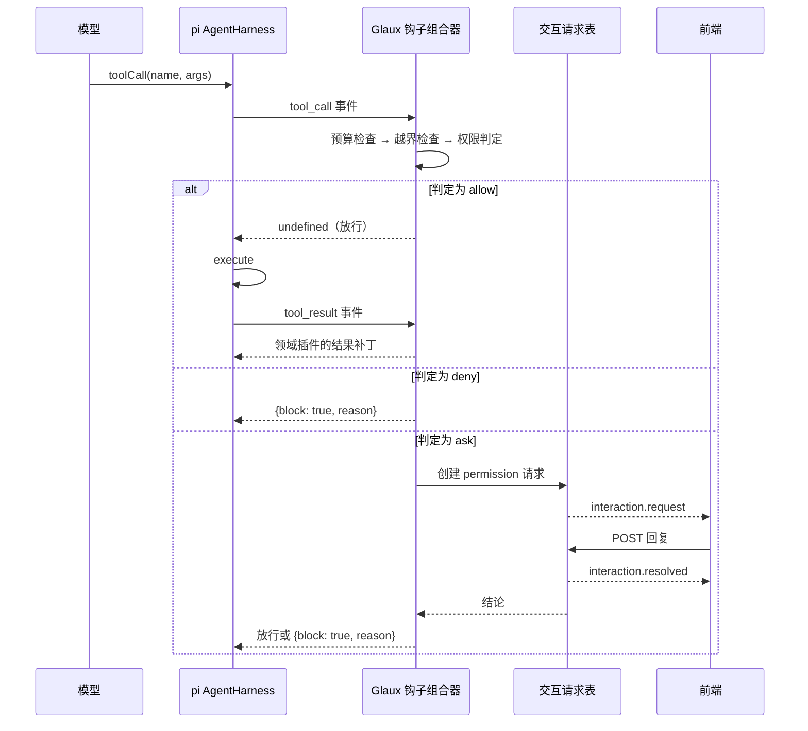
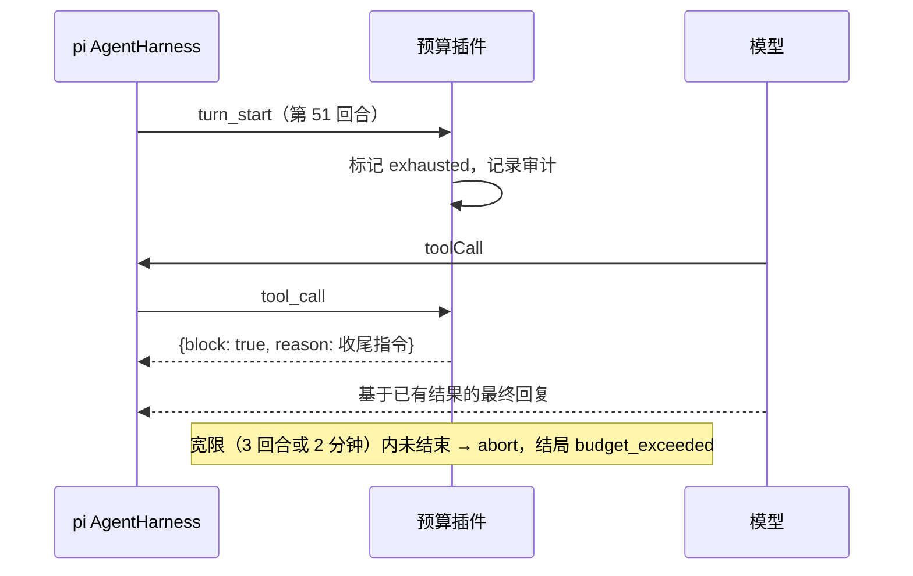
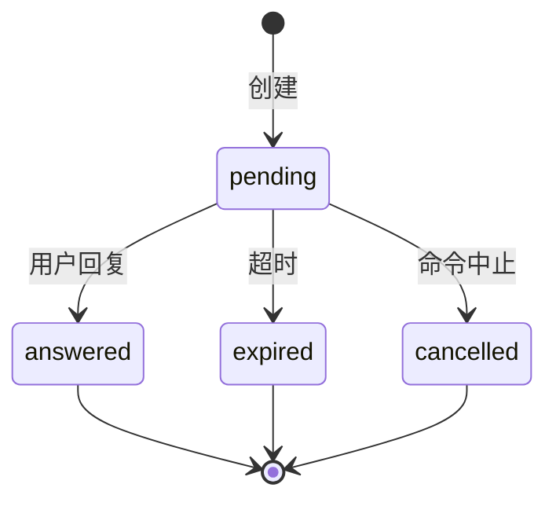
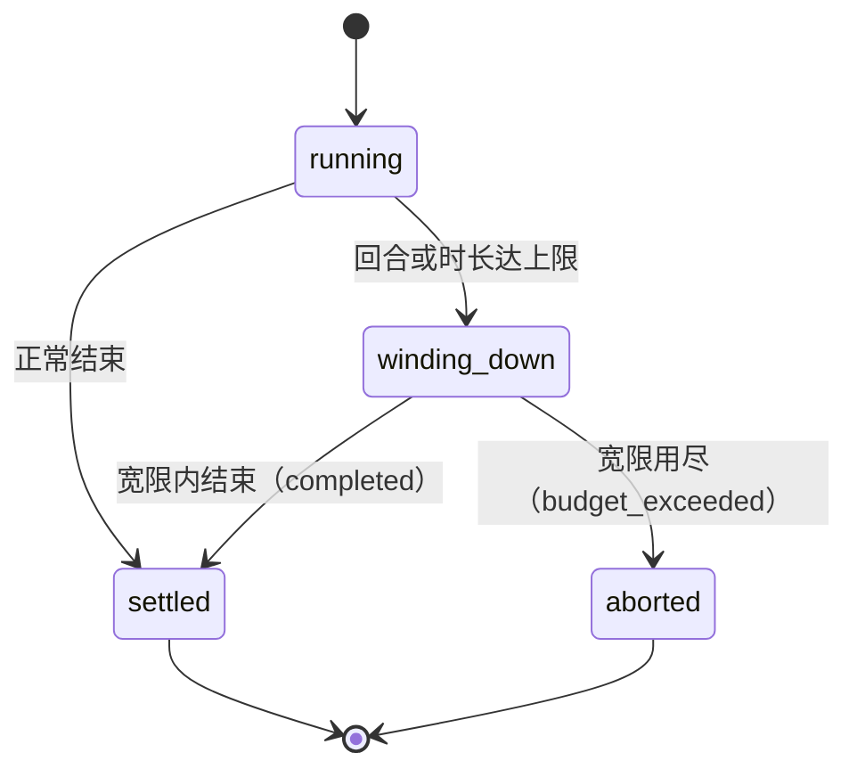

# 15 · 智能体插件契约与权限引擎

## 0. 文档状态

| 字段 | 内容 |
| --- | --- |
| 状态 | `implemented` |
| 当前阶段 | 已按 [实施计划](../../../plans/2026-10-02-agent-plugins-permissions-plan.md) 实现，自动化门禁、开发侧浏览器走查与真实模型走查（OpenAI 兼容连接）通过，含 Workbench 布局，自查见 §15；业务验收待补 |
| 来源 | [脑暴 20261001-01 智能体能力重构](../../../brainstorms/20261001-01-agent-capability-refactor.zh-CN.md) 的 P0 |
| 关联主 SDD | [Glaux SDD 索引](../../README.md) · [SDD 00 参考智能体与会话](../00-reference-agent-conversations/README.md) · [SDD 02 智能体图像标注](../02-agent-image-annotation/README.md) · [SDD 11 视频理解 harness](../11-video-understanding-harness/README.md) · [SDD 13 项目文件夹与并行会话](../13-project-folder-sessions/README.md) |
| 负责人 | Glaux 项目维护者 |
| 最后更新 | 2026-10-02 |

> 状态合法值仅四个：`draft` → `ready` → `implemented` → `accepted`。

## 1. 本 SDD 负责什么

本 SDD 为 agent-runtime 建立插件化的工具与钩子体系，并把权限从「只存不用」变成真正生效的执行引擎。它是后续基础工具（`read` / `write` / `edit` / `bash`）、Skills、子智能体三项能力的前置。

冻结六件事：

1. **插件契约**：工具、钩子、提示词片段以插件为单位登记；同类钩子由 Glaux 统一组合后注册到 pi-agent-core。
2. **工具副作用分级与权限判定**：每个工具声明 `effect`；按「越界 → 规则 → 会话授权 → 模式」判定放行、审批或拒绝。
3. **交互请求**：权限审批与 `ask_user` 提问共用一套挂起机制，经 SSE 下发、经回复端点续跑。
4. **运行预算**：每个命令的回合数与时长上限；用尽时要求模型收尾，超出宽限即中止。
5. **上下文裁剪**：每次模型请求前，把较早的工具结果图像替换为文字占位。
6. **transport 事件结构**：前端只消费 Glaux 定义的事件与消息结构，不再透传 `pi.event`。

## 2. 本 SDD 不负责什么

- `read` / `write` / `edit` / `bash` 四个基础工具与会话工作区（脑暴 P1，另立 SDD）。本 SDD 只为它们预留 `write`、`exec` 两个 effect 等级与规则匹配接口。
- Skills、提示词管理页、提示词模板（脑暴 P2）。
- 子智能体（脑暴 P3）。本 SDD 只定义 `delegate` effect 等级，`agent` 工具见 [SDD 18](../18-agent-subagents/README.md)。
- MCP 客户端与服务端。
- `bash` 沙箱。
- 命令执行中途的全量历史压缩：压缩仍只在命令开始前检查（SDD 00），本 SDD 只做图像裁剪。
- harness 常驻：仍为每个命令新建一个 harness（D-1）。
- Docker chat 发行版：chat 版不再维护，不挂任何工具，不受本 SDD 影响。

## 3. 当前阶段目标

- 现有 12 个工具迁入插件后，在 `controlled` 模式下行为与迁移前一致，现有测试全部通过。
- 四个权限模式各有可观察的差异，`suggest` 下的审批可在界面完成。
- 模型可以用 `ask_user` 向用户提问并按回答继续。
- 任何命令不会无限运行：超出预算后有收尾回复，超出宽限后中止。
- 前端事件处理不再引用 pi-agent-core 的事件类型名。

## 4. 输入来源

### 4.1 用户输入

| 输入 | 来源 | 说明 |
| --- | --- | --- |
| 权限模式 | 对话区权限下拉菜单 → `PATCH /sessions/{id}` | 切换到 `autonomous` 前前端弹出确认 |
| 审批回复 | 审批卡片 → 回复端点 | 允许本次 / 本会话允许 / 总是允许 / 拒绝（可附理由） |
| 提问回复 | 提问卡片 → 回复端点 | 选一个选项，或输入自由文本 |
| 中止 | 现有中止命令 | 同时取消所有待决交互请求 |

### 4.2 智能体输入

| 输入 | 说明 |
| --- | --- |
| 工具调用 | 每次调用都经 `tool_call` 钩子判定 |
| `ask_user` 调用 | 产生 `question` 类交互请求 |

### 4.3 配置输入

| 输入 | 位置 | 说明 |
| --- | --- | --- |
| 用户级设置 | `~/.glaux/settings.json` | 权限规则、预算 |
| 项目级设置 | `<项目目录>/.glaux/settings.json` | 只对绑定该项目的会话生效；项目路径经 backend `GET /projects` 取得 |
| 环境变量 | `GLAUX_AGENT_MAX_TURNS`、`GLAUX_AGENT_MAX_MINUTES` | 覆盖默认预算，优先级低于设置文件 |

## 5. 输出结果

### 5.1 用户可见输出

- 对话流中的审批卡片与提问卡片，回复后折叠为一行结论，显示在主对话中关联的工具调用之后（`tool_call_id`，同一标识有多条调用时取最后一条）；找不到该调用时显示在消息末尾。
- 交互卡片：中性底色、单一强调色（`--agent`）；标题行为类型标题与「运行已暂停 · N 分钟后过期」。
  - 提问卡片：问题为视觉中心；选项纵向整行排列，左侧序号键 1–9，单击或按数字键作答；有选项时「其他回答…」点开才出现输入框，无选项时直接给输入框。卡片出现时，焦点不在输入框就移到卡片上，不抢正在输入的焦点。
  - 审批卡片：副作用等级标签（`write`、`exec`、`egress`、`delegate` 用警示色）与入参摘要；「允许本次」为主按钮；拒绝理由与「拒绝」另起一行。
- 工具调用条目：标题行为工具名、入参摘要、耗时（运行中显示「运行中…」）。耗时扣除等待用户回复（审批、`ask_user`）的时长，等待满 1 秒时另以淡色显示「等你 N 秒」；点开显示完整输入（JSON）与输出（截断后的文本）。产出卡片（文件、对象、子智能体、图谱引用）挂在条目下方。
- 工具步骤组：连续的工具调用归为一组，标题为「调用了 N 次工具」、失败数与总耗时（扣除等待时长；全部调用都有耗时才显示）。`ask_user` 不进步骤组：提问卡片与回答后的结论行已呈现它，只含 `ask_user` 的消息只显示结论行。模型的文字不进组、始终可见；同一条消息里先有文字再有调用时，文字照常显示，调用另起一组。位于对话流末尾的组默认展开，其后已有文字的组默认收起；用户可随时展开或收起。待人确认的建议标注卡片不收进组内。
- 组内的子智能体卡片只显示标题行（任务、类型、结局、回合数），点开再看最终回复与过程。
- 工具结果与调用按「调用之后第一条同标识的结果」配对：部分 OpenAI 兼容端点跨回合复用调用标识。
- 被插件拦截的调用（权限拒绝、越界、预算用尽）在条目标题行显示「未执行：理由」；执行后出错的显示「失败：理由」，理由取输出首行。
- 预算用尽时，最终回复前显示一行「已达本次运行上限（N 回合 / M 分钟）」。
- 权限下拉菜单每项附一句说明；切换到 `autonomous` 时的确认对话框。

### 5.2 系统输出

- 新的 transport 事件（§9.5）。
- 会话内的审计记录（§12）。
- 「总是允许」写入的设置文件规则。

## 6. 核心流程

### 6.1 一次工具调用



### 6.2 预算用尽



## 7. 核心规则

### 7.1 插件契约

1. 插件是一组声明：名称、挂载条件、工具、钩子、提示词片段（§9.1）。
2. 插件按 `PLUGINS` 数组顺序登记。顺序决定提示词片段的拼接顺序和钩子的执行顺序。
3. 现有 12 个工具按领域归入插件：

| 插件 | 工具 | 钩子 |
| --- | --- | --- |
| `budget` | — | `tool_call`（收尾拦截） |
| `permission` | — | `tool_call`（越界、规则、模式、审批） |
| `interaction` | `ask_user` | — |
| `imaging` | `run_task`、`view_current_image` | — |
| `atlas` | `consult_atlas` | — |
| `annotation` | `locate_roi`、`segment_region`、`propose_annotation` | — |
| `project` | `list_files`、`open_file` | — |
| `files` | `read`、`write`、`edit`（SDD 16） | — |
| `video` | `observe_video_interval`、`submit_video_answer` | `before_provider_payload` 不在本期迁移，`onPayload` 保持原样 |
| `context-pruning` | — | `context`（图像裁剪） |

4. `budget` 与 `permission` 恒为最先登记的两个插件，任何领域插件都不能排在它们之前。
5. 现有 `ToolProvider` 的 `requires` / `supports` 挂载条件原样保留，成为插件内工具的挂载条件。

### 7.2 钩子组合

pi-agent-core 对 `tool_call`、`tool_result`、`context` 的多个 handler 传入同一个原始事件，取最后一个非 `undefined` 返回值，结果不串联（`before_provider_request` 与 `before_provider_payload` 会串联，不受此限）。因此：

1. 每个命令的 harness 上，每种钩子类型 Glaux 只注册**一个** handler，由组合器按插件顺序调用各插件的同类钩子。
2. `tool_call`：顺序执行，第一个返回 `{block: true}` 的结果即为最终结果，后续插件不再执行。
3. `tool_result`：顺序执行，每个插件拿到上一个插件补丁后的结果，补丁按字段合并；任一插件设置 `terminate: true` 即保留。
4. `context`：顺序执行，每个插件的输出消息数组作为下一个插件的输入。
5. 插件钩子抛出异常时，组合器捕获并记录：在 `tool_call` 中转为 `{block: true, reason: "internal_error"}`；在 `tool_result` 中忽略该插件补丁；在 `context` 中使用该插件的输入原样继续。钩子异常不使运行失败。

### 7.3 工具副作用分级

| effect | 含义 | 本期工具 |
| --- | --- | --- |
| `read` | 只读或只向当前模型连接发送数据；不改任何状态 | `view_current_image`、`consult_atlas`、`list_files`、`open_file`、`read`（SDD 16）、`observe_video_interval`、`submit_video_answer`、`ask_user` |
| `annotate` | 写建议态标注，必须人工确认 | `propose_annotation` |
| `compute` | 调用本机计算或模型推理，结果写回查看器 | `run_task`、`locate_roi` |
| `egress` | 向当前模型连接以外的第三方发送数据 | `segment_region` |
| `write` | 修改文件 | `write`、`edit`（SDD 16） |
| `exec` | 执行任意命令（P1 启用） | — |
| `delegate` | 派发子智能体（SDD 18） | `agent` |

- `submit_video_answer` 只写会话内证据记录，归为 `read`。
- 没有声明 `effect` 的工具不能登记，启动时报错。

### 7.4 权限模式

| 模式 | 自动放行 | 需审批 | 不挂载 |
| --- | --- | --- | --- |
| `observe` | read | — | annotate、compute、egress、write、exec、delegate |
| `suggest` | read、annotate | compute、egress、write、delegate | exec |
| `controlled`（默认） | read、annotate、compute、egress、项目目录内的 write、delegate | 项目目录外的 write | exec |
| `autonomous`（最高权限） | 全部 | 只有命中 `ask` 规则的调用 | — |

1. 「不挂载」在命令开始组装工具集时生效，模型看不到该工具。
2. 「自动放行」与「需审批」在每次 `tool_call` 时按会话**当前**模式判定。命令执行中把模式调低，下一次工具调用立即按新模式判定；调高到可挂载更多工具的模式，下一个命令才挂载新工具。
3. 切换到 `autonomous` 由前端弹出确认对话框，文案写明：智能体可以不经确认修改文件，并在本机以当前用户身份执行命令。runtime 不重复校验。
4. 任何模式下，`propose_annotation` 恒写建议态。

### 7.5 权限判定顺序

每次 `tool_call`，`permission` 插件按以下顺序判定，命中即停：

1. **项目越界**：工具标为 `projectScoped`（`run_task`、`view_current_image`、`locate_roi`、`segment_region`、`propose_annotation` 与两个视频工具），且对象所属项目与会话不一致 → deny（规则同 SDD 13 §7.8 规则 4，判定逻辑从 `withProjectGuard` 移入此处）。
2. **deny 规则**：任一级设置文件中命中 → deny。
3. **ask 规则**：任一级设置文件中命中 → ask。审批卡片不提供「本会话允许」「总是允许」。
4. **allow 规则或会话授权**：命中 → allow。
5. **模式默认**：按 §7.4 表格。

规则匹配：

- `tool` 为工具名或 `*`。
- `pattern` 可选，缺省匹配该工具的所有调用。工具可声明 `permissionSubject(args)` 返回被匹配的字符串（P1 中 `write` / `edit` 返回路径，按 glob 匹配；`bash` 返回命令，按前缀匹配）。没有声明 `permissionSubject` 的工具，带 `pattern` 的规则不命中。
- 项目级与用户级规则同时生效；deny 与 ask 不区分来源。

### 7.6 交互请求

1. 交互请求有两类：`permission`（来自 §7.5 的 ask）与 `question`（来自 `ask_user`）。
2. 请求在 runtime 内存中登记，同一会话可同时存在多个待决请求（模型并行调用多个工具时）。
3. 请求创建后经 `interaction.request` 事件下发，并出现在会话快照的 `pending_interactions` 中，刷新页面后仍能看到。
4. 回复经 `POST /agent-api/v1/sessions/{id}/interactions/{request_id}` 提交；结果经 `interaction.resolved` 事件下发。
5. 超时：默认 30 分钟未回复视为过期。`permission` 过期等同拒绝；`question` 过期时工具返回「用户未回复」。
6. 命令被中止时，该命令的全部待决请求转为 `cancelled`，对应工具调用被拦截。
7. runtime 重启后内存中的待决请求丢失。命令结局按 SDD 00 的规则记为结局未知，前端不再显示这些请求。
8. 等待回复的时间不计入预算时长（§7.8）。
9. 回复「本会话允许」：写入会话授权，后续同一工具的调用不再审批，授权仅当前会话有效。
10. 回复「总是允许」：写入规则 `{tool, decision: "allow"}`。会话绑定了项目时写项目级设置文件，否则写用户级设置文件。

### 7.7 `ask_user`

| 字段 | 规则 |
| --- | --- |
| `question` | 必填，≤ 500 字符 |
| `options` | 可选，0～4 个，每个 ≤ 80 字符 |
| `allow_free_text` | 可选，缺省 `true`；`options` 为空时强制为 `true` |

- 工具结果为用户所选选项或输入的文本。
- effect 为 `read`，所有模式可用。
- 提示词片段说明：只在缺少继续所需的信息、或存在多个合理方向时使用；不用来请求权限，权限由系统处理。

### 7.8 运行预算

1. 预算以命令为单位，默认 50 回合、20 分钟。回合以 pi 的 `turn_start` 事件计数；时长从命令开始计时，扣除交互请求的等待时间。
2. 回合数或时长任一达到上限，命令进入「收尾」状态：此后每次 `tool_call` 都返回 `{block: true, reason}`，`reason` 要求模型停止调用工具，基于已有结果作答，并说明哪些部分未完成。同时，收尾回合的模型请求保留工具定义、把 `tool_choice` 设为不调用（OpenAI 兼容为 `"none"`，Anthropic 为 `{type: "none"}`），使模型只能作答，并在请求上下文末尾追加一条作答要求（只改请求，不写会话），以免预算在回合开始时判定用尽、模型尚未见过拦截理由；子智能体同样处理。
3. 进入收尾后，再过 3 回合或 2 分钟仍未结束，runtime 中止命令，结局记为 `budget_exceeded`。
4. 优先级：项目级设置文件 > 用户级设置文件 > 环境变量 > 默认值。上限的合法范围：回合数 1～500，时长 1～240 分钟；超出范围的值忽略并按下一优先级取值。
5. SDD 11 的视频观察预算独立计算，不受本节影响。

### 7.9 上下文裁剪

1. 每次模型请求前，`context-pruning` 插件保留最近 4 个包含图像的工具结果中的图像，更早的工具结果中的图像块替换为文字占位：`[图像已省略：<工具名> 的结果，如需再看请重新调用]`。
2. 用户消息中的图像附件不裁剪。
3. 裁剪只作用于发给模型的请求，不修改会话存储。

### 7.10 transport 事件结构

1. SSE 不再发送 `pi.event`。runtime 订阅 pi 事件，转换为 §9.5 的 Glaux 事件后下发；下发前对事件中的每个字符串执行 `redactText`，不对序列化后的整段 JSON 执行（整段替换会吞掉字符串结束引号）。
2. 会话快照与事件中的消息使用 Glaux 定义的 `TranscriptMessage`（§9.6）。它与 pi-ai 当前的消息结构字段一致，但由 Glaux 声明；pi-ai 结构变化时由 runtime 转换，前端不跟着改。
3. 前端 `piEventType`、`applyPiEvent` 等基于 pi 事件名的代码改为基于 Glaux 事件名。

### 7.11 harness 生命周期

1. 仍为每个命令新建一个 harness，命令结束即释放，凭据随之销毁（SDD 00）。
2. 钩子组合器、预算计数、交互请求在 harness 创建时绑定，生命周期与命令一致。
3. 会话授权与审计记录存于 Pi 会话，跨命令有效。

## 8. 涉及对象

### 8.1 agent-runtime

| 位置 | 变化 |
| --- | --- |
| `src/plugins/`（新） | 插件契约、`PLUGINS` 登记表、钩子组合器、各领域插件 |
| `src/permission/`（新） | effect 判定、规则加载与匹配、设置文件读写、会话授权 |
| `src/interaction/`（新） | 交互请求表、超时、`ask_user` 工具 |
| `src/pi/harness-registry.ts` | `TOOL_PROVIDERS` 拆入插件；`start()` 改为按插件组装工具、提示词与钩子 |
| `src/pi/tools/project-guard.ts` | 判定逻辑并入 `permission` 插件，`withProjectGuard` 删除 |
| `src/transport/` | 新增回复端点；事件转换；快照增加字段 |
| `src/contracts.ts` | 新增 §9 的类型；删除 `pi.event` 事件类型 |

### 8.2 前端

| 位置 | 变化 |
| --- | --- |
| `agent/runtime/events.ts`、`types.ts` | 订阅新事件；删除 `pi.event` |
| `store/agentSessions.ts` | `applyPiEvent` 改为按 Glaux 事件分发；保存 `pending_interactions` |
| `agent/toolBridge.ts` | 由 `tool_execution_end` 改为 `tool.end` |
| `components/agent/`（新组件） | `InteractionCard`：审批与提问两种形态 |
| `components/agent/AgentConversation.tsx` | 权限下拉菜单附说明；切换到 `autonomous` 的确认对话框 |

## 9. 数据或字段要求

### 9.1 插件契约

```ts
type ToolEffect = "read" | "annotate" | "compute" | "egress" | "write" | "exec" | "delegate";

interface PluginTool extends ToolProvider {
  effect: ToolEffect;
  /** 规则 pattern 的匹配对象；缺省则带 pattern 的规则不命中。 */
  permissionSubject?(args: Record<string, unknown>): string | undefined;
}

interface GlauxPlugin {
  name: string;
  applies(ctx: HarnessToolContext): boolean;
  tools?: PluginTool[];
  hooks?: {
    tool_call?(e: ToolCallEvent, ctx: RunContext): Promise<ToolCallResult | undefined>;
    tool_result?(e: ToolResultEvent, ctx: RunContext): Promise<ToolResultPatch | undefined>;
    context?(messages: AgentMessage[], ctx: RunContext): Promise<AgentMessage[]>;
    turn_start?(ctx: RunContext): Promise<void>;
  };
  promptFragment?(ctx: HarnessToolContext): string;
}
```

`RunContext` 提供：会话 id、命令 id、当前权限模式读取函数、交互请求表、预算状态、项目 id、审计写入函数。

### 9.2 设置文件

```json
{
  "permissions": {
    "rules": [
      { "tool": "segment_region", "decision": "deny" },
      { "tool": "run_task", "decision": "allow" }
    ]
  },
  "budget": { "max_turns": 50, "max_minutes": 20 }
}
```

| 字段 | 类型 | 规则 |
| --- | --- | --- |
| `permissions.rules[].tool` | string | 工具名或 `*` |
| `permissions.rules[].pattern` | string | 可选 |
| `permissions.rules[].decision` | `allow` / `deny` / `ask` | 必填 |
| `budget.max_turns` | integer | 1～500 |
| `budget.max_minutes` | integer | 1～240 |
| `skills.disabled` | string[] | 停用的 Skill 名称，只在用户级生效（[SDD 17](../17-agent-skills-prompts/README.md) §4.1） |

- 文件不存在视为空设置。
- 写入「总是允许」时先写临时文件再 rename；保留文件中的未知字段。

### 9.3 交互请求

```ts
interface InteractionRequest {
  request_id: string;          // uuidv7
  session_id: string;
  command_id: string;
  kind: "permission" | "question";
  created_at: string;
  expires_at: string;
  permission?: {
    tool_call_id: string;
    tool_name: string;
    effect: ToolEffect;
    args_summary: string;      // 参数摘要，≤ 500 字符，已脱敏
    grant_options: ("once" | "session" | "always")[];
  };
  question?: { question: string; options: string[]; allow_free_text: boolean };
  origin?: { subagent: string };  // 来自子智能体时为其任务概括（SDD 18 §7.4）
  tool_call_id?: string;          // 主对话中关联的工具调用：被审批的调用、ask_user 调用，或子智能体所属的 agent 调用
}

type InteractionReply =
  | { kind: "permission"; decision: "once" | "session" | "always" | "deny"; reason?: string }
  | { kind: "question"; option?: number; text?: string };

type InteractionOutcome = "answered" | "expired" | "cancelled";
```

### 9.4 回复端点

`POST /agent-api/v1/sessions/{session_id}/interactions/{request_id}`

| 情况 | 响应 |
| --- | --- |
| 请求待决，回复合法 | `200`，返回 `{request_id, outcome: "answered"}` |
| 请求已以相同回复结束 | `200`，同上 |
| 请求已结束且回复不同，或已过期、已取消 | `409 interaction_resolved` |
| 请求不存在 | `404 interaction_not_found` |
| 回复类型与请求不符，或字段越界 | `422 invalid_reply` |

### 9.5 transport 事件

| 事件 | data | 来源 |
| --- | --- | --- |
| `snapshot` | `SessionView`（新增 `pending_interactions`） | 不变 |
| `message.delta` | `{session_id, command_id, message: TranscriptMessage}` | pi `message_update`（仅 assistant） |
| `message.end` | `{session_id, command_id}` | pi `message_end` |
| `tool.start` | `{session_id, command_id, tool_call_id, tool_name, args}` | pi `tool_execution_start` |
| `tool.end` | `{session_id, command_id, tool_call_id, tool_name, is_error, blocked?, waited_ms?, details, error_text?}` | pi `tool_execution_end`；`error_text` 只在出错时给出，为结果文本前 2000 字符；`blocked: true` 表示被插件 `tool_call` 钩子拦截、未执行；`waited_ms` 为该调用等待用户回复的时长，无等待时不出现 |
| `subagent.progress` | `{session_id, command_id, tool_call_id, turns, tool_name?}` | 子智能体回合与工具调用开始（SDD 18 §9.4） |
| `interaction.request` | `InteractionRequest` | 交互请求表 |
| `interaction.resolved` | `{session_id, request_id, outcome}` | 交互请求表 |
| `context.compacted` | `{session_id}` | pi `session_compact` |
| `run.settled` | `{session_id, command_id, outcome: "completed" \| "aborted" \| "failed" \| "budget_exceeded", budget: {turns, elapsed_ms, exhausted}}` | 命令结束 |
| `video.answer` | 不变 | SDD 11 |
| `adapter.error` | 不变 | SDD 00 |

### 9.6 `TranscriptMessage`

```ts
type TranscriptBlock =
  | { type: "text"; text: string }
  | { type: "image"; data: string; mimeType: string }
  | { type: "toolCall"; id: string; name: string; arguments: Record<string, unknown> };

type TranscriptMessage =
  | { role: "user"; content: string | TranscriptBlock[] }
  | { role: "assistant"; content: TranscriptBlock[] }
  | { role: "toolResult"; toolCallId: string; toolName: string; content: TranscriptBlock[]; details?: unknown; isError: boolean; duration_ms?: number };
```

thinking 等其他块类型由 runtime 丢弃，不进快照。

快照中的 `toolResult`（`session-service.ts` 的 `visibleMessage`）：

| 字段 | 规则 |
| --- | --- |
| 保留范围 | 全部工具结果，含失败的结果 |
| `content` | 只留文本块，合并后经 `redactText` 脱敏，截断到前 2000 字符（超出时末尾加 `…`）；图像块不进快照 |
| `details` | 只在 `details.kind` 属于可呈现卡片时保留；失败的结果不保留，子智能体例外（SDD 18 §7.3 规则 4） |
| `duration_ms` | 取自 `glaux.tool.timing` 记录（§12）；同一标识有多条记录时按顺序对应。运行中的命令尚未写入，前端用 `tool.start` / `tool.end` 的到达时刻计时 |
| `blocked` | 同取自 `glaux.tool.timing`；被拦截时为 `true`，否则不出现 |
| `waited_ms` | 同取自 `glaux.tool.timing`；`duration_ms` 中等待用户回复的部分，无等待时不出现 |

### 9.7 `SessionView` 增量

| 字段 | 类型 | 说明 |
| --- | --- | --- |
| `pending_interactions` | `InteractionRequest[]` | 当前待决请求；无则空数组 |
| `warnings` | `{code, message, path?}[]` | 设置文件加载告警等非致命问题；无则空数组 |
| `messages` | `TranscriptMessage[]` | 由 `AgentMessage[]` 改为 Glaux 类型 |

## 10. 幂等规则

- 回复端点按 `request_id` 幂等：同一回复重复提交返回相同结果。
- 「总是允许」写规则前检查是否已有完全相同的规则，存在则不重复写入。
- 会话授权按工具名去重。

## 11. 状态或生命周期规则

### 11.1 交互请求



### 11.2 命令预算



## 12. 审计或事件规则

以下记录经 `appendCustomEntry` 写入 Pi 会话：

| customType | 内容 | 时机 |
| --- | --- | --- |
| `glaux.permission.decision` | 工具名、effect、判定结果、判定依据（越界 / 规则 / 会话授权 / 模式 / 用户回复）、命中的规则 | 每次判定为 deny 或 ask，以及 ask 的最终结论；自动放行不记录 |
| `glaux.permission.grant` | 工具名 | 用户选「本会话允许」 |
| `glaux.interaction` | `InteractionRequest` 与结局 | 请求结束时 |
| `glaux.budget` | 回合数、时长、是否进入收尾、结局 | 命令结束时 |
| `glaux.tool.timing` | `{tool_call_id, duration_ms, waited_ms?, blocked?}`：`duration_ms` 为 pi `tool_execution_start` 到 `tool_execution_end` 的时长；`waited_ms` 为其中等待用户回复的时长，按交互请求的 `tool_call_id` 归属（子智能体的请求归到所属 `agent` 调用），重叠区间只计一次；`blocked` 标出被拦截的调用 | 每次工具调用结束时入队，命令结束时写入 |

参数摘要写入前经 `redactText` 脱敏。

## 13. 异常和人工处理

| 情况 | 处理 |
| --- | --- |
| 设置文件不是合法 JSON 或结构不符 | 忽略整个文件，按其余来源判定；`snapshot` 的 `warnings` 中给出文件路径与原因 |
| 写「总是允许」规则失败 | 本次调用按「本会话允许」处理；`interaction.resolved` 附带写入失败提示 |
| backend 不可达导致无法取项目路径 | 不加载项目级设置；越界判定按 SDD 13 原规则返回工具错误 |
| 插件钩子抛出异常 | 按 §7.2 规则 5 处理，记录 `trace_id` 到日志 |
| 命令中止时有待决请求 | 全部转 `cancelled`，前端卡片显示「已取消」 |
| 用户在请求过期后回复 | `409 interaction_resolved`，前端提示「请求已过期」 |

## 14. 与其他 SDD 的调用关系

| SDD | 关系 |
| --- | --- |
| [SDD 00](../00-reference-agent-conversations/README.md) | 修订 transport 事件与快照消息结构（§7.10）；命令结局增加 `budget_exceeded`；凭据生命周期不变 |
| [SDD 02](../02-agent-image-annotation/README.md) | 本 SDD 的 §7.4 取代 SDD 02 §7.3 的权限表，实现时同步修订；`propose_annotation` 恒为建议态不变 |
| [SDD 03](../03-atlas/README.md) | `consult_atlas` 归为 `read` |
| [SDD 11](../11-video-understanding-harness/README.md) | 视频工具归为 `read`，`observe` 模式可用不变；视频观察预算独立 |
| [SDD 13](../13-project-folder-sessions/README.md) | 越界守卫逻辑并入权限判定第 1 步，行为不变 |
| [SDD 14](../14-project-text-preview/README.md) | `read_file` 归为 `read`；P1 中由 `read` 取代 |

## 15. 验收标准

### 15.1 插件与迁移

- [x] 12 个工具全部由插件提供，`TOOL_PROVIDERS` 与 `withProjectGuard` 删除。——`plugins-registry` 单测；另增 `ask_user`
- [x] `controlled` 模式下现有 runtime 与前端测试全部通过。——`make test`；系统提示词快照迁移前后逐字一致
- [x] 未声明 `effect` 的工具在启动时报错。——`plugins-registry` 单测
- [x] 两个插件对同一 `tool_call` 返回不同结果时，按 §7.2 规则 2 取第一个拦截结果（单元测试）。——`plugins-compose` 单测
- [x] 插件钩子抛出异常时，运行不失败（单元测试）。——`plugins-compose` 单测

### 15.2 权限

- [x] `observe` 下只挂 `read` 工具；`suggest` 下调用 `run_task` 出现审批卡片，允许后执行，拒绝后模型收到拒绝理由。——`permission-decide`、`permission-flow`；浏览器走查（审批卡片、附理由拒绝）
- [x] 「本会话允许」后同一工具在本会话不再审批，新会话仍审批。——`permission-flow`
- [x] 「总是允许」写入对应级别的设置文件，新会话不再审批。——`permission-flow`、`permission-settings`
- [x] deny 规则在 `autonomous` 下仍然生效。——`permission-flow`
- [x] 命令执行中把模式从 `controlled` 调为 `suggest`，下一次 `compute` 工具调用出现审批。——`permission-flow`；浏览器走查
- [x] 跨项目对象调用仍被拦截，判定依据记为越界。——`project-tools`
- [x] 切换到 `autonomous` 时出现确认对话框，取消则模式不变。——`AgentConversation` 组件测试

### 15.3 交互请求

- [x] 模型调用 `ask_user` 后出现提问卡片，选项与自由输入均可回复，模型按回复继续。——`ask-user-tool`、`InteractionCard`；浏览器走查（选项回答）
- [x] 刷新页面后待决卡片仍在，回复后运行继续。——快照含 `pending_interactions`（`ask-user-tool`）；浏览器刷新未走查
- [x] 中止命令后待决卡片显示「已取消」。——`ask-user-tool`、`permission-flow`、`InteractionCard`
- [x] 重复提交相同回复返回 200，提交不同回复返回 409。——`ask-user-tool`

### 15.4 预算与裁剪

- [x] 把 `max_turns` 设为 3 时，第 4 回合起工具调用被拦截，模型给出收尾回复，结局为 `completed`。——`budget-flow`
- [x] 收尾宽限用尽后命令被中止，结局为 `budget_exceeded`。——`budget-flow`
- [x] 审批等待时间不计入时长预算（单元测试）。——`budget` 单测
- [x] 连续调用 6 次 `view_current_image` 后，发给模型的请求中只有最近 4 个结果带图像，会话存储不变（单元测试）。——`context-pruning` 单测

### 15.5 事件结构

- [x] 前端代码中不再出现 `pi.event`、`tool_execution_end`、`message_update` 等 pi 事件名。——源码检索为零
- [x] 流式回复、`run_task` 结果写回查看器、后台会话未读标记行为与迁移前一致。——`agentSessions`、`toolBridge`、`objectFocus` 测试；浏览器走查（流式回复）

### 15.6 工具调用展示

- [x] 快照保留全部工具结果，输出脱敏并截断，图像块不进快照，带 `duration_ms`。——`session-lifecycle`、`consult-atlas-tool` 集成测试
- [x] 有最终回复时工具步骤组收起在其上方，展开后条目显示输入、输出与耗时；运行中的最后一轮默认展开。——`AgentConversation` 测试；浏览器走查（假模型，失败与成功的 `read` 各一次）
- [x] 跨回合复用调用标识时，每个调用配对到自己之后的结果，审批记录锚到最后一条同标识的调用。——`AgentConversation` 测试；浏览器走查
- [x] 模型文字不进步骤组；组内子智能体卡片收成一行。——`AgentConversation` 测试；浏览器走查（deepseek 会话）
- [x] 被拦截的调用标「未执行」，执行后出错的标「失败」，实时事件与快照一致。——`permission-flow` 集成测试、`AgentConversation` 测试；浏览器走查（拒绝 `write`）
- [x] 提问卡片按数字键作答，「其他回答」点开输入；审批卡片与提问卡片同一视觉。——`InteractionCard` 测试；浏览器走查（假模型）
- [x] 耗时扣除等待用户回复的时长并单列；`ask_user` 不进步骤组。——`budget`（`waitedForCall`）、`permission-flow`、`AgentConversation` 测试；浏览器走查（等待审批 12 秒的 `write` 显示 8ms 与「等你 12.1s」）

### 15.7 工程

- [x] `make test`、`make lint` 通过。
- [x] 仓库骨架总览、SDD 00、SDD 02 §7.3、SDD 13 越界守卫描述同步更新。——另含操作手册 §3.1 与两份 CHANGELOG

## 16. 决策记录

| 编号 | 决策 | 理由 |
| --- | --- | --- |
| D-1 | 每个命令仍新建 harness，不做会话常驻 | 凭据按命令下发、命令结束即销毁（SDD 00）；常驻会延长凭据驻留时间，收益只有省一次构造 |
| D-2 | 每种钩子 Glaux 只注册一个 handler，自行组合插件钩子 | pi-agent-core 对多 handler 取最后一个非空结果，不能表达拦截短路与补丁串联 |
| D-3 | 判定顺序为越界 → deny → ask → allow / 会话授权 → 模式默认 | deny 必须压过一切；ask 规则用于「永远要问」的工具，不能被会话授权绕过 |
| D-4 | 自动放行与审批按当前模式实时判定，挂载按命令开始时的模式 | 降级立即生效；升级不能在模型已看到的工具集上悄悄扩权 |
| D-5 | 权限审批与 `ask_user` 共用交互请求机制 | 同一种挂起、回复、展示与审计；后续「确认后继续」类需求复用 |
| D-6 | 预算用尽时拦截工具调用，而不是立即中止 | 让模型基于已有结果收尾；宽限用尽再中止，防止模型不理会 |
| D-7 | 本期用图像裁剪代替命令内全量压缩 | 图像是 token 主要来源；pi 未提供循环内压缩的挂接点 |
| D-8 | transport 事件与快照消息使用 Glaux 自有结构 | 前端与 pi 版本解耦；新增的审批、预算事件一次定型 |
| D-9 | `consult_atlas`、`locate_roi` 不归 `egress` | 它们只向当前模型连接发送数据，与 `view_current_image` 同等；`egress` 专指当前连接以外的第三方 |
| D-10 | `observe` 由「只挂视频工具」放宽为「只挂 `read` 工具」 | 按副作用分级统一表达；新增可用的工具都不改状态 |
| D-11 | 「总是允许」写入项目级（已绑定项目）或用户级设置 | 授权范围与会话的作用范围一致 |

| D-12 | 交互请求超时 30 分钟，`permission` 与 `question` 相同 | 覆盖用户短暂离开；过期按拒绝或未回复处理，不阻塞会话 |
| D-13 | 图像裁剪保留最近 4 个含图像的工具结果，不区分工具 | 规则简单；够模型对比相邻几次观察 |
| D-14 | 收尾宽限 3 回合或 2 分钟 | 留出一次收尾回复的余量，又不让模型长期无视拦截 |
| D-15 | 设置文件格式错误时忽略该文件并告警，不阻断命令 | 模式默认值本身安全；一个坏文件不应让智能体整体不可用 |
| D-16 | `TranscriptMessage` 不保留 thinking 块 | 前端当前不展示思考过程；需要时另立需求 |
| D-17 | 快照保留全部工具结果的截断文本，耗时另记审计记录 | 对话流要展示每次工具调用的输出与耗时；只留 2000 字符文本控制快照体积；pi 的工具结果消息没有起始时刻，耗时只能由 runtime 在事件流上测得 |
| D-18 | 「未执行」由 runtime 标出，不由前端按报错文本推断 | 拦截只发生在插件 `tool_call` 钩子；在钩子组合处记录被拦截的标识最可靠，文本推断会随理由措辞失效 |

## 17. 待确认问题

无。
