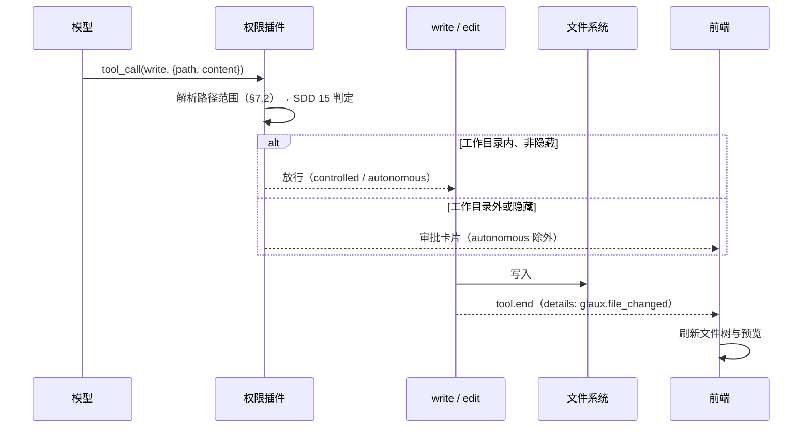
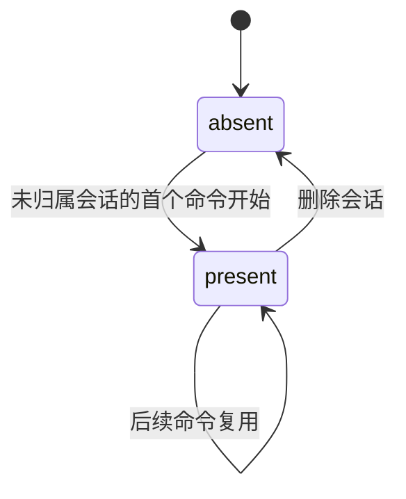

# 16 · 智能体基础工具与会话工作区

## 0. 文档状态

| 字段 | 内容 |
| --- | --- |
| 状态 | `implemented` |
| 当前阶段 | 已按 [实施计划](../../../plans/2026-10-02-agent-basic-tools-plan.md) 实现，自动化门禁与开发侧浏览器走查（假模型）通过，自查见 §15；真实模型走查与业务验收待补 |
| 来源 | [脑暴 20261001-01 智能体能力重构](../../../brainstorms/20261001-01-agent-capability-refactor.zh-CN.md) 的 P1 |
| 关联主 SDD | [Glaux SDD 索引](../../README.md) · [SDD 15 插件契约与权限引擎](../15-agent-plugins-permissions/README.md) · [SDD 13 项目文件夹与并行会话](../13-project-folder-sessions/README.md) · [SDD 14 项目文本文件预览与读取](../14-project-text-preview/README.md) |
| 负责人 | Glaux 项目维护者 |
| 最后更新 | 2026-10-02 |

> 状态合法值仅四个：`draft` → `ready` → `implemented` → `accepted`。

## 1. 本 SDD 负责什么

为参考智能体接入 pi-agent-core 内置的 `read`、`write`、`edit`、`bash` 四个工具，并放开文件写入。冻结五件事：

1. **执行环境**：每个命令的工作目录（`cwd`）。绑定项目的会话为项目目录，未归属会话为会话工作区。
2. **路径范围**：路径如何解析；何为工作目录之外、何为隐藏路径；它们怎样进入 SDD 15 的权限判定。
3. **四个工具**：在 pi 内置实现之外，Glaux 补充的约束（二进制拒绝、视觉降级、写入通知、`bash` 环境变量与超时）。
4. **`read` 取代 `read_file`**：SDD 14 的智能体读取工具退役，用户预览端点不变。
5. **会话工作区生命周期**：何时创建，何时删除。

## 2. 本 SDD 不负责什么

- `bash` 沙箱（容器、受限用户、seccomp）：本期只靠「仅 `autonomous` 挂载」、环境变量白名单与 deny 规则（SDD 15 §5 C5）。
- 非 UTF-8 文本的读写：`read` / `edit` 只按 UTF-8 处理（D-4）。
- 目录列举、文本搜索类工具（`ls`、`find`、`grep`）：项目会话用 `list_files`；`autonomous` 下可用 `bash`。
- Skills 目录的只读放行（脑暴 P2）。
- 写入文件的撤销与版本管理。

## 3. 当前阶段目标

- 绑定项目的会话中，智能体可以读取、创建、修改项目内文件，写入后文件树与正在预览的文档自动刷新。
- 未归属会话也有一个可读写的会话工作区。
- 读写工作目录之外或隐藏路径前先征得同意（`autonomous` 除外）。
- 最高权限下，智能体可以执行 shell 命令，命令拿不到 runtime 持有的任何凭据。

## 4. 输入来源

### 4.1 智能体输入

| 工具 | 参数（pi 内置） | Glaux 约束 |
| --- | --- | --- |
| `read` | `path`、`offset?`、`limit?` | §7.3 |
| `write` | `path`、`content` | §7.4 |
| `edit` | `path`、`edits[{oldText, newText}]` | §7.4 |
| `bash` | `command`、`timeout?`（秒） | §7.5 |

### 4.2 服务端输入

| 输入 | 来源 | 用途 |
| --- | --- | --- |
| 项目目录 | backend `GET /projects`（SDD 15 已用于定位项目级设置） | 绑定项目会话的 `cwd` |
| `GLAUX_HOME` | 环境变量，缺省 `~/.glaux` | 会话工作区根目录 |

## 5. 输出结果

### 5.1 用户可见输出

- `read` 读取项目内文件时，对话中出现文件卡片（沿用 SDD 14 的 `FileCard`，可「在舞台打开」）。
- `write` / `edit` 成功后，文件树刷新；若被改的文件正在预览，预览重新加载。
- 删除未归属会话时，确认文案注明会一并删除其工作区。

### 5.2 系统输出

- 文件系统上的文件变化（项目目录或会话工作区内；经审批时也可能在其外）。
- 工具结果 `details`：`glaux.file_read`（读取）、`glaux.file_changed`（写入）。

## 6. 核心流程

### 6.1 一次写入



## 7. 核心规则

### 7.1 执行环境

1. 命令开始时确定 `cwd`：
   - 会话绑定项目，且 backend 返回了该项目的目录：`cwd` 为项目目录；
   - 会话未归属：`cwd` 为 `<GLAUX_HOME>/workspaces/<session_id>/`，不存在时创建；
   - 会话绑定项目但取不到目录（backend 不可达、项目已移除）：本命令不挂载四个工具。
2. 四个工具共用一个 `NodeExecutionEnv`，`cwd` 如上；`shellEnv` 按 §7.5 规则 2 构造。
3. chat 发行版不挂载四个工具。

### 7.2 路径范围

1. 工具参数中的路径可以是相对路径或绝对路径，相对路径以 `cwd` 为基准解析。
2. **工作目录之外**：对解析后的路径取最深的已存在祖先目录做真实路径解析（跟随符号链接），结果不在 `cwd` 的真实路径之下。
3. **隐藏路径**：相对 `cwd` 的路径中任一段以 `.` 开头（如 `.git/config`、`.env`、`.glaux/settings.json`）。
4. 工作目录之外或隐藏的路径记为**敏感路径**；但 `read` 读取 Skills 根目录（[SDD 17](../17-agent-skills-prompts/README.md) §7.3）之下的文件不算敏感。SDD 15 的模式默认据此调整：

| effect | 模式 | 非敏感路径 | 敏感路径 |
| --- | --- | --- | --- |
| `read` | `observe` / `suggest` / `controlled` | 放行 | 审批 |
| `read` | `autonomous` | 放行 | 放行 |
| `write` | `suggest` | 审批 | 审批 |
| `write` | `controlled` | 放行 | 审批 |
| `write` | `autonomous` | 放行 | 放行 |

5. 规则匹配的 subject：工作目录内为相对 `cwd` 的路径（`/` 分隔），工作目录外为绝对路径；`pattern` 按 SDD 15 的 glob 匹配。deny 规则在任何模式下生效。
6. 敏感路径的审批卡片只提供「允许本次」（同 SDD 15 中 ask 规则的处理），避免一次授权放开整个工具的敏感读写。
7. 敏感路径不受会话授权与不带 `pattern` 的 allow 规则影响：这两者来自对非敏感调用的「本会话允许」「总是允许」，不能顺带放开敏感读写。带 `pattern` 且命中的 allow 规则照常放行。

### 7.3 `read`

1. 用 pi 内置实现读取，文本按 UTF-8 解码，行数与字节截断、`offset` 续读沿用内置行为。
2. 读取前检查文件前 8 KiB：含 NUL 字节且不是内置支持的图像格式时，返回工具错误「binary file」，不把二进制内容交给模型。
3. 图像文件：连接声明了视觉能力时返回图像块；未声明时返回文字说明「image omitted: the connection has no vision」，不交出图像块（SDD 03 D-21）。
4. 读取项目内文本文件成功时，结果 `details` 为 `glaux.file_read`（字段同 SDD 14 §9.2：`path` 相对项目根、`name`、`start_line`、`end_line`、`eof`、`total_lines`），前端渲染文件卡片。工作区与项目外的读取不带此 `details`。
5. `read_file` 工具与其插件条目删除；backend `GET /projects/{id}/text` 继续服务用户预览。

### 7.4 `write` 与 `edit`

1. 用 pi 内置实现。`write` 覆盖或新建文件并创建父目录；`edit` 做精确文本替换，同一文件的并发修改由 pi 的文件修改队列串行。
2. 成功后结果 `details` 为 `glaux.file_changed`：`{kind, op: "write" | "edit", path, project_id?}`。`path` 在工作目录内为相对路径，否则为绝对路径；`project_id` 仅在 `cwd` 为项目目录时给出。
3. 前端收到 `tool.end` 且 `details.kind` 为 `glaux.file_changed`、`project_id` 为当前会话项目时：刷新该项目的文件树；当前预览的文档路径等于 `path` 时重新加载预览。
4. 标注不经文件写入，仍由 `propose_annotation` 写建议态（SDD 15 §5 C3）。

### 7.5 `bash`

1. 只在 `autonomous` 下挂载（SDD 15 §7.4）。命令在 `cwd` 下以 runtime 进程的用户身份执行。
2. 环境变量白名单：只传递 `PATH`、`HOME`、`USER`、`LOGNAME`、`SHELL`、`LANG`、`LC_ALL`、`LC_CTYPE`、`TERM`、`TMPDIR`、`TZ`，外加 `GLAUX_CWD`（等于 `cwd`）。其他变量（含 `GLAUX_SEG_API_TOKEN`、模型凭据、`*_TOKEN`、`*_KEY`）一律不传。
3. 超时：参数缺省时取 120 秒；大于 600 秒时按 600 秒执行，并在结果首行注明已截到上限。超时、中止、非零退出码按 pi 内置行为以工具错误返回。
4. 输出截断沿用 pi 内置行为，完整输出写入临时文件，结果给出路径。
5. 规则匹配的 subject 为命令文本；`pattern` 对 `bash` 按前缀匹配（去掉首尾空白后比较）。
6. 提示词片段写明：`bash` 计算出的数值是非标定结果，报告时不得与 `run_task` 的标定测量混同（SDD 15 §5 C2）。

### 7.6 会话工作区生命周期

1. 工作区在未归属会话的首个命令开始时创建，路径 `<GLAUX_HOME>/workspaces/<session_id>/`。
2. 删除会话时，runtime 删除其工作区目录（存在时）；删除失败只记日志，不影响会话删除。
3. 归档会话不删除工作区。
4. 绑定项目的会话没有工作区；删除会话不动项目目录。

## 8. 涉及对象

### 8.1 agent-runtime

| 位置 | 变化 |
| --- | --- |
| `src/workspace/`（新） | `cwd` 确定、工作区创建与删除、路径范围判定、`bash` 环境变量白名单 |
| `src/plugins/files.ts`（新） | `files` 插件：`read`、`write`、`edit`、`bash` 四个工具的适配与约束 |
| `src/plugins/project.ts` | 删除 `read_file` 条目 |
| `src/pi/tools/read-file.ts` | 删除；`glaux.file_read` 的 `details` 构造移到 `read` 适配器 |
| `src/permission/` | 判定输入增加 `sensitivePath`；工具可声明 `pathScope` 与 `patternMatch` |
| `src/pi/harness-registry.ts` | 命令开始时确定 `cwd` 与执行环境，交给工具上下文与权限状态 |
| `src/pi/session-service.ts` | 删除会话时删除工作区 |

### 8.2 前端

| 位置 | 变化 |
| --- | --- |
| `store/agentSessions.ts` | `tool.end` 的 `glaux.file_changed` 触发文件树刷新与预览重载 |
| `store/projects.ts` | 按项目记录文件变化序号 |
| `components/ProjectTree.tsx` | 文件变化序号变化时重新加载 |
| `components/agent/SessionDrawer.tsx` | 未归属会话的删除确认文案 |

## 9. 数据或字段要求

### 9.1 插件工具扩展

```ts
interface PathScope {
  subject: string;     // 规则匹配用：工作目录内为相对路径，否则为绝对路径
  sensitive: boolean;  // 工作目录之外或隐藏
}

interface PluginTool {
  // SDD 15 已有字段之外：
  pathScope?(args: Record<string, unknown>, cwd: string): Promise<PathScope | undefined>;
  patternMatch?(pattern: string, subject: string): boolean;
}
```

- 有 `pathScope` 的工具，权限插件用其 `subject` 取代 `permissionSubject`，并把 `sensitive` 交给判定。
- 有 `patternMatch` 的工具，规则 `pattern` 用它匹配，取代 glob。

### 9.2 `glaux.file_changed`

| 字段 | 类型 | 说明 |
| --- | --- | --- |
| `kind` | `"glaux.file_changed"` | 固定值 |
| `op` | `"write"` / `"edit"` | 写入方式 |
| `path` | string | 工作目录内为相对路径（`/` 分隔），否则为绝对路径 |
| `project_id` | string? | `cwd` 为项目目录时给出 |

### 9.3 `glaux.file_read`

字段同 SDD 14 §9.2。`total_lines` 为文件总行数（按 `\n` 切分）。

## 10. 幂等规则

- `write` 以相同内容重复执行结果相同；`edit` 的 `oldText` 不再匹配时返回工具错误（pi 内置）。
- 工作区创建幂等（目录已存在时直接使用）；删除不存在的工作区视为成功。

## 11. 状态或生命周期规则



## 12. 审计或事件规则

- 四个工具的权限判定照 SDD 15 §12 记录；敏感路径审批的记录附 `sensitive: true` 与 `subject`。
- 不另设文件写入审计；写入结果在会话的工具结果里可查。

## 13. 异常和人工处理

| 情况 | 处理 |
| --- | --- |
| 绑定项目但取不到项目目录 | 本命令不挂载四个工具；其余工具照常 |
| 工作区无法创建（权限、磁盘） | 本命令不挂载四个工具；日志记录原因 |
| `read` 遇到二进制文件 | 工具错误「binary file」 |
| `read` 遇到图像且连接无视觉 | 返回文字说明，不交图像块 |
| `edit` 的 `oldText` 不匹配或匹配多处 | pi 内置工具错误，模型可先 `read` 再重试 |
| `bash` 超时、中止或非零退出 | 工具错误，含已截断的输出 |
| 删除会话时工作区删除失败 | 只记日志，会话照常删除 |

## 14. 与其他 SDD 的调用关系

| SDD | 关系 |
| --- | --- |
| [SDD 15](../15-agent-plugins-permissions/README.md) | 四个工具的 effect、模式与审批沿用 SDD 15；本 SDD 增加敏感路径与 `bash` 前缀匹配 |
| [SDD 14](../14-project-text-preview/README.md) | §7.4 `read_file` 由本 SDD 的 `read` 取代，实现时同步修订 SDD 14；用户预览端点与 `FileCard` 不变 |
| [SDD 13](../13-project-folder-sessions/README.md) | 项目目录来自 backend `GET /projects`；文件树刷新沿用其目录树组件 |
| [SDD 00](../00-reference-agent-conversations/README.md) | 删除会话时连带删除工作区 |

## 15. 验收标准

### 15.1 执行环境与路径

- [x] 绑定项目的会话 `cwd` 为项目目录，未归属会话为 `<GLAUX_HOME>/workspaces/<session_id>/`（集成测试）。——`workspace.test.ts`
- [x] 绑定项目但 backend 不可达时，四个工具不挂载（单元测试）。——`workspace.test.ts`（取不到项目目录时无 `cwd` 与执行环境，`files` 插件不参与）
- [x] 指向工作目录外的符号链接被判为工作目录外（单元测试）。——`path-scope.test.ts`
- [x] `controlled` 下读写 `.env`、`../x`、`/etc/hosts` 出现只含「允许本次」的审批卡片；`autonomous` 下不审批（集成测试）。——`files-tools.test.ts`（`.env` 写入、`../` 读取、`autonomous` 写 `.env`）；`/etc/hosts` 由 `path-scope` 单测覆盖
- [x] 已有不带 `pattern` 的 `write` allow 规则或会话授权时，写 `.env` 仍需审批（单元测试）。——`permission-decide.test.ts`

### 15.2 读取

- [x] 读取项目内文本文件，对话出现文件卡片，可在舞台打开。——`files-tools.test.ts`（卡片 `details` 进入快照）、`FileCard.test.tsx`；浏览器未走查
- [x] 读取二进制文件返回「binary file」错误（单元测试）。——`files-tools.test.ts`
- [x] 无视觉连接读取图像返回文字说明（单元测试）。——`files-tools.test.ts`
- [x] `read_file` 不再挂载；SDD 14 的用户预览不受影响。——`plugins-registry.test.ts`；backend 与 `DocumentView` 未改，`make test` 通过

### 15.3 写入

- [x] `controlled` 下 `write` 新建项目内文件不审批，文件树出现该文件。——`files-tools.test.ts`、`agentSessions.test.ts`（文件变化序号递增）；浏览器未走查
- [x] `edit` 修改正在预览的文件后，预览自动刷新。——`agentSessions.test.ts`（换新的 `DocumentRef` 对象）；浏览器未走查
- [x] `suggest` 下 `write` 需审批。——`files-tools.test.ts`

### 15.4 `bash`

- [x] 只在 `autonomous` 下挂载（单元测试）。——`bash-tool.test.ts`
- [x] 命令中 `env` 输出不含白名单外的变量，`GLAUX_CWD` 等于 `cwd`（集成测试）。——`bash-tool.test.ts`；去掉 `inheritEnv = false` 时该用例失败（已验证）
- [x] 缺省超时 120 秒、上限 600 秒（单元测试）。——`bash-tool.test.ts`
- [x] 规则 `{tool: "bash", pattern: "git status", decision: "allow"}` 匹配 `git status -s`，不匹配 `git push`（单元测试）。——`bash-tool.test.ts`、`permission-decide.test.ts`

### 15.5 工作区

- [x] 删除未归属会话后其工作区目录不存在；归档不删除（集成测试）。——`workspace.test.ts`
- [x] 未归属会话的删除确认文案注明会删除工作区。——`SessionDrawer.test.tsx`

### 15.6 工程

- [x] `make test`、`make lint` 通过。——agent-runtime 362、前端 378、backend 505、science-core 213
- [x] 仓库骨架总览（含 `REGISTRY` 不变量的新表述）、SDD 14 §7.4、操作手册、CHANGELOG 同步更新。——另含 SDD 13、SDD 15 的工具归属

## 16. 决策记录

| 编号 | 决策 | 理由 |
| --- | --- | --- |
| D-1 | 未归属会话的工作区放在 `<GLAUX_HOME>/workspaces/<session_id>/` | 与用户级设置同根，不污染仓库目录；按会话隔离 |
| D-2 | 删除会话时连同工作区删除，归档不删 | 工作区只属于该会话；删除是用户显式动作，确认文案已提示 |
| D-3 | 敏感路径（工作目录外或隐藏）读写都要审批，且只给「允许本次」；会话授权与不带 `pattern` 的 allow 规则不覆盖敏感路径 | 隐藏路径常含凭据（`.env`、`.git/config`）；对非敏感调用的授权不应顺带放开敏感读写 |
| D-4 | `read` / `edit` 只按 UTF-8 处理，放弃 SDD 14 的编码识别 | `edit` 按原文精确替换，读写须同一编码；非 UTF-8 文件可在 `autonomous` 下用 `bash` 转码 |
| D-5 | `read` 取代 `read_file`，保留 `glaux.file_read` 卡片 | 原生 `read` 支持图像、输出不带行号前缀，便于随后 `edit`；卡片交互不变 |
| D-6 | `bash` 环境变量用白名单而非黑名单 | 新增凭据变量时默认不泄露 |
| D-7 | `bash` 缺省超时 120 秒、上限 600 秒 | pi 内置无缺省超时；总时长另受 SDD 15 预算约束 |
| D-8 | `bash` 规则按前缀匹配 | 命令以子命令开头（`git status`、`python -m`），前缀比 glob 直观 |
| D-9 | `REGISTRY` 的不变量改为「标定能力的唯一来源」 | 已拍板（脑暴 §5 C2）；`bash` 结果为非标定结果 |
| D-10 | 写入通知走 `tool.end` 的 `details`，不新增 SSE 事件 | 结果与通知同源，前端已有 `tool.end` 处理路径 |

## 17. 待确认问题

无。
