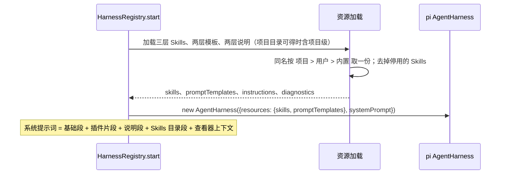
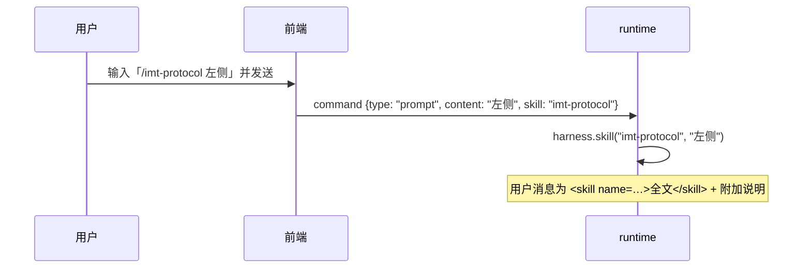

# 17 · 智能体 Skills 与提示词管理

## 0. 文档状态

| 字段 | 内容 |
| --- | --- |
| 状态 | `implemented` |
| 当前阶段 | 已按 [实施计划](../../../plans/2026-10-02-agent-skills-prompts-plan.md) 实现，自动化门禁与开发侧浏览器走查（假模型）通过，自查见 §15；真实模型走查与业务验收待补 |
| 来源 | [脑暴 20261001-01 智能体能力重构](../../../brainstorms/20261001-01-agent-capability-refactor.zh-CN.md) 的 P2 |
| 关联主 SDD | [Glaux SDD 索引](../../README.md) · [SDD 15 插件契约与权限引擎](../15-agent-plugins-permissions/README.md) · [SDD 16 基础工具与会话工作区](../16-agent-basic-tools/README.md) · [SDD 01 双模式外壳](../01-dual-mode-shell/README.md) |
| 负责人 | Glaux 项目维护者 |
| 最后更新 | 2026-10-02 |

> 状态合法值仅四个：`draft` → `ready` → `implemented` → `accepted`。

## 1. 本 SDD 负责什么

让智能体按需加载领域知识，并让用户管理这些知识与提示词。冻结六件事：

1. **Skills 加载**：内置、用户级、项目级三层 `SKILL.md`，同名覆盖，系统提示词只放目录，正文由模型按需读取。
2. **提示词模板**：用户级、项目级两层，用户在输入框以 `/名称 参数` 调用。
3. **自定义说明**：用户级与项目级各一份 `GLAUX.md`，追加进系统提示词。
4. **管理接口**：runtime 提供 Skills、模板、说明的读写与 Skills 启停，以及「当前会话实际系统提示词」预览。
5. **管理页面**：侧边栏新增「技能」与「提示词」两个页面（Focus 左侧竖条与 Workbench 活动栏都有入口）。
6. **显式调用**：输入框 `/` 菜单列出可调用的 Skills 与模板；调用 Skill 的消息在对话中以紧凑形式显示。

## 2. 本 SDD 不负责什么

- 内置领域 Skill 的内容：内置层只发布通用的 `skill-creator`（D-6），领域 Skill 需专业校对后单独加入。
- Skill 的 zip 或目录导入、在线市场、版本管理。
- 由模型调用提示词模板：模板只供用户显式调用。
- 子智能体定义（脑暴 P3）。
- 编辑系统提示词的基础身份段与插件片段：只读展示。

## 3. 当前阶段目标

- 用户在「技能」页新建一个用户级 Skill 后，新会话的系统提示词出现该 Skill 的目录条目；模型可用 `read` 读取全文，不触发审批。
- 用户在输入框输入 `/` 能看到并调用 Skill 与模板。
- 用户在「提示词」页编辑 `GLAUX.md`，下一个命令即生效，并能预览当前会话实际收到的系统提示词。

## 4. 输入来源

### 4.1 文件

| 资源 | 内置 | 用户级 | 项目级 |
| --- | --- | --- | --- |
| Skills | `agent-runtime/skills/` | `<GLAUX_HOME>/skills/` | `<项目目录>/.glaux/skills/` |
| 提示词模板 | — | `<GLAUX_HOME>/prompts/*.md` | `<项目目录>/.glaux/prompts/*.md` |
| 自定义说明 | — | `<GLAUX_HOME>/GLAUX.md` | `<项目目录>/GLAUX.md` |
| Skills 停用列表 | — | `<GLAUX_HOME>/settings.json` 的 `skills.disabled` | — |

- `GLAUX_HOME` 缺省 `~/.glaux`（SDD 15）。项目目录经 backend `GET /projects` 取得（SDD 16）。
- Skill 文件格式遵循 agentskills.io：`SKILL.md` 带 YAML frontmatter，`name`、`description` 必填，可选 `disable-model-invocation: true`。加载与校验沿用 pi-agent-core 的 `loadSkills`。
- 模板为 Markdown，frontmatter 可选 `description`；正文支持 `$1`、`$@`、`$ARGUMENTS` 等占位符（pi `substituteArgs`）。

### 4.2 用户输入

| 输入 | 位置 | 说明 |
| --- | --- | --- |
| 新建、编辑、删除 Skill | 「技能」页 | 只能操作用户级与项目级；内置只读 |
| 启用 / 停用 Skill | 「技能」页 | 写用户级停用列表 |
| 编辑自定义说明 | 「提示词」页 | 用户级；会话绑定项目时另有项目级 |
| 新建、编辑、删除模板 | 「提示词」页 | 用户级；会话绑定项目时另有项目级 |
| 预览系统提示词 | 「提示词」页 | 针对当前会话与当前连接、焦点 |
| `/名称 参数` | 输入框 | 调用 Skill 或模板 |

## 5. 输出结果

### 5.1 用户可见输出

- 「技能」页：按来源分组的列表（名称、描述、来源、启停开关、加载告警）；详情为 `SKILL.md` 源文本编辑区；被同名覆盖的 Skill 标注「已被覆盖」。
- 「提示词」页：自定义说明编辑区、模板列表与编辑区、系统提示词预览（文本与已挂载工具清单）。
- 输入框 `/` 菜单：Skills 与模板，按名称前缀过滤。
- 对话中调用 Skill 的用户消息显示为「技能：名称」加附加说明，不展开 Skill 全文。

### 5.2 系统输出

- 文件系统上的 Skill、模板、说明文件与设置文件。
- 系统提示词的说明段与 Skills 目录段。

## 6. 核心流程

### 6.1 命令开始时的资源装配



### 6.2 显式调用



## 7. 核心规则

### 7.1 Skills 加载

1. 每个命令开始时按「内置 → 用户级 → 项目级」加载；项目级只在会话绑定项目且取得项目目录时加载。
2. 同名 Skill 只保留优先级最高的一份（项目级 > 用户级 > 内置），其余标记「已被覆盖」。
3. 名称在停用列表中的 Skill 不进入 harness 资源。
4. `disable-model-invocation: true` 的 Skill 进入 harness 资源（可被用户显式调用），但不进系统提示词目录。
5. 加载告警（缺字段、解析失败）不阻断命令，在「技能」页显示。

### 7.2 系统提示词

1. 组成顺序：基础段 → 插件提示词片段 → 自定义说明段 → Skills 目录段 → 查看器上下文。
2. 自定义说明段：用户级在前、项目级在后，各包在 `<instructions scope="user">…</instructions>` / `<instructions scope="project">…</instructions>` 中；单份超过 32 KiB 时截断并注明。文件不存在或为空时省略该段。
3. Skills 目录段用 pi `formatSkillsForSystemPrompt` 生成，末尾附一行各层 Skills 目录（按优先级从高到低：项目、个人、内置（只读）；未绑定项目时没有项目层），供模型新建或覆盖 Skill 时选位置；没有可见 Skill 时整段省略。
4. chat 发行版不加说明段与目录段。

### 7.3 按需读取

1. Skills 的三个根目录对 `read` 只读放行：路径在这些目录之下时不算敏感路径（SDD 16 §7.2），不审批。
2. 只放行读；对这些目录的 `write` / `edit` 仍按敏感路径处理。
3. 没有工作目录（`read` 未挂载）时，模型只能看到目录，用户仍可显式调用。

### 7.4 显式调用

1. `prompt` 命令增加互斥的可选字段 `skill`（名称）与 `template`（`{name, args: string}`）。
2. 带 `skill` 时 runtime 调用 `harness.skill(name, content || undefined)`；带 `template` 时以 pi `parseCommandArgs` 解析 `args` 后调用 `harness.promptFromTemplate(name, args)`。
3. 名称不存在或 Skill 已停用时返回 `422 unknown_resource`。
4. 带 `skill` 或 `template` 的命令不接受图像附件，否则 `422 invalid_request`。
5. 会话标题取 `/名称 附加内容`。

### 7.5 管理接口

1. 所有接口只在 runtime 上（回环地址），不经 backend；项目级接口按 `project_id` 经 backend 取项目目录，取不到返回 `404 project_not_found`。
2. 名称规则：Skill 与模板名称为小写字母、数字、连字符，1～64 字符；不合规返回 `422 invalid_name`。路径只由来源与名称拼出，不接受外部路径。
3. 写 Skill：写 `<根>/<name>/SKILL.md`，写入后用 pi 加载器校验，返回告警；内容为空或 frontmatter 不可解析时拒绝写入（`422 invalid_skill`）。
4. 删除 Skill：删除 `<根>/<name>/` 整个目录。
5. 写入均先写临时文件再 rename。
6. 启停：修改用户级 `settings.json` 的 `skills.disabled`，保留其他字段（同 SDD 15 §9.2）。
7. 预览：按给定的连接与查看器上下文、会话的项目与权限模式，组装与真实命令相同的系统提示词与工具清单，不启动命令、不调用模型。

### 7.6 管理页面

1. Focus 左侧竖条在「图谱」之后新增「技能」「提示词」两个入口，打开右侧栏对应页面；Workbench 活动栏新增同名两个视图。
2. 「技能」「提示词」页的项目级内容跟随当前会话的项目；当前会话未归属时不显示项目级。
3. 编辑区为等宽文本框，「保存」后提示「下一个命令生效」；未保存离开时提示。
4. 内置 Skill 只读，提供「复制为用户级」。
5. chat 发行版不显示这两个入口。

### 7.7 输入框 `/` 菜单

1. 输入框内容以 `/` 开头且光标在第一个空白之前时，弹出菜单，列出启用的 Skills 与模板，按名称前缀过滤；方向键选择、回车或 Tab 补全。
2. 发送时，内容形如 `/名称 其余` 且名称命中 Skill 或模板，即按 §7.4 发送；未命中时作为普通文本发送。
3. 菜单数据取自 `GET /resources`，打开菜单时刷新。

## 8. 涉及对象

### 8.1 agent-runtime

| 位置 | 变化 |
| --- | --- |
| `src/resources/`（新） | 三类资源的路径、加载、合并、读写、校验；系统提示词说明段 |
| `src/transport/resource-routes.ts`（新） | §9.2 的接口 |
| `src/pi/harness-registry.ts` | 命令开始时装配资源；系统提示词加说明段与目录段；预览函数 |
| `src/pi/command-service.ts` | `skill` / `template` 命令 |
| `src/permission/`、`src/plugins/files.ts` | Skills 根目录对 `read` 只读放行 |

### 8.2 前端

| 位置 | 变化 |
| --- | --- |
| `agent/runtime/client.ts`、`types.ts` | 资源接口与命令字段 |
| `components/resources/`（新） | `SkillsView`、`PromptsView` |
| `components/focus/SessionRail.tsx`、`FocusSidePanel.tsx`、`store/session.ts` | `sideView` 增加 `skills`、`prompts` |
| `components/ActivityBar.tsx`、`SideBar.tsx` | Workbench 视图 |
| `components/agent/ConversationComposer.tsx` | `/` 菜单与发送 |
| `components/agent/AgentConversation.tsx` | Skill 调用消息的紧凑显示 |

## 9. 数据或字段要求

### 9.1 资源清单

```ts
type ResourceSource = "builtin" | "user" | "project";

interface SkillItem {
  name: string;
  description: string;
  source: ResourceSource;
  path: string;                     // SKILL.md 绝对路径
  enabled: boolean;
  model_invocable: boolean;          // false = disable-model-invocation
  overridden_by?: ResourceSource;   // 被更高优先级同名 Skill 覆盖
}

interface TemplateItem {
  name: string;
  description?: string;
  source: "user" | "project";
  path: string;
  overridden_by?: "project";
}

interface InstructionsItem {
  scope: "user" | "project";
  path: string;
  exists: boolean;
  bytes: number;
}

interface ResourceDiagnostic { source: ResourceSource; code: string; message: string; path: string }

interface ResourceList {
  skills: SkillItem[];
  templates: TemplateItem[];
  instructions: InstructionsItem[];
  agents: AgentItem[];            // 子智能体定义（SDD 18 §9.1）
  diagnostics: ResourceDiagnostic[];
}
```

### 9.2 接口

| 方法与路径 | 请求 | 响应 |
| --- | --- | --- |
| `GET /agent-api/v1/resources?project_id=` | — | `ResourceList` |
| `GET /agent-api/v1/skills/{source}/{name}?project_id=` | — | `{name, source, path, content, editable}` |
| `PUT /agent-api/v1/skills/{source}/{name}?project_id=` | `{content}` | `{item: SkillItem, diagnostics}`；`source` 只能为 `user` / `project` |
| `DELETE /agent-api/v1/skills/{source}/{name}?project_id=` | — | `204` |
| `PUT /agent-api/v1/skills-enabled/{name}` | `{enabled: boolean}` | `{name, enabled}` |
| `GET /agent-api/v1/prompts/{source}/{name}?project_id=` | — | `{name, source, path, content}` |
| `PUT /agent-api/v1/prompts/{source}/{name}?project_id=` | `{content}` | `TemplateItem` |
| `DELETE /agent-api/v1/prompts/{source}/{name}?project_id=` | — | `204` |
| `GET /agent-api/v1/instructions/{scope}?project_id=` | — | `{scope, path, content}`（不存在时 `content` 为空串） |
| `PUT /agent-api/v1/instructions/{scope}?project_id=` | `{content}` | `InstructionsItem` |
| `POST /agent-api/v1/sessions/{id}/system-prompt` | `{connection, viewer?}` | `{prompt, tools: string[]}` |

错误码：`invalid_name`、`invalid_skill`、`not_found`、`project_not_found`、`read_only`（写内置）、`unknown_resource`。

### 9.3 命令字段

```ts
type PromptCommand = {
  command_id: string;
  type: "prompt";
  content: string;
  images?: PromptImage[];
  connection: ConnectionInput;
  viewer?: ViewerContext;
  skill?: string;                          // 与 template 互斥
  template?: { name: string; args: string };
};
```

## 10. 幂等规则

- `PUT` 写入同一内容结果相同；`DELETE` 不存在的资源返回 `404 not_found`。
- 启停对同一状态重复设置结果相同。
- `skill` / `template` 命令的幂等沿用 SDD 00 的 `command_id` 规则，摘要包含这两个字段。

## 11. 状态或生命周期规则

- 资源在每个命令开始时重新加载，管理页的修改在下一个命令生效；进行中的命令不受影响。

## 12. 审计或事件规则

- 不新增 SSE 事件。显式调用的 Skill 全文作为用户消息进入会话记录（pi 行为）。

## 13. 异常和人工处理

| 情况 | 处理 |
| --- | --- |
| Skill 文件解析失败 | 跳过该 Skill，告警显示在「技能」页 |
| 项目目录取不到 | 不加载项目级资源；管理接口的项目级请求返回 `404 project_not_found` |
| 说明文件超过 32 KiB | 截断并在系统提示词中注明 |
| 调用已停用或不存在的 Skill | `422 unknown_resource`，前端提示 |
| 写入失败（权限、磁盘） | `500` 安全错误体，前端提示，文件不变 |

## 14. 与其他 SDD 的调用关系

| SDD | 关系 |
| --- | --- |
| [SDD 15](../15-agent-plugins-permissions/README.md) | 设置文件增加 `skills.disabled`；系统提示词组成增加两段 |
| [SDD 16](../16-agent-basic-tools/README.md) | `read` 对 Skills 根目录只读放行 |
| [SDD 00](../00-reference-agent-conversations/README.md) | `prompt` 命令增加 `skill`、`template` 字段 |
| [SDD 01](../01-dual-mode-shell/README.md) | 左侧竖条与活动栏各增加两个入口 |

## 15. 验收标准

### 15.1 加载与系统提示词

- [x] 三层同名 Skill 只保留项目级，其余标「已被覆盖」（单元测试）。——`resources-load.test.ts`
- [x] 停用的 Skill 不进入 harness 资源；`disable-model-invocation` 的 Skill 不进目录但可显式调用（集成测试）。——`resources-load.test.ts`（资源与目录）；显式调用路径见 `skills-flow.test.ts`
- [x] 系统提示词含两份说明段与 Skills 目录段，顺序符合 §7.2；没有资源时与本 SDD 实施前逐字一致（快照测试）。——`skills-flow.test.ts`、`resources-load.test.ts`；`system-prompt.test.ts` 快照未变
- [x] 模型 `read` Skill 文件不审批；`write` 同一路径需审批（集成测试）。——`skills-flow.test.ts`

### 15.2 显式调用

- [x] `skill` 命令发出的用户消息以 `<skill name="…">` 开头并带附加说明；`template` 命令按参数展开（集成测试）。——`skills-flow.test.ts`
- [x] 不存在或已停用的名称返回 `422 unknown_resource`；带图像返回 `422`（契约测试）。——`skills-flow.test.ts`（HTTP 层）
- [x] 输入框输入 `/` 出现菜单，过滤、补全、发送正确（组件测试）。——`slashCommands.test.tsx`
- [x] 对话中 Skill 调用消息显示为「技能：名称」（组件测试）。——`slashCommands.test.tsx`

### 15.3 管理接口与页面

- [x] Skills、模板、说明的读写删与启停符合 §7.5，非法名称、写内置、项目不存在返回对应错误（契约测试）。——`resources-api.test.ts`
- [x] 预览返回的系统提示词与同条件下真实命令的系统提示词一致（集成测试）。——`resources-api.test.ts`（逐字相等）
- [x] 「技能」「提示词」页能新建、编辑、删除、启停，项目级随当前会话变化（组件测试）。——`ResourcesViews.test.tsx`
- [x] Focus 竖条与 Workbench 活动栏出现两个入口；chat 发行版不出现（组件测试）。——`SessionRail.test.tsx`；chat 发行版沿用竖条已有的 `CHAT_EDITION` 判断，未另写用例

### 15.4 工程

- [x] `make test`、`make lint` 通过。——agent-runtime 377、前端 392、backend 505、science-core 213
- [x] 仓库骨架总览、操作手册、SDD 00、SDD 15、SDD 16、两份 CHANGELOG 同步更新。——另含 SDD 01 竖条入口

## 16. 决策记录

| 编号 | 决策 | 理由 |
| --- | --- | --- |
| D-1 | Skills 三层、模板与说明两层，放在 `GLAUX_HOME` 与项目目录 | 与设置文件同根；项目级随项目走 |
| D-2 | 自定义说明文件名 `GLAUX.md`，项目级放项目根目录 | 与 `CLAUDE.md`、`AGENTS.md` 习惯一致，用户在文件树里可见 |
| D-3 | 停用列表只在用户级设置 | 启停是个人偏好；项目级 Skill 不想用可直接删除或在项目里改名 |
| D-4 | 模型经 `read` 按需读取 Skill，不另设工具 | 沿用 pi 与 agentskills.io 约定；Skill 内引用的相对文件也能读 |
| D-5 | Skills 根目录只对读放行 | 读不改状态；写入 Skill 文件应经管理页或审批 |
| D-6 | 内置层只发布通用的 `skill-creator`（Glaux 原生编写，不引入 Claude Code 官方包） | 创建 Skill 不涉及领域判断；官方包的评测与打包脚本依赖 claude CLI 与 Python，在 Glaux 中不可用；领域 Skill 需要专业校对后单独加入 |
| D-7 | 显式调用用命令字段，不在服务端解析 `/` 文本 | 普通消息以 `/` 开头时不被误判；前端已知资源清单 |
| D-8 | 资源每个命令重新加载，不做文件监听 | 简单；与设置文件的加载时机一致 |

## 17. 待确认问题

无。
