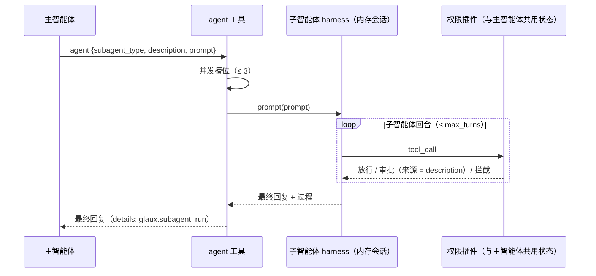
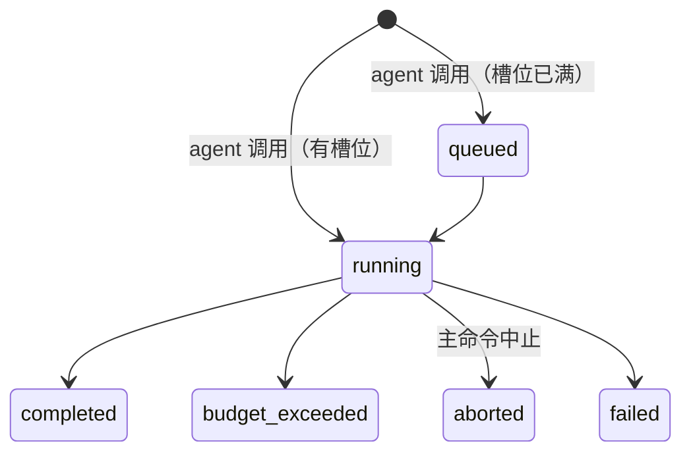

# 18 · 子智能体

## 0. 文档状态

| 字段 | 内容 |
| --- | --- |
| 状态 | `implemented` |
| 当前阶段 | 已按 [实施计划](../../../plans/2026-10-02-agent-subagents-plan.md) 实现，自动化门禁通过，自查见 §15；浏览器走查、真实模型走查与业务验收待补 |
| 来源 | [脑暴 20261001-01 智能体能力重构](../../../brainstorms/20261001-01-agent-capability-refactor.zh-CN.md) 的 P3 |
| 关联主 SDD | [Glaux SDD 索引](../../README.md) · [SDD 15 插件契约与权限引擎](../15-agent-plugins-permissions/README.md) · [SDD 16 基础工具](../16-agent-basic-tools/README.md) · [SDD 17 Skills 与提示词](../17-agent-skills-prompts/README.md) |
| 负责人 | Glaux 项目维护者 |
| 最后更新 | 2026-10-02 |

> 状态合法值仅四个：`draft` → `ready` → `implemented` → `accepted`。

## 1. 本 SDD 负责什么

主智能体通过 `agent` 工具把子任务交给子智能体：子智能体在独立上下文中运行，只把最终回复交回。冻结五件事：

1. **定义**：子智能体定义文件的位置、格式与同名覆盖。
2. **`agent` 工具**：参数、挂载条件、提示词片段。
3. **子智能体运行**：会话、模型、工具子集、系统提示词、权限与预算、中止与并发。
4. **结果**：交回主智能体的内容与保存在会话里的过程记录。
5. **展示**：对话中的子智能体卡片、审批卡片标明来源、「技能」页列出定义。

## 2. 本 SDD 不负责什么

- 子智能体过程的实时推送：本期只在完成后展示过程（D-5）。
- 子智能体再派发子智能体（嵌套深度固定为 1）、子智能体之间通信、后台常驻子智能体。
- 子智能体使用与主智能体不同的模型连接（脑暴 Q7）。
- 在页面上新建或编辑定义：本期只读列出，修改直接编辑文件。
- 定义里的 `model` 字段：忽略。

## 3. 当前阶段目标

- 主智能体可以把「读完这个项目的说明并总结」之类的子任务交给子智能体，自己的上下文只增加一条最终回复。
- 子智能体的工具调用照常受权限约束，需要审批时用户在同一对话里看到并知道来源。
- 用户中止命令时，所有子智能体一并停止。

## 4. 输入来源

### 4.1 定义文件

| 层级 | 位置 |
| --- | --- |
| 内置 | `agent-runtime/agents/<name>.md` |
| 用户级 | `<GLAUX_HOME>/agents/<name>.md` |
| 项目级 | `<项目目录>/.glaux/agents/<name>.md` |

```markdown
---
name: general
description: General-purpose helper for multi-step research and file tasks.
tools: [read, list_files, open_file]   # 可选；缺省为父会话可用的全部工具
max_turns: 20                           # 可选；1～50，缺省 20
---

（子智能体的工作说明）
```

- `name` 与文件名一致，规则同 SDD 17 §7.5 规则 2；`description` 必填，≤ 1024 字符。
- frontmatter 只识别 `name`、`description`、`tools`、`max_turns`；`tools` 可写成 `[a, b]` 或 YAML 列表。
- 同名按 项目级 > 用户级 > 内置 取一份（同 SDD 17）。不合法的定义跳过并给出告警。
- 内置只发布 `general` 一个通用定义。

### 4.2 智能体输入

| 参数 | 规则 |
| --- | --- |
| `subagent_type` | 可用定义的名称之一 |
| `description` | 3～80 字符，概括子任务，用于卡片标题与审批来源 |
| `prompt` | 交给子智能体的完整任务说明，非空 |

## 5. 输出结果

### 5.1 用户可见输出

- 子智能体运行期间，对话中显示「调用 agent」工具行，行内实时显示子智能体的回合数与正在调用的工具（§7.5）。
- 完成后显示子智能体卡片：定义名、`description`、结局（完成 / 预算用尽 / 已中止 / 失败）、回合数、最终回复；可展开查看过程（消息与工具调用）。
- 子智能体触发的审批卡片显示「来自子智能体：description」。
- 「技能」页新增「子智能体」分组，只读列出定义（名称、描述、来源、工具）。

### 5.2 系统输出

- `agent` 工具结果：文本为子智能体最终回复；`details` 为 `glaux.subagent_run`（§9.2），进入会话快照。

## 6. 核心流程



## 7. 核心规则

### 7.1 `agent` 工具

1. effect 为 `delegate`（SDD 15 §7.3）：`observe` 不挂载，`suggest` 需审批，`controlled` 与 `autonomous` 放行。
2. 有至少一个可用定义时挂载；子智能体内不挂载（嵌套深度 1）。
3. 提示词片段列出可用定义的名称与描述，并说明：子智能体看不到当前对话，`prompt` 需写全任务；只会交回最终回复。

### 7.2 子智能体运行

1. **会话**：pi `InMemorySessionRepo` 新建内存会话，不出现在会话列表，不写数据库。
2. **模型**：沿用主智能体本次命令的模型运行时与连接。
3. **工具**：主智能体本次命令可挂载的工具中，名称在定义 `tools` 之内的部分（缺省为全部），再去掉 `agent`。
4. **系统提示词**：与主智能体相同的组装方式（基础段、所挂工具的片段、说明段与 Skills 目录段、查看器上下文），并在 Skills 目录段之后加 `<subagent name="…">定义正文</subagent>` 与一句「只有最后一条回复会交给主智能体」。
5. **钩子**：安装与主智能体相同的插件钩子；权限状态（模式、规则、会话授权、工作目录、交互请求表）与主智能体共用；审计写入主会话。
6. **预算**：每个子智能体独立计回合，上限取定义的 `max_turns`；时长上限沿用主智能体的设置值。用尽后的收尾与宽限规则同 SDD 15 §7.8。
7. **并发**：同一主命令内同时运行的子智能体不超过 3 个，多出的调用排队。
8. **中止**：主命令中止时，`agent` 工具收到中止信号，中止其子智能体；子智能体的待决交互请求随主命令一起取消。

### 7.3 结果

1. 工具结果文本为子智能体最后一条助手消息的文本；为空时写「子智能体未给出回复」。
2. 结局为预算用尽或中止时，在文本开头注明。
3. `details` 记录过程：消息按 SDD 15 §9.6 的 `TranscriptMessage` 转换，图像块替换为占位文字，单个文本块超过 4000 字符截断，最多保留最后 200 条消息。
4. 子智能体失败（模型错误等）时工具结果为错误，`details` 照样记录已有过程。

### 7.4 审批来源

交互请求增加可选字段 `origin`（`{subagent: description}`）；子智能体内触发的审批与 `ask_user` 都带上它，前端卡片显示来源。

### 7.5 进度推送

1. 子智能体每回合开始、每次工具调用开始时，SSE 推送 `subagent.progress`（§9.4），`tool_call_id` 为主智能体 `agent` 调用的标识。
2. 前端按 `tool_call_id` 在对应的工具行显示「第 N 回合 · 调用 工具名」；该调用的 `tool.end` 或命令的 `run.settled` 到达后清除。
3. 进度只存前端内存，不进快照；完成后的过程以 §7.3 的 `details` 为准。

## 8. 涉及对象

### 8.1 agent-runtime

| 位置 | 变化 |
| --- | --- |
| `agents/general.md`（新） | 内置通用定义 |
| `src/resources/agents.ts`（新） | 定义文件的加载、解析与覆盖 |
| `src/resources/load.ts` | 资源清单增加 `agents` |
| `src/subagents/`（新） | 子智能体运行、并发槽位、过程记录 |
| `src/plugins/subagents.ts`（新） | `agent` 工具与提示词片段 |
| `src/pi/harness-registry.ts` | 工具上下文提供派发函数；子智能体内不挂 `agent` |
| `src/interaction/table.ts`、`contracts.ts` | 交互请求 `origin` |
| `src/pi/session-service.ts` | `glaux.subagent_run` 进入快照 |

### 8.2 前端

| 位置 | 变化 |
| --- | --- |
| `components/agent/SubagentCard.tsx`（新） | 子智能体卡片 |
| `components/agent/AgentConversation.tsx` | 渲染卡片 |
| `components/agent/InteractionCard.tsx` | 显示来源 |
| `components/resources/SkillsView.tsx` | 「子智能体」分组 |

## 9. 数据或字段要求

### 9.1 资源清单增量

```ts
interface AgentItem {
  name: string;
  description: string;
  source: "builtin" | "user" | "project";
  path: string;
  tools?: string[];
  max_turns: number;
  overridden_by?: "user" | "project";
}
// ResourceList 增加 agents: AgentItem[]
```

### 9.2 `glaux.subagent_run`

| 字段 | 类型 | 说明 |
| --- | --- | --- |
| `kind` | `"glaux.subagent_run"` | 固定值 |
| `subagent_type` | string | 定义名 |
| `description` | string | 子任务概括 |
| `outcome` | `"completed"` / `"budget_exceeded"` / `"aborted"` / `"failed"` | 结局 |
| `turns` | integer | 回合数 |
| `final` | string | 最终回复文本 |
| `transcript` | `TranscriptMessage[]` | 过程（§7.3 规则 3） |

### 9.3 交互请求增量

| 字段 | 类型 | 说明 |
| --- | --- | --- |
| `origin` | `{subagent: string}` 可选 | 来自子智能体时为其 `description` |

### 9.4 SSE 事件 `subagent.progress`

| 字段 | 类型 | 说明 |
| --- | --- | --- |
| `session_id` | string | 主会话 |
| `command_id` | string | 主命令 |
| `tool_call_id` | string | 主智能体 `agent` 调用的标识 |
| `turns` | integer | 子智能体当前回合数 |
| `tool_name` | string 可选 | 正在调用的工具；回合开始时缺省 |

## 10. 幂等规则

- 子智能体没有独立的命令幂等；随主命令一次执行。重新生成主命令会重新运行子智能体。

## 11. 状态或生命周期规则



## 12. 审计或事件规则

- 子智能体内的权限判定与交互请求审计写入主会话（SDD 15 §12），记录附 `origin`。
- 不新增 SSE 事件；子智能体过程只随 `agent` 的 `tool.end` 与快照下发。

## 13. 异常和人工处理

| 情况 | 处理 |
| --- | --- |
| `subagent_type` 不存在 | 工具错误，列出可用名称 |
| 定义文件不合法 | 跳过，告警显示在「技能」页 |
| 子智能体模型请求失败 | 工具错误，`details` 记录已有过程 |
| 主命令中止 | 子智能体中止，结局 `aborted` |

## 14. 与其他 SDD 的调用关系

| SDD | 关系 |
| --- | --- |
| [SDD 15](../15-agent-plugins-permissions/README.md) | `delegate` effect；权限、预算、交互请求机制复用；交互请求增加 `origin` |
| [SDD 16](../16-agent-basic-tools/README.md) | 子智能体共用工作目录与执行环境 |
| [SDD 17](../17-agent-skills-prompts/README.md) | 资源清单增加 `agents`；子智能体系统提示词含说明段与 Skills 目录 |

## 15. 验收标准

### 15.1 定义与挂载

- [x] 三层同名定义按优先级取一份；不合法定义告警（单元测试）。——`subagents.test.ts`
- [x] `agent` 只在有定义且模式允许时挂载；子智能体内不挂载（单元测试）。——`subagents.test.ts`（挂载条件）；按模式挂载沿用 SDD 15 的 `mountable`，`plugins-registry.test.ts` 校验 effect 为 `delegate`

### 15.2 运行

- [x] 子智能体只收到 `prompt`，看不到主对话；工具为定义 `tools` 与父工具的交集（集成测试）。——`subagents-flow.test.ts`
- [x] 主智能体收到子智能体最终回复，`details` 含过程，快照保留（集成测试）。——`subagents-flow.test.ts`
- [x] 子智能体的工具调用经权限判定，审批请求带 `origin`（集成测试）。——`subagents-flow.test.ts`（`suggest` 模式：先审批 `agent`，再审批子智能体内的 `run_task`，审计写入主会话）
- [x] 回合超过 `max_turns` 时收尾或中止，结局如实记录（集成测试）。——`subagents-flow.test.ts`（`max_turns: 1` 时第二次工具调用被拦截，模型收尾作答）
- [x] 同时发起 4 个子智能体时最多 3 个并行（单元测试）。——`subagents.test.ts`
- [x] 运行中按回合与工具调用推送 `subagent.progress`（集成测试）。——`subagents-flow.test.ts`
- [x] 主命令中止时子智能体中止，结局 `aborted`（集成测试）。——`subagents-flow.test.ts`（子智能体的待决提问一并取消）

### 15.3 前端

- [x] 对话中显示子智能体卡片，可展开过程（组件测试）。——`SubagentCard.test.tsx`
- [x] 工具行实时显示子智能体进度，调用结束后清除（组件测试）。——`AgentConversation.test.tsx`、`agentSessions.test.ts`
- [x] 审批卡片显示来源（组件测试）。——`InteractionCard.test.tsx`
- [x] 「技能」页列出子智能体定义（组件测试）。——`ResourcesViews.test.tsx`

### 15.4 工程

- [x] `make test`、`make lint` 通过。——agent-runtime 391、前端 401、backend 505、science-core 213
- [x] 仓库骨架总览、操作手册、SDD 15、SDD 17、两份 CHANGELOG 同步更新。

## 16. 决策记录

| 编号 | 决策 | 理由 |
| --- | --- | --- |
| D-1 | 子智能体用内存会话 | 不污染会话列表与数据库；过程随工具结果保存即可追溯 |
| D-2 | 嵌套深度 1 | 防止递归派发失控；与常见实现一致 |
| D-3 | 共用父会话的权限状态与审计 | 不能借子智能体提权；用户在一个地方审批 |
| D-4 | 子智能体沿用父连接 | 凭据只随一个命令存在（SDD 00）；多连接留待需求明确 |
| D-5 | 实时推送回合数与当前工具，不推送消息正文 | 用户能看到子智能体在推进；正文完成后在卡片中查看，避免 SSE 流量翻倍 |
| D-6 | 内置只发布 `general` | 通用定义不涉及领域判断；领域子智能体需专业校对 |
| D-7 | 并发上限 3 | 控制模型请求并发与成本 |
| D-8 | 定义 frontmatter 用最小子集自行解析 | 只需四个字段；不依赖 pi 的间接依赖 |

## 17. 待确认问题

无。
