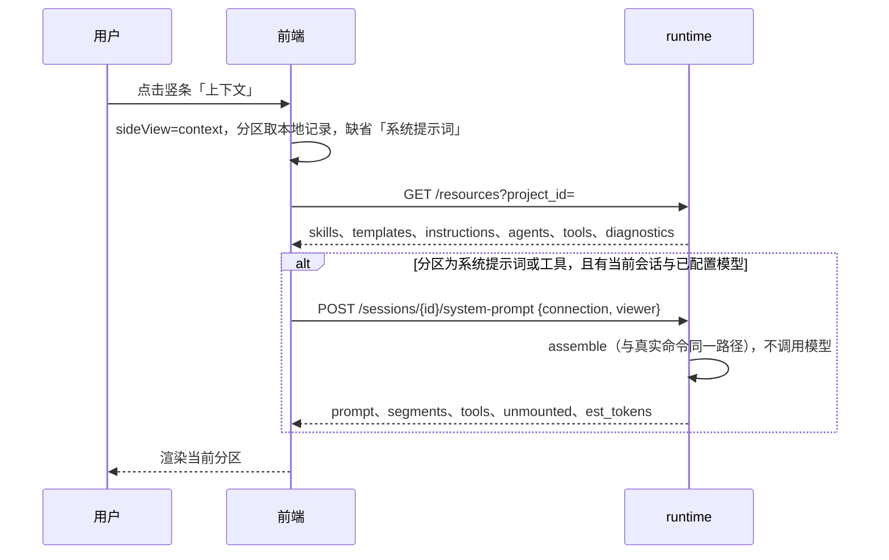
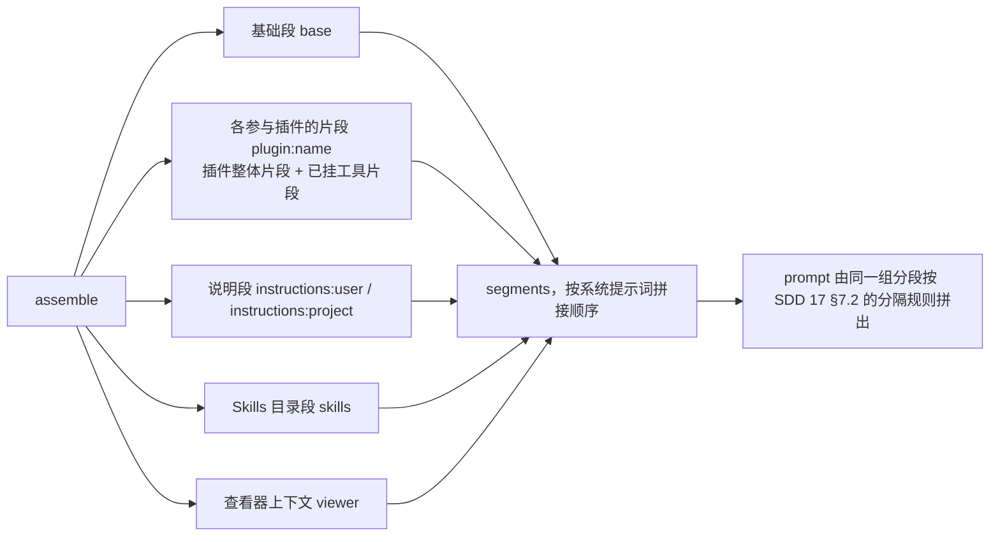

# 19 · 上下文管理

## 0. 文档状态

| 字段 | 内容 |
| --- | --- |
| 状态 | `implemented` |
| 当前阶段 | 已实现，自动化门禁与开发侧浏览器走查通过，自查见 §15；提示词模板、子智能体分区的浏览器走查与业务验收待补 |
| 来源 | 2026-10-04 维护者提出：把系统提示词、提示词模板、工具、子智能体、技能收拢为「上下文管理」，记忆与 MCP 预留入口 |
| 关联主 SDD | [Glaux SDD 索引](../../README.md) · [SDD 17 Skills 与提示词管理](../17-agent-skills-prompts/README.md) · [SDD 15 插件契约与权限引擎](../15-agent-plugins-permissions/README.md) · [SDD 18 子智能体](../18-agent-subagents/README.md) · [SDD 01 双模式外壳](../01-dual-mode-shell/README.md) |
| 负责人 | Glaux 项目维护者 |
| 最后更新 | 2026-10-04 |

> 状态合法值仅四个：`draft` → `ready` → `implemented` → `accepted`。

## 1. 本 SDD 负责什么

把模型上下文的各个来源集中到一个页面管理，并让用户看到上下文里实际装了什么、各占多少。冻结四件事：

1. **入口与布局**：Focus 左侧竖条的「技能」「提示词」两个入口合并为「上下文」；页面沿用设置页的「左列竖向分区导航 + 右列内容」布局。
2. **分区**：系统提示词、提示词模板、工具、子智能体、技能五个可用分区，记忆与 MCP 两个占位分区。
3. **工具目录**：runtime 在资源清单中返回全部插件工具的静态目录。
4. **分段预览**：系统提示词预览按来源分段返回，附带已挂载工具的模型可见定义、未挂载工具的原因与 token 估算。

## 2. 本 SDD 不负责什么

- 记忆与 MCP 的功能：只显示不可用的占位分区，不定义接口与数据。
- 编辑内置工具或启停工具：工具分区只读。工具是否可用由插件条件与权限模式决定（SDD 15）。
- Skills、模板、自定义说明、子智能体的加载规则与读写接口：沿用 SDD 17、SDD 18，本 SDD 只改它们的页面编排。
- 插件市场与 Workbench 的其他视图。
- 精确 token 计数：只做估算，不引入分词器。
- chat 发行版：沿用 SDD 17 §7.6 规则 5，不显示上下文入口。

## 3. 当前阶段目标

- 用户点击 Focus 竖条的「上下文」，看到与设置页一致的竖向分区导航，在各分区间切换，再次打开时停在上次的分区。
- 用户在「系统提示词」分区看到当前会话系统提示词的分段结构和每段的估算 token 数，内置段只读，GLAUX.md 可编辑。
- 用户在「工具」分区看到全部内置工具按插件分组，并能看到当前会话哪些已挂载、哪些未挂载及原因，以及已挂载工具发给模型的说明与参数。

## 4. 输入来源

### 4.1 接口

| 数据 | 来源 | 说明 |
| --- | --- | --- |
| Skills、模板、说明、子智能体清单 | `GET /agent-api/v1/resources`（SDD 17 §9.2） | 不变 |
| 工具目录 | `GET /agent-api/v1/resources` 的 `tools` 字段 | 本 SDD 新增，§9.1 |
| 分段预览 | `POST /agent-api/v1/sessions/{id}/system-prompt` | 本 SDD 扩展响应，§9.2 |
| Skills、模板、说明的读写与启停 | SDD 17 §9.2 各接口 | 不变 |

### 4.2 用户输入

| 输入 | 分区 | 说明 |
| --- | --- | --- |
| 切换分区 | 导航 | 记忆、MCP 不可选 |
| 编辑用户级、项目级 GLAUX.md | 系统提示词 | 同 SDD 17 |
| 刷新预览 | 系统提示词、工具 | 用当前会话、当前连接与焦点重新组装 |
| 新建、编辑、删除模板 | 提示词模板 | 同 SDD 17 |
| 新建、编辑、删除、启停、复制 Skill | 技能 | 同 SDD 17 |

## 5. 输出结果

### 5.1 用户可见输出

- **导航**：标题「上下文」，下设三组：
  - 指令：系统提示词、提示词模板
  - 能力：工具、子智能体、技能
  - 运行：轨迹（[SDD 21](../21-run-trajectory/README.md)）
  - 扩展：记忆、MCP（置灰，标「暂未开放」）
- **系统提示词**：用户级 GLAUX.md 编辑区；项目级 GLAUX.md 编辑区（仅项目会话）；预览区。
  - 预览区包括合计估算 token（系统提示词、工具定义、两者之和）和分段列表。
  - 每段显示来源标签和估算 token，可展开查看正文；内置段只读。
  - 提供「查看全文」，显示与模型实际收到的完全一致的整段文本。
- **提示词模板**：模板列表；点击进入详情编辑，详情顶部有返回。
- **工具**：按插件分组的工具列表。
  - 每个工具显示名称、副作用等级徽标、挂载条件徽标。
  - 有预览结果时，每个工具另显示「已挂载」或「未挂载：原因」。
  - 展开已挂载工具可看到模型可见说明、参数 JSON Schema 与估算 token。
- **子智能体**：只读列表（名称、说明、可用工具、最大轮数、来源、是否被覆盖），同 SDD 18 §5.1。
- **技能**：按项目、用户、内置分组的列表与加载告警；点击进入详情编辑，详情顶部有返回。

### 5.2 系统输出

- 资源清单新增工具目录。
- 预览响应新增分段、工具定义、未挂载原因、估算 token。
- 浏览器本地记住上次分区。

## 6. 核心流程

### 6.1 打开上下文页



### 6.2 分段预览的组装



## 7. 核心规则

### 7.1 入口与布局

1. Focus 左侧竖条删除「技能」「提示词」两个入口，在原位置新增「上下文」一个入口。点击行为与「设置」一致：打开时切换为 `sideView: "context"`，再次点击收起。
2. 上下文页在右侧工作区打开，与舞台、图谱同位，和对话列并排；只有设置页铺满对话列（SDD 01 D25、D29）。
3. 上下文页与设置页共用同一个竖向分区布局组件，视觉一致。
4. Workbench 活动栏的「技能」「提示词」两个视图合并为「上下文」一个视图，在侧边栏内渲染同一页面。容器宽度不超过 520px 时，分区导航改为排在内容上方的横排，并隐藏分组标题（与设置页同一断点）。
5. chat 发行版不显示入口。

### 7.2 分区

1. 分区顺序与分组见 §5.1。
2. 记忆、MCP 为不可用分区：按钮置灰、`aria-disabled="true"`，悬停提示「暂未开放」，点击不切换。
3. 当前分区存浏览器本地（键 `glaux.contextSection.v1`），Focus 与 Workbench 共用。读取失败、取值非法或指向不可用分区时，回到「系统提示词」。
4. 旧布局迁移：持久化的 `sideView` 为 `skills` 时迁为 `context` 并把分区设为「技能」；为 `prompts` 时迁为 `context` 并把分区设为「系统提示词」。
5. 项目级内容跟随当前会话的项目；当前会话未归属时不显示项目级（同 SDD 17 §7.6 规则 2）。

### 7.3 列表与详情

1. 提示词模板、技能采用「列表 → 详情」两级：点击列表项进入详情，详情顶部有「返回」。
2. 详情有未保存修改时，返回、切换列表项、切换分区、关闭页面都先确认。
3. 保存、删除、启停、复制为用户级的行为与提示文案沿用 SDD 17 §7.6 规则 3、4。
4. 子智能体只有列表，没有详情。

### 7.4 预览

1. 进入「系统提示词」或「工具」分区时，有当前会话且已配置模型就自动请求一次预览；分区内提供「刷新」。切换会话后再次进入时重新请求。
2. 没有当前会话时，预览区显示「打开或新建一个会话后可预览」。没有配置模型时显示「先配置模型」，点击打开设置的「模型与连接」。这两种情况下工具分区仍显示静态目录，只是不显示挂载状态。
3. 预览失败时在预览区显示错误文本，不影响编辑区与静态目录。
4. 分段的来源标签：

   | `kind` | 中文标签 | 可编辑 |
   | --- | --- | --- |
   | `base` | 内置基础段 | 否 |
   | `plugin` | 插件：`<plugin>` | 否 |
   | `instructions` | 用户 GLAUX.md / 项目 GLAUX.md | 在本分区上方编辑 |
   | `skills` | 技能目录 | 在「技能」分区启停 |
   | `viewer` | 查看器上下文 | 否 |

5. 估算 token 与压缩判定同一口径（§9.3）；界面写「约 N tokens」，不显示为精确值。

### 7.5 工具目录与挂载状态

1. 工具目录来自插件登记表（SDD 15 §7.1）。顺序与登记顺序一致，按插件分组，组名为插件名。
2. 目录不依赖会话，未打开会话时也能浏览。
3. 挂载状态只来自预览，与真实命令的工具集一致。
4. 未挂载原因按以下优先级取第一个命中的。工具自身的声明式条件排在插件条件之前，因为它们能给出具体原因：

   | `reason` | 条件 | 中文说明 |
   | --- | --- | --- |
   | `needs_project` | `requires.project` 且会话未归属项目 | 需要项目会话 |
   | `needs_vision` | `requires.vision` 且连接不支持图像 | 当前模型不支持图像 |
   | `needs_runtime` | `requires.runtime` 且无运行时 | 运行时不可用 |
   | `needs_egress` | `requires.egress` 且外发未放行或缺少凭据 | 外部分割服务未配置 |
   | `plugin_inactive` | 插件 `applies` 为假 | 按插件取说明，见规则 5 |
   | `unsupported_focus` | `supports(focus)` 为假 | 当前打开的对象不适用 |
   | `mode` | 权限模式不允许挂载该副作用等级（SDD 15 §7.4） | 当前权限模式不挂载 |

5. `plugin_inactive` 的说明由前端按插件名取 i18n（键 `plugin_inactive_<plugin>`），缺键时显示通用说明「插件在当前会话不参与」。首批：

   | 插件 | 说明 |
   | --- | --- |
   | `files` | 会话没有工作目录 |
   | `project` | 需要项目会话 |
   | `video` | 当前没有打开视频，或模型不支持音视频理解 |
   | `subagents` | 没有可用的子智能体定义 |

6. 工具的界面一句话说明由前端按工具名从 i18n 取（键 `tool_desc_<name>`）；缺键时不显示说明行。模型可见说明只在展开已挂载工具时显示，原文展示，不翻译。

## 8. 涉及对象

### 8.1 agent-runtime

| 位置 | 变化 |
| --- | --- |
| `src/plugins/registry.ts` | 新增工具目录函数；可用性判定返回未挂载原因（`toolAvailable` 改为返回原因，`availableTools` 行为不变） |
| `src/pi/harness-registry.ts` | `systemPromptFor` 改为先产出分段再拼接，`prompt` 逐字不变；`previewSystemPrompt` 返回 §9.2 |
| `src/resources/load.ts` | `promptExtras` 之外再返回结构化的说明块与目录块，供分段使用 |
| `src/transport/resource-routes.ts` | `GET /resources` 增加 `tools` |
| `src/contracts.ts` 或 `src/resources/` 类型 | `ToolItem`、`SystemPromptPreview` 等类型 |

### 8.2 前端

| 位置 | 变化 |
| --- | --- |
| `components/focus/SessionRail.tsx` | 两个入口合并为「上下文」 |
| `components/focus/FocusSidePanel.tsx`、`FocusShell.tsx` | `sideView="context"` 时按设置页方式渲染上下文页 |
| `store/session.ts` | `FocusSideView` 去掉 `skills`、`prompts`，增加 `context`；旧值迁移；Workbench `View` 同样合并 |
| `components/SectionedPanel.tsx`（新）、`components/focus/SettingsPanel.tsx` | 竖向分区布局组件，设置页与上下文页共用 |
| `components/context/`（新） | `ContextPanel`、各分区组件、`shared.ts`（资源清单、预览、未保存登记） |
| `store/contextSection.ts`（新） | 当前分区与持久化 |
| `components/resources/` | `SkillsView`、`PromptsView` 拆入 `components/context/` 的各分区后删除 |
| `components/ActivityBar.tsx`、`SideBar.tsx` | Workbench 视图合并 |
| `agent/runtime/client.ts`、`types.ts` | §9 类型 |
| `i18n/zh.ts`、`en.ts` | 分区名、原因说明、工具说明 `tool_desc_<name>` |

## 9. 数据或字段要求

### 9.1 资源清单增量

```ts
type ToolEffect = "read" | "annotate" | "compute" | "egress" | "write" | "exec" | "delegate";
type ToolRequirement = "project" | "vision" | "runtime" | "egress";

interface ToolItem {
  name: string;
  plugin: string;               // 插件名，即分组名
  effect: ToolEffect;
  requires: ToolRequirement[];  // 由 ToolProvider.requires 中为真的键得出，顺序固定为上式顺序
}

// ResourceList 增加：
//   tools: ToolItem[];          // chat 发行版为空数组
```

### 9.2 预览响应

`POST /agent-api/v1/sessions/{id}/system-prompt` 请求为 `{connection, viewer?, lang?}`（`lang` 见 [SDD 20](../20-prompt-language/README.md) §7.1；前端取界面语言，切换后重新请求），响应为：

```ts
interface PromptSegment {
  kind: "base" | "plugin" | "instructions" | "skills" | "viewer";
  plugin?: string;                  // kind = plugin 时
  scope?: "user" | "project";       // kind = instructions 时
  text: string;
  est_tokens: number;
}

interface MountedTool {
  name: string;
  plugin: string;
  effect: ToolEffect;
  description: string;              // 发给模型的说明原文
  parameters: unknown;              // 发给模型的参数 JSON Schema
  est_tokens: number;               // name + description + JSON.stringify(parameters)
}

interface UnmountedTool {
  name: string;
  plugin: string;
  reason: "plugin_inactive" | "needs_project" | "needs_vision" | "needs_runtime"
        | "needs_egress" | "unsupported_focus" | "mode";
}

interface SystemPromptPreview {
  prompt: string;                   // 与真实命令逐字一致（SDD 17 §7.5 规则 7）
  segments: PromptSegment[];        // 按拼接顺序；空段不出现
  tools: MountedTool[];             // 按挂载顺序
  unmounted: UnmountedTool[];       // 按目录顺序
  est_tokens: { prompt: number; tools: number };
}
```

- `tools` 由 `string[]` 改为 `MountedTool[]`，属非兼容变更。前后端同仓同版发布，不保留旧形态。
- 分段与 `prompt` 的关系：各段 `text` 不含段间分隔符；`prompt` 去掉全部空白后，等于各段 `text` 去掉空白后按顺序拼接的结果。
- 测试注入自定义 `toolFactory` 时，不在目录中的已挂载工具 `plugin`、`effect` 记为 `""`；目录中未被挂载且没有命中任何原因的工具不进 `unmounted`。
- chat 发行版：`segments` 只有一段 `base`，`tools`、`unmounted` 为空数组。

### 9.3 token 估算

- 使用 pi 上下文压缩判定所用的同一估算函数；该函数只接受消息时，按其对文本的同一换算规则实现，并在代码注释中注明出处。
- `est_tokens.prompt` 是对整段 `prompt` 的估算，不是各段之和；`est_tokens.tools` 是各 `MountedTool.est_tokens` 之和。

### 9.4 前端本地状态

| 键 | 值 | 说明 |
| --- | --- | --- |
| `glaux.contextSection.v1` | `"system" \| "templates" \| "tools" \| "agents" \| "skills" \| "trajectory"` | 上次分区；读写包在 try/catch 中；`trajectory` 见 SDD 21 |
| `glaux.focusLayout.v1` 的 `sideView` | 增加 `"context"`，去掉 `"skills"`、`"prompts"` | 迁移见 §7.2 规则 4，键名不 bump |

## 10. 幂等规则

- 预览不改变任何状态，重复请求结果相同（文件与连接不变时）。
- 资源读写的幂等沿用 SDD 17 §10。

## 11. 状态或生命周期规则

- 页面状态：

  ```mermaid
  stateDiagram-v2
      [*] --> 列表
      列表 --> 详情: 点击列表项 / 新建
      详情 --> 列表: 返回（有未保存修改先确认）
      详情 --> 详情: 保存
      列表 --> [*]: 切换分区 / 关闭
      详情 --> [*]: 切换分区 / 关闭（有未保存修改先确认）
  ```

- 预览结果是快照：编辑 GLAUX.md、启停 Skill、切换焦点后不自动刷新；保存 GLAUX.md 或启停 Skill 成功后，预览区标注「内容已变化，刷新查看」。
- 资源生效时机沿用 SDD 17 §11：下一个命令生效。

## 12. 审计或事件规则

- 不新增 SSE 事件，不写审计记录。

## 13. 异常和人工处理

| 情况 | 处理 |
| --- | --- |
| `GET /resources` 失败 | 各列表分区显示错误文本与「重试」；导航可用 |
| 预览 `404 session_not_found` | 预览区显示错误码与信息，清空旧结果 |
| 预览其他错误（凭据、运行时） | 预览区显示错误文本；静态目录照常显示 |
| 预览响应不是 §9.2 的结构（前端已更新、runtime 仍是旧进程） | 不渲染分段与挂载状态，预览区提示「agent-runtime 版本比页面旧，重启后刷新」；静态目录照常显示 |
| 本地分区记录不可读或非法 | 回到「系统提示词」 |
| 旧布局 `sideView` 为 `skills` / `prompts` | 按 §7.2 规则 4 迁移，不白屏 |
| 点击记忆或 MCP | 不切换，提示「暂未开放」 |

## 14. 与其他 SDD 的调用关系

| SDD | 关系 |
| --- | --- |
| [SDD 17](../17-agent-skills-prompts/README.md) | 页面编排（§1 第 5 项、§4.2、§5.1、§7.6、§8.2）由本 SDD 取代；预览响应（§9.2）由本 SDD §9.2 取代；SDD 17 对应章节引用本 SDD |
| [SDD 15](../15-agent-plugins-permissions/README.md) | 工具目录读取插件登记表；未挂载原因 `mode` 依据 §7.4 的挂载规则 |
| [SDD 18](../18-agent-subagents/README.md) | 子智能体分区展示 `AgentItem`，字段不变 |
| [SDD 21](../21-run-trajectory/README.md) | 新增分组「运行」与分区「轨迹」；请求头详情复用分段结构（§9.2）与估算口径（§9.3） |
| [SDD 01](../01-dual-mode-shell/README.md) | 竖条入口由「技能、提示词」改为「上下文」；`sideView` 取值与迁移；上下文页与设置页同位置（D25） |

## 15. 验收标准

### 15.1 runtime

- [x] `GET /resources` 返回 `tools`，包含登记表中全部插件工具，顺序与登记顺序一致，`plugin`、`effect`、`requires` 与插件声明一致（契约测试）。——`resources-api.test.ts`、`prompt-preview.test.ts`
- [x] 预览的 `prompt` 与同条件下真实命令的系统提示词逐字相等；SDD 17 之前的快照测试不变（集成测试、快照测试）。——`resources-api.test.ts`（逐字相等）；`system-prompt.test.ts` 快照未变
- [x] 预览的 `segments` 满足 §9.2 的空白归一化拼接等式；有说明、有 Skills、有焦点三种条件各覆盖一次（单元测试）。——`prompt-preview.test.ts`；HTTP 层另见 `resources-api.test.ts`
- [x] 观察模式下，`bash` 出现在 `unmounted` 且 `reason` 为 `mode`；未归属项目的会话中，`list_files` 的 `reason` 为 `needs_project`；连接不支持图像时，需要图像的工具 `reason` 为 `needs_vision`（单元测试）。——`prompt-preview.test.ts`（`open_file`）；另覆盖 `plugin_inactive`
- [x] `tools` 中每项的 `description`、`parameters` 与真实命令挂载的工具定义一致（集成测试）。——`resources-api.test.ts`
- [x] `est_tokens` 字段齐全且为非负整数；`est_tokens.tools` 等于各工具估算之和（单元测试）。——`prompt-preview.test.ts`

### 15.2 前端

- [x] Focus 竖条只有「上下文」入口，没有「技能」「提示词」；点击打开、再点收起；chat 发行版不出现（组件测试）。——`SessionRail.test.tsx`；chat 发行版沿用竖条已有的 `CHAT_EDITION` 判断，未另写用例
- [x] 上下文页与设置页使用同一布局组件；导航分组与顺序符合 §5.1（组件测试）。——`ContextPanel.test.tsx`、`SettingsPanel.test.tsx`
- [x] 记忆、MCP 置灰且 `aria-disabled="true"`，点击不切换（组件测试）。——`ContextPanel.test.tsx`
- [x] 切换分区后关闭再打开，停在上次分区；本地存储抛错时回到「系统提示词」（单元测试）。——`atlasView.test.ts`
- [x] 持久化 `sideView: "skills"` 迁为 `context` 且分区为「技能」，`"prompts"` 迁为 `context` 且分区为「系统提示词」（单元测试）。——`atlasView.test.ts`
- [x] 技能、模板列表进入详情、返回列表；有未保存修改时返回、切换分区会先确认（组件测试）。——`ContextPanel.test.tsx`；切走上下文页的确认见 `SessionRail.test.tsx`
- [x] 系统提示词分区显示分段、各段来源标签与估算 token，「查看全文」显示 `prompt` 原文（组件测试）。——`ContextPanel.test.tsx`
- [x] 工具分区无会话时只显示静态目录；有预览时显示已挂载与未挂载原因，展开已挂载工具可见说明与参数（组件测试）。——`ContextPanel.test.tsx`
- [x] 无会话、无模型、预览失败三种状态按 §7.4 规则 2、3 显示（组件测试）。——`ContextPanel.test.tsx`
- [x] Workbench 活动栏只有一个「上下文」入口，侧边栏内渲染同一页面（组件测试）。——`ActivityBar.test.tsx`

### 15.3 走查与工程

- [ ] 浏览器走查：Focus 下打开上下文页，依次进入五个可用分区，编辑并保存 GLAUX.md 后刷新预览可见新内容；截图留证。——开发侧走查了系统提示词（保存 GLAUX.md → 「内容已变化」→ 刷新后出现「个人 GLAUX.md」分段）、工具（7/16 已挂载，未挂载原因正确，展开可见定义）、技能（内置只读详情）与 480px 窄屏；提示词模板、子智能体分区只有组件测试，待业务验收
- [x] `make test`、`make lint` 通过。——agent-runtime 470、前端 432，两端 lint 与 `check-literals` 通过；backend、science-core 未改动，未重跑
- [x] SDD 17、SDD 01、SDD 15 的相关章节与 SDD 索引同步更新；仓库骨架总览如涉及目录变化同步更新。——另含 SDD 18、操作手册、三份 CHANGELOG

## 16. 决策记录

| 编号 | 决策 | 理由 |
| --- | --- | --- |
| D-1 | 新开 Feature SDD，而不是改写 SDD 17 | SDD 17 已 `implemented`；本次是跨 SDD 15/17/18 的页面重组与预览契约扩展，独立文档便于评审与验收 |
| D-2 | 布局沿用设置页的竖向分区，并抽出共用组件 | 维护者要求与设置页一致；内容区宽，可容纳编辑器与分段预览 |
| D-3 | 提示词模板、子智能体各自独立分区 | 维护者要求；模板由用户显式调用，子智能体经 `agent` 工具委派，二者与技能、工具在使用方式上不同 |
| D-4 | 记忆、MCP 只做前端占位，不预埋接口或字段 | 契约在立项时再定；空契约只会成为待兼容的负担 |
| D-5 | 工具目录并入 `GET /resources`，不另开端点 | 与 Skills、子智能体同属上下文资源，前端一次取全 |
| D-6 | 挂载状态只来自预览 | 挂载取决于项目、连接、焦点与权限模式，只有组装路径能给出与真实命令一致的结果 |
| D-7 | 工具的界面说明走前端 i18n，模型可见说明原文展示 | `ToolProvider` 没有静态说明，模型可见说明在 `create` 时才生成，且为英文；界面需要中英文一句话说明 |
| D-8 | 预览 `tools` 改为对象数组，不保留 `string[]` | 前后端同仓同版发布；保留两种形态只增加分支 |
| D-9 | 分段与 `prompt` 的一致性用「去空白后拼接相等」约束 | 分隔符随有无说明段而变（SDD 17 §7.2），段内不带分隔符便于展示，同时保证内容不遗漏、不重复 |
| D-10 | 上下文页在右侧工作区与对话列并排，不占对话列 | 调整技能与提示词时要能同时使用对话（SDD 01 D29）；右侧工作区宽度可拖拽，窄时分区导航改为横排（§7.1 规则 4 的断点） |
| D-11 | Workbench 只做入口合并，复用同一页面 | Workbench 不再新增设计；保留两个旧视图会维护两套页面 |

## 17. 待确认问题

无。
