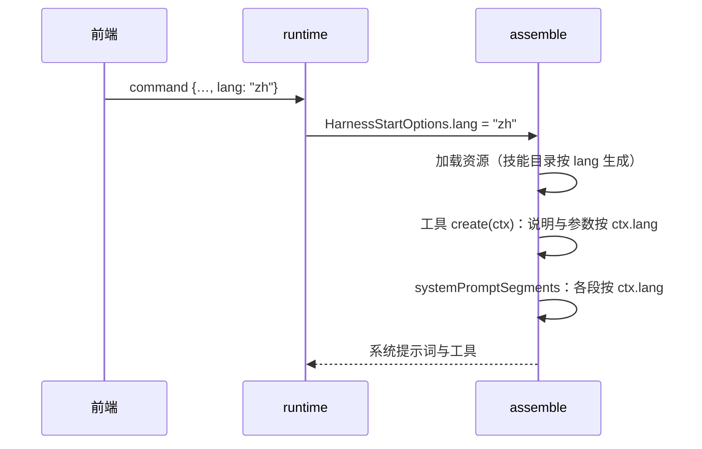

# 20 · 提示词随界面语言切换

## 0. 文档状态

| 字段 | 内容 |
| --- | --- |
| 状态 | `ready` |
| 当前阶段 | 范围与译文定稿方式已由维护者确认（2026-10-05），进入实现 |
| 来源 | 2026-10-05 维护者提出：系统提示词按界面语言调整，默认支持中英文 |
| 关联主 SDD | [Glaux SDD 索引](../../README.md) · [SDD 19 上下文管理](../19-context-management/README.md) · [SDD 17 Skills 与提示词管理](../17-agent-skills-prompts/README.md) · [SDD 15 插件契约与权限引擎](../15-agent-plugins-permissions/README.md) · [SDD 00 内置参考智能体](../00-reference-agent-conversations/README.md) |
| 负责人 | Glaux 项目维护者 |
| 最后更新 | 2026-10-05 |

> 状态合法值仅四个：`draft` → `ready` → `implemented` → `accepted`。

## 1. 本 SDD 负责什么

让模型看到的系统提示词与工具定义跟随界面语言（中文 / 英文）。冻结四件事：

1. **语言来源**：前端在命令与预览请求中带上界面语言 `lang`。
2. **提示词语言**：系统提示词各段按 `lang` 取中文或英文。
3. **工具定义语言**：工具说明与参数说明按 `lang` 取中文或英文，含 pi 内置的 `read`、`write`、`edit`、`bash`。
4. **兼容**：缺省为英文，英文文本与本 SDD 实施前逐字一致。

## 2. 本 SDD 不负责什么

- 工具执行结果、错误信息、权限拒绝理由、预算收尾提示等工具返回给模型的文本：保持现状。
- 图谱检索、`locate_roi` 等次级模型调用的提示词。
- 内置数据文件 `skills/skill-creator/SKILL.md`、`agents/general.md` 的正文与描述，以及用户写的 Skill、子智能体、`GLAUX.md`：按原文注入。
- 中英以外的语言。
- 约束模型的回复语言：不额外加「用某种语言回答」的指令。
- 视频链路现有的中文参数说明与中文错误信息：参数说明纳入本 SDD 的双语表；错误信息属第 1 项，保持现状。

## 3. 当前阶段目标

- 界面切到中文后，下一条命令的系统提示词与工具定义为中文；切回英文后为英文。
- 上下文页（SDD 19）的预览随界面语言变化，显示模型实际收到的语言版本。
- 不带 `lang` 的请求得到与本 SDD 实施前逐字相同的英文提示词与工具定义。

## 4. 输入来源

| 输入 | 来源 | 说明 |
| --- | --- | --- |
| `lang` | 前端界面语言（`glaux.lang`，`zh` / `en`） | 随 `prompt`、`regenerate` 命令与系统提示词预览请求下发 |
| 中英文案 | agent-runtime 代码内的双语表 | 与原英文常量放在同一文件，按 `lang` 取值 |

## 5. 输出结果

- 系统提示词：基础段、插件片段、查看器上下文、技能目录引导语、Skills 目录行、`GLAUX.md` 截断说明、子智能体追加段为对应语言。
- 工具定义：12 个自有工具与 pi 内置 4 个工具的说明与参数说明为对应语言。
- chat 发行版的对话提示词为对应语言。

## 6. 核心流程



## 7. 核心规则

### 7.1 语言来源

1. `PromptLang = "en" | "zh"`；缺省 `en`。
2. `prompt`、`regenerate` 命令与 `POST /sessions/{id}/system-prompt` 请求体接受可选字段 `lang`；取值不是 `en` / `zh` 时返回 `400 invalid_request`。
3. 前端取当前界面语言下发：Focus 与 Workbench 发命令、上下文页预览都带 `lang`。
4. 语言按命令生效：界面中途切换，从下一条命令起使用新语言；进行中的命令不受影响。
5. 子智能体继承主命令的 `lang`。

### 7.2 系统提示词

1. 中文版的段落顺序、来源分段与 SDD 17 §7.2、SDD 19 §9.2 相同；拼接规则不变。
2. 英文版逐字不变：插件片段仍以前导空格衔接。中文版插件片段不加前导空格，直接衔接。
3. 查看器上下文中的机器字段（`object_id=`、`kind=`、`index=` 等）不翻译，只翻译外层句子。
4. 技能目录：英文沿用 pi `formatSkillsForSystemPrompt`；中文由 runtime 生成同一 XML 结构，只替换引导语。Skill 的名称、描述、路径按原文。
5. 中文译文要求：指令语气，术语与界面一致（如「项目」「工作目录」「审批」），工具名、参数名、字段名保留原文。

### 7.3 工具定义

1. 自有工具：`create(ctx)` 按 `ctx.lang` 取说明与参数 schema；两种语言的 schema 结构相同，只有 `description` 不同。
2. pi 内置工具（`read`、`write`、`edit`、`bash`）：在 `files` 插件的包装层覆盖工具说明；参数 schema 复制后按路径替换 `description`，保留 TypeBox 元数据，校验行为不变。
3. 工具的 `label` 不翻译（只用于 UI）。

## 8. 涉及对象

### 8.1 agent-runtime

| 位置 | 变化 |
| --- | --- |
| `src/contracts.ts` | `PromptLang`；`prompt`、`regenerate` 命令增加 `lang?` |
| `src/transport/routes.ts` | 解析命令与预览请求的 `lang` |
| `src/pi/command-service.ts` | `lang` 传入 `start()`；参与命令摘要（仅在出现时） |
| `src/pi/harness-registry.ts` | `HarnessStartOptions.lang`；基础段、查看器上下文、子智能体追加段双语 |
| `src/i18n/`（新） | `PromptLang`、取语言函数、双语表类型、schema 描述替换函数 |
| `src/plugins/*.ts`、`src/pi/tools/*.ts`、`src/interaction/ask-user.ts` | 片段、工具说明、参数说明双语 |
| `src/resources/load.ts` | 技能目录与 Skills 目录行、截断说明按 `lang` |
| `src/edition.ts` | chat 对话提示词双语 |

### 8.2 前端

| 位置 | 变化 |
| --- | --- |
| `i18n/index.tsx` | 导出读取当前界面语言的函数 |
| `store/agentSessions.ts` | `prompt`、`regenerate` 命令带 `lang` |
| `agent/runtime/client.ts`、`types.ts` | 命令与预览请求的 `lang` |
| `components/context/shared.ts` | 预览带 `lang`；语言切换后重新请求 |

## 9. 数据或字段要求

```ts
type PromptLang = "en" | "zh";

// 命令（SDD 00 §9、SDD 17 §9.3 的增量）
type PromptCommand = { /* … */ lang?: PromptLang };
type RegenerateCommand = { /* … */ lang?: PromptLang };

// 预览请求（SDD 19 §9.2 的增量）
interface SystemPromptPreviewRequest { connection: ConnectionInput; viewer?: ViewerContext; lang?: PromptLang }
```

- 双语文案的类型为 `Record<PromptLang, string>`，缺任一语言即编译失败。

## 10. 幂等规则

- `lang` 出现时参与命令摘要：同一 `command_id` 换语言判为 `idempotency_conflict`。不出现时摘要与实施前相同。

## 11. 状态或生命周期规则

- 语言不持久化到会话；每条命令按请求中的 `lang` 组装。

## 12. 审计或事件规则

- 不新增事件。

## 13. 异常和人工处理

| 情况 | 处理 |
| --- | --- |
| `lang` 非法 | `400 invalid_request` |
| 旧前端不带 `lang` | 按英文组装，与实施前一致 |
| 本地存储读不到界面语言 | 前端按 `navigator.language` 推断（与界面初始化规则一致） |

## 14. 与其他 SDD 的调用关系

| SDD | 关系 |
| --- | --- |
| [SDD 00](../00-reference-agent-conversations/README.md) | 命令增加 `lang` 字段 |
| [SDD 17](../17-agent-skills-prompts/README.md) | 技能目录段、Skills 目录行、截断说明双语 |
| [SDD 19](../19-context-management/README.md) | 预览请求增加 `lang`；预览随界面语言刷新 |
| [SDD 15](../15-agent-plugins-permissions/README.md) | 插件片段与工具定义双语；`ToolProvider.create` 读 `ctx.lang` |

## 15. 验收标准

### 15.1 runtime

- [ ] 不带 `lang` 与 `lang: "en"` 的系统提示词与 SDD 17 快照逐字一致（快照测试）。
- [ ] `lang: "zh"` 的系统提示词三种场景（无焦点、图像加项目、视频）各有快照，不含英文指令句（快照测试）。
- [ ] `lang: "zh"` 时 16 个工具的说明与全部参数说明为中文；两种语言的参数 schema 除 `description` 外完全相同（单元测试）。
- [ ] pi 内置工具替换说明后，参数校验结果与替换前相同（单元测试）。
- [ ] 中文技能目录与 pi 生成的英文目录 XML 结构相同，名称、描述、路径按原文（单元测试）。
- [ ] 命令与预览的 `lang` 非法时返回 `400`；`lang` 参与摘要，同一 `command_id` 换语言返回冲突（契约测试）。
- [ ] 预览 `lang: "zh"` 的 `prompt` 与同条件下真实命令收到的系统提示词逐字相等（集成测试）。

### 15.2 前端

- [ ] `prompt`、`regenerate` 命令带当前界面语言（单元测试）。
- [ ] 上下文页预览请求带 `lang`；切换界面语言后重新请求（组件测试）。

### 15.3 走查与工程

- [ ] 浏览器走查：界面切换中英文，上下文页的系统提示词与工具说明随之切换；截图留证。
- [ ] `make test`、`make lint` 通过。
- [ ] SDD 00、15、17、19 与 SDD 索引同步更新。

## 16. 决策记录

| 编号 | 决策 | 理由 |
| --- | --- | --- |
| D-1 | 第一期只做系统提示词与工具定义 | 维护者选择；这两层是上下文页可见的全部内容，对模型行为影响最大 |
| D-2 | 语言随每条命令下发，不存会话 | 系统提示词本就按命令组装；界面语言是查看者偏好，不是会话属性 |
| D-3 | 双语文案与原英文常量放在同一文件 | 改一处时两种语言同时可见，避免中英版本漂移 |
| D-4 | 英文版逐字不变，中文版插件片段不加前导空格 | 保持现有快照与断言；中文句间不需要空格 |
| D-5 | 中文译文由实现者起草后直接合并 | 维护者选择；真实模型走查后再调整措辞 |
| D-6 | 不加回复语言指令 | 系统提示词语言已足以影响回复语言；用户用另一种语言提问时，模型应跟随用户 |

## 17. 待确认问题

无。
