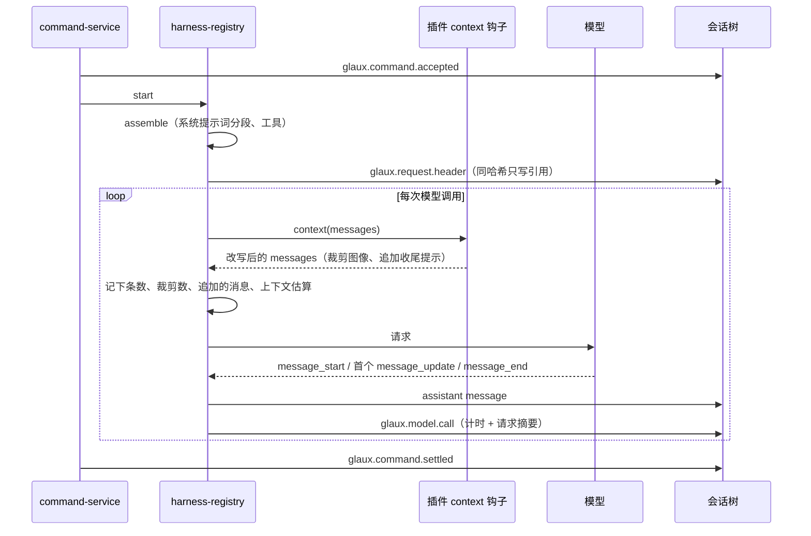
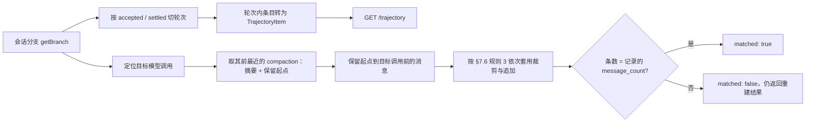

# 21 · 运行轨迹

## 0. 文档状态

| 字段 | 内容 |
| --- | --- |
| 状态 | `ready` |
| 当前阶段 | 可进入实现：范围、契约、验收完整，开放问题为零 |
| 来源 | 2026-10-05 维护者提出：在上下文页披露运行消息，参照 deepseek-harness 的开发者工具（Trajectory 标签页）管理运行时上下文 |
| 关联主 SDD | [Glaux SDD 索引](../../README.md) · [SDD 19 上下文管理](../19-context-management/README.md) · [SDD 15 插件契约与权限引擎](../15-agent-plugins-permissions/README.md) · [SDD 18 子智能体](../18-agent-subagents/README.md) · [SDD 20 提示词随界面语言切换](../20-prompt-language/README.md) · [SDD 00 内置参考智能体](../00-reference-agent-conversations/README.md) |
| 负责人 | Glaux 项目维护者 |
| 最后更新 | 2026-10-05 |

> 状态合法值仅四个：`draft` → `ready` → `implemented` → `accepted`。

## 1. 本 SDD 负责什么

在上下文页新增「轨迹」分区，按轮次披露一个会话的运行记录：每条命令的请求头（系统提示词与工具）、每次模型调用、每次工具调用、压缩与运行提示，以及每次模型调用实际发给模型的上下文。冻结五件事：

1. **采集**：runtime 新增两种会话条目，记录每条命令的请求头和每次模型调用的计时与请求摘要。
2. **投影**：轨迹由会话树推出，不另建存储；新增轨迹接口与单次请求上下文接口。
3. **请求重建**：按会话树和已记录的请求摘要重建每次模型调用实际发送的消息，并校验条数。
4. **页面**：轨迹分区的工具栏、等宽泳道时间线、按轮次分组的记录表与展开详情。
5. **旧会话兼容**：本 SDD 之前产生的会话照常显示，缺失字段降级。

## 2. 本 SDD 不负责什么

- 原始 HTTP 请求与响应：不记录。轨迹记录的是规范化后的请求头与消息。
- 流式分块的逐增量时间：只记首 token 时间与总耗时，不记每个增量的时间差。
- 编辑、删除、重放轨迹中的任何记录。
- 跨会话的统计与检索。
- 精确 token 计数：上下文占用只做估算（同 SDD 19 §9.3）；模型返回的 `usage` 原样展示。
- 按耗时投影的时间线、拖选筛选、全文搜索、分页加载：列为二期（§3.2），本 SDD 只冻结一期。
- chat 发行版：不显示上下文入口（SDD 19 §7.1 规则 5），runtime 仍写入采集条目。

## 3. 当前阶段目标

### 3.1 一期

- 用户在上下文页点「轨迹」，看到当前会话按轮次分组的运行记录，以及顶部的输入 / 模型 / 工具三条等宽泳道。
- 用户展开某一轮的「上下文」行，看到该轮系统提示词的分段与估算 token、挂载的工具，以及与上一轮相比哪些分段、工具有变化。
- 用户展开某次模型调用，看到模型输出（含思考与工具调用）、`usage`、首 token 时间与总耗时、上下文占用拆分，并能加载该次实际发给模型的消息列表。
- 用户展开工具调用看到参数、结果、耗时与等待审批时间；`agent` 工具调用下嵌套显示子智能体过程。
- 用户展开压缩行，看到压缩前 token 数、摘要与保留的消息。

### 3.2 二期（不在本 SDD 冻结范围）

- 时间线「时长」模式：按记录耗时投影，去掉空闲间隙。
- 时间线拖选区间筛选记录表、滚轮缩放。
- 全文搜索。
- 尾部优先分页与虚拟化。

## 4. 输入来源

### 4.1 会话树中已有的条目

| 条目 | 用途 |
| --- | --- |
| `message`（user / assistant / toolResult） | 用户输入、模型输出（含 `usage`、`stopReason`、`timestamp`）、工具结果 |
| `custom` `glaux.command.accepted` / `glaux.command.settled` | 轮次边界、命令类型、结局 |
| `custom` `glaux.tool.timing` | 工具耗时、等待审批时间、是否被拦截 |
| `custom` `glaux.budget` | 每轮回合数、时长、是否进入收尾 |
| `custom` `glaux.permission.decision` | 权限判定提示 |
| `compaction` | 压缩前 token 数、摘要、保留起点 |
| `model_change` | 模型切换提示 |
| toolResult 的 `details.kind = "glaux.subagent_run"` | 子智能体过程（SDD 18 §9.2） |

### 4.2 本 SDD 新增的条目

| 条目 | 写入时机 | 说明 |
| --- | --- | --- |
| `custom` `glaux.request.header` | 每条命令装配完成后、调用模型前 | §9.1 |
| `custom` `glaux.model.call` | 每次模型调用的 `message_end` 之后 | §9.2 |

### 4.3 接口

| 数据 | 接口 |
| --- | --- |
| 轨迹 | `GET /agent-api/v1/sessions/{id}/trajectory`（§9.3） |
| 单次请求上下文 | `GET /agent-api/v1/sessions/{id}/trajectory/requests/{item_id}`（§9.4） |
| 刷新时机 | 现有 SSE 事件 `run.settled`、`context.compacted` |

### 4.4 用户输入

| 输入 | 说明 |
| --- | --- |
| 切换到「轨迹」分区 | 加载当前会话轨迹 |
| 刷新 | 重新请求轨迹 |
| 轮次 / 调用 | 一键折叠或展开全部轮次、全部工具调用 |
| 点击泳道块 | 记录表滚动到对应行并展开 |
| 展开行、切换详情标签 | 查看详情；「请求」标签按需加载 §9.4 |

## 5. 输出结果

### 5.1 用户可见输出

- **导航**：上下文页在「能力」与「扩展」之间新增分组「运行」，下设「轨迹」。
- **工具栏**：刷新；轮次、调用两个折叠开关；会话合计（轮次数、模型调用数、工具调用数、输入 / 输出 / 缓存读 tokens）。
- **泳道时间线**：输入、模型、工具三条泳道，每条记录占一个等宽单位，按记录顺序排列；轮次边界显示竖线与轮次号。
- **记录表**：按轮次分组。
  - 轮次标题行：「第 N 轮」、开始时间、总耗时、结局徽标。
  - 记录行：类型徽标 + 一行摘要 + 右侧耗时。类型与徽标见 §7.3。
- **展开详情**：按记录类型分标签，见 §7.4。

### 5.2 系统输出

- 会话树新增 `glaux.request.header`、`glaux.model.call` 两种条目。
- 两个只读接口。

## 6. 核心流程

### 6.1 采集



### 6.2 投影与请求重建



## 7. 核心规则

### 7.1 采集

1. `glaux.request.header` 每条命令写一条，内容来自 `assemble` 产出的系统提示词分段与已挂载工具，与 SDD 19 预览同一路径。
2. 请求头按 `hash`（§9.1）去重：同一会话分支中已有相同 `hash` 的完整请求头时，本条只写 `hash` 与元数据，不写 `body`。
3. `glaux.model.call` 每次模型调用写一条，在该次调用的 assistant 消息落盘之后写入，二者按顺序一一对应。
4. 计时：
   - `started_at` 取 assistant 的 `message_start` 时刻。
   - `first_token_ms` 取首个 `message_update` 距 `started_at` 的毫秒数；没有任何 `message_update` 时省略。
   - `duration_ms` 取 `message_end` 距 `started_at` 的毫秒数。
5. 请求摘要在插件 `context` 钩子组合完成后计算（`installHooks` 的 `context` handler 返回前）：
   - `message_count`：改写后的消息条数。
   - `pruned_images`：被 `context-pruning` 替换为占位文字的图像块数量。
   - `injected`：改写后存在、改写前不存在的消息（按对象引用判定），原文记录；当前只有预算插件的收尾提示。
   - `est_tokens.messages`：改写后消息的估算 token（`estimateContextTokens`）。
6. 采集写入失败只打日志，不影响命令；与现有审计条目同一缓冲与落盘路径（`slot.audit` / `flushAudit`）。
7. 子智能体的模型调用不写本节条目，过程仍只来自 `glaux.subagent_run.transcript`。

### 7.2 投影

1. 轨迹只读会话当前分支（`getBranch`），不读其他分支。
2. 轮次：一对 `glaux.command.accepted` 与其后同 `command_id` 的 `glaux.command.settled` 之间的条目为一轮。`settled` 缺失且命令仍在运行时，该轮 `outcome` 为 `running`；缺失且命令不在运行时为 `unknown`。
3. 第一条 `accepted` 之前的条目归入编号 0 的「轮次之前」分组（旧会话或导入数据），没有条目时不出现。
4. 一轮内的步骤：每条 assistant 消息为一个模型调用，`step` 从 1 起编号；其后的 toolResult 按 `toolCallId` 挂到产生它的工具调用。
5. 工具调用的耗时、等待审批时间、是否被拦截来自 `glaux.tool.timing`，配对规则与会话快照一致（同一标识按记录顺序逐个对应，SDD 15）。
6. 压缩条目在其所在位置单独成行，不属于任何模型调用。
7. 字符串在返回前逐个执行 `redactText`，与 SSE 同一规则（SDD 15 §7.10 规则 1）。
8. 图像块在轨迹中只返回 `mimeType` 与字节数，不返回数据；§9.4 同样处理。

### 7.3 记录类型

| `kind` | 徽标 | 泳道 | 摘要 |
| --- | --- | --- | --- |
| `user` | 用户 | 输入 | 用户文本首行；有附件时附「+N 图像」 |
| `header` | 上下文 | 输入 | 「系统提示词约 N tokens · 工具 M 个」+「与上一轮相同」或「有变化」或「首轮」 |
| `model` | 助手 | 模型 | 输出文本首行；只有工具调用时为「调用 N 个工具」 |
| `tool` | 工具 | 工具 | `工具名 参数 JSON 截断` → 结果首行；被拦截时附「已拦截」 |
| `compaction` | 压缩 | 模型 | 「压缩前约 N tokens」 |
| `notice` | 提示 | 输入 | 收尾、权限拒绝、模型切换的一行说明 |

### 7.4 展开详情

| `kind` | 标签 |
| --- | --- |
| `user` | 内容 |
| `header` | 分段（来源标签与 SDD 19 §7.4 规则 4 一致，可展开正文）· 工具（名称、说明、参数 Schema、估算 token）· 差异 |
| `model` | 输出（文本、思考、工具调用）· 请求（§7.6）· 用量 · 计时 |
| `tool` | 参数 · 结果 · 计时；`agent` 工具另有「子智能体」标签，按同一记录表样式嵌套显示 `transcript` |
| `compaction` | 摘要 · 保留（保留起点之后的首条消息摘要与条数）· 前后对比（压缩前估算 token、压缩后摘要加保留部分的估算 token） |
| `notice` | 内容 |

1. **差异**：与本分支上一轮的请求头比较。
   - 分段按 `(kind, plugin, scope)` 对齐，列出新增、删除、正文有变化的分段及 token 变化。
   - 工具列出新增、移除、定义有变化的名称。
   - 首轮或上一轮缺少请求头时显示「无可比较的上一轮」。
   - 一期不做分段内的逐行文本差异。
2. **用量**：`usage` 原样显示 input、output、cacheRead、cacheWrite、reasoning（有则显示）；另显示上下文占用拆分：系统提示词、工具、消息三项估算 token 及三者之和，与模型上下文窗口的占比。
3. **计时**：首 token 时间、解码时间（`duration_ms - first_token_ms`）、总耗时；缺少 `glaux.model.call` 时显示「无计时记录」。

### 7.5 时间线

1. 一期只有等宽模式：每条记录（`user`、`header`、`model`、`tool`、`compaction`、`notice`）占一个单位，按记录表顺序。
2. 被折叠轮次的记录仍在时间线中显示。
3. 点击块：展开所在轮次，记录表滚动到该行并展开。
4. 块颜色按泳道区分；`tool` 被拦截或 `is_error` 时用警示色；`model` 的 `stopReason` 为 `error` / `aborted` 时用警示色。
5. 悬停显示该记录的徽标与摘要。

### 7.6 请求重建

1. 「请求」标签展开时调用 §9.4，不随轨迹一次返回。
2. 重建范围：目标模型调用之前、本分支最近一次压缩之后的上下文，即 pi `buildSessionContext`（`@earendil-works/pi-agent-core`）对截至目标调用前一条目的分支前缀所得的消息。计数口径与 `context` 钩子收到的消息相同，都在 `convertToLlm` 之前。
3. 依次套用：图像裁剪（`pruneImages`，与 `context-pruning` 同一函数），再在末尾追加 `glaux.model.call.request.injected` 中记录的消息。
4. 校验：重建后的条数等于 `message_count` 时 `matched: true`。不等或缺少 `glaux.model.call` 时 `matched: false`，界面在列表上方提示「重建结果与实际发送不一致：重建 N 条，实际 M 条」或「无请求记录，按会话推算」。
5. 系统提示词与工具不在消息列表中重复，界面在列表顶部显示一行「系统提示词与工具：见第 N 轮上下文」，点击跳转。
6. 每条消息显示角色、估算 token、内容；被裁剪的图像与追加的消息带「已裁剪」「运行时追加」标记。

### 7.7 刷新与生命周期

1. 进入「轨迹」分区时请求一次；当前会话切换后再次请求。
2. 收到当前会话的 `run.settled`、`context.compacted` 时自动重新请求；命令运行中不按增量事件实时追加，最后一轮显示「运行中」。
3. 刷新保留各轮次的折叠状态与已展开的行（按 `item_id` 匹配）。
4. 没有当前会话时显示「打开或新建一个会话后可查看轨迹」。

### 7.8 旧会话兼容

1. 缺少 `glaux.request.header` 的轮次不显示 `header` 行；差异标签对下一轮显示「无可比较的上一轮」。
2. 缺少 `glaux.model.call` 的模型调用不显示耗时与上下文占用拆分；请求重建照常进行，`matched: false`。
3. 缺少 `glaux.command.accepted` 的条目归入轮次 0。

## 8. 涉及对象

### 8.1 agent-runtime

| 位置 | 变化 |
| --- | --- |
| `src/pi/harness-registry.ts` | 装配后写 `glaux.request.header`；订阅 `message_start` / `message_update` / `message_end` 记计时；写 `glaux.model.call` |
| `src/plugins/compose.ts` | `context` handler 返回前计算请求摘要，交给当前命令的采集器 |
| `src/plugins/context-pruning.ts` | `pruneImages` 返回裁剪数量（或另导出计数函数），供摘要与重建共用 |
| `src/trajectory/`（新） | `project.ts`（会话树 → 轨迹）、`request.ts`（请求重建）、`header.ts`（哈希与去重） |
| `src/transport/routes.ts` | 两个 GET 路由 |
| `src/contracts.ts` | §9 类型 |

### 8.2 前端

| 位置 | 变化 |
| --- | --- |
| `components/context/ContextPanel.tsx` | 新增分组「运行」与分区 `trajectory` |
| `components/context/TrajectorySection.tsx`（新） | 工具栏、时间线、记录表、详情 |
| `components/context/trajectory/`（新） | `Timeline.tsx`、`RecordTable.tsx`、各类型详情组件、`diff.ts`（请求头差异） |
| `components/context/SystemSection.tsx` | 分段列表抽成可复用组件，供请求头详情使用 |
| `store/contextSection.ts` | `ContextSection` 增加 `trajectory` |
| `components/iconMap.ts` | `CONTEXT_ICON.trajectory` |
| `agent/runtime/client.ts`、`types.ts` | §9.3、§9.4 类型与请求函数 |
| `i18n/zh.ts`、`en.ts` | 分区名、徽标、摘要模板、提示文案 |

## 9. 数据或字段要求

### 9.1 `glaux.request.header`

```ts
interface RequestHeaderEntry {
  command_id: string;
  hash: string;                       // sha256(JSON.stringify({prompt, tools})) 的前 16 位十六进制
  provider: string;
  model: string;
  context_window: number;
  lang: "zh" | "en";                  // SDD 20
  permission_mode: string;            // SDD 15 §7.4
  body?: {                            // 同分支已有相同 hash 的 body 时省略
    prompt: string;                   // 与发给模型的系统提示词逐字一致
    segments: PromptSegment[];        // SDD 19 §9.2
    tools: MountedTool[];             // SDD 19 §9.2
    est_tokens: { prompt: number; tools: number };
  };
}
```

- `tools` 参与哈希时只取 `name`、`description`、`parameters`。
- chat 发行版：`permission_mode` 为 `""`，`segments` 只有 `base`。

### 9.2 `glaux.model.call`

```ts
interface ModelCallEntry {
  command_id: string;
  step: number;                       // 本轮第几次模型调用，从 1 起
  started_at: number;                 // epoch 毫秒
  first_token_ms?: number;
  duration_ms: number;
  request: {
    message_count: number;
    pruned_images: number;
    injected: { role: "user"; text: string }[];
    est_tokens: { messages: number };
  };
}
```

### 9.3 轨迹接口

`GET /agent-api/v1/sessions/{id}/trajectory`，无查询参数。

```ts
interface Trajectory {
  session_id: string;
  turns: TrajectoryTurn[];
  headers: Record<string, RequestHeaderBody>;   // hash → body，供 header 项引用
  totals: {
    turns: number;
    model_calls: number;
    tool_calls: number;
    usage: { input: number; output: number; cache_read: number; cache_write: number };
  };
}

interface TrajectoryTurn {
  index: number;                      // 0 为「轮次之前」
  command_id?: string;
  command_type?: string;
  started_at?: number;
  ended_at?: number;
  outcome: RunOutcome | "running" | "unknown";
  items: TrajectoryItem[];
}

type TrajectoryBlock =
  | { type: "text"; text: string }
  | { type: "thinking"; text: string }
  | { type: "image"; mimeType: string; bytes: number }
  | { type: "toolCall"; id: string; name: string; arguments: Record<string, unknown> };

interface ItemBase { item_id: string; at: number }   // item_id 取会话条目 id；工具项取 toolResult 条目 id

type TrajectoryItem =
  | ItemBase & { kind: "user"; content: TrajectoryBlock[] }
  | ItemBase & { kind: "header"; hash: string; provider: string; model: string; context_window: number;
                 lang: string; permission_mode: string; changed: "initial" | "same" | "changed" }
  | ItemBase & { kind: "model"; step: number; content: TrajectoryBlock[]; stop_reason: string;
                 error_message?: string; usage: Usage;
                 timing?: { started_at: number; first_token_ms?: number; duration_ms: number };
                 request?: { message_count: number; pruned_images: number; injected_count: number;
                             est_tokens: { system: number; tools: number; messages: number } } }
  | ItemBase & { kind: "tool"; tool_call_id: string; name: string; arguments: Record<string, unknown>;
                 result: TrajectoryBlock[]; is_error: boolean; blocked: boolean;
                 duration_ms?: number; waited_ms?: number;
                 subagent?: { subagent_type: string; description: string; outcome: string; turns: number;
                              transcript: TranscriptMessage[] } }
  | ItemBase & { kind: "compaction"; tokens_before: number; summary: string;
                 kept: { count: number; est_tokens: number }; summary_est_tokens: number; usage?: Usage }
  | ItemBase & { kind: "notice"; type: "budget" | "permission" | "model_change"; text: string };
```

- `header.changed`：本轮 `hash` 与上一条 `header` 相同为 `same`，不同为 `changed`，本分支第一条为 `initial`。
- `model.request.est_tokens.system` / `tools` 取本轮请求头 `body.est_tokens`；缺少请求头时省略整个 `request`。
- `totals.usage` 是全部 `model.usage` 之和。
- `subagent.transcript` 中的图像块按 §7.2 规则 8 处理。
- 错误：会话不存在 `404 session_not_found`。

### 9.4 单次请求上下文接口

`GET /agent-api/v1/sessions/{id}/trajectory/requests/{item_id}`，`item_id` 为某个 `model` 项。

```ts
interface RequestContext {
  item_id: string;
  header_hash?: string;
  turn_index: number;
  matched: boolean;
  recorded_count?: number;            // glaux.model.call.request.message_count
  messages: {
    role: "user" | "assistant" | "toolResult" | "compactionSummary" | "branchSummary" | "custom";  // pi AgentMessage 的角色
    content: TrajectoryBlock[];
    est_tokens: number;
    marks: ("pruned" | "injected")[];
  }[];
}
```

- `item_id` 不是 `model` 项：`404 trajectory_item_not_found`。

### 9.5 前端本地状态

| 键 | 值 | 说明 |
| --- | --- | --- |
| `glaux.contextSection.v1` | 增加 `"trajectory"` | SDD 19 §9.4 |

折叠状态不持久化。

## 10. 幂等规则

- 两个接口只读，会话不变时结果相同。
- 请求头去重以分支内已有 `body` 为准；同一命令不会写两条请求头。

## 11. 状态或生命周期规则

- 轮次 `outcome`：

  ```mermaid
  stateDiagram-v2
      [*] --> running: accepted
      running --> completed: settled
      running --> failed: settled
      running --> aborted: settled
      running --> budget_exceeded: settled
      running --> unknown: runtime 重启后无 settled
  ```

- 页面数据是快照，按 §7.7 刷新。

## 12. 审计或事件规则

- 新增两种会话条目（§9.1、§9.2），随会话存储，随会话删除。
- 不新增 SSE 事件。

## 13. 异常和人工处理

| 情况 | 处理 |
| --- | --- |
| 轨迹接口失败 | 分区显示错误文本与「重试」 |
| `404 session_not_found` | 显示错误码与信息，清空旧结果 |
| 请求上下文接口失败 | 只在「请求」标签内显示错误，不影响其他标签 |
| 重建条数不一致 | 按 §7.6 规则 4 提示，仍显示重建结果 |
| 旧会话缺少新条目 | 按 §7.8 降级 |
| 响应不是 §9.3 结构（runtime 为旧进程） | 提示「agent-runtime 版本比页面旧，重启后刷新」，同 SDD 19 §13 |
| 采集写入失败 | runtime 打日志，命令照常；该轮按 §7.8 降级 |

## 14. 与其他 SDD 的调用关系

| SDD | 关系 |
| --- | --- |
| [SDD 19](../19-context-management/README.md) | 上下文页新增分组「运行」与分区「轨迹」；复用分段与工具定义结构（§9.2）与估算口径（§9.3）；SDD 19 §5.1、§7.2、§9.4 引用本 SDD |
| [SDD 15](../15-agent-plugins-permissions/README.md) | 请求摘要挂在插件 `context` 钩子组合之后；复用 `glaux.tool.timing` 与 `redactText` |
| [SDD 18](../18-agent-subagents/README.md) | 子智能体过程取自 `glaux.subagent_run.transcript`，字段不变 |
| [SDD 20](../20-prompt-language/README.md) | 请求头记录 `lang` |
| [SDD 00](../00-reference-agent-conversations/README.md) | 轮次边界取自命令受理与结束记录 |

## 15. 验收标准

### 15.1 runtime

- [ ] 一条命令写且只写一条 `glaux.request.header`；连续两条请求头相同的命令，第二条无 `body`；第一条 `body.prompt` 与发给模型的系统提示词逐字相等（集成测试）。
- [ ] 每次模型调用写一条 `glaux.model.call`，`step` 连续；`duration_ms >= first_token_ms >= 0`（单元测试，注入假时钟）。
- [ ] 历史中有 5 个含图像的工具结果时，`pruned_images` 为裁剪的图像块数；预算收尾回合的 `injected` 含收尾提示原文（单元测试）。
- [ ] 轨迹的轮次划分、步骤编号、工具配对、压缩行位置符合 §7.2；运行中的命令最后一轮 `outcome` 为 `running`（单元测试）。
- [ ] 轨迹与请求上下文中的字符串经过 `redactText`；图像块不含数据（单元测试）。
- [ ] 无压缩、有压缩、有裁剪、有收尾提示四种情况下，请求重建条数与记录相等，`matched: true`（集成测试）。
- [ ] 缺少两种新条目的旧会话可以返回轨迹，字段按 §7.8 降级（单元测试，用固定的旧会话数据）。

### 15.2 前端

- [ ] 上下文页导航出现分组「运行」与分区「轨迹」，位于「能力」与「扩展」之间（组件测试）。
- [ ] 记录表按轮次分组，六种记录的徽标与摘要符合 §7.3；轮次、调用开关能一键折叠、展开（组件测试）。
- [ ] 时间线三条泳道等宽排列；点击块后对应行展开并滚动可见（组件测试）。
- [ ] 请求头详情的差异标签正确列出新增、删除、变化的分段与工具（单元测试 `diff.ts`）。
- [ ] 模型调用详情显示 `usage`、计时与上下文占用拆分；「请求」标签按需加载，`matched: false` 时显示提示（组件测试）。
- [ ] `agent` 工具详情嵌套显示子智能体过程（组件测试）。
- [ ] 收到 `run.settled` 后自动刷新，展开状态保留（组件测试）。
- [ ] 无会话、接口失败、旧版 runtime 三种状态按 §7.7、§13 显示（组件测试）。

### 15.3 走查与工程

- [ ] 浏览器走查：真实模型跑一条含工具调用的命令，轨迹中能看到请求头、模型调用耗时、工具耗时；改 GLAUX.md 后再跑一条，差异标签列出 GLAUX.md 分段变化；截图留证。
- [ ] `make test`、`make lint` 通过。
- [ ] SDD 19、SDD 索引、仓库骨架总览（新增 `src/trajectory/`）同步更新。

## 16. 决策记录

| 编号 | 决策 | 理由 |
| --- | --- | --- |
| D-1 | 轨迹是会话树的投影，不另建存储 | 会话树已有消息、工具计时、命令边界、压缩；单一事实来源避免两份数据不一致（参照 deepseek-harness 的单一事件日志） |
| D-2 | 新增条目只补会话树缺的两类信息：请求头、模型调用计时与请求摘要 | 其余信息已有；缺的这两类无法事后推出：系统提示词随文件、焦点、语言变化，计时只在运行时可得 |
| D-3 | 请求头按哈希去重，只在首次出现时写全文 | 系统提示词加工具定义可达上万 token，逐命令全量写入会让会话存储线性膨胀；参照 deepseek-harness「只在变化时记录」 |
| D-4 | 请求上下文按需重建，用记录的条数校验 | 逐次存完整消息会重复存储历史；插件 `context` 钩子只改请求不改会话，重建需要套用同一裁剪函数并追加记录的注入消息，条数校验能发现两者偏离 |
| D-5 | 只记首 token 时间与总耗时，不记逐增量时间 | 满足 TTFT 与解码耗时的展示；逐增量记录的体积与收益不成比例 |
| D-6 | 一期只做等宽时间线，时长模式、拖选筛选、搜索、分页放二期 | 先交付「看得到每次请求装了什么」这一核心价值；二期依赖一期的数据契约，不改采集 |
| D-7 | 轨迹放在上下文页，不放在对话流内 | 维护者要求在上下文管理中披露；与系统提示词、工具分区同处，便于对照预览与实际 |
| D-8 | 子智能体不写新条目，过程沿用 `transcript` | 子智能体运行不经主 harness 的事件订阅；一期展示过程即可，计时列入后续 |
| D-9 | 运行中不按增量事件实时追加，命令结束后刷新 | 实时追加需要在前端合并 SSE 增量与快照，复杂度高；对话列已实时展示过程 |
| D-10 | 轨迹中的图像只返回类型与字节数 | 图像数据体积大；轨迹关注上下文结构与占用，原图在对话列可看 |
| D-11 | 一期包含等宽泳道时间线 | 维护者确认；等宽模式只依赖记录顺序，不依赖计时数据，成本低 |
| D-12 | 子智能体一期不记计时与模型调用条目 | 维护者确认，同 D-8 |

## 17. 待确认问题

无。
