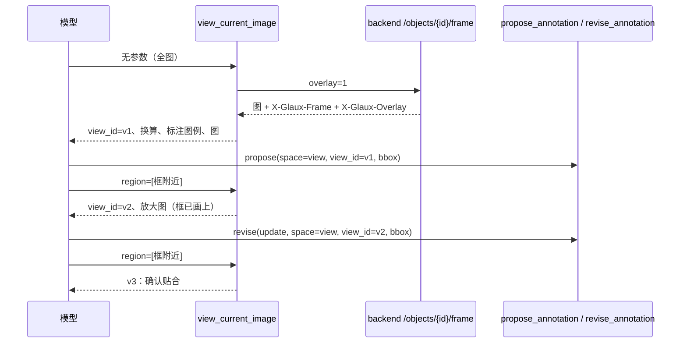

# 22 · 智能体看图：缩放与复核

## 0. 文档状态

| 字段 | 内容 |
| --- | --- |
| 状态 | `ready` |
| 当前阶段 | 规范定稿，可进入实施计划 |
| 来源 | 2026-10-05 维护者要求：智能体像人一样放大、缩小、反复确认，全部在智能体循环内完成 |
| 关联主 SDD | [Glaux SDD 索引](../../README.md) · [SDD 02 智能体图像标注](../02-agent-image-annotation/README.md) · [SDD 04 统一标注工具箱](../04-unified-annotation-toolbox/README.md) · [SDD 15 插件契约与权限引擎](../15-agent-plugins-permissions/README.md) · [SDD 20 提示词随界面语言切换](../20-prompt-language/README.md) |
| 负责人 | Glaux 项目维护者 |
| 最后更新 | 2026-10-05 |

> 状态合法值仅四个：`draft` → `ready` → `implemented` → `accepted`。

## 1. 本 SDD 负责什么

智能体在一次命令内自主地看全图、放大局部、平移、缩回，对照自己或用户画的标注反复确认，并修正自己提出的建议。冻结五件事：

1. **缩放**：`view_current_image` 增加可选区域参数。
2. **视图编号**：每次看图返回 `view_id` 与该图到对象坐标的换算。
3. **叠加标注**：看到的图上默认画出当前对象已有的标注。
4. **按视图画框**：`propose_annotation` 的 `space: "view"` 指明照着哪个视图画的。
5. **修订建议**：新工具 `revise_annotation` 修改或撤回智能体自己尚未被处理的建议。

## 2. 本 SDD 不负责什么

- 让智能体选择看哪个对象、哪一层、哪一帧：仍由查看器决定（SDD 02 原则不变）。
- 移动或缩放用户的查看器视图：看图只返回给模型。
- 自动确认标注：建议态必须由人确认（SDD 02 §2）。
- 修改人画的标注或已确认、已驳回的标注。
- 窗宽窗位等显示参数的选择。

## 3. 当前阶段目标

- 智能体提出一个框后，能放大到框附近，看到框画在图上的样子，判断边缘是否贴合。
- 发现偏差时原地修改那条建议，而不是再留下一条新建议。
- 用户在对话里能看出智能体看了哪里。

## 4. 输入来源

### 4.1 `view_current_image` 参数

| 参数 | 类型 | 说明 |
| --- | --- | --- |
| `region` | `[x0, y0, x1, y1]` 可选 | 对象像素坐标的矩形；缺省为全图 |
| `annotations` | boolean 可选，缺省 `true` | 是否在图上叠加当前对象的标注 |

### 4.2 `propose_annotation` 参数增量

| 参数 | 类型 | 说明 |
| --- | --- | --- |
| `view_id` | string 可选 | `space: "view"` 时坐标所在的视图；缺省为本命令最近一次返回的视图，本命令尚未看图时按全图概览换算 |

### 4.3 `revise_annotation` 参数

| 参数 | 类型 | 说明 |
| --- | --- | --- |
| `annotation_id` | string | 要修订的建议 |
| `action` | `"update"` / `"withdraw"` | 修改或撤回 |
| `space`、`view_id`、`bbox` 或 `polygon` | 同 `propose_annotation` | `update` 时可选，给出则替换几何 |
| `label`、`note` | string 可选 | `update` 时可选 |

## 5. 输出结果

### 5.1 用户可见输出

- 对话中的工具行显示看图区域，例如「查看 1200,900–1800,1350」；缺省显示「查看全图」。
- 修订后的建议在查看器中立即更新几何；撤回的建议立即消失。
- 对话中出现修订卡片：标注名、动作（已修改／已撤回）。

### 5.2 系统输出

- `view_current_image` 结果：文字说明加一张图；`details` 为 `glaux.image_viewed`，增加 `view_id`、`region`、`overlay`。
- `revise_annotation` 结果：`details` 为 `glaux.annotation_revised`（§9.3）。

## 6. 核心流程



## 7. 核心规则

### 7.1 缩放

1. `region` 为对象像素坐标（WSI 为 level-0 像素），必须 `x0 < x1`、`y0 < y1`，并与对象范围有交集；超出部分截到对象边界。
2. 输出最长边 1024 像素；区域小于 1024 像素时按原分辨率返回，不插值放大。
3. 区域面积与输出尺寸的上限沿用 `/objects/{id}/frame`；超限时工具返回文字说明，不报错中断。
4. 看哪个对象、哪个帧或时间点仍取自查看器焦点。
5. WSI 不沿用查看器当前层：runtime 取帧时省略 `level`，由 backend 按区域与输出尺寸选层（SDD 10 §5.2），放大时读到更细的层；视图换算以返回帧的 `ReferenceFrame` 为准。

### 7.2 视图编号与换算

1. 每次成功看图生成 `view_id`（`v1`、`v2`…，本命令内递增），runtime 在本命令内保存其 `ReferenceFrame`；命令结束即丢弃。
2. 结果文字给出：`view_id`、图像尺寸、该图覆盖的对象区域、每个图像像素对应的对象像素数、对象全尺寸。
3. `space: "view"` 的坐标按指定视图的 `ReferenceFrame` 换算为对象坐标；`view_id` 未知时工具返回错误说明，不写入。
4. 换算结果截到对象范围 `[0, 宽] × [0, 高]`：缩小视图的宽高取整后反算会略越过对象边缘，贴图边画的点按图边处理。

### 7.3 叠加标注

1. 叠加当前对象、当前索引上状态为草稿、建议、已确认的标注；已驳回的不画。
2. 建议态虚线，草稿与已确认实线；每条标注旁标图例编号 `A1`、`A2`…。
3. 结果文字列出图例：编号、`annotation_id`、标签、状态、来源。
4. 掩膜标注画外轮廓。
5. `annotations: false` 时返回原始像素，不画任何标注。
6. 叠加只发生在返回给模型的图上，不改变存储与查看器显示。

### 7.4 修订建议

1. 只能修订 `source=agent` 且 `status=suggested` 的标注；其他标注返回拒绝说明，不改动。
2. `update` 按 backend 的 `base_seq` 乐观并发写入；版本冲突时返回说明，由模型重新查看后再决定。
3. `withdraw` 删除该建议。
4. effect 为 `annotate`，与 `propose_annotation` 相同（SDD 15 §7.3）。
5. 修订产物仍是建议态，仍须人工确认。

### 7.5 提示词

1. 视频与图像插件的提示词说明：可以放大复核；提出框后应放大到框附近对照；发现偏差用 `revise_annotation` 修改，不要重复提出。
2. 新增参数与工具提供中英文说明（SDD 20）。

## 8. 涉及对象

### 8.1 backend

| 位置 | 变化 |
| --- | --- |
| `app/routers/objects.py` | `/frame` 增加 `overlay` 参数，返回 `X-Glaux-Overlay` 图例头 |
| `app/frame_overlay.py`（新） | 按 `ReferenceFrame` 把标注画到帧图上 |

### 8.2 agent-runtime

| 位置 | 变化 |
| --- | --- |
| `src/observation/index.ts` | 取帧支持指定区域与叠加 |
| `src/pi/tools/view-image.ts` | `region`、`annotations` 参数，视图编号 |
| `src/pi/tools/view-registry.ts`（新） | 本命令内的视图登记 |
| `src/pi/tools/propose-annotation.ts` | `view_id` |
| `src/pi/tools/revise-annotation.ts`（新） | 修订与撤回 |
| `src/plugins/annotation.ts`、`imaging.ts`、`video.ts` | 挂载与提示词 |

### 8.3 前端

| 位置 | 变化 |
| --- | --- |
| `components/agent/AgentConversation.tsx` | 看图工具行显示区域；修订卡片 |
| `agent/toolBridge`（或等价位置） | 收到 `glaux.annotation_revised` 更新或移除查看器中的建议 |

## 9. 数据或字段要求

### 9.1 `X-Glaux-Overlay`

```json
[{"tag": "A1", "annotation_id": "ann-…", "label": "plaque", "status": "suggested", "source": "agent"}]
```

### 9.2 `glaux.image_viewed` 增量

| 字段 | 类型 | 说明 |
| --- | --- | --- |
| `view_id` | string | 本命令内的视图编号 |
| `region` | `[x0, y0, x1, y1]` 或 null | 对象坐标；null 为全图 |
| `overlay` | integer | 叠加的标注条数 |

### 9.3 `glaux.annotation_revised`

| 字段 | 类型 | 说明 |
| --- | --- | --- |
| `kind` | `"glaux.annotation_revised"` | 固定值 |
| `annotation_id` | string | 被修订的建议 |
| `action` | `"update"` / `"withdraw"` | 动作 |
| `image_id` | string | 对象 |
| `annotation` | object 可选 | `update` 后的标注（与 backend 返回一致） |

## 10. 幂等规则

- 看图无副作用，重复调用得到新的 `view_id`。
- `revise_annotation` 依赖 `base_seq`；同一修订重复提交时第二次因版本冲突被拒。

## 11. 状态或生命周期规则

- 视图登记随命令开始创建、命令结束丢弃，不写入会话。
- 被撤回的建议从 Annotation Store 删除，与用户删除建议的效果相同。

## 12. 审计或事件规则

- 修订与撤回经 SDD 15 的权限判定与审计。
- 看图的区域记录在工具调用参数中，随会话保存。

## 13. 异常和人工处理

| 场景 | 处理 |
| --- | --- |
| 区域与对象无交集或非法 | 返回说明，模型可换区域重试 |
| 区域超过取帧上限 | 返回说明，提示缩小区域 |
| `view_id` 未知 | 返回说明，不写入 |
| 修订他人或已处理的标注 | 返回拒绝说明 |
| 版本冲突 | 返回说明，模型重新查看后再决定 |
| 连接无视觉能力 | 看图工具不挂载（SDD 02 现状） |

## 14. 与其他 SDD 的调用关系

| SDD | 关系 |
| --- | --- |
| [SDD 02](../02-agent-image-annotation/README.md) | 扩展 `view_current_image` 与 `propose_annotation`；建议态与人工确认规则不变 |
| [SDD 04](../04-unified-annotation-toolbox/README.md) | 标注几何与 `base_seq` 并发规则 |
| [SDD 15](../15-agent-plugins-permissions/README.md) | `revise_annotation` 的 effect 与审批 |
| [SDD 19](../19-context-management/README.md) | 上下文裁剪只保留最近若干张图，反复查看不会无限占用上下文 |
| [SDD 20](../20-prompt-language/README.md) | 新参数与新工具的中文说明 |

## 15. 验收标准

### 15.1 缩放与换算

- [x] 指定区域时返回该区域的图，文字中的换算与 `X-Glaux-Frame` 一致（单元测试）。
- [x] 区域非法、无交集、超限时返回说明且不中断命令（单元测试）。
- [x] `space: "view"` 按指定 `view_id` 换算；缺省用最近视图；未知 `view_id` 不写入（集成测试）。

### 15.2 叠加

- [x] 叠加图上画出框、多边形与掩膜轮廓，建议态虚线，图例编号与 `X-Glaux-Overlay` 一致；`overlay=0` 返回原始像素（backend 测试）。
- [x] 已驳回的标注不叠加；其他索引的标注不叠加（backend 测试）。

### 15.3 修订

- [x] 只能修订智能体自己的建议态标注；修改几何、撤回均生效；版本冲突被拒（集成测试）。
- [x] 查看器中的建议随修订即时更新或消失（组件测试与浏览器走查）。

### 15.4 真实模型

- [ ] 支持视觉的真实模型在一次命令内完成「看全图 → 提框 → 放大复核 → 修订 → 再放大确认」，最终框与目标边缘贴合程度经维护者判断优于不放大时（走查）。

### 15.5 工程

- [x] `make test`、`make lint` 通过；SDD 02 的工具约定与操作手册同步更新。

## 16. 决策记录

| 编号 | 决策 | 理由 |
| --- | --- | --- |
| D-1 | 在 `view_current_image` 上加 `region`，不新增看图工具 | 缩放、平移、缩回是同一个动作；一个工具更接近人的操作 |
| D-2 | 看哪个对象、哪个索引仍由查看器决定 | 保留 SDD 02「模型能指定就能指错」的边界，只开放对象内的区域 |
| D-3 | 引入 `view_id` | 放大后画的坐标必须按放大图换算，不能再按全图概览换算 |
| D-4 | 叠加标注默认开启 | 与用户在查看器中看到的一致；判断框是否贴合需要看到框 |
| D-5 | 修订只限智能体自己的未处理建议 | 不越权修改人的标注；人确认过的结果不被改写 |
| D-6 | 小区域按原分辨率返回，不插值放大 | 插值不增加信息，反而可能误导边缘判断 |
| D-7 | WSI 看图由 backend 按输出尺寸选层，不沿用查看器当前层 | 沿用粗层时放大只是裁小图，模型看不到细节；走查中最深一级从 1:16 改善到约 1:2 |

## 17. 待确认问题

无。
