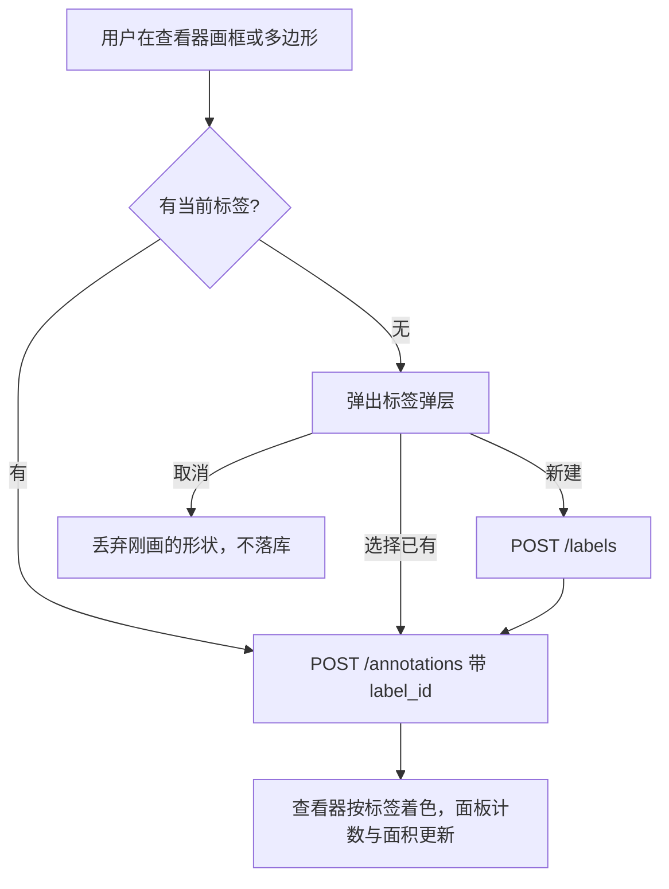
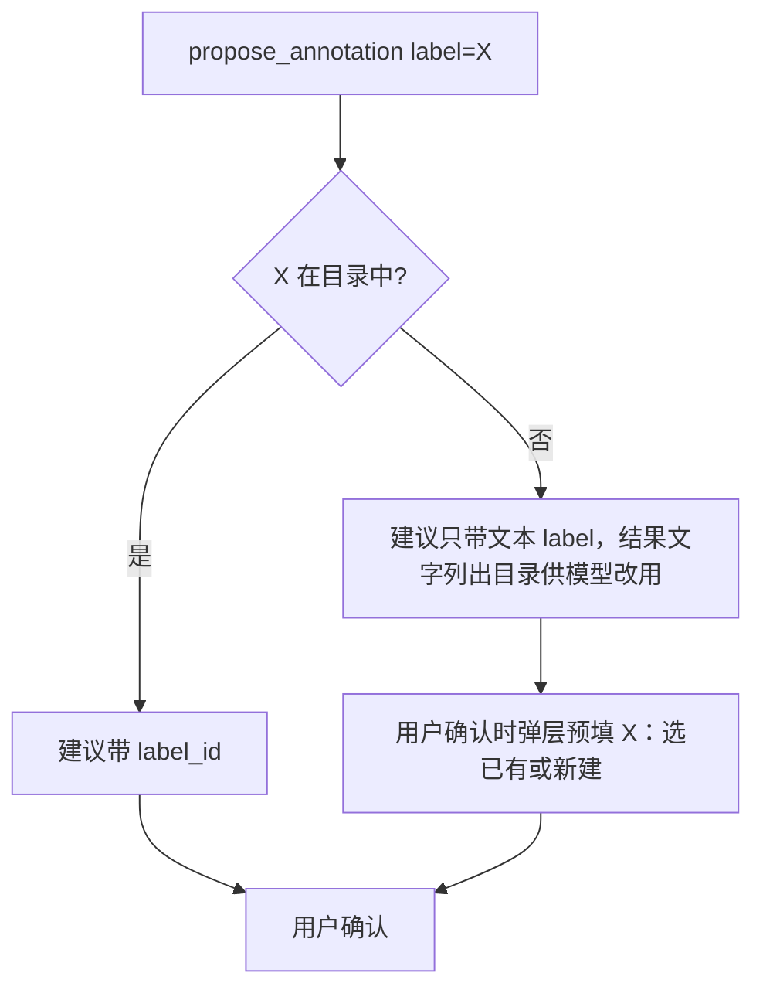

# 23 · 标注标签与管理

## 0. 文档状态

| 字段 | 内容 |
| --- | --- |
| 状态 | `ready` |
| 当前阶段 | 规范定稿，待维护者审阅后进入实施计划 |
| 来源 | 2026-10-06 维护者要求：矩形框与多边形要有标签系统，能管理标注的名称、数量、面积 |
| 关联主 SDD | [Glaux SDD 索引](../../README.md) · [SDD 01 双模式外壳](../01-dual-mode-shell/README.md) · [SDD 02 智能体图像标注](../02-agent-image-annotation/README.md) · [SDD 04 统一标注工具箱](../04-unified-annotation-toolbox/README.md) · [SDD 10 视觉对象与数据源收敛](../10-object-convergence/README.md) · [SDD 13 项目文件夹会话](../13-project-folder-sessions/README.md) · [SDD 22 智能体看图](../22-agent-visual-inspection/README.md) |
| 负责人 | Glaux 项目维护者 |
| 最后更新 | 2026-10-06 |

> 状态合法值仅四个：`draft` → `ready` → `implemented` → `accepted`。

## 1. 本 SDD 负责什么

给框、多边形与二维掩膜标注一套可管理的标签，并提供按标签统计与度量。冻结五件事：

1. **标签目录**：项目级定义标签（名称、颜色、说明），未归属项目的对象共用一份全局目录。
2. **打标签**：画完必须有标签；可在当场新建；画完后可改。
3. **度量**：每条标注给出面积与周长；有空间标定时给物理单位，否则给像素。
4. **标注面板**：列出当前对象的标注，按标签分组计数与汇总面积，支持定位、改标签、删除、确认与驳回建议，并管理目录。
5. **智能体接入**：提建议时按目录匹配标签；新工具 `list_annotations` 读取当前对象的标注与统计。

## 2. 本 SDD 不负责什么

- 跨对象、跨项目的统计汇总与导出（COCO、LabelMe 等）：第二期另立 SDD。
- 任务插件的类别（`ClassSpec`，如 CT 肝、肾，WSI 细胞核）：仍属任务输出，与标签目录分开；导入为目录项留待以后。
- CT 画笔编辑：走 `/objects/{id}/edits`，不是标注（SDD 04 D-13）。
- 标签层级、属性键值、标签快捷键。
- 重叠标注的并集面积：汇总面积是各条标注面积之和。
- 多人协作与审核流。

## 3. 当前阶段目标

- 用户画框或多边形时选定标签，查看器中按标签着色并显示标签名。
- 用户能在面板里看到「每个标签几条、总面积多少」，点一条即定位。
- 智能体提出的建议使用目录里的标签；用户能问智能体「这张图上有几处 X、总面积多少」并得到与面板一致的回答。

## 4. 输入来源

### 4.1 用户操作

| 操作 | 位置 | 说明 |
| --- | --- | --- |
| 选当前标签 | 舞台工具条 | 框、多边形、二维画笔工具激活时出现；新画的标注自动使用当前标签 |
| 画完选标签 | 查看器内的标签弹层 | 没有当前标签时弹出；可搜索、选择或新建 |
| 改标签 | 标签弹层或标注面板 | 选中标注后修改 |
| 管理目录 | 标注面板「标签」分区 | 新建、改名、改颜色、改说明、调整顺序、合并、删除 |

### 4.2 智能体工具参数

| 工具 | 参数 | 说明 |
| --- | --- | --- |
| `propose_annotation` | `label`（已有） | 按目录匹配，规则见 §7.5 |
| `revise_annotation` | `label`（已有） | 同上 |
| `list_annotations`（新） | `scope`：`"current"`（缺省，当前层或帧）或 `"all"`（全部层或帧） | 只读；无焦点时不挂载 |

## 5. 输出结果

### 5.1 用户可见输出

- 查看器：标注描边取标签颜色；建议态仍为虚线；未打标签的标注为灰色；标注旁显示标签名（工具条可关闭）。
- 标注面板：顶部按标签汇总（颜色、名称、条数、面积合计），下方按标签分组列出标注（形状、状态、来源、面积）。
- 对话：`list_annotations` 的结果以文字给模型，不渲染卡片。

### 5.2 系统输出

- backend 新增标签目录端点与标注汇总端点；标注读取结果带 `label_id` 与 `measures`。
- agent-runtime 新增工具 `list_annotations`。

## 6. 核心流程



智能体提建议：



## 7. 核心规则

### 7.1 标签目录

1. 目录按作用域划分：项目内对象用该项目的目录（作用域 = `project_id`）；未归属项目的对象用全局目录（作用域 = `global`）。
2. 对象的作用域由 backend 按「对象 → 数据源 → `project_id`」解析，前端与智能体不传作用域。
3. 标签字段：`id`、`name`、`color`、`description`、`sort`、`seq`。`id` 形如 `lbl-` 加 8 位十六进制，全局唯一，创建后不变。
4. 同一作用域内名称不区分大小写唯一，首尾空白去掉后长度 1～64。
5. 新建时未给颜色则按预设色板依次分配；颜色为 `#RRGGBB`。
6. 改名、改颜色、改说明、改顺序随时可做；标注引用 `label_id`，名称与颜色读取时取目录当前值，不回写标注。
7. 删除：标签仍被非驳回标注引用时拒绝，返回引用条数，提示改用合并。
8. 合并：把 A 的所有标注改为引用 B，然后删除 A；同一事务完成。A 与 B 必须同一作用域。
9. 写操作带 `base_seq`，版本不符返回 409。

### 7.2 打标签

1. 框、多边形、二维掩膜标注可带 `label_id`；点标注不在本 SDD 范围。
2. 用户新画的标注必须有标签：有当前标签时自动使用；没有时弹出标签弹层，取消即丢弃该形状，不落库。
3. 当前标签在会话内按对象作用域记忆；切到另一作用域的对象时清空。
4. `label_id` 必须属于该标注对象的作用域，否则返回 422。
5. 历史标注只有文本 `label`、没有 `label_id` 时，面板归入「未入目录」分组并显示原文本；用户可为其选择标签。
6. 写入带 `label_id` 时，backend 同时把目录名称写入 `label` 字段，供未升级的读取方使用；读取时以目录名称为准。

### 7.3 度量

1. 每条标注读取时附带 `measures`：

| 几何 | 面积 | 周长 |
| --- | --- | --- |
| 框 | `(x1-x0)·(y1-y0)` | `2·(w+h)` |
| 多边形 | 鞋带公式取绝对值 | 闭合边长之和 |
| 掩膜 | 非零像素数 | 不提供 |
| 点 | 不提供 | 不提供 |

2. 坐标为对象像素（WSI 为 level-0 像素）。对象 `x`、`y` 轴都有 `spacing` 且单位相同时，面积乘以 `spacing_x·spacing_y`，周长按两轴间距换算，单位为轴单位及其平方（如 `mm²`、`µm²`）；否则单位为 `px`、`px²`。
3. 前端显示时 `µm²` 达到 10⁶ 换算为 `mm²`；数值保留三位有效数字。
4. 汇总不做并集：同一标签的面积合计为各条面积之和，面板与工具结果都注明这一点。

### 7.4 计数与汇总

1. 汇总按标签分组，含「未入目录」与「未打标签」两组。
2. 每组给出：条数与面积合计（草稿与已确认）、待确认建议条数；已驳回不计。
3. 体数据与视频可按当前层或帧汇总，也可汇总全部层或帧；面板缺省为当前层或帧。
4. 面板汇总与 `list_annotations` 使用同一 backend 汇总端点，数字一致。

### 7.5 智能体接入

1. `propose_annotation`、`revise_annotation` 的 `label` 按目录名称不区分大小写精确匹配；命中则写入 `label_id`。
2. 未命中时照常写入建议，只带文本 `label`；工具结果告诉模型该名称不在目录中，并列出目录名称（最多 50 个）。
3. 智能体不能新建、修改或删除目录项：目录是用户的标注规范。
4. 用户确认一条未入目录的建议时弹出标签弹层，预填该文本；选已有标签或新建后完成确认。
5. `list_annotations` 返回：目录（名称、颜色、条数）、按标签汇总、标注列表（id、标签、状态、来源、形状、外接框、面积）；列表最多 200 条，超出时给总数。effect 为 `read`。
6. 提示词：提建议前若不确定目录，先调 `list_annotations`；优先使用目录中的名称。

### 7.6 标注面板

1. 入口：左侧活动栏新增「标注」，与「文件」共用舞台右侧的浏览器列位置，二者互换；开合语义与「文件」一致（SDD 01 §7 规则 2）。
2. 「标注」分区：汇总条 + 按标签分组的列表；点击一条在查看器中选中并居中，体数据与视频同时跳到该层或帧。
3. 行内操作：改标签、删除（人画的标注）、确认或驳回（建议态）。
4. 「标签」分区：目录列表，支持新建、改名、改色、改说明、拖动排序、合并、删除。删除按钮在有引用时禁用并提示合并。
5. 无焦点对象时面板显示空状态；切换对象时随焦点刷新。

## 8. 涉及对象

### 8.1 backend

| 位置 | 改动 |
| --- | --- |
| `app/annotations/store.py` | 新增 `labels` 表；`annotations` 加 `label_id` 列（迁移，旧行为空）；合并与删除的事务 |
| `app/annotations/measure.py`（新） | 按 §7.3 计算 `measures` |
| `app/routers/annotations.py` | `label_id` 读写与校验；`GET /annotations` 带 `measures`；新增汇总端点 |
| `app/routers/labels.py`（新） | 标签目录端点 |

### 8.2 agent-runtime

| 位置 | 改动 |
| --- | --- |
| `src/pi/tools/list-annotations.ts`（新） | `list_annotations`，含中文定义（SDD 20） |
| `src/pi/tools/propose-annotation.ts`、`revise-annotation.ts` | 结果文字按 §7.5 规则 2 提示目录 |
| `src/plugins/annotation.ts` | 登记 `list_annotations`（effect `read`，需焦点）；提示词 §7.5 规则 6 |

### 8.3 前端

| 位置 | 改动 |
| --- | --- |
| `src/api/` | 标签与汇总接口、类型 |
| `src/store/` | 当前作用域目录、当前标签 |
| `src/annotation/csAnno.ts`、`src/viewer/PyramidViewer.tsx` | 画完走 §7.2 流程；按标签着色与显示名称 |
| 舞台工具条（SDD 04） | 当前标签选择器、显示标签名开关 |
| 标签弹层（新） | 搜索、选择、新建 |
| 标注面板（新） | §7.6 |
| `src/components/agent/SuggestionCard.tsx` | 确认未入目录的建议时走 §7.5 规则 4 |

## 9. 数据或字段要求

### 9.1 `Label`

| 字段 | 类型 | 说明 |
| --- | --- | --- |
| `id` | string | `lbl-` + 8 位十六进制 |
| `scope` | string | `project_id` 或 `global` |
| `name` | string | 1～64 字符，作用域内不区分大小写唯一 |
| `color` | string | `#RRGGBB` |
| `description` | string | 可空，最多 500 字符 |
| `sort` | int | 目录内顺序 |
| `seq` | int | 乐观并发版本 |
| `count` | int | 只读：引用该标签的非驳回标注条数（整个作用域） |

### 9.2 端点

| 方法 | 路径 | 说明 |
| --- | --- | --- |
| GET | `/labels?object_id=` | 解析对象作用域，返回 `{scope, labels}` |
| POST | `/labels` | `{object_id, name, color?, description?}` → 201；重名 409 |
| PATCH | `/labels/{id}` | `{base_seq, name?, color?, description?, sort?}` |
| DELETE | `/labels/{id}?base_seq=` | 有引用时 409，带 `count` |
| POST | `/labels/{id}/merge` | `{base_seq, into}`；跨作用域 422 |
| GET | `/annotations/summary?image_id=&index_from=&index_to=` | §7.4 汇总 |

### 9.3 标注读取增量

```json
{
  "label_id": "lbl-3fa2c1d0",
  "label": "组织折叠",
  "measures": { "area": 9057600.0, "perimeter": 15460.0, "unit": "um", "area_unit": "um2" }
}
```

无标定时 `unit` 为 `px`、`area_unit` 为 `px2`；掩膜无 `perimeter`；点无 `measures`。

### 9.4 汇总

```json
{
  "image_id": "wsi-65d5f76b-2d7070fb",
  "unit": "um", "area_unit": "um2",
  "groups": [
    { "kind": "catalog", "label_id": "lbl-3fa2c1d0", "name": "组织折叠", "color": "#E4572E", "count": 2, "area": 1.2e7, "suggested": 1 },
    { "kind": "uncatalogued", "label_id": null, "name": "主动脉", "color": null, "count": 1, "area": 4.0e5, "suggested": 0 },
    { "kind": "unlabeled", "label_id": null, "name": "", "color": null, "count": 0, "area": 0.0, "suggested": 1 }
  ],
  "total": { "count": 3, "area": 1.24e7, "suggested": 2 }
}
```

`kind`：`catalog` 为目录标签（按目录顺序），`uncatalogued` 为只有文本标签（按文本分组），`unlabeled` 为无标签。只列有标注的分组。

## 10. 幂等规则

- 新建标签按作用域与名称判重：同名再建返回 409 并带已有标签，前端直接选用它。
- 合并已完成后重放：源标签已不存在，返回 404，不改动标注。
- 标注写入沿用 `base_seq`（SDD 04）。

## 11. 状态或生命周期规则

- 标签：创建 → 修改（任意次）→ 删除或被合并。无停用状态。
- 标注状态机不变（SDD 02、04）；本 SDD 只增加 `label_id` 字段。

## 12. 审计或事件规则

- 标签目录的写操作记 backend 日志（作用域、操作、标签 id）。
- 智能体工具调用照常进入运行轨迹（SDD 21）。

## 13. 异常和人工处理

| 情况 | 处理 |
| --- | --- |
| 标签被引用时删除 | 409，面板提示「有 N 条标注使用，可合并到其他标签」 |
| 改名与已有标签重名 | 409，提示改用合并 |
| `label_id` 不属于对象作用域 | 422，不写入 |
| 对象没有 `x`、`y` 间距 | 度量给像素单位，面板单位列显示 `px` |
| 掩膜文件缺失 | 该条 `measures` 为空，面板显示「—」，不影响其他行 |
| 目录版本冲突 | 409，前端重新拉取目录后让用户重试 |

## 14. 与其他 SDD 的调用关系

| SDD | 关系 |
| --- | --- |
| 01 | 左侧活动栏新增「标注」入口，复用舞台浏览器列 |
| 02 | `propose_annotation` 的标签匹配目录；建议确认流程增加选标签 |
| 04 | 工具条增加当前标签；标注数据模型增加 `label_id` |
| 10 | 度量使用 `ObjectMeta.axes` 的 `spacing` 与 `unit` |
| 13 | 作用域取自数据源的 `project_id` |
| 15 | `list_annotations` effect 为 `read` |
| 20 | 新工具提供中文定义 |
| 22 | 叠加图例中的标签名取目录名称 |

## 15. 验收标准

### 15.1 目录

- [ ] 项目与全局作用域互不可见；同名判重不区分大小写（backend 测试）。
- [ ] 改名后已有标注显示新名称；有引用时删除被拒；合并后标注全部改为目标标签（backend 测试）。

### 15.2 打标签

- [ ] 有当前标签时画完即带标签；无当前标签时弹层，取消不落库（组件测试与浏览器走查）。
- [ ] 查看器按标签着色并显示名称；未打标签为灰色（浏览器走查）。

### 15.3 度量与汇总

- [ ] 框、多边形、掩膜面积与周长按 §7.3 计算；有标定时单位正确（backend 测试，含 WSI µm 与普通图像 px）。
- [ ] 汇总按标签分组，草稿与已确认计入，建议单列，驳回不计；按层或帧过滤正确（backend 测试）。
- [ ] 面板数字与 `list_annotations` 一致（集成测试）。

### 15.4 智能体

- [ ] 名称命中目录时建议带 `label_id`；未命中时结果文字列出目录；确认未入目录的建议需选标签（集成测试与组件测试）。
- [ ] 真实模型能用 `list_annotations` 回答「有几处、总面积多少」，与面板一致（走查）。

### 15.5 工程

- [ ] `make test`、`make lint` 通过；SDD 02、04 的数据与工具约定、仓库骨架总览、操作手册同步更新。

## 16. 决策记录

| 编号 | 决策 | 理由 |
| --- | --- | --- |
| D-1 | 目录按项目划分，未归属对象共用全局目录 | 标注规范通常随项目；全局目录让未归属对象也能打标签 |
| D-2 | 标签目录与任务 `ClassSpec` 分开 | 任务类别属于模型输出，目录属于用户的标注规范，生命周期不同 |
| D-3 | 新画的标注必须有标签，允许当场新建 | 避免同一类被写成多种文本，同时不打断绘制 |
| D-4 | 标注引用 `label_id`，名称与颜色读取时取目录 | 改名、改色不需要批量改写标注 |
| D-5 | 有引用的标签不能删除，用合并整理 | 删除不会让标注悄悄变成无标签 |
| D-6 | 度量由 backend 计算 | 面板与智能体使用同一结果 |
| D-7 | 汇总面积不做并集 | 并集计算对多边形与掩膜代价高，且多数场景标注不重叠；在界面注明 |
| D-8 | 智能体只能使用目录，不能修改目录 | 目录是用户制定的规范；未入目录的名称由用户在确认时决定 |
| D-9 | 目录存 backend 的标注库，不写入项目目录 | 标注本身存在标注库，放在一起才能在同一事务里完成合并与引用检查 |

## 17. 待确认问题

无。
