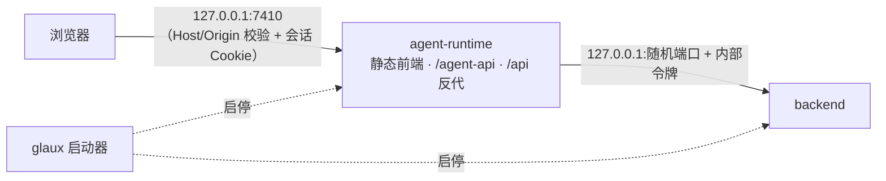
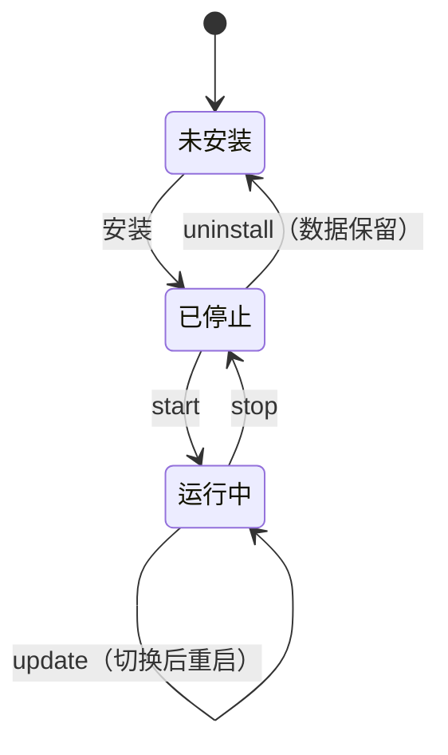

# 24 · 完整版分发与一键安装

## 0. 文档状态

| 字段 | 内容 |
| --- | --- |
| 状态 | `implemented` |
| 当前阶段 | `v0.3.1` 已发布，含 Windows 图形安装与精简桌面控制面板；四平台自动流水线与安装冒烟通过；维护者现有 D 盘安装已补装桌面入口，人工界面交互验收待补 |
| 来源 | 2026-10-08 维护者决定进入上线准备：更新落地页，提供下载与一键安装脚本；仓库公开，托管走 GitHub，不用自定义域名；三平台原生；落地页中英双语；首个公开版本 `0.3.0` |
| 关联主 SDD | [Glaux SDD 索引](../../README.md) · [SDD 01 版本与发布治理](../../01-version-release-governance.md) · [SDD 09 基本对话 Docker 发行包](../09-chat-distribution/README.md)（由本 SDD 取代） · [SDD 13 项目文件夹会话](../13-project-folder-sessions/README.md) · [SDD 16 智能体基础工具](../16-agent-basic-tools/README.md) |
| 负责人 | Glaux 项目维护者 |
| 最后更新 | 2026-10-09 |

> 状态合法值仅四个：`draft` → `ready` → `implemented` → `accepted`。

## 1. 本 SDD 负责什么

让用户在自己的电脑上，从落地页复制一条命令装好并运行 Glaux 完整版。冻结六件事：

1. **生产运行模式**：单端口入口，agent-runtime 提供前端静态文件并反代 backend，替代开发态的 Vite 代理。
2. **本机安全**：`Host` / `Origin` 校验、启动令牌、backend 内部令牌。
3. **启动器**：跨平台 `glaux` 命令，负责启停、状态、更新、卸载、自检。
4. **打包与发布**：GitHub Actions 测试 Windows、macOS Intel、macOS Apple silicon、Linux，打标签后构建通用程序包并发布到 GitHub Releases。
5. **安装脚本**：`install.sh`（macOS、Linux）与 `install.ps1`（Windows 原生）。
6. **落地页**：中英双语重做，含下载与安装区，经 GitHub Pages 发布。

## 2. 本 SDD 不负责什么

- 公网托管、多用户、账号体系：Glaux 只做本地应用（维护者 2026-10-04 决定）。
- 重模型安装：TotalSegmentator、StarDist-HE、caroSegDeep、HC-CSM、SAM 不进第一版安装包，按需下载另立 SDD；本 SDD 只要求缺模型时给出明确提示。
- 桌面外壳（Tauri、Electron）、系统安装器（`.msi`、`.dmg`、`.deb`）、代码签名与公证。
- 国内下载镜像站（Cloudflare R2 等）：第一版只提供下载地址覆盖变量。
- 使用统计与遥测：第一版不采集。
- 移除 `chat` 发行模式的代码：另行处理；本 SDD 只退役 Docker 发行物。

## 3. 当前阶段目标

- 三平台（Windows 10/11 x64、macOS 13+ arm64/x64、Ubuntu 22.04+ x64）各用一条命令完成安装，装完自动打开浏览器进入 Glaux。
- 不需要预装 Docker、Python 或 Node；Windows 另需 Git for Windows（提供 `bash`）。
- 升级保留会话、上传、图谱、标注与个人设置。
- 恶意网页无法借本机服务执行工具。
- 落地页如实展示当前能力，访客能在首屏找到下载入口。

## 4. 输入来源

### 4.1 用户操作

- 在落地页复制安装命令并在终端执行。
- 运行 `glaux start | stop | status | open | update | uninstall | doctor | logs`，或点桌面 / 开始菜单入口。

### 4.2 安装脚本环境变量

| 变量 | 缺省 | 含义 |
| --- | --- | --- |
| `GLAUX_VERSION` | 最新发布 | 安装指定版本 |
| `GLAUX_INSTALL_DIR` | 见 §9.1 | 程序目录 |
| `GLAUX_HOME` | `~/.glaux`（Windows `%USERPROFILE%\.glaux`） | 数据目录，沿用 agent-runtime 现有含义 |
| `GLAUX_DOWNLOAD_BASE` | GitHub Releases 地址 | 程序包下载地址前缀 |
| `GLAUX_MIRROR` | `auto` | `auto` / `cn` / `none`；`cn` 时 PyPI、Python、Node 走国内镜像 |
| `GLAUX_NO_BROWSER` | `0` | `1` 时装完不打开浏览器 |

### 4.3 发布输入

- 维护者推送 `vX.Y.Z` 标签（SDD 01 R5～R7）；`VERSION` 与 CHANGELOG 已更新。

## 5. 输出结果

### 5.1 用户可见输出

- 程序目录、数据目录、`glaux` 命令、桌面 / 开始菜单入口。
- 浏览器打开 `http://127.0.0.1:<端口>/`。
- 落地页：`https://zhentai-sn.github.io/open-glaux/`（英文）与 `/zh/`（中文）。

### 5.2 系统输出

- GitHub Release：`glaux-<版本>.tar.gz`、`glaux-<版本>.zip`、`SHA256SUMS`、发布说明（取自 CHANGELOG）。
- Pages 站点：落地页、`install.sh`、`install.ps1`、`latest.json`（最新版本号与包的 SHA256）。

## 6. 核心流程


运行时拓扑：



## 7. 核心规则

### 7.1 生产运行模式

1. `GLAUX_SERVE_STATIC=<目录>` 时，agent-runtime 在同一端口提供前端构建产物：非 `/agent-api`、`/api` 的 GET 请求返回静态文件，未命中时返回 `index.html`。
2. `/api/*` 去掉 `/api` 前缀后反代到 `GLAUX_BACKEND_URL`，行为与 Vite 开发代理一致；请求体按流转发，不受 runtime 的 JSON 请求体上限约束；上游超时放宽到 30 分钟，容纳重模型任务。
3. CSP 沿用前端构建产物中的 meta（含 `media-src 'self' blob:`）；`frame-ancestors` 在 meta 中无效，与 `X-Frame-Options: DENY`、`X-Content-Type-Options: nosniff` 一起由静态响应头下发。带哈希的 `/assets/*` 长期缓存，其余 `no-cache`。
4. 开发态（`make dev`）行为不变。
5. 源码目录可用 `make start` / `make stop` 以生产模式运行，数据写入 `GLAUX_HOME`，与开发态数据分开。

### 7.2 本机安全

1. 两个进程只监听 `127.0.0.1`；设置 `GLAUX_SERVE_STATIC` 或 `GLAUX_SESSION_TOKEN` 时拒绝 `GLAUX_AGENT_HOST=0.0.0.0`。
2. **Host 校验**：agent-runtime 只接受 `Host` 为 `127.0.0.1`、`localhost`、`[::1]` 加监听端口的请求，其余返回 421；开发态同样生效（Vite 代理改写 Host 为监听端口）。backend 只校验主机名为回环名（另放行 `TestClient` 的 `testserver`）。
3. **Origin 校验**：请求带 `Origin` 时，主机必须是回环名，否则返回 403；不带 `Origin` 的请求来自非浏览器客户端（评测脚本、`curl`），放行。
4. **会话令牌**（仅生产模式）：启动器生成 32 字节随机令牌，保存在 `run/session.token`，跨重启沿用；打开 `/?token=<令牌>` 时 agent-runtime 下发 `HttpOnly; SameSite=Strict; Path=/` 的 Cookie `glaux_session`，并 303 重定向到 `/`。`/agent-api`、`/api` 要求该 Cookie 或请求头 `X-Glaux-Token`，否则返回 401（`/agent-api/v1/health` 除外）；无令牌的页面导航返回提示页，告诉用户运行 `glaux open`。
5. **内部令牌**：启动器每次启动为 backend 生成内部令牌（`GLAUX_BACKEND_TOKEN`），backend 除 `/health` 外要求请求头 `X-Glaux-Internal` 匹配。agent-runtime 的反代与工具调用都带上：工具调用经启动时包装的全局 `fetch`，只对 backend 同源的请求补令牌。反代转发前去掉会话 Cookie 与 `X-Glaux-Token`。浏览器不能直接访问 backend 端口。
6. 令牌只在进程环境与 `0600` 权限的文件中保存，不写日志。

### 7.3 启动器

1. 用 Node 编写（`launcher/glaux.mjs`），由便携 Node 运行；`glaux` 是调用它的 sh / cmd 薄壳。
2. `start`：检查端口 → 启动 backend（Python 环境，随机空闲端口）→ 启动 agent-runtime（固定端口，缺省 `7410`，`GLAUX_PORT` 可改）→ 等两个 `/health` 就绪（120 秒超时）→ 打开浏览器。已在运行时只执行 `open`。
3. 端口被占用时报错并提示 `GLAUX_PORT`，不自动换端口（前端本地存储按源区分，换端口会丢失界面状态）。
4. 两个子进程后台运行，日志写 `GLAUX_HOME/logs/`，按大小滚动；关闭浏览器不停止服务。
5. `stop`：先发终止信号，10 秒后强制结束；Windows 用进程树结束。
6. `status` 输出版本、端口、PID、健康状态；`doctor` 检查 Node、Python 环境、`bash`、PyAV、端口、磁盘与目录权限，逐项输出通过或修复建议。
7. `update`：读取 `latest.json`，版本更新时执行与安装相同的下载、校验、`uv sync`，成功后切换 `current` 并重启；失败时保留旧版本。保留最近两个版本。
8. `uninstall`：删除程序目录与 `glaux` 命令、快捷方式；数据目录默认保留，`--purge` 且二次确认后才删除。

### 7.4 Windows 原生

1. `bash` 工具依赖 Git for Windows 的 `bash.exe`：安装脚本检测，缺失时提示用 `winget install Git.Git` 安装并给出下载链接；`doctor` 同样检查。agent-runtime 启动时解析 `bash` 路径，找不到时该工具返回明确错误，其余工具可用。
2. 隔离模型的解释器路径按平台取 `.venv/bin/python` 或 `.venv\Scripts\python.exe`（backend `config.py`）。
3. 路径处理统一使用平台 API，不拼接 `/`；数据库、日志路径支持含空格与非 ASCII 字符的用户目录。
4. 子进程启停、信号与端口检测按 §7.3 在 Windows 上单独实现并测试。
5. Skills 与提示词模板加载时，执行环境向 Pi 的目录扫描器提供 `/` 分隔的路径，避免其 POSIX 路径计算误读 Windows 盘符；返回应用的技能与诊断路径仍使用平台原生格式。扫描条目的文件名按平台路径规则提取。
6. 原生 Windows 的目录选择与项目创建接受盘符绝对路径；WSL 仍将盘符转换为 `/mnt/<盘符>`，Linux/macOS 不接受盘符路径。
7. 数据源与项目清单 `sources.json` 固定用 UTF-8 读写，避免 Windows 系统代码页无法保存中文名称。

### 7.4.1 Windows 图形安装与桌面控制

1. 提供可双击的 `Glaux-Setup.exe`，使用 Windows 自带 .NET Framework 与 Windows Forms，不需要用户预装 Node/Python、输入命令或管理员权限。中英文随系统界面语言选择。
2. 安装窗口显示程序目录、数据目录、目录选择按钮与目标盘实际可用空间。数据目录须位于程序目录之外，普通卸载不得删除它。空间不足时在窗口内说明实际值和最低 3 GiB 要求，允许修改目录重试。
3. 安装在后台子进程执行，窗口显示阶段、下载字节进度与日志；失败可重试，进行中禁止重复提交和直接关闭窗口。
4. 用户选 D 盘时，安装临时目录及依赖缓存放到该安装目录所在盘，不固定使用 C 盘。
5. 安装完成创建当前用户桌面与开始菜单 `Glaux.lnk`。图标打开控制窗口，显示运行状态，提供启动、打开浏览器、停止、日志目录与卸载按钮。控制窗口关闭后后台服务保持运行。运行面板默认紧凑：状态与打开/启动为主操作，目录信息、日志记录和卸载为次级入口；目录与日志按需展开，操作失败时展开日志。
6. 控制窗口通过便携 Node 和已有启动器执行命令，隐藏命令行窗口；操作期间按钮禁用，成功或失败在窗口内反馈。卸载需确认，默认保留用户数据。
7. `install.json` 在程序目录持久保存 `home`。显式 `GLAUX_HOME` 优先，其次安装记录，最后用户默认目录；新终端和桌面入口使用相同的数据目录。桌面入口直接绑定安装目录，不依赖当前终端 PATH。
8. PowerShell 一键安装完成后，将 `bin` 同时加入用户 PATH 和当前进程 PATH，当前窗口即可调用 `glaux`。
9. 桌面、开始菜单、控制窗口与安装 EXE 统一使用前端 `OwlLogo.tsx` 的小鸮标识，蓝色圆角底配浅色轮廓；Windows ICO 包含 16–256 px 多尺寸图层，安装时复制到程序目录 `bin`。
10. Windows 安装 EXE 内嵌同版本安装脚本、图标资源和控制窗口源码。发布工作流编译 EXE、生成独立 SHA256 校验文件；落地页 Windows 页签提供下载按钮，仍保留命令行安装方式。

### 7.5 打包

1. 程序包与平台无关：前端构建产物、agent-runtime 的 `dist/`、生产依赖 `node_modules`（agent-runtime 运行期无原生扩展，SQLite 用 `node:sqlite`）、内置技能与子智能体定义、backend 与 science-core 源码及 `uv.lock`、`data/natural` 示例、启动器、`VERSION`、`LICENSE`、`NOTICE`。
2. 目录布局与仓库子集一致，backend 与 agent-runtime 按现有相对路径定位 science-core 与示例数据。
3. Python 依赖在用户机器上由 `uv sync --frozen` 安装（含 `video` 可选依赖），wheel 按平台解析；不在用户机器上编译。Intel macOS 使用 LanceDB 0.25.3（最后提供 macOS x64 wheel 的版本），其他平台使用当前兼容版本。
4. 前端以 `full` 版构建，`VITE_GLAUX_WORKBENCH` 取发布时的约定值。
5. 不打包：开发依赖、测试、`docs/`、`.glaux/`、模型权重、`data/` 下除示例外的数据。

### 7.6 CI 与发布

1. `ci.yml`：每次推送与 PR 在 ubuntu、macos、windows 上运行 `make test` 的等价步骤与 `make lint`。
2. `release.yml`：支持手动预检（不创建 Release）；`v*` 标签触发 → 校验标签与 `VERSION` 一致 → 构建程序包 → 在 Windows、Linux、macOS Intel 与 Apple silicon 虚拟机上执行安装脚本（指向本次构建的包）并做冒烟测试 → 创建 Release、上传产物与 `SHA256SUMS` → 显式派发 `pages.yml` 更新 `latest.json`。使用 `GITHUB_TOKEN` 创建的 Release 不会触发另一个工作流的 `release` 事件，故采用 `workflow_dispatch`。
3. 冒烟测试：重复安装 → `glaux start` → 健康检查与令牌拒绝检查 → 上传示例图片 → 经本机 manifest 执行 `glaux update` → 验证版本切换、服务重启、上传源与数据保留 → `status / doctor / stop / uninstall --purge`。更新测试使用当前包的隔离副本作为旧版本快照，不等同于旧数据库格式迁移验收；不调用真实模型。
4. 推送与打标签由维护者执行；CI 不保存任何模型密钥。
5. `release.yml` 支持 `workflow_dispatch` 预检：执行同一套构建与安装更新冒烟，成功后不创建 Release；正式发布仅由版本标签推送触发。

### 7.7 安装脚本

1. 可重复执行：已完成的步骤跳过；失败时输出失败步骤、日志路径与重试命令，并以非零码退出。
2. 先检查操作系统、CPU 架构、可用磁盘 ≥ 3 GB；不满足时退出并说明原因。
3. 下载后核对 `SHA256SUMS`，不一致则删除并退出。
4. `uv` 与 Node 安装到程序目录的 `runtime/`，不修改系统级 Python、Node 或全局 PATH 中已有条目；只把 `glaux` 命令所在目录加入用户 PATH。
5. `GLAUX_MIRROR=auto` 时，访问 GitHub 超时则切换到 `cn`：PyPI、uv 的 Python 下载、Node 下载改用国内镜像。
6. 脚本开头用注释列出它会做的全部事情；落地页同时提供脚本源码链接。
7. 不需要管理员权限，不使用 `sudo`。

### 7.8 首次使用

1. 无模型连接时，对话区显示配置引导，链接到连接设置；配置完成后可直接打开内置示例图片提问。
2. 调用未安装的重模型任务时，返回「该模型未安装」及安装说明链接，不报栈信息。

### 7.9 落地页

1. 静态 HTML，中文 `docs/landing/zh/index.html`、英文 `docs/landing/index.html`，互相切换并声明 `hreflang`；内容一一对应。
2. 结构：首屏（定位一句话、产品截图、下载按钮）→ 亮点功能（视频音画问答与证据回放、智能体标注与复核、技能与子智能体、运行轨迹与图谱，各配真实截图）→ 安装（按访客系统默认选中对应页签，命令一键复制，附脚本源码与 SHA256）→ 本地运行说明（数据不离开本机、模型自带、密钥只存本机）→ 环境四要素（压缩为一节）→ 常见问题（系统要求、费用、隐私、卸载）→ 页脚。
3. 删除「对话预览版」「Docker」相关表述；内部进程划分移到文档，不放首页。
4. 图片使用 WebP，单张 ≤ 300 KB；中文页面使用中文界面截图，英文页面使用英文界面截图，均采用应用的亮色主题。医学示例图须为可公开展示的许可，否则替换。
5. 不加载第三方统计脚本；字体使用系统字体，样式随站点分发。
6. 经 `pages.yml` 发布 `docs/landing` 与安装脚本到 GitHub Pages。
7. 页面采用白底、清晰的文字层级和细分隔线；不使用装饰性渐变、胶囊标签、勾选图标与页尾重复安装横幅。

### 7.10 公开前检查

1. 用 gitleaks 扫描全部 git 历史，发现的密钥一律作废并轮换，必要时改写历史。
2. 清点入库的数据、图片与权重，逐项确认许可；无权分发的移出仓库。
3. README 中英版本更新为安装方式与当前能力。

## 8. 涉及对象

### 8.1 agent-runtime

- `config.ts`：`GLAUX_SERVE_STATIC`、`GLAUX_SESSION_TOKEN`；`index.ts` 读 `GLAUX_BACKEND_TOKEN` 并包装全局 `fetch`。
- `security/local-access.ts`：Host / Origin / 会话令牌校验；`transport/frontend.ts`：静态文件与 `/api` 反代；`security/backend-auth.ts`：backend 内部令牌。
- `bash` 工具：Windows 下解析 Git Bash 路径。

### 8.2 backend

- `local_access.py`：Host 校验与内部令牌（ASGI 中间件，除 `/health`）。
- `config.py`：隔离模型解释器路径按平台；`GLAUX_MODELS_ROOT` 统一重模型目录。
- 缺模型时的错误码与提示。

### 8.3 前端

- 无连接时的配置引导：复用现有「尚未配置模型连接」提示。
- 「请运行 `glaux open`」提示页由 agent-runtime 直接返回，前端不改。

### 8.4 新增

- `launcher/`：`glaux.mjs`、`glaux`、`glaux.cmd`。
- `scripts/release/`：`build-package.mjs`、`install.sh`、`install.ps1`。
- `.github/workflows/`：`ci.yml`、`release.yml`、`pages.yml`。
- `docs/landing/`：中英两版。
- `NOTICE`。

### 8.5 退役

- `compose.yaml`、`docker/`、`.dockerignore`、`scripts/release/package.py`、`scripts/release/launcher/`、runbook `chat-distribution*.md`；SDD 09 标记为被本 SDD 取代。

## 9. 数据或字段要求

### 9.1 目录

| 平台 | 程序目录（`GLAUX_INSTALL_DIR`） | 命令目录 |
| --- | --- | --- |
| Linux | `~/.local/share/glaux` | `~/.local/bin` |
| macOS | `~/Library/Application Support/Glaux` | `~/.local/bin` |
| Windows | `%LOCALAPPDATA%\Programs\Glaux` | `<程序目录>\bin` |

程序目录：

```
<程序目录>/
├── versions/<版本号>/     # 程序包解压内容 + .venv
├── current -> versions/<版本号>   # Windows 用目录联接
├── runtime/{uv,node}/
└── bin/                   # glaux、glaux.cmd（Linux/macOS 另在命令目录建链接）
```

数据目录 `GLAUX_HOME`：

| 子目录 | 对应现有变量 |
| --- | --- |
| `agent/` | `GLAUX_AGENT_DATA_DIR` |
| `datasets/` | `GLAUX_DATASETS_ROOT`（含 `sources.json`、上传） |
| `atlas/` | `GLAUX_ATLAS_ROOT` |
| `models/` | `GLAUX_MODELS_ROOT`：各重模型 `*_ROOT` 与缓存的父目录 |
| `skills/`、`prompts/`、`settings.json` 等 | 个人资源，沿用现有位置 |
| `logs/`、`run/` | 启动器日志与状态文件 |

启动器为子进程设置上表变量；源码开发态不受影响。

### 9.2 `latest.json`

```json
{ "version": "0.3.0", "tag": "v0.3.0", "published_at": "2026-10-20",
  "assets": { "tar.gz": { "url": "...", "sha256": "..." }, "zip": { "url": "...", "sha256": "..." } } }
```

### 9.3 状态文件 `GLAUX_HOME/run/state.json`

`{ version, port, backend_port, agent_pid, backend_pid, started_at }`；会话令牌另存 `run/session.token`，权限 `0600`；backend 内部令牌只在进程环境中。

## 10. 幂等规则

- 重复执行安装脚本：同版本时只补缺失步骤；不同版本时等同 `update`。
- 重复 `start` 不重复启动；`stop` 在未运行时返回成功。
- `update` 中断后再次执行可继续；`current` 只在新版本 `uv sync` 与健康检查都通过后切换。

## 11. 状态或生命周期规则



## 12. 审计或事件规则

- 启动器记录启动、停止、更新、失败原因到 `logs/launcher.log`。
- 日志与状态文件不含令牌、模型密钥、请求体。

## 13. 异常和人工处理

| 异常 | 处理 |
| --- | --- |
| 端口占用 | 报出占用端口，提示 `GLAUX_PORT=<端口> glaux start` |
| 健康检查超时 | 输出两个进程最后 50 行日志与 `glaux doctor` 建议 |
| Windows 无 Git Bash | 安装继续；提示安装 Git；`bash` 工具不可用 |
| SHA256 不一致 | 删除下载文件并退出，提示检查网络或镜像 |
| `uv sync` 失败 | 保留旧版本，输出失败的包与镜像建议 |
| 浏览器无会话 Cookie | 页面提示运行 `glaux open` |
| 数据库版本高于程序（降级） | 拒绝启动，提示安装更新版本 |

## 14. 与其他 SDD 的调用关系

| SDD | 关系 |
| --- | --- |
| 01 | 版本号、标签与 CHANGELOG 由其约束；本 SDD 增加标签触发的构建与发布 |
| 09 | 被本 SDD 取代，Docker 发行物退役 |
| 13 | `/fs`、`/projects` 的回环守卫保留，生产模式下经反代访问 |
| 16 | `bash` 工具在 Windows 依赖 Git Bash |
| 11 | 视频依赖 PyAV wheel，安装时一并安装 |

## 15. 验收标准

### 15.1 生产模式与安全

- [ ] `make start` 单端口运行完整版，对话、看图、视频上传、图谱、标注均可用（浏览器走查）。
- [x] `Host: evil.example` 请求返回 421；跨源 POST 被拒；无 Cookie 的 API 请求返回 401；直接访问 backend 端口无内部令牌返回 401（集成测试与四平台安装冒烟）。
- [ ] 错误的 `?token=` 返回提示页；反代不把会话 Cookie 与令牌头转发给 backend（集成测试）。

### 15.2 安装与启动器

- [ ] Windows 11、macOS Intel、macOS Apple silicon、Ubuntu 22.04 干净虚拟机各用一条命令安装成功并自动打开浏览器（CI 冒烟 + 人工各一次）。
- [ ] 重复执行安装脚本不报错；断网中断后重跑可完成。
- [ ] `start / stop / status / open / doctor / logs` 在三平台行为一致。
- [ ] 安装旧版本 → 产生会话、上传、标注 → `glaux update` → 数据完整、界面状态保留。
- [ ] `uninstall` 后数据目录仍在；`--purge` 后全部清除。
- [ ] Windows 上 `bash` 工具在有 Git Bash 时可用，无 Git Bash 时返回明确错误。
- [ ] 用户目录含空格与中文时三平台均可安装运行。

### 15.2.1 Windows 桌面扩展

- [ ] 双击安装 EXE 可选择程序和数据目录，并显示目标盘实际剩余空间。
- [ ] 空间不足后可改选 D 盘，安装临时文件与依赖缓存不再固定落到 C 盘。
- [ ] 安装窗口保持响应，显示阶段、下载进度与错误，可重试。
- [x] 桌面与开始菜单存在 Glaux 图标，双击打开控制窗口；维护者现有 `D:\App\Glaux` 已补装，数据目录为 `D:\App\GlauxData`。
- [ ] 控制窗口能启动、打开、停止和卸载 Glaux；关闭窗口不停止后台服务。
- [ ] 新终端使用安装时指定的数据目录；PowerShell 安装后的当前窗口能直接调用 glaux。

### 15.3 发布

- [x] 推送 `v*` 标签后 Release 自动生成，含两个包、`SHA256SUMS` 与发布说明；`latest.json` 同步更新。`v0.3.1` 的 GitHub 资产摘要、`SHA256SUMS` 与公开清单一致；公开安装脚本与仓库源码一致。
- [ ] 标签与 `VERSION` 不一致时发布失败。

当前发布证据：[四平台 CI](https://github.com/zhentai-sn/open-glaux/actions/runs/37878237873)、[正式 Release 流程](https://github.com/zhentai-sn/open-glaux/actions/runs/37878856653)、[Pages 部署](https://github.com/zhentai-sn/open-glaux/actions/runs/37879045404)、[v0.3.1 Release](https://github.com/zhentai-sn/open-glaux/releases/tag/v0.3.1)。`Glaux-Setup.exe` 的 GitHub 资产摘要、`WINDOWS-SHA256SUMS` 与公开清单一致，公开下载返回 200。自动冒烟覆盖 Ubuntu 22.04、Windows Server 2022、macOS 14 arm64 与 macOS 15 Intel；不替代 Windows 11、最低支持 macOS 版本、图形按钮交互及带真实旧数据的人工验收。

### 15.4 落地页

- [x] 中英两版内容一致，可互相切换；390 px 手机宽度无横向滚动，明暗系统主题下均显示正常。
- [ ] 安装区按访客系统默认选中页签，复制的命令可直接运行。
- [x] 页面无「对话预览版」「Docker」表述；中英两版分别使用当前版本的中文、英文亮色截图。
- [x] 首页总传输量 ≤ 2 MB（英文约 353 KiB，中文约 307 KiB，含样式与四张去重截图）。

### 15.5 公开前

- [x] gitleaks 扫描全部历史；5 条 `generic-api-key` 命中均为 `glaux.accent.v1` / `glaux.recent.v1`、`v2` 本地存储键，已用精确路径与字符串白名单排除；复扫无未处理发现。
- [x] 入库资产许可清点：`data/natural/README.md` 记录 3 张 CC0 1.0 照片与 1 张美国联邦政府作品；CT、WSI 样本和模型权重未入 Git；首页截图使用当前亮色中英文界面及这四张示例照片，单张均小于 300 KB，来源见 `docs/landing/assets/screenshots/README.md`。未标明来源的旧首页图片已移除。

## 16. 决策记录

| 编号 | 决策 | 理由 |
| --- | --- | --- |
| D-1 | 本地应用，不做账号体系 | 维护者决定；数据留在本机，模型由用户自带 |
| D-2 | 一键脚本安装，不用 Docker、桌面外壳或系统安装器 | 不需要预装运行环境；脚本经终端下载不触发 Gatekeeper 隔离与 SmartScreen，第一版免签名 |
| D-3 | 程序包与平台无关，Python 依赖在用户机器由 `uv sync --frozen` 安装 | 一个包覆盖三平台；锁文件保证依赖一致；全部为预编译 wheel |
| D-4 | agent-runtime 兼任单端口入口 | 已是对外进程；少一个进程，浏览器只面对一个源 |
| D-5 | Host、Origin、会话令牌、内部令牌四层校验 | Host 防 DNS 重绑定，Origin 防跨站请求，令牌防本机其他用户与进程；`bash` 工具使本机服务的风险等同远程执行 |
| D-14 | 会话令牌跨重启沿用，不做一次性令牌；缺 `Origin` 的请求放行 | 一次性令牌需要启动器与 runtime 之间另设通道，收益只是不在浏览器历史中留下令牌（Jupyter 同做法）；浏览器发出的写请求必带 `Origin`，评测脚本等本机客户端不带 |
| D-15 | backend 内部令牌经包装全局 `fetch` 注入 | runtime 访问 backend 的调用点分散在十余个工具，集中注入避免逐个改动与遗漏 |
| D-6 | 启动器用 Node 编写 | Node 已随包分发，三平台一套代码；安装脚本只负责引导 |
| D-7 | 固定端口，占用时报错 | 前端本地存储按源区分，换端口会丢失界面状态 |
| D-8 | 程序与数据分目录，版本目录 + `current` 切换 | 升级可回退，卸载默认不删数据 |
| D-9 | Windows 原生，`bash` 依赖 Git for Windows | 维护者决定三平台原生；Git Bash 普及率高，避免为 Windows 另写一套 shell 工具与只读命令判定 |
| D-10 | 托管在 GitHub：Releases 放程序包，Pages 放落地页与脚本 | 仓库公开；项目站不占用户站名额；Releases 公开仓库不限流量 |
| D-11 | 第一版不带重模型、不做遥测、不建国内镜像站 | 控制范围；`GLAUX_MIRROR` 与 `GLAUX_DOWNLOAD_BASE` 留出后续扩展 |
| D-12 | Docker 发行物退役，SDD 09 由本 SDD 取代 | chat 版已不维护（2026-09-25） |
| D-13 | 首个公开版本 `0.3.0`，不用自定义域名 | `0.2.0` 写入 CHANGELOG 后未打标签，内容已大幅超出；GitHub Pages 项目站地址足够 |
| D-16 | Intel macOS 固定使用 LanceDB 0.25.3，其余平台使用 `lancedb>=0.37` | 当前 LanceDB 不再发布 Intel macOS wheel；0.25.3 是仍提供 macOS x64 wheel 的最后版本。Atlas 兼容新旧列表与全文索引 API，同时保留预编译安装 |

## 17. 待确认问题

无。
